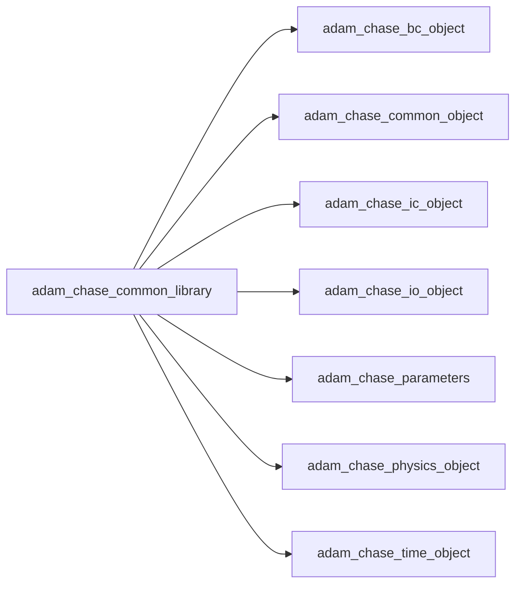

# adam_chase_common_library

> ADAM CHASE common library, entry for all common CPU classes and libraries.

**Source**: `src/app/chase/common/adam_chase_common_library.F90`

**Dependencies**

```mermaid
graph LR
  adam_chase_common_library["adam_chase_common_library"] --> adam_chase_bc_object["adam_chase_bc_object"]
  adam_chase_common_library["adam_chase_common_library"] --> adam_chase_common_object["adam_chase_common_object"]
  adam_chase_common_library["adam_chase_common_library"] --> adam_chase_ic_object["adam_chase_ic_object"]
  adam_chase_common_library["adam_chase_common_library"] --> adam_chase_io_object["adam_chase_io_object"]
  adam_chase_common_library["adam_chase_common_library"] --> adam_chase_parameters["adam_chase_parameters"]
  adam_chase_common_library["adam_chase_common_library"] --> adam_chase_physics_object["adam_chase_physics_object"]
  adam_chase_common_library["adam_chase_common_library"] --> adam_chase_time_object["adam_chase_time_object"]
```
