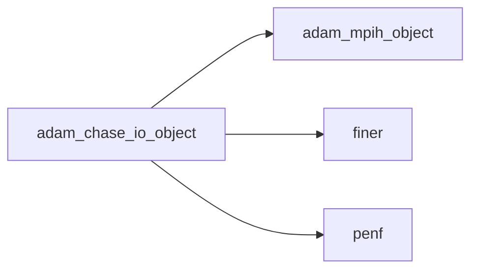
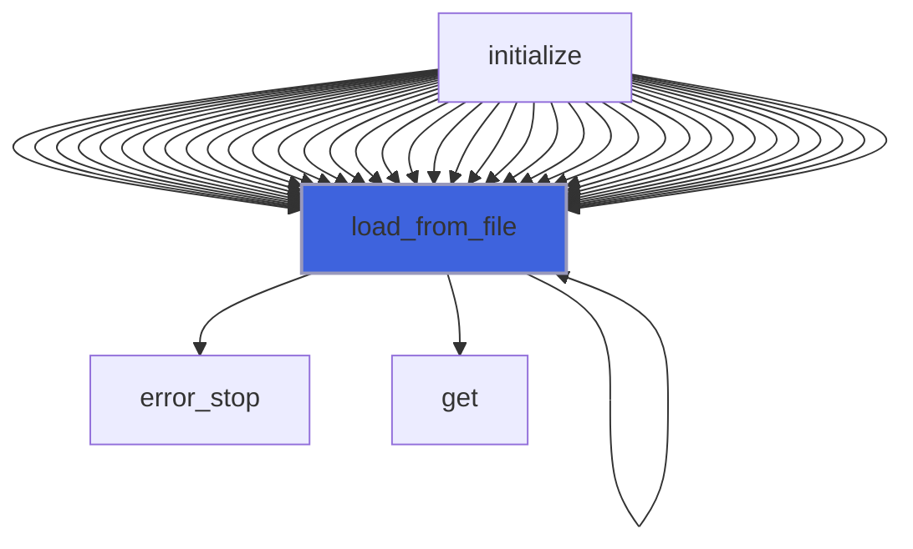
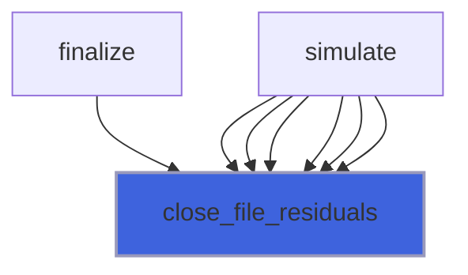
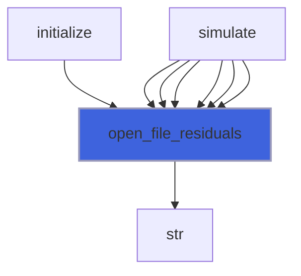
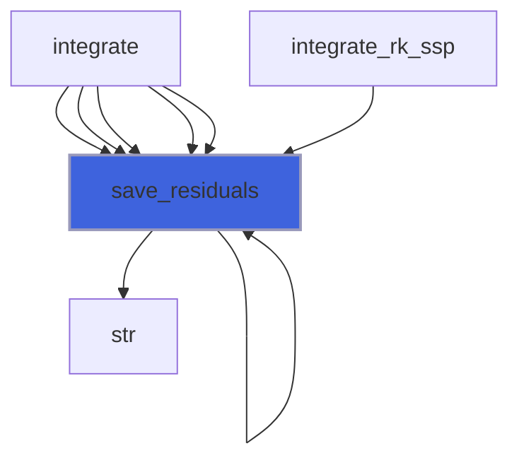
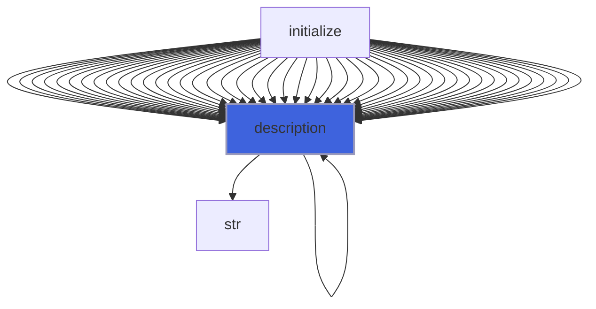

# adam_chase_io_object

> ADAM, Maxwell IO handler class definition, common CPU backend.

**Source**: `src/app/chase/common/adam_chase_io_object.F90`

**Dependencies**



## Contents

- [chase_io_object](#chase-io-object)
- [initialize](#initialize)
- [load_from_file](#load-from-file)
- [close_file_residuals](#close-file-residuals)
- [open_file_residuals](#open-file-residuals)
- [save_residuals](#save-residuals)
- [description](#description)

## Variables

| Name | Type | Attributes | Description |
|------|------|------------|-------------|
| `INI_SECTION_NAME` | character(len=2) | parameter | INI (config) file section name containing IO configs. |

## Derived Types

### chase_io_object

CHASE IO handler class definition, CPU backend.

#### Components

| Name | Type | Attributes | Description |
|------|------|------------|-------------|
| `mpih` | type([mpih_object](/api/src/lib/common/adam_mpih_object#mpih-object)) |  | MPI handler. |
| `file_parameters` | type([file_ini](/api/src/third_party/FiNeR/src/lib/finer_file_ini_t#file-ini)) |  | chase input file handler. |
| `it_save` | integer(kind=[I4P](/api/src/third_party/PENF/src/lib/penf_global_parameters_variables)) |  | Main output iteration save frequency. |
| `output_basename` | character(len=:) | allocatable | Basename of output files. |
| `restart` | logical |  | Enable restart from old output data. |
| `restart_basename` | character(len=:) | allocatable | Basename of restart files. |
| `restart_save` | integer(kind=[I4P](/api/src/third_party/PENF/src/lib/penf_global_parameters_variables)) |  | Restart output iteration save frequency. |
| `save_memory_status` | logical |  | Enable save of memory status during allocations. |
| `residuals_save` | integer(kind=[I4P](/api/src/third_party/PENF/src/lib/penf_global_parameters_variables)) |  | Residuals (norm) output iteration save frequency. |
| `residuals_unit` | integer(kind=[I4P](/api/src/third_party/PENF/src/lib/penf_global_parameters_variables)) |  | Residuals file unit. |

#### Type-Bound Procedures

| Name | Attributes | Description |
|------|------------|-------------|
| `description` | pass(self) | Return pretty-printed object description. |
| `initialize` | pass(self) | Initialize time handler. |
| `load_from_file` | pass(self) | Load config from file. |
| `close_file_residuals` | pass(self) | Close file for saving residuals history. |
| `open_file_residuals` | pass(self) | Open file for saving residuals history. |
| `save_residuals` | pass(self) | Save residuals history. |

## Subroutines

### initialize

Initialize IO handler.

```fortran
subroutine initialize(self, filename)
```

**Arguments**

| Name | Type | Intent | Attributes | Description |
|------|------|--------|------------|-------------|
| `self` | class([chase_io_object](/api/src/app/chase/common/adam_chase_io_object#chase-io-object)) | inout |  | IO handler. |
| `filename` | character(len=*) | in |  | File name of parameters file. |

**Call graph**



```mermaid
flowchart TD
  add_node["add_node"] --> initialize["initialize"]
  analize["analize"] --> initialize["initialize"]
  build_connectivity["build_connectivity"] --> initialize["initialize"]
  distribute_facets["distribute_facets"] --> initialize["initialize"]
  distribute_facets_tree["distribute_facets_tree"] --> initialize["initialize"]
  export_vtk_file["export_vtk_file"] --> initialize["initialize"]
  initialize["initialize"] --> initialize["initialize"]
  initialize["initialize"] --> initialize["initialize"]
  initialize["initialize"] --> initialize["initialize"]
  initialize["initialize"] --> initialize["initialize"]
  initialize["initialize"] --> initialize["initialize"]
  initialize["initialize"] --> initialize["initialize"]
  initialize["initialize"] --> initialize["initialize"]
  initialize["initialize"] --> initialize["initialize"]
  initialize["initialize"] --> initialize["initialize"]
  initialize["initialize"] --> initialize["initialize"]
  initialize["initialize"] --> initialize["initialize"]
  initialize["initialize"] --> initialize["initialize"]
  initialize["initialize"] --> initialize["initialize"]
  initialize["initialize"] --> initialize["initialize"]
  initialize["initialize"] --> initialize["initialize"]
  initialize["initialize"] --> initialize["initialize"]
  initialize["initialize"] --> initialize["initialize"]
  initialize["initialize"] --> initialize["initialize"]
  initialize["initialize"] --> initialize["initialize"]
  initialize["initialize"] --> initialize["initialize"]
  initialize["initialize"] --> initialize["initialize"]
  initialize["initialize"] --> initialize["initialize"]
  initialize["initialize"] --> initialize["initialize"]
  initialize["initialize"] --> initialize["initialize"]
  initialize["initialize"] --> initialize["initialize"]
  initialize["initialize"] --> initialize["initialize"]
  initialize["initialize"] --> initialize["initialize"]
  initialize["initialize"] --> initialize["initialize"]
  initialize["initialize"] --> initialize["initialize"]
  initialize["initialize"] --> initialize["initialize"]
  initialize["initialize"] --> initialize["initialize"]
  initialize["initialize"] --> initialize["initialize"]
  initialize["initialize"] --> initialize["initialize"]
  initialize["initialize"] --> initialize["initialize"]
  initialize["initialize"] --> initialize["initialize"]
  initialize["initialize"] --> initialize["initialize"]
  initialize["initialize"] --> initialize["initialize"]
  initialize["initialize"] --> initialize["initialize"]
  initialize["initialize"] --> initialize["initialize"]
  initialize["initialize"] --> initialize["initialize"]
  initialize["initialize"] --> initialize["initialize"]
  initialize["initialize"] --> initialize["initialize"]
  initialize["initialize"] --> initialize["initialize"]
  initialize["initialize"] --> initialize["initialize"]
  initialize["initialize"] --> initialize["initialize"]
  initialize["initialize"] --> initialize["initialize"]
  initialize["initialize"] --> initialize["initialize"]
  initialize["initialize"] --> initialize["initialize"]
  initialize["initialize"] --> initialize["initialize"]
  initialize["initialize"] --> initialize["initialize"]
  initialize["initialize"] --> initialize["initialize"]
  initialize["initialize"] --> initialize["initialize"]
  initialize["initialize"] --> initialize["initialize"]
  initialize["initialize"] --> initialize["initialize"]
  initialize["initialize"] --> initialize["initialize"]
  initialize["initialize"] --> initialize["initialize"]
  initialize["initialize"] --> initialize["initialize"]
  initialize["initialize"] --> initialize["initialize"]
  initialize["initialize"] --> initialize["initialize"]
  initialize["initialize"] --> initialize["initialize"]
  initialize["initialize"] --> initialize["initialize"]
  initialize["initialize"] --> initialize["initialize"]
  initialize["initialize"] --> initialize["initialize"]
  initialize["initialize"] --> initialize["initialize"]
  initialize["initialize"] --> initialize["initialize"]
  initialize["initialize"] --> initialize["initialize"]
  initialize["initialize"] --> initialize["initialize"]
  initialize["initialize"] --> initialize["initialize"]
  initialize["initialize"] --> initialize["initialize"]
  initialize["initialize"] --> initialize["initialize"]
  initialize["initialize"] --> initialize["initialize"]
  initialize["initialize"] --> initialize["initialize"]
  initialize_common["initialize_common"] --> initialize["initialize"]
  initialize_common["initialize_common"] --> initialize["initialize"]
  initialize_common["initialize_common"] --> initialize["initialize"]
  initialize_common["initialize_common"] --> initialize["initialize"]
  load_from_file["load_from_file"] --> initialize["initialize"]
  load_from_file["load_from_file"] --> initialize["initialize"]
  open_file["open_file"] --> initialize["initialize"]
  open_file["open_file"] --> initialize["initialize"]
  open_file["open_file"] --> initialize["initialize"]
  resize["resize"] --> initialize["initialize"]
  save_into_file["save_into_file"] --> initialize["initialize"]
  save_vtk["save_vtk"] --> initialize["initialize"]
  simulate["simulate"] --> initialize["initialize"]
  simulate["simulate"] --> initialize["initialize"]
  simulate["simulate"] --> initialize["initialize"]
  simulate["simulate"] --> initialize["initialize"]
  simulate["simulate"] --> initialize["initialize"]
  simulate["simulate"] --> initialize["initialize"]
  simulate["simulate"] --> initialize["initialize"]
  test_stress["test_stress"] --> initialize["initialize"]
  initialize["initialize"] --> description["description"]
  initialize["initialize"] --> initialize["initialize"]
  initialize["initialize"] --> load["load"]
  initialize["initialize"] --> load_from_file["load_from_file"]
  style initialize fill:#3e63dd,stroke:#99b,stroke-width:2px
```

### load_from_file

Load config from file.

```fortran
subroutine load_from_file(self, file_parameters, go_on_fail)
```

**Arguments**

| Name | Type | Intent | Attributes | Description |
|------|------|--------|------------|-------------|
| `self` | class([chase_io_object](/api/src/app/chase/common/adam_chase_io_object#chase-io-object)) | inout |  | IO handler. |
| `file_parameters` | type([file_ini](/api/src/third_party/FiNeR/src/lib/finer_file_ini_t#file-ini)) | in |  | Simulation parameters ini file handler. |
| `go_on_fail` | logical | in | optional | Go on if load fails. |

**Call graph**



### close_file_residuals

Close file for saving residuals history.

```fortran
subroutine close_file_residuals(self)
```

**Arguments**

| Name | Type | Intent | Attributes | Description |
|------|------|--------|------------|-------------|
| `self` | class([chase_io_object](/api/src/app/chase/common/adam_chase_io_object#chase-io-object)) | in |  | IO handler. |

**Call graph**



### open_file_residuals

Open file for saving residuals history.

```fortran
subroutine open_file_residuals(self, nv)
```

**Arguments**

| Name | Type | Intent | Attributes | Description |
|------|------|--------|------------|-------------|
| `self` | class([chase_io_object](/api/src/app/chase/common/adam_chase_io_object#chase-io-object)) | inout |  | IO handler. |
| `nv` | integer(kind=[I4P](/api/src/third_party/PENF/src/lib/penf_global_parameters_variables)) | in |  | Number of residuals variables. |

**Call graph**



### save_residuals

Save residuals history.

```fortran
subroutine save_residuals(self, it, time, blocks_number, residuals)
```

**Arguments**

| Name | Type | Intent | Attributes | Description |
|------|------|--------|------------|-------------|
| `self` | class([chase_io_object](/api/src/app/chase/common/adam_chase_io_object#chase-io-object)) | in |  | IO handler. |
| `it` | integer(kind=[I4P](/api/src/third_party/PENF/src/lib/penf_global_parameters_variables)) | in |  | Current iteration. |
| `time` | real(kind=[R8P](/api/src/third_party/PENF/src/lib/penf_global_parameters_variables)) | in |  | Current time. |
| `blocks_number` | integer(kind=[I4P](/api/src/third_party/PENF/src/lib/penf_global_parameters_variables)) | in |  | Current number of blocks. |
| `residuals` | real(kind=[R8P](/api/src/third_party/PENF/src/lib/penf_global_parameters_variables)) | in |  | Residuals (norm) [1:nv]. |

**Call graph**



## Functions

### description

Return a pretty-formatted object description.

**Attributes**: pure

**Returns**: `character(len=:)`

```fortran
function description(self) result(desc)
```

**Arguments**

| Name | Type | Intent | Attributes | Description |
|------|------|--------|------------|-------------|
| `self` | class([chase_io_object](/api/src/app/chase/common/adam_chase_io_object#chase-io-object)) | in |  | IO handler. |

**Call graph**


