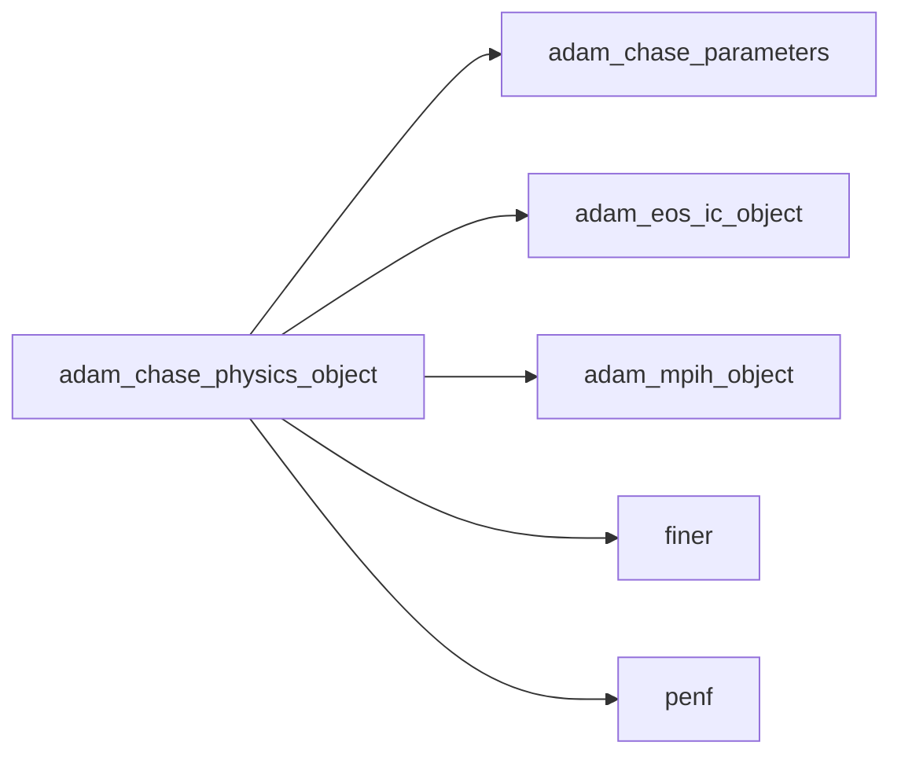
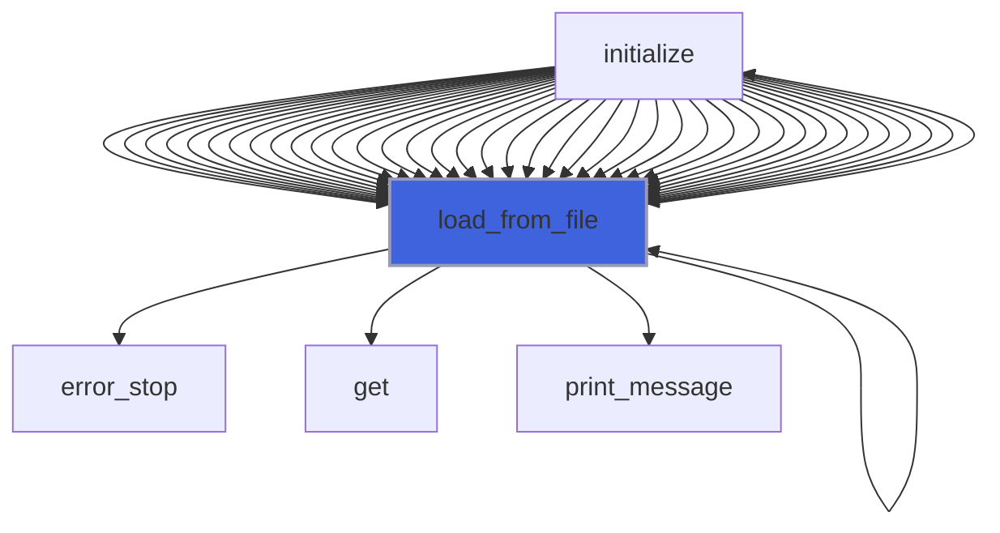
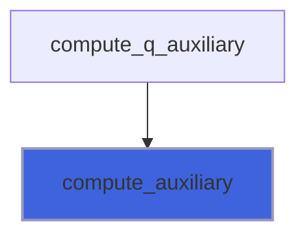
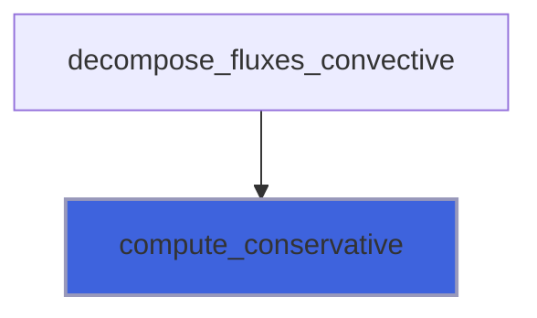
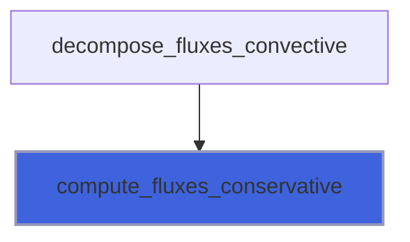
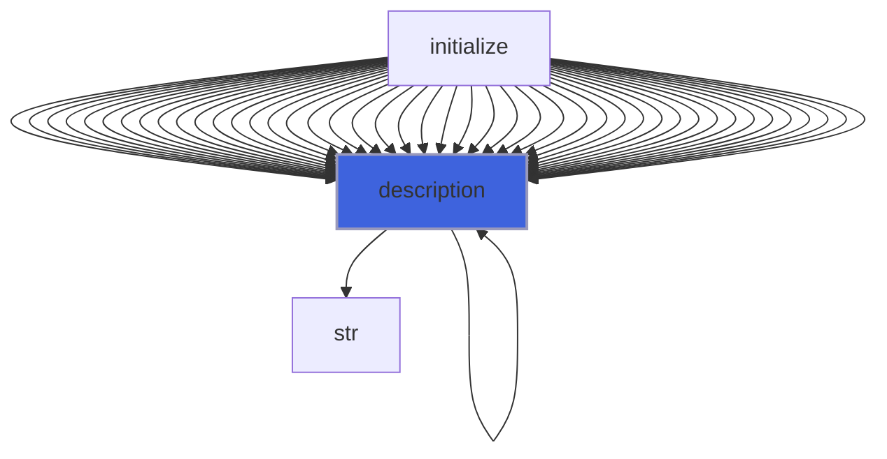

# adam_chase_physics_object

> ADAM, CHASE physics class definition, common CPU backend.

 Field variables are arranged as follows:
```
 q(1): r
 q(2): r * u
 q(3): r * v
 q(4): r * w
 q(5): r * E
```
 Field variables fluxes are:
```
 Fx(1) = r * u       Fy(1) = r * v       Fz(1) = r * w
 Fx(2) = r * u^2 + p Fy(2) = r * u * v   Fz(2) = r * u * w
 Fx(3) = r * v * u   Fy(3) = r * v^2 + p Fz(3) = r * v * w
 Fx(4) = r * w * u   Fy(4) = r * w * v   Fz(4) = r * w^2 + p
 Fx(5) = r * u * H   Fy(5) = r * v * H   Fz(5) = r * w * H
```
 Field auxiliary variables are arranged as follows:
```
 q_aux(1 ): r  (density)              |
 q_aux(2 ): u  (x velocity component) |
 q_aux(3 ): v  (y velocity component) | primitive variables
 q_aux(4 ): w  (z velocity component) |
 q_aux(5 ): P  (pressure)             |
 q_aux(6 ): T  (temperature)
 q_aux(7 ): E  (total energy)
 q_aux(8 ): H  (total entalpy)
 q_aux(9 ): a  (speed of sound)
 q_aux(10): cv (specific heat at constant volume)
 q_aux(11): Rf (fluid constant, cp-cv)
 q_aux(12): g  (specific heats ratio, cp/cv)
```
 Note that the first nv=5 auxiliary variables are also the primitive ones.

**Source**: `src/app/chase/common/adam_chase_physics_object.F90`

**Dependencies**



## Contents

- [chase_physics_object](#chase-physics-object)
- [initialize](#initialize)
- [load_from_file](#load-from-file)
- [compute_auxiliary](#compute-auxiliary)
- [compute_conservative](#compute-conservative)
- [compute_fluxes_conservative](#compute-fluxes-conservative)
- [description](#description)

## Variables

| Name | Type | Attributes | Description |
|------|------|------------|-------------|
| `INI_SECTION_NAME` | character(len=7) | parameter | INI file section name containing fluid physics. |
| `VAR_R` | integer(kind=[I4P](/api/src/third_party/PENF/src/lib/penf_global_parameters_variables)) | parameter | Auxiliary/primitive/conservative variable 1, r, density. |
| `VAR_U` | integer(kind=[I4P](/api/src/third_party/PENF/src/lib/penf_global_parameters_variables)) | parameter | Auxiliary/primitive variable 2, u, x velocity component. |
| `VAR_V` | integer(kind=[I4P](/api/src/third_party/PENF/src/lib/penf_global_parameters_variables)) | parameter | Auxiliary/primitive variable 3, v, y velocity component. |
| `VAR_W` | integer(kind=[I4P](/api/src/third_party/PENF/src/lib/penf_global_parameters_variables)) | parameter | Auxiliary/primitive variable 4, w, z velocity component. |
| `VAR_P` | integer(kind=[I4P](/api/src/third_party/PENF/src/lib/penf_global_parameters_variables)) | parameter | Auxiliary/primitive variable 5, P, pressure. |
| `VAR_A` | integer(kind=[I4P](/api/src/third_party/PENF/src/lib/penf_global_parameters_variables)) | parameter | Auxiliary           variable 6, a, speed of sound. |
| `VAR_T` | integer(kind=[I4P](/api/src/third_party/PENF/src/lib/penf_global_parameters_variables)) | parameter | Auxiliary           variable 7, T, temperature. |
| `VAR_E` | integer(kind=[I4P](/api/src/third_party/PENF/src/lib/penf_global_parameters_variables)) | parameter | Auxiliary           variable 8, E, total specific energy. |
| `VAR_H` | integer(kind=[I4P](/api/src/third_party/PENF/src/lib/penf_global_parameters_variables)) | parameter | Auxiliary           variable 9, H, total specific entalpy. |
| `VAR_RF` | integer(kind=[I4P](/api/src/third_party/PENF/src/lib/penf_global_parameters_variables)) | parameter | Auxiliary           variable 10, Rf, cp-cv. |
| `VAR_G` | integer(kind=[I4P](/api/src/third_party/PENF/src/lib/penf_global_parameters_variables)) | parameter | Auxiliary           variable 11, g, cp/cv. |
| `VAR_RU` | integer(kind=[I4P](/api/src/third_party/PENF/src/lib/penf_global_parameters_variables)) | parameter | Conservative variable 2, r*u, x momemtum component. |
| `VAR_RV` | integer(kind=[I4P](/api/src/third_party/PENF/src/lib/penf_global_parameters_variables)) | parameter | Conservative variable 3, r*v, y momemtum component. |
| `VAR_RW` | integer(kind=[I4P](/api/src/third_party/PENF/src/lib/penf_global_parameters_variables)) | parameter | Conservative variable 4, r*w, z momemtum component. |
| `VAR_RE` | integer(kind=[I4P](/api/src/third_party/PENF/src/lib/penf_global_parameters_variables)) | parameter | Conservative variable 5, r*E, total energy. |
| `WENO_REC_VAR_CONS` | character(len=12) | parameter | WENO reconstruction on conservative variables. |
| `WENO_REC_VAR_CHAR` | character(len=15) | parameter | WENO reconstruction on characteristics variables. |

## Derived Types

### chase_physics_object

CHASE physics class definition.

#### Components

| Name | Type | Attributes | Description |
|------|------|------------|-------------|
| `mpih` | type([mpih_object](/api/src/third_party/FUNDAL/src/lib/fundal_mpih_object#mpih-object)) |  | MPI handler. |
| `nv` | integer(kind=[I4P](/api/src/third_party/PENF/src/lib/penf_global_parameters_variables)) |  | Number of conservative/primitive variables. |
| `nv_aux` | integer(kind=[I4P](/api/src/third_party/PENF/src/lib/penf_global_parameters_variables)) |  | Number of auxiliary variables. |
| `weno_rec_var` | character(len=:) | allocatable | Type of WENO reconstruction variables (cons., charct.,...). |
| `erw` | real(kind=[R8P](/api/src/third_party/PENF/src/lib/penf_global_parameters_variables)) | pointer | Right eigenvectors for WENO reconstruction. |
| `elw` | real(kind=[R8P](/api/src/third_party/PENF/src/lib/penf_global_parameters_variables)) | pointer | Left  eigenvectors for WENO reconstruction. |
| `eos` | type([eos_ic_object](/api/src/lib/common/adam_eos_ic_object#eos-ic-object)) |  | Equations of state of ideal compressibile fluid. |

#### Type-Bound Procedures

| Name | Attributes | Description |
|------|------------|-------------|
| `description` | pass(self) | Return pretty-printed object description. |
| `initialize` | pass(self) | Initialize physics. |
| `load_from_file` | pass(self) | Load config from file. |

## Subroutines

### initialize

Initialize the equation.

```fortran
subroutine initialize(self, file_parameters)
```

**Arguments**

| Name | Type | Intent | Attributes | Description |
|------|------|--------|------------|-------------|
| `self` | class([chase_physics_object](/api/src/app/chase/common/adam_chase_physics_object#chase-physics-object)) | inout |  | Physics. |
| `file_parameters` | type([file_ini](/api/src/third_party/FiNeR/src/lib/finer_file_ini_t#file-ini)) | in |  | Simulation parameters ini file handler. |

**Call graph**



```mermaid
flowchart TD
  add_node["add_node"] --> initialize["initialize"]
  analize["analize"] --> initialize["initialize"]
  build_connectivity["build_connectivity"] --> initialize["initialize"]
  distribute_facets["distribute_facets"] --> initialize["initialize"]
  distribute_facets_tree["distribute_facets_tree"] --> initialize["initialize"]
  export_vtk_file["export_vtk_file"] --> initialize["initialize"]
  initialize["initialize"] --> initialize["initialize"]
  initialize["initialize"] --> initialize["initialize"]
  initialize["initialize"] --> initialize["initialize"]
  initialize["initialize"] --> initialize["initialize"]
  initialize["initialize"] --> initialize["initialize"]
  initialize["initialize"] --> initialize["initialize"]
  initialize["initialize"] --> initialize["initialize"]
  initialize["initialize"] --> initialize["initialize"]
  initialize["initialize"] --> initialize["initialize"]
  initialize["initialize"] --> initialize["initialize"]
  initialize["initialize"] --> initialize["initialize"]
  initialize["initialize"] --> initialize["initialize"]
  initialize["initialize"] --> initialize["initialize"]
  initialize["initialize"] --> initialize["initialize"]
  initialize["initialize"] --> initialize["initialize"]
  initialize["initialize"] --> initialize["initialize"]
  initialize["initialize"] --> initialize["initialize"]
  initialize["initialize"] --> initialize["initialize"]
  initialize["initialize"] --> initialize["initialize"]
  initialize["initialize"] --> initialize["initialize"]
  initialize["initialize"] --> initialize["initialize"]
  initialize["initialize"] --> initialize["initialize"]
  initialize["initialize"] --> initialize["initialize"]
  initialize["initialize"] --> initialize["initialize"]
  initialize["initialize"] --> initialize["initialize"]
  initialize["initialize"] --> initialize["initialize"]
  initialize["initialize"] --> initialize["initialize"]
  initialize["initialize"] --> initialize["initialize"]
  initialize["initialize"] --> initialize["initialize"]
  initialize["initialize"] --> initialize["initialize"]
  initialize["initialize"] --> initialize["initialize"]
  initialize["initialize"] --> initialize["initialize"]
  initialize["initialize"] --> initialize["initialize"]
  initialize["initialize"] --> initialize["initialize"]
  initialize["initialize"] --> initialize["initialize"]
  initialize["initialize"] --> initialize["initialize"]
  initialize["initialize"] --> initialize["initialize"]
  initialize["initialize"] --> initialize["initialize"]
  initialize["initialize"] --> initialize["initialize"]
  initialize["initialize"] --> initialize["initialize"]
  initialize["initialize"] --> initialize["initialize"]
  initialize["initialize"] --> initialize["initialize"]
  initialize["initialize"] --> initialize["initialize"]
  initialize["initialize"] --> initialize["initialize"]
  initialize["initialize"] --> initialize["initialize"]
  initialize["initialize"] --> initialize["initialize"]
  initialize["initialize"] --> initialize["initialize"]
  initialize["initialize"] --> initialize["initialize"]
  initialize["initialize"] --> initialize["initialize"]
  initialize["initialize"] --> initialize["initialize"]
  initialize["initialize"] --> initialize["initialize"]
  initialize["initialize"] --> initialize["initialize"]
  initialize["initialize"] --> initialize["initialize"]
  initialize["initialize"] --> initialize["initialize"]
  initialize["initialize"] --> initialize["initialize"]
  initialize["initialize"] --> initialize["initialize"]
  initialize["initialize"] --> initialize["initialize"]
  initialize["initialize"] --> initialize["initialize"]
  initialize["initialize"] --> initialize["initialize"]
  initialize["initialize"] --> initialize["initialize"]
  initialize["initialize"] --> initialize["initialize"]
  initialize["initialize"] --> initialize["initialize"]
  initialize["initialize"] --> initialize["initialize"]
  initialize["initialize"] --> initialize["initialize"]
  initialize["initialize"] --> initialize["initialize"]
  initialize["initialize"] --> initialize["initialize"]
  initialize["initialize"] --> initialize["initialize"]
  initialize["initialize"] --> initialize["initialize"]
  initialize["initialize"] --> initialize["initialize"]
  initialize["initialize"] --> initialize["initialize"]
  initialize["initialize"] --> initialize["initialize"]
  initialize["initialize"] --> initialize["initialize"]
  initialize_common["initialize_common"] --> initialize["initialize"]
  initialize_common["initialize_common"] --> initialize["initialize"]
  initialize_common["initialize_common"] --> initialize["initialize"]
  initialize_common["initialize_common"] --> initialize["initialize"]
  load_from_file["load_from_file"] --> initialize["initialize"]
  load_from_file["load_from_file"] --> initialize["initialize"]
  open_file["open_file"] --> initialize["initialize"]
  open_file["open_file"] --> initialize["initialize"]
  open_file["open_file"] --> initialize["initialize"]
  resize["resize"] --> initialize["initialize"]
  save_into_file["save_into_file"] --> initialize["initialize"]
  save_vtk["save_vtk"] --> initialize["initialize"]
  simulate["simulate"] --> initialize["initialize"]
  simulate["simulate"] --> initialize["initialize"]
  simulate["simulate"] --> initialize["initialize"]
  simulate["simulate"] --> initialize["initialize"]
  simulate["simulate"] --> initialize["initialize"]
  simulate["simulate"] --> initialize["initialize"]
  simulate["simulate"] --> initialize["initialize"]
  test_stress["test_stress"] --> initialize["initialize"]
  initialize["initialize"] --> description["description"]
  initialize["initialize"] --> initialize["initialize"]
  initialize["initialize"] --> load_from_file["load_from_file"]
  style initialize fill:#3e63dd,stroke:#99b,stroke-width:2px
```

### load_from_file

Load config from file.

```fortran
subroutine load_from_file(self, file_parameters, go_on_fail)
```

**Arguments**

| Name | Type | Intent | Attributes | Description |
|------|------|--------|------------|-------------|
| `self` | class([chase_physics_object](/api/src/app/chase/common/adam_chase_physics_object#chase-physics-object)) | inout |  | Physics. |
| `file_parameters` | type([file_ini](/api/src/third_party/FiNeR/src/lib/finer_file_ini_t#file-ini)) | in |  | Simulation parameters ini file handler. |
| `go_on_fail` | logical | in | optional | Go on if load fails. |

**Call graph**



### compute_auxiliary

Compute auxiliary variables from conservative ones.

**Attributes**: pure

```fortran
subroutine compute_auxiliary(cv, Rf, g, conservative, auxiliary)
```

**Arguments**

| Name | Type | Intent | Attributes | Description |
|------|------|--------|------------|-------------|
| `cv` | real(kind=[R8P](/api/src/third_party/PENF/src/lib/penf_global_parameters_variables)) | in |  | Specific heat at constant volume. |
| `Rf` | real(kind=[R8P](/api/src/third_party/PENF/src/lib/penf_global_parameters_variables)) | in |  | Fluid constant (cp-cv). |
| `g` | real(kind=[R8P](/api/src/third_party/PENF/src/lib/penf_global_parameters_variables)) | in |  | Specific heats ration (cp/cv). |
| `conservative` | real(kind=[R8P](/api/src/third_party/PENF/src/lib/penf_global_parameters_variables)) | in |  | Conservative variables. |
| `auxiliary` | real(kind=[R8P](/api/src/third_party/PENF/src/lib/penf_global_parameters_variables)) | inout |  | Auxiliary variables. |

**Call graph**



### compute_conservative

Compute convervative variables from auxiliary ones, scalar input.

**Attributes**: pure

```fortran
subroutine compute_conservative(auxiliary, conservative)
```

**Arguments**

| Name | Type | Intent | Attributes | Description |
|------|------|--------|------------|-------------|
| `auxiliary` | real(kind=[R8P](/api/src/third_party/PENF/src/lib/penf_global_parameters_variables)) | in |  | Auxiliary variables. |
| `conservative` | real(kind=[R8P](/api/src/third_party/PENF/src/lib/penf_global_parameters_variables)) | inout |  | Conservative variables. |

**Call graph**



### compute_fluxes_conservative

Compute fluxes of convervative variables from auxiliary ones.

**Attributes**: pure

```fortran
subroutine compute_fluxes_conservative(sir, auxiliary, fluxes)
```

**Arguments**

| Name | Type | Intent | Attributes | Description |
|------|------|--------|------------|-------------|
| `sir` | real(kind=[R8P](/api/src/third_party/PENF/src/lib/penf_global_parameters_variables)) | in |  | Directional (1=x,2=y,3=z) increment. |
| `auxiliary` | real(kind=[R8P](/api/src/third_party/PENF/src/lib/penf_global_parameters_variables)) | in |  | Auxiliary variables. |
| `fluxes` | real(kind=[R8P](/api/src/third_party/PENF/src/lib/penf_global_parameters_variables)) | inout |  | Conservative fluxes. |

**Call graph**



## Functions

### description

Return a pretty-formatted object description.

**Attributes**: pure

**Returns**: `character(len=:)`

```fortran
function description(self) result(desc)
```

**Arguments**

| Name | Type | Intent | Attributes | Description |
|------|------|--------|------------|-------------|
| `self` | class([chase_physics_object](/api/src/app/chase/common/adam_chase_physics_object#chase-physics-object)) | in |  | Physics. |

**Call graph**


