# adam_chase_cpu_object

> ADAM, CHASE (CFD-HPC enabled-Adaptive mesh-Simulation code for-Euler equations) class definition, CPU backend.

**Source**: `src/app/chase/cpu/adam_chase_cpu_object.F90`

**Dependencies**

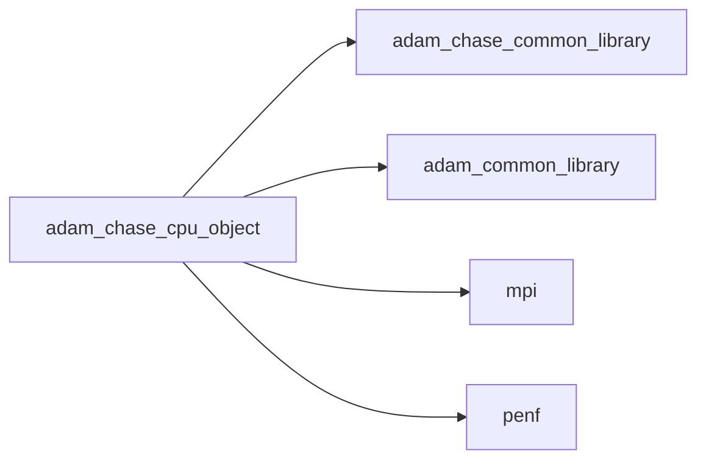

## Contents

- [chase_cpu_object](#chase-cpu-object)
- [assign_omp](#assign-omp)
- [allocate_cpu](#allocate-cpu)
- [initialize](#initialize)
- [amr_update](#amr-update)
- [compute_phi](#compute-phi)
- [mark_by_geo](#mark-by-geo)
- [mark_by_grad_var](#mark-by-grad-var)
- [move_phi](#move-phi)
- [refine_uniform](#refine-uniform)
- [integrate_eikonal](#integrate-eikonal)
- [load_restart_files](#load-restart-files)
- [save_xh5f](#save-xh5f)
- [save_residuals](#save-residuals)
- [save_restart_files](#save-restart-files)
- [save_simulation_data](#save-simulation-data)
- [set_boundary_conditions](#set-boundary-conditions)
- [set_initial_conditions](#set-initial-conditions)
- [update_ghost](#update-ghost)
- [compute_dt](#compute-dt)
- [compute_q_auxiliary](#compute-q-auxiliary)
- [compute_residuals](#compute-residuals)
- [integrate](#integrate)
- [simulate](#simulate)
- [assign_omp_R8P_5D](#assign-omp-r8p-5d)
- [compute_fluxes_convective](#compute-fluxes-convective)
- [compute_fluxes_convective_ri](#compute-fluxes-convective-ri)
- [compute_fluxes_difference](#compute-fluxes-difference)
- [compute_eigenvectors](#compute-eigenvectors)
- [compute_max_eigenvalues](#compute-max-eigenvalues)
- [compute_q_gradient](#compute-q-gradient)
- [compute_roe_average](#compute-roe-average)
- [decompose_fluxes_convective](#decompose-fluxes-convective)

## Derived Types

### chase_cpu_object

Maxwell equations system class definition, CPU backend.

**Inheritance**

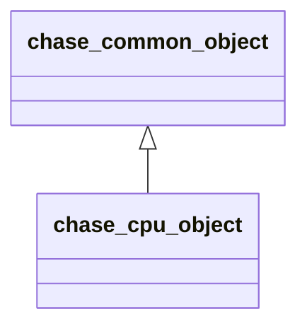

**Extends**: [`chase_common_object`](/api/src/app/chase/common/adam_chase_common_object#chase-common-object)

#### Components

| Name | Type | Attributes | Description |
|------|------|------------|-------------|
| `mpih` | type([mpih_object](/api/src/third_party/FUNDAL/src/lib/fundal_mpih_object#mpih-object)) |  | MPI handler. |
| `adam` | type([adam_object](/api/src/lib/common/adam_adam_object#adam-object)) |  | ADAM. |
| `field` | type([field_object](/api/src/lib/common/adam_field_object#field-object)) | pointer | The field. |
| `grid` | type([grid_object](/api/src/lib/common/adam_grid_object#grid-object)) | pointer | The grid. |
| `amr` | type([amr_object](/api/src/lib/common/adam_amr_object#amr-object)) |  | AMR marker handler. |
| `ib` | type([ib_object](/api/src/lib/common/adam_ib_object#ib-object)) |  | Immersed Boundary (IB) handler. |
| `slices` | type([slices_object](/api/src/lib/common/adam_slices_object#slices-object)) |  | Slices handler. |
| `rk` | type([rk_object](/api/src/lib/common/adam_rk_object#rk-object)) |  | RK integrator. |
| `weno` | type([weno_object](/api/src/lib/common/adam_weno_object#weno-object)) |  | WENO reconstructor. |
| `io` | type([chase_io_object](/api/src/app/chase/common/adam_chase_io_object#chase-io-object)) |  | IO handler. |
| `physics` | type([chase_physics_object](/api/src/app/chase/common/adam_chase_physics_object#chase-physics-object)) |  | Fluids physiscs handler. |
| `ic` | type([chase_ic_object](/api/src/app/chase/common/adam_chase_ic_object#chase-ic-object)) |  | Initial Conditions (IC) handler. |
| `bc` | type([chase_bc_object](/api/src/app/chase/common/adam_chase_bc_object#chase-bc-object)) |  | Boundary Conditions (BC) handler. |
| `time` | type([chase_time_object](/api/src/app/chase/common/adam_chase_time_object#chase-time-object)) |  | Time handler. |
| `ngc` | integer(kind=[I4P](/api/src/third_party/PENF/src/lib/penf_global_parameters_variables)) | pointer | Number of ghost cells. |
| `ni` | integer(kind=[I4P](/api/src/third_party/PENF/src/lib/penf_global_parameters_variables)) | pointer | Number of cells in i direction. |
| `nj` | integer(kind=[I4P](/api/src/third_party/PENF/src/lib/penf_global_parameters_variables)) | pointer | Number of cells in j direction. |
| `nk` | integer(kind=[I4P](/api/src/third_party/PENF/src/lib/penf_global_parameters_variables)) | pointer | Number of cells in k direction. |
| `nb` | integer(kind=[I4P](/api/src/third_party/PENF/src/lib/penf_global_parameters_variables)) | pointer | Total blocks number for MPI. |
| `blocks_number` | integer(kind=[I4P](/api/src/third_party/PENF/src/lib/penf_global_parameters_variables)) | pointer | Actual blocks number. |
| `nv` | integer(kind=[I4P](/api/src/third_party/PENF/src/lib/penf_global_parameters_variables)) | pointer | Number of conservative/primitive variables. |
| `nv_aux` | integer(kind=[I4P](/api/src/third_party/PENF/src/lib/penf_global_parameters_variables)) | pointer | Number of auxiliary variables. |
| `q` | real(kind=[R8P](/api/src/third_party/PENF/src/lib/penf_global_parameters_variables)) | allocatable | Cell centered variables. |
| `q_aux` | real(kind=[R8P](/api/src/third_party/PENF/src/lib/penf_global_parameters_variables)) | allocatable | Auxiliary cell centered variables. |
| `q_name` | character(len=2) | allocatable | Conservative fields names (r,ru,rv,rw,rE). |
| `dq` | real(kind=[R8P](/api/src/third_party/PENF/src/lib/penf_global_parameters_variables)) | allocatable | Residuals right hand side. |
| `flx` | real(kind=[R8P](/api/src/third_party/PENF/src/lib/penf_global_parameters_variables)) | allocatable | Fluxes along x. |
| `fly` | real(kind=[R8P](/api/src/third_party/PENF/src/lib/penf_global_parameters_variables)) | allocatable | Fluxes along y. |
| `flz` | real(kind=[R8P](/api/src/third_party/PENF/src/lib/penf_global_parameters_variables)) | allocatable | Fluxes along z. |

#### Type-Bound Procedures

| Name | Attributes | Description |
|------|------------|-------------|
| `allocate_common` | pass(self) | Allocate common data. |
| `initialize_common` | pass(self) | Initialize the equation common data. |
| `allocate_cpu` | pass(self) | Allocate CPU data. |
| `initialize` | pass(self) | Initialize the equation. |
| `amr_update` | pass(self) | Do AMR update. |
| `compute_phi` | pass(self) | Compute phi, distance from IB solid. |
| `mark_by_geo` | pass(self) | Mark blocks to be refined/derefined by a geometric constrain. |
| `mark_by_grad_var` | pass(self) | Mark blocks to be refined/derefined by a `grad(var)` value. |
| `move_phi` | pass(self) | Move phi. |
| `refine_uniform` | pass(self) | Refine all blocks uniformly. |
| `integrate_eikonal` | pass(self) | Integrate eikonal equation. |
| `load_restart_files` | pass(self) | Load restart files. |
| `save_xh5f` | pass(self) | Save simulation data in XH5F format. |
| `save_residuals` | pass(self) | Save residuals history. |
| `save_restart_files` | pass(self) | Save restart files. |
| `save_simulation_data` | pass(self) | Save all simulation data. |
| `set_boundary_conditions` | pass(self) | Set boundary conditions of equation. |
| `set_initial_conditions` | pass(self) | Set initial conditions (and coils) of equation. |
| `update_ghost` | pass(self) | Update ghost cells and set boundary conditions. |
| `compute_dt` | pass(self) | Compute time step. |
| `compute_q_auxiliary` | pass(self) | Compute auxiliary variables. |
| `compute_residuals` | pass(self) | Compute residuals. |
| `integrate` | pass(self) | Perform one step integration. |
| `simulate` | pass(self) | Perform the simulation. |

## Interfaces

### assign_omp

Assign array to scalar value with OpenMP threads.

**Module procedures**: [`assign_omp_R8P_5D`](/api/src/app/nasto/cpu/adam_nasto_cpu_object#assign-omp-r8p-5d)

## Subroutines

### allocate_cpu

Allocate CPU data.

```fortran
subroutine allocate_cpu(self)
```

**Arguments**

| Name | Type | Intent | Attributes | Description |
|------|------|--------|------------|-------------|
| `self` | class([chase_cpu_object](/api/src/app/chase/cpu/adam_chase_cpu_object#chase-cpu-object)) | inout |  | The equation. |

**Call graph**

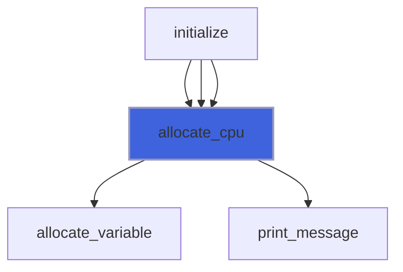

### initialize

Initialize the equation.

```fortran
subroutine initialize(self, filename)
```

**Arguments**

| Name | Type | Intent | Attributes | Description |
|------|------|--------|------------|-------------|
| `self` | class([chase_cpu_object](/api/src/app/chase/cpu/adam_chase_cpu_object#chase-cpu-object)) | inout |  | The equation. |
| `filename` | character(len=*) | in |  | Input file name. |

**Call graph**

```mermaid
flowchart TD
  add_node["add_node"] --> initialize["initialize"]
  analize["analize"] --> initialize["initialize"]
  build_connectivity["build_connectivity"] --> initialize["initialize"]
  distribute_facets["distribute_facets"] --> initialize["initialize"]
  distribute_facets_tree["distribute_facets_tree"] --> initialize["initialize"]
  export_vtk_file["export_vtk_file"] --> initialize["initialize"]
  initialize["initialize"] --> initialize["initialize"]
  initialize["initialize"] --> initialize["initialize"]
  initialize["initialize"] --> initialize["initialize"]
  initialize["initialize"] --> initialize["initialize"]
  initialize["initialize"] --> initialize["initialize"]
  initialize["initialize"] --> initialize["initialize"]
  initialize["initialize"] --> initialize["initialize"]
  initialize["initialize"] --> initialize["initialize"]
  initialize["initialize"] --> initialize["initialize"]
  initialize["initialize"] --> initialize["initialize"]
  initialize["initialize"] --> initialize["initialize"]
  initialize["initialize"] --> initialize["initialize"]
  initialize["initialize"] --> initialize["initialize"]
  initialize["initialize"] --> initialize["initialize"]
  initialize["initialize"] --> initialize["initialize"]
  initialize["initialize"] --> initialize["initialize"]
  initialize["initialize"] --> initialize["initialize"]
  initialize["initialize"] --> initialize["initialize"]
  initialize["initialize"] --> initialize["initialize"]
  initialize["initialize"] --> initialize["initialize"]
  initialize["initialize"] --> initialize["initialize"]
  initialize["initialize"] --> initialize["initialize"]
  initialize["initialize"] --> initialize["initialize"]
  initialize["initialize"] --> initialize["initialize"]
  initialize["initialize"] --> initialize["initialize"]
  initialize["initialize"] --> initialize["initialize"]
  initialize["initialize"] --> initialize["initialize"]
  initialize["initialize"] --> initialize["initialize"]
  initialize["initialize"] --> initialize["initialize"]
  initialize["initialize"] --> initialize["initialize"]
  initialize["initialize"] --> initialize["initialize"]
  initialize["initialize"] --> initialize["initialize"]
  initialize["initialize"] --> initialize["initialize"]
  initialize["initialize"] --> initialize["initialize"]
  initialize["initialize"] --> initialize["initialize"]
  initialize["initialize"] --> initialize["initialize"]
  initialize["initialize"] --> initialize["initialize"]
  initialize["initialize"] --> initialize["initialize"]
  initialize["initialize"] --> initialize["initialize"]
  initialize["initialize"] --> initialize["initialize"]
  initialize["initialize"] --> initialize["initialize"]
  initialize["initialize"] --> initialize["initialize"]
  initialize["initialize"] --> initialize["initialize"]
  initialize["initialize"] --> initialize["initialize"]
  initialize["initialize"] --> initialize["initialize"]
  initialize["initialize"] --> initialize["initialize"]
  initialize["initialize"] --> initialize["initialize"]
  initialize["initialize"] --> initialize["initialize"]
  initialize["initialize"] --> initialize["initialize"]
  initialize["initialize"] --> initialize["initialize"]
  initialize["initialize"] --> initialize["initialize"]
  initialize["initialize"] --> initialize["initialize"]
  initialize["initialize"] --> initialize["initialize"]
  initialize["initialize"] --> initialize["initialize"]
  initialize["initialize"] --> initialize["initialize"]
  initialize["initialize"] --> initialize["initialize"]
  initialize["initialize"] --> initialize["initialize"]
  initialize["initialize"] --> initialize["initialize"]
  initialize["initialize"] --> initialize["initialize"]
  initialize["initialize"] --> initialize["initialize"]
  initialize["initialize"] --> initialize["initialize"]
  initialize["initialize"] --> initialize["initialize"]
  initialize["initialize"] --> initialize["initialize"]
  initialize["initialize"] --> initialize["initialize"]
  initialize["initialize"] --> initialize["initialize"]
  initialize["initialize"] --> initialize["initialize"]
  initialize["initialize"] --> initialize["initialize"]
  initialize["initialize"] --> initialize["initialize"]
  initialize["initialize"] --> initialize["initialize"]
  initialize["initialize"] --> initialize["initialize"]
  initialize["initialize"] --> initialize["initialize"]
  initialize["initialize"] --> initialize["initialize"]
  initialize_common["initialize_common"] --> initialize["initialize"]
  initialize_common["initialize_common"] --> initialize["initialize"]
  initialize_common["initialize_common"] --> initialize["initialize"]
  initialize_common["initialize_common"] --> initialize["initialize"]
  load_from_file["load_from_file"] --> initialize["initialize"]
  load_from_file["load_from_file"] --> initialize["initialize"]
  open_file["open_file"] --> initialize["initialize"]
  open_file["open_file"] --> initialize["initialize"]
  open_file["open_file"] --> initialize["initialize"]
  resize["resize"] --> initialize["initialize"]
  save_into_file["save_into_file"] --> initialize["initialize"]
  save_vtk["save_vtk"] --> initialize["initialize"]
  simulate["simulate"] --> initialize["initialize"]
  simulate["simulate"] --> initialize["initialize"]
  simulate["simulate"] --> initialize["initialize"]
  simulate["simulate"] --> initialize["initialize"]
  simulate["simulate"] --> initialize["initialize"]
  simulate["simulate"] --> initialize["initialize"]
  simulate["simulate"] --> initialize["initialize"]
  test_stress["test_stress"] --> initialize["initialize"]
  initialize["initialize"] --> allocate_cpu["allocate_cpu"]
  initialize["initialize"] --> description["description"]
  initialize["initialize"] --> initialize["initialize"]
  initialize["initialize"] --> initialize_common["initialize_common"]
  initialize["initialize"] --> print_message["print_message"]
  style initialize fill:#3e63dd,stroke:#99b,stroke-width:2px
```

### amr_update

Do AMR update.

```fortran
subroutine amr_update(self)
```

**Arguments**

| Name | Type | Intent | Attributes | Description |
|------|------|--------|------------|-------------|
| `self` | class([chase_cpu_object](/api/src/app/chase/cpu/adam_chase_cpu_object#chase-cpu-object)) | inout |  | The equation. |

**Call graph**

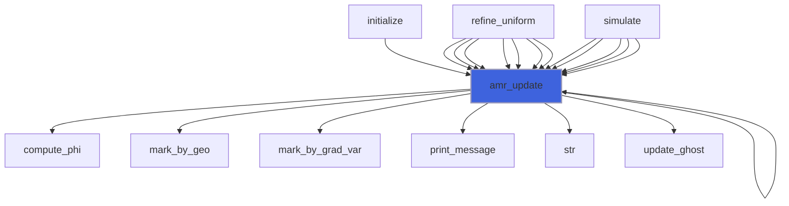

### compute_phi

Compute phi, distance from IB solid.

```fortran
subroutine compute_phi(self)
```

**Arguments**

| Name | Type | Intent | Attributes | Description |
|------|------|--------|------------|-------------|
| `self` | class([chase_cpu_object](/api/src/app/chase/cpu/adam_chase_cpu_object#chase-cpu-object)) | inout |  | The equation. |

**Call graph**

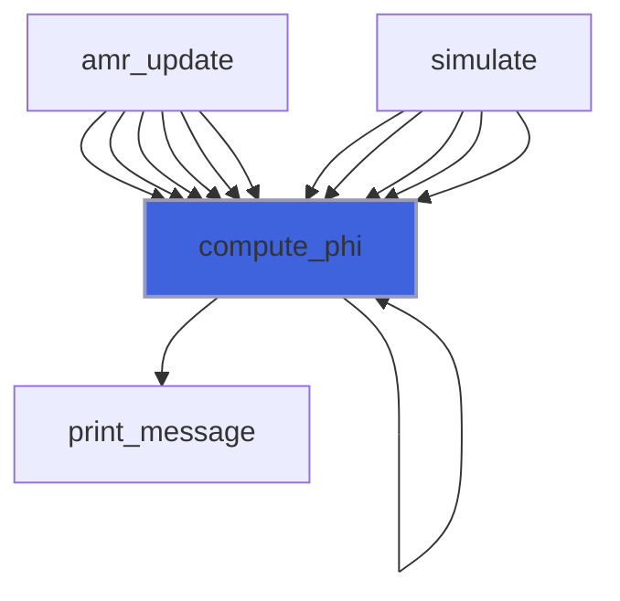

### mark_by_geo

Mark blocks to be refined/derefined by a geometric constrain.

```fortran
subroutine mark_by_geo(self, delta_fine, delta_coarse, threshold, do_init)
```

**Arguments**

| Name | Type | Intent | Attributes | Description |
|------|------|--------|------------|-------------|
| `self` | class([chase_cpu_object](/api/src/app/chase/cpu/adam_chase_cpu_object#chase-cpu-object)) | inout |  | The equation. |
| `delta_fine` | real(kind=[R8P](/api/src/third_party/PENF/src/lib/penf_global_parameters_variables)) | in |  | Maximum cell delta in fine grids. |
| `delta_coarse` | real(kind=[R8P](/api/src/third_party/PENF/src/lib/penf_global_parameters_variables)) | in |  | Minimum cell delta in coarse grids. |
| `threshold` | real(kind=[R8P](/api/src/third_party/PENF/src/lib/penf_global_parameters_variables)) | in | optional | Threshold for sphere proximity. |
| `do_init` | logical | in | optional |  |

**Call graph**

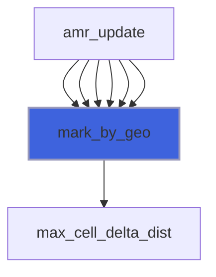

### mark_by_grad_var

Mark blocks to be refined/derefined by a `grad(var)` value.

```fortran
subroutine mark_by_grad_var(self, grad_tol, delta_type, delta_fine, delta_coarse, ivar, threshold, do_init)
```

**Arguments**

| Name | Type | Intent | Attributes | Description |
|------|------|--------|------------|-------------|
| `self` | class([chase_cpu_object](/api/src/app/chase/cpu/adam_chase_cpu_object#chase-cpu-object)) | inout |  | The equation. |
| `grad_tol` | real(kind=[R8P](/api/src/third_party/PENF/src/lib/penf_global_parameters_variables)) | in |  | Gradiend tolerance value. |
| `delta_type` | character(len=*) | in |  | Delta criterion type. |
| `delta_fine` | real(kind=[R8P](/api/src/third_party/PENF/src/lib/penf_global_parameters_variables)) | in |  | Maximum cell delta in fine grids. |
| `delta_coarse` | real(kind=[R8P](/api/src/third_party/PENF/src/lib/penf_global_parameters_variables)) | in |  | Minimum cell delta in coarse grids. |
| `ivar` | integer(kind=[I4P](/api/src/third_party/PENF/src/lib/penf_global_parameters_variables)) | in | optional | Variable for marking. |
| `threshold` | real(kind=[R8P](/api/src/third_party/PENF/src/lib/penf_global_parameters_variables)) | in | optional | Threshold for sphere proximity. |
| `do_init` | logical | in | optional | Re-initialize refinements queries. |

**Call graph**

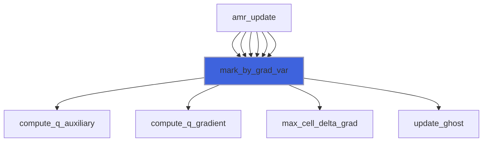

### move_phi

Move phi and the actual tree representation.

```fortran
subroutine move_phi(self, velocity, s)
```

**Arguments**

| Name | Type | Intent | Attributes | Description |
|------|------|--------|------------|-------------|
| `self` | class([chase_cpu_object](/api/src/app/chase/cpu/adam_chase_cpu_object#chase-cpu-object)) | inout |  | The equation. |
| `velocity` | real(kind=[R8P](/api/src/third_party/PENF/src/lib/penf_global_parameters_variables)) | in |  | Velocity of the movement. |
| `s` | integer(kind=[I4P](/api/src/third_party/PENF/src/lib/penf_global_parameters_variables)) | in |  | Solid index. |

**Call graph**

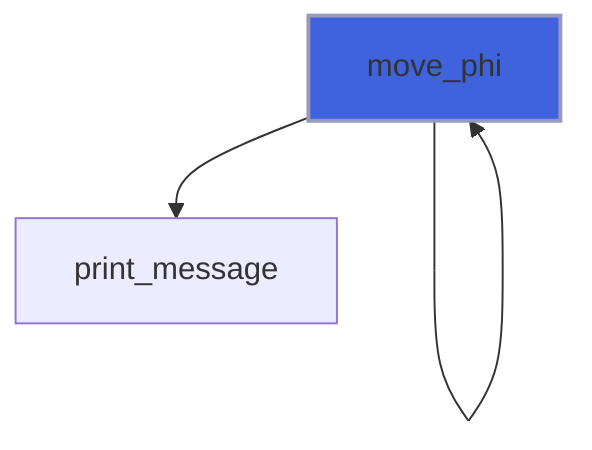

### refine_uniform

Refine all blocks uniformly.

```fortran
subroutine refine_uniform(self, refinement_levels)
```

**Arguments**

| Name | Type | Intent | Attributes | Description |
|------|------|--------|------------|-------------|
| `self` | class([chase_cpu_object](/api/src/app/chase/cpu/adam_chase_cpu_object#chase-cpu-object)) | inout |  | The equation. |
| `refinement_levels` | integer(kind=[I4P](/api/src/third_party/PENF/src/lib/penf_global_parameters_variables)) | in |  | Number of refinement to be performed. |

**Call graph**

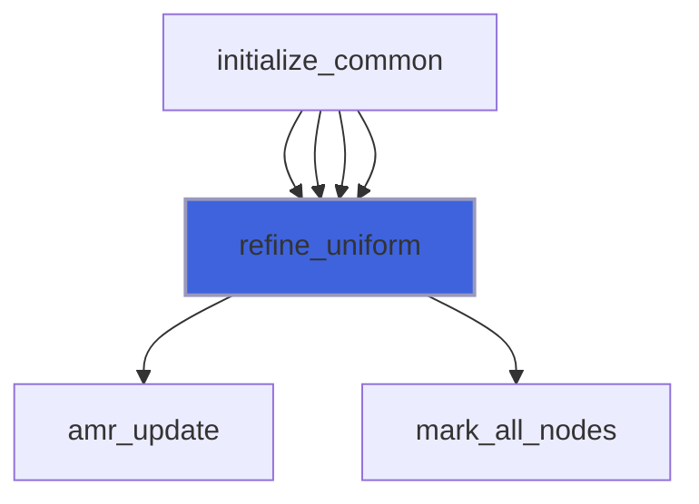

### integrate_eikonal

Integrate eikonal equation.

```fortran
subroutine integrate_eikonal(self, q)
```

**Arguments**

| Name | Type | Intent | Attributes | Description |
|------|------|--------|------------|-------------|
| `self` | class([chase_cpu_object](/api/src/app/chase/cpu/adam_chase_cpu_object#chase-cpu-object)) | inout |  | The equation. |
| `q` | real(kind=[R8P](/api/src/third_party/PENF/src/lib/penf_global_parameters_variables)) | inout |  | Conservative variables. |

**Call graph**

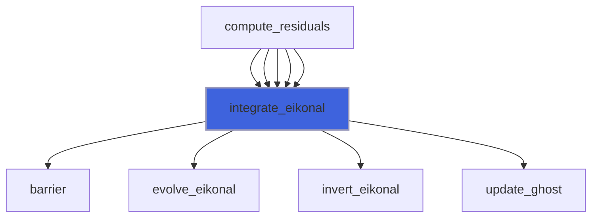

### load_restart_files

Save restart files.

```fortran
subroutine load_restart_files(self, t, time)
```

**Arguments**

| Name | Type | Intent | Attributes | Description |
|------|------|--------|------------|-------------|
| `self` | class([chase_cpu_object](/api/src/app/chase/cpu/adam_chase_cpu_object#chase-cpu-object)) | inout |  | The equation. |
| `t` | integer(kind=[I4P](/api/src/third_party/PENF/src/lib/penf_global_parameters_variables)) | out |  | Time iteration. |
| `time` | real(kind=[R8P](/api/src/third_party/PENF/src/lib/penf_global_parameters_variables)) | out |  | Time. |

**Call graph**

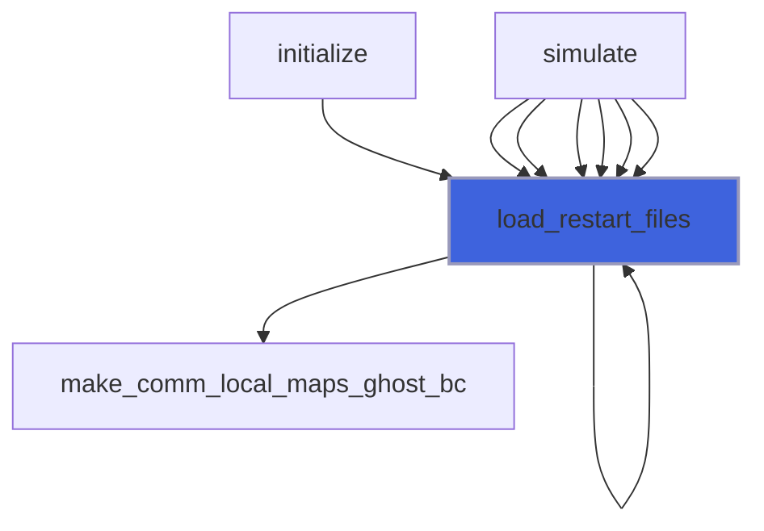

### save_xh5f

Save simulation data in HDF5 format.

```fortran
subroutine save_xh5f(self, output_basename, with_ghost)
```

**Arguments**

| Name | Type | Intent | Attributes | Description |
|------|------|--------|------------|-------------|
| `self` | class([chase_cpu_object](/api/src/app/chase/cpu/adam_chase_cpu_object#chase-cpu-object)) | inout |  | The equation. |
| `output_basename` | character(len=*) | in | optional | Output basename. |
| `with_ghost` | logical | in | optional | Flag to save ghost cells. |

**Call graph**

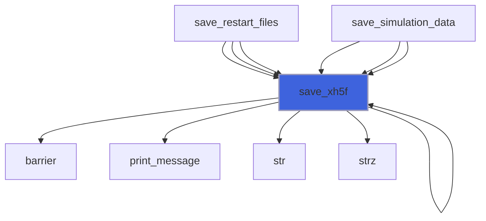

### save_residuals

Save residuals history.

```fortran
subroutine save_residuals(self)
```

**Arguments**

| Name | Type | Intent | Attributes | Description |
|------|------|--------|------------|-------------|
| `self` | class([chase_cpu_object](/api/src/app/chase/cpu/adam_chase_cpu_object#chase-cpu-object)) | inout |  | The equation. |

**Call graph**

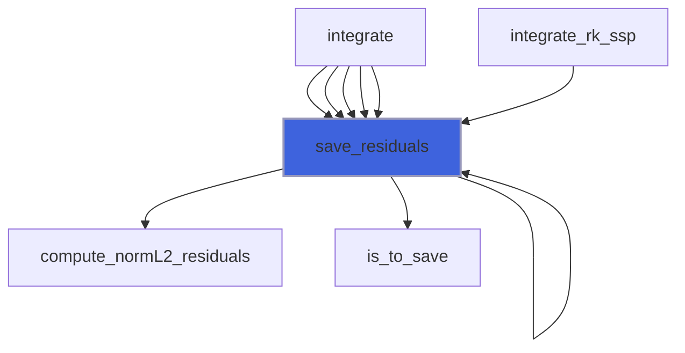

### save_restart_files

Save restart files.

```fortran
subroutine save_restart_files(self)
```

**Arguments**

| Name | Type | Intent | Attributes | Description |
|------|------|--------|------------|-------------|
| `self` | class([chase_cpu_object](/api/src/app/chase/cpu/adam_chase_cpu_object#chase-cpu-object)) | inout |  | The equation. |

**Call graph**

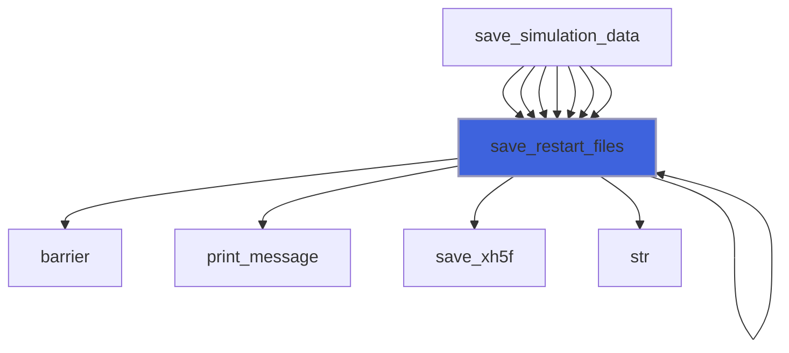

### save_simulation_data

Save all simulation data.

```fortran
subroutine save_simulation_data(self)
```

**Arguments**

| Name | Type | Intent | Attributes | Description |
|------|------|--------|------------|-------------|
| `self` | class([chase_cpu_object](/api/src/app/chase/cpu/adam_chase_cpu_object#chase-cpu-object)) | inout |  | The equation. |

**Call graph**

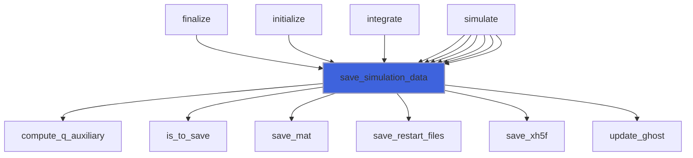

### set_boundary_conditions

Set boundary conditions of equation.

```fortran
subroutine set_boundary_conditions(self, q)
```

**Arguments**

| Name | Type | Intent | Attributes | Description |
|------|------|--------|------------|-------------|
| `self` | class([chase_cpu_object](/api/src/app/chase/cpu/adam_chase_cpu_object#chase-cpu-object)) | in |  | The equation. |
| `q` | real(kind=[R8P](/api/src/third_party/PENF/src/lib/penf_global_parameters_variables)) | inout |  | Conservative variables. |

**Call graph**

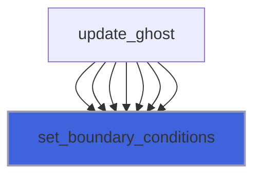

### set_initial_conditions

Set initial conditions and coils on field.

```fortran
subroutine set_initial_conditions(self)
```

**Arguments**

| Name | Type | Intent | Attributes | Description |
|------|------|--------|------------|-------------|
| `self` | class([chase_cpu_object](/api/src/app/chase/cpu/adam_chase_cpu_object#chase-cpu-object)) | inout |  | The equation. |

**Call graph**

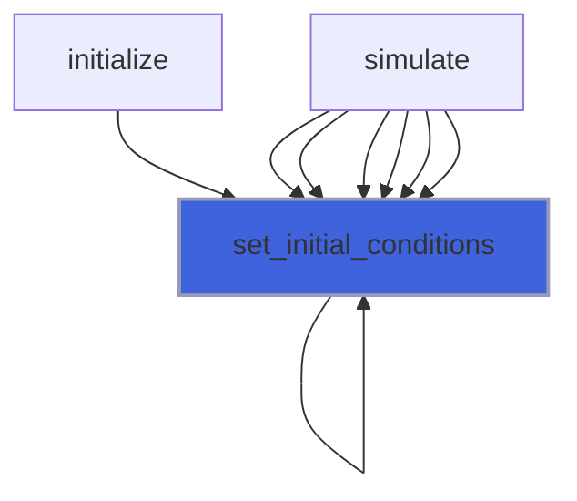

### update_ghost

Update ghost cells.
 If not specified all steps are perfermod, syncronous computation

```fortran
subroutine update_ghost(self, q, step)
```

**Arguments**

| Name | Type | Intent | Attributes | Description |
|------|------|--------|------------|-------------|
| `self` | class([chase_cpu_object](/api/src/app/chase/cpu/adam_chase_cpu_object#chase-cpu-object)) | inout |  | The equation. |
| `q` | real(kind=[R8P](/api/src/third_party/PENF/src/lib/penf_global_parameters_variables)) | inout |  | Conservative variables. |
| `step` | integer(kind=[I4P](/api/src/third_party/PENF/src/lib/penf_global_parameters_variables)) | in | optional | Step to be perfordmed in asyncronous comp. |

**Call graph**

```mermaid
flowchart TD
  amr_update["amr_update"] --> update_ghost["update_ghost"]
  amr_update["amr_update"] --> update_ghost["update_ghost"]
  amr_update["amr_update"] --> update_ghost["update_ghost"]
  amr_update["amr_update"] --> update_ghost["update_ghost"]
  amr_update["amr_update"] --> update_ghost["update_ghost"]
  amr_update["amr_update"] --> update_ghost["update_ghost"]
  compute_residuals["compute_residuals"] --> update_ghost["update_ghost"]
  compute_residuals["compute_residuals"] --> update_ghost["update_ghost"]
  compute_residuals["compute_residuals"] --> update_ghost["update_ghost"]
  compute_residuals["compute_residuals"] --> update_ghost["update_ghost"]
  compute_residuals["compute_residuals"] --> update_ghost["update_ghost"]
  compute_residuals_fd_centered["compute_residuals_fd_centered"] --> update_ghost["update_ghost"]
  integrate_eikonal["integrate_eikonal"] --> update_ghost["update_ghost"]
  integrate_eikonal["integrate_eikonal"] --> update_ghost["update_ghost"]
  integrate_eikonal["integrate_eikonal"] --> update_ghost["update_ghost"]
  integrate_eikonal["integrate_eikonal"] --> update_ghost["update_ghost"]
  integrate_eikonal["integrate_eikonal"] --> update_ghost["update_ghost"]
  integrate_eikonal["integrate_eikonal"] --> update_ghost["update_ghost"]
  mark_by_grad_var["mark_by_grad_var"] --> update_ghost["update_ghost"]
  mark_by_grad_var["mark_by_grad_var"] --> update_ghost["update_ghost"]
  mark_by_grad_var["mark_by_grad_var"] --> update_ghost["update_ghost"]
  mark_by_grad_var["mark_by_grad_var"] --> update_ghost["update_ghost"]
  mark_by_grad_var["mark_by_grad_var"] --> update_ghost["update_ghost"]
  save_simulation_data["save_simulation_data"] --> update_ghost["update_ghost"]
  save_simulation_data["save_simulation_data"] --> update_ghost["update_ghost"]
  save_simulation_data["save_simulation_data"] --> update_ghost["update_ghost"]
  save_simulation_data["save_simulation_data"] --> update_ghost["update_ghost"]
  save_simulation_data["save_simulation_data"] --> update_ghost["update_ghost"]
  save_simulation_data["save_simulation_data"] --> update_ghost["update_ghost"]
  save_simulation_data["save_simulation_data"] --> update_ghost["update_ghost"]
  update_ghost["update_ghost"] --> set_boundary_conditions["set_boundary_conditions"]
  update_ghost["update_ghost"] --> update_ghost_local["update_ghost_local"]
  update_ghost["update_ghost"] --> update_ghost_mpi["update_ghost_mpi"]
  style update_ghost fill:#3e63dd,stroke:#99b,stroke-width:2px
```

### compute_dt

Compute maximum time step accordingly to CFL stabilty criterion.

```fortran
subroutine compute_dt(self)
```

**Arguments**

| Name | Type | Intent | Attributes | Description |
|------|------|--------|------------|-------------|
| `self` | class([chase_cpu_object](/api/src/app/chase/cpu/adam_chase_cpu_object#chase-cpu-object)) | inout |  | The equation. |

**Call graph**

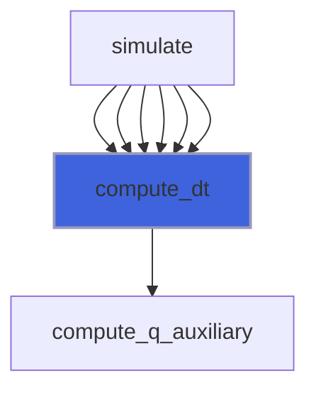

### compute_q_auxiliary

Compute auxiliary variables.

```fortran
subroutine compute_q_auxiliary(self, q, q_aux)
```

**Arguments**

| Name | Type | Intent | Attributes | Description |
|------|------|--------|------------|-------------|
| `self` | class([chase_cpu_object](/api/src/app/chase/cpu/adam_chase_cpu_object#chase-cpu-object)) | in |  | The equation. |
| `q` | real(kind=[R8P](/api/src/third_party/PENF/src/lib/penf_global_parameters_variables)) | in |  | Conservative variables. |
| `q_aux` | real(kind=[R8P](/api/src/third_party/PENF/src/lib/penf_global_parameters_variables)) | out |  | Auxiliary variables. |

**Call graph**

```mermaid
flowchart TD
  compute_dt["compute_dt"] --> compute_q_auxiliary["compute_q_auxiliary"]
  compute_dt["compute_dt"] --> compute_q_auxiliary["compute_q_auxiliary"]
  compute_dt["compute_dt"] --> compute_q_auxiliary["compute_q_auxiliary"]
  compute_dt["compute_dt"] --> compute_q_auxiliary["compute_q_auxiliary"]
  compute_dt["compute_dt"] --> compute_q_auxiliary["compute_q_auxiliary"]
  compute_residuals["compute_residuals"] --> compute_q_auxiliary["compute_q_auxiliary"]
  compute_residuals["compute_residuals"] --> compute_q_auxiliary["compute_q_auxiliary"]
  compute_residuals["compute_residuals"] --> compute_q_auxiliary["compute_q_auxiliary"]
  compute_residuals["compute_residuals"] --> compute_q_auxiliary["compute_q_auxiliary"]
  compute_residuals["compute_residuals"] --> compute_q_auxiliary["compute_q_auxiliary"]
  copy_gpu_cpu["copy_gpu_cpu"] --> compute_q_auxiliary["compute_q_auxiliary"]
  copy_gpu_cpu["copy_gpu_cpu"] --> compute_q_auxiliary["compute_q_auxiliary"]
  copy_gpu_cpu["copy_gpu_cpu"] --> compute_q_auxiliary["compute_q_auxiliary"]
  mark_by_grad_var["mark_by_grad_var"] --> compute_q_auxiliary["compute_q_auxiliary"]
  mark_by_grad_var["mark_by_grad_var"] --> compute_q_auxiliary["compute_q_auxiliary"]
  mark_by_grad_var["mark_by_grad_var"] --> compute_q_auxiliary["compute_q_auxiliary"]
  mark_by_grad_var["mark_by_grad_var"] --> compute_q_auxiliary["compute_q_auxiliary"]
  mark_by_grad_var["mark_by_grad_var"] --> compute_q_auxiliary["compute_q_auxiliary"]
  save_simulation_data["save_simulation_data"] --> compute_q_auxiliary["compute_q_auxiliary"]
  save_simulation_data["save_simulation_data"] --> compute_q_auxiliary["compute_q_auxiliary"]
  compute_q_auxiliary["compute_q_auxiliary"] --> compute_auxiliary["compute_auxiliary"]
  style compute_q_auxiliary fill:#3e63dd,stroke:#99b,stroke-width:2px
```

### compute_residuals

Compute residuals of equation.

```fortran
subroutine compute_residuals(self, q, q_aux, dq)
```

**Arguments**

| Name | Type | Intent | Attributes | Description |
|------|------|--------|------------|-------------|
| `self` | class([chase_cpu_object](/api/src/app/chase/cpu/adam_chase_cpu_object#chase-cpu-object)) | inout |  | The equation. |
| `q` | real(kind=[R8P](/api/src/third_party/PENF/src/lib/penf_global_parameters_variables)) | inout |  | Conservative variables. |
| `q_aux` | real(kind=[R8P](/api/src/third_party/PENF/src/lib/penf_global_parameters_variables)) | inout |  | Auxiliary variables. |
| `dq` | real(kind=[R8P](/api/src/third_party/PENF/src/lib/penf_global_parameters_variables)) | inout |  | Residuals. |

**Call graph**

```mermaid
flowchart TD
  integrate["integrate"] --> compute_residuals["compute_residuals"]
  integrate["integrate"] --> compute_residuals["compute_residuals"]
  integrate["integrate"] --> compute_residuals["compute_residuals"]
  integrate["integrate"] --> compute_residuals["compute_residuals"]
  integrate["integrate"] --> compute_residuals["compute_residuals"]
  compute_residuals["compute_residuals"] --> assign_omp["assign_omp"]
  compute_residuals["compute_residuals"] --> compute_fluxes_convective["compute_fluxes_convective"]
  compute_residuals["compute_residuals"] --> compute_fluxes_difference["compute_fluxes_difference"]
  compute_residuals["compute_residuals"] --> compute_q_auxiliary["compute_q_auxiliary"]
  compute_residuals["compute_residuals"] --> integrate_eikonal["integrate_eikonal"]
  compute_residuals["compute_residuals"] --> update_ghost["update_ghost"]
  style compute_residuals fill:#3e63dd,stroke:#99b,stroke-width:2px
```

### integrate

Perform one step integration.

```fortran
subroutine integrate(self, do_ghost_syncro)
```

**Arguments**

| Name | Type | Intent | Attributes | Description |
|------|------|--------|------------|-------------|
| `self` | class([chase_cpu_object](/api/src/app/chase/cpu/adam_chase_cpu_object#chase-cpu-object)) | inout |  | The equation. |
| `do_ghost_syncro` | logical | in | optional | Flag to do syncrous ghost update. |

**Call graph**

```mermaid
flowchart TD
  simulate["simulate"] --> integrate["integrate"]
  simulate["simulate"] --> integrate["integrate"]
  simulate["simulate"] --> integrate["integrate"]
  simulate["simulate"] --> integrate["integrate"]
  simulate["simulate"] --> integrate["integrate"]
  simulate["simulate"] --> integrate["integrate"]
  integrate["integrate"] --> assign_stage["assign_stage"]
  integrate["integrate"] --> compute_residuals["compute_residuals"]
  integrate["integrate"] --> compute_stage["compute_stage"]
  integrate["integrate"] --> compute_stage_ls["compute_stage_ls"]
  integrate["integrate"] --> initialize_stages["initialize_stages"]
  integrate["integrate"] --> save_residuals["save_residuals"]
  integrate["integrate"] --> update_q["update_q"]
  style integrate fill:#3e63dd,stroke:#99b,stroke-width:2px
```

### simulate

Perform the simulation.

```fortran
subroutine simulate(self, filename)
```

**Arguments**

| Name | Type | Intent | Attributes | Description |
|------|------|--------|------------|-------------|
| `self` | class([chase_cpu_object](/api/src/app/chase/cpu/adam_chase_cpu_object#chase-cpu-object)) | inout |  | The equation. |
| `filename` | character(len=*) | in |  | Input file name. |

**Call graph**

```mermaid
flowchart TD
  simulate["simulate"] --> amr_update["amr_update"]
  simulate["simulate"] --> barrier["barrier"]
  simulate["simulate"] --> close_file_residuals["close_file_residuals"]
  simulate["simulate"] --> compute_dt["compute_dt"]
  simulate["simulate"] --> compute_phi["compute_phi"]
  simulate["simulate"] --> finalize["finalize"]
  simulate["simulate"] --> initialize["initialize"]
  simulate["simulate"] --> integrate["integrate"]
  simulate["simulate"] --> load_restart_files["load_restart_files"]
  simulate["simulate"] --> open_file_residuals["open_file_residuals"]
  simulate["simulate"] --> print_message["print_message"]
  simulate["simulate"] --> print_progress["print_progress"]
  simulate["simulate"] --> save_memory_status["save_memory_status"]
  simulate["simulate"] --> save_simulation_data["save_simulation_data"]
  simulate["simulate"] --> set_initial_conditions["set_initial_conditions"]
  simulate["simulate"] --> str["str"]
  style simulate fill:#3e63dd,stroke:#99b,stroke-width:2px
```

### assign_omp_R8P_5D

Assign array to scalar value with OpenMP threads (kind R8P, rank 5)

```fortran
subroutine assign_omp_R8P_5D(blocks_number, ngc, lhs, rhs)
```

**Arguments**

| Name | Type | Intent | Attributes | Description |
|------|------|--------|------------|-------------|
| `blocks_number` | integer(kind=[I4P](/api/src/third_party/PENF/src/lib/penf_global_parameters_variables)) | in |  | Number of blocks. |
| `ngc` | integer(kind=[I4P](/api/src/third_party/PENF/src/lib/penf_global_parameters_variables)) | in |  | Ghost cells number. |
| `lhs` | real(kind=[R8P](/api/src/third_party/PENF/src/lib/penf_global_parameters_variables)) | inout |  | Lest hand side. |
| `rhs` | real(kind=[R8P](/api/src/third_party/PENF/src/lib/penf_global_parameters_variables)) | in |  | Right hand side. |

### compute_fluxes_convective

Compute convective fluxes along direction `dir`.

```fortran
subroutine compute_fluxes_convective(dir, blocks_number, ni, nj, nk, ngc, nv, g, weno_s, weno_zeps, weno_a, weno_p, weno_d, q_aux, fluxes)
```

**Arguments**

| Name | Type | Intent | Attributes | Description |
|------|------|--------|------------|-------------|
| `dir` | integer(kind=[I4P](/api/src/third_party/PENF/src/lib/penf_global_parameters_variables)) | in |  | Direction, 1=X, 2=Y, 3=Z. |
| `blocks_number` | integer(kind=[I4P](/api/src/third_party/PENF/src/lib/penf_global_parameters_variables)) | in |  | Number of blocks. |
| `ni` | integer(kind=[I4P](/api/src/third_party/PENF/src/lib/penf_global_parameters_variables)) | in |  | Grid cells number in I direction. |
| `nj` | integer(kind=[I4P](/api/src/third_party/PENF/src/lib/penf_global_parameters_variables)) | in |  | Grid cells number in J direction. |
| `nk` | integer(kind=[I4P](/api/src/third_party/PENF/src/lib/penf_global_parameters_variables)) | in |  | Grid cells number in K direction. |
| `ngc` | integer(kind=[I4P](/api/src/third_party/PENF/src/lib/penf_global_parameters_variables)) | in |  | Ghost cells number. |
| `nv` | integer(kind=[I4P](/api/src/third_party/PENF/src/lib/penf_global_parameters_variables)) | in |  | Number of conservative varibales. |
| `g` | real(kind=[R8P](/api/src/third_party/PENF/src/lib/penf_global_parameters_variables)) | in |  | Specific heats ratio. |
| `weno_s` | integer(kind=[I4P](/api/src/third_party/PENF/src/lib/penf_global_parameters_variables)) | in |  | Weno stencils number/dimension. |
| `weno_zeps` | real(kind=[R8P](/api/src/third_party/PENF/src/lib/penf_global_parameters_variables)) | in |  | Parameter for avoiding division by zero in computing IS. |
| `weno_a` | real(kind=[R8P](/api/src/third_party/PENF/src/lib/penf_global_parameters_variables)) | in |  | Optimal weights. |
| `weno_p` | real(kind=[R8P](/api/src/third_party/PENF/src/lib/penf_global_parameters_variables)) | in |  | Polinomials coefficients. |
| `weno_d` | real(kind=[R8P](/api/src/third_party/PENF/src/lib/penf_global_parameters_variables)) | in |  | Smoothness indicators coefficients. |
| `q_aux` | real(kind=[R8P](/api/src/third_party/PENF/src/lib/penf_global_parameters_variables)) | in |  | Auxiliary variables. |
| `fluxes` | real(kind=[R8P](/api/src/third_party/PENF/src/lib/penf_global_parameters_variables)) | inout |  | Fluxes. |

**Call graph**

```mermaid
flowchart TD
  compute_residuals["compute_residuals"] --> compute_fluxes_convective["compute_fluxes_convective"]
  compute_residuals["compute_residuals"] --> compute_fluxes_convective["compute_fluxes_convective"]
  compute_fluxes_convective["compute_fluxes_convective"] --> compute_fluxes_convective_ri["compute_fluxes_convective_ri"]
  style compute_fluxes_convective fill:#3e63dd,stroke:#99b,stroke-width:2px
```

### compute_fluxes_convective_ri

Compute convective fluxes at right interface of b,i,j,k.

```fortran
subroutine compute_fluxes_convective_ri(dir, b, i, j, k, ngc, nv, weno_s, weno_zeps, weno_a, weno_p, weno_d, si, sir, g, q_aux, fluxes)
```

**Arguments**

| Name | Type | Intent | Attributes | Description |
|------|------|--------|------------|-------------|
| `dir` | integer(kind=[I4P](/api/src/third_party/PENF/src/lib/penf_global_parameters_variables)) | in |  | Direction, 1=X, 2=Y, 3=Z. |
| `b` | integer(kind=[I4P](/api/src/third_party/PENF/src/lib/penf_global_parameters_variables)) | in |  | Counter. |
| `i` | integer(kind=[I4P](/api/src/third_party/PENF/src/lib/penf_global_parameters_variables)) | in |  | Counter. |
| `j` | integer(kind=[I4P](/api/src/third_party/PENF/src/lib/penf_global_parameters_variables)) | in |  | Counter. |
| `k` | integer(kind=[I4P](/api/src/third_party/PENF/src/lib/penf_global_parameters_variables)) | in |  | Counter. |
| `ngc` | integer(kind=[I4P](/api/src/third_party/PENF/src/lib/penf_global_parameters_variables)) | in |  | Ghost cells number. |
| `nv` | integer(kind=[I4P](/api/src/third_party/PENF/src/lib/penf_global_parameters_variables)) | in |  | Number of conservative varibales. |
| `weno_s` | integer(kind=[I4P](/api/src/third_party/PENF/src/lib/penf_global_parameters_variables)) | in |  | Weno stencils number/dimension. |
| `weno_zeps` | real(kind=[R8P](/api/src/third_party/PENF/src/lib/penf_global_parameters_variables)) | in |  | Parameter to avoid division by zero. |
| `weno_a` | real(kind=[R8P](/api/src/third_party/PENF/src/lib/penf_global_parameters_variables)) | in |  | Optimal weights. |
| `weno_p` | real(kind=[R8P](/api/src/third_party/PENF/src/lib/penf_global_parameters_variables)) | in |  | Polinomials coefficients. |
| `weno_d` | real(kind=[R8P](/api/src/third_party/PENF/src/lib/penf_global_parameters_variables)) | in |  | Smoothness indicators coefficients. |
| `si` | integer(kind=[I4P](/api/src/third_party/PENF/src/lib/penf_global_parameters_variables)) | in |  | Stencil increment. |
| `sir` | real(kind=[R8P](/api/src/third_party/PENF/src/lib/penf_global_parameters_variables)) | in |  | Stencil increment, real cast. |
| `g` | real(kind=[R8P](/api/src/third_party/PENF/src/lib/penf_global_parameters_variables)) | in |  | Specific heats ratio. |
| `q_aux` | real(kind=[R8P](/api/src/third_party/PENF/src/lib/penf_global_parameters_variables)) | in |  | Auxiliary variables. |
| `fluxes` | real(kind=[R8P](/api/src/third_party/PENF/src/lib/penf_global_parameters_variables)) | inout |  | Fluxes. |

**Call graph**

```mermaid
flowchart TD
  compute_fluxes_convective["compute_fluxes_convective"] --> compute_fluxes_convective_ri["compute_fluxes_convective_ri"]
  compute_fluxes_convective_ri["compute_fluxes_convective_ri"] --> compute_eigenvectors["compute_eigenvectors"]
  compute_fluxes_convective_ri["compute_fluxes_convective_ri"] --> decompose_fluxes_convective["decompose_fluxes_convective"]
  compute_fluxes_convective_ri["compute_fluxes_convective_ri"] --> weno_reconstruct_upwind["weno_reconstruct_upwind"]
  style compute_fluxes_convective_ri fill:#3e63dd,stroke:#99b,stroke-width:2px
```

### compute_fluxes_difference

Compute fluxes difference.

```fortran
subroutine compute_fluxes_difference(null_xyz, blocks_number, ni, nj, nk, ngc, nv, ib_eps, dx, dy, dz, flx, fly, flz, phi, dq)
```

**Arguments**

| Name | Type | Intent | Attributes | Description |
|------|------|--------|------------|-------------|
| `null_xyz` | logical | in |  | Nullified directions tags. |
| `blocks_number` | integer(kind=[I4P](/api/src/third_party/PENF/src/lib/penf_global_parameters_variables)) | in |  | Number of blocks. |
| `ni` | integer(kind=[I4P](/api/src/third_party/PENF/src/lib/penf_global_parameters_variables)) | in |  | Grid cells number in I direction. |
| `nj` | integer(kind=[I4P](/api/src/third_party/PENF/src/lib/penf_global_parameters_variables)) | in |  | Grid cells number in J direction. |
| `nk` | integer(kind=[I4P](/api/src/third_party/PENF/src/lib/penf_global_parameters_variables)) | in |  | Grid cells number in K direction. |
| `ngc` | integer(kind=[I4P](/api/src/third_party/PENF/src/lib/penf_global_parameters_variables)) | in |  | Ghost cells number. |
| `nv` | integer(kind=[I4P](/api/src/third_party/PENF/src/lib/penf_global_parameters_variables)) | in |  | Number of conservative varibales. |
| `ib_eps` | real(kind=[R8P](/api/src/third_party/PENF/src/lib/penf_global_parameters_variables)) | in |  | Tolerance IB delta ratio. |
| `dx` | real(kind=[R8P](/api/src/third_party/PENF/src/lib/penf_global_parameters_variables)) | in |  | Space steps. |
| `dy` | real(kind=[R8P](/api/src/third_party/PENF/src/lib/penf_global_parameters_variables)) | in |  | Space steps. |
| `dz` | real(kind=[R8P](/api/src/third_party/PENF/src/lib/penf_global_parameters_variables)) | in |  | Space steps. |
| `flx` | real(kind=[R8P](/api/src/third_party/PENF/src/lib/penf_global_parameters_variables)) | in |  | X direction fluxes. |
| `fly` | real(kind=[R8P](/api/src/third_party/PENF/src/lib/penf_global_parameters_variables)) | in |  | Y direction fluxes. |
| `flz` | real(kind=[R8P](/api/src/third_party/PENF/src/lib/penf_global_parameters_variables)) | in |  | Z direction fluxes. |
| `phi` | real(kind=[R8P](/api/src/third_party/PENF/src/lib/penf_global_parameters_variables)) | in | optional | IB distance function. |
| `dq` | real(kind=[R8P](/api/src/third_party/PENF/src/lib/penf_global_parameters_variables)) | inout |  | Fluxes differences. |

**Call graph**

```mermaid
flowchart TD
  compute_residuals["compute_residuals"] --> compute_fluxes_difference["compute_fluxes_difference"]
  compute_residuals["compute_residuals"] --> compute_fluxes_difference["compute_fluxes_difference"]
  style compute_fluxes_difference fill:#3e63dd,stroke:#99b,stroke-width:2px
```

### compute_eigenvectors

**Attributes**: pure

```fortran
subroutine compute_eigenvectors(si, sir, b, i, j, k, ngc, nv, g, q_aux, el, er)
```

**Arguments**

| Name | Type | Intent | Attributes | Description |
|------|------|--------|------------|-------------|
| `si` | integer(kind=[I4P](/api/src/third_party/PENF/src/lib/penf_global_parameters_variables)) | in |  | Directional (1=x,2=y,3=z) increment. |
| `sir` | real(kind=[R8P](/api/src/third_party/PENF/src/lib/penf_global_parameters_variables)) | in |  | Directional (1=x,2=y,3=z) increment. |
| `b` | integer(kind=[I4P](/api/src/third_party/PENF/src/lib/penf_global_parameters_variables)) | in |  | Cell indexes. |
| `i` | integer(kind=[I4P](/api/src/third_party/PENF/src/lib/penf_global_parameters_variables)) | in |  | Cell indexes. |
| `j` | integer(kind=[I4P](/api/src/third_party/PENF/src/lib/penf_global_parameters_variables)) | in |  | Cell indexes. |
| `k` | integer(kind=[I4P](/api/src/third_party/PENF/src/lib/penf_global_parameters_variables)) | in |  | Cell indexes. |
| `ngc` | integer(kind=[I4P](/api/src/third_party/PENF/src/lib/penf_global_parameters_variables)) | in |  | Ghost cells number. |
| `nv` | integer(kind=[I4P](/api/src/third_party/PENF/src/lib/penf_global_parameters_variables)) | in |  | Number of conservative varibales. |
| `g` | real(kind=[R8P](/api/src/third_party/PENF/src/lib/penf_global_parameters_variables)) | in |  | Specific heats ratio. |
| `q_aux` | real(kind=[R8P](/api/src/third_party/PENF/src/lib/penf_global_parameters_variables)) | in |  | Auxiliary variables. |
| `el` | real(kind=[R8P](/api/src/third_party/PENF/src/lib/penf_global_parameters_variables)) | inout |  | Left and right eigenvectors. |
| `er` | real(kind=[R8P](/api/src/third_party/PENF/src/lib/penf_global_parameters_variables)) | inout |  | Left and right eigenvectors. |

**Call graph**

```mermaid
flowchart TD
  compute_fluxes_convective_ri["compute_fluxes_convective_ri"] --> compute_eigenvectors["compute_eigenvectors"]
  compute_eigenvectors["compute_eigenvectors"] --> compute_roe_average["compute_roe_average"]
  style compute_eigenvectors fill:#3e63dd,stroke:#99b,stroke-width:2px
```

### compute_max_eigenvalues

**Attributes**: pure

```fortran
subroutine compute_max_eigenvalues(si, weno_s, b, i, j, k, ngc, nv, q_aux, evmax)
```

**Arguments**

| Name | Type | Intent | Attributes | Description |
|------|------|--------|------------|-------------|
| `si` | integer(kind=[I4P](/api/src/third_party/PENF/src/lib/penf_global_parameters_variables)) | in |  | Directional (1=x,2=y,3=z) increment. |
| `weno_s` | integer(kind=[I4P](/api/src/third_party/PENF/src/lib/penf_global_parameters_variables)) | in |  | Weno stencils number/dimension. |
| `b` | integer(kind=[I4P](/api/src/third_party/PENF/src/lib/penf_global_parameters_variables)) | in |  | Cell indexes. |
| `i` | integer(kind=[I4P](/api/src/third_party/PENF/src/lib/penf_global_parameters_variables)) | in |  | Cell indexes. |
| `j` | integer(kind=[I4P](/api/src/third_party/PENF/src/lib/penf_global_parameters_variables)) | in |  | Cell indexes. |
| `k` | integer(kind=[I4P](/api/src/third_party/PENF/src/lib/penf_global_parameters_variables)) | in |  | Cell indexes. |
| `ngc` | integer(kind=[I4P](/api/src/third_party/PENF/src/lib/penf_global_parameters_variables)) | in |  | Ghost cells number. |
| `nv` | integer(kind=[I4P](/api/src/third_party/PENF/src/lib/penf_global_parameters_variables)) | in |  | Number of conservative varibales. |
| `q_aux` | real(kind=[R8P](/api/src/third_party/PENF/src/lib/penf_global_parameters_variables)) | in |  | Auxiliary variables. |
| `evmax` | real(kind=[R8P](/api/src/third_party/PENF/src/lib/penf_global_parameters_variables)) | out |  | Maximum eigenvalue in the big stencil. |

**Call graph**

```mermaid
flowchart TD
  compute_fluxes_convective["compute_fluxes_convective"] --> compute_max_eigenvalues["compute_max_eigenvalues"]
  decompose_fluxes_convective["decompose_fluxes_convective"] --> compute_max_eigenvalues["compute_max_eigenvalues"]
  decompose_fluxes_convective["decompose_fluxes_convective"] --> compute_max_eigenvalues["compute_max_eigenvalues"]
  style compute_max_eigenvalues fill:#3e63dd,stroke:#99b,stroke-width:2px
```

### compute_q_gradient

Compute gradient of q(ivar).

```fortran
subroutine compute_q_gradient(b, ni, nj, nk, ngc, dx, dy, dz, q, ivar, gradient)
```

**Arguments**

| Name | Type | Intent | Attributes | Description |
|------|------|--------|------------|-------------|
| `b` | integer(kind=[I4P](/api/src/third_party/PENF/src/lib/penf_global_parameters_variables)) | in |  | Block index. |
| `ni` | integer(kind=[I4P](/api/src/third_party/PENF/src/lib/penf_global_parameters_variables)) | in |  | Grid cells number in I direction. |
| `nj` | integer(kind=[I4P](/api/src/third_party/PENF/src/lib/penf_global_parameters_variables)) | in |  | Grid cells number in J direction. |
| `nk` | integer(kind=[I4P](/api/src/third_party/PENF/src/lib/penf_global_parameters_variables)) | in |  | Grid cells number in K direction. |
| `ngc` | integer(kind=[I4P](/api/src/third_party/PENF/src/lib/penf_global_parameters_variables)) | in |  | Ghost cells number. |
| `dx` | real(kind=[R8P](/api/src/third_party/PENF/src/lib/penf_global_parameters_variables)) | in |  | X space step. |
| `dy` | real(kind=[R8P](/api/src/third_party/PENF/src/lib/penf_global_parameters_variables)) | in |  | Y space step. |
| `dz` | real(kind=[R8P](/api/src/third_party/PENF/src/lib/penf_global_parameters_variables)) | in |  | Z space step. |
| `q` | real(kind=[R8P](/api/src/third_party/PENF/src/lib/penf_global_parameters_variables)) | in |  | Field component to which apply gradient. |
| `ivar` | integer(kind=[I4P](/api/src/third_party/PENF/src/lib/penf_global_parameters_variables)) | in |  | Index of variable for computing the gradient. |
| `gradient` | real(kind=[R8P](/api/src/third_party/PENF/src/lib/penf_global_parameters_variables)) | out |  | Maximum gradient of q. |

**Call graph**

```mermaid
flowchart TD
  mark_by_grad_var["mark_by_grad_var"] --> compute_q_gradient["compute_q_gradient"]
  mark_by_grad_var["mark_by_grad_var"] --> compute_q_gradient["compute_q_gradient"]
  mark_by_grad_var["mark_by_grad_var"] --> compute_q_gradient["compute_q_gradient"]
  mark_by_grad_var["mark_by_grad_var"] --> compute_q_gradient["compute_q_gradient"]
  mark_by_grad_var["mark_by_grad_var"] --> compute_q_gradient["compute_q_gradient"]
  style compute_q_gradient fill:#3e63dd,stroke:#99b,stroke-width:2px
```

### compute_roe_average

Compute Roe averaged quantities.

**Attributes**: pure

```fortran
subroutine compute_roe_average(ngc, b, i, j, k, ip, jp, kp, g, q_aux, uu, vv, ww, h, qq, c, ci, b1, b2)
```

**Arguments**

| Name | Type | Intent | Attributes | Description |
|------|------|--------|------------|-------------|
| `ngc` | integer(kind=[I4P](/api/src/third_party/PENF/src/lib/penf_global_parameters_variables)) | in |  | Number of ghost cells. |
| `b` | integer(kind=[I4P](/api/src/third_party/PENF/src/lib/penf_global_parameters_variables)) | in |  | Left/right cells indexes. |
| `i` | integer(kind=[I4P](/api/src/third_party/PENF/src/lib/penf_global_parameters_variables)) | in |  | Left/right cells indexes. |
| `j` | integer(kind=[I4P](/api/src/third_party/PENF/src/lib/penf_global_parameters_variables)) | in |  | Left/right cells indexes. |
| `k` | integer(kind=[I4P](/api/src/third_party/PENF/src/lib/penf_global_parameters_variables)) | in |  | Left/right cells indexes. |
| `ip` | integer(kind=[I4P](/api/src/third_party/PENF/src/lib/penf_global_parameters_variables)) | in |  | Left/right cells indexes. |
| `jp` | integer(kind=[I4P](/api/src/third_party/PENF/src/lib/penf_global_parameters_variables)) | in |  | Left/right cells indexes. |
| `kp` | integer(kind=[I4P](/api/src/third_party/PENF/src/lib/penf_global_parameters_variables)) | in |  | Left/right cells indexes. |
| `g` | real(kind=[R8P](/api/src/third_party/PENF/src/lib/penf_global_parameters_variables)) | in |  | Specific heats ratio. |
| `q_aux` | real(kind=[R8P](/api/src/third_party/PENF/src/lib/penf_global_parameters_variables)) | in |  | Auxiliary variables. |
| `uu` | real(kind=[R8P](/api/src/third_party/PENF/src/lib/penf_global_parameters_variables)) | out |  | Roe state average variables. |
| `vv` | real(kind=[R8P](/api/src/third_party/PENF/src/lib/penf_global_parameters_variables)) | out |  | Roe state average variables. |
| `ww` | real(kind=[R8P](/api/src/third_party/PENF/src/lib/penf_global_parameters_variables)) | out |  | Roe state average variables. |
| `h` | real(kind=[R8P](/api/src/third_party/PENF/src/lib/penf_global_parameters_variables)) | out |  | Roe state average variables. |
| `qq` | real(kind=[R8P](/api/src/third_party/PENF/src/lib/penf_global_parameters_variables)) | out |  | Roe state average variables. |
| `c` | real(kind=[R8P](/api/src/third_party/PENF/src/lib/penf_global_parameters_variables)) | out |  | Roe state average variables. |
| `ci` | real(kind=[R8P](/api/src/third_party/PENF/src/lib/penf_global_parameters_variables)) | out |  | Roe state average variables. |
| `b1` | real(kind=[R8P](/api/src/third_party/PENF/src/lib/penf_global_parameters_variables)) | out |  | Roe state average variables. |
| `b2` | real(kind=[R8P](/api/src/third_party/PENF/src/lib/penf_global_parameters_variables)) | out |  | Roe state average variables. |

**Call graph**

```mermaid
flowchart TD
  compute_eigenvectors["compute_eigenvectors"] --> compute_roe_average["compute_roe_average"]
  compute_eigenvectors["compute_eigenvectors"] --> compute_roe_average["compute_roe_average"]
  style compute_roe_average fill:#3e63dd,stroke:#99b,stroke-width:2px
```

### decompose_fluxes_convective

Decompose convective fluxes.
 Flux vector splitting by local-Lax-Friedrics (Rusanov) with projection in pseudo-characteristics space.

**Attributes**: pure

```fortran
subroutine decompose_fluxes_convective(weno_s, b, i, j, k, ngc, nv, si, sir, el, q_aux, fmpc)
```

**Arguments**

| Name | Type | Intent | Attributes | Description |
|------|------|--------|------------|-------------|
| `weno_s` | integer(kind=[I4P](/api/src/third_party/PENF/src/lib/penf_global_parameters_variables)) | in |  | Weno stencils number/dimension. |
| `b` | integer(kind=[I4P](/api/src/third_party/PENF/src/lib/penf_global_parameters_variables)) | in |  | Counter. |
| `i` | integer(kind=[I4P](/api/src/third_party/PENF/src/lib/penf_global_parameters_variables)) | in |  | Counter. |
| `j` | integer(kind=[I4P](/api/src/third_party/PENF/src/lib/penf_global_parameters_variables)) | in |  | Counter. |
| `k` | integer(kind=[I4P](/api/src/third_party/PENF/src/lib/penf_global_parameters_variables)) | in |  | Counter. |
| `ngc` | integer(kind=[I4P](/api/src/third_party/PENF/src/lib/penf_global_parameters_variables)) | in |  | Ghost cells number. |
| `nv` | integer(kind=[I4P](/api/src/third_party/PENF/src/lib/penf_global_parameters_variables)) | in |  | Number of conservative varibales. |
| `si` | integer(kind=[I4P](/api/src/third_party/PENF/src/lib/penf_global_parameters_variables)) | in |  | Stencil increment. |
| `sir` | real(kind=[R8P](/api/src/third_party/PENF/src/lib/penf_global_parameters_variables)) | in |  | Stencil increment, real cast. |
| `el` | real(kind=[R8P](/api/src/third_party/PENF/src/lib/penf_global_parameters_variables)) | in |  | Left eigeinvectors. |
| `q_aux` | real(kind=[R8P](/api/src/third_party/PENF/src/lib/penf_global_parameters_variables)) | in |  | Auxiliary variables. |
| `fmpc` | real(kind=[R8P](/api/src/third_party/PENF/src/lib/penf_global_parameters_variables)) | inout |  | Fluxes -+ decomposition in characteristics space. |

**Call graph**

```mermaid
flowchart TD
  compute_fluxes_convective_ri["compute_fluxes_convective_ri"] --> decompose_fluxes_convective["decompose_fluxes_convective"]
  decompose_fluxes_convective["decompose_fluxes_convective"] --> compute_conservative["compute_conservative"]
  decompose_fluxes_convective["decompose_fluxes_convective"] --> compute_fluxes_conservative["compute_fluxes_conservative"]
  decompose_fluxes_convective["decompose_fluxes_convective"] --> compute_max_eigenvalues["compute_max_eigenvalues"]
  style decompose_fluxes_convective fill:#3e63dd,stroke:#99b,stroke-width:2px
```
