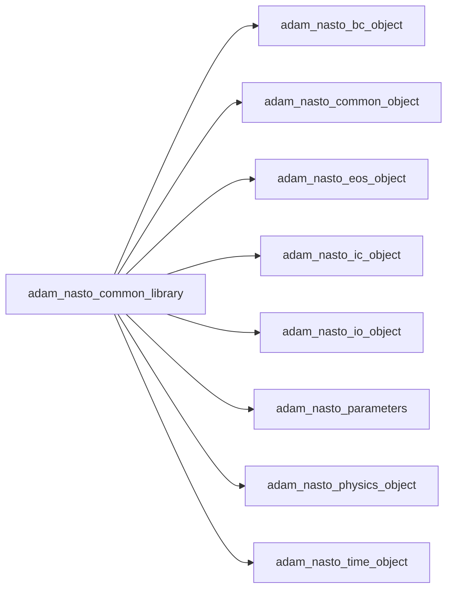

# adam_nasto_common_library

> ADAM NASTO common library, entry for all NASTO common classes and libraries.

**Source**: `src/app/nasto/common/adam_nasto_common_library.F90`

**Dependencies**

```mermaid
graph LR
  adam_nasto_common_library["adam_nasto_common_library"] --> adam_nasto_bc_object["adam_nasto_bc_object"]
  adam_nasto_common_library["adam_nasto_common_library"] --> adam_nasto_common_object["adam_nasto_common_object"]
  adam_nasto_common_library["adam_nasto_common_library"] --> adam_nasto_eos_object["adam_nasto_eos_object"]
  adam_nasto_common_library["adam_nasto_common_library"] --> adam_nasto_ic_object["adam_nasto_ic_object"]
  adam_nasto_common_library["adam_nasto_common_library"] --> adam_nasto_io_object["adam_nasto_io_object"]
  adam_nasto_common_library["adam_nasto_common_library"] --> adam_nasto_parameters["adam_nasto_parameters"]
  adam_nasto_common_library["adam_nasto_common_library"] --> adam_nasto_physics_object["adam_nasto_physics_object"]
  adam_nasto_common_library["adam_nasto_common_library"] --> adam_nasto_time_object["adam_nasto_time_object"]
```
