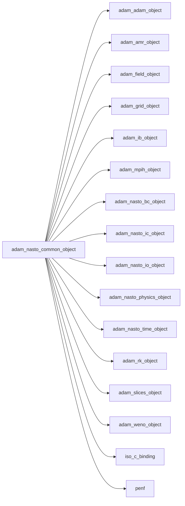
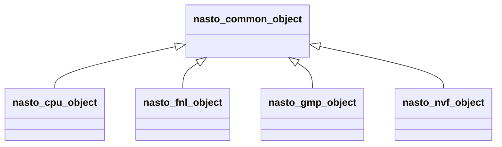
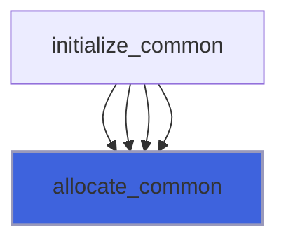
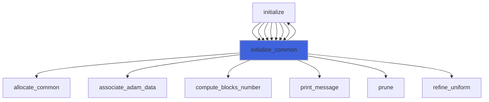

# adam_nasto_common_object

> ADAM, Navier-Stokes equations system class definition, common data to all backends.

**Source**: `src/app/nasto/common/adam_nasto_common_object.F90`

**Dependencies**



## Contents

- [nasto_common_object](#nasto-common-object)
- [allocate_common](#allocate-common)
- [initialize_common](#initialize-common)

## Derived Types

### nasto_common_object

Navier-Stokes equations system class definition, common data to all backends.

**Inheritance**



#### Components

| Name | Type | Attributes | Description |
|------|------|------------|-------------|
| `mpih` | type([mpih_object](/api/src/third_party/FUNDAL/src/lib/fundal_mpih_object#mpih-object)) |  | MPI handler. |
| `adam` | type([adam_object](/api/src/lib/common/adam_adam_object#adam-object)) |  | ADAM. |
| `field` | type([field_object](/api/src/lib/common/adam_field_object#field-object)) | pointer | The field. |
| `grid` | type([grid_object](/api/src/lib/common/adam_grid_object#grid-object)) | pointer | The grid. |
| `amr` | type([amr_object](/api/src/lib/common/adam_amr_object#amr-object)) |  | AMR marker handler. |
| `ib` | type([ib_object](/api/src/lib/common/adam_ib_object#ib-object)) |  | Immersed Boundary (IB) handler. |
| `slices` | type([slices_object](/api/src/lib/common/adam_slices_object#slices-object)) |  | Slices handler. |
| `rk` | type([rk_object](/api/src/lib/common/adam_rk_object#rk-object)) |  | RK integrator. |
| `weno` | type([weno_object](/api/src/lib/common/adam_weno_object#weno-object)) |  | WENO reconstructor. |
| `io` | type([nasto_io_object](/api/src/app/nasto/common/adam_nasto_io_object#nasto-io-object)) |  | IO handler. |
| `physics` | type([nasto_physics_object](/api/src/app/nasto/common/adam_nasto_physics_object#nasto-physics-object)) |  | Fluids physiscs handler. |
| `ic` | type([nasto_ic_object](/api/src/app/nasto/common/adam_nasto_ic_object#nasto-ic-object)) |  | Initial Conditions (IC) handler. |
| `bc` | type([nasto_bc_object](/api/src/app/nasto/common/adam_nasto_bc_object#nasto-bc-object)) |  | Boundary Conditions (BC) handler. |
| `time` | type([nasto_time_object](/api/src/app/nasto/common/adam_nasto_time_object#nasto-time-object)) |  | Time handler. |
| `ngc` | integer(kind=[I4P](/api/src/third_party/PENF/src/lib/penf_global_parameters_variables)) | pointer | Number of ghost cells. |
| `ni` | integer(kind=[I4P](/api/src/third_party/PENF/src/lib/penf_global_parameters_variables)) | pointer | Number of cells in i direction. |
| `nj` | integer(kind=[I4P](/api/src/third_party/PENF/src/lib/penf_global_parameters_variables)) | pointer | Number of cells in j direction. |
| `nk` | integer(kind=[I4P](/api/src/third_party/PENF/src/lib/penf_global_parameters_variables)) | pointer | Number of cells in k direction. |
| `nb` | integer(kind=[I4P](/api/src/third_party/PENF/src/lib/penf_global_parameters_variables)) | pointer | Total blocks number for MPI. |
| `blocks_number` | integer(kind=[I4P](/api/src/third_party/PENF/src/lib/penf_global_parameters_variables)) | pointer | Actual blocks number. |
| `ns` | integer(kind=[I4P](/api/src/third_party/PENF/src/lib/penf_global_parameters_variables)) | pointer | Number of fluids specie. |
| `nv` | integer(kind=[I4P](/api/src/third_party/PENF/src/lib/penf_global_parameters_variables)) | pointer | Number of conservative variables. |
| `nv_aux` | integer(kind=[I4P](/api/src/third_party/PENF/src/lib/penf_global_parameters_variables)) | pointer | Number of auxiliary variables. |
| `q` | real(kind=[R8P](/api/src/third_party/PENF/src/lib/penf_global_parameters_variables)) | allocatable | Cell centered variables. |
| `q_aux` | real(kind=[R8P](/api/src/third_party/PENF/src/lib/penf_global_parameters_variables)) | allocatable | Auxiliary cell centered variables. |

#### Type-Bound Procedures

| Name | Attributes | Description |
|------|------------|-------------|
| `allocate_common` | pass(self) | Allocate common data. |
| `initialize_common` | pass(self) | Initialize the equation common data. |

## Subroutines

### allocate_common

Allocate common data.

```fortran
subroutine allocate_common(self)
```

**Arguments**

| Name | Type | Intent | Attributes | Description |
|------|------|--------|------------|-------------|
| `self` | class([nasto_common_object](/api/src/app/nasto/common/adam_nasto_common_object#nasto-common-object)) | inout |  | The equation. |

**Call graph**



### initialize_common

Initialize the equation common data.

```fortran
subroutine initialize_common(self, filename, memory_avail, do_mpi_init, verbose)
```

**Arguments**

| Name | Type | Intent | Attributes | Description |
|------|------|--------|------------|-------------|
| `self` | class([nasto_common_object](/api/src/app/nasto/common/adam_nasto_common_object#nasto-common-object)) | inout |  | The equation. |
| `filename` | character(len=*) | in |  | Input file name. |
| `memory_avail` | real(kind=[R8P](/api/src/third_party/PENF/src/lib/penf_global_parameters_variables)) | in |  | Memory available for single MPI process. |
| `do_mpi_init` | logical | in | optional | Flag to activate MPI init call. |
| `verbose` | logical | in | optional | Trigger verbose output. |

**Call graph**


