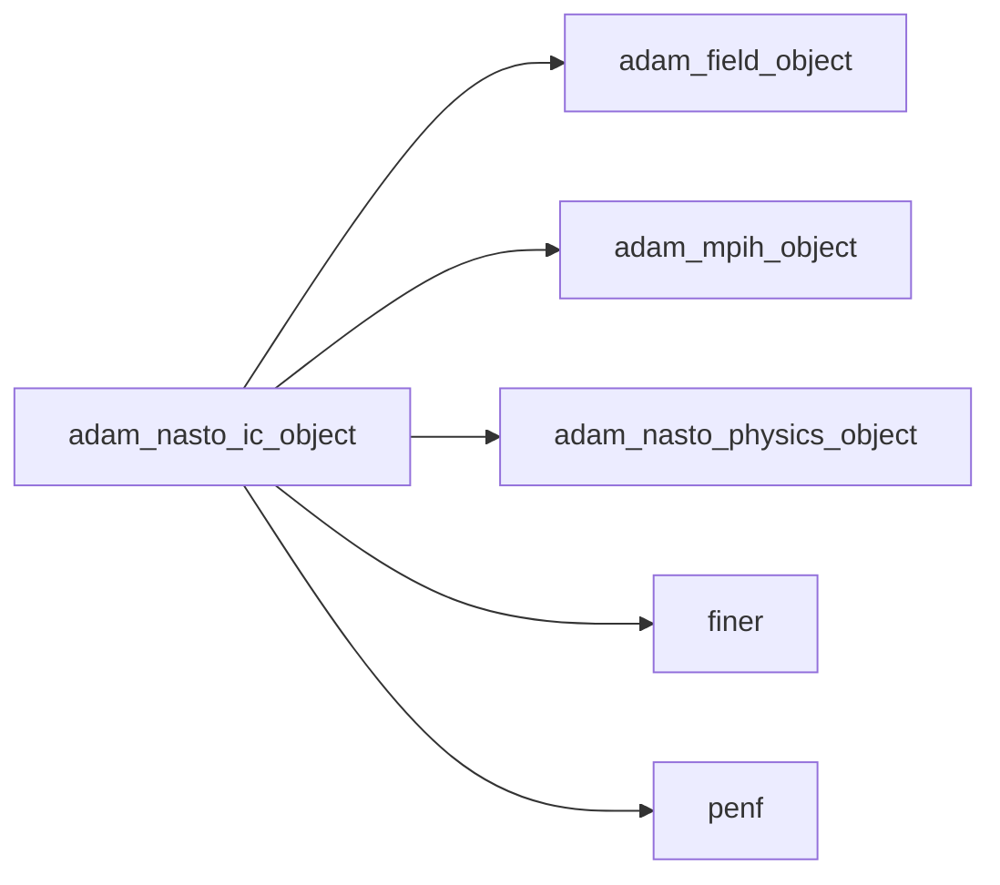
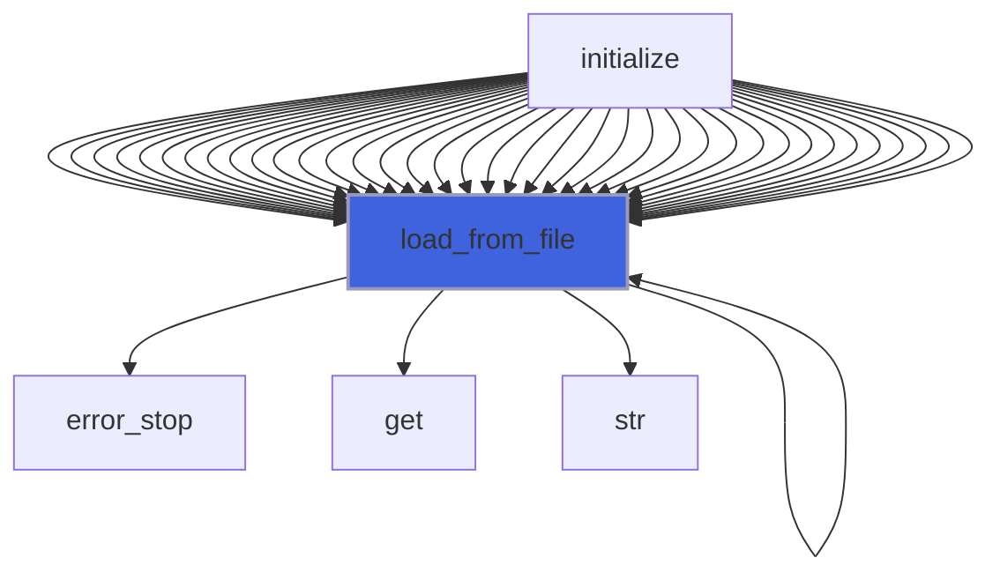
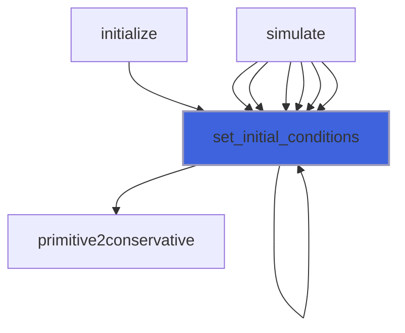
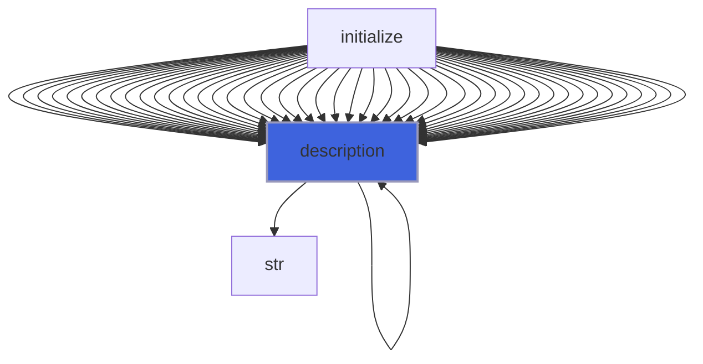

# adam_nasto_ic_object

> ADAM, NASTO Initial Conditions class definition, CPU backend.

**Source**: `src/app/nasto/common/adam_nasto_ic_object.F90`

**Dependencies**



## Contents

- [nasto_ic_object](#nasto-ic-object)
- [initialize](#initialize)
- [load_from_file](#load-from-file)
- [set_initial_conditions](#set-initial-conditions)
- [description](#description)

## Variables

| Name | Type | Attributes | Description |
|------|------|------------|-------------|
| `INI_SECTION_NAME` | character(len=18) | parameter | INI (config) file section name containing IC configs. |
| `IC_TYPE_UNIFORM` | character(len=7) | parameter | Uniform IC TYPE parameter. |
| `IC_TYPE_IVORTEX` | character(len=17) | parameter | Isentropic Vortex IC TYPE parameter. |
| `IC_TYPE_RP` | character(len=15) | parameter | Riemann Problem IC TYPE parameter. |

## Derived Types

### nasto_ic_object

Initial Conditions class definition, CPU backend.

#### Components

| Name | Type | Attributes | Description |
|------|------|------------|-------------|
| `mpih` | type([mpih_object](/api/src/third_party/FUNDAL/src/lib/fundal_mpih_object#mpih-object)) |  | MPI handler. |
| `amr_iterations` | integer(kind=[I4P](/api/src/third_party/PENF/src/lib/penf_global_parameters_variables)) |  | Number of AMR iterations imposing IC. |
| `ic_type` | character(len=:) | allocatable | IC type. |
| `regions_number` | integer(kind=[I4P](/api/src/third_party/PENF/src/lib/penf_global_parameters_variables)) |  | Number of IC regions. |
| `q` | real(kind=[R8P](/api/src/third_party/PENF/src/lib/penf_global_parameters_variables)) | allocatable | Primitive variables (r,u,v,w,p), s fluid specie index at IC for each region. |
| `emin` | real(kind=[R8P](/api/src/third_party/PENF/src/lib/penf_global_parameters_variables)) | allocatable | IC regions bounding box. |
| `emax` | real(kind=[R8P](/api/src/third_party/PENF/src/lib/penf_global_parameters_variables)) | allocatable | IC regions bounding box. |

#### Type-Bound Procedures

| Name | Attributes | Description |
|------|------------|-------------|
| `description` | pass(self) | Return pretty-printed object description. |
| `initialize` | pass(self) | Initialize IC. |
| `load_from_file` | pass(self) | Load config from file. |
| `set_initial_conditions` | pass(self) | Set initial conditions on NASTO fields. |

## Subroutines

### initialize

Initialize the equation.

```fortran
subroutine initialize(self, file_parameters)
```

**Arguments**

| Name | Type | Intent | Attributes | Description |
|------|------|--------|------------|-------------|
| `self` | class([nasto_ic_object](/api/src/app/nasto/common/adam_nasto_ic_object#nasto-ic-object)) | inout |  | IC. |
| `file_parameters` | type([file_ini](/api/src/third_party/FiNeR/src/lib/finer_file_ini_t#file-ini)) | in |  | Simulation parameters ini file handler. |

**Call graph**



```mermaid
flowchart TD
  add_node["add_node"] --> initialize["initialize"]
  analize["analize"] --> initialize["initialize"]
  build_connectivity["build_connectivity"] --> initialize["initialize"]
  distribute_facets["distribute_facets"] --> initialize["initialize"]
  distribute_facets_tree["distribute_facets_tree"] --> initialize["initialize"]
  export_vtk_file["export_vtk_file"] --> initialize["initialize"]
  initialize["initialize"] --> initialize["initialize"]
  initialize["initialize"] --> initialize["initialize"]
  initialize["initialize"] --> initialize["initialize"]
  initialize["initialize"] --> initialize["initialize"]
  initialize["initialize"] --> initialize["initialize"]
  initialize["initialize"] --> initialize["initialize"]
  initialize["initialize"] --> initialize["initialize"]
  initialize["initialize"] --> initialize["initialize"]
  initialize["initialize"] --> initialize["initialize"]
  initialize["initialize"] --> initialize["initialize"]
  initialize["initialize"] --> initialize["initialize"]
  initialize["initialize"] --> initialize["initialize"]
  initialize["initialize"] --> initialize["initialize"]
  initialize["initialize"] --> initialize["initialize"]
  initialize["initialize"] --> initialize["initialize"]
  initialize["initialize"] --> initialize["initialize"]
  initialize["initialize"] --> initialize["initialize"]
  initialize["initialize"] --> initialize["initialize"]
  initialize["initialize"] --> initialize["initialize"]
  initialize["initialize"] --> initialize["initialize"]
  initialize["initialize"] --> initialize["initialize"]
  initialize["initialize"] --> initialize["initialize"]
  initialize["initialize"] --> initialize["initialize"]
  initialize["initialize"] --> initialize["initialize"]
  initialize["initialize"] --> initialize["initialize"]
  initialize["initialize"] --> initialize["initialize"]
  initialize["initialize"] --> initialize["initialize"]
  initialize["initialize"] --> initialize["initialize"]
  initialize["initialize"] --> initialize["initialize"]
  initialize["initialize"] --> initialize["initialize"]
  initialize["initialize"] --> initialize["initialize"]
  initialize["initialize"] --> initialize["initialize"]
  initialize["initialize"] --> initialize["initialize"]
  initialize["initialize"] --> initialize["initialize"]
  initialize["initialize"] --> initialize["initialize"]
  initialize["initialize"] --> initialize["initialize"]
  initialize["initialize"] --> initialize["initialize"]
  initialize["initialize"] --> initialize["initialize"]
  initialize["initialize"] --> initialize["initialize"]
  initialize["initialize"] --> initialize["initialize"]
  initialize["initialize"] --> initialize["initialize"]
  initialize["initialize"] --> initialize["initialize"]
  initialize["initialize"] --> initialize["initialize"]
  initialize["initialize"] --> initialize["initialize"]
  initialize["initialize"] --> initialize["initialize"]
  initialize["initialize"] --> initialize["initialize"]
  initialize["initialize"] --> initialize["initialize"]
  initialize["initialize"] --> initialize["initialize"]
  initialize["initialize"] --> initialize["initialize"]
  initialize["initialize"] --> initialize["initialize"]
  initialize["initialize"] --> initialize["initialize"]
  initialize["initialize"] --> initialize["initialize"]
  initialize["initialize"] --> initialize["initialize"]
  initialize["initialize"] --> initialize["initialize"]
  initialize["initialize"] --> initialize["initialize"]
  initialize["initialize"] --> initialize["initialize"]
  initialize["initialize"] --> initialize["initialize"]
  initialize["initialize"] --> initialize["initialize"]
  initialize["initialize"] --> initialize["initialize"]
  initialize["initialize"] --> initialize["initialize"]
  initialize["initialize"] --> initialize["initialize"]
  initialize["initialize"] --> initialize["initialize"]
  initialize["initialize"] --> initialize["initialize"]
  initialize["initialize"] --> initialize["initialize"]
  initialize["initialize"] --> initialize["initialize"]
  initialize["initialize"] --> initialize["initialize"]
  initialize["initialize"] --> initialize["initialize"]
  initialize["initialize"] --> initialize["initialize"]
  initialize["initialize"] --> initialize["initialize"]
  initialize["initialize"] --> initialize["initialize"]
  initialize["initialize"] --> initialize["initialize"]
  initialize["initialize"] --> initialize["initialize"]
  initialize_common["initialize_common"] --> initialize["initialize"]
  initialize_common["initialize_common"] --> initialize["initialize"]
  initialize_common["initialize_common"] --> initialize["initialize"]
  initialize_common["initialize_common"] --> initialize["initialize"]
  load_from_file["load_from_file"] --> initialize["initialize"]
  load_from_file["load_from_file"] --> initialize["initialize"]
  open_file["open_file"] --> initialize["initialize"]
  open_file["open_file"] --> initialize["initialize"]
  open_file["open_file"] --> initialize["initialize"]
  resize["resize"] --> initialize["initialize"]
  save_into_file["save_into_file"] --> initialize["initialize"]
  save_vtk["save_vtk"] --> initialize["initialize"]
  simulate["simulate"] --> initialize["initialize"]
  simulate["simulate"] --> initialize["initialize"]
  simulate["simulate"] --> initialize["initialize"]
  simulate["simulate"] --> initialize["initialize"]
  simulate["simulate"] --> initialize["initialize"]
  simulate["simulate"] --> initialize["initialize"]
  simulate["simulate"] --> initialize["initialize"]
  test_stress["test_stress"] --> initialize["initialize"]
  initialize["initialize"] --> description["description"]
  initialize["initialize"] --> initialize["initialize"]
  initialize["initialize"] --> load_from_file["load_from_file"]
  style initialize fill:#3e63dd,stroke:#99b,stroke-width:2px
```

### load_from_file

Load config from file.

```fortran
subroutine load_from_file(self, file_parameters, go_on_fail)
```

**Arguments**

| Name | Type | Intent | Attributes | Description |
|------|------|--------|------------|-------------|
| `self` | class([nasto_ic_object](/api/src/app/nasto/common/adam_nasto_ic_object#nasto-ic-object)) | inout |  | IC. |
| `file_parameters` | type([file_ini](/api/src/third_party/FiNeR/src/lib/finer_file_ini_t#file-ini)) | in |  | Simulation parameters ini file handler. |
| `go_on_fail` | logical | in | optional | Go on if load fails. |

**Call graph**



### set_initial_conditions

Set initial conditions on NASTO fields.

```fortran
subroutine set_initial_conditions(self, physics, field, q)
```

**Arguments**

| Name | Type | Intent | Attributes | Description |
|------|------|--------|------------|-------------|
| `self` | class([nasto_ic_object](/api/src/app/nasto/common/adam_nasto_ic_object#nasto-ic-object)) | in |  | IC. |
| `physics` | type([nasto_physics_object](/api/src/app/nasto/common/adam_nasto_physics_object#nasto-physics-object)) | in |  | Fluids physiscs. |
| `field` | type([field_object](/api/src/lib/common/adam_field_object#field-object)) | in |  | Field object. |
| `q` | real(kind=[R8P](/api/src/third_party/PENF/src/lib/penf_global_parameters_variables)) | inout |  | Conservative variables. |

**Call graph**



## Functions

### description

Return a pretty-formatted object description.

**Attributes**: pure

**Returns**: `character(len=:)`

```fortran
function description(self) result(desc)
```

**Arguments**

| Name | Type | Intent | Attributes | Description |
|------|------|--------|------------|-------------|
| `self` | class([nasto_ic_object](/api/src/app/nasto/common/adam_nasto_ic_object#nasto-ic-object)) | in |  | IC. |

**Call graph**


