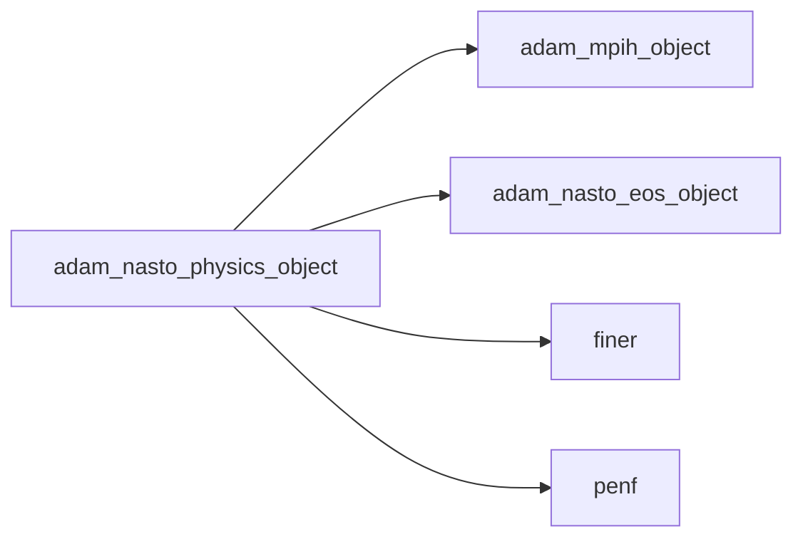
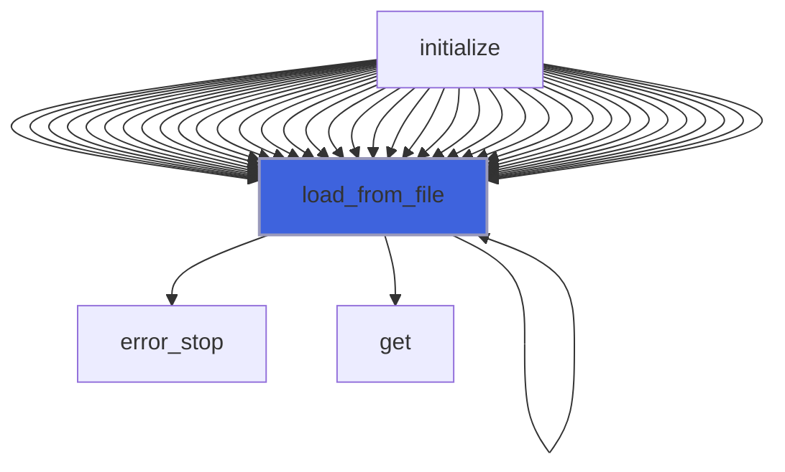
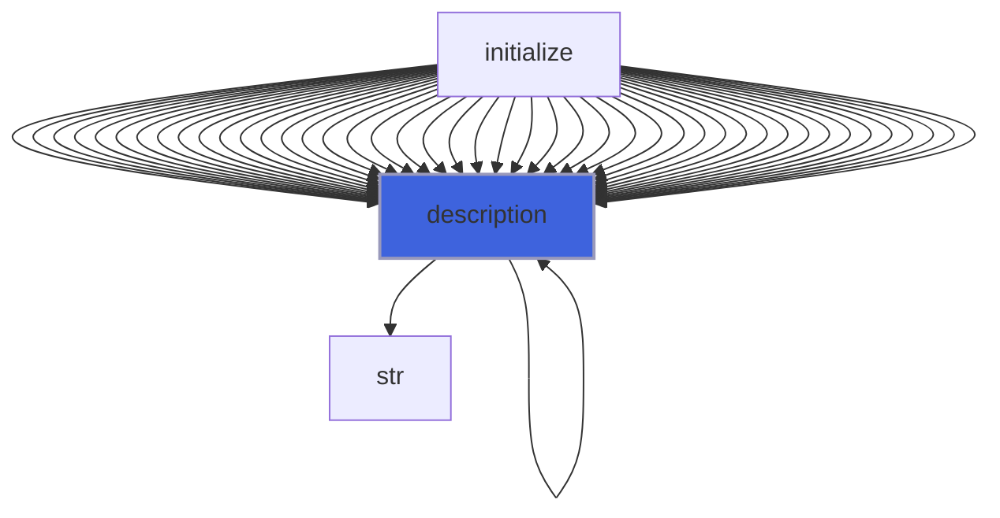
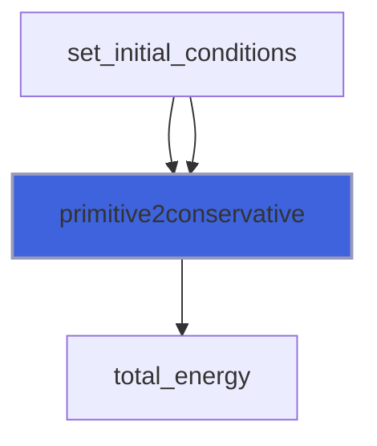
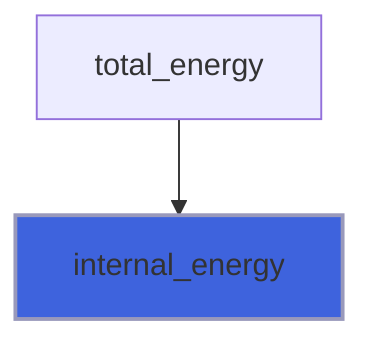
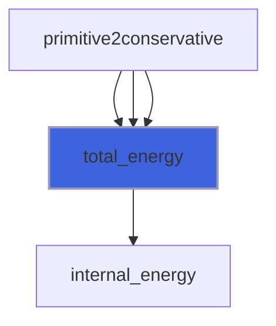

# adam_nasto_physics_object

> ADAM, NASTO fluid physics class definition, CPU backend.

**Source**: `src/app/nasto/common/adam_nasto_physics_object.F90`

**Dependencies**



## Contents

- [nasto_physics_object](#nasto-physics-object)
- [initialize](#initialize)
- [load_from_file](#load-from-file)
- [conservative2primitive](#conservative2primitive)
- [description](#description)
- [primitive2conservative](#primitive2conservative)
- [internal_energy](#internal-energy)
- [total_energy](#total-energy)

## Variables

| Name | Type | Attributes | Description |
|------|------|------------|-------------|
| `INI_SECTION_NAME` | character(len=7) | parameter | INI file section name containing fluid physics. |
| `IR` | integer(kind=[I4P](/api/src/third_party/PENF/src/lib/penf_global_parameters_variables)) |  |  |
| `IU` | integer(kind=[I4P](/api/src/third_party/PENF/src/lib/penf_global_parameters_variables)) |  |  |
| `IV` | integer(kind=[I4P](/api/src/third_party/PENF/src/lib/penf_global_parameters_variables)) |  |  |
| `IW` | integer(kind=[I4P](/api/src/third_party/PENF/src/lib/penf_global_parameters_variables)) |  |  |
| `IG` | integer(kind=[I4P](/api/src/third_party/PENF/src/lib/penf_global_parameters_variables)) |  |  |
| `IP` | integer(kind=[I4P](/api/src/third_party/PENF/src/lib/penf_global_parameters_variables)) |  |  |

## Derived Types

### nasto_physics_object

NASTO fluid physics class definition.

#### Components

| Name | Type | Attributes | Description |
|------|------|------------|-------------|
| `mpih` | type([mpih_object](/api/src/lib/common/adam_mpih_object#mpih-object)) |  | MPI handler. |
| `ns` | integer(kind=[I4P](/api/src/third_party/PENF/src/lib/penf_global_parameters_variables)) |  | Number of species. |
| `nv` | integer(kind=[I4P](/api/src/third_party/PENF/src/lib/penf_global_parameters_variables)) |  | Number of variables (rns+ru+rv+rw+rE=ns+4). |
| `nv_aux` | integer(kind=[I4P](/api/src/third_party/PENF/src/lib/penf_global_parameters_variables)) |  | Number of auxiliary variables (rns+r+u+v+w+p+g=ns+6). |
| `np` | integer(kind=[I4P](/api/src/third_party/PENF/src/lib/penf_global_parameters_variables)) |  | Number of 1D primitive variables (rns+r+un+p+g=ns+4). |
| `eos` | type([nasto_eos_object](/api/src/app/nasto/common/adam_nasto_eos_object#nasto-eos-object)) | allocatable | Equations of state of each specie [1:ns]. |

#### Type-Bound Procedures

| Name | Attributes | Description |
|------|------------|-------------|
| `conservative2primitive` | pass(self) | Return primitive variables from conservative ones. |
| `description` | pass(self) | Return pretty-printed object description. |
| `initialize` | pass(self) | Initialize physics. |
| `load_from_file` | pass(self) | Load config from file. |
| `primitive2conservative` | pass(self) | Return conservative variables from primitive ones. |

## Subroutines

### initialize

Initialize the equation.

```fortran
subroutine initialize(self, file_parameters)
```

**Arguments**

| Name | Type | Intent | Attributes | Description |
|------|------|--------|------------|-------------|
| `self` | class([nasto_physics_object](/api/src/app/nasto/common/adam_nasto_physics_object#nasto-physics-object)) | inout |  | Physics. |
| `file_parameters` | type([file_ini](/api/src/third_party/FiNeR/src/lib/finer_file_ini_t#file-ini)) | in |  | Simulation parameters ini file handler. |

**Call graph**



```mermaid
flowchart TD
  add_node["add_node"] --> initialize["initialize"]
  analize["analize"] --> initialize["initialize"]
  build_connectivity["build_connectivity"] --> initialize["initialize"]
  distribute_facets["distribute_facets"] --> initialize["initialize"]
  distribute_facets_tree["distribute_facets_tree"] --> initialize["initialize"]
  export_vtk_file["export_vtk_file"] --> initialize["initialize"]
  initialize["initialize"] --> initialize["initialize"]
  initialize["initialize"] --> initialize["initialize"]
  initialize["initialize"] --> initialize["initialize"]
  initialize["initialize"] --> initialize["initialize"]
  initialize["initialize"] --> initialize["initialize"]
  initialize["initialize"] --> initialize["initialize"]
  initialize["initialize"] --> initialize["initialize"]
  initialize["initialize"] --> initialize["initialize"]
  initialize["initialize"] --> initialize["initialize"]
  initialize["initialize"] --> initialize["initialize"]
  initialize["initialize"] --> initialize["initialize"]
  initialize["initialize"] --> initialize["initialize"]
  initialize["initialize"] --> initialize["initialize"]
  initialize["initialize"] --> initialize["initialize"]
  initialize["initialize"] --> initialize["initialize"]
  initialize["initialize"] --> initialize["initialize"]
  initialize["initialize"] --> initialize["initialize"]
  initialize["initialize"] --> initialize["initialize"]
  initialize["initialize"] --> initialize["initialize"]
  initialize["initialize"] --> initialize["initialize"]
  initialize["initialize"] --> initialize["initialize"]
  initialize["initialize"] --> initialize["initialize"]
  initialize["initialize"] --> initialize["initialize"]
  initialize["initialize"] --> initialize["initialize"]
  initialize["initialize"] --> initialize["initialize"]
  initialize["initialize"] --> initialize["initialize"]
  initialize["initialize"] --> initialize["initialize"]
  initialize["initialize"] --> initialize["initialize"]
  initialize["initialize"] --> initialize["initialize"]
  initialize["initialize"] --> initialize["initialize"]
  initialize["initialize"] --> initialize["initialize"]
  initialize["initialize"] --> initialize["initialize"]
  initialize["initialize"] --> initialize["initialize"]
  initialize["initialize"] --> initialize["initialize"]
  initialize["initialize"] --> initialize["initialize"]
  initialize["initialize"] --> initialize["initialize"]
  initialize["initialize"] --> initialize["initialize"]
  initialize["initialize"] --> initialize["initialize"]
  initialize["initialize"] --> initialize["initialize"]
  initialize["initialize"] --> initialize["initialize"]
  initialize["initialize"] --> initialize["initialize"]
  initialize["initialize"] --> initialize["initialize"]
  initialize["initialize"] --> initialize["initialize"]
  initialize["initialize"] --> initialize["initialize"]
  initialize["initialize"] --> initialize["initialize"]
  initialize["initialize"] --> initialize["initialize"]
  initialize["initialize"] --> initialize["initialize"]
  initialize["initialize"] --> initialize["initialize"]
  initialize["initialize"] --> initialize["initialize"]
  initialize["initialize"] --> initialize["initialize"]
  initialize["initialize"] --> initialize["initialize"]
  initialize["initialize"] --> initialize["initialize"]
  initialize["initialize"] --> initialize["initialize"]
  initialize["initialize"] --> initialize["initialize"]
  initialize["initialize"] --> initialize["initialize"]
  initialize["initialize"] --> initialize["initialize"]
  initialize["initialize"] --> initialize["initialize"]
  initialize["initialize"] --> initialize["initialize"]
  initialize["initialize"] --> initialize["initialize"]
  initialize["initialize"] --> initialize["initialize"]
  initialize["initialize"] --> initialize["initialize"]
  initialize["initialize"] --> initialize["initialize"]
  initialize["initialize"] --> initialize["initialize"]
  initialize["initialize"] --> initialize["initialize"]
  initialize["initialize"] --> initialize["initialize"]
  initialize["initialize"] --> initialize["initialize"]
  initialize["initialize"] --> initialize["initialize"]
  initialize["initialize"] --> initialize["initialize"]
  initialize["initialize"] --> initialize["initialize"]
  initialize["initialize"] --> initialize["initialize"]
  initialize["initialize"] --> initialize["initialize"]
  initialize["initialize"] --> initialize["initialize"]
  initialize_common["initialize_common"] --> initialize["initialize"]
  initialize_common["initialize_common"] --> initialize["initialize"]
  initialize_common["initialize_common"] --> initialize["initialize"]
  initialize_common["initialize_common"] --> initialize["initialize"]
  load_from_file["load_from_file"] --> initialize["initialize"]
  load_from_file["load_from_file"] --> initialize["initialize"]
  open_file["open_file"] --> initialize["initialize"]
  open_file["open_file"] --> initialize["initialize"]
  open_file["open_file"] --> initialize["initialize"]
  resize["resize"] --> initialize["initialize"]
  save_into_file["save_into_file"] --> initialize["initialize"]
  save_vtk["save_vtk"] --> initialize["initialize"]
  simulate["simulate"] --> initialize["initialize"]
  simulate["simulate"] --> initialize["initialize"]
  simulate["simulate"] --> initialize["initialize"]
  simulate["simulate"] --> initialize["initialize"]
  simulate["simulate"] --> initialize["initialize"]
  simulate["simulate"] --> initialize["initialize"]
  simulate["simulate"] --> initialize["initialize"]
  test_stress["test_stress"] --> initialize["initialize"]
  initialize["initialize"] --> description["description"]
  initialize["initialize"] --> initialize["initialize"]
  initialize["initialize"] --> load_from_file["load_from_file"]
  style initialize fill:#3e63dd,stroke:#99b,stroke-width:2px
```

### load_from_file

Load config from file.

```fortran
subroutine load_from_file(self, file_parameters, go_on_fail)
```

**Arguments**

| Name | Type | Intent | Attributes | Description |
|------|------|--------|------------|-------------|
| `self` | class([nasto_physics_object](/api/src/app/nasto/common/adam_nasto_physics_object#nasto-physics-object)) | inout |  | Physics. |
| `file_parameters` | type([file_ini](/api/src/third_party/FiNeR/src/lib/finer_file_ini_t#file-ini)) | in |  | Simulation parameters ini file handler. |
| `go_on_fail` | logical | in | optional | Go on if load fails. |

**Call graph**



## Functions

### conservative2primitive

Return primitive variables (rs, u, v, w, r, p, g) from conservative variables (rs, ru, rv, rw, rE).

**Attributes**: pure

**Returns**: real(kind=[R8P](/api/src/third_party/PENF/src/lib/penf_global_parameters_variables))

```fortran
function conservative2primitive(self, conservative) result(primitive)
```

**Arguments**

| Name | Type | Intent | Attributes | Description |
|------|------|--------|------------|-------------|
| `self` | class([nasto_physics_object](/api/src/app/nasto/common/adam_nasto_physics_object#nasto-physics-object)) | in |  | Equation of state. |
| `conservative` | real(kind=[R8P](/api/src/third_party/PENF/src/lib/penf_global_parameters_variables)) | in |  | Conservative variables |

### description

Return a pretty-formatted object description.

**Attributes**: pure

**Returns**: `character(len=:)`

```fortran
function description(self) result(desc)
```

**Arguments**

| Name | Type | Intent | Attributes | Description |
|------|------|--------|------------|-------------|
| `self` | class([nasto_physics_object](/api/src/app/nasto/common/adam_nasto_physics_object#nasto-physics-object)) | in |  | Physics. |

**Call graph**



### primitive2conservative

Return conservative variables (rs, ru, rv, rw, rE) from primitive variables (rs, u, v, w, r, p, g).

**Returns**: real(kind=[R8P](/api/src/third_party/PENF/src/lib/penf_global_parameters_variables))

```fortran
function primitive2conservative(self, primitive) result(conservative)
```

**Arguments**

| Name | Type | Intent | Attributes | Description |
|------|------|--------|------------|-------------|
| `self` | class([nasto_physics_object](/api/src/app/nasto/common/adam_nasto_physics_object#nasto-physics-object)) | in |  | Equation of state. |
| `primitive` | real(kind=[R8P](/api/src/third_party/PENF/src/lib/penf_global_parameters_variables)) | in |  | Primitive variables |

**Call graph**



### internal_energy

Return specific internal energy.

**Attributes**: elemental

**Returns**: real(kind=[R8P](/api/src/third_party/PENF/src/lib/penf_global_parameters_variables))

```fortran
function internal_energy(g, density, pressure) result(energy_)
```

**Arguments**

| Name | Type | Intent | Attributes | Description |
|------|------|--------|------------|-------------|
| `g` | real(kind=[R8P](/api/src/third_party/PENF/src/lib/penf_global_parameters_variables)) | in |  | Specific heats ratio. |
| `density` | real(kind=[R8P](/api/src/third_party/PENF/src/lib/penf_global_parameters_variables)) | in |  | Density value. |
| `pressure` | real(kind=[R8P](/api/src/third_party/PENF/src/lib/penf_global_parameters_variables)) | in |  | Pressure value. |

**Call graph**



### total_energy

Return total specific energy.

**Attributes**: elemental

**Returns**: real(kind=[R8P](/api/src/third_party/PENF/src/lib/penf_global_parameters_variables))

```fortran
function total_energy(g, density, pressure, velocity_sq_norm) result(energy_)
```

**Arguments**

| Name | Type | Intent | Attributes | Description |
|------|------|--------|------------|-------------|
| `g` | real(kind=[R8P](/api/src/third_party/PENF/src/lib/penf_global_parameters_variables)) | in |  | Specific heats ratio. |
| `density` | real(kind=[R8P](/api/src/third_party/PENF/src/lib/penf_global_parameters_variables)) | in |  | Density value. |
| `pressure` | real(kind=[R8P](/api/src/third_party/PENF/src/lib/penf_global_parameters_variables)) | in |  | Pressure value. |
| `velocity_sq_norm` | real(kind=[R8P](/api/src/third_party/PENF/src/lib/penf_global_parameters_variables)) | in |  | Velocity vector square norm `\|\|velocity\|\|^2`. |

**Call graph**


