# adam_nasto_cpu_cns

> ADAM, NASTO CPU Compressible-Navier-Stokes fluidyanmics application library.

**Source**: `src/app/nasto/cpu/adam_nasto_cpu_cns.F90`

**Dependencies**


## Contents

- [compute_conservatives](#compute-conservatives)
- [compute_conservative_fluxes](#compute-conservative-fluxes)
- [compute_max_eigenvalues](#compute-max-eigenvalues)
- [compute_eigenvectors](#compute-eigenvectors)
- [compute_q_aux](#compute-q-aux)
- [compute_riemann_exact](#compute-riemann-exact)
- [compute_riemann_exact_2](#compute-riemann-exact-2)
- [compute_riemann_exact_3](#compute-riemann-exact-3)
- [compute_riemann_hllc](#compute-riemann-hllc)
- [compute_riemann_llf](#compute-riemann-llf)
- [compute_riemann_ts](#compute-riemann-ts)
- [compute_conservatives_scalar](#compute-conservatives-scalar)
- [compute_conservative_fluxes_scalar](#compute-conservative-fluxes-scalar)
- [compute_interstates_23_ts](#compute-interstates-23-ts)
- [compute_interstates_23u](#compute-interstates-23u)
- [compute_roe_average](#compute-roe-average)
- [compute_rarefaction](#compute-rarefaction)
- [compute_shock](#compute-shock)
- [evaluate_waves_pvrs](#evaluate-waves-pvrs)

## Subroutines

### compute_conservatives

Compute convervative variables from auxiliary ones.

**Attributes**: pure

```fortran
subroutine compute_conservatives(b, i, j, k, ngc, q_aux, q)
```

**Arguments**

| Name | Type | Intent | Attributes | Description |
|------|------|--------|------------|-------------|
| `b` | integer(kind=[I4P](/api/src/third_party/PENF/src/lib/penf_global_parameters_variables)) | in |  | Cell indexes. |
| `i` | integer(kind=[I4P](/api/src/third_party/PENF/src/lib/penf_global_parameters_variables)) | in |  | Cell indexes. |
| `j` | integer(kind=[I4P](/api/src/third_party/PENF/src/lib/penf_global_parameters_variables)) | in |  | Cell indexes. |
| `k` | integer(kind=[I4P](/api/src/third_party/PENF/src/lib/penf_global_parameters_variables)) | in |  | Cell indexes. |
| `ngc` | integer(kind=[I4P](/api/src/third_party/PENF/src/lib/penf_global_parameters_variables)) | in |  | Ghost cells number. |
| `q_aux` | real(kind=[R8P](/api/src/third_party/PENF/src/lib/penf_global_parameters_variables)) | in |  | Auxiliary variables. |
| `q` | real(kind=[R8P](/api/src/third_party/PENF/src/lib/penf_global_parameters_variables)) | inout |  | Conservative varibales. |

**Call graph**

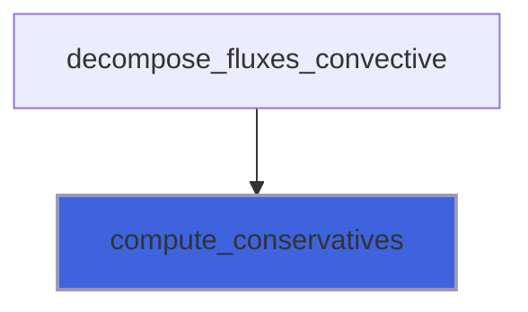

### compute_conservative_fluxes

Compute convervative fluxes from auxiliary variables.

**Attributes**: pure

```fortran
subroutine compute_conservative_fluxes(sir, b, i, j, k, ngc, q_aux, f)
```

**Arguments**

| Name | Type | Intent | Attributes | Description |
|------|------|--------|------------|-------------|
| `sir` | real(kind=[R8P](/api/src/third_party/PENF/src/lib/penf_global_parameters_variables)) | in |  | Directional (1=x,2=y,3=z) increment. |
| `b` | integer(kind=[I4P](/api/src/third_party/PENF/src/lib/penf_global_parameters_variables)) | in |  | Cell indexes. |
| `i` | integer(kind=[I4P](/api/src/third_party/PENF/src/lib/penf_global_parameters_variables)) | in |  | Cell indexes. |
| `j` | integer(kind=[I4P](/api/src/third_party/PENF/src/lib/penf_global_parameters_variables)) | in |  | Cell indexes. |
| `k` | integer(kind=[I4P](/api/src/third_party/PENF/src/lib/penf_global_parameters_variables)) | in |  | Cell indexes. |
| `ngc` | integer(kind=[I4P](/api/src/third_party/PENF/src/lib/penf_global_parameters_variables)) | in |  | Ghost cells number. |
| `q_aux` | real(kind=[R8P](/api/src/third_party/PENF/src/lib/penf_global_parameters_variables)) | in |  | Auxiliary variables. |
| `f` | real(kind=[R8P](/api/src/third_party/PENF/src/lib/penf_global_parameters_variables)) | inout |  | Conservative fluxes. |

**Call graph**

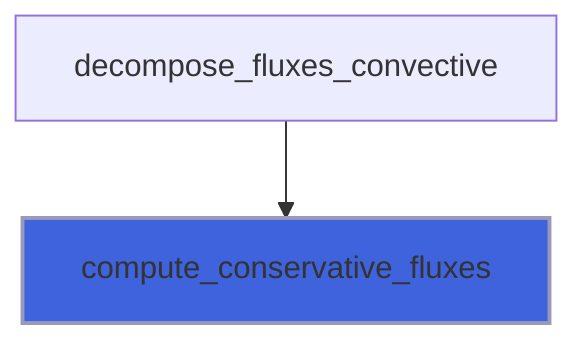

### compute_max_eigenvalues

**Attributes**: pure

```fortran
subroutine compute_max_eigenvalues(si, sir, weno_s, b, i, j, k, ngc, nv, q_aux, evmax)
```

**Arguments**

| Name | Type | Intent | Attributes | Description |
|------|------|--------|------------|-------------|
| `si` | integer(kind=[I4P](/api/src/third_party/PENF/src/lib/penf_global_parameters_variables)) | in |  | Directional (1=x,2=y,3=z) increment. |
| `sir` | real(kind=[R8P](/api/src/third_party/PENF/src/lib/penf_global_parameters_variables)) | in |  | Directional (1=x,2=y,3=z) increment. |
| `weno_s` | integer(kind=[I4P](/api/src/third_party/PENF/src/lib/penf_global_parameters_variables)) | in |  | Weno stencils number/dimension. |
| `b` | integer(kind=[I4P](/api/src/third_party/PENF/src/lib/penf_global_parameters_variables)) | in |  | Cell indexes. |
| `i` | integer(kind=[I4P](/api/src/third_party/PENF/src/lib/penf_global_parameters_variables)) | in |  | Cell indexes. |
| `j` | integer(kind=[I4P](/api/src/third_party/PENF/src/lib/penf_global_parameters_variables)) | in |  | Cell indexes. |
| `k` | integer(kind=[I4P](/api/src/third_party/PENF/src/lib/penf_global_parameters_variables)) | in |  | Cell indexes. |
| `ngc` | integer(kind=[I4P](/api/src/third_party/PENF/src/lib/penf_global_parameters_variables)) | in |  | Ghost cells number. |
| `nv` | integer(kind=[I4P](/api/src/third_party/PENF/src/lib/penf_global_parameters_variables)) | in |  | Number of conservative varibales. |
| `q_aux` | real(kind=[R8P](/api/src/third_party/PENF/src/lib/penf_global_parameters_variables)) | in |  | Auxiliary variables. |
| `evmax` | real(kind=[R8P](/api/src/third_party/PENF/src/lib/penf_global_parameters_variables)) | inout |  | Maximum eigenvalues in the big stencil. |

**Call graph**

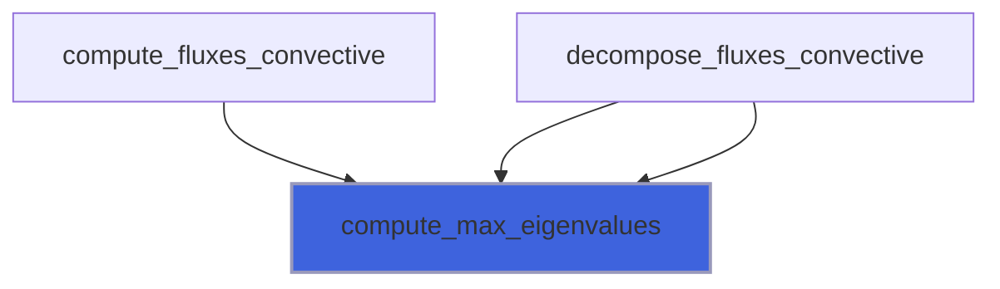

### compute_eigenvectors

**Attributes**: pure

```fortran
subroutine compute_eigenvectors(si, sir, b, i, j, k, ngc, nv, g, q_aux, el, er)
```

**Arguments**

| Name | Type | Intent | Attributes | Description |
|------|------|--------|------------|-------------|
| `si` | integer(kind=[I4P](/api/src/third_party/PENF/src/lib/penf_global_parameters_variables)) | in |  | Directional (1=x,2=y,3=z) increment. |
| `sir` | real(kind=[R8P](/api/src/third_party/PENF/src/lib/penf_global_parameters_variables)) | in |  | Directional (1=x,2=y,3=z) increment. |
| `b` | integer(kind=[I4P](/api/src/third_party/PENF/src/lib/penf_global_parameters_variables)) | in |  | Cell indexes. |
| `i` | integer(kind=[I4P](/api/src/third_party/PENF/src/lib/penf_global_parameters_variables)) | in |  | Cell indexes. |
| `j` | integer(kind=[I4P](/api/src/third_party/PENF/src/lib/penf_global_parameters_variables)) | in |  | Cell indexes. |
| `k` | integer(kind=[I4P](/api/src/third_party/PENF/src/lib/penf_global_parameters_variables)) | in |  | Cell indexes. |
| `ngc` | integer(kind=[I4P](/api/src/third_party/PENF/src/lib/penf_global_parameters_variables)) | in |  | Ghost cells number. |
| `nv` | integer(kind=[I4P](/api/src/third_party/PENF/src/lib/penf_global_parameters_variables)) | in |  | Number of conservative varibales. |
| `g` | real(kind=[R8P](/api/src/third_party/PENF/src/lib/penf_global_parameters_variables)) | in |  | Specific heats ratio. |
| `q_aux` | real(kind=[R8P](/api/src/third_party/PENF/src/lib/penf_global_parameters_variables)) | in |  | Auxiliary variables. |
| `el` | real(kind=[R8P](/api/src/third_party/PENF/src/lib/penf_global_parameters_variables)) | inout |  | Left and right eigenvectors. |
| `er` | real(kind=[R8P](/api/src/third_party/PENF/src/lib/penf_global_parameters_variables)) | inout |  | Left and right eigenvectors. |

**Call graph**

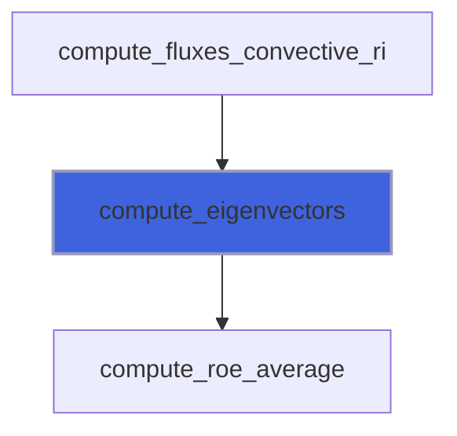

### compute_q_aux

Compute auxiliary variables.

```fortran
subroutine compute_q_aux(ni, nj, nk, ngc, blocks_number, R, cv, g, q, q_aux)
```

**Arguments**

| Name | Type | Intent | Attributes | Description |
|------|------|--------|------------|-------------|
| `ni` | integer(kind=[I4P](/api/src/third_party/PENF/src/lib/penf_global_parameters_variables)) | in |  | Grid cells number in I direction. |
| `nj` | integer(kind=[I4P](/api/src/third_party/PENF/src/lib/penf_global_parameters_variables)) | in |  | Grid cells number in J direction. |
| `nk` | integer(kind=[I4P](/api/src/third_party/PENF/src/lib/penf_global_parameters_variables)) | in |  | Grid cells number in K direction. |
| `ngc` | integer(kind=[I4P](/api/src/third_party/PENF/src/lib/penf_global_parameters_variables)) | in |  | Ghost cells number. |
| `blocks_number` | integer(kind=[I4P](/api/src/third_party/PENF/src/lib/penf_global_parameters_variables)) | in |  | Number of blocks. |
| `R` | real(kind=[R8P](/api/src/third_party/PENF/src/lib/penf_global_parameters_variables)) | in |  | Fluid constant, specific heats difference. |
| `cv` | real(kind=[R8P](/api/src/third_party/PENF/src/lib/penf_global_parameters_variables)) | in |  | Specific heat at constant volume. |
| `g` | real(kind=[R8P](/api/src/third_party/PENF/src/lib/penf_global_parameters_variables)) | in |  | Specific heats ratio. |
| `q` | real(kind=[R8P](/api/src/third_party/PENF/src/lib/penf_global_parameters_variables)) | in |  | Conservative variables. |
| `q_aux` | real(kind=[R8P](/api/src/third_party/PENF/src/lib/penf_global_parameters_variables)) | out |  | Auxiliary variables. |

**Call graph**

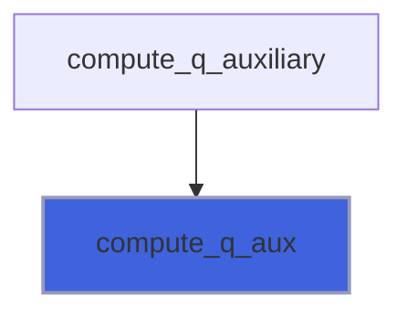

### compute_riemann_exact

Solve the Riemann problem between the state $1$ and $4$ using exact Rainkine-Hugonoit jump relations.

```fortran
subroutine compute_riemann_exact(si, sir, nv, q_aux1, q_aux4, g1, g4, F, lmax, ws)
```

**Arguments**

| Name | Type | Intent | Attributes | Description |
|------|------|--------|------------|-------------|
| `si` | integer(kind=[I4P](/api/src/third_party/PENF/src/lib/penf_global_parameters_variables)) | in |  | Directional (1=x,2=y,3=z) increment. |
| `sir` | real(kind=[R8P](/api/src/third_party/PENF/src/lib/penf_global_parameters_variables)) | in |  | Directional (1=x,2=y,3=z) increment. |
| `nv` | integer(kind=[I4P](/api/src/third_party/PENF/src/lib/penf_global_parameters_variables)) | in |  | Number of conservative varibales. |
| `q_aux1` | real(kind=[R8P](/api/src/third_party/PENF/src/lib/penf_global_parameters_variables)) | in |  | Left state, auxiliary variables. |
| `q_aux4` | real(kind=[R8P](/api/src/third_party/PENF/src/lib/penf_global_parameters_variables)) | in |  | Left state, auxiliary variables. |
| `g1` | real(kind=[R8P](/api/src/third_party/PENF/src/lib/penf_global_parameters_variables)) | in |  | Specific heats ratio of state 1. |
| `g4` | real(kind=[R8P](/api/src/third_party/PENF/src/lib/penf_global_parameters_variables)) | in |  | Specific heats ratio of state 4. |
| `F` | real(kind=[R8P](/api/src/third_party/PENF/src/lib/penf_global_parameters_variables)) | inout |  | Resulting fluxes. |
| `lmax` | real(kind=[R8P](/api/src/third_party/PENF/src/lib/penf_global_parameters_variables)) | out | optional | Maximum wave speed estimation. |
| `ws` | real(kind=[R8P](/api/src/third_party/PENF/src/lib/penf_global_parameters_variables)) | out | optional | Maximum wave speed estimation. |

**Call graph**

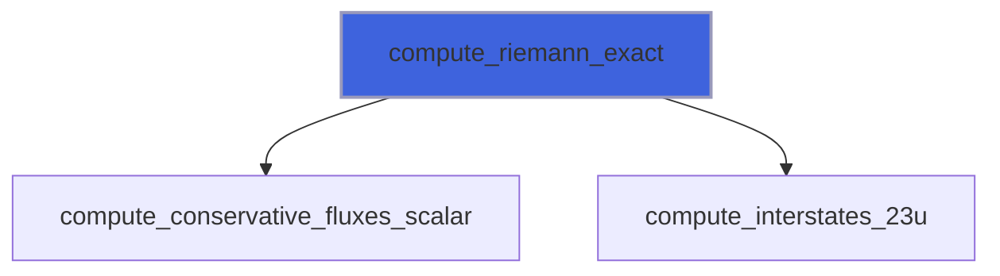

### compute_riemann_exact_2

Solve the Riemann problem between the state $1$ and $4$ using exact Rainkine-Hugonoit jump relations.

```fortran
subroutine compute_riemann_exact_2(si, sir, nv, q_aux1, q_aux4, g1, g4, F, lmax)
```

**Arguments**

| Name | Type | Intent | Attributes | Description |
|------|------|--------|------------|-------------|
| `si` | integer(kind=[I4P](/api/src/third_party/PENF/src/lib/penf_global_parameters_variables)) | in |  | Directional (1=x,2=y,3=z) increment. |
| `sir` | real(kind=[R8P](/api/src/third_party/PENF/src/lib/penf_global_parameters_variables)) | in |  | Directional (1=x,2=y,3=z) increment. |
| `nv` | integer(kind=[I4P](/api/src/third_party/PENF/src/lib/penf_global_parameters_variables)) | in |  | Number of conservative varibales. |
| `q_aux1` | real(kind=[R8P](/api/src/third_party/PENF/src/lib/penf_global_parameters_variables)) | in |  | Left state, auxiliary variables. |
| `q_aux4` | real(kind=[R8P](/api/src/third_party/PENF/src/lib/penf_global_parameters_variables)) | in |  | Left state, auxiliary variables. |
| `g1` | real(kind=[R8P](/api/src/third_party/PENF/src/lib/penf_global_parameters_variables)) | in |  | Specific heats ratio of state 1. |
| `g4` | real(kind=[R8P](/api/src/third_party/PENF/src/lib/penf_global_parameters_variables)) | in |  | Specific heats ratio of state 4. |
| `F` | real(kind=[R8P](/api/src/third_party/PENF/src/lib/penf_global_parameters_variables)) | inout |  | Resulting fluxes. |
| `lmax` | real(kind=[R8P](/api/src/third_party/PENF/src/lib/penf_global_parameters_variables)) | out | optional | Maximum wave speed estimation. |

**Call graph**

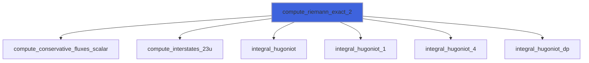

### compute_riemann_exact_3

Solve the Riemann problem between the state $1$ and $4$ using exact Rainkine-Hugonoit jump relations.

```fortran
subroutine compute_riemann_exact_3(si, sir, nv, q_aux1, q_aux4, g1, g4, F, lmax)
```

**Arguments**

| Name | Type | Intent | Attributes | Description |
|------|------|--------|------------|-------------|
| `si` | integer(kind=[I4P](/api/src/third_party/PENF/src/lib/penf_global_parameters_variables)) | in |  | Directional (1=x,2=y,3=z) increment. |
| `sir` | real(kind=[R8P](/api/src/third_party/PENF/src/lib/penf_global_parameters_variables)) | in |  | Directional (1=x,2=y,3=z) increment. |
| `nv` | integer(kind=[I4P](/api/src/third_party/PENF/src/lib/penf_global_parameters_variables)) | in |  | Number of conservative varibales. |
| `q_aux1` | real(kind=[R8P](/api/src/third_party/PENF/src/lib/penf_global_parameters_variables)) | in |  | Left state, auxiliary variables. |
| `q_aux4` | real(kind=[R8P](/api/src/third_party/PENF/src/lib/penf_global_parameters_variables)) | in |  | Left state, auxiliary variables. |
| `g1` | real(kind=[R8P](/api/src/third_party/PENF/src/lib/penf_global_parameters_variables)) | in |  | Specific heats ratio of state 1. |
| `g4` | real(kind=[R8P](/api/src/third_party/PENF/src/lib/penf_global_parameters_variables)) | in |  | Specific heats ratio of state 4. |
| `F` | real(kind=[R8P](/api/src/third_party/PENF/src/lib/penf_global_parameters_variables)) | inout |  | Resulting fluxes. |
| `lmax` | real(kind=[R8P](/api/src/third_party/PENF/src/lib/penf_global_parameters_variables)) | out | optional | Maximum wave speed estimation. |

**Call graph**

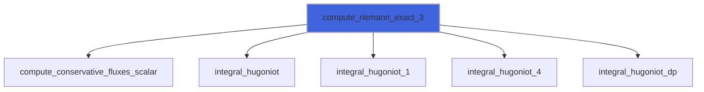

### compute_riemann_hllc

Solve the Riemann problem between the state $1$ and $4$ using the HLLC solver.

```fortran
subroutine compute_riemann_hllc(si, sir, nv, q_aux1, q_aux4, g1, g4, F, lmax)
```

**Arguments**

| Name | Type | Intent | Attributes | Description |
|------|------|--------|------------|-------------|
| `si` | integer(kind=[I4P](/api/src/third_party/PENF/src/lib/penf_global_parameters_variables)) | in |  | Directional (1=x,2=y,3=z) increment. |
| `sir` | real(kind=[R8P](/api/src/third_party/PENF/src/lib/penf_global_parameters_variables)) | in |  | Directional (1=x,2=y,3=z) increment. |
| `nv` | integer(kind=[I4P](/api/src/third_party/PENF/src/lib/penf_global_parameters_variables)) | in |  | Number of conservative varibales. |
| `q_aux1` | real(kind=[R8P](/api/src/third_party/PENF/src/lib/penf_global_parameters_variables)) | in |  | Left state, auxiliary variables. |
| `q_aux4` | real(kind=[R8P](/api/src/third_party/PENF/src/lib/penf_global_parameters_variables)) | in |  | Left state, auxiliary variables. |
| `g1` | real(kind=[R8P](/api/src/third_party/PENF/src/lib/penf_global_parameters_variables)) | in |  | Specific heats ratio of state 1. |
| `g4` | real(kind=[R8P](/api/src/third_party/PENF/src/lib/penf_global_parameters_variables)) | in |  | Specific heats ratio of state 4. |
| `F` | real(kind=[R8P](/api/src/third_party/PENF/src/lib/penf_global_parameters_variables)) | inout |  | Resulting fluxes. |
| `lmax` | real(kind=[R8P](/api/src/third_party/PENF/src/lib/penf_global_parameters_variables)) | out | optional | Maximum wave speed estimation. |

**Call graph**

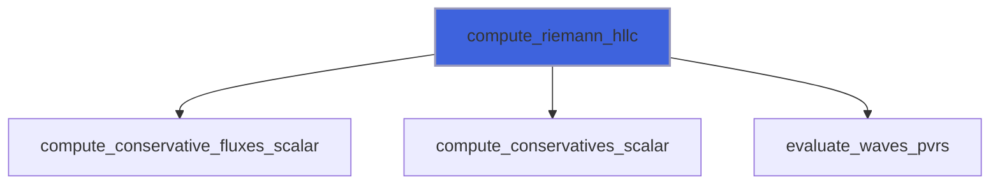

### compute_riemann_llf

Solve the Riemann problem between the state $1$ and $4$ using the (local) Lax Friedrichs (Rusanov) solver.

```fortran
subroutine compute_riemann_llf(si, sir, nv, q_aux1, q_aux4, g1, g4, F, lmax)
```

**Arguments**

| Name | Type | Intent | Attributes | Description |
|------|------|--------|------------|-------------|
| `si` | integer(kind=[I4P](/api/src/third_party/PENF/src/lib/penf_global_parameters_variables)) | in |  | Directional (1=x,2=y,3=z) increment. |
| `sir` | real(kind=[R8P](/api/src/third_party/PENF/src/lib/penf_global_parameters_variables)) | in |  | Directional (1=x,2=y,3=z) increment. |
| `nv` | integer(kind=[I4P](/api/src/third_party/PENF/src/lib/penf_global_parameters_variables)) | in |  | Number of conservative varibales. |
| `q_aux1` | real(kind=[R8P](/api/src/third_party/PENF/src/lib/penf_global_parameters_variables)) | in |  | Left state, auxiliary variables. |
| `q_aux4` | real(kind=[R8P](/api/src/third_party/PENF/src/lib/penf_global_parameters_variables)) | in |  | Left state, auxiliary variables. |
| `g1` | real(kind=[R8P](/api/src/third_party/PENF/src/lib/penf_global_parameters_variables)) | in |  | Specific heats ratio of state 1. |
| `g4` | real(kind=[R8P](/api/src/third_party/PENF/src/lib/penf_global_parameters_variables)) | in |  | Specific heats ratio of state 4. |
| `F` | real(kind=[R8P](/api/src/third_party/PENF/src/lib/penf_global_parameters_variables)) | inout |  | Resulting fluxes. |
| `lmax` | real(kind=[R8P](/api/src/third_party/PENF/src/lib/penf_global_parameters_variables)) | out | optional | Maximum wave speed estimation. |

**Call graph**

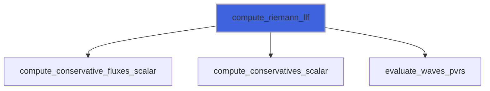

### compute_riemann_ts

Solve the Riemann problem between the state $1$ and $4$ using the TS (two shocks) solver.

```fortran
subroutine compute_riemann_ts(si, sir, nv, q_aux1, q_aux4, g1, g4, F, lmax)
```

**Arguments**

| Name | Type | Intent | Attributes | Description |
|------|------|--------|------------|-------------|
| `si` | integer(kind=[I4P](/api/src/third_party/PENF/src/lib/penf_global_parameters_variables)) | in |  | Directional (1=x,2=y,3=z) increment. |
| `sir` | real(kind=[R8P](/api/src/third_party/PENF/src/lib/penf_global_parameters_variables)) | in |  | Directional (1=x,2=y,3=z) increment. |
| `nv` | integer(kind=[I4P](/api/src/third_party/PENF/src/lib/penf_global_parameters_variables)) | in |  | Number of conservative varibales. |
| `q_aux1` | real(kind=[R8P](/api/src/third_party/PENF/src/lib/penf_global_parameters_variables)) | in |  | Left state, auxiliary variables. |
| `q_aux4` | real(kind=[R8P](/api/src/third_party/PENF/src/lib/penf_global_parameters_variables)) | in |  | Left state, auxiliary variables. |
| `g1` | real(kind=[R8P](/api/src/third_party/PENF/src/lib/penf_global_parameters_variables)) | in |  | Specific heats ratio of state 1. |
| `g4` | real(kind=[R8P](/api/src/third_party/PENF/src/lib/penf_global_parameters_variables)) | in |  | Specific heats ratio of state 4. |
| `F` | real(kind=[R8P](/api/src/third_party/PENF/src/lib/penf_global_parameters_variables)) | inout |  | Resulting fluxes. |
| `lmax` | real(kind=[R8P](/api/src/third_party/PENF/src/lib/penf_global_parameters_variables)) | out | optional | Maximum wave speed estimation. |

**Call graph**

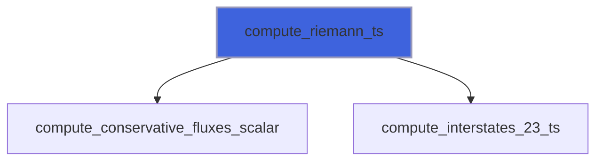

### compute_conservatives_scalar

Compute convervative variables from auxiliary ones, scalar input.

**Attributes**: pure

```fortran
subroutine compute_conservatives_scalar(q_aux, q)
```

**Arguments**

| Name | Type | Intent | Attributes | Description |
|------|------|--------|------------|-------------|
| `q_aux` | real(kind=[R8P](/api/src/third_party/PENF/src/lib/penf_global_parameters_variables)) | in |  | Auxiliary variables. |
| `q` | real(kind=[R8P](/api/src/third_party/PENF/src/lib/penf_global_parameters_variables)) | inout |  | Conservative varibales. |

**Call graph**

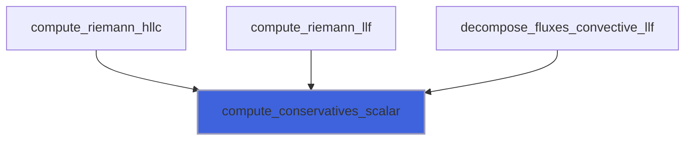

### compute_conservative_fluxes_scalar

Compute convervative fluxes from auxiliary variables, scalar input.

**Attributes**: pure

```fortran
subroutine compute_conservative_fluxes_scalar(sir, q_aux, f)
```

**Arguments**

| Name | Type | Intent | Attributes | Description |
|------|------|--------|------------|-------------|
| `sir` | real(kind=[R8P](/api/src/third_party/PENF/src/lib/penf_global_parameters_variables)) | in |  | Directional (1=x,2=y,3=z) increment. |
| `q_aux` | real(kind=[R8P](/api/src/third_party/PENF/src/lib/penf_global_parameters_variables)) | in |  | Auxiliary variables. |
| `f` | real(kind=[R8P](/api/src/third_party/PENF/src/lib/penf_global_parameters_variables)) | inout |  | Conservative fluxes. |

**Call graph**

```mermaid
flowchart TD
  compute_riemann_exact["compute_riemann_exact"] --> compute_conservative_fluxes_scalar["compute_conservative_fluxes_scalar"]
  compute_riemann_exact_2["compute_riemann_exact_2"] --> compute_conservative_fluxes_scalar["compute_conservative_fluxes_scalar"]
  compute_riemann_exact_3["compute_riemann_exact_3"] --> compute_conservative_fluxes_scalar["compute_conservative_fluxes_scalar"]
  compute_riemann_hllc["compute_riemann_hllc"] --> compute_conservative_fluxes_scalar["compute_conservative_fluxes_scalar"]
  compute_riemann_llf["compute_riemann_llf"] --> compute_conservative_fluxes_scalar["compute_conservative_fluxes_scalar"]
  compute_riemann_ts["compute_riemann_ts"] --> compute_conservative_fluxes_scalar["compute_conservative_fluxes_scalar"]
  decompose_fluxes_convective_llf["decompose_fluxes_convective_llf"] --> compute_conservative_fluxes_scalar["compute_conservative_fluxes_scalar"]
  style compute_conservative_fluxes_scalar fill:#3e63dd,stroke:#99b,stroke-width:2px
```

### compute_interstates_23_ts

**Attributes**: elemental

```fortran
subroutine compute_interstates_23_ts(p1, r1, u1, a1, g1, p4, r4, u4, a4, g4, u23, p23, r2, r3, S1, S2, S3, S4)
```

**Arguments**

| Name | Type | Intent | Attributes | Description |
|------|------|--------|------------|-------------|
| `p1` | real(kind=[R8P](/api/src/third_party/PENF/src/lib/penf_global_parameters_variables)) | in |  |  |
| `r1` | real(kind=[R8P](/api/src/third_party/PENF/src/lib/penf_global_parameters_variables)) | in |  |  |
| `u1` | real(kind=[R8P](/api/src/third_party/PENF/src/lib/penf_global_parameters_variables)) | in |  |  |
| `a1` | real(kind=[R8P](/api/src/third_party/PENF/src/lib/penf_global_parameters_variables)) | in |  |  |
| `g1` | real(kind=[R8P](/api/src/third_party/PENF/src/lib/penf_global_parameters_variables)) | in |  |  |
| `p4` | real(kind=[R8P](/api/src/third_party/PENF/src/lib/penf_global_parameters_variables)) | in |  |  |
| `r4` | real(kind=[R8P](/api/src/third_party/PENF/src/lib/penf_global_parameters_variables)) | in |  |  |
| `u4` | real(kind=[R8P](/api/src/third_party/PENF/src/lib/penf_global_parameters_variables)) | in |  |  |
| `a4` | real(kind=[R8P](/api/src/third_party/PENF/src/lib/penf_global_parameters_variables)) | in |  |  |
| `g4` | real(kind=[R8P](/api/src/third_party/PENF/src/lib/penf_global_parameters_variables)) | in |  |  |
| `u23` | real(kind=[R8P](/api/src/third_party/PENF/src/lib/penf_global_parameters_variables)) | out |  |  |
| `p23` | real(kind=[R8P](/api/src/third_party/PENF/src/lib/penf_global_parameters_variables)) | out |  |  |
| `r2` | real(kind=[R8P](/api/src/third_party/PENF/src/lib/penf_global_parameters_variables)) | out |  |  |
| `r3` | real(kind=[R8P](/api/src/third_party/PENF/src/lib/penf_global_parameters_variables)) | out |  |  |
| `S1` | real(kind=[R8P](/api/src/third_party/PENF/src/lib/penf_global_parameters_variables)) | out |  |  |
| `S2` | real(kind=[R8P](/api/src/third_party/PENF/src/lib/penf_global_parameters_variables)) | out |  |  |
| `S3` | real(kind=[R8P](/api/src/third_party/PENF/src/lib/penf_global_parameters_variables)) | out |  |  |
| `S4` | real(kind=[R8P](/api/src/third_party/PENF/src/lib/penf_global_parameters_variables)) | out |  |  |

**Call graph**

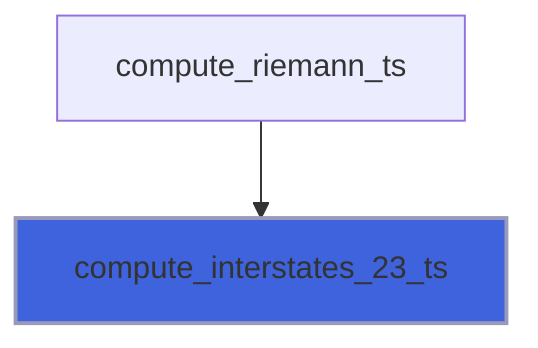

### compute_interstates_23u

Compute intermediates states knowing the value of speed (u23) of intermediates states.

**Attributes**: elemental

```fortran
subroutine compute_interstates_23u(p1, u1, a1, g1, gm1_1, gp1_1, delta1, eta1, p4, u4, a4, g4, gm1_4, gp1_4, delta4, eta4, u23, r2, p2, a2, r3, p3, a3, S1, S2, S3, S4)
```

**Arguments**

| Name | Type | Intent | Attributes | Description |
|------|------|--------|------------|-------------|
| `p1` | real(kind=[R8P](/api/src/third_party/PENF/src/lib/penf_global_parameters_variables)) | in |  | Pressure of state 1. |
| `u1` | real(kind=[R8P](/api/src/third_party/PENF/src/lib/penf_global_parameters_variables)) | in |  | Velocity of state 1. |
| `a1` | real(kind=[R8P](/api/src/third_party/PENF/src/lib/penf_global_parameters_variables)) | in |  | Speed of sound of state 1. |
| `g1` | real(kind=[R8P](/api/src/third_party/PENF/src/lib/penf_global_parameters_variables)) | in |  | Specific heats ratio of state 1. |
| `gm1_1` | real(kind=[R8P](/api/src/third_party/PENF/src/lib/penf_global_parameters_variables)) | in |  | g-1, g+1 of state 1. |
| `gp1_1` | real(kind=[R8P](/api/src/third_party/PENF/src/lib/penf_global_parameters_variables)) | in |  | g-1, g+1 of state 1. |
| `delta1` | real(kind=[R8P](/api/src/third_party/PENF/src/lib/penf_global_parameters_variables)) | in |  | (g-1)/2, 2*g/(g-1) of state 1. |
| `eta1` | real(kind=[R8P](/api/src/third_party/PENF/src/lib/penf_global_parameters_variables)) | in |  | (g-1)/2, 2*g/(g-1) of state 1. |
| `p4` | real(kind=[R8P](/api/src/third_party/PENF/src/lib/penf_global_parameters_variables)) | in |  | Pressure of state 4. |
| `u4` | real(kind=[R8P](/api/src/third_party/PENF/src/lib/penf_global_parameters_variables)) | in |  | Velocity of state 4. |
| `a4` | real(kind=[R8P](/api/src/third_party/PENF/src/lib/penf_global_parameters_variables)) | in |  | Speed of sound of state 4. |
| `g4` | real(kind=[R8P](/api/src/third_party/PENF/src/lib/penf_global_parameters_variables)) | in |  | Specific heats ratio of state 4. |
| `gm1_4` | real(kind=[R8P](/api/src/third_party/PENF/src/lib/penf_global_parameters_variables)) | in |  | g-1, g+1 of state 4. |
| `gp1_4` | real(kind=[R8P](/api/src/third_party/PENF/src/lib/penf_global_parameters_variables)) | in |  | g-1, g+1 of state 4. |
| `delta4` | real(kind=[R8P](/api/src/third_party/PENF/src/lib/penf_global_parameters_variables)) | in |  | (g-1)/2, 2*g/(g-1) of state 4. |
| `eta4` | real(kind=[R8P](/api/src/third_party/PENF/src/lib/penf_global_parameters_variables)) | in |  | (g-1)/2, 2*g/(g-1) of state 4. |
| `u23` | real(kind=[R8P](/api/src/third_party/PENF/src/lib/penf_global_parameters_variables)) | in |  | Velocity of intermediate states. |
| `r2` | real(kind=[R8P](/api/src/third_party/PENF/src/lib/penf_global_parameters_variables)) | out |  | Density, pressure and speed of sound of state 2. |
| `p2` | real(kind=[R8P](/api/src/third_party/PENF/src/lib/penf_global_parameters_variables)) | out |  | Density, pressure and speed of sound of state 2. |
| `a2` | real(kind=[R8P](/api/src/third_party/PENF/src/lib/penf_global_parameters_variables)) | out |  | Density, pressure and speed of sound of state 2. |
| `r3` | real(kind=[R8P](/api/src/third_party/PENF/src/lib/penf_global_parameters_variables)) | out |  | Density, pressure and speed of sound of state 3. |
| `p3` | real(kind=[R8P](/api/src/third_party/PENF/src/lib/penf_global_parameters_variables)) | out |  | Density, pressure and speed of sound of state 3. |
| `a3` | real(kind=[R8P](/api/src/third_party/PENF/src/lib/penf_global_parameters_variables)) | out |  | Density, pressure and speed of sound of state 3. |
| `S1` | real(kind=[R8P](/api/src/third_party/PENF/src/lib/penf_global_parameters_variables)) | out |  | Left signal velocities. |
| `S2` | real(kind=[R8P](/api/src/third_party/PENF/src/lib/penf_global_parameters_variables)) | out |  | Left signal velocities. |
| `S3` | real(kind=[R8P](/api/src/third_party/PENF/src/lib/penf_global_parameters_variables)) | out |  | Right signal velocities. |
| `S4` | real(kind=[R8P](/api/src/third_party/PENF/src/lib/penf_global_parameters_variables)) | out |  | Right signal velocities. |

**Call graph**

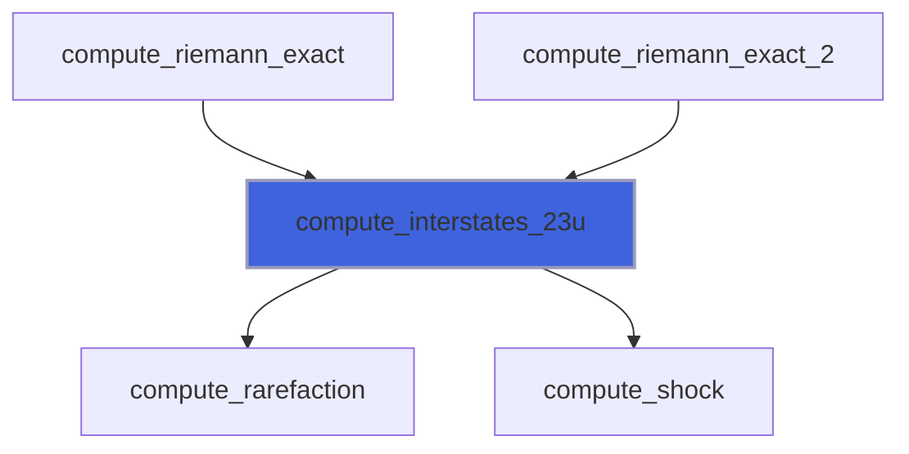

### compute_roe_average

Compute Roe averaged quantities.

**Attributes**: pure

```fortran
subroutine compute_roe_average(ngc, b, i, j, k, ip, jp, kp, g, q_aux, uu, vv, ww, h, qq, c, ci, b1, b2)
```

**Arguments**

| Name | Type | Intent | Attributes | Description |
|------|------|--------|------------|-------------|
| `ngc` | integer(kind=[I4P](/api/src/third_party/PENF/src/lib/penf_global_parameters_variables)) | in |  | Number of ghost cells. |
| `b` | integer(kind=[I4P](/api/src/third_party/PENF/src/lib/penf_global_parameters_variables)) | in |  | Left/right cells indexes. |
| `i` | integer(kind=[I4P](/api/src/third_party/PENF/src/lib/penf_global_parameters_variables)) | in |  | Left/right cells indexes. |
| `j` | integer(kind=[I4P](/api/src/third_party/PENF/src/lib/penf_global_parameters_variables)) | in |  | Left/right cells indexes. |
| `k` | integer(kind=[I4P](/api/src/third_party/PENF/src/lib/penf_global_parameters_variables)) | in |  | Left/right cells indexes. |
| `ip` | integer(kind=[I4P](/api/src/third_party/PENF/src/lib/penf_global_parameters_variables)) | in |  | Left/right cells indexes. |
| `jp` | integer(kind=[I4P](/api/src/third_party/PENF/src/lib/penf_global_parameters_variables)) | in |  | Left/right cells indexes. |
| `kp` | integer(kind=[I4P](/api/src/third_party/PENF/src/lib/penf_global_parameters_variables)) | in |  | Left/right cells indexes. |
| `g` | real(kind=[R8P](/api/src/third_party/PENF/src/lib/penf_global_parameters_variables)) | in |  | Specific heats ratio. |
| `q_aux` | real(kind=[R8P](/api/src/third_party/PENF/src/lib/penf_global_parameters_variables)) | in |  | Auxiliary variables. |
| `uu` | real(kind=[R8P](/api/src/third_party/PENF/src/lib/penf_global_parameters_variables)) | out |  | Roe state average variables. |
| `vv` | real(kind=[R8P](/api/src/third_party/PENF/src/lib/penf_global_parameters_variables)) | out |  | Roe state average variables. |
| `ww` | real(kind=[R8P](/api/src/third_party/PENF/src/lib/penf_global_parameters_variables)) | out |  | Roe state average variables. |
| `h` | real(kind=[R8P](/api/src/third_party/PENF/src/lib/penf_global_parameters_variables)) | out |  | Roe state average variables. |
| `qq` | real(kind=[R8P](/api/src/third_party/PENF/src/lib/penf_global_parameters_variables)) | out |  | Roe state average variables. |
| `c` | real(kind=[R8P](/api/src/third_party/PENF/src/lib/penf_global_parameters_variables)) | out |  | Roe state average variables. |
| `ci` | real(kind=[R8P](/api/src/third_party/PENF/src/lib/penf_global_parameters_variables)) | out |  | Roe state average variables. |
| `b1` | real(kind=[R8P](/api/src/third_party/PENF/src/lib/penf_global_parameters_variables)) | out |  | Roe state average variables. |
| `b2` | real(kind=[R8P](/api/src/third_party/PENF/src/lib/penf_global_parameters_variables)) | out |  | Roe state average variables. |

**Call graph**

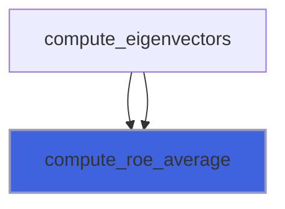

### compute_rarefaction

Compute an unknown state "x" from a known state "0" when the two states are separated by a rarefaction; it is
 assumed that the velocity of the unknown state "ux" is known. There is an input variable that indicates if the rarefaction
 propagates on the "u-a" direction (left) or on the "u+a" one (right).

**Attributes**: elemental

```fortran
subroutine compute_rarefaction(sgn, g, delta, eta, u0, p0, a0, ux, rx, px, ax, s0, sx)
```

**Arguments**

| Name | Type | Intent | Attributes | Description |
|------|------|--------|------------|-------------|
| `sgn` | real(kind=[R8P](/api/src/third_party/PENF/src/lib/penf_global_parameters_variables)) | in |  | Sign for distinguishing "left" (-1) from "right" (1) wave. |
| `g` | real(kind=[R8P](/api/src/third_party/PENF/src/lib/penf_global_parameters_variables)) | in |  | Specific heats ratio. |
| `delta` | real(kind=[R8P](/api/src/third_party/PENF/src/lib/penf_global_parameters_variables)) | in |  | (g-1)/2. |
| `eta` | real(kind=[R8P](/api/src/third_party/PENF/src/lib/penf_global_parameters_variables)) | in |  | 2*g/(g-1). |
| `u0` | real(kind=[R8P](/api/src/third_party/PENF/src/lib/penf_global_parameters_variables)) | in |  | Known state (speed, pressure and speed of sound). |
| `p0` | real(kind=[R8P](/api/src/third_party/PENF/src/lib/penf_global_parameters_variables)) | in |  | Known state (speed, pressure and speed of sound). |
| `a0` | real(kind=[R8P](/api/src/third_party/PENF/src/lib/penf_global_parameters_variables)) | in |  | Known state (speed, pressure and speed of sound). |
| `ux` | real(kind=[R8P](/api/src/third_party/PENF/src/lib/penf_global_parameters_variables)) | in |  | Known speed of unknown state. |
| `rx` | real(kind=[R8P](/api/src/third_party/PENF/src/lib/penf_global_parameters_variables)) | out |  | Unknown pressure and density. |
| `px` | real(kind=[R8P](/api/src/third_party/PENF/src/lib/penf_global_parameters_variables)) | out |  | Unknown pressure and density. |
| `ax` | real(kind=[R8P](/api/src/third_party/PENF/src/lib/penf_global_parameters_variables)) | out |  | Unknown pressure and density. |
| `s0` | real(kind=[R8P](/api/src/third_party/PENF/src/lib/penf_global_parameters_variables)) | out |  | Wave speeds (head and back fronts). |
| `sx` | real(kind=[R8P](/api/src/third_party/PENF/src/lib/penf_global_parameters_variables)) | out |  | Wave speeds (head and back fronts). |

**Call graph**

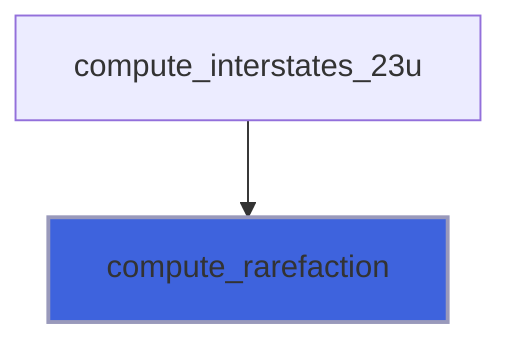

### compute_shock

Compute an unknown state "x" from a known state "0" when the two states are separated by a shock; it is
 assumed that the velocity of the unknown state "ux" is known. There is an input variable that indicates if the shock
 propagates on the "u-a" direction (left) or on the "u+a" one (right).

**Attributes**: elemental

```fortran
subroutine compute_shock(sgn, g, gm1, gp1, u0, p0, a0, ux, rx, px, ax, ss)
```

**Arguments**

| Name | Type | Intent | Attributes | Description |
|------|------|--------|------------|-------------|
| `sgn` | real(kind=[R8P](/api/src/third_party/PENF/src/lib/penf_global_parameters_variables)) | in |  | Sign for distinguishing "left" (-1) from "right" (1) wave. |
| `g` | real(kind=[R8P](/api/src/third_party/PENF/src/lib/penf_global_parameters_variables)) | in |  | Specific heats ratio. |
| `gm1` | real(kind=[R8P](/api/src/third_party/PENF/src/lib/penf_global_parameters_variables)) | in |  | Gm1 = g - 1 , gp1 = g + 1. |
| `gp1` | real(kind=[R8P](/api/src/third_party/PENF/src/lib/penf_global_parameters_variables)) | in |  | Gm1 = g - 1 , gp1 = g + 1. |
| `u0` | real(kind=[R8P](/api/src/third_party/PENF/src/lib/penf_global_parameters_variables)) | in |  | Known state (speed, pressure and speed of sound). |
| `p0` | real(kind=[R8P](/api/src/third_party/PENF/src/lib/penf_global_parameters_variables)) | in |  | Known state (speed, pressure and speed of sound). |
| `a0` | real(kind=[R8P](/api/src/third_party/PENF/src/lib/penf_global_parameters_variables)) | in |  | Known state (speed, pressure and speed of sound). |
| `ux` | real(kind=[R8P](/api/src/third_party/PENF/src/lib/penf_global_parameters_variables)) | in |  | Unknown speed. |
| `rx` | real(kind=[R8P](/api/src/third_party/PENF/src/lib/penf_global_parameters_variables)) | out |  | Unknown state (density, pressure and speed of sound). |
| `px` | real(kind=[R8P](/api/src/third_party/PENF/src/lib/penf_global_parameters_variables)) | out |  | Unknown state (density, pressure and speed of sound). |
| `ax` | real(kind=[R8P](/api/src/third_party/PENF/src/lib/penf_global_parameters_variables)) | out |  | Unknown state (density, pressure and speed of sound). |
| `ss` | real(kind=[R8P](/api/src/third_party/PENF/src/lib/penf_global_parameters_variables)) | out |  | Shock wave speed. |

**Call graph**

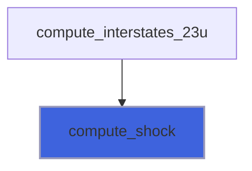

### evaluate_waves_pvrs

Evaluate intermediate waves 2 and 3 from the known states 1,4 using the PVRS approximation.

**Attributes**: pure

```fortran
subroutine evaluate_waves_pvrs(uni, q_aux1, q_aux4, g1, g4, S1, S, S4, lmax, p)
```

**Arguments**

| Name | Type | Intent | Attributes | Description |
|------|------|--------|------------|-------------|
| `uni` | integer(kind=[I4P](/api/src/third_party/PENF/src/lib/penf_global_parameters_variables)) | in |  | Index of normal velocity. |
| `q_aux1` | real(kind=[R8P](/api/src/third_party/PENF/src/lib/penf_global_parameters_variables)) | in |  | Left state, auxiliary variables. |
| `q_aux4` | real(kind=[R8P](/api/src/third_party/PENF/src/lib/penf_global_parameters_variables)) | in |  | Left state, auxiliary variables. |
| `g1` | real(kind=[R8P](/api/src/third_party/PENF/src/lib/penf_global_parameters_variables)) | in |  | Specific heats ratio of state 1. |
| `g4` | real(kind=[R8P](/api/src/third_party/PENF/src/lib/penf_global_parameters_variables)) | in |  | Specific heats ratio of state 4. |
| `S1` | real(kind=[R8P](/api/src/third_party/PENF/src/lib/penf_global_parameters_variables)) | out |  | Waves speed estimations. |
| `S` | real(kind=[R8P](/api/src/third_party/PENF/src/lib/penf_global_parameters_variables)) | out |  | Waves speed estimations. |
| `S4` | real(kind=[R8P](/api/src/third_party/PENF/src/lib/penf_global_parameters_variables)) | out |  | Waves speed estimations. |
| `lmax` | real(kind=[R8P](/api/src/third_party/PENF/src/lib/penf_global_parameters_variables)) | out | optional | Maximum wave speed estimation. |
| `p` | real(kind=[R8P](/api/src/third_party/PENF/src/lib/penf_global_parameters_variables)) | out | optional | Pressure of the intermediate states. |

**Call graph**

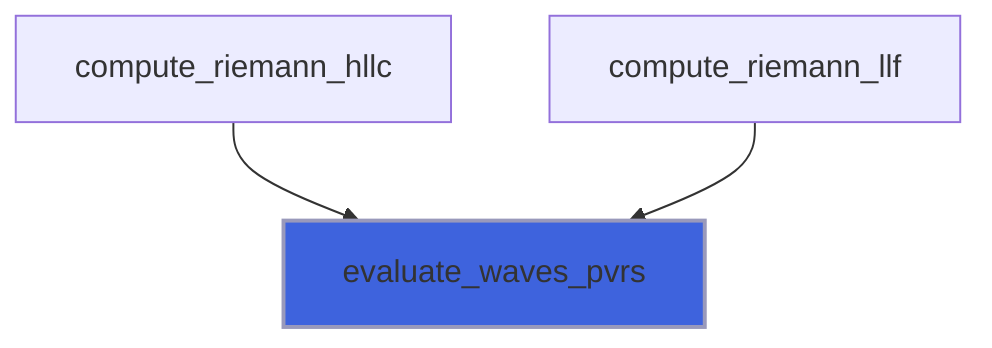
