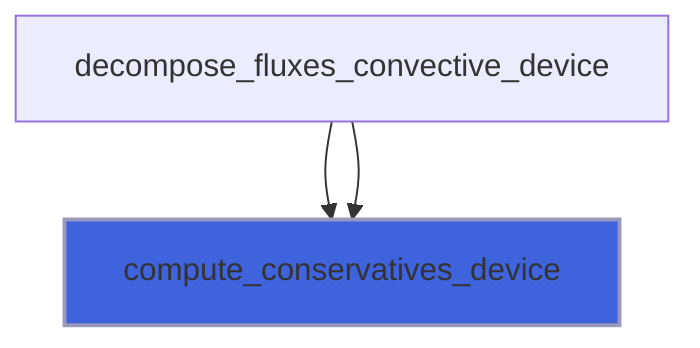
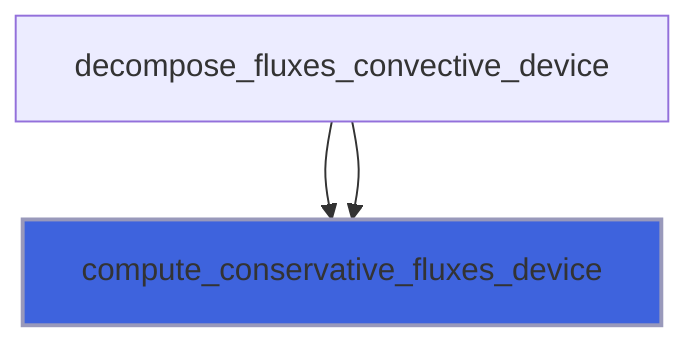
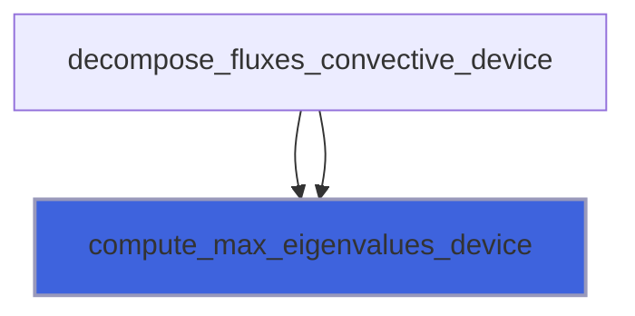
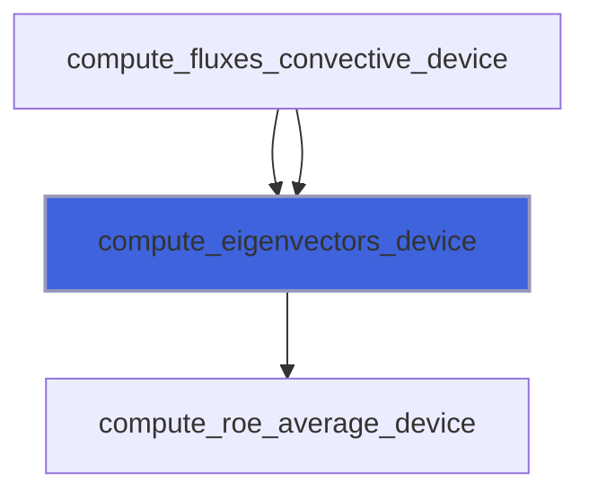
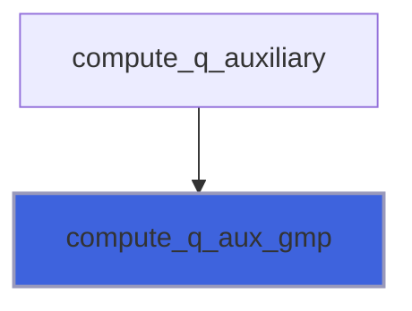
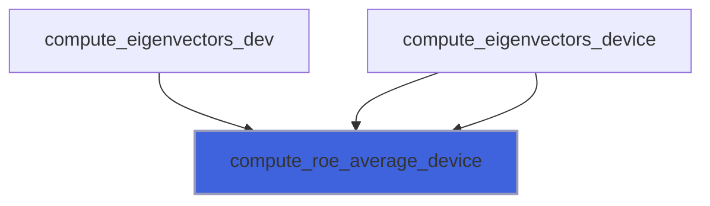

# adam_nasto_gmp_cns_kernels

> ADAM, NASTO GMP Compressible-Navier-Stokes fluidyanmics application kernels.

**Source**: `src/app/nasto/gmp/adam_nasto_gmp_cns_kernels.F90`

**Dependencies**


## Contents

- [compute_conservatives_device](#compute-conservatives-device)
- [compute_conservative_fluxes_device](#compute-conservative-fluxes-device)
- [compute_max_eigenvalues_device](#compute-max-eigenvalues-device)
- [compute_eigenvectors_device](#compute-eigenvectors-device)
- [compute_q_aux_gmp](#compute-q-aux-gmp)
- [compute_roe_average_device](#compute-roe-average-device)

## Subroutines

### compute_conservatives_device

Compute convervative variables from auxiliary ones.

```fortran
subroutine compute_conservatives_device(b, i, j, k, ngc, q_aux_gpu, q)
```

**Arguments**

| Name | Type | Intent | Attributes | Description |
|------|------|--------|------------|-------------|
| `b` | integer(kind=[I4P](/api/src/third_party/PENF/src/lib/penf_global_parameters_variables)) | in |  | Cell indexes. |
| `i` | integer(kind=[I4P](/api/src/third_party/PENF/src/lib/penf_global_parameters_variables)) | in |  | Cell indexes. |
| `j` | integer(kind=[I4P](/api/src/third_party/PENF/src/lib/penf_global_parameters_variables)) | in |  | Cell indexes. |
| `k` | integer(kind=[I4P](/api/src/third_party/PENF/src/lib/penf_global_parameters_variables)) | in |  | Cell indexes. |
| `ngc` | integer(kind=[I4P](/api/src/third_party/PENF/src/lib/penf_global_parameters_variables)) | in |  | Ghost cells number. |
| `q_aux_gpu` | real(kind=[R8P](/api/src/third_party/PENF/src/lib/penf_global_parameters_variables)) | in |  | Auxiliary variables. |
| `q` | real(kind=[R8P](/api/src/third_party/PENF/src/lib/penf_global_parameters_variables)) | inout |  | Conservative varibales. |

**Call graph**



### compute_conservative_fluxes_device

Compute convervative fluxes from auxiliary variables.

```fortran
subroutine compute_conservative_fluxes_device(sir, b, i, j, k, ngc, q_aux_gpu, f)
```

**Arguments**

| Name | Type | Intent | Attributes | Description |
|------|------|--------|------------|-------------|
| `sir` | real(kind=[R8P](/api/src/third_party/PENF/src/lib/penf_global_parameters_variables)) | in |  | Directional (1=x,2=y,3=z) increment. |
| `b` | integer(kind=[I4P](/api/src/third_party/PENF/src/lib/penf_global_parameters_variables)) | in |  | Cell indexes. |
| `i` | integer(kind=[I4P](/api/src/third_party/PENF/src/lib/penf_global_parameters_variables)) | in |  | Cell indexes. |
| `j` | integer(kind=[I4P](/api/src/third_party/PENF/src/lib/penf_global_parameters_variables)) | in |  | Cell indexes. |
| `k` | integer(kind=[I4P](/api/src/third_party/PENF/src/lib/penf_global_parameters_variables)) | in |  | Cell indexes. |
| `ngc` | integer(kind=[I4P](/api/src/third_party/PENF/src/lib/penf_global_parameters_variables)) | in |  | Ghost cells number. |
| `q_aux_gpu` | real(kind=[R8P](/api/src/third_party/PENF/src/lib/penf_global_parameters_variables)) | in |  | Auxiliary variables. |
| `f` | real(kind=[R8P](/api/src/third_party/PENF/src/lib/penf_global_parameters_variables)) | inout |  | Conservative fluxes. |

**Call graph**



### compute_max_eigenvalues_device

```fortran
subroutine compute_max_eigenvalues_device(si, sir, weno_s, b, i, j, k, ngc, nv, q_aux_gpu, evmax)
```

**Arguments**

| Name | Type | Intent | Attributes | Description |
|------|------|--------|------------|-------------|
| `si` | integer(kind=[I4P](/api/src/third_party/PENF/src/lib/penf_global_parameters_variables)) | in |  | Stencil increment. |
| `sir` | real(kind=[R8P](/api/src/third_party/PENF/src/lib/penf_global_parameters_variables)) | in |  | Stencil increment, real cast. |
| `weno_s` | integer(kind=[I4P](/api/src/third_party/PENF/src/lib/penf_global_parameters_variables)) | in |  | Weno stencils number/dimension. |
| `b` | integer(kind=[I4P](/api/src/third_party/PENF/src/lib/penf_global_parameters_variables)) | in |  | Cell indexes. |
| `i` | integer(kind=[I4P](/api/src/third_party/PENF/src/lib/penf_global_parameters_variables)) | in |  | Cell indexes. |
| `j` | integer(kind=[I4P](/api/src/third_party/PENF/src/lib/penf_global_parameters_variables)) | in |  | Cell indexes. |
| `k` | integer(kind=[I4P](/api/src/third_party/PENF/src/lib/penf_global_parameters_variables)) | in |  | Cell indexes. |
| `ngc` | integer(kind=[I4P](/api/src/third_party/PENF/src/lib/penf_global_parameters_variables)) | in |  | Ghost cells number. |
| `nv` | integer(kind=[I4P](/api/src/third_party/PENF/src/lib/penf_global_parameters_variables)) | in |  | Number of conservative varibales. |
| `q_aux_gpu` | real(kind=[R8P](/api/src/third_party/PENF/src/lib/penf_global_parameters_variables)) | in |  | Auxiliary variables. |
| `evmax` | real(kind=[R8P](/api/src/third_party/PENF/src/lib/penf_global_parameters_variables)) | inout |  | Maximum eigenvalues in the big stencil. |

**Call graph**



### compute_eigenvectors_device

```fortran
subroutine compute_eigenvectors_device(si, sir, b, i, j, k, ngc, nv, g, q_aux_gpu, el, er)
```

**Arguments**

| Name | Type | Intent | Attributes | Description |
|------|------|--------|------------|-------------|
| `si` | integer(kind=[I4P](/api/src/third_party/PENF/src/lib/penf_global_parameters_variables)) | in |  | Stencil increment. |
| `sir` | real(kind=[R8P](/api/src/third_party/PENF/src/lib/penf_global_parameters_variables)) | in |  | Stencil increment, real cast. |
| `b` | integer(kind=[I4P](/api/src/third_party/PENF/src/lib/penf_global_parameters_variables)) | in |  | Cell indexes. |
| `i` | integer(kind=[I4P](/api/src/third_party/PENF/src/lib/penf_global_parameters_variables)) | in |  | Cell indexes. |
| `j` | integer(kind=[I4P](/api/src/third_party/PENF/src/lib/penf_global_parameters_variables)) | in |  | Cell indexes. |
| `k` | integer(kind=[I4P](/api/src/third_party/PENF/src/lib/penf_global_parameters_variables)) | in |  | Cell indexes. |
| `ngc` | integer(kind=[I4P](/api/src/third_party/PENF/src/lib/penf_global_parameters_variables)) | in |  | Ghost cells number. |
| `nv` | integer(kind=[I4P](/api/src/third_party/PENF/src/lib/penf_global_parameters_variables)) | in |  | Number of conservative varibales. |
| `g` | real(kind=[R8P](/api/src/third_party/PENF/src/lib/penf_global_parameters_variables)) | in |  | Specific heats ratio. |
| `q_aux_gpu` | real(kind=[R8P](/api/src/third_party/PENF/src/lib/penf_global_parameters_variables)) | in |  | Auxiliary variables. |
| `el` | real(kind=[R8P](/api/src/third_party/PENF/src/lib/penf_global_parameters_variables)) | inout |  | Left and right eigenvectors. |
| `er` | real(kind=[R8P](/api/src/third_party/PENF/src/lib/penf_global_parameters_variables)) | inout |  | Left and right eigenvectors. |

**Call graph**



### compute_q_aux_gmp

Compute auxiliary variables.

```fortran
subroutine compute_q_aux_gmp(ni, nj, nk, ngc, blocks_number, R, cv, g, q_gpu, q_aux_gpu)
```

**Arguments**

| Name | Type | Intent | Attributes | Description |
|------|------|--------|------------|-------------|
| `ni` | integer(kind=[I4P](/api/src/third_party/PENF/src/lib/penf_global_parameters_variables)) | in |  | Grid cells number in I direction. |
| `nj` | integer(kind=[I4P](/api/src/third_party/PENF/src/lib/penf_global_parameters_variables)) | in |  | Grid cells number in J direction. |
| `nk` | integer(kind=[I4P](/api/src/third_party/PENF/src/lib/penf_global_parameters_variables)) | in |  | Grid cells number in K direction. |
| `ngc` | integer(kind=[I4P](/api/src/third_party/PENF/src/lib/penf_global_parameters_variables)) | in |  | Ghost cells number. |
| `blocks_number` | integer(kind=[I4P](/api/src/third_party/PENF/src/lib/penf_global_parameters_variables)) | in |  | Number of blocks. |
| `R` | real(kind=[R8P](/api/src/third_party/PENF/src/lib/penf_global_parameters_variables)) | in |  | Fluid constant, specific heats difference. |
| `cv` | real(kind=[R8P](/api/src/third_party/PENF/src/lib/penf_global_parameters_variables)) | in |  | Specific heat at constant volume. |
| `g` | real(kind=[R8P](/api/src/third_party/PENF/src/lib/penf_global_parameters_variables)) | in |  | Specific heats ratio. |
| `q_gpu` | real(kind=[R8P](/api/src/third_party/PENF/src/lib/penf_global_parameters_variables)) | in |  | Conservative variables. |
| `q_aux_gpu` | real(kind=[R8P](/api/src/third_party/PENF/src/lib/penf_global_parameters_variables)) | out |  | Auxiliary variables. |

**Call graph**



### compute_roe_average_device

Compute Roe averaged quantities.

```fortran
subroutine compute_roe_average_device(ngc, b, i, j, k, ip, jp, kp, g, q_aux_gpu, uu, vv, ww, h, qq, c, ci, b1, b2)
```

**Arguments**

| Name | Type | Intent | Attributes | Description |
|------|------|--------|------------|-------------|
| `ngc` | integer(kind=[I4P](/api/src/third_party/PENF/src/lib/penf_global_parameters_variables)) | in |  | Number of ghost cells. |
| `b` | integer(kind=[I4P](/api/src/third_party/PENF/src/lib/penf_global_parameters_variables)) | in |  | Left/right cells indexes. |
| `i` | integer(kind=[I4P](/api/src/third_party/PENF/src/lib/penf_global_parameters_variables)) | in |  | Left/right cells indexes. |
| `j` | integer(kind=[I4P](/api/src/third_party/PENF/src/lib/penf_global_parameters_variables)) | in |  | Left/right cells indexes. |
| `k` | integer(kind=[I4P](/api/src/third_party/PENF/src/lib/penf_global_parameters_variables)) | in |  | Left/right cells indexes. |
| `ip` | integer(kind=[I4P](/api/src/third_party/PENF/src/lib/penf_global_parameters_variables)) | in |  | Left/right cells indexes. |
| `jp` | integer(kind=[I4P](/api/src/third_party/PENF/src/lib/penf_global_parameters_variables)) | in |  | Left/right cells indexes. |
| `kp` | integer(kind=[I4P](/api/src/third_party/PENF/src/lib/penf_global_parameters_variables)) | in |  | Left/right cells indexes. |
| `g` | real(kind=[R8P](/api/src/third_party/PENF/src/lib/penf_global_parameters_variables)) | in |  | Specific heats ratio. |
| `q_aux_gpu` | real(kind=[R8P](/api/src/third_party/PENF/src/lib/penf_global_parameters_variables)) | in |  | Auxiliary variables. |
| `uu` | real(kind=[R8P](/api/src/third_party/PENF/src/lib/penf_global_parameters_variables)) | out |  | Roe state average variables. |
| `vv` | real(kind=[R8P](/api/src/third_party/PENF/src/lib/penf_global_parameters_variables)) | out |  | Roe state average variables. |
| `ww` | real(kind=[R8P](/api/src/third_party/PENF/src/lib/penf_global_parameters_variables)) | out |  | Roe state average variables. |
| `h` | real(kind=[R8P](/api/src/third_party/PENF/src/lib/penf_global_parameters_variables)) | out |  | Roe state average variables. |
| `qq` | real(kind=[R8P](/api/src/third_party/PENF/src/lib/penf_global_parameters_variables)) | out |  | Roe state average variables. |
| `c` | real(kind=[R8P](/api/src/third_party/PENF/src/lib/penf_global_parameters_variables)) | out |  | Roe state average variables. |
| `ci` | real(kind=[R8P](/api/src/third_party/PENF/src/lib/penf_global_parameters_variables)) | out |  | Roe state average variables. |
| `b1` | real(kind=[R8P](/api/src/third_party/PENF/src/lib/penf_global_parameters_variables)) | out |  | Roe state average variables. |
| `b2` | real(kind=[R8P](/api/src/third_party/PENF/src/lib/penf_global_parameters_variables)) | out |  | Roe state average variables. |

**Call graph**


