# adam_nasto_gmp_object

> ADAM, Navier-Stokes equations system class definition, GPU (GMP) backend.

**Source**: `src/app/nasto/gmp/adam_nasto_gmp_object.F90`

**Dependencies**

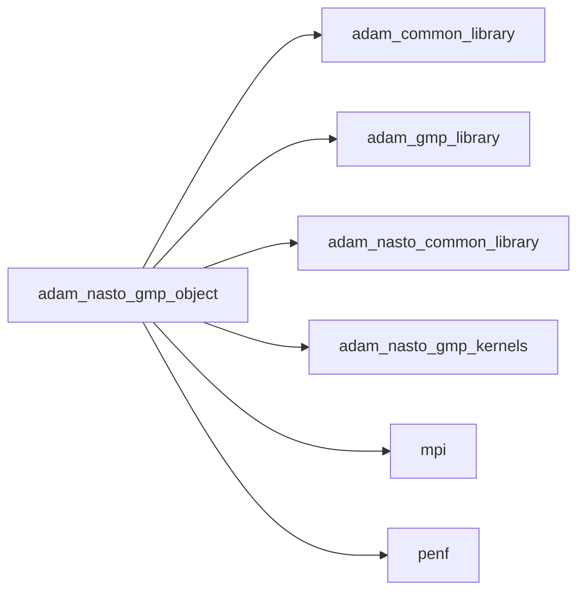

## Contents

- [nasto_gmp_object](#nasto-gmp-object)
- [allocate_gpu](#allocate-gpu)
- [copy_cpu_gpu](#copy-cpu-gpu)
- [copy_gpu_cpu](#copy-gpu-cpu)
- [initialize](#initialize)
- [amr_update](#amr-update)
- [compute_phi](#compute-phi)
- [mark_by_geo](#mark-by-geo)
- [mark_by_grad_var](#mark-by-grad-var)
- [move_phi](#move-phi)
- [refine_uniform](#refine-uniform)
- [integrate_eikonal](#integrate-eikonal)
- [load_restart_files](#load-restart-files)
- [save_hdf5](#save-hdf5)
- [save_residuals](#save-residuals)
- [save_restart_files](#save-restart-files)
- [save_simulation_data](#save-simulation-data)
- [set_boundary_conditions](#set-boundary-conditions)
- [set_initial_conditions](#set-initial-conditions)
- [update_ghost](#update-ghost)
- [compute_dt](#compute-dt)
- [compute_q_auxiliary](#compute-q-auxiliary)
- [compute_residuals](#compute-residuals)
- [integrate](#integrate)
- [simulate](#simulate)

## Derived Types

### nasto_gmp_object

Navier-Stokes equations system class definition, GPU (GMP) backend.

**Inheritance**

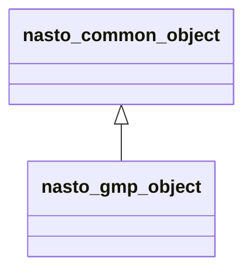

**Extends**: [`nasto_common_object`](/api/src/app/nasto/common/adam_nasto_common_object#nasto-common-object)

#### Components

| Name | Type | Attributes | Description |
|------|------|------------|-------------|
| `mpih` | type([mpih_object](/api/src/third_party/FUNDAL/src/lib/fundal_mpih_object#mpih-object)) |  | MPI handler. |
| `adam` | type([adam_object](/api/src/lib/common/adam_adam_object#adam-object)) |  | ADAM. |
| `field` | type([field_object](/api/src/lib/common/adam_field_object#field-object)) | pointer | The field. |
| `grid` | type([grid_object](/api/src/lib/common/adam_grid_object#grid-object)) | pointer | The grid. |
| `amr` | type([amr_object](/api/src/lib/common/adam_amr_object#amr-object)) |  | AMR marker handler. |
| `ib` | type([ib_object](/api/src/lib/common/adam_ib_object#ib-object)) |  | Immersed Boundary (IB) handler. |
| `slices` | type([slices_object](/api/src/lib/common/adam_slices_object#slices-object)) |  | Slices handler. |
| `rk` | type([rk_object](/api/src/lib/common/adam_rk_object#rk-object)) |  | RK integrator. |
| `weno` | type([weno_object](/api/src/lib/common/adam_weno_object#weno-object)) |  | WENO reconstructor. |
| `io` | type([nasto_io_object](/api/src/app/nasto/common/adam_nasto_io_object#nasto-io-object)) |  | IO handler. |
| `physics` | type([nasto_physics_object](/api/src/app/nasto/common/adam_nasto_physics_object#nasto-physics-object)) |  | Fluids physiscs handler. |
| `ic` | type([nasto_ic_object](/api/src/app/nasto/common/adam_nasto_ic_object#nasto-ic-object)) |  | Initial Conditions (IC) handler. |
| `bc` | type([nasto_bc_object](/api/src/app/nasto/common/adam_nasto_bc_object#nasto-bc-object)) |  | Boundary Conditions (BC) handler. |
| `time` | type([nasto_time_object](/api/src/app/nasto/common/adam_nasto_time_object#nasto-time-object)) |  | Time handler. |
| `ngc` | integer(kind=[I4P](/api/src/third_party/PENF/src/lib/penf_global_parameters_variables)) | pointer | Number of ghost cells. |
| `ni` | integer(kind=[I4P](/api/src/third_party/PENF/src/lib/penf_global_parameters_variables)) | pointer | Number of cells in i direction. |
| `nj` | integer(kind=[I4P](/api/src/third_party/PENF/src/lib/penf_global_parameters_variables)) | pointer | Number of cells in j direction. |
| `nk` | integer(kind=[I4P](/api/src/third_party/PENF/src/lib/penf_global_parameters_variables)) | pointer | Number of cells in k direction. |
| `nb` | integer(kind=[I4P](/api/src/third_party/PENF/src/lib/penf_global_parameters_variables)) | pointer | Total blocks number for MPI. |
| `blocks_number` | integer(kind=[I4P](/api/src/third_party/PENF/src/lib/penf_global_parameters_variables)) | pointer | Actual blocks number. |
| `ns` | integer(kind=[I4P](/api/src/third_party/PENF/src/lib/penf_global_parameters_variables)) | pointer | Number of fluids specie. |
| `nv` | integer(kind=[I4P](/api/src/third_party/PENF/src/lib/penf_global_parameters_variables)) | pointer | Number of conservative variables. |
| `nv_aux` | integer(kind=[I4P](/api/src/third_party/PENF/src/lib/penf_global_parameters_variables)) | pointer | Number of auxiliary variables. |
| `q` | real(kind=[R8P](/api/src/third_party/PENF/src/lib/penf_global_parameters_variables)) | allocatable | Cell centered variables. |
| `q_aux` | real(kind=[R8P](/api/src/third_party/PENF/src/lib/penf_global_parameters_variables)) | allocatable | Auxiliary cell centered variables. |
| `mpih_gpu` | type([mpih_gmp_object](/api/src/lib/gmp/adam_mpih_gmp_object#mpih-gmp-object)) |  | MPI handler, GMP backend. |
| `field_gpu` | type([field_gmp_object](/api/src/lib/gmp/adam_field_gmp_object#field-gmp-object)) |  | The field, GMP backend. |
| `ib_gpu` | type([ib_gmp_object](/api/src/lib/gmp/adam_ib_gmp_object#ib-gmp-object)) |  | IB handler, GMP backend. |
| `rk_gpu` | type([rk_gmp_object](/api/src/lib/gmp/adam_rk_gmp_object#rk-gmp-object)) |  | RK integrator, GMP backend. |
| `weno_gpu` | type([weno_gmp_object](/api/src/lib/gmp/adam_weno_gmp_object#weno-gmp-object)) |  | WENO reconstructor, GMP backend. |
| `q_gpu` | real(kind=[R8P](/api/src/third_party/PENF/src/lib/penf_global_parameters_variables)) | pointer | Field cell centered variables. |
| `q_aux_gpu` | real(kind=[R8P](/api/src/third_party/PENF/src/lib/penf_global_parameters_variables)) | pointer | Auxiliary cell centered variables. |
| `dq_gpu` | real(kind=[R8P](/api/src/third_party/PENF/src/lib/penf_global_parameters_variables)) | pointer | Eikonal right hand side. |
| `flx_gpu` | real(kind=[R8P](/api/src/third_party/PENF/src/lib/penf_global_parameters_variables)) | pointer | Fluxes along x. |
| `fly_gpu` | real(kind=[R8P](/api/src/third_party/PENF/src/lib/penf_global_parameters_variables)) | pointer | Fluxes along y. |
| `flz_gpu` | real(kind=[R8P](/api/src/third_party/PENF/src/lib/penf_global_parameters_variables)) | pointer | Fluxes along z. |
| `q_bc_vars_gpu` | real(kind=[R8P](/api/src/third_party/PENF/src/lib/penf_global_parameters_variables)) | pointer | Variables array for boundary conditions on GPU. |

#### Type-Bound Procedures

| Name | Attributes | Description |
|------|------------|-------------|
| `allocate_common` | pass(self) | Allocate common data. |
| `initialize_common` | pass(self) | Initialize the equation common data. |
| `allocate_gpu` | pass(self) | Allocate GPU data. |
| `copy_cpu_gpu` | pass(self) | Copy data from CPU to GPU. |
| `copy_gpu_cpu` | pass(self) | Copy data from GPU to CPU. |
| `initialize` | pass(self) | Initialize the equation. |
| `amr_update` | pass(self) | Do AMR update. |
| `compute_phi` | pass(self) | Compute phi, distance from IB solid. |
| `mark_by_geo` | pass(self) | Mark blocks to be refined/derefined by a geometric constrain. |
| `mark_by_grad_var` | pass(self) | Mark blocks to be refined/derefined by a `grad(var)` value. |
| `move_phi` | pass(self) | Move phi. |
| `refine_uniform` | pass(self) | Refine all blocks uniformly. |
| `integrate_eikonal` | pass(self) | Integrate eikonal equation. |
| `load_restart_files` | pass(self) | Load restart files. |
| `save_hdf5` | pass(self) | Save simulation data in HDF5 format. |
| `save_residuals` | pass(self) | Save residuals history. |
| `save_restart_files` | pass(self) | Save restart files. |
| `save_simulation_data` | pass(self) | Save all simulation data. |
| `set_boundary_conditions` | pass(self) | Set boundary conditions of equation. |
| `set_initial_conditions` | pass(self) | Set initial conditions of equation. |
| `update_ghost` | pass(self) | Update ghost cells and set boundary conditions. |
| `compute_dt` | pass(self) | Compute time step. |
| `compute_q_auxiliary` | pass(self) | Compute auxiliary variables. |
| `compute_residuals` | pass(self) | Compute residuals. |
| `integrate` | pass(self) | Perform one step integration. |
| `simulate` | pass(self) | Perform the simulation. |

## Subroutines

### allocate_gpu

Allocate GPU data.

```fortran
subroutine allocate_gpu(self, q_gpu)
```

**Arguments**

| Name | Type | Intent | Attributes | Description |
|------|------|--------|------------|-------------|
| `self` | class([nasto_gmp_object](/api/src/app/nasto/gmp/adam_nasto_gmp_object#nasto-gmp-object)) | inout |  | The equation. |
| `q_gpu` | real(kind=[R8P](/api/src/third_party/PENF/src/lib/penf_global_parameters_variables)) | inout | target | Conservative variables. |

**Call graph**

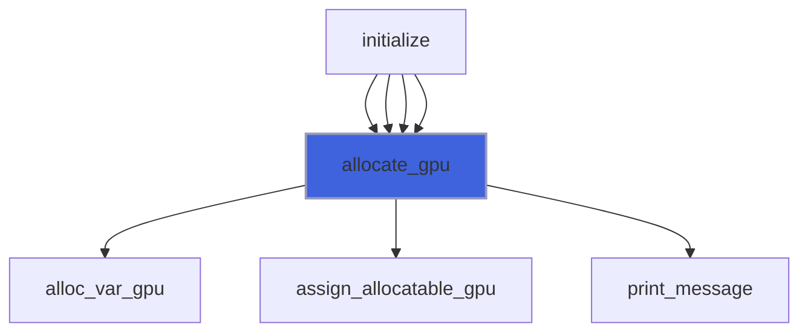

### copy_cpu_gpu

Copy data from CPU to GPU.

```fortran
subroutine copy_cpu_gpu(self)
```

**Arguments**

| Name | Type | Intent | Attributes | Description |
|------|------|--------|------------|-------------|
| `self` | class([nasto_gmp_object](/api/src/app/nasto/gmp/adam_nasto_gmp_object#nasto-gmp-object)) | inout |  | The equation. |

**Call graph**

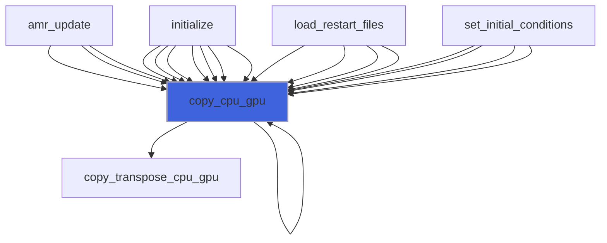

### copy_gpu_cpu

Copy data from GPU to CPU.

```fortran
subroutine copy_gpu_cpu(self, compute_copy_q_aux, copy_phi)
```

**Arguments**

| Name | Type | Intent | Attributes | Description |
|------|------|--------|------------|-------------|
| `self` | class([nasto_gmp_object](/api/src/app/nasto/gmp/adam_nasto_gmp_object#nasto-gmp-object)) | inout |  | The equation. |
| `compute_copy_q_aux` | logical | in | optional | Flag to compute auxiliary variables. |
| `copy_phi` | logical | in | optional | Copy also phi. |

**Call graph**

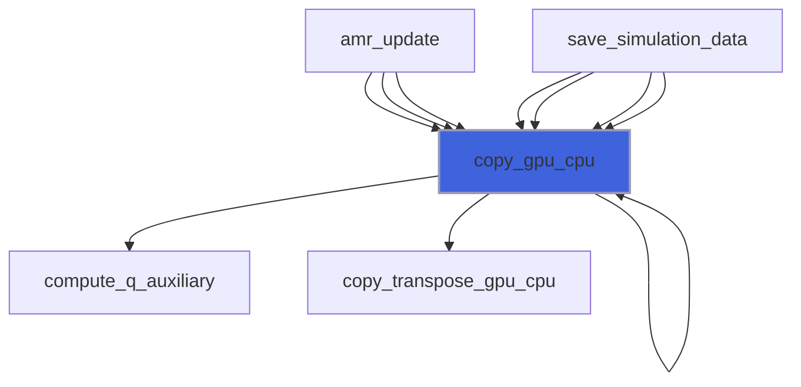

### initialize

Initialize the equation.

```fortran
subroutine initialize(self, filename)
```

**Arguments**

| Name | Type | Intent | Attributes | Description |
|------|------|--------|------------|-------------|
| `self` | class([nasto_gmp_object](/api/src/app/nasto/gmp/adam_nasto_gmp_object#nasto-gmp-object)) | inout |  | The equation. |
| `filename` | character(len=*) | in |  | Input file name. |

**Call graph**

```mermaid
flowchart TD
  add_node["add_node"] --> initialize["initialize"]
  analize["analize"] --> initialize["initialize"]
  build_connectivity["build_connectivity"] --> initialize["initialize"]
  distribute_facets["distribute_facets"] --> initialize["initialize"]
  distribute_facets_tree["distribute_facets_tree"] --> initialize["initialize"]
  export_vtk_file["export_vtk_file"] --> initialize["initialize"]
  initialize["initialize"] --> initialize["initialize"]
  initialize["initialize"] --> initialize["initialize"]
  initialize["initialize"] --> initialize["initialize"]
  initialize["initialize"] --> initialize["initialize"]
  initialize["initialize"] --> initialize["initialize"]
  initialize["initialize"] --> initialize["initialize"]
  initialize["initialize"] --> initialize["initialize"]
  initialize["initialize"] --> initialize["initialize"]
  initialize["initialize"] --> initialize["initialize"]
  initialize["initialize"] --> initialize["initialize"]
  initialize["initialize"] --> initialize["initialize"]
  initialize["initialize"] --> initialize["initialize"]
  initialize["initialize"] --> initialize["initialize"]
  initialize["initialize"] --> initialize["initialize"]
  initialize["initialize"] --> initialize["initialize"]
  initialize["initialize"] --> initialize["initialize"]
  initialize["initialize"] --> initialize["initialize"]
  initialize["initialize"] --> initialize["initialize"]
  initialize["initialize"] --> initialize["initialize"]
  initialize["initialize"] --> initialize["initialize"]
  initialize["initialize"] --> initialize["initialize"]
  initialize["initialize"] --> initialize["initialize"]
  initialize["initialize"] --> initialize["initialize"]
  initialize["initialize"] --> initialize["initialize"]
  initialize["initialize"] --> initialize["initialize"]
  initialize["initialize"] --> initialize["initialize"]
  initialize["initialize"] --> initialize["initialize"]
  initialize["initialize"] --> initialize["initialize"]
  initialize["initialize"] --> initialize["initialize"]
  initialize["initialize"] --> initialize["initialize"]
  initialize["initialize"] --> initialize["initialize"]
  initialize["initialize"] --> initialize["initialize"]
  initialize["initialize"] --> initialize["initialize"]
  initialize["initialize"] --> initialize["initialize"]
  initialize["initialize"] --> initialize["initialize"]
  initialize["initialize"] --> initialize["initialize"]
  initialize["initialize"] --> initialize["initialize"]
  initialize["initialize"] --> initialize["initialize"]
  initialize["initialize"] --> initialize["initialize"]
  initialize["initialize"] --> initialize["initialize"]
  initialize["initialize"] --> initialize["initialize"]
  initialize["initialize"] --> initialize["initialize"]
  initialize["initialize"] --> initialize["initialize"]
  initialize["initialize"] --> initialize["initialize"]
  initialize["initialize"] --> initialize["initialize"]
  initialize["initialize"] --> initialize["initialize"]
  initialize["initialize"] --> initialize["initialize"]
  initialize["initialize"] --> initialize["initialize"]
  initialize["initialize"] --> initialize["initialize"]
  initialize["initialize"] --> initialize["initialize"]
  initialize["initialize"] --> initialize["initialize"]
  initialize["initialize"] --> initialize["initialize"]
  initialize["initialize"] --> initialize["initialize"]
  initialize["initialize"] --> initialize["initialize"]
  initialize["initialize"] --> initialize["initialize"]
  initialize["initialize"] --> initialize["initialize"]
  initialize["initialize"] --> initialize["initialize"]
  initialize["initialize"] --> initialize["initialize"]
  initialize["initialize"] --> initialize["initialize"]
  initialize["initialize"] --> initialize["initialize"]
  initialize["initialize"] --> initialize["initialize"]
  initialize["initialize"] --> initialize["initialize"]
  initialize["initialize"] --> initialize["initialize"]
  initialize["initialize"] --> initialize["initialize"]
  initialize["initialize"] --> initialize["initialize"]
  initialize["initialize"] --> initialize["initialize"]
  initialize["initialize"] --> initialize["initialize"]
  initialize["initialize"] --> initialize["initialize"]
  initialize["initialize"] --> initialize["initialize"]
  initialize["initialize"] --> initialize["initialize"]
  initialize["initialize"] --> initialize["initialize"]
  initialize["initialize"] --> initialize["initialize"]
  initialize_common["initialize_common"] --> initialize["initialize"]
  initialize_common["initialize_common"] --> initialize["initialize"]
  initialize_common["initialize_common"] --> initialize["initialize"]
  initialize_common["initialize_common"] --> initialize["initialize"]
  load_from_file["load_from_file"] --> initialize["initialize"]
  load_from_file["load_from_file"] --> initialize["initialize"]
  open_file["open_file"] --> initialize["initialize"]
  open_file["open_file"] --> initialize["initialize"]
  open_file["open_file"] --> initialize["initialize"]
  resize["resize"] --> initialize["initialize"]
  save_into_file["save_into_file"] --> initialize["initialize"]
  save_vtk["save_vtk"] --> initialize["initialize"]
  simulate["simulate"] --> initialize["initialize"]
  simulate["simulate"] --> initialize["initialize"]
  simulate["simulate"] --> initialize["initialize"]
  simulate["simulate"] --> initialize["initialize"]
  simulate["simulate"] --> initialize["initialize"]
  simulate["simulate"] --> initialize["initialize"]
  simulate["simulate"] --> initialize["initialize"]
  test_stress["test_stress"] --> initialize["initialize"]
  initialize["initialize"] --> allocate_gpu["allocate_gpu"]
  initialize["initialize"] --> description["description"]
  initialize["initialize"] --> initialize["initialize"]
  initialize["initialize"] --> initialize_common["initialize_common"]
  initialize["initialize"] --> print_message["print_message"]
  style initialize fill:#3e63dd,stroke:#99b,stroke-width:2px
```

### amr_update

Do AMR update.

```fortran
subroutine amr_update(self)
```

**Arguments**

| Name | Type | Intent | Attributes | Description |
|------|------|--------|------------|-------------|
| `self` | class([nasto_gmp_object](/api/src/app/nasto/gmp/adam_nasto_gmp_object#nasto-gmp-object)) | inout |  | The equation. |

**Call graph**

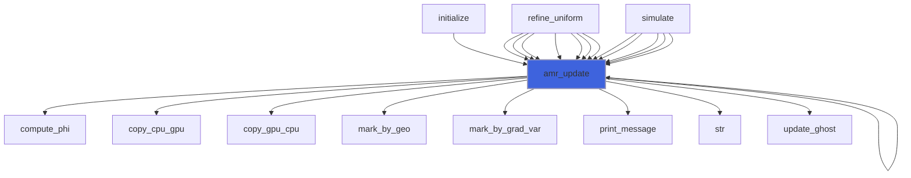

### compute_phi

Compute phi, distance from IB solid.

```fortran
subroutine compute_phi(self)
```

**Arguments**

| Name | Type | Intent | Attributes | Description |
|------|------|--------|------------|-------------|
| `self` | class([nasto_gmp_object](/api/src/app/nasto/gmp/adam_nasto_gmp_object#nasto-gmp-object)) | inout |  | The equation. |

**Call graph**

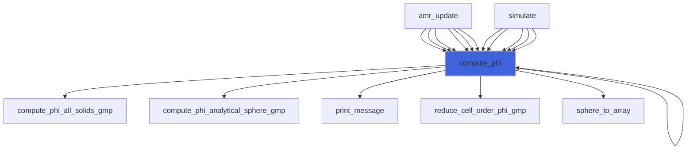

### mark_by_geo

Mark blocks to be refined/derefined by a geometric constrain.

```fortran
subroutine mark_by_geo(self, delta_fine, delta_coarse, threshold, do_init)
```

**Arguments**

| Name | Type | Intent | Attributes | Description |
|------|------|--------|------------|-------------|
| `self` | class([nasto_gmp_object](/api/src/app/nasto/gmp/adam_nasto_gmp_object#nasto-gmp-object)) | inout |  | The equation. |
| `delta_fine` | real(kind=[R8P](/api/src/third_party/PENF/src/lib/penf_global_parameters_variables)) | in |  | Maximum cell delta in fine grids. |
| `delta_coarse` | real(kind=[R8P](/api/src/third_party/PENF/src/lib/penf_global_parameters_variables)) | in |  | Minimum cell delta in coarse grids. |
| `threshold` | real(kind=[R8P](/api/src/third_party/PENF/src/lib/penf_global_parameters_variables)) | in | optional | Threshold for sphere proximity. |
| `do_init` | logical | in | optional |  |

**Call graph**

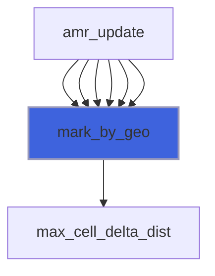

### mark_by_grad_var

Mark blocks to be refined/derefined by a `grad(var)` value.

```fortran
subroutine mark_by_grad_var(self, grad_tol, delta_fine, delta_coarse, ivar, threshold, do_init)
```

**Arguments**

| Name | Type | Intent | Attributes | Description |
|------|------|--------|------------|-------------|
| `self` | class([nasto_gmp_object](/api/src/app/nasto/gmp/adam_nasto_gmp_object#nasto-gmp-object)) | inout |  | The equation. |
| `grad_tol` | real(kind=[R8P](/api/src/third_party/PENF/src/lib/penf_global_parameters_variables)) | in |  | Gradiend tolerance value. |
| `delta_fine` | real(kind=[R8P](/api/src/third_party/PENF/src/lib/penf_global_parameters_variables)) | in |  | Maximum cell delta in fine grids. |
| `delta_coarse` | real(kind=[R8P](/api/src/third_party/PENF/src/lib/penf_global_parameters_variables)) | in |  | Minimum cell delta in coarse grids. |
| `ivar` | integer(kind=[I4P](/api/src/third_party/PENF/src/lib/penf_global_parameters_variables)) | in | optional | Variable for marking. |
| `threshold` | real(kind=[R8P](/api/src/third_party/PENF/src/lib/penf_global_parameters_variables)) | in | optional | Threshold for sphere proximity. |
| `do_init` | logical | in | optional | Re-initialize refinements queries. |

**Call graph**

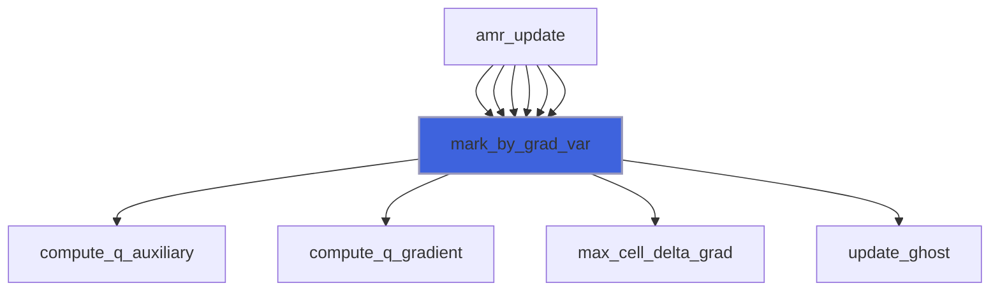

### move_phi

Move phi.

```fortran
subroutine move_phi(self, velocity)
```

**Arguments**

| Name | Type | Intent | Attributes | Description |
|------|------|--------|------------|-------------|
| `self` | class([nasto_gmp_object](/api/src/app/nasto/gmp/adam_nasto_gmp_object#nasto-gmp-object)) | inout |  | The equation. |
| `velocity` | real(kind=[R8P](/api/src/third_party/PENF/src/lib/penf_global_parameters_variables)) | in |  | Velocity of the movement. |

**Call graph**

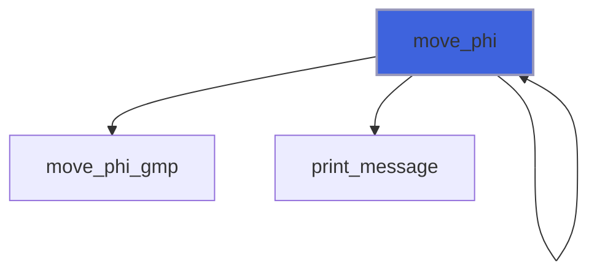

### refine_uniform

Refine all blocks uniformly.

```fortran
subroutine refine_uniform(self, refinement_levels)
```

**Arguments**

| Name | Type | Intent | Attributes | Description |
|------|------|--------|------------|-------------|
| `self` | class([nasto_gmp_object](/api/src/app/nasto/gmp/adam_nasto_gmp_object#nasto-gmp-object)) | inout |  | The equation. |
| `refinement_levels` | integer(kind=[I4P](/api/src/third_party/PENF/src/lib/penf_global_parameters_variables)) | in |  | Number of refinement to be performed. |

**Call graph**

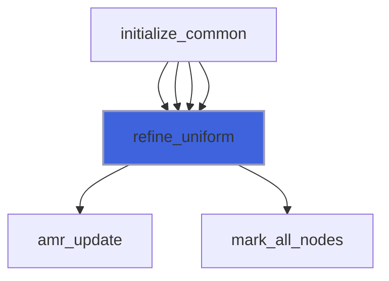

### integrate_eikonal

Integrate eikonal equation.

```fortran
subroutine integrate_eikonal(self, q_gpu)
```

**Arguments**

| Name | Type | Intent | Attributes | Description |
|------|------|--------|------------|-------------|
| `self` | class([nasto_gmp_object](/api/src/app/nasto/gmp/adam_nasto_gmp_object#nasto-gmp-object)) | inout |  | The equation. |
| `q_gpu` | real(kind=[R8P](/api/src/third_party/PENF/src/lib/penf_global_parameters_variables)) | inout |  | Conservative variables. |

**Call graph**

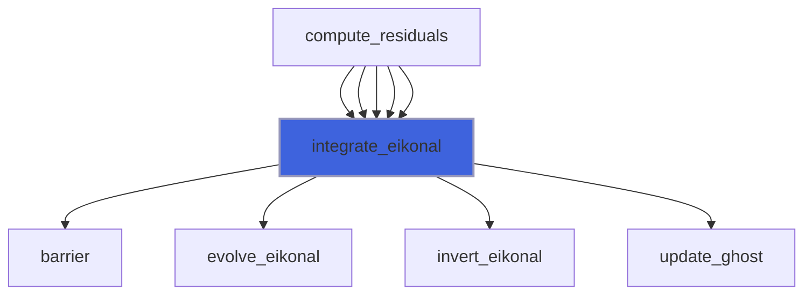

### load_restart_files

Save restart files.

```fortran
subroutine load_restart_files(self, t, time)
```

**Arguments**

| Name | Type | Intent | Attributes | Description |
|------|------|--------|------------|-------------|
| `self` | class([nasto_gmp_object](/api/src/app/nasto/gmp/adam_nasto_gmp_object#nasto-gmp-object)) | inout |  | The equation. |
| `t` | integer(kind=[I4P](/api/src/third_party/PENF/src/lib/penf_global_parameters_variables)) | out |  | Time iteration. |
| `time` | real(kind=[R8P](/api/src/third_party/PENF/src/lib/penf_global_parameters_variables)) | out |  | Time. |

**Call graph**

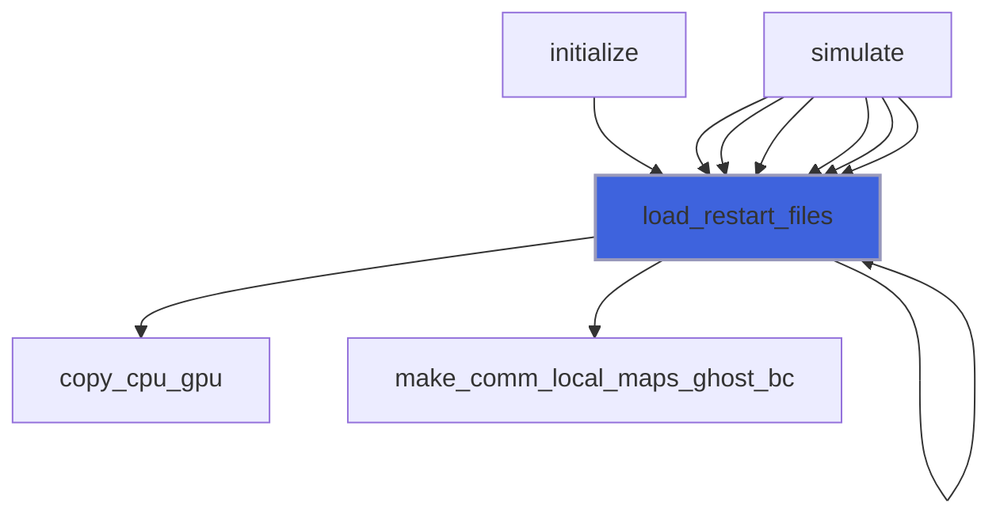

### save_hdf5

Save simulation data in HDF5 format.

```fortran
subroutine save_hdf5(self, output_basename)
```

**Arguments**

| Name | Type | Intent | Attributes | Description |
|------|------|--------|------------|-------------|
| `self` | class([nasto_gmp_object](/api/src/app/nasto/gmp/adam_nasto_gmp_object#nasto-gmp-object)) | inout |  | The equation. |
| `output_basename` | character(len=*) | in | optional | Output basename. |

**Call graph**

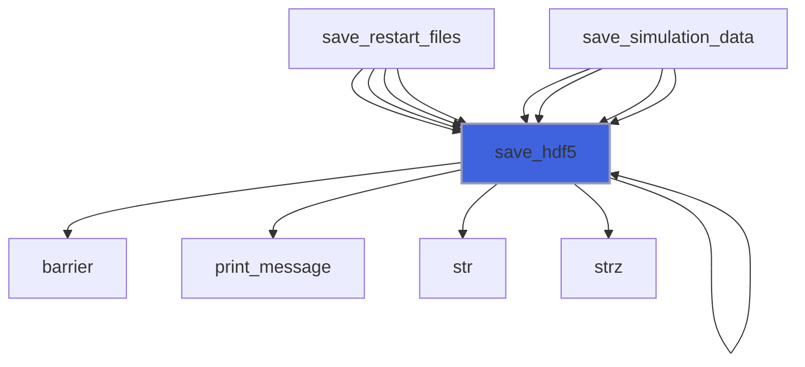

### save_residuals

Save residuals history.

```fortran
subroutine save_residuals(self)
```

**Arguments**

| Name | Type | Intent | Attributes | Description |
|------|------|--------|------------|-------------|
| `self` | class([nasto_gmp_object](/api/src/app/nasto/gmp/adam_nasto_gmp_object#nasto-gmp-object)) | inout |  | The equation. |

**Call graph**

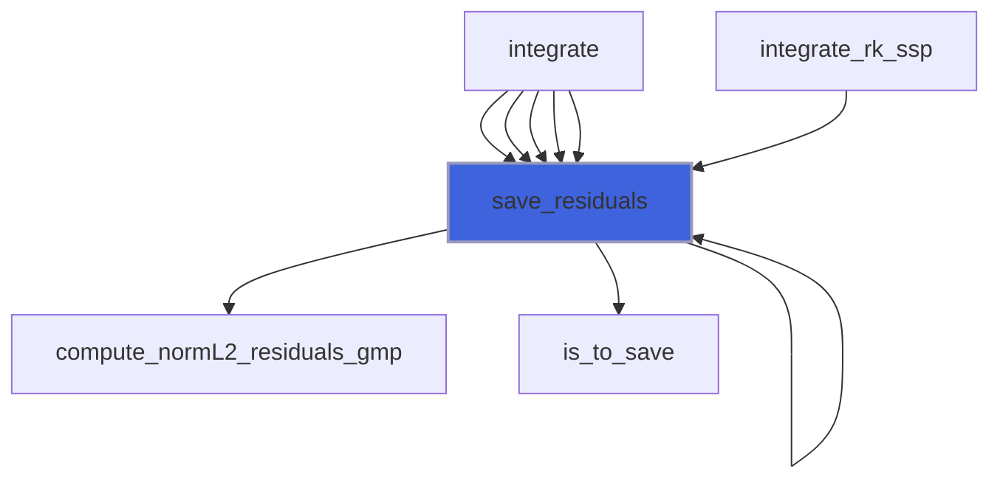

### save_restart_files

Save restart files.

```fortran
subroutine save_restart_files(self)
```

**Arguments**

| Name | Type | Intent | Attributes | Description |
|------|------|--------|------------|-------------|
| `self` | class([nasto_gmp_object](/api/src/app/nasto/gmp/adam_nasto_gmp_object#nasto-gmp-object)) | inout |  | The equation. |

**Call graph**

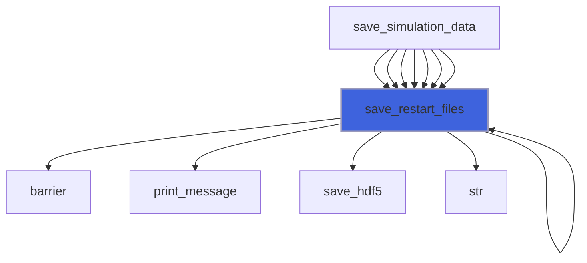

### save_simulation_data

Save all simulation data.

```fortran
subroutine save_simulation_data(self)
```

**Arguments**

| Name | Type | Intent | Attributes | Description |
|------|------|--------|------------|-------------|
| `self` | class([nasto_gmp_object](/api/src/app/nasto/gmp/adam_nasto_gmp_object#nasto-gmp-object)) | inout |  | The equation. |

**Call graph**

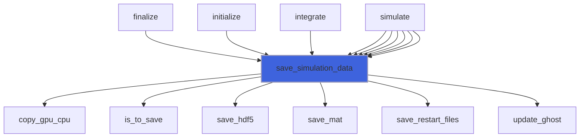

### set_boundary_conditions

Set boundary conditions of equation.

```fortran
subroutine set_boundary_conditions(self, q_gpu)
```

**Arguments**

| Name | Type | Intent | Attributes | Description |
|------|------|--------|------------|-------------|
| `self` | class([nasto_gmp_object](/api/src/app/nasto/gmp/adam_nasto_gmp_object#nasto-gmp-object)) | in |  | The equation. |
| `q_gpu` | real(kind=[R8P](/api/src/third_party/PENF/src/lib/penf_global_parameters_variables)) | inout |  | Conservative variables. |

**Call graph**

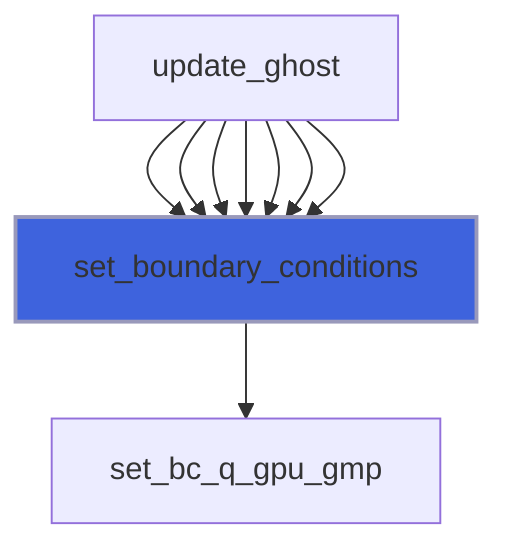

### set_initial_conditions

Set initial conditions of field.

```fortran
subroutine set_initial_conditions(self)
```

**Arguments**

| Name | Type | Intent | Attributes | Description |
|------|------|--------|------------|-------------|
| `self` | class([nasto_gmp_object](/api/src/app/nasto/gmp/adam_nasto_gmp_object#nasto-gmp-object)) | inout |  | The equation. |

**Call graph**

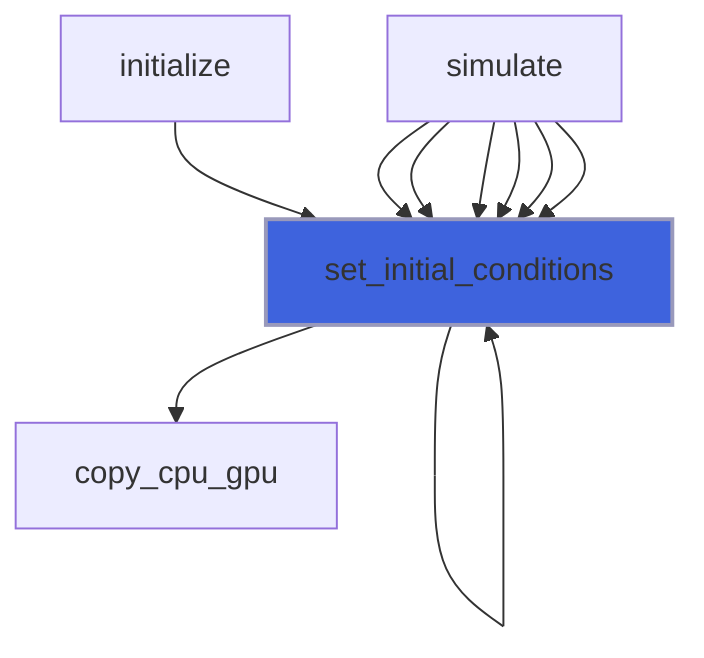

### update_ghost

Update ghost cells.
 If not specified all steps are perfermod, syncronous computation

```fortran
subroutine update_ghost(self, q_gpu, step)
```

**Arguments**

| Name | Type | Intent | Attributes | Description |
|------|------|--------|------------|-------------|
| `self` | class([nasto_gmp_object](/api/src/app/nasto/gmp/adam_nasto_gmp_object#nasto-gmp-object)) | inout |  | The equation. |
| `q_gpu` | real(kind=[R8P](/api/src/third_party/PENF/src/lib/penf_global_parameters_variables)) | inout |  | Conservative variables. |
| `step` | integer(kind=[I4P](/api/src/third_party/PENF/src/lib/penf_global_parameters_variables)) | in | optional | Step to be perfordmed in asyncronous comp. |

**Call graph**

```mermaid
flowchart TD
  amr_update["amr_update"] --> update_ghost["update_ghost"]
  amr_update["amr_update"] --> update_ghost["update_ghost"]
  amr_update["amr_update"] --> update_ghost["update_ghost"]
  amr_update["amr_update"] --> update_ghost["update_ghost"]
  amr_update["amr_update"] --> update_ghost["update_ghost"]
  amr_update["amr_update"] --> update_ghost["update_ghost"]
  compute_residuals["compute_residuals"] --> update_ghost["update_ghost"]
  compute_residuals["compute_residuals"] --> update_ghost["update_ghost"]
  compute_residuals["compute_residuals"] --> update_ghost["update_ghost"]
  compute_residuals["compute_residuals"] --> update_ghost["update_ghost"]
  compute_residuals["compute_residuals"] --> update_ghost["update_ghost"]
  compute_residuals_fd_centered["compute_residuals_fd_centered"] --> update_ghost["update_ghost"]
  integrate_eikonal["integrate_eikonal"] --> update_ghost["update_ghost"]
  integrate_eikonal["integrate_eikonal"] --> update_ghost["update_ghost"]
  integrate_eikonal["integrate_eikonal"] --> update_ghost["update_ghost"]
  integrate_eikonal["integrate_eikonal"] --> update_ghost["update_ghost"]
  integrate_eikonal["integrate_eikonal"] --> update_ghost["update_ghost"]
  integrate_eikonal["integrate_eikonal"] --> update_ghost["update_ghost"]
  mark_by_grad_var["mark_by_grad_var"] --> update_ghost["update_ghost"]
  mark_by_grad_var["mark_by_grad_var"] --> update_ghost["update_ghost"]
  mark_by_grad_var["mark_by_grad_var"] --> update_ghost["update_ghost"]
  mark_by_grad_var["mark_by_grad_var"] --> update_ghost["update_ghost"]
  mark_by_grad_var["mark_by_grad_var"] --> update_ghost["update_ghost"]
  save_simulation_data["save_simulation_data"] --> update_ghost["update_ghost"]
  save_simulation_data["save_simulation_data"] --> update_ghost["update_ghost"]
  save_simulation_data["save_simulation_data"] --> update_ghost["update_ghost"]
  save_simulation_data["save_simulation_data"] --> update_ghost["update_ghost"]
  save_simulation_data["save_simulation_data"] --> update_ghost["update_ghost"]
  save_simulation_data["save_simulation_data"] --> update_ghost["update_ghost"]
  save_simulation_data["save_simulation_data"] --> update_ghost["update_ghost"]
  update_ghost["update_ghost"] --> set_boundary_conditions["set_boundary_conditions"]
  update_ghost["update_ghost"] --> update_ghost_local["update_ghost_local"]
  update_ghost["update_ghost"] --> update_ghost_mpi["update_ghost_mpi"]
  style update_ghost fill:#3e63dd,stroke:#99b,stroke-width:2px
```

### compute_dt

Compute maximum time step accordingly to CFL stabilty criterion.

```fortran
subroutine compute_dt(self)
```

**Arguments**

| Name | Type | Intent | Attributes | Description |
|------|------|--------|------------|-------------|
| `self` | class([nasto_gmp_object](/api/src/app/nasto/gmp/adam_nasto_gmp_object#nasto-gmp-object)) | inout |  | The equation. |

**Call graph**

```mermaid
flowchart TD
  simulate["simulate"] --> compute_dt["compute_dt"]
  simulate["simulate"] --> compute_dt["compute_dt"]
  simulate["simulate"] --> compute_dt["compute_dt"]
  simulate["simulate"] --> compute_dt["compute_dt"]
  simulate["simulate"] --> compute_dt["compute_dt"]
  simulate["simulate"] --> compute_dt["compute_dt"]
  compute_dt["compute_dt"] --> compute_q_auxiliary["compute_q_auxiliary"]
  compute_dt["compute_dt"] --> compute_umax_gmp["compute_umax_gmp"]
  style compute_dt fill:#3e63dd,stroke:#99b,stroke-width:2px
```

### compute_q_auxiliary

Compute auxiliary variables.

```fortran
subroutine compute_q_auxiliary(self, q_gpu, q_aux_gpu)
```

**Arguments**

| Name | Type | Intent | Attributes | Description |
|------|------|--------|------------|-------------|
| `self` | class([nasto_gmp_object](/api/src/app/nasto/gmp/adam_nasto_gmp_object#nasto-gmp-object)) | in |  | The equation. |
| `q_gpu` | real(kind=[R8P](/api/src/third_party/PENF/src/lib/penf_global_parameters_variables)) | in |  | Conservative variables. |
| `q_aux_gpu` | real(kind=[R8P](/api/src/third_party/PENF/src/lib/penf_global_parameters_variables)) | out |  | Auxiliary variables. |

**Call graph**

```mermaid
flowchart TD
  compute_dt["compute_dt"] --> compute_q_auxiliary["compute_q_auxiliary"]
  compute_dt["compute_dt"] --> compute_q_auxiliary["compute_q_auxiliary"]
  compute_dt["compute_dt"] --> compute_q_auxiliary["compute_q_auxiliary"]
  compute_dt["compute_dt"] --> compute_q_auxiliary["compute_q_auxiliary"]
  compute_dt["compute_dt"] --> compute_q_auxiliary["compute_q_auxiliary"]
  compute_residuals["compute_residuals"] --> compute_q_auxiliary["compute_q_auxiliary"]
  compute_residuals["compute_residuals"] --> compute_q_auxiliary["compute_q_auxiliary"]
  compute_residuals["compute_residuals"] --> compute_q_auxiliary["compute_q_auxiliary"]
  compute_residuals["compute_residuals"] --> compute_q_auxiliary["compute_q_auxiliary"]
  compute_residuals["compute_residuals"] --> compute_q_auxiliary["compute_q_auxiliary"]
  copy_gpu_cpu["copy_gpu_cpu"] --> compute_q_auxiliary["compute_q_auxiliary"]
  copy_gpu_cpu["copy_gpu_cpu"] --> compute_q_auxiliary["compute_q_auxiliary"]
  copy_gpu_cpu["copy_gpu_cpu"] --> compute_q_auxiliary["compute_q_auxiliary"]
  mark_by_grad_var["mark_by_grad_var"] --> compute_q_auxiliary["compute_q_auxiliary"]
  mark_by_grad_var["mark_by_grad_var"] --> compute_q_auxiliary["compute_q_auxiliary"]
  mark_by_grad_var["mark_by_grad_var"] --> compute_q_auxiliary["compute_q_auxiliary"]
  mark_by_grad_var["mark_by_grad_var"] --> compute_q_auxiliary["compute_q_auxiliary"]
  mark_by_grad_var["mark_by_grad_var"] --> compute_q_auxiliary["compute_q_auxiliary"]
  save_simulation_data["save_simulation_data"] --> compute_q_auxiliary["compute_q_auxiliary"]
  save_simulation_data["save_simulation_data"] --> compute_q_auxiliary["compute_q_auxiliary"]
  compute_q_auxiliary["compute_q_auxiliary"] --> compute_q_aux_gmp["compute_q_aux_gmp"]
  style compute_q_auxiliary fill:#3e63dd,stroke:#99b,stroke-width:2px
```

### compute_residuals

Compute residuals of equation.

```fortran
subroutine compute_residuals(self, q_gpu, dq_gpu)
```

**Arguments**

| Name | Type | Intent | Attributes | Description |
|------|------|--------|------------|-------------|
| `self` | class([nasto_gmp_object](/api/src/app/nasto/gmp/adam_nasto_gmp_object#nasto-gmp-object)) | inout |  | The equation. |
| `q_gpu` | real(kind=[R8P](/api/src/third_party/PENF/src/lib/penf_global_parameters_variables)) | inout |  | Conservative variables. |
| `dq_gpu` | real(kind=[R8P](/api/src/third_party/PENF/src/lib/penf_global_parameters_variables)) | inout |  | Residuals. |

**Call graph**

```mermaid
flowchart TD
  integrate["integrate"] --> compute_residuals["compute_residuals"]
  integrate["integrate"] --> compute_residuals["compute_residuals"]
  integrate["integrate"] --> compute_residuals["compute_residuals"]
  integrate["integrate"] --> compute_residuals["compute_residuals"]
  integrate["integrate"] --> compute_residuals["compute_residuals"]
  compute_residuals["compute_residuals"] --> compute_fluxes_convective_gmp["compute_fluxes_convective_gmp"]
  compute_residuals["compute_residuals"] --> compute_fluxes_difference_gmp["compute_fluxes_difference_gmp"]
  compute_residuals["compute_residuals"] --> compute_fluxes_diffusive_gmp["compute_fluxes_diffusive_gmp"]
  compute_residuals["compute_residuals"] --> compute_q_auxiliary["compute_q_auxiliary"]
  compute_residuals["compute_residuals"] --> integrate_eikonal["integrate_eikonal"]
  compute_residuals["compute_residuals"] --> update_ghost["update_ghost"]
  style compute_residuals fill:#3e63dd,stroke:#99b,stroke-width:2px
```

### integrate

Perform one step integration.

```fortran
subroutine integrate(self, do_ghost_syncro)
```

**Arguments**

| Name | Type | Intent | Attributes | Description |
|------|------|--------|------------|-------------|
| `self` | class([nasto_gmp_object](/api/src/app/nasto/gmp/adam_nasto_gmp_object#nasto-gmp-object)) | inout |  | The equation. |
| `do_ghost_syncro` | logical | in | optional | Flag to do syncrous ghost update. |

**Call graph**

```mermaid
flowchart TD
  simulate["simulate"] --> integrate["integrate"]
  simulate["simulate"] --> integrate["integrate"]
  simulate["simulate"] --> integrate["integrate"]
  simulate["simulate"] --> integrate["integrate"]
  simulate["simulate"] --> integrate["integrate"]
  simulate["simulate"] --> integrate["integrate"]
  integrate["integrate"] --> assign_stage["assign_stage"]
  integrate["integrate"] --> compute_residuals["compute_residuals"]
  integrate["integrate"] --> compute_stage["compute_stage"]
  integrate["integrate"] --> compute_stage_ls["compute_stage_ls"]
  integrate["integrate"] --> initialize_stages["initialize_stages"]
  integrate["integrate"] --> save_residuals["save_residuals"]
  integrate["integrate"] --> update_q["update_q"]
  style integrate fill:#3e63dd,stroke:#99b,stroke-width:2px
```

### simulate

Perform the simulation.

```fortran
subroutine simulate(self, filename)
```

**Arguments**

| Name | Type | Intent | Attributes | Description |
|------|------|--------|------------|-------------|
| `self` | class([nasto_gmp_object](/api/src/app/nasto/gmp/adam_nasto_gmp_object#nasto-gmp-object)) | inout |  | The equation. |
| `filename` | character(len=*) | in |  | Input file name. |

**Call graph**

```mermaid
flowchart TD
  simulate["simulate"] --> amr_update["amr_update"]
  simulate["simulate"] --> barrier["barrier"]
  simulate["simulate"] --> close_file_residuals["close_file_residuals"]
  simulate["simulate"] --> compute_dt["compute_dt"]
  simulate["simulate"] --> compute_phi["compute_phi"]
  simulate["simulate"] --> initialize["initialize"]
  simulate["simulate"] --> integrate["integrate"]
  simulate["simulate"] --> load_restart_files["load_restart_files"]
  simulate["simulate"] --> open_file_residuals["open_file_residuals"]
  simulate["simulate"] --> print_message["print_message"]
  simulate["simulate"] --> print_progress["print_progress"]
  simulate["simulate"] --> save_memory_gpu_status["save_memory_gpu_status"]
  simulate["simulate"] --> save_simulation_data["save_simulation_data"]
  simulate["simulate"] --> set_initial_conditions["set_initial_conditions"]
  simulate["simulate"] --> str["str"]
  style simulate fill:#3e63dd,stroke:#99b,stroke-width:2px
```
