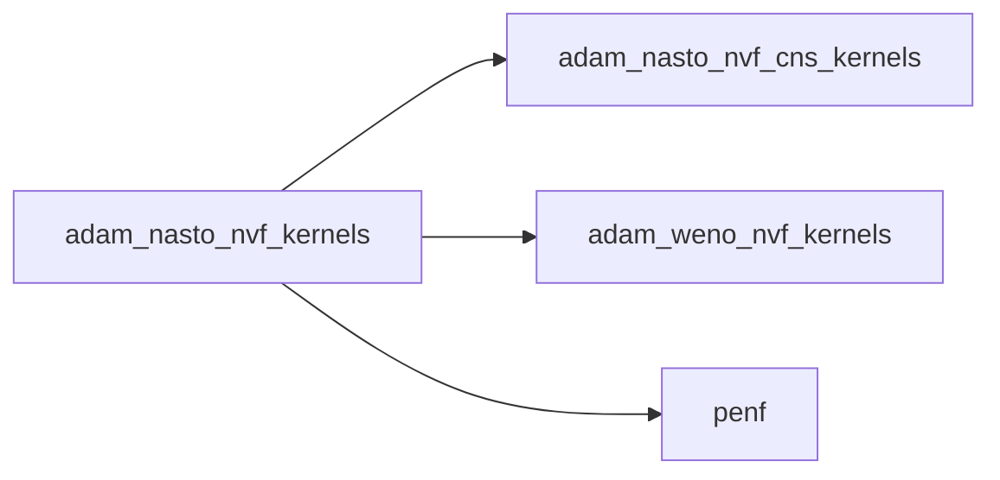
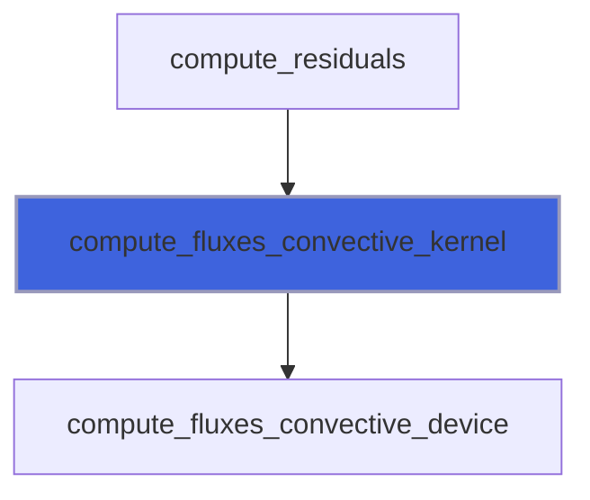
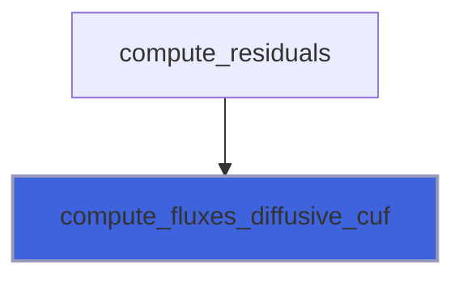
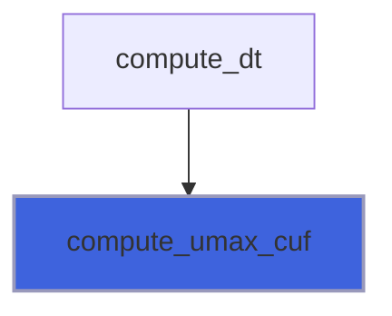
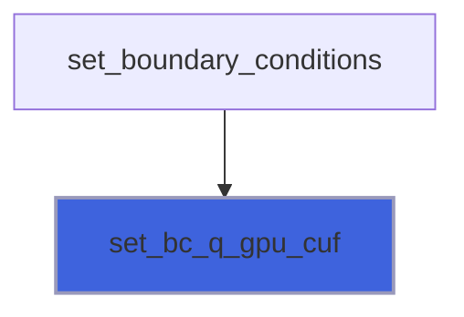
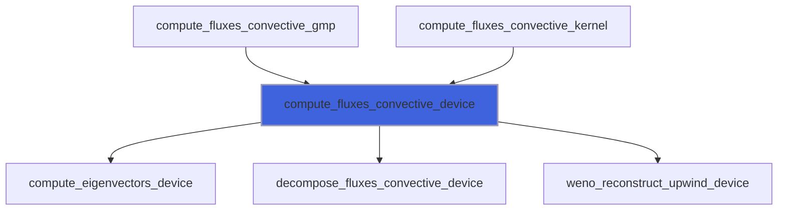
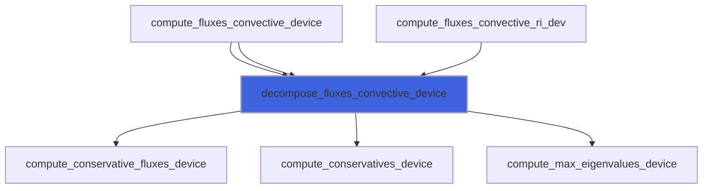

# adam_nasto_nvf_kernels

> ADAM, NASTO NVF application kernels.

**Source**: `src/app/nasto/nvf/adam_nasto_nvf_kernels.F90`

**Dependencies**



## Contents

- [compute_fluxes_convective_kernel](#compute-fluxes-convective-kernel)
- [compute_fluxes_difference_cuf](#compute-fluxes-difference-cuf)
- [compute_fluxes_diffusive_cuf](#compute-fluxes-diffusive-cuf)
- [compute_umax_cuf](#compute-umax-cuf)
- [set_bc_q_gpu_cuf](#set-bc-q-gpu-cuf)
- [compute_fluxes_convective_device](#compute-fluxes-convective-device)
- [decompose_fluxes_convective_device](#decompose-fluxes-convective-device)

## Subroutines

### compute_fluxes_convective_kernel

Compute convective fluxes along x direction.

```fortran
subroutine compute_fluxes_convective_kernel(dir, blocks_number, ni, nj, nk, ngc, nv, weno_s, weno_a_gpu, weno_p_gpu, weno_d_gpu, weno_zeps, ror_number, ror_schemes_gpu, ror_threshold, ror_ivar_gpu, ror_stats_gpu, g, q_aux_gpu, fluxes_gpu)
```

**Arguments**

| Name | Type | Intent | Attributes | Description |
|------|------|--------|------------|-------------|
| `dir` | integer(kind=[I4P](/api/src/third_party/PENF/src/lib/penf_global_parameters_variables)) | in | value | Direction, 1=X, 2=Y, 3=Z. |
| `blocks_number` | integer(kind=[I4P](/api/src/third_party/PENF/src/lib/penf_global_parameters_variables)) | in | value | Number of blocks. |
| `ni` | integer(kind=[I4P](/api/src/third_party/PENF/src/lib/penf_global_parameters_variables)) | in | value | Grid cells number in I direction. |
| `nj` | integer(kind=[I4P](/api/src/third_party/PENF/src/lib/penf_global_parameters_variables)) | in | value | Grid cells number in J direction. |
| `nk` | integer(kind=[I4P](/api/src/third_party/PENF/src/lib/penf_global_parameters_variables)) | in | value | Grid cells number in K direction. |
| `ngc` | integer(kind=[I4P](/api/src/third_party/PENF/src/lib/penf_global_parameters_variables)) | in | value | Ghost cells number. |
| `nv` | integer(kind=[I4P](/api/src/third_party/PENF/src/lib/penf_global_parameters_variables)) | in | value | Number of conservative varibales. |
| `weno_s` | integer(kind=[I4P](/api/src/third_party/PENF/src/lib/penf_global_parameters_variables)) | in | value | Weno stencils number/dimension. |
| `weno_a_gpu` | real(kind=[R8P](/api/src/third_party/PENF/src/lib/penf_global_parameters_variables)) | in | device | Optimal weights. |
| `weno_p_gpu` | real(kind=[R8P](/api/src/third_party/PENF/src/lib/penf_global_parameters_variables)) | in | device | Polinomials coefficients. |
| `weno_d_gpu` | real(kind=[R8P](/api/src/third_party/PENF/src/lib/penf_global_parameters_variables)) | in | device | Smoothness indicators coefficients. |
| `weno_zeps` | real(kind=[R8P](/api/src/third_party/PENF/src/lib/penf_global_parameters_variables)) | in | value | Parameter to avoid division by zero. |
| `ror_number` | integer(kind=[I4P](/api/src/third_party/PENF/src/lib/penf_global_parameters_variables)) | in | value | Number of ROR iterations. |
| `ror_schemes_gpu` | integer(kind=[I4P](/api/src/third_party/PENF/src/lib/penf_global_parameters_variables)) | in | device | Scheme (S value) for each ROR step. |
| `ror_threshold` | real(kind=[R8P](/api/src/third_party/PENF/src/lib/penf_global_parameters_variables)) | in | value | ROR threshold triggering. |
| `ror_ivar_gpu` | integer(kind=[I4P](/api/src/third_party/PENF/src/lib/penf_global_parameters_variables)) | in | device | Index variables to check in ROR. |
| `ror_stats_gpu` | integer(kind=[I4P](/api/src/third_party/PENF/src/lib/penf_global_parameters_variables)) | inout | device | Scheme (S value) for each ROR step. |
| `g` | real(kind=[R8P](/api/src/third_party/PENF/src/lib/penf_global_parameters_variables)) | in | value | Specific heats ratio. |
| `q_aux_gpu` | real(kind=[R8P](/api/src/third_party/PENF/src/lib/penf_global_parameters_variables)) | in | device | Auxiliary variables. |
| `fluxes_gpu` | real(kind=[R8P](/api/src/third_party/PENF/src/lib/penf_global_parameters_variables)) | inout | device | Fluxes. |

**Call graph**



### compute_fluxes_difference_cuf

Compute fluxes difference.

```fortran
subroutine compute_fluxes_difference_cuf(null_x, null_y, null_z, blocks_number, ni, nj, nk, ngc, nv, ib_eps, dx_gpu, dy_gpu, dz_gpu, flx_gpu, fly_gpu, flz_gpu, phi_gpu, dq_gpu)
```

**Arguments**

| Name | Type | Intent | Attributes | Description |
|------|------|--------|------------|-------------|
| `null_x` | logical | in |  | Nullified directions tags. |
| `null_y` | logical | in |  | Nullified directions tags. |
| `null_z` | logical | in |  | Nullified directions tags. |
| `blocks_number` | integer(kind=[I4P](/api/src/third_party/PENF/src/lib/penf_global_parameters_variables)) | in |  | Number of blocks. |
| `ni` | integer(kind=[I4P](/api/src/third_party/PENF/src/lib/penf_global_parameters_variables)) | in |  | Grid cells number in I direction. |
| `nj` | integer(kind=[I4P](/api/src/third_party/PENF/src/lib/penf_global_parameters_variables)) | in |  | Grid cells number in J direction. |
| `nk` | integer(kind=[I4P](/api/src/third_party/PENF/src/lib/penf_global_parameters_variables)) | in |  | Grid cells number in K direction. |
| `ngc` | integer(kind=[I4P](/api/src/third_party/PENF/src/lib/penf_global_parameters_variables)) | in |  | Ghost cells number. |
| `nv` | integer(kind=[I4P](/api/src/third_party/PENF/src/lib/penf_global_parameters_variables)) | in |  | Number of conservative varibales. |
| `ib_eps` | real(kind=[R8P](/api/src/third_party/PENF/src/lib/penf_global_parameters_variables)) | in |  | Tolerance IB delta ratio. |
| `dx_gpu` | real(kind=[R8P](/api/src/third_party/PENF/src/lib/penf_global_parameters_variables)) | in | device | Space steps. |
| `dy_gpu` | real(kind=[R8P](/api/src/third_party/PENF/src/lib/penf_global_parameters_variables)) | in | device | Space steps. |
| `dz_gpu` | real(kind=[R8P](/api/src/third_party/PENF/src/lib/penf_global_parameters_variables)) | in | device | Space steps. |
| `flx_gpu` | real(kind=[R8P](/api/src/third_party/PENF/src/lib/penf_global_parameters_variables)) | in | device | X direction fluxes. |
| `fly_gpu` | real(kind=[R8P](/api/src/third_party/PENF/src/lib/penf_global_parameters_variables)) | in | device | Y direction fluxes. |
| `flz_gpu` | real(kind=[R8P](/api/src/third_party/PENF/src/lib/penf_global_parameters_variables)) | in | device | Z direction fluxes. |
| `phi_gpu` | real(kind=[R8P](/api/src/third_party/PENF/src/lib/penf_global_parameters_variables)) | in | device, optional | IB distance function. |
| `dq_gpu` | real(kind=[R8P](/api/src/third_party/PENF/src/lib/penf_global_parameters_variables)) | inout | device | Fluxes differences. |

**Call graph**


### compute_fluxes_diffusive_cuf

Compute diffusive fluxes.

```fortran
subroutine compute_fluxes_diffusive_cuf(null_x, null_y, null_z, blocks_number, ni, nj, nk, ngc, nv, mu, kd, q_aux_gpu, dx_gpu, dy_gpu, dz_gpu, flx_gpu, fly_gpu, flz_gpu)
```

**Arguments**

| Name | Type | Intent | Attributes | Description |
|------|------|--------|------------|-------------|
| `null_x` | logical | in |  | Nullified directions tags. |
| `null_y` | logical | in |  | Nullified directions tags. |
| `null_z` | logical | in |  | Nullified directions tags. |
| `blocks_number` | integer(kind=[I4P](/api/src/third_party/PENF/src/lib/penf_global_parameters_variables)) | in |  | Blocks number. |
| `ni` | integer(kind=[I4P](/api/src/third_party/PENF/src/lib/penf_global_parameters_variables)) | in |  | Grid dimensionns. |
| `nj` | integer(kind=[I4P](/api/src/third_party/PENF/src/lib/penf_global_parameters_variables)) | in |  | Grid dimensionns. |
| `nk` | integer(kind=[I4P](/api/src/third_party/PENF/src/lib/penf_global_parameters_variables)) | in |  | Grid dimensionns. |
| `ngc` | integer(kind=[I4P](/api/src/third_party/PENF/src/lib/penf_global_parameters_variables)) | in |  | Number of ghost cells. |
| `nv` | integer(kind=[I4P](/api/src/third_party/PENF/src/lib/penf_global_parameters_variables)) | in |  | Number of conservative variables. |
| `mu` | real(kind=[R8P](/api/src/third_party/PENF/src/lib/penf_global_parameters_variables)) | in |  | Viscosity. |
| `kd` | real(kind=[R8P](/api/src/third_party/PENF/src/lib/penf_global_parameters_variables)) | in |  | Thermal diffusivity. |
| `q_aux_gpu` | real(kind=[R8P](/api/src/third_party/PENF/src/lib/penf_global_parameters_variables)) | in | device | Auxiliary varibales |
| `dx_gpu` | real(kind=[R8P](/api/src/third_party/PENF/src/lib/penf_global_parameters_variables)) | in | device | Space steps. |
| `dy_gpu` | real(kind=[R8P](/api/src/third_party/PENF/src/lib/penf_global_parameters_variables)) | in | device | Space steps. |
| `dz_gpu` | real(kind=[R8P](/api/src/third_party/PENF/src/lib/penf_global_parameters_variables)) | in | device | Space steps. |
| `flx_gpu` | real(kind=[R8P](/api/src/third_party/PENF/src/lib/penf_global_parameters_variables)) | inout | device | Fluxes along x. |
| `fly_gpu` | real(kind=[R8P](/api/src/third_party/PENF/src/lib/penf_global_parameters_variables)) | inout | device | Fluxes along y. |
| `flz_gpu` | real(kind=[R8P](/api/src/third_party/PENF/src/lib/penf_global_parameters_variables)) | inout | device | Fluxes along z. |

**Call graph**



### compute_umax_cuf

Compute maximum speed.

```fortran
subroutine compute_umax_cuf(ni, nj, nk, ngc, blocks_number, mu, dx_gpu, dy_gpu, dz_gpu, q_aux_gpu, umax)
```

**Arguments**

| Name | Type | Intent | Attributes | Description |
|------|------|--------|------------|-------------|
| `ni` | integer(kind=[I4P](/api/src/third_party/PENF/src/lib/penf_global_parameters_variables)) | in |  | Grid cells number in I direction. |
| `nj` | integer(kind=[I4P](/api/src/third_party/PENF/src/lib/penf_global_parameters_variables)) | in |  | Grid cells number in J direction. |
| `nk` | integer(kind=[I4P](/api/src/third_party/PENF/src/lib/penf_global_parameters_variables)) | in |  | Grid cells number in K direction. |
| `ngc` | integer(kind=[I4P](/api/src/third_party/PENF/src/lib/penf_global_parameters_variables)) | in |  | Ghost cells number. |
| `blocks_number` | integer(kind=[I4P](/api/src/third_party/PENF/src/lib/penf_global_parameters_variables)) | in |  | Number of blocks. |
| `mu` | real(kind=[R8P](/api/src/third_party/PENF/src/lib/penf_global_parameters_variables)) | in |  | Dynamic viscosity. |
| `dx_gpu` | real(kind=[R8P](/api/src/third_party/PENF/src/lib/penf_global_parameters_variables)) | in | device | X space step. |
| `dy_gpu` | real(kind=[R8P](/api/src/third_party/PENF/src/lib/penf_global_parameters_variables)) | in | device | Y space step. |
| `dz_gpu` | real(kind=[R8P](/api/src/third_party/PENF/src/lib/penf_global_parameters_variables)) | in | device | Z space step. |
| `q_aux_gpu` | real(kind=[R8P](/api/src/third_party/PENF/src/lib/penf_global_parameters_variables)) | in | device | Auxiliary varibales. |
| `umax` | real(kind=[R8P](/api/src/third_party/PENF/src/lib/penf_global_parameters_variables)) | out |  | Maximum speed. |

**Call graph**



### set_bc_q_gpu_cuf

Set BC over q.

```fortran
subroutine set_bc_q_gpu_cuf(BC_EXTRAPOLATION, BC_INFLOW, nv, ngc, cv, R, local_map_bc_gpu, fec_1_6_array_gpu, q_bc_vars_gpu, q_gpu)
```

**Arguments**

| Name | Type | Intent | Attributes | Description |
|------|------|--------|------------|-------------|
| `BC_EXTRAPOLATION` | integer(kind=[I4P](/api/src/third_party/PENF/src/lib/penf_global_parameters_variables)) | in |  | Extrapolation BC parameter. |
| `BC_INFLOW` | integer(kind=[I4P](/api/src/third_party/PENF/src/lib/penf_global_parameters_variables)) | in |  | Inflow BC parameter. |
| `nv` | integer(kind=[I4P](/api/src/third_party/PENF/src/lib/penf_global_parameters_variables)) | in |  | Number of variables. |
| `ngc` | integer(kind=[I4P](/api/src/third_party/PENF/src/lib/penf_global_parameters_variables)) | in |  | Ghost cells number. |
| `cv` | real(kind=[R8P](/api/src/third_party/PENF/src/lib/penf_global_parameters_variables)) | in |  | Constant volume specific heat. |
| `R` | real(kind=[R8P](/api/src/third_party/PENF/src/lib/penf_global_parameters_variables)) | in |  | Gas constant. |
| `local_map_bc_gpu` | integer(kind=[I8P](/api/src/third_party/PENF/src/lib/penf_global_parameters_variables)) | in | device | Local map for BC ghost cells. |
| `fec_1_6_array_gpu` | integer(kind=[I4P](/api/src/third_party/PENF/src/lib/penf_global_parameters_variables)) | in | device | Local map for BC ghost cells. |
| `q_bc_vars_gpu` | real(kind=[R8P](/api/src/third_party/PENF/src/lib/penf_global_parameters_variables)) | in | device | Boundary variables. |
| `q_gpu` | real(kind=[R8P](/api/src/third_party/PENF/src/lib/penf_global_parameters_variables)) | inout | device | Conservative variables. |

**Call graph**



### compute_fluxes_convective_device

Compute convective fluxes at right interface of b,i,j,k.

```fortran
subroutine compute_fluxes_convective_device(dir, si, sir, b, i, j, k, ngc, nv, weno_s, weno_a_gpu, weno_p_gpu, weno_d_gpu, weno_zeps, ror_number, ror_schemes_gpu, ror_threshold, ror_ivar_gpu, ror_stats_gpu, g, q_aux_gpu, fluxes_gpu)
```

**Arguments**

| Name | Type | Intent | Attributes | Description |
|------|------|--------|------------|-------------|
| `dir` | integer(kind=[I4P](/api/src/third_party/PENF/src/lib/penf_global_parameters_variables)) | in | value | Direction, 1=X, 2=Y, 3=Z. |
| `si` | integer(kind=[I4P](/api/src/third_party/PENF/src/lib/penf_global_parameters_variables)) | in | device | Stencil increment. |
| `sir` | real(kind=[R8P](/api/src/third_party/PENF/src/lib/penf_global_parameters_variables)) | in | device | Stencil increment, real cast. |
| `b` | integer(kind=[I4P](/api/src/third_party/PENF/src/lib/penf_global_parameters_variables)) | in | value | Counter. |
| `i` | integer(kind=[I4P](/api/src/third_party/PENF/src/lib/penf_global_parameters_variables)) | in | value | Counter. |
| `j` | integer(kind=[I4P](/api/src/third_party/PENF/src/lib/penf_global_parameters_variables)) | in | value | Counter. |
| `k` | integer(kind=[I4P](/api/src/third_party/PENF/src/lib/penf_global_parameters_variables)) | in | value | Counter. |
| `ngc` | integer(kind=[I4P](/api/src/third_party/PENF/src/lib/penf_global_parameters_variables)) | in | value | Ghost cells number. |
| `nv` | integer(kind=[I4P](/api/src/third_party/PENF/src/lib/penf_global_parameters_variables)) | in | value | Number of conservative varibales. |
| `weno_s` | integer(kind=[I4P](/api/src/third_party/PENF/src/lib/penf_global_parameters_variables)) | in | value | Weno stencils number/dimension. |
| `weno_a_gpu` | real(kind=[R8P](/api/src/third_party/PENF/src/lib/penf_global_parameters_variables)) | in | device | Optimal weights. |
| `weno_p_gpu` | real(kind=[R8P](/api/src/third_party/PENF/src/lib/penf_global_parameters_variables)) | in | device | Polinomials coefficients. |
| `weno_d_gpu` | real(kind=[R8P](/api/src/third_party/PENF/src/lib/penf_global_parameters_variables)) | in | device | Smoothness indicators coefficients. |
| `weno_zeps` | real(kind=[R8P](/api/src/third_party/PENF/src/lib/penf_global_parameters_variables)) | in | value | Parameter to avoid division by zero. |
| `ror_number` | integer(kind=[I4P](/api/src/third_party/PENF/src/lib/penf_global_parameters_variables)) | in | value | Number of ROR iterations. |
| `ror_schemes_gpu` | integer(kind=[I4P](/api/src/third_party/PENF/src/lib/penf_global_parameters_variables)) | in | device | Scheme (S value) for each ROR step. |
| `ror_threshold` | real(kind=[R8P](/api/src/third_party/PENF/src/lib/penf_global_parameters_variables)) | in | value | ROR threshold triggering. |
| `ror_ivar_gpu` | integer(kind=[I4P](/api/src/third_party/PENF/src/lib/penf_global_parameters_variables)) | in | device | Index variables to check in ROR. |
| `ror_stats_gpu` | integer(kind=[I4P](/api/src/third_party/PENF/src/lib/penf_global_parameters_variables)) | inout | device | Scheme (S value) for each ROR step. |
| `g` | real(kind=[R8P](/api/src/third_party/PENF/src/lib/penf_global_parameters_variables)) | in | value | Specific heats ratio. |
| `q_aux_gpu` | real(kind=[R8P](/api/src/third_party/PENF/src/lib/penf_global_parameters_variables)) | in | device | Auxiliary variables. |
| `fluxes_gpu` | real(kind=[R8P](/api/src/third_party/PENF/src/lib/penf_global_parameters_variables)) | inout | device | Fluxes. |

**Call graph**



### decompose_fluxes_convective_device

Decompose convective fluxes.
 Flux vector splitting by local-Lax-Friedrics (Rusanov) with projection in pseudo-characteristics psace.

```fortran
subroutine decompose_fluxes_convective_device(si, sir, el, weno_s, b, i, j, k, ngc, nv, g, q_aux_gpu, fmpc)
```

**Arguments**

| Name | Type | Intent | Attributes | Description |
|------|------|--------|------------|-------------|
| `si` | integer(kind=[I4P](/api/src/third_party/PENF/src/lib/penf_global_parameters_variables)) | in | device | Stencil increment. |
| `sir` | real(kind=[R8P](/api/src/third_party/PENF/src/lib/penf_global_parameters_variables)) | in | device | Stencil increment, real cast. |
| `el` | real(kind=[R8P](/api/src/third_party/PENF/src/lib/penf_global_parameters_variables)) | in | device | Left eigeinvectors. |
| `weno_s` | integer(kind=[I4P](/api/src/third_party/PENF/src/lib/penf_global_parameters_variables)) | in | value | Weno stencils number/dimension. |
| `b` | integer(kind=[I4P](/api/src/third_party/PENF/src/lib/penf_global_parameters_variables)) | in | value | Counter. |
| `i` | integer(kind=[I4P](/api/src/third_party/PENF/src/lib/penf_global_parameters_variables)) | in | value | Counter. |
| `j` | integer(kind=[I4P](/api/src/third_party/PENF/src/lib/penf_global_parameters_variables)) | in | value | Counter. |
| `k` | integer(kind=[I4P](/api/src/third_party/PENF/src/lib/penf_global_parameters_variables)) | in | value | Counter. |
| `ngc` | integer(kind=[I4P](/api/src/third_party/PENF/src/lib/penf_global_parameters_variables)) | in | value | Ghost cells number. |
| `nv` | integer(kind=[I4P](/api/src/third_party/PENF/src/lib/penf_global_parameters_variables)) | in | value | Number of conservative varibales. |
| `g` | real(kind=[R8P](/api/src/third_party/PENF/src/lib/penf_global_parameters_variables)) | in | value | Specific heats ratio. |
| `q_aux_gpu` | real(kind=[R8P](/api/src/third_party/PENF/src/lib/penf_global_parameters_variables)) | in | device | Auxiliary variables. |
| `fmpc` | real(kind=[R8P](/api/src/third_party/PENF/src/lib/penf_global_parameters_variables)) | inout | device | Fluxes -+ decomposition in characteristics space. |

**Call graph**


