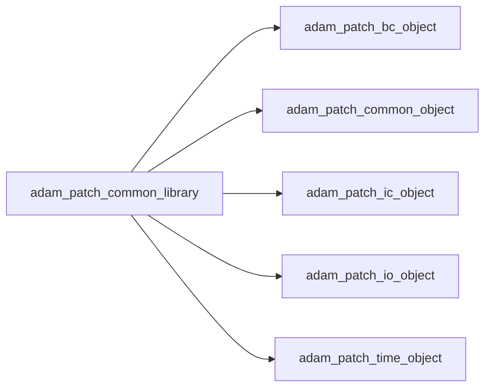

# adam_patch_common_library

> ADAM PATCH common library, entry for all common CPU classes and libraries.

**Source**: `src/app/patch/common/adam_patch_common_library.F90`

**Dependencies**

```mermaid
graph LR
  adam_patch_common_library["adam_patch_common_library"] --> adam_patch_bc_object["adam_patch_bc_object"]
  adam_patch_common_library["adam_patch_common_library"] --> adam_patch_common_object["adam_patch_common_object"]
  adam_patch_common_library["adam_patch_common_library"] --> adam_patch_ic_object["adam_patch_ic_object"]
  adam_patch_common_library["adam_patch_common_library"] --> adam_patch_io_object["adam_patch_io_object"]
  adam_patch_common_library["adam_patch_common_library"] --> adam_patch_time_object["adam_patch_time_object"]
```
