# adam_patch_cpu_object

> ADAM, PATCH Poisson solver with Adpative mesh Refinement for HPC computing class definition, CPU backend.

**Source**: `src/app/patch/cpu/adam_patch_cpu_object.F90`

**Dependencies**

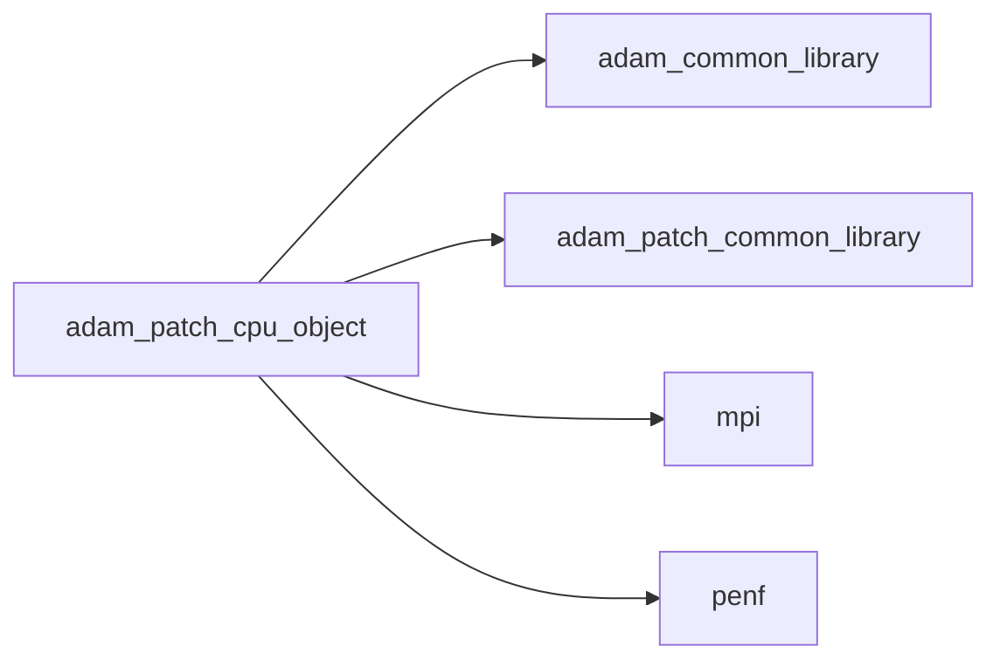

## Contents

- [patch_cpu_object](#patch-cpu-object)
- [allocate_cpu](#allocate-cpu)
- [finalize](#finalize)
- [initialize](#initialize)
- [amr_update](#amr-update)
- [compute_phi](#compute-phi)
- [mark_by_geo](#mark-by-geo)
- [mark_by_grad_var](#mark-by-grad-var)
- [move_phi](#move-phi)
- [refine_uniform](#refine-uniform)
- [integrate_eikonal](#integrate-eikonal)
- [load_restart_files](#load-restart-files)
- [save_xh5f](#save-xh5f)
- [save_residuals](#save-residuals)
- [save_restart_files](#save-restart-files)
- [save_simulation_data](#save-simulation-data)
- [set_boundary_conditions](#set-boundary-conditions)
- [set_initial_conditions](#set-initial-conditions)
- [update_ghost](#update-ghost)
- [integrate](#integrate)
- [simulate](#simulate)

## Derived Types

### patch_cpu_object

Maxwell equations system class definition, CPU backend.

**Inheritance**

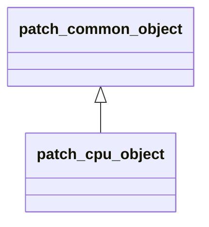

**Extends**: [`patch_common_object`](/api/src/app/patch/common/adam_patch_common_object#patch-common-object)

#### Components

| Name | Type | Attributes | Description |
|------|------|------------|-------------|
| `mpih` | type([mpih_object](/api/src/lib/common/adam_mpih_object#mpih-object)) |  | MPI handler. |
| `adam` | type([adam_object](/api/src/lib/common/adam_adam_object#adam-object)) |  | ADAM. |
| `field` | type([field_object](/api/src/lib/common/adam_field_object#field-object)) | pointer | The field. |
| `grid` | type([grid_object](/api/src/lib/common/adam_grid_object#grid-object)) | pointer | The grid. |
| `amr` | type([amr_object](/api/src/lib/common/adam_amr_object#amr-object)) |  | AMR marker handler. |
| `ib` | type([ib_object](/api/src/lib/common/adam_ib_object#ib-object)) |  | Immersed Boundary (IB) handler. |
| `flail` | type([flail_object](/api/src/lib/common/adam_flail_object#flail-object)) |  | Linear algebra methods handler. |
| `io` | type([patch_io_object](/api/src/app/patch/common/adam_patch_io_object#patch-io-object)) |  | IO handler. |
| `ic` | type([patch_ic_object](/api/src/app/patch/common/adam_patch_ic_object#patch-ic-object)) |  | Initial Conditions (IC) handler. |
| `bc` | type([patch_bc_object](/api/src/app/patch/common/adam_patch_bc_object#patch-bc-object)) |  | Boundary Conditions (BC) handler. |
| `time` | type([patch_time_object](/api/src/app/patch/common/adam_patch_time_object#patch-time-object)) |  | Time handler. |
| `ngc` | integer(kind=[I4P](/api/src/third_party/PENF/src/lib/penf_global_parameters_variables)) | pointer | Number of ghost cells. |
| `ni` | integer(kind=[I4P](/api/src/third_party/PENF/src/lib/penf_global_parameters_variables)) | pointer | Number of cells in i direction. |
| `nj` | integer(kind=[I4P](/api/src/third_party/PENF/src/lib/penf_global_parameters_variables)) | pointer | Number of cells in j direction. |
| `nk` | integer(kind=[I4P](/api/src/third_party/PENF/src/lib/penf_global_parameters_variables)) | pointer | Number of cells in k direction. |
| `nb` | integer(kind=[I4P](/api/src/third_party/PENF/src/lib/penf_global_parameters_variables)) | pointer | Total blocks number for MPI. |
| `blocks_number` | integer(kind=[I4P](/api/src/third_party/PENF/src/lib/penf_global_parameters_variables)) | pointer | Actual blocks number. |
| `nv` | integer(kind=[I4P](/api/src/third_party/PENF/src/lib/penf_global_parameters_variables)) | pointer | Number of conservative/primitive variables. |
| `q` | real(kind=[R8P](/api/src/third_party/PENF/src/lib/penf_global_parameters_variables)) | allocatable | Potential field cell centered variable. |
| `r` | real(kind=[R8P](/api/src/third_party/PENF/src/lib/penf_global_parameters_variables)) | allocatable | Rho function. |
| `q_name` | character(len=3) |  | Potential field name. |
| `dq` | real(kind=[R8P](/api/src/third_party/PENF/src/lib/penf_global_parameters_variables)) | allocatable | Residuals right hand side. |

#### Type-Bound Procedures

| Name | Attributes | Description |
|------|------------|-------------|
| `allocate_common` | pass(self) | Allocate common data. |
| `initialize_common` | pass(self) | Initialize the equation common data. |
| `allocate_cpu` | pass(self) | Allocate CPU data. |
| `finalize` | pass(self) | Finalize simulation. |
| `initialize` | pass(self) | Initialize the equation. |
| `amr_update` | pass(self) | Do AMR update. |
| `compute_phi` | pass(self) | Compute phi, distance from IB solid. |
| `mark_by_geo` | pass(self) | Mark blocks to be refined/derefined by a geometric constrain. |
| `mark_by_grad_var` | pass(self) | Mark blocks to be refined/derefined by a `grad(var)` value. |
| `move_phi` | pass(self) | Move phi. |
| `refine_uniform` | pass(self) | Refine all blocks uniformly. |
| `integrate_eikonal` | pass(self) | Integrate eikonal equation. |
| `load_restart_files` | pass(self) | Load restart files. |
| `save_xh5f` | pass(self) | Save simulation data in XH5F format. |
| `save_residuals` | pass(self) | Save residuals history. |
| `save_restart_files` | pass(self) | Save restart files. |
| `save_simulation_data` | pass(self) | Save all simulation data. |
| `set_boundary_conditions` | pass(self) | Set boundary conditions of equation. |
| `set_initial_conditions` | pass(self) | Set initial conditions (and coils) of equation. |
| `update_ghost` | pass(self) | Update ghost cells and set boundary conditions. |
| `integrate` | pass(self) | Integrate the equation. |
| `simulate` | pass(self) | Perform the simulation. |

## Subroutines

### allocate_cpu

Allocate CPU data.

```fortran
subroutine allocate_cpu(self)
```

**Arguments**

| Name | Type | Intent | Attributes | Description |
|------|------|--------|------------|-------------|
| `self` | class([patch_cpu_object](/api/src/app/patch/cpu/adam_patch_cpu_object#patch-cpu-object)) | inout |  | The equation. |

**Call graph**

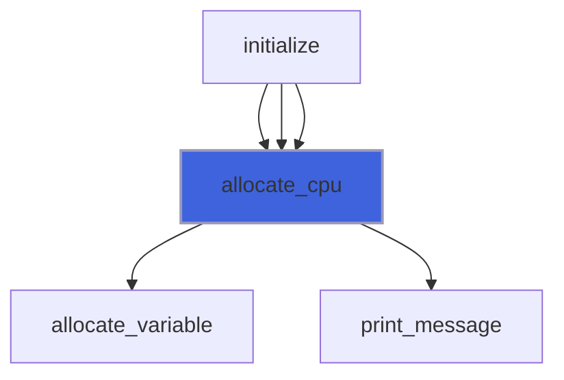

### finalize

Finalize simulation.

```fortran
subroutine finalize(self)
```

**Arguments**

| Name | Type | Intent | Attributes | Description |
|------|------|--------|------------|-------------|
| `self` | class([patch_cpu_object](/api/src/app/patch/cpu/adam_patch_cpu_object#patch-cpu-object)) | inout |  | The equation. |

**Call graph**

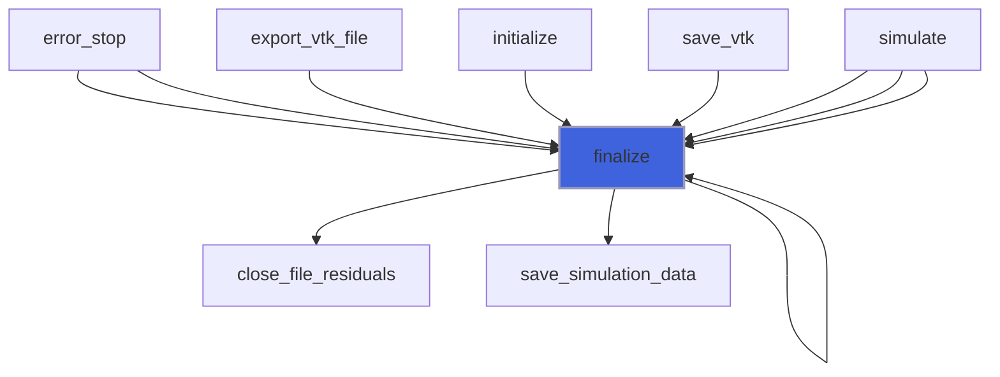

### initialize

Initialize the equation.

```fortran
subroutine initialize(self, filename)
```

**Arguments**

| Name | Type | Intent | Attributes | Description |
|------|------|--------|------------|-------------|
| `self` | class([patch_cpu_object](/api/src/app/patch/cpu/adam_patch_cpu_object#patch-cpu-object)) | inout |  | The equation. |
| `filename` | character(len=*) | in |  | Input file name. |

**Call graph**

```mermaid
flowchart TD
  add_node["add_node"] --> initialize["initialize"]
  analize["analize"] --> initialize["initialize"]
  build_connectivity["build_connectivity"] --> initialize["initialize"]
  distribute_facets["distribute_facets"] --> initialize["initialize"]
  distribute_facets_tree["distribute_facets_tree"] --> initialize["initialize"]
  export_vtk_file["export_vtk_file"] --> initialize["initialize"]
  initialize["initialize"] --> initialize["initialize"]
  initialize["initialize"] --> initialize["initialize"]
  initialize["initialize"] --> initialize["initialize"]
  initialize["initialize"] --> initialize["initialize"]
  initialize["initialize"] --> initialize["initialize"]
  initialize["initialize"] --> initialize["initialize"]
  initialize["initialize"] --> initialize["initialize"]
  initialize["initialize"] --> initialize["initialize"]
  initialize["initialize"] --> initialize["initialize"]
  initialize["initialize"] --> initialize["initialize"]
  initialize["initialize"] --> initialize["initialize"]
  initialize["initialize"] --> initialize["initialize"]
  initialize["initialize"] --> initialize["initialize"]
  initialize["initialize"] --> initialize["initialize"]
  initialize["initialize"] --> initialize["initialize"]
  initialize["initialize"] --> initialize["initialize"]
  initialize["initialize"] --> initialize["initialize"]
  initialize["initialize"] --> initialize["initialize"]
  initialize["initialize"] --> initialize["initialize"]
  initialize["initialize"] --> initialize["initialize"]
  initialize["initialize"] --> initialize["initialize"]
  initialize["initialize"] --> initialize["initialize"]
  initialize["initialize"] --> initialize["initialize"]
  initialize["initialize"] --> initialize["initialize"]
  initialize["initialize"] --> initialize["initialize"]
  initialize["initialize"] --> initialize["initialize"]
  initialize["initialize"] --> initialize["initialize"]
  initialize["initialize"] --> initialize["initialize"]
  initialize["initialize"] --> initialize["initialize"]
  initialize["initialize"] --> initialize["initialize"]
  initialize["initialize"] --> initialize["initialize"]
  initialize["initialize"] --> initialize["initialize"]
  initialize["initialize"] --> initialize["initialize"]
  initialize["initialize"] --> initialize["initialize"]
  initialize["initialize"] --> initialize["initialize"]
  initialize["initialize"] --> initialize["initialize"]
  initialize["initialize"] --> initialize["initialize"]
  initialize["initialize"] --> initialize["initialize"]
  initialize["initialize"] --> initialize["initialize"]
  initialize["initialize"] --> initialize["initialize"]
  initialize["initialize"] --> initialize["initialize"]
  initialize["initialize"] --> initialize["initialize"]
  initialize["initialize"] --> initialize["initialize"]
  initialize["initialize"] --> initialize["initialize"]
  initialize["initialize"] --> initialize["initialize"]
  initialize["initialize"] --> initialize["initialize"]
  initialize["initialize"] --> initialize["initialize"]
  initialize["initialize"] --> initialize["initialize"]
  initialize["initialize"] --> initialize["initialize"]
  initialize["initialize"] --> initialize["initialize"]
  initialize["initialize"] --> initialize["initialize"]
  initialize["initialize"] --> initialize["initialize"]
  initialize["initialize"] --> initialize["initialize"]
  initialize["initialize"] --> initialize["initialize"]
  initialize["initialize"] --> initialize["initialize"]
  initialize["initialize"] --> initialize["initialize"]
  initialize["initialize"] --> initialize["initialize"]
  initialize["initialize"] --> initialize["initialize"]
  initialize["initialize"] --> initialize["initialize"]
  initialize["initialize"] --> initialize["initialize"]
  initialize["initialize"] --> initialize["initialize"]
  initialize["initialize"] --> initialize["initialize"]
  initialize["initialize"] --> initialize["initialize"]
  initialize["initialize"] --> initialize["initialize"]
  initialize["initialize"] --> initialize["initialize"]
  initialize["initialize"] --> initialize["initialize"]
  initialize["initialize"] --> initialize["initialize"]
  initialize["initialize"] --> initialize["initialize"]
  initialize["initialize"] --> initialize["initialize"]
  initialize["initialize"] --> initialize["initialize"]
  initialize["initialize"] --> initialize["initialize"]
  initialize["initialize"] --> initialize["initialize"]
  initialize_common["initialize_common"] --> initialize["initialize"]
  initialize_common["initialize_common"] --> initialize["initialize"]
  initialize_common["initialize_common"] --> initialize["initialize"]
  initialize_common["initialize_common"] --> initialize["initialize"]
  load_from_file["load_from_file"] --> initialize["initialize"]
  load_from_file["load_from_file"] --> initialize["initialize"]
  open_file["open_file"] --> initialize["initialize"]
  open_file["open_file"] --> initialize["initialize"]
  open_file["open_file"] --> initialize["initialize"]
  resize["resize"] --> initialize["initialize"]
  save_into_file["save_into_file"] --> initialize["initialize"]
  save_vtk["save_vtk"] --> initialize["initialize"]
  simulate["simulate"] --> initialize["initialize"]
  simulate["simulate"] --> initialize["initialize"]
  simulate["simulate"] --> initialize["initialize"]
  simulate["simulate"] --> initialize["initialize"]
  simulate["simulate"] --> initialize["initialize"]
  simulate["simulate"] --> initialize["initialize"]
  simulate["simulate"] --> initialize["initialize"]
  test_stress["test_stress"] --> initialize["initialize"]
  initialize["initialize"] --> allocate_cpu["allocate_cpu"]
  initialize["initialize"] --> initialize["initialize"]
  initialize["initialize"] --> initialize_common["initialize_common"]
  initialize["initialize"] --> load_restart_files["load_restart_files"]
  initialize["initialize"] --> open_file_residuals["open_file_residuals"]
  initialize["initialize"] --> print_message["print_message"]
  initialize["initialize"] --> save_simulation_data["save_simulation_data"]
  initialize["initialize"] --> set_initial_conditions["set_initial_conditions"]
  initialize["initialize"] --> str["str"]
  style initialize fill:#3e63dd,stroke:#99b,stroke-width:2px
```

### amr_update

Do AMR update.

```fortran
subroutine amr_update(self)
```

**Arguments**

| Name | Type | Intent | Attributes | Description |
|------|------|--------|------------|-------------|
| `self` | class([patch_cpu_object](/api/src/app/patch/cpu/adam_patch_cpu_object#patch-cpu-object)) | inout |  | The equation. |

**Call graph**

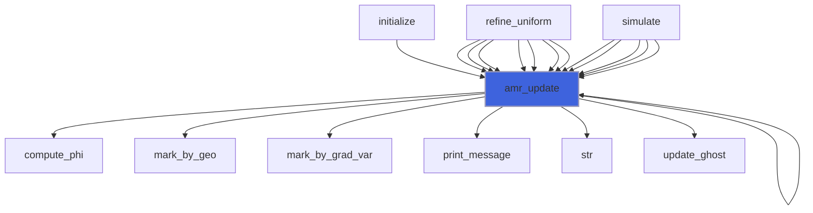

### compute_phi

Compute phi, distance from IB solid.

```fortran
subroutine compute_phi(self)
```

**Arguments**

| Name | Type | Intent | Attributes | Description |
|------|------|--------|------------|-------------|
| `self` | class([patch_cpu_object](/api/src/app/patch/cpu/adam_patch_cpu_object#patch-cpu-object)) | inout |  | The equation. |

**Call graph**

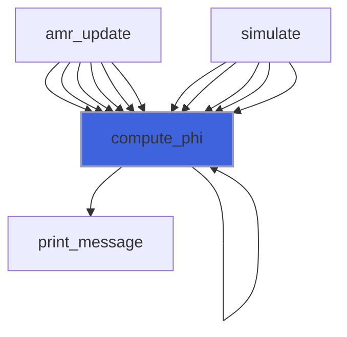

### mark_by_geo

Mark blocks to be refined/derefined by a geometric constrain.

```fortran
subroutine mark_by_geo(self, delta_fine, delta_coarse, threshold, do_init)
```

**Arguments**

| Name | Type | Intent | Attributes | Description |
|------|------|--------|------------|-------------|
| `self` | class([patch_cpu_object](/api/src/app/patch/cpu/adam_patch_cpu_object#patch-cpu-object)) | inout |  | The equation. |
| `delta_fine` | real(kind=[R8P](/api/src/third_party/PENF/src/lib/penf_global_parameters_variables)) | in |  | Maximum cell delta in fine grids. |
| `delta_coarse` | real(kind=[R8P](/api/src/third_party/PENF/src/lib/penf_global_parameters_variables)) | in |  | Minimum cell delta in coarse grids. |
| `threshold` | real(kind=[R8P](/api/src/third_party/PENF/src/lib/penf_global_parameters_variables)) | in | optional | Threshold for sphere proximity. |
| `do_init` | logical | in | optional |  |

**Call graph**

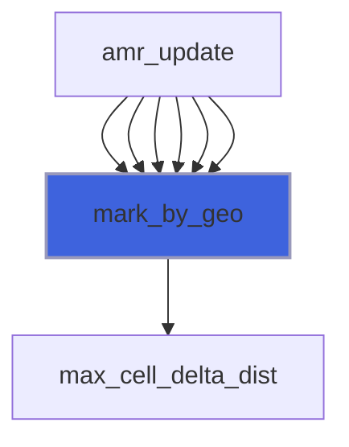

### mark_by_grad_var

Mark blocks to be refined/derefined by a `grad(var)` value.

```fortran
subroutine mark_by_grad_var(self, grad_tol, delta_type, delta_fine, delta_coarse, ivar, threshold, do_init)
```

**Arguments**

| Name | Type | Intent | Attributes | Description |
|------|------|--------|------------|-------------|
| `self` | class([patch_cpu_object](/api/src/app/patch/cpu/adam_patch_cpu_object#patch-cpu-object)) | inout |  | The equation. |
| `grad_tol` | real(kind=[R8P](/api/src/third_party/PENF/src/lib/penf_global_parameters_variables)) | in |  | Gradiend tolerance value. |
| `delta_type` | character(len=*) | in |  | Delta criterion type. |
| `delta_fine` | real(kind=[R8P](/api/src/third_party/PENF/src/lib/penf_global_parameters_variables)) | in |  | Maximum cell delta in fine grids. |
| `delta_coarse` | real(kind=[R8P](/api/src/third_party/PENF/src/lib/penf_global_parameters_variables)) | in |  | Minimum cell delta in coarse grids. |
| `ivar` | integer(kind=[I4P](/api/src/third_party/PENF/src/lib/penf_global_parameters_variables)) | in | optional | Variable for marking. |
| `threshold` | real(kind=[R8P](/api/src/third_party/PENF/src/lib/penf_global_parameters_variables)) | in | optional | Threshold for sphere proximity. |
| `do_init` | logical | in | optional | Re-initialize refinements queries. |

**Call graph**

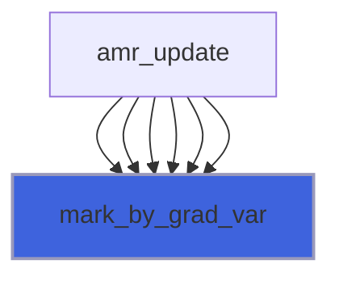

### move_phi

Move phi and the actual tree representation.

```fortran
subroutine move_phi(self, velocity, s)
```

**Arguments**

| Name | Type | Intent | Attributes | Description |
|------|------|--------|------------|-------------|
| `self` | class([patch_cpu_object](/api/src/app/patch/cpu/adam_patch_cpu_object#patch-cpu-object)) | inout |  | The equation. |
| `velocity` | real(kind=[R8P](/api/src/third_party/PENF/src/lib/penf_global_parameters_variables)) | in |  | Velocity of the movement. |
| `s` | integer(kind=[I4P](/api/src/third_party/PENF/src/lib/penf_global_parameters_variables)) | in |  | Solid index. |

**Call graph**

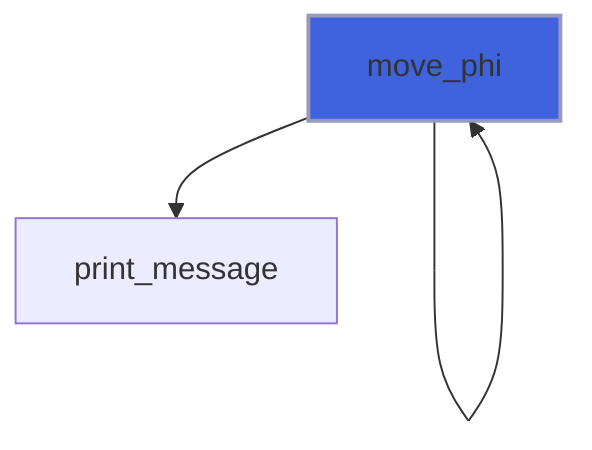

### refine_uniform

Refine all blocks uniformly.

```fortran
subroutine refine_uniform(self, refinement_levels)
```

**Arguments**

| Name | Type | Intent | Attributes | Description |
|------|------|--------|------------|-------------|
| `self` | class([patch_cpu_object](/api/src/app/patch/cpu/adam_patch_cpu_object#patch-cpu-object)) | inout |  | The equation. |
| `refinement_levels` | integer(kind=[I4P](/api/src/third_party/PENF/src/lib/penf_global_parameters_variables)) | in |  | Number of refinement to be performed. |

**Call graph**

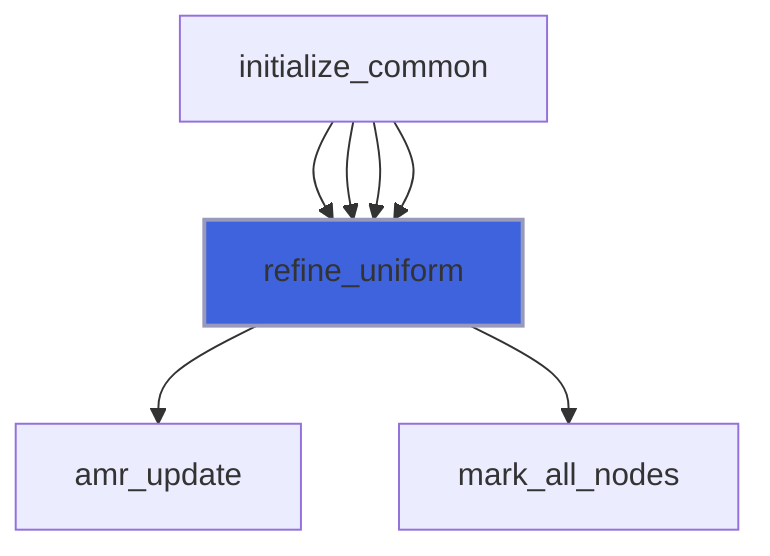

### integrate_eikonal

Integrate eikonal equation.

```fortran
subroutine integrate_eikonal(self, q)
```

**Arguments**

| Name | Type | Intent | Attributes | Description |
|------|------|--------|------------|-------------|
| `self` | class([patch_cpu_object](/api/src/app/patch/cpu/adam_patch_cpu_object#patch-cpu-object)) | inout |  | The equation. |
| `q` | real(kind=[R8P](/api/src/third_party/PENF/src/lib/penf_global_parameters_variables)) | inout |  | Conservative variables. |

**Call graph**

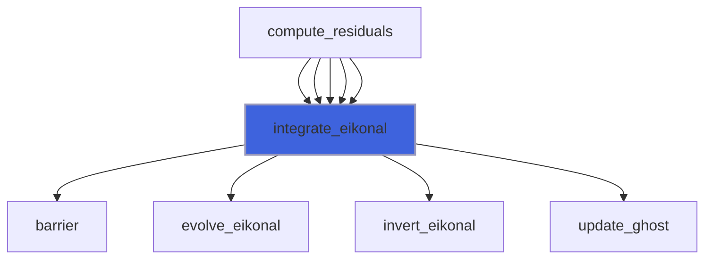

### load_restart_files

Save restart files.

```fortran
subroutine load_restart_files(self, t, time)
```

**Arguments**

| Name | Type | Intent | Attributes | Description |
|------|------|--------|------------|-------------|
| `self` | class([patch_cpu_object](/api/src/app/patch/cpu/adam_patch_cpu_object#patch-cpu-object)) | inout |  | The equation. |
| `t` | integer(kind=[I4P](/api/src/third_party/PENF/src/lib/penf_global_parameters_variables)) | out |  | Time iteration. |
| `time` | real(kind=[R8P](/api/src/third_party/PENF/src/lib/penf_global_parameters_variables)) | out |  | Time. |

**Call graph**

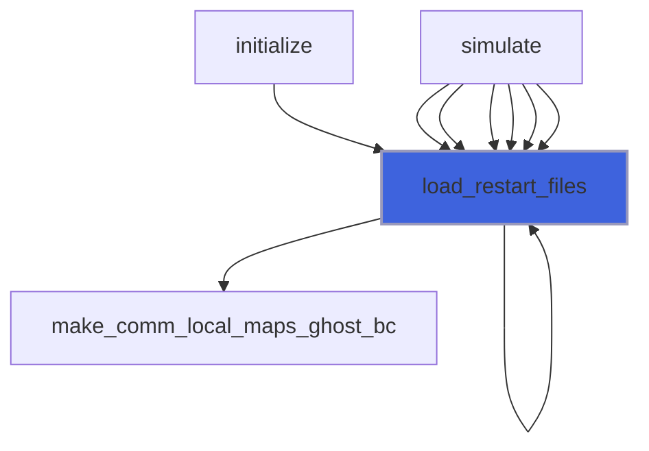

### save_xh5f

Save simulation data in HDF5 format.

```fortran
subroutine save_xh5f(self, output_basename, with_ghost)
```

**Arguments**

| Name | Type | Intent | Attributes | Description |
|------|------|--------|------------|-------------|
| `self` | class([patch_cpu_object](/api/src/app/patch/cpu/adam_patch_cpu_object#patch-cpu-object)) | inout |  | The equation. |
| `output_basename` | character(len=*) | in | optional | Output basename. |
| `with_ghost` | logical | in | optional | Flag to save ghost cells. |

**Call graph**

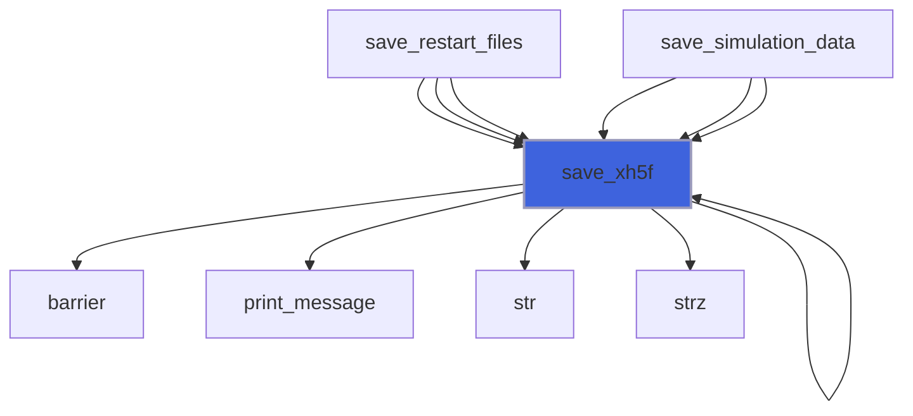

### save_residuals

Save residuals history.

```fortran
subroutine save_residuals(self)
```

**Arguments**

| Name | Type | Intent | Attributes | Description |
|------|------|--------|------------|-------------|
| `self` | class([patch_cpu_object](/api/src/app/patch/cpu/adam_patch_cpu_object#patch-cpu-object)) | inout |  | The equation. |

**Call graph**

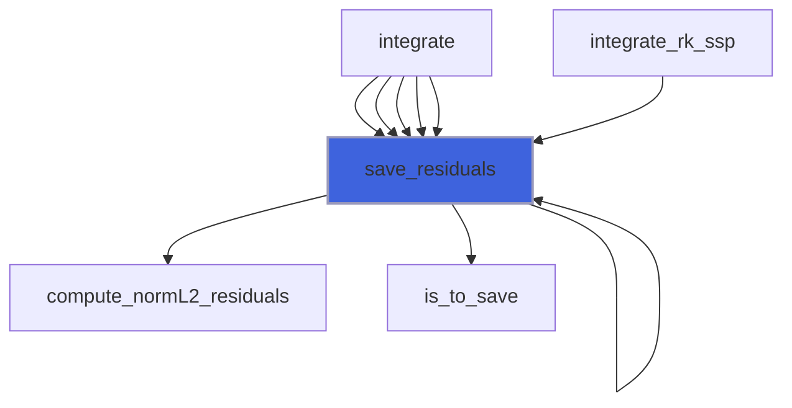

### save_restart_files

Save restart files.

```fortran
subroutine save_restart_files(self)
```

**Arguments**

| Name | Type | Intent | Attributes | Description |
|------|------|--------|------------|-------------|
| `self` | class([patch_cpu_object](/api/src/app/patch/cpu/adam_patch_cpu_object#patch-cpu-object)) | inout |  | The equation. |

**Call graph**

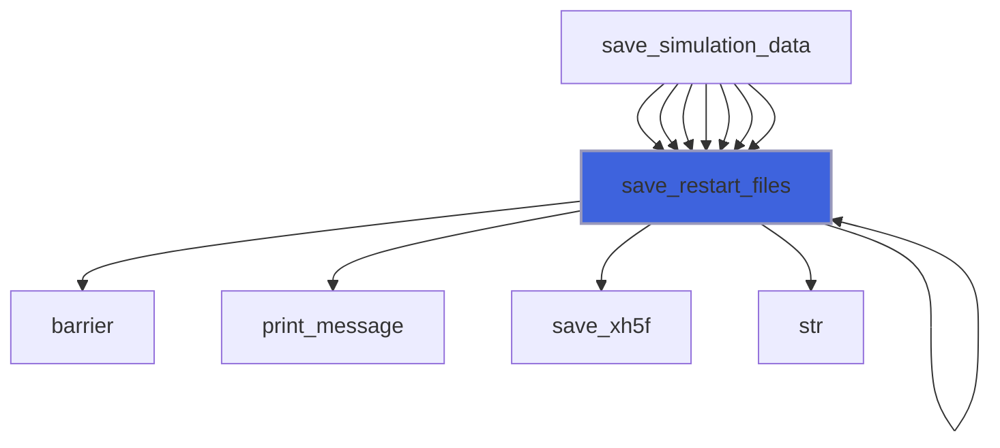

### save_simulation_data

Save all simulation data.

```fortran
subroutine save_simulation_data(self)
```

**Arguments**

| Name | Type | Intent | Attributes | Description |
|------|------|--------|------------|-------------|
| `self` | class([patch_cpu_object](/api/src/app/patch/cpu/adam_patch_cpu_object#patch-cpu-object)) | inout |  | The equation. |

**Call graph**

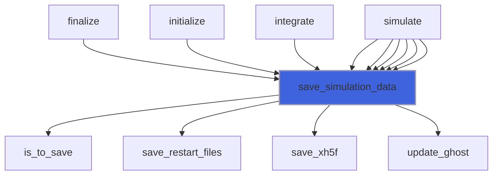

### set_boundary_conditions

Set boundary conditions of equation.

```fortran
subroutine set_boundary_conditions(self, q)
```

**Arguments**

| Name | Type | Intent | Attributes | Description |
|------|------|--------|------------|-------------|
| `self` | class([patch_cpu_object](/api/src/app/patch/cpu/adam_patch_cpu_object#patch-cpu-object)) | in |  | The equation. |
| `q` | real(kind=[R8P](/api/src/third_party/PENF/src/lib/penf_global_parameters_variables)) | inout |  | Conservative variables. |

**Call graph**

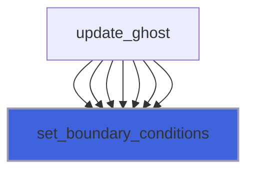

### set_initial_conditions

Set initial conditions and coils on field.

```fortran
subroutine set_initial_conditions(self)
```

**Arguments**

| Name | Type | Intent | Attributes | Description |
|------|------|--------|------------|-------------|
| `self` | class([patch_cpu_object](/api/src/app/patch/cpu/adam_patch_cpu_object#patch-cpu-object)) | inout |  | The equation. |

**Call graph**

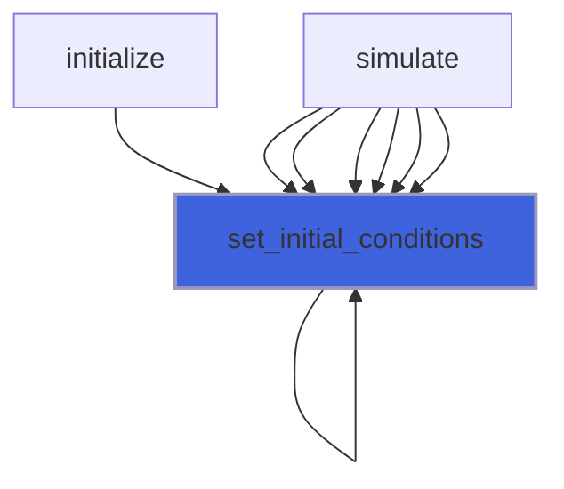

### update_ghost

Update ghost cells.
 If not specified all steps are perfermod, syncronous computation

```fortran
subroutine update_ghost(self, q, step)
```

**Arguments**

| Name | Type | Intent | Attributes | Description |
|------|------|--------|------------|-------------|
| `self` | class([patch_cpu_object](/api/src/app/patch/cpu/adam_patch_cpu_object#patch-cpu-object)) | inout |  | The equation. |
| `q` | real(kind=[R8P](/api/src/third_party/PENF/src/lib/penf_global_parameters_variables)) | inout |  | Conservative variables. |
| `step` | integer(kind=[I4P](/api/src/third_party/PENF/src/lib/penf_global_parameters_variables)) | in | optional | Step to be perfordmed in asyncronous comp. |

**Call graph**

```mermaid
flowchart TD
  amr_update["amr_update"] --> update_ghost["update_ghost"]
  amr_update["amr_update"] --> update_ghost["update_ghost"]
  amr_update["amr_update"] --> update_ghost["update_ghost"]
  amr_update["amr_update"] --> update_ghost["update_ghost"]
  amr_update["amr_update"] --> update_ghost["update_ghost"]
  amr_update["amr_update"] --> update_ghost["update_ghost"]
  compute_residuals["compute_residuals"] --> update_ghost["update_ghost"]
  compute_residuals["compute_residuals"] --> update_ghost["update_ghost"]
  compute_residuals["compute_residuals"] --> update_ghost["update_ghost"]
  compute_residuals["compute_residuals"] --> update_ghost["update_ghost"]
  compute_residuals["compute_residuals"] --> update_ghost["update_ghost"]
  compute_residuals_fd_centered["compute_residuals_fd_centered"] --> update_ghost["update_ghost"]
  integrate_eikonal["integrate_eikonal"] --> update_ghost["update_ghost"]
  integrate_eikonal["integrate_eikonal"] --> update_ghost["update_ghost"]
  integrate_eikonal["integrate_eikonal"] --> update_ghost["update_ghost"]
  integrate_eikonal["integrate_eikonal"] --> update_ghost["update_ghost"]
  integrate_eikonal["integrate_eikonal"] --> update_ghost["update_ghost"]
  integrate_eikonal["integrate_eikonal"] --> update_ghost["update_ghost"]
  mark_by_grad_var["mark_by_grad_var"] --> update_ghost["update_ghost"]
  mark_by_grad_var["mark_by_grad_var"] --> update_ghost["update_ghost"]
  mark_by_grad_var["mark_by_grad_var"] --> update_ghost["update_ghost"]
  mark_by_grad_var["mark_by_grad_var"] --> update_ghost["update_ghost"]
  mark_by_grad_var["mark_by_grad_var"] --> update_ghost["update_ghost"]
  save_simulation_data["save_simulation_data"] --> update_ghost["update_ghost"]
  save_simulation_data["save_simulation_data"] --> update_ghost["update_ghost"]
  save_simulation_data["save_simulation_data"] --> update_ghost["update_ghost"]
  save_simulation_data["save_simulation_data"] --> update_ghost["update_ghost"]
  save_simulation_data["save_simulation_data"] --> update_ghost["update_ghost"]
  save_simulation_data["save_simulation_data"] --> update_ghost["update_ghost"]
  save_simulation_data["save_simulation_data"] --> update_ghost["update_ghost"]
  update_ghost["update_ghost"] --> set_boundary_conditions["set_boundary_conditions"]
  update_ghost["update_ghost"] --> update_ghost_local["update_ghost_local"]
  update_ghost["update_ghost"] --> update_ghost_mpi["update_ghost_mpi"]
  style update_ghost fill:#3e63dd,stroke:#99b,stroke-width:2px
```

### integrate

Integrate the equation.

```fortran
subroutine integrate(self, compute_smoothing)
```

**Arguments**

| Name | Type | Intent | Attributes | Description |
|------|------|--------|------------|-------------|
| `self` | class([patch_cpu_object](/api/src/app/patch/cpu/adam_patch_cpu_object#patch-cpu-object)) | inout |  | The equation. |
| `compute_smoothing` | procedure(compute_smoothing_interface) |  |  | Smoothing procedure. |

**Call graph**

```mermaid
flowchart TD
  simulate["simulate"] --> integrate["integrate"]
  simulate["simulate"] --> integrate["integrate"]
  simulate["simulate"] --> integrate["integrate"]
  simulate["simulate"] --> integrate["integrate"]
  simulate["simulate"] --> integrate["integrate"]
  simulate["simulate"] --> integrate["integrate"]
  integrate["integrate"] --> barrier["barrier"]
  integrate["integrate"] --> print_message["print_message"]
  integrate["integrate"] --> print_progress["print_progress"]
  integrate["integrate"] --> save_memory_status["save_memory_status"]
  integrate["integrate"] --> save_simulation_data["save_simulation_data"]
  integrate["integrate"] --> str["str"]
  style integrate fill:#3e63dd,stroke:#99b,stroke-width:2px
```

### simulate

Perform the simulation.

```fortran
subroutine simulate(self, filename)
```

**Arguments**

| Name | Type | Intent | Attributes | Description |
|------|------|--------|------------|-------------|
| `self` | class([patch_cpu_object](/api/src/app/patch/cpu/adam_patch_cpu_object#patch-cpu-object)) | inout |  | The equation. |
| `filename` | character(len=*) | in |  | Input file name. |

**Call graph**

```mermaid
flowchart TD
  simulate["simulate"] --> finalize["finalize"]
  simulate["simulate"] --> initialize["initialize"]
  simulate["simulate"] --> integrate["integrate"]
  style simulate fill:#3e63dd,stroke:#99b,stroke-width:2px
```
