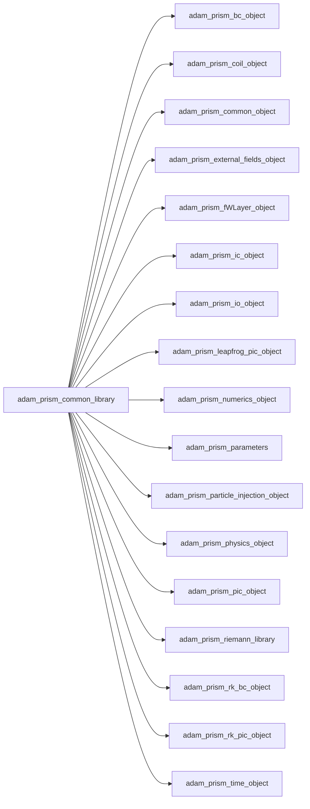

# adam_prism_common_library

> ADAM PRISM common library, entry for all common classes and libraries.

**Source**: `src/app/prism/common/adam_prism_common_library.F90`

**Dependencies**

```mermaid
graph LR
  adam_prism_common_library["adam_prism_common_library"] --> adam_prism_bc_object["adam_prism_bc_object"]
  adam_prism_common_library["adam_prism_common_library"] --> adam_prism_coil_object["adam_prism_coil_object"]
  adam_prism_common_library["adam_prism_common_library"] --> adam_prism_common_object["adam_prism_common_object"]
  adam_prism_common_library["adam_prism_common_library"] --> adam_prism_external_fields_object["adam_prism_external_fields_object"]
  adam_prism_common_library["adam_prism_common_library"] --> adam_prism_fWLayer_object["adam_prism_fWLayer_object"]
  adam_prism_common_library["adam_prism_common_library"] --> adam_prism_ic_object["adam_prism_ic_object"]
  adam_prism_common_library["adam_prism_common_library"] --> adam_prism_io_object["adam_prism_io_object"]
  adam_prism_common_library["adam_prism_common_library"] --> adam_prism_leapfrog_pic_object["adam_prism_leapfrog_pic_object"]
  adam_prism_common_library["adam_prism_common_library"] --> adam_prism_numerics_object["adam_prism_numerics_object"]
  adam_prism_common_library["adam_prism_common_library"] --> adam_prism_parameters["adam_prism_parameters"]
  adam_prism_common_library["adam_prism_common_library"] --> adam_prism_particle_injection_object["adam_prism_particle_injection_object"]
  adam_prism_common_library["adam_prism_common_library"] --> adam_prism_physics_object["adam_prism_physics_object"]
  adam_prism_common_library["adam_prism_common_library"] --> adam_prism_pic_object["adam_prism_pic_object"]
  adam_prism_common_library["adam_prism_common_library"] --> adam_prism_riemann_library["adam_prism_riemann_library"]
  adam_prism_common_library["adam_prism_common_library"] --> adam_prism_rk_bc_object["adam_prism_rk_bc_object"]
  adam_prism_common_library["adam_prism_common_library"] --> adam_prism_rk_pic_object["adam_prism_rk_pic_object"]
  adam_prism_common_library["adam_prism_common_library"] --> adam_prism_time_object["adam_prism_time_object"]
```
