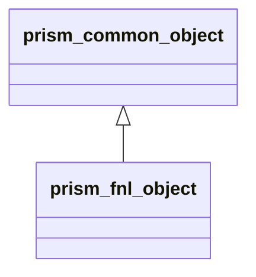
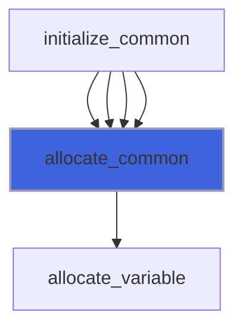
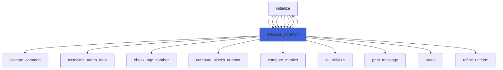
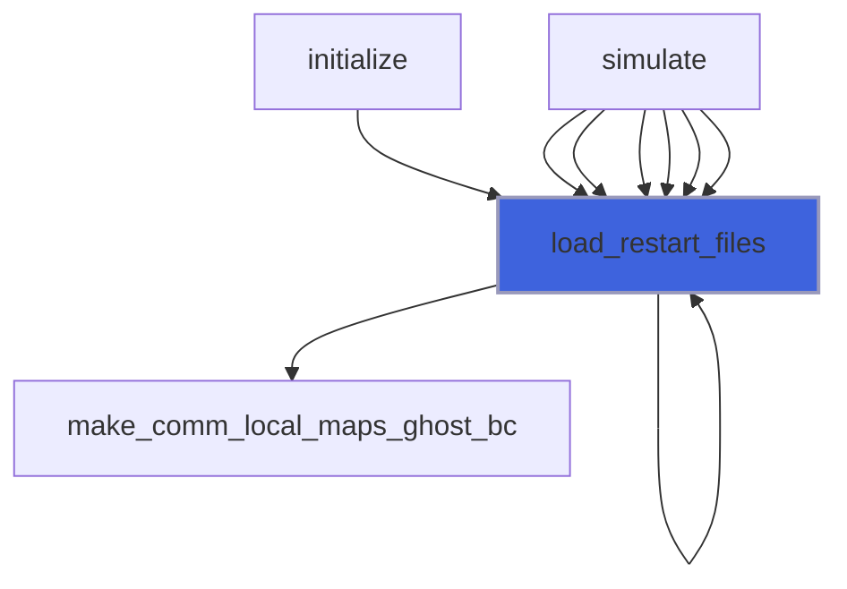
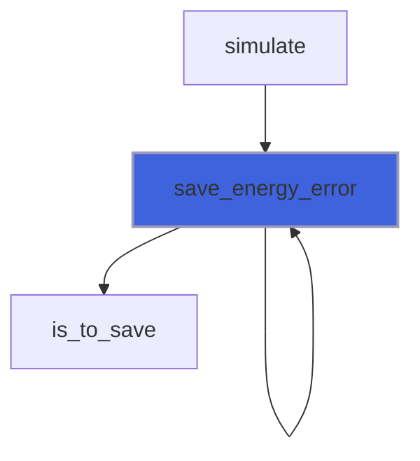
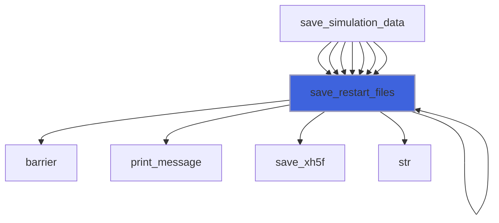
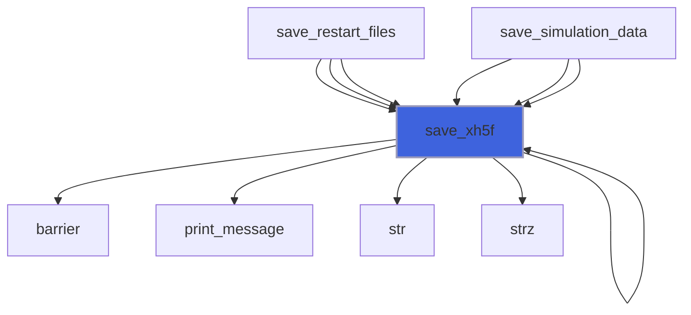

# adam_prism_common_object

**Source**: `src/app/prism/common/adam_prism_common_object.F90`

**Dependencies**

```mermaid
graph LR
  adam_prism_common_object["adam_prism_common_object"] --> adam_adam_object["adam_adam_object"]
  adam_prism_common_object["adam_prism_common_object"] --> adam_amr_object["adam_amr_object"]
  adam_prism_common_object["adam_prism_common_object"] --> adam_blanes_moan_object["adam_blanes_moan_object"]
  adam_prism_common_object["adam_prism_common_object"] --> adam_cfm_object["adam_cfm_object"]
  adam_prism_common_object["adam_prism_common_object"] --> adam_field_object["adam_field_object"]
  adam_prism_common_object["adam_prism_common_object"] --> adam_flail_object["adam_flail_object"]
  adam_prism_common_object["adam_prism_common_object"] --> adam_grid_object["adam_grid_object"]
  adam_prism_common_object["adam_prism_common_object"] --> adam_ib_object["adam_ib_object"]
  adam_prism_common_object["adam_prism_common_object"] --> adam_leapfrog_object["adam_leapfrog_object"]
  adam_prism_common_object["adam_prism_common_object"] --> adam_mpih_object["adam_mpih_object"]
  adam_prism_common_object["adam_prism_common_object"] --> adam_prism_bc_object["adam_prism_bc_object"]
  adam_prism_common_object["adam_prism_common_object"] --> adam_prism_coil_object["adam_prism_coil_object"]
  adam_prism_common_object["adam_prism_common_object"] --> adam_prism_external_fields_object["adam_prism_external_fields_object"]
  adam_prism_common_object["adam_prism_common_object"] --> adam_prism_fWLayer_object["adam_prism_fWLayer_object"]
  adam_prism_common_object["adam_prism_common_object"] --> adam_prism_ic_object["adam_prism_ic_object"]
  adam_prism_common_object["adam_prism_common_object"] --> adam_prism_io_object["adam_prism_io_object"]
  adam_prism_common_object["adam_prism_common_object"] --> adam_prism_leapfrog_pic_object["adam_prism_leapfrog_pic_object"]
  adam_prism_common_object["adam_prism_common_object"] --> adam_prism_numerics_object["adam_prism_numerics_object"]
  adam_prism_common_object["adam_prism_common_object"] --> adam_prism_particle_injection_object["adam_prism_particle_injection_object"]
  adam_prism_common_object["adam_prism_common_object"] --> adam_prism_physics_object["adam_prism_physics_object"]
  adam_prism_common_object["adam_prism_common_object"] --> adam_prism_pic_object["adam_prism_pic_object"]
  adam_prism_common_object["adam_prism_common_object"] --> adam_prism_rk_bc_object["adam_prism_rk_bc_object"]
  adam_prism_common_object["adam_prism_common_object"] --> adam_prism_rk_pic_object["adam_prism_rk_pic_object"]
  adam_prism_common_object["adam_prism_common_object"] --> adam_prism_time_object["adam_prism_time_object"]
  adam_prism_common_object["adam_prism_common_object"] --> adam_rk_object["adam_rk_object"]
  adam_prism_common_object["adam_prism_common_object"] --> adam_slices_object["adam_slices_object"]
  adam_prism_common_object["adam_prism_common_object"] --> adam_weno_object["adam_weno_object"]
  adam_prism_common_object["adam_prism_common_object"] --> penf["penf"]
```



## Contents

- [prism_common_object](#prism-common-object)
- [allocate_common](#allocate-common)
- [initialize_common](#initialize-common)
- [load_restart_files](#load-restart-files)
- [save_energy_error](#save-energy-error)
- [save_restart_files](#save-restart-files)
- [save_xh5f](#save-xh5f)

## Derived Types

### prism_common_object

Maxwell equations system class definition, common data to all backends.

**Inheritance**



#### Components

| Name | Type | Attributes | Description |
|------|------|------------|-------------|
| `mpih` | type([mpih_object](/api/src/third_party/FUNDAL/src/lib/fundal_mpih_object#mpih-object)) |  | MPI handler. |
| `adam` | type([adam_object](/api/src/lib/common/adam_adam_object#adam-object)) |  | ADAM. |
| `field` | type([field_object](/api/src/lib/common/adam_field_object#field-object)) | pointer | The field. |
| `grid` | type([grid_object](/api/src/lib/common/adam_grid_object#grid-object)) | pointer | The grid. |
| `amr` | type([amr_object](/api/src/lib/common/adam_amr_object#amr-object)) |  | AMR marker handler. |
| `ib` | type([ib_object](/api/src/lib/common/adam_ib_object#ib-object)) |  | Immersed Boundary (IB) handler. |
| `slices` | type([slices_object](/api/src/lib/common/adam_slices_object#slices-object)) |  | Slices handler. |
| `blanesmoan` | type([blanesmoan_object](/api/src/lib/common/adam_blanes_moan_object#blanesmoan-object)) |  | Blanes-Moan integrator. |
| `cfm` | type([cfm_object](/api/src/lib/common/adam_cfm_object#cfm-object)) |  | Commutator-Free Magnus integrator. |
| `leapfrog` | type([leapfrog_object](/api/src/lib/common/adam_leapfrog_object#leapfrog-object)) |  | Leapfrog integrator. |
| `rk` | type([rk_object](/api/src/lib/common/adam_rk_object#rk-object)) |  | RK integrator. |
| `weno` | type([weno_object](/api/src/lib/common/adam_weno_object#weno-object)) |  | WENO reconstructor. |
| `flail` | type([flail_object](/api/src/lib/common/adam_flail_object#flail-object)) |  | Linear algebra methods handler. |
| `io` | type([prism_io_object](/api/src/app/prism/common/adam_prism_io_object#prism-io-object)) |  | IO handler. |
| `numerics` | type([prism_numerics_object](/api/src/app/prism/common/adam_prism_numerics_object#prism-numerics-object)) |  | Numerics handler. |
| `physics` | type([prism_physics_object](/api/src/app/prism/common/adam_prism_physics_object#prism-physics-object)) |  | Fluids physiscs handler. |
| `ic` | type([prism_ic_object](/api/src/app/prism/common/adam_prism_ic_object#prism-ic-object)) |  | Initial Conditions (IC) handler. |
| `bc` | type([prism_bc_object](/api/src/app/prism/common/adam_prism_bc_object#prism-bc-object)) |  | Boundary Conditions (BC) handler. |
| `rk_bc` | type([prism_rk_bc_object](/api/src/app/prism/common/adam_prism_rk_bc_object#prism-rk-bc-object)) |  | RK integrator for BC. |
| `time` | type([prism_time_object](/api/src/app/prism/common/adam_prism_time_object#prism-time-object)) |  | Time handler. |
| `fWLayer` | type([prism_fWLayer_object](/api/src/app/prism/common/adam_prism_fWLayer_object#prism-fwlayer-object)) |  | fWLayer handler. |
| `coil` | type([prism_coil_object](/api/src/app/prism/common/adam_prism_coil_object#prism-coil-object)) |  | Coils handler. |
| `external_fields` | type([prism_external_fields_object](/api/src/app/prism/common/adam_prism_external_fields_object#prism-external-fields-object)) |  | External fields handler. |
| `pic` | type([prism_pic_object](/api/src/app/prism/common/adam_prism_pic_object#prism-pic-object)) |  | Particle-in-Cell (PIC) handler. |
| `particle_injection` | type([prism_particle_injection_object](/api/src/app/prism/common/adam_prism_particle_injection_object#prism-particle-injection-object)) |  | Particle injection handler. |
| `leapfrog_pic` | type([prism_leapfrog_pic_object](/api/src/app/prism/common/adam_prism_leapfrog_pic_object#prism-leapfrog-pic-object)) |  | Leapfrog PIC integrator. |
| `rk_pic` | type([prism_rk_pic_object](/api/src/app/prism/common/adam_prism_rk_pic_object#prism-rk-pic-object)) |  | RK PIC integrator. |
| `ngc` | integer(kind=[I4P](/api/src/third_party/PENF/src/lib/penf_global_parameters_variables)) | pointer | Number of ghost cells. |
| `ni` | integer(kind=[I4P](/api/src/third_party/PENF/src/lib/penf_global_parameters_variables)) | pointer | Number of cells in i direction. |
| `nj` | integer(kind=[I4P](/api/src/third_party/PENF/src/lib/penf_global_parameters_variables)) | pointer | Number of cells in j direction. |
| `nk` | integer(kind=[I4P](/api/src/third_party/PENF/src/lib/penf_global_parameters_variables)) | pointer | Number of cells in k direction. |
| `nb` | integer(kind=[I4P](/api/src/third_party/PENF/src/lib/penf_global_parameters_variables)) | pointer | Total blocks number for MPI. |
| `blocks_number` | integer(kind=[I4P](/api/src/third_party/PENF/src/lib/penf_global_parameters_variables)) | pointer | Actual blocks number. |
| `nv` | integer(kind=[I4P](/api/src/third_party/PENF/src/lib/penf_global_parameters_variables)) | pointer | Number of variables in q vector. |
| `nv_c` | integer(kind=[I4P](/api/src/third_party/PENF/src/lib/penf_global_parameters_variables)) | pointer | Number of conservative variables in q vector. |
| `nv_s` | integer(kind=[I4P](/api/src/third_party/PENF/src/lib/penf_global_parameters_variables)) | pointer | Number of source variables in q vector. |
| `nv_cl` | integer(kind=[I4P](/api/src/third_party/PENF/src/lib/penf_global_parameters_variables)) | pointer | Number of divergence cleaning variables in q vector. |
| `q` | real(kind=[R8P](/api/src/third_party/PENF/src/lib/penf_global_parameters_variables)) | allocatable | Conservative cell centered variables. |
| `dq` | real(kind=[R8P](/api/src/third_party/PENF/src/lib/penf_global_parameters_variables)) | allocatable | Residuals right hand side. |
| `q_pic` | real(kind=[R8P](/api/src/third_party/PENF/src/lib/penf_global_parameters_variables)) | allocatable | PIC variables. |
| `pic_fields` | real(kind=[R8P](/api/src/third_party/PENF/src/lib/penf_global_parameters_variables)) | allocatable | Fields value at particle locations. |
| `curl` | real(kind=[R8P](/api/src/third_party/PENF/src/lib/penf_global_parameters_variables)) | allocatable | Curl fields. |
| `divergence` | real(kind=[R8P](/api/src/third_party/PENF/src/lib/penf_global_parameters_variables)) | allocatable | Divergence fields. |
| `q_name` | character(len=3) | allocatable | Fields names [1:nv]. |
| `energy_D` | real(kind=[R8P](/api/src/third_party/PENF/src/lib/penf_global_parameters_variables)) | allocatable | Energy of field D, time history. |
| `energy_B` | real(kind=[R8P](/api/src/third_party/PENF/src/lib/penf_global_parameters_variables)) | allocatable | Energy of field B, time history. |
| `rms_energy_error_D` | real(kind=[R8P](/api/src/third_party/PENF/src/lib/penf_global_parameters_variables)) |  | RMS energy error of D field. |
| `rms_energy_error_B` | real(kind=[R8P](/api/src/third_party/PENF/src/lib/penf_global_parameters_variables)) |  | RMS energy error of B field. |

#### Type-Bound Procedures

| Name | Attributes | Description |
|------|------------|-------------|
| `allocate_common` | pass(self) | Allocate common data. |
| `initialize_common` | pass(self) | Initialize the equation common data. |
| `load_restart_files` | pass(self) | Load restart files. |
| `save_energy_error` | pass(self) | Save energy error history. |
| `save_restart_files` | pass(self) | Save restart files. |
| `save_xh5f` | pass(self) | Save simulation data in XH5F format. |

## Subroutines

### allocate_common

Allocate common data.

```fortran
subroutine allocate_common(self)
```

**Arguments**

| Name | Type | Intent | Attributes | Description |
|------|------|--------|------------|-------------|
| `self` | class([prism_common_object](/api/src/app/prism/common/adam_prism_common_object#prism-common-object)) | inout |  | The equation. |

**Call graph**



### initialize_common

Initialize the equation common data.

```fortran
subroutine initialize_common(self, field, filename, memory_avail, do_mpi_init, verbose)
```

**Arguments**

| Name | Type | Intent | Attributes | Description |
|------|------|--------|------------|-------------|
| `self` | class([prism_common_object](/api/src/app/prism/common/adam_prism_common_object#prism-common-object)) | inout | target | The equation. |
| `field` | type([field_object](/api/src/lib/common/adam_field_object#field-object)) | inout |  | The field. |
| `filename` | character(len=*) | in |  | Input file name. |
| `memory_avail` | real(kind=[R8P](/api/src/third_party/PENF/src/lib/penf_global_parameters_variables)) | in | value | Memory available for single MPI process. |
| `do_mpi_init` | logical | in | optional | Flag to activate MPI init call. |
| `verbose` | logical | in | optional | Trigger verbose output. |

**Call graph**



### load_restart_files

Save restart files.

```fortran
subroutine load_restart_files(self, t, time)
```

**Arguments**

| Name | Type | Intent | Attributes | Description |
|------|------|--------|------------|-------------|
| `self` | class([prism_common_object](/api/src/app/prism/common/adam_prism_common_object#prism-common-object)) | inout |  | The equation. |
| `t` | integer(kind=[I4P](/api/src/third_party/PENF/src/lib/penf_global_parameters_variables)) | out |  | Time iteration. |
| `time` | real(kind=[R8P](/api/src/third_party/PENF/src/lib/penf_global_parameters_variables)) | out |  | Time. |

**Call graph**



### save_energy_error

Save energy error history.

```fortran
subroutine save_energy_error(self, is_to_open, is_to_close)
```

**Arguments**

| Name | Type | Intent | Attributes | Description |
|------|------|--------|------------|-------------|
| `self` | class([prism_common_object](/api/src/app/prism/common/adam_prism_common_object#prism-common-object)) | inout |  | The equation. |
| `is_to_open` | logical | in | optional | Flag to open  file before first saving. |
| `is_to_close` | logical | in | optional | Flag to close file after last saving. |

**Call graph**



### save_restart_files

Save restart files.

```fortran
subroutine save_restart_files(self)
```

**Arguments**

| Name | Type | Intent | Attributes | Description |
|------|------|--------|------------|-------------|
| `self` | class([prism_common_object](/api/src/app/prism/common/adam_prism_common_object#prism-common-object)) | inout |  | The equation. |

**Call graph**



### save_xh5f

Save simulation data in HDF5 format.

```fortran
subroutine save_xh5f(self, output_basename, with_ghost)
```

**Arguments**

| Name | Type | Intent | Attributes | Description |
|------|------|--------|------------|-------------|
| `self` | class([prism_common_object](/api/src/app/prism/common/adam_prism_common_object#prism-common-object)) | inout |  | The equation. |
| `output_basename` | character(len=*) | in | optional | Output basename. |
| `with_ghost` | logical | in | optional | Flag to save ghost cells. |

**Call graph**


