# adam_prism_particle_injection_object

> ADAM, PRISM Particle-in-Cell class definition, CPU backend.

**Source**: `src/app/prism/common/adam_prism_particle_injection_object.F90`

**Dependencies**

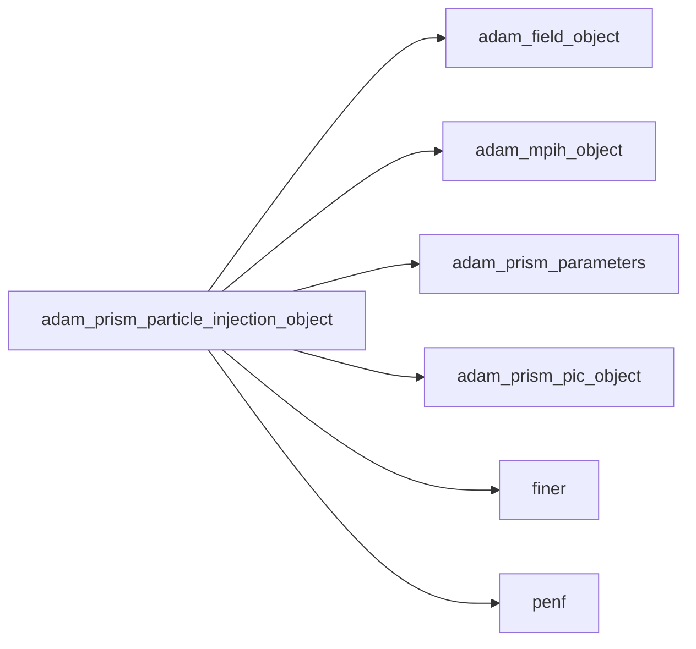

## Contents

- [prism_particle_injection_object](#prism-particle-injection-object)
- [particle_space_injection_interface](#particle-space-injection-interface)
- [space_random_number_generator_interface](#space-random-number-generator-interface)
- [particle_velocity_injection_interface](#particle-velocity-injection-interface)
- [velocity_random_number_generator_interface](#velocity-random-number-generator-interface)
- [initialize](#initialize)
- [load_from_file](#load-from-file)
- [set_particle_initial_injection](#set-particle-initial-injection)
- [single_particle_injection](#single-particle-injection)
- [uniform_domain_space_injection](#uniform-domain-space-injection)
- [uniform_cell_space_injection](#uniform-cell-space-injection)
- [uniform_maxwellian_velocity_injection](#uniform-maxwellian-velocity-injection)
- [non_uniform_maxwellian_velocity_injection](#non-uniform-maxwellian-velocity-injection)
- [write_initial_injection_tab](#write-initial-injection-tab)
- [random_number_generator](#random-number-generator)
- [layered_number_generator](#layered-number-generator)
- [add_drift_velocity](#add-drift-velocity)
- [apply_vel_av_correction](#apply-vel-av-correction)
- [description](#description)
- [fisher_yates_shuffle](#fisher-yates-shuffle)

## Variables

| Name | Type | Attributes | Description |
|------|------|------------|-------------|
| `INI_SECTION_NAME` | character(len=18) | parameter |  |
| `UNIFORM_DOMAIN_SPACE_DISTRIBUTION` | character(len=33) | parameter |  |
| `UNIFORM_BOX_SPACE_DISTRIBUTION` | character(len=32) | parameter |  |
| `UNIFORM_CELL_SPACE_DISTRIBUTION` | character(len=31) | parameter |  |
| `SPACE_RANDOM_NUMBER_GENERATOR` | character(len=29) | parameter |  |
| `SPACE_LAYERED_NUMBER_GENERATOR` | character(len=30) | parameter |  |
| `UNIFORM_MAXWELLIAN_VELOCITY_DISTRIBUTION` | character(len=18) | parameter |  |
| `NON_UNIFORM_MAXWELLIAN_VELOCITY_DISTRIBUTION` | character(len=22) | parameter |  |
| `VELOCITY_RANDOM_NUMBER_GENERATOR` | character(len=32) | parameter |  |
| `VELOCITY_LAYERED_NUMBER_GENERATOR` | character(len=33) | parameter |  |
| `space_rand_num_generator	` | procedure(space_random_number_generator_interface) | pointer | Space random number generator interface |
| `velocity_rand_num_generator` | procedure(velocity_random_number_generator_interface) | pointer | Space random number generator interface |

## Derived Types

### prism_particle_injection_object

#### Components

| Name | Type | Attributes | Description |
|------|------|------------|-------------|
| `mpih` | type([mpih_object](/api/src/third_party/FUNDAL/src/lib/fundal_mpih_object#mpih-object)) |  | MPI handler. |
| `space_distribution` | character(len=99) |  | Particle space distribution type. |
| `space_random_number_generator` | character(len=99) |  | Type of random number generator for space distribution |
| `box_number` | real(kind=[R8P](/api/src/third_party/PENF/src/lib/penf_global_parameters_variables)) |  | Number of boxes in which ensure charge neutrality |
| `space_pairing` | logical |  | Enable space pairing of particles |
| `velocity_distribution` | character(len=99) |  | Particle velocity distribution type. |
| `T_i` | real(kind=[R8P](/api/src/third_party/PENF/src/lib/penf_global_parameters_variables)) |  | Ionic plasma temperature (uniform) |
| `T_i_x` | real(kind=[R8P](/api/src/third_party/PENF/src/lib/penf_global_parameters_variables)) |  | Ionic plasma temperature along x (non-uniform) |
| `T_i_y` | real(kind=[R8P](/api/src/third_party/PENF/src/lib/penf_global_parameters_variables)) |  | Ionic plasma temperature along y (non-uniform) |
| `T_i_z` | real(kind=[R8P](/api/src/third_party/PENF/src/lib/penf_global_parameters_variables)) |  | Ionic plasma temperature along z (non-uniform) |
| `T_e` | real(kind=[R8P](/api/src/third_party/PENF/src/lib/penf_global_parameters_variables)) |  | Electronic plasma temperature (uniform) |
| `T_e_x` | real(kind=[R8P](/api/src/third_party/PENF/src/lib/penf_global_parameters_variables)) |  | Electronic plasma temperature along x (non-uniform) |
| `T_e_y` | real(kind=[R8P](/api/src/third_party/PENF/src/lib/penf_global_parameters_variables)) |  | Electronic plasma temperature along y (non-uniform) |
| `T_e_z` | real(kind=[R8P](/api/src/third_party/PENF/src/lib/penf_global_parameters_variables)) |  | Electronic plasma temperature along z (non-uniform) |
| `T_n` | real(kind=[R8P](/api/src/third_party/PENF/src/lib/penf_global_parameters_variables)) |  | Neutrals plasma temperature (uniform) |
| `T_n_x` | real(kind=[R8P](/api/src/third_party/PENF/src/lib/penf_global_parameters_variables)) |  | Neutrals plasma temperature along x (non-uniform) |
| `T_n_y` | real(kind=[R8P](/api/src/third_party/PENF/src/lib/penf_global_parameters_variables)) |  | Neutrals plasma temperature along y (non-uniform) |
| `T_n_z` | real(kind=[R8P](/api/src/third_party/PENF/src/lib/penf_global_parameters_variables)) |  | Neutrals plasma temperature along z (non-uniform) |
| `x_position` | real(kind=[R8P](/api/src/third_party/PENF/src/lib/penf_global_parameters_variables)) |  | x coordinate of the initial position of the particle in single particle problem |
| `y_position` | real(kind=[R8P](/api/src/third_party/PENF/src/lib/penf_global_parameters_variables)) |  | y coordinate of the initial position of the particle in single particle problem |
| `z_position` | real(kind=[R8P](/api/src/third_party/PENF/src/lib/penf_global_parameters_variables)) |  | z coordinate of the initial position of the particle in single particle problem |
| `charge` | real(kind=[R8P](/api/src/third_party/PENF/src/lib/penf_global_parameters_variables)) |  | charge of the particle in single particle problem |
| `mass` | real(kind=[R8P](/api/src/third_party/PENF/src/lib/penf_global_parameters_variables)) |  | mass of the particle in single particle problem |
| `velocity_random_number_generator` | character(len=99) |  | Type of random number generator for space distribution |
| `velocity_pairing` | logical |  | Enable space pairing of particles |
| `v_drift_x` | real(kind=[R8P](/api/src/third_party/PENF/src/lib/penf_global_parameters_variables)) |  | Plasma drift velocity along x |
| `v_drift_y` | real(kind=[R8P](/api/src/third_party/PENF/src/lib/penf_global_parameters_variables)) |  | Plasma drift_velocity along y |
| `v_drift_z` | real(kind=[R8P](/api/src/third_party/PENF/src/lib/penf_global_parameters_variables)) |  | Plasma drift velocity along z |
| `v_av_correction` | logical |  | Flag to correct the average v. |
| `particle_space_injection	` | procedure(particle_space_injection_interface) | pass(self), pointer | Particle space injection. |
| `particle_velocity_injection` | procedure(particle_velocity_injection_interface) | pass(self), pointer | Particle velocity injection. |

#### Type-Bound Procedures

| Name | Attributes | Description |
|------|------------|-------------|
| `description` | pass(self) | Return pretty-printed object description. |
| `initialize` | pass(self) | Initialize IC. |
| `load_from_file` | pass(self) | Load config from file. |
| `set_particle_initial_injection` | pass(self) |  |
| `uniform_domain_space_injection` | pass(self) |  |
| `uniform_cell_space_injection` | pass(self) |  |
| `uniform_maxwellian_velocity_injection` | pass(self) |  |
| `non_uniform_maxwellian_velocity_injection` | pass(self) |  |
| `single_particle_injection` | pass(self) |  |

## Interfaces

### particle_space_injection_interface

### space_random_number_generator_interface

### particle_velocity_injection_interface

### velocity_random_number_generator_interface

## Subroutines

### initialize

Initialize particle_injection.

```fortran
subroutine initialize(self, file_parameters, pic)
```

**Arguments**

| Name | Type | Intent | Attributes | Description |
|------|------|--------|------------|-------------|
| `self` | class([prism_particle_injection_object](/api/src/app/prism/common/adam_prism_particle_injection_object#prism-particle-injection-object)) | inout |  | External fields. |
| `file_parameters` | type([file_ini](/api/src/third_party/FiNeR/src/lib/finer_file_ini_t#file-ini)) | in |  | Simulation parameters ini file handler. |
| `pic` | type([prism_pic_object](/api/src/app/prism/common/adam_prism_pic_object#prism-pic-object)) | in |  | Pic object |

**Call graph**

```mermaid
flowchart TD
  add_node["add_node"] --> initialize["initialize"]
  analize["analize"] --> initialize["initialize"]
  build_connectivity["build_connectivity"] --> initialize["initialize"]
  distribute_facets["distribute_facets"] --> initialize["initialize"]
  distribute_facets_tree["distribute_facets_tree"] --> initialize["initialize"]
  export_vtk_file["export_vtk_file"] --> initialize["initialize"]
  initialize["initialize"] --> initialize["initialize"]
  initialize["initialize"] --> initialize["initialize"]
  initialize["initialize"] --> initialize["initialize"]
  initialize["initialize"] --> initialize["initialize"]
  initialize["initialize"] --> initialize["initialize"]
  initialize["initialize"] --> initialize["initialize"]
  initialize["initialize"] --> initialize["initialize"]
  initialize["initialize"] --> initialize["initialize"]
  initialize["initialize"] --> initialize["initialize"]
  initialize["initialize"] --> initialize["initialize"]
  initialize["initialize"] --> initialize["initialize"]
  initialize["initialize"] --> initialize["initialize"]
  initialize["initialize"] --> initialize["initialize"]
  initialize["initialize"] --> initialize["initialize"]
  initialize["initialize"] --> initialize["initialize"]
  initialize["initialize"] --> initialize["initialize"]
  initialize["initialize"] --> initialize["initialize"]
  initialize["initialize"] --> initialize["initialize"]
  initialize["initialize"] --> initialize["initialize"]
  initialize["initialize"] --> initialize["initialize"]
  initialize["initialize"] --> initialize["initialize"]
  initialize["initialize"] --> initialize["initialize"]
  initialize["initialize"] --> initialize["initialize"]
  initialize["initialize"] --> initialize["initialize"]
  initialize["initialize"] --> initialize["initialize"]
  initialize["initialize"] --> initialize["initialize"]
  initialize["initialize"] --> initialize["initialize"]
  initialize["initialize"] --> initialize["initialize"]
  initialize["initialize"] --> initialize["initialize"]
  initialize["initialize"] --> initialize["initialize"]
  initialize["initialize"] --> initialize["initialize"]
  initialize["initialize"] --> initialize["initialize"]
  initialize["initialize"] --> initialize["initialize"]
  initialize["initialize"] --> initialize["initialize"]
  initialize["initialize"] --> initialize["initialize"]
  initialize["initialize"] --> initialize["initialize"]
  initialize["initialize"] --> initialize["initialize"]
  initialize["initialize"] --> initialize["initialize"]
  initialize["initialize"] --> initialize["initialize"]
  initialize["initialize"] --> initialize["initialize"]
  initialize["initialize"] --> initialize["initialize"]
  initialize["initialize"] --> initialize["initialize"]
  initialize["initialize"] --> initialize["initialize"]
  initialize["initialize"] --> initialize["initialize"]
  initialize["initialize"] --> initialize["initialize"]
  initialize["initialize"] --> initialize["initialize"]
  initialize["initialize"] --> initialize["initialize"]
  initialize["initialize"] --> initialize["initialize"]
  initialize["initialize"] --> initialize["initialize"]
  initialize["initialize"] --> initialize["initialize"]
  initialize["initialize"] --> initialize["initialize"]
  initialize["initialize"] --> initialize["initialize"]
  initialize["initialize"] --> initialize["initialize"]
  initialize["initialize"] --> initialize["initialize"]
  initialize["initialize"] --> initialize["initialize"]
  initialize["initialize"] --> initialize["initialize"]
  initialize["initialize"] --> initialize["initialize"]
  initialize["initialize"] --> initialize["initialize"]
  initialize["initialize"] --> initialize["initialize"]
  initialize["initialize"] --> initialize["initialize"]
  initialize["initialize"] --> initialize["initialize"]
  initialize["initialize"] --> initialize["initialize"]
  initialize["initialize"] --> initialize["initialize"]
  initialize["initialize"] --> initialize["initialize"]
  initialize["initialize"] --> initialize["initialize"]
  initialize["initialize"] --> initialize["initialize"]
  initialize["initialize"] --> initialize["initialize"]
  initialize["initialize"] --> initialize["initialize"]
  initialize["initialize"] --> initialize["initialize"]
  initialize["initialize"] --> initialize["initialize"]
  initialize["initialize"] --> initialize["initialize"]
  initialize["initialize"] --> initialize["initialize"]
  initialize_common["initialize_common"] --> initialize["initialize"]
  initialize_common["initialize_common"] --> initialize["initialize"]
  initialize_common["initialize_common"] --> initialize["initialize"]
  initialize_common["initialize_common"] --> initialize["initialize"]
  load_from_file["load_from_file"] --> initialize["initialize"]
  load_from_file["load_from_file"] --> initialize["initialize"]
  open_file["open_file"] --> initialize["initialize"]
  open_file["open_file"] --> initialize["initialize"]
  open_file["open_file"] --> initialize["initialize"]
  resize["resize"] --> initialize["initialize"]
  save_into_file["save_into_file"] --> initialize["initialize"]
  save_vtk["save_vtk"] --> initialize["initialize"]
  simulate["simulate"] --> initialize["initialize"]
  simulate["simulate"] --> initialize["initialize"]
  simulate["simulate"] --> initialize["initialize"]
  simulate["simulate"] --> initialize["initialize"]
  simulate["simulate"] --> initialize["initialize"]
  simulate["simulate"] --> initialize["initialize"]
  simulate["simulate"] --> initialize["initialize"]
  test_stress["test_stress"] --> initialize["initialize"]
  initialize["initialize"] --> description["description"]
  initialize["initialize"] --> error_stop["error_stop"]
  initialize["initialize"] --> initialize["initialize"]
  initialize["initialize"] --> load_from_file["load_from_file"]
  style initialize fill:#3e63dd,stroke:#99b,stroke-width:2px
```

### load_from_file

Load PIC configuration from file.

```fortran
subroutine load_from_file(self, file_parameters, pic, go_on_fail)
```

**Arguments**

| Name | Type | Intent | Attributes | Description |
|------|------|--------|------------|-------------|
| `self` | class([prism_particle_injection_object](/api/src/app/prism/common/adam_prism_particle_injection_object#prism-particle-injection-object)) | inout |  | Particle injection object. |
| `file_parameters` | type([file_ini](/api/src/third_party/FiNeR/src/lib/finer_file_ini_t#file-ini)) | in |  | File handler. |
| `pic` | type([prism_pic_object](/api/src/app/prism/common/adam_prism_pic_object#prism-pic-object)) | in |  | PIC object |
| `go_on_fail` | logical | in | optional | Go on if load fails. |

**Call graph**

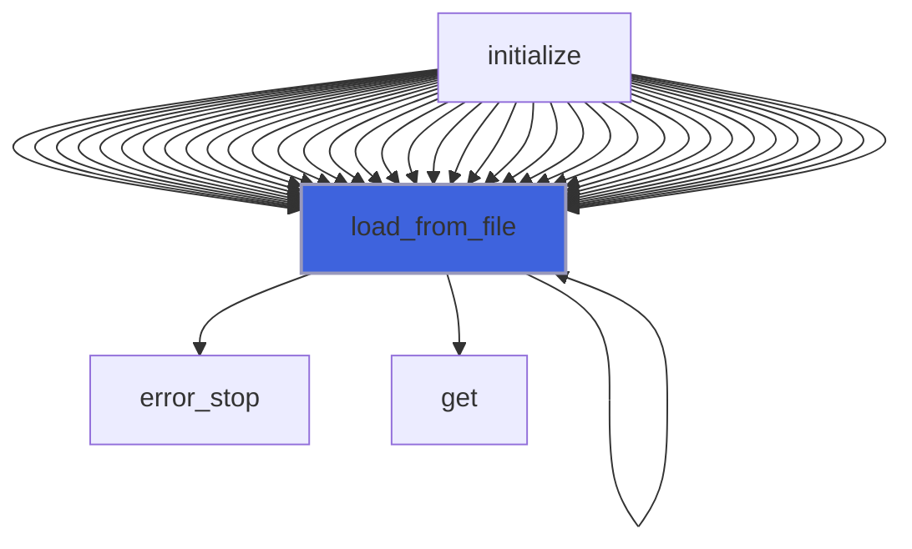

### set_particle_initial_injection

```fortran
subroutine set_particle_initial_injection(self, field, pic, q_pic)
```

**Arguments**

| Name | Type | Intent | Attributes | Description |
|------|------|--------|------------|-------------|
| `self` | class([prism_particle_injection_object](/api/src/app/prism/common/adam_prism_particle_injection_object#prism-particle-injection-object)) | inout |  |  |
| `field` | type([field_object](/api/src/lib/common/adam_field_object#field-object)) | in |  |  |
| `pic` | type([prism_pic_object](/api/src/app/prism/common/adam_prism_pic_object#prism-pic-object)) | inout |  |  |
| `q_pic` | real(kind=[R8P](/api/src/third_party/PENF/src/lib/penf_global_parameters_variables)) | inout |  |  |

**Call graph**

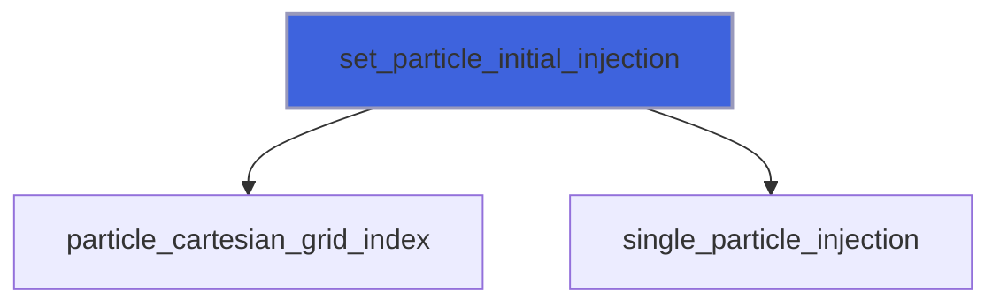

### single_particle_injection

```fortran
subroutine single_particle_injection(self, q_pic)
```

**Arguments**

| Name | Type | Intent | Attributes | Description |
|------|------|--------|------------|-------------|
| `self` | class([prism_particle_injection_object](/api/src/app/prism/common/adam_prism_particle_injection_object#prism-particle-injection-object)) | inout |  |  |
| `q_pic` | real(kind=[R8P](/api/src/third_party/PENF/src/lib/penf_global_parameters_variables)) | inout |  |  |

**Call graph**

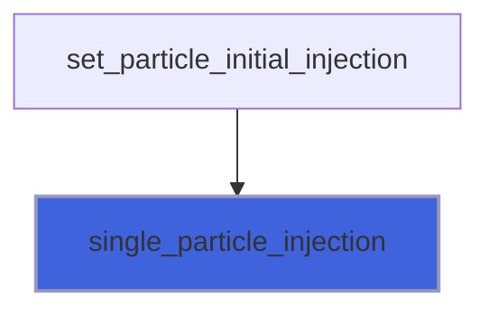

### uniform_domain_space_injection

```fortran
subroutine uniform_domain_space_injection(self, field, pic, q_pic)
```

**Arguments**

| Name | Type | Intent | Attributes | Description |
|------|------|--------|------------|-------------|
| `self` | class([prism_particle_injection_object](/api/src/app/prism/common/adam_prism_particle_injection_object#prism-particle-injection-object)) | inout |  |  |
| `field` | type([field_object](/api/src/lib/common/adam_field_object#field-object)) | in |  |  |
| `pic` | type([prism_pic_object](/api/src/app/prism/common/adam_prism_pic_object#prism-pic-object)) | in |  |  |
| `q_pic` | real(kind=[R8P](/api/src/third_party/PENF/src/lib/penf_global_parameters_variables)) | inout |  |  |

**Call graph**


### uniform_cell_space_injection

```fortran
subroutine uniform_cell_space_injection(self, field, pic, q_pic)
```

**Arguments**

| Name | Type | Intent | Attributes | Description |
|------|------|--------|------------|-------------|
| `self` | class([prism_particle_injection_object](/api/src/app/prism/common/adam_prism_particle_injection_object#prism-particle-injection-object)) | inout |  |  |
| `field` | type([field_object](/api/src/lib/common/adam_field_object#field-object)) | in |  |  |
| `pic` | type([prism_pic_object](/api/src/app/prism/common/adam_prism_pic_object#prism-pic-object)) | in |  |  |
| `q_pic` | real(kind=[R8P](/api/src/third_party/PENF/src/lib/penf_global_parameters_variables)) | inout |  |  |

**Call graph**

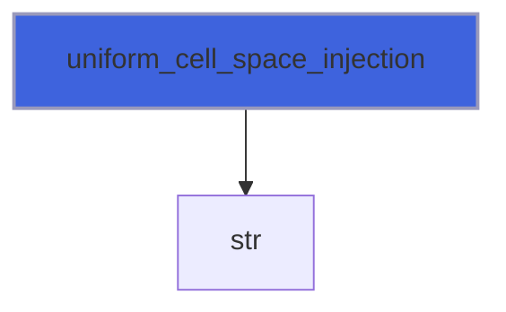

### uniform_maxwellian_velocity_injection

```fortran
subroutine uniform_maxwellian_velocity_injection(self, field, pic, q_pic)
```

**Arguments**

| Name | Type | Intent | Attributes | Description |
|------|------|--------|------------|-------------|
| `self` | class([prism_particle_injection_object](/api/src/app/prism/common/adam_prism_particle_injection_object#prism-particle-injection-object)) | inout |  |  |
| `field` | type([field_object](/api/src/lib/common/adam_field_object#field-object)) | in |  |  |
| `pic` | type([prism_pic_object](/api/src/app/prism/common/adam_prism_pic_object#prism-pic-object)) | in |  |  |
| `q_pic` | real(kind=[R8P](/api/src/third_party/PENF/src/lib/penf_global_parameters_variables)) | inout |  |  |

**Call graph**

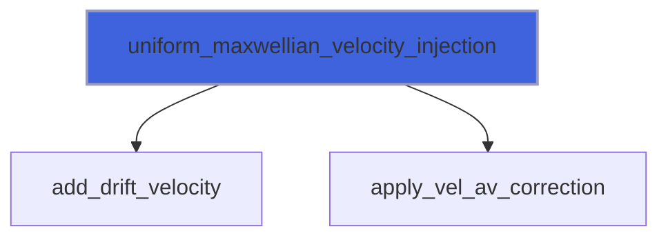

### non_uniform_maxwellian_velocity_injection

```fortran
subroutine non_uniform_maxwellian_velocity_injection(self, field, pic, q_pic)
```

**Arguments**

| Name | Type | Intent | Attributes | Description |
|------|------|--------|------------|-------------|
| `self` | class([prism_particle_injection_object](/api/src/app/prism/common/adam_prism_particle_injection_object#prism-particle-injection-object)) | inout |  |  |
| `field` | type([field_object](/api/src/lib/common/adam_field_object#field-object)) | in |  |  |
| `pic` | type([prism_pic_object](/api/src/app/prism/common/adam_prism_pic_object#prism-pic-object)) | in |  |  |
| `q_pic` | real(kind=[R8P](/api/src/third_party/PENF/src/lib/penf_global_parameters_variables)) | inout |  |  |

**Call graph**

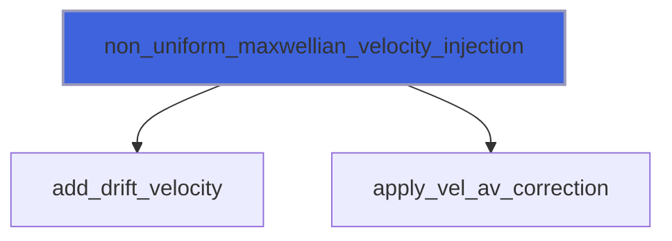

### write_initial_injection_tab

```fortran
subroutine write_initial_injection_tab(filename, q_pic, np)
```

**Arguments**

| Name | Type | Intent | Attributes | Description |
|------|------|--------|------------|-------------|
| `filename` | character(len=*) | in |  |  |
| `q_pic` | real(kind=[R8P](/api/src/third_party/PENF/src/lib/penf_global_parameters_variables)) | in |  |  |
| `np` | integer(kind=[I4P](/api/src/third_party/PENF/src/lib/penf_global_parameters_variables)) | in |  |  |

### random_number_generator

```fortran
subroutine random_number_generator(N, shuffled_list, i_numb, r_n)
```

**Arguments**

| Name | Type | Intent | Attributes | Description |
|------|------|--------|------------|-------------|
| `N` | integer(kind=[I4P](/api/src/third_party/PENF/src/lib/penf_global_parameters_variables)) | in |  |  |
| `shuffled_list` | integer(kind=[I4P](/api/src/third_party/PENF/src/lib/penf_global_parameters_variables)) | inout |  |  |
| `i_numb` | integer(kind=[I4P](/api/src/third_party/PENF/src/lib/penf_global_parameters_variables)) | in |  |  |
| `r_n` | real(kind=[R8P](/api/src/third_party/PENF/src/lib/penf_global_parameters_variables)) | inout |  |  |

### layered_number_generator

```fortran
subroutine layered_number_generator(N, shuffled_list, i_numb, r_n)
```

**Arguments**

| Name | Type | Intent | Attributes | Description |
|------|------|--------|------------|-------------|
| `N` | integer(kind=[I4P](/api/src/third_party/PENF/src/lib/penf_global_parameters_variables)) | in |  |  |
| `shuffled_list` | integer(kind=[I4P](/api/src/third_party/PENF/src/lib/penf_global_parameters_variables)) | inout |  |  |
| `i_numb` | integer(kind=[I4P](/api/src/third_party/PENF/src/lib/penf_global_parameters_variables)) | in |  |  |
| `r_n` | real(kind=[R8P](/api/src/third_party/PENF/src/lib/penf_global_parameters_variables)) | inout |  |  |

**Call graph**

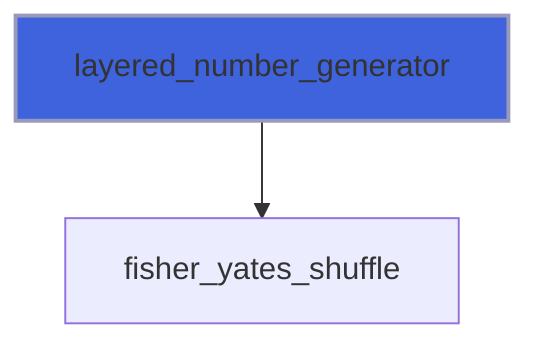

### add_drift_velocity

```fortran
subroutine add_drift_velocity(q_pic, v_drift)
```

**Arguments**

| Name | Type | Intent | Attributes | Description |
|------|------|--------|------------|-------------|
| `q_pic` | real(kind=[R8P](/api/src/third_party/PENF/src/lib/penf_global_parameters_variables)) | inout |  |  |
| `v_drift` | real(kind=[R8P](/api/src/third_party/PENF/src/lib/penf_global_parameters_variables)) | in |  |  |

**Call graph**

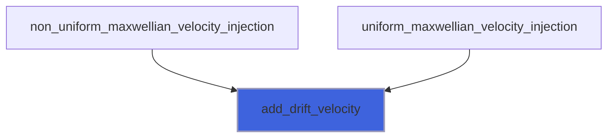

### apply_vel_av_correction

```fortran
subroutine apply_vel_av_correction(q_pic, v_drift)
```

**Arguments**

| Name | Type | Intent | Attributes | Description |
|------|------|--------|------------|-------------|
| `q_pic` | real(kind=[R8P](/api/src/third_party/PENF/src/lib/penf_global_parameters_variables)) | inout |  |  |
| `v_drift` | real(kind=[R8P](/api/src/third_party/PENF/src/lib/penf_global_parameters_variables)) | in |  |  |

**Call graph**

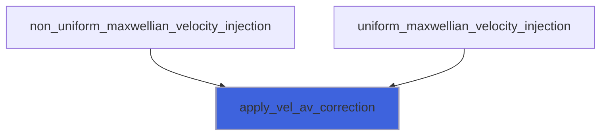

## Functions

### description

Return a pretty-formatted object description.

**Returns**: `character(len=:)`

```fortran
function description(self, pic) result(desc)
```

**Arguments**

| Name | Type | Intent | Attributes | Description |
|------|------|--------|------------|-------------|
| `self` | class([prism_particle_injection_object](/api/src/app/prism/common/adam_prism_particle_injection_object#prism-particle-injection-object)) | in |  | External fields. |
| `pic` | type([prism_pic_object](/api/src/app/prism/common/adam_prism_pic_object#prism-pic-object)) | in |  | PIC object |

**Call graph**

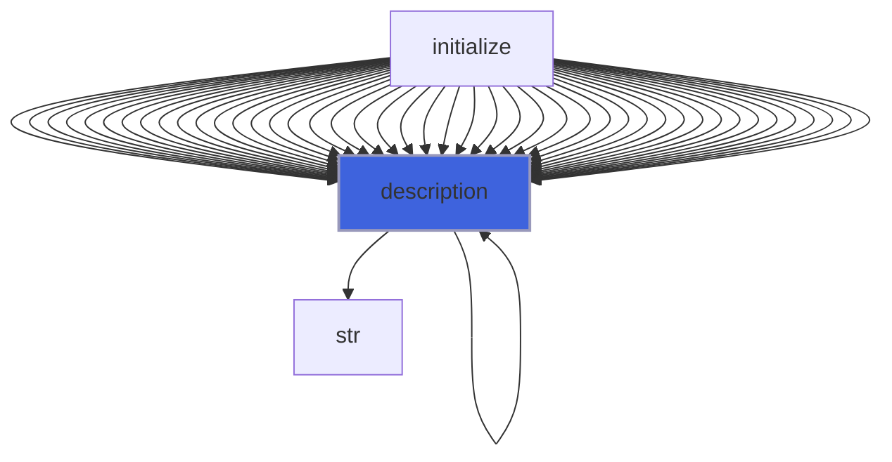

### fisher_yates_shuffle

**Returns**: integer(kind=[I4P](/api/src/third_party/PENF/src/lib/penf_global_parameters_variables))

```fortran
function fisher_yates_shuffle(index_list, nn) result(shuffled_list)
```

**Arguments**

| Name | Type | Intent | Attributes | Description |
|------|------|--------|------------|-------------|
| `index_list` | integer(kind=[I4P](/api/src/third_party/PENF/src/lib/penf_global_parameters_variables)) | in |  |  |
| `nn` | integer(kind=[I4P](/api/src/third_party/PENF/src/lib/penf_global_parameters_variables)) | in |  |  |

**Call graph**

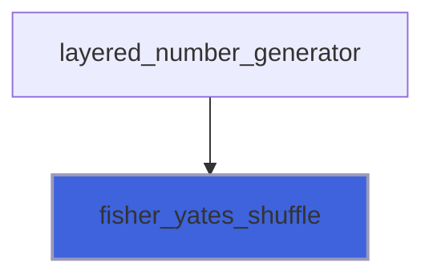
