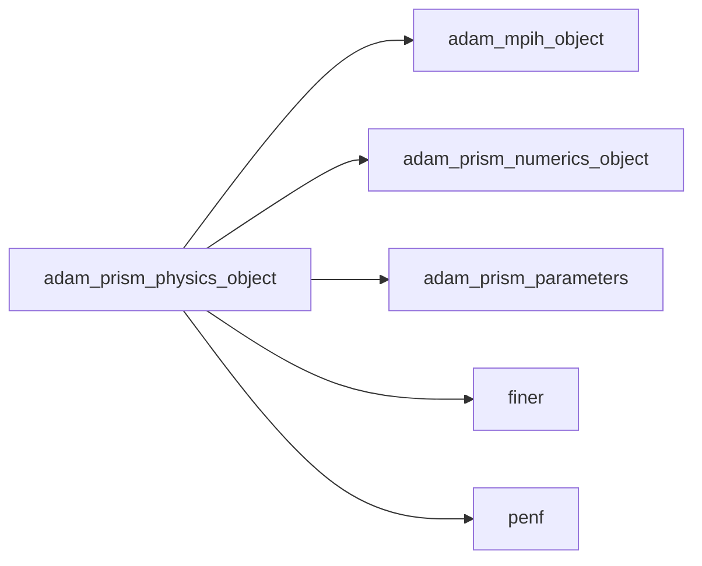
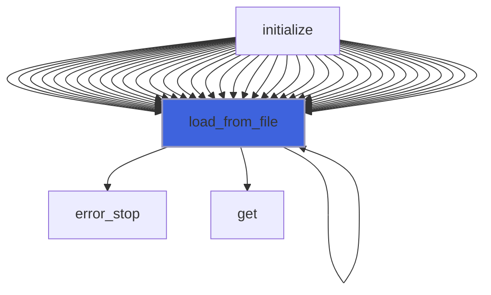
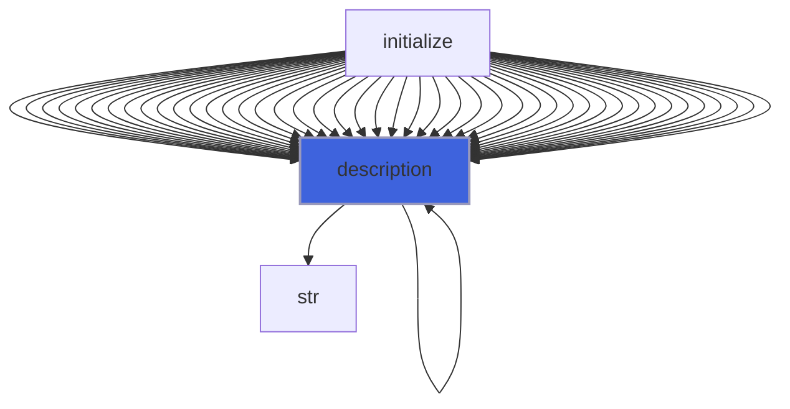

# adam_prism_physics_object

> ADAM, PRISM (Plasma Research usIng Simulation Methods) physics class definition, common backend.

 Field variables are arranged as follows:
```
 q(1): Dx
 q(2): Dy
 q(3): Dz
 q(4): Bx
 q(5): By
 q(6): Bz
 q(7): Jx
 q(8): Jy
 q(9): Jz
```
 Field variables fluxes are:
```
 Fx(1) =  0       Fy(1) = -Bz/muz  Fz(1) =  By/muy
 Fx(2) =  Bz/muz  Fy(2) =  0       Fz(2) = -Bx/mux
 Fx(3) = -By/muy  Fy(3) =  Bx/mux  Fz(3) =  0
 Fx(4) =  0       Fy(4) =  Dz/epsz Fz(4) = -Dy/epsy
 Fx(5) = -Dz/epsz Fy(5) =  0       Fz(5) =  Dx/epsx
 Fx(6) =  Dy/epsy Fy(6) = -Dx/epsx Fz(6) =  0
 Fx(7) =  0       Fy(7) =  0       Fz(7) =  0
 Fx(8) =  0       Fy(8) =  0       Fz(8) =  0
 Fx(9) =  0       Fy(9) =  0       Fz(9) =  0
```

**Source**: `src/app/prism/common/adam_prism_physics_object.F90`

**Dependencies**



## Contents

- [prism_physics_object](#prism-physics-object)
- [initialize](#initialize)
- [load_from_file](#load-from-file)
- [description](#description)

## Variables

| Name | Type | Attributes | Description |
|------|------|------------|-------------|
| `INI_SECTION_NAME` | character(len=7) | parameter | INI file section name containing fluid physics. |
| `EM_PHYSICAL_MODEL` | character(len=15) | parameter | Electromagnetic physical model. |
| `PIC_PHYSICAL_MODEL` | character(len=3) | parameter | PIC physical model. |
| `VAR_DX` | integer(kind=[I4P](/api/src/third_party/PENF/src/lib/penf_global_parameters_variables)) | parameter | Conservative variable 1, Dx. |
| `VAR_DY` | integer(kind=[I4P](/api/src/third_party/PENF/src/lib/penf_global_parameters_variables)) | parameter | Conservative variable 2, Dy. |
| `VAR_DZ` | integer(kind=[I4P](/api/src/third_party/PENF/src/lib/penf_global_parameters_variables)) | parameter | Conservative variable 3, Dz. |
| `VAR_BX` | integer(kind=[I4P](/api/src/third_party/PENF/src/lib/penf_global_parameters_variables)) | parameter | Conservative variable 4, Bx. |
| `VAR_BY` | integer(kind=[I4P](/api/src/third_party/PENF/src/lib/penf_global_parameters_variables)) | parameter | Conservative variable 5, By. |
| `VAR_BZ` | integer(kind=[I4P](/api/src/third_party/PENF/src/lib/penf_global_parameters_variables)) | parameter | Conservative variable 6, Bz. |

## Derived Types

### prism_physics_object

PRISM physics class definition.

#### Components

| Name | Type | Attributes | Description |
|------|------|------------|-------------|
| `mpih` | type([mpih_object](/api/src/third_party/FUNDAL/src/lib/fundal_mpih_object#mpih-object)) |  | MPI handler. |
| `physical_model` | character(len=99) |  | Physical model. |
| `nv` | integer(kind=[I4P](/api/src/third_party/PENF/src/lib/penf_global_parameters_variables)) |  | Number of variables in q vector (nv=nv_c+nv_s+nv_cl). |
| `nv_c` | integer(kind=[I4P](/api/src/third_party/PENF/src/lib/penf_global_parameters_variables)) |  | Number of conservative variables in q vector. |
| `nv_s` | integer(kind=[I4P](/api/src/third_party/PENF/src/lib/penf_global_parameters_variables)) |  | Number of source variables in q vector. |
| `nv_cl` | integer(kind=[I4P](/api/src/third_party/PENF/src/lib/penf_global_parameters_variables)) |  | Number of divergence cleaning variables in q vector. |
| `nv_pic` | integer(kind=[I4P](/api/src/third_party/PENF/src/lib/penf_global_parameters_variables)) |  | Number of PIC variables in q vector. |
| `var_Jx` | integer(kind=[I4P](/api/src/third_party/PENF/src/lib/penf_global_parameters_variables)) |  | Indices of current density components in q vector. |
| `var_Jy` | integer(kind=[I4P](/api/src/third_party/PENF/src/lib/penf_global_parameters_variables)) |  | Indices of current density components in q vector. |
| `var_Jz` | integer(kind=[I4P](/api/src/third_party/PENF/src/lib/penf_global_parameters_variables)) |  | Indices of current density components in q vector. |
| `chi` | real(kind=[R8P](/api/src/third_party/PENF/src/lib/penf_global_parameters_variables)) |  | Speed coefficient for D & B div-cleaning. |
| `evmax` | real(kind=[R8P](/api/src/third_party/PENF/src/lib/penf_global_parameters_variables)) |  | Maximum signal speed (eigenvalue). |
| `erw` | real(kind=[R8P](/api/src/third_party/PENF/src/lib/penf_global_parameters_variables)) | pointer | Right eigenvectors for high order reconstruction. |
| `elw` | real(kind=[R8P](/api/src/third_party/PENF/src/lib/penf_global_parameters_variables)) | pointer | Left  eigenvectors for high order reconstruction. |
| `EV_D` | real(kind=[R8P](/api/src/third_party/PENF/src/lib/penf_global_parameters_variables)) |  | Eigenvalues with D divergence cleaning. |
| `EV_B` | real(kind=[R8P](/api/src/third_party/PENF/src/lib/penf_global_parameters_variables)) |  | Eigenvalues with B divergence cleaning. |
| `EV_D_B` | real(kind=[R8P](/api/src/third_party/PENF/src/lib/penf_global_parameters_variables)) |  | Eigenvalues with D and B divergence cleaning. |
| `ER_D` | real(kind=[R8P](/api/src/third_party/PENF/src/lib/penf_global_parameters_variables)) |  | Right eigenvectors with D divergence cleaning. |
| `ER_B` | real(kind=[R8P](/api/src/third_party/PENF/src/lib/penf_global_parameters_variables)) |  | Right eigenvectors with B divergence cleaning. |
| `ER_D_B` | real(kind=[R8P](/api/src/third_party/PENF/src/lib/penf_global_parameters_variables)) |  | Right eigenvectors with D and B divergence cleaning. |
| `EL_D` | real(kind=[R8P](/api/src/third_party/PENF/src/lib/penf_global_parameters_variables)) |  | Left eigenvectors with D divergence cleaning. |
| `EL_B` | real(kind=[R8P](/api/src/third_party/PENF/src/lib/penf_global_parameters_variables)) |  | Left eigenvectors with B divergence cleaning. |
| `EL_D_B` | real(kind=[R8P](/api/src/third_party/PENF/src/lib/penf_global_parameters_variables)) |  | Left eigenvectors with D and B divergence cleaning. |

#### Type-Bound Procedures

| Name | Attributes | Description |
|------|------------|-------------|
| `description` | pass(self) | Return pretty-printed object description. |
| `initialize` | pass(self) | Initialize physics. |
| `load_from_file` | pass(self) | Load config from file. |

## Subroutines

### initialize

Initialize the equation.

```fortran
subroutine initialize(self, file_parameters, reconstruction_vars, div_corr_var, constrained_transport_D, constrained_transport_B)
```

**Arguments**

| Name | Type | Intent | Attributes | Description |
|------|------|--------|------------|-------------|
| `self` | class([prism_physics_object](/api/src/app/prism/common/adam_prism_physics_object#prism-physics-object)) | inout | target | Physics. |
| `file_parameters` | type([file_ini](/api/src/third_party/FiNeR/src/lib/finer_file_ini_t#file-ini)) | in |  | Simulation parameters ini file handler. |
| `reconstruction_vars` | character(len=*) | in | optional | Variables used for HO reconstruction. |
| `div_corr_var` | character(len=*) | in | optional | Type of divergence correction variables |
| `constrained_transport_D` | logical | in | optional | Enable CT-Correction on D. |
| `constrained_transport_B` | logical | in | optional | Enable CT-Correction on B. |

**Call graph**



```mermaid
flowchart TD
  add_node["add_node"] --> initialize["initialize"]
  analize["analize"] --> initialize["initialize"]
  build_connectivity["build_connectivity"] --> initialize["initialize"]
  distribute_facets["distribute_facets"] --> initialize["initialize"]
  distribute_facets_tree["distribute_facets_tree"] --> initialize["initialize"]
  export_vtk_file["export_vtk_file"] --> initialize["initialize"]
  initialize["initialize"] --> initialize["initialize"]
  initialize["initialize"] --> initialize["initialize"]
  initialize["initialize"] --> initialize["initialize"]
  initialize["initialize"] --> initialize["initialize"]
  initialize["initialize"] --> initialize["initialize"]
  initialize["initialize"] --> initialize["initialize"]
  initialize["initialize"] --> initialize["initialize"]
  initialize["initialize"] --> initialize["initialize"]
  initialize["initialize"] --> initialize["initialize"]
  initialize["initialize"] --> initialize["initialize"]
  initialize["initialize"] --> initialize["initialize"]
  initialize["initialize"] --> initialize["initialize"]
  initialize["initialize"] --> initialize["initialize"]
  initialize["initialize"] --> initialize["initialize"]
  initialize["initialize"] --> initialize["initialize"]
  initialize["initialize"] --> initialize["initialize"]
  initialize["initialize"] --> initialize["initialize"]
  initialize["initialize"] --> initialize["initialize"]
  initialize["initialize"] --> initialize["initialize"]
  initialize["initialize"] --> initialize["initialize"]
  initialize["initialize"] --> initialize["initialize"]
  initialize["initialize"] --> initialize["initialize"]
  initialize["initialize"] --> initialize["initialize"]
  initialize["initialize"] --> initialize["initialize"]
  initialize["initialize"] --> initialize["initialize"]
  initialize["initialize"] --> initialize["initialize"]
  initialize["initialize"] --> initialize["initialize"]
  initialize["initialize"] --> initialize["initialize"]
  initialize["initialize"] --> initialize["initialize"]
  initialize["initialize"] --> initialize["initialize"]
  initialize["initialize"] --> initialize["initialize"]
  initialize["initialize"] --> initialize["initialize"]
  initialize["initialize"] --> initialize["initialize"]
  initialize["initialize"] --> initialize["initialize"]
  initialize["initialize"] --> initialize["initialize"]
  initialize["initialize"] --> initialize["initialize"]
  initialize["initialize"] --> initialize["initialize"]
  initialize["initialize"] --> initialize["initialize"]
  initialize["initialize"] --> initialize["initialize"]
  initialize["initialize"] --> initialize["initialize"]
  initialize["initialize"] --> initialize["initialize"]
  initialize["initialize"] --> initialize["initialize"]
  initialize["initialize"] --> initialize["initialize"]
  initialize["initialize"] --> initialize["initialize"]
  initialize["initialize"] --> initialize["initialize"]
  initialize["initialize"] --> initialize["initialize"]
  initialize["initialize"] --> initialize["initialize"]
  initialize["initialize"] --> initialize["initialize"]
  initialize["initialize"] --> initialize["initialize"]
  initialize["initialize"] --> initialize["initialize"]
  initialize["initialize"] --> initialize["initialize"]
  initialize["initialize"] --> initialize["initialize"]
  initialize["initialize"] --> initialize["initialize"]
  initialize["initialize"] --> initialize["initialize"]
  initialize["initialize"] --> initialize["initialize"]
  initialize["initialize"] --> initialize["initialize"]
  initialize["initialize"] --> initialize["initialize"]
  initialize["initialize"] --> initialize["initialize"]
  initialize["initialize"] --> initialize["initialize"]
  initialize["initialize"] --> initialize["initialize"]
  initialize["initialize"] --> initialize["initialize"]
  initialize["initialize"] --> initialize["initialize"]
  initialize["initialize"] --> initialize["initialize"]
  initialize["initialize"] --> initialize["initialize"]
  initialize["initialize"] --> initialize["initialize"]
  initialize["initialize"] --> initialize["initialize"]
  initialize["initialize"] --> initialize["initialize"]
  initialize["initialize"] --> initialize["initialize"]
  initialize["initialize"] --> initialize["initialize"]
  initialize["initialize"] --> initialize["initialize"]
  initialize["initialize"] --> initialize["initialize"]
  initialize["initialize"] --> initialize["initialize"]
  initialize_common["initialize_common"] --> initialize["initialize"]
  initialize_common["initialize_common"] --> initialize["initialize"]
  initialize_common["initialize_common"] --> initialize["initialize"]
  initialize_common["initialize_common"] --> initialize["initialize"]
  load_from_file["load_from_file"] --> initialize["initialize"]
  load_from_file["load_from_file"] --> initialize["initialize"]
  open_file["open_file"] --> initialize["initialize"]
  open_file["open_file"] --> initialize["initialize"]
  open_file["open_file"] --> initialize["initialize"]
  resize["resize"] --> initialize["initialize"]
  save_into_file["save_into_file"] --> initialize["initialize"]
  save_vtk["save_vtk"] --> initialize["initialize"]
  simulate["simulate"] --> initialize["initialize"]
  simulate["simulate"] --> initialize["initialize"]
  simulate["simulate"] --> initialize["initialize"]
  simulate["simulate"] --> initialize["initialize"]
  simulate["simulate"] --> initialize["initialize"]
  simulate["simulate"] --> initialize["initialize"]
  simulate["simulate"] --> initialize["initialize"]
  test_stress["test_stress"] --> initialize["initialize"]
  initialize["initialize"] --> description["description"]
  initialize["initialize"] --> initialize["initialize"]
  initialize["initialize"] --> load_from_file["load_from_file"]
  initialize["initialize"] --> print_message["print_message"]
  style initialize fill:#3e63dd,stroke:#99b,stroke-width:2px
```

### load_from_file

Load config from file.

```fortran
subroutine load_from_file(self, file_parameters, go_on_fail, div_corr_var)
```

**Arguments**

| Name | Type | Intent | Attributes | Description |
|------|------|--------|------------|-------------|
| `self` | class([prism_physics_object](/api/src/app/prism/common/adam_prism_physics_object#prism-physics-object)) | inout |  | Physics. |
| `file_parameters` | type([file_ini](/api/src/third_party/FiNeR/src/lib/finer_file_ini_t#file-ini)) | in |  | Simulation parameters ini file handler. |
| `go_on_fail` | logical | in | optional | Go on if load fails. |
| `div_corr_var` | character(len=*) | in | optional | Type of divergence correction variables (poisson, hyperbolic,...). |

**Call graph**



## Functions

### description

Return a pretty-formatted object description.

**Attributes**: pure

**Returns**: `character(len=:)`

```fortran
function description(self) result(desc)
```

**Arguments**

| Name | Type | Intent | Attributes | Description |
|------|------|--------|------------|-------------|
| `self` | class([prism_physics_object](/api/src/app/prism/common/adam_prism_physics_object#prism-physics-object)) | in |  | Physics. |

**Call graph**


