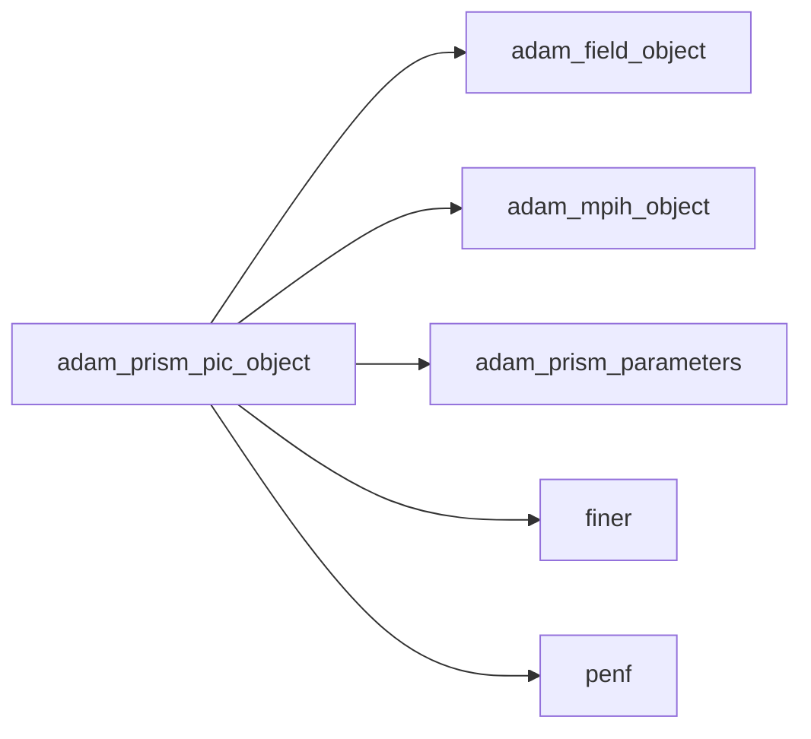
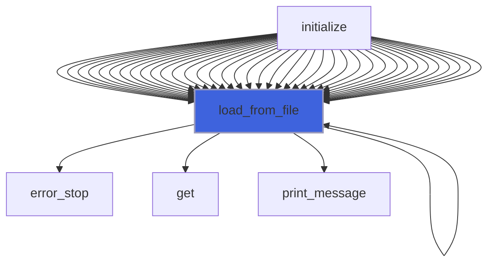
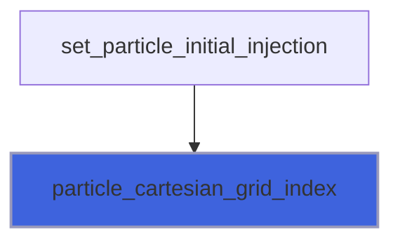
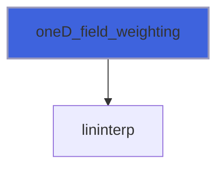
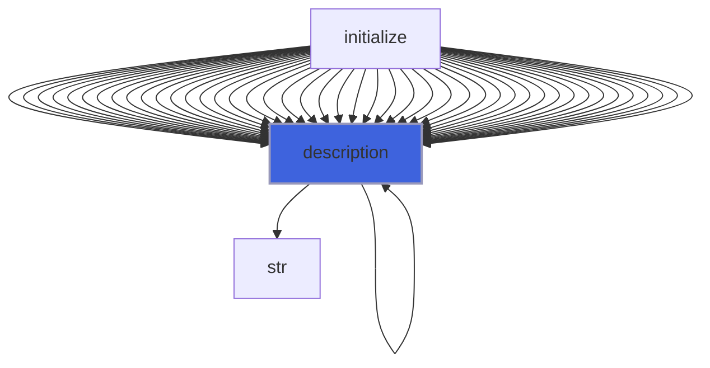
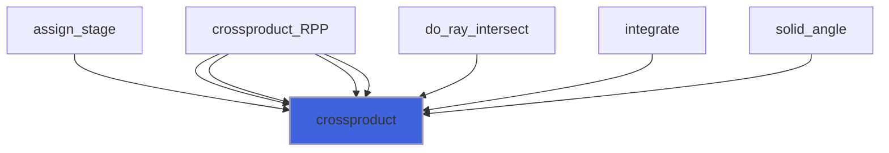
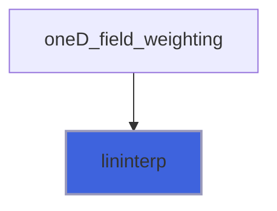

# adam_prism_pic_object

> ADAM, PRISM Particle-in-Cell class definition, CPU backend.

**Source**: `src/app/prism/common/adam_prism_pic_object.F90`

**Dependencies**



## Contents

- [prism_pic_object](#prism-pic-object)
- [particle_weighting_interface](#particle-weighting-interface)
- [current_weighting_interface](#current-weighting-interface)
- [field_weighting_interface](#field-weighting-interface)
- [initialize](#initialize)
- [load_from_file](#load-from-file)
- [particle_cartesian_grid_index](#particle-cartesian-grid-index)
- [NGP_charge_weighting](#ngp-charge-weighting)
- [CIC_charge_weighting](#cic-charge-weighting)
- [TSC_charge_weighting](#tsc-charge-weighting)
- [NGP_current_weighting](#ngp-current-weighting)
- [CIC_current_weighting](#cic-current-weighting)
- [TSC_current_weighting](#tsc-current-weighting)
- [zeroD_field_weighting](#zerod-field-weighting)
- [oneD_field_weighting](#oned-field-weighting)
- [description](#description)
- [crossproduct](#crossproduct)
- [lininterp](#lininterp)

## Variables

| Name | Type | Attributes | Description |
|------|------|------------|-------------|
| `INI_SECTION_NAME` | character(len=3) | parameter | INI file section name for PIC configuration. |
| `PLASMA_TYPE_PROBLEM` | character(len=6) | parameter | Analyzing physical problem involving the presence of plasma |
| `SINGLE_PARTICLE_TYPE_PROBLEM` | character(len=15) | parameter | Analyzing physical problem involving the presence of a single particle |
| `CIC_WEIGHTING_MODEL` | character(len=3) | parameter | CIC weighting model. |
| `NGP_WEIGHTING_MODEL` | character(len=3) | parameter | NGP weighting model. |
| `TSC_WEIGHTING_MODEL` | character(len=3) | parameter | TSC weighting model. |
| `ZEROD_FIELDS_WEIGHTING_MODEL` | character(len=2) | parameter | 0D field weighting. |
| `ONED_FIELDS_WEIGHTING_MODEL` | character(len=2) | parameter | 1D field weighting. |
| `NUM_SCHEME_TIME_PIC_LEAPFROG` | character(len=8) | parameter | Leapfrog numerical scheme for time operator. |
| `NUM_SCHEME_TIME_PIC_RUNGE_KUTTA` | character(len=11) | parameter | Runge-Kutta numerical scheme for time operator. |

## Derived Types

### prism_pic_object

#### Components

| Name | Type | Attributes | Description |
|------|------|------------|-------------|
| `mpih` | type([mpih_object](/api/src/lib/common/adam_mpih_object#mpih-object)) |  | MPI handler. |
| `plasma_density` | real(kind=[R8P](/api/src/third_party/PENF/src/lib/penf_global_parameters_variables)) |  | Plasma density |
| `neutral_fraction` | real(kind=[R8P](/api/src/third_party/PENF/src/lib/penf_global_parameters_variables)) |  | Neutral fraction |
| `particle_number` | integer(kind=[I4P](/api/src/third_party/PENF/src/lib/penf_global_parameters_variables)) |  | Total number of particles. |
| `n_ions` | integer(kind=[I4P](/api/src/third_party/PENF/src/lib/penf_global_parameters_variables)) |  | Total ions number |
| `n_electrons` | integer(kind=[I4P](/api/src/third_party/PENF/src/lib/penf_global_parameters_variables)) |  | Total electrons number |
| `n_neutrals` | integer(kind=[I4P](/api/src/third_party/PENF/src/lib/penf_global_parameters_variables)) |  | Total neutrals number |
| `neighbour_list` | integer(kind=[I4P](/api/src/third_party/PENF/src/lib/penf_global_parameters_variables)) | allocatable | Particle grid positions array. |
| `problem_type` | character(len=99) |  | Type of problem analyzed |
| `particle_weighting_model` | character(len=99) |  | Particle weighting model. |
| `current_weighting_model` | character(len=99) |  | Current weighting model. |
| `field_weighting_model` | character(len=99) |  | Field weighting model. |
| `scheme_time` | character(len=99) |  | Numerical scheme for time operator [runge_kutta, leapfrog,...]. |
| `particle_weighting` | procedure(particle_weighting_interface) | pass(self), pointer | Particle weighting. |
| `current_weighting` | procedure(current_weighting_interface) | pass(self), pointer | Current weighting. |
| `field_weighting` | procedure(field_weighting_interface) | pass(self), pointer | field weighting. |

#### Type-Bound Procedures

| Name | Attributes | Description |
|------|------------|-------------|
| `description` | pass(self) | Return pretty-printed object description. |
| `initialize` | pass(self) | Initialize IC. |
| `load_from_file` | pass(self) | Load config from file. |
| `particle_cartesian_grid_index` | pass(self) | Compute the grid index corresponding to a particle position. |
| `CIC_charge_weighting` | pass(self) | Cloud-in-Cell weighting of particle quantities to the grid. |
| `NGP_charge_weighting` | pass(self) | Nearest Grid Point weighting of particle quantities to the grid. |
| `TSC_charge_weighting` | pass(self) | Triangular Shaped Cloud weighting of particle quantities to the grid. |
| `CIC_current_weighting` | pass(self) | Cloud-in-Cell weighting of particle quantities to the grid. |
| `NGP_current_weighting` | pass(self) | Nearest Grid Point weighting of particle quantities to the grid. |
| `TSC_current_weighting` | pass(self) | Triangular Shaped Cloud weighting of particle quantities to the grid. |
| `zeroD_field_weighting` | pass(self) |  |
| `oneD_field_weighting` | pass(self) |  |

## Interfaces

### particle_weighting_interface

### current_weighting_interface

### field_weighting_interface

## Subroutines

### initialize

Initialize PIC.

```fortran
subroutine initialize(self, file_parameters, field)
```

**Arguments**

| Name | Type | Intent | Attributes | Description |
|------|------|--------|------------|-------------|
| `self` | class([prism_pic_object](/api/src/app/prism/common/adam_prism_pic_object#prism-pic-object)) | inout |  | Pic object. |
| `file_parameters` | type([file_ini](/api/src/third_party/FiNeR/src/lib/finer_file_ini_t#file-ini)) | in |  | Simulation parameters ini file handler. |
| `field` | type([field_object](/api/src/lib/common/adam_field_object#field-object)) | in |  | Field object |

**Call graph**



```mermaid
flowchart TD
  add_node["add_node"] --> initialize["initialize"]
  analize["analize"] --> initialize["initialize"]
  build_connectivity["build_connectivity"] --> initialize["initialize"]
  distribute_facets["distribute_facets"] --> initialize["initialize"]
  distribute_facets_tree["distribute_facets_tree"] --> initialize["initialize"]
  export_vtk_file["export_vtk_file"] --> initialize["initialize"]
  initialize["initialize"] --> initialize["initialize"]
  initialize["initialize"] --> initialize["initialize"]
  initialize["initialize"] --> initialize["initialize"]
  initialize["initialize"] --> initialize["initialize"]
  initialize["initialize"] --> initialize["initialize"]
  initialize["initialize"] --> initialize["initialize"]
  initialize["initialize"] --> initialize["initialize"]
  initialize["initialize"] --> initialize["initialize"]
  initialize["initialize"] --> initialize["initialize"]
  initialize["initialize"] --> initialize["initialize"]
  initialize["initialize"] --> initialize["initialize"]
  initialize["initialize"] --> initialize["initialize"]
  initialize["initialize"] --> initialize["initialize"]
  initialize["initialize"] --> initialize["initialize"]
  initialize["initialize"] --> initialize["initialize"]
  initialize["initialize"] --> initialize["initialize"]
  initialize["initialize"] --> initialize["initialize"]
  initialize["initialize"] --> initialize["initialize"]
  initialize["initialize"] --> initialize["initialize"]
  initialize["initialize"] --> initialize["initialize"]
  initialize["initialize"] --> initialize["initialize"]
  initialize["initialize"] --> initialize["initialize"]
  initialize["initialize"] --> initialize["initialize"]
  initialize["initialize"] --> initialize["initialize"]
  initialize["initialize"] --> initialize["initialize"]
  initialize["initialize"] --> initialize["initialize"]
  initialize["initialize"] --> initialize["initialize"]
  initialize["initialize"] --> initialize["initialize"]
  initialize["initialize"] --> initialize["initialize"]
  initialize["initialize"] --> initialize["initialize"]
  initialize["initialize"] --> initialize["initialize"]
  initialize["initialize"] --> initialize["initialize"]
  initialize["initialize"] --> initialize["initialize"]
  initialize["initialize"] --> initialize["initialize"]
  initialize["initialize"] --> initialize["initialize"]
  initialize["initialize"] --> initialize["initialize"]
  initialize["initialize"] --> initialize["initialize"]
  initialize["initialize"] --> initialize["initialize"]
  initialize["initialize"] --> initialize["initialize"]
  initialize["initialize"] --> initialize["initialize"]
  initialize["initialize"] --> initialize["initialize"]
  initialize["initialize"] --> initialize["initialize"]
  initialize["initialize"] --> initialize["initialize"]
  initialize["initialize"] --> initialize["initialize"]
  initialize["initialize"] --> initialize["initialize"]
  initialize["initialize"] --> initialize["initialize"]
  initialize["initialize"] --> initialize["initialize"]
  initialize["initialize"] --> initialize["initialize"]
  initialize["initialize"] --> initialize["initialize"]
  initialize["initialize"] --> initialize["initialize"]
  initialize["initialize"] --> initialize["initialize"]
  initialize["initialize"] --> initialize["initialize"]
  initialize["initialize"] --> initialize["initialize"]
  initialize["initialize"] --> initialize["initialize"]
  initialize["initialize"] --> initialize["initialize"]
  initialize["initialize"] --> initialize["initialize"]
  initialize["initialize"] --> initialize["initialize"]
  initialize["initialize"] --> initialize["initialize"]
  initialize["initialize"] --> initialize["initialize"]
  initialize["initialize"] --> initialize["initialize"]
  initialize["initialize"] --> initialize["initialize"]
  initialize["initialize"] --> initialize["initialize"]
  initialize["initialize"] --> initialize["initialize"]
  initialize["initialize"] --> initialize["initialize"]
  initialize["initialize"] --> initialize["initialize"]
  initialize["initialize"] --> initialize["initialize"]
  initialize["initialize"] --> initialize["initialize"]
  initialize["initialize"] --> initialize["initialize"]
  initialize["initialize"] --> initialize["initialize"]
  initialize["initialize"] --> initialize["initialize"]
  initialize["initialize"] --> initialize["initialize"]
  initialize["initialize"] --> initialize["initialize"]
  initialize_common["initialize_common"] --> initialize["initialize"]
  initialize_common["initialize_common"] --> initialize["initialize"]
  initialize_common["initialize_common"] --> initialize["initialize"]
  initialize_common["initialize_common"] --> initialize["initialize"]
  load_from_file["load_from_file"] --> initialize["initialize"]
  load_from_file["load_from_file"] --> initialize["initialize"]
  open_file["open_file"] --> initialize["initialize"]
  open_file["open_file"] --> initialize["initialize"]
  open_file["open_file"] --> initialize["initialize"]
  resize["resize"] --> initialize["initialize"]
  save_into_file["save_into_file"] --> initialize["initialize"]
  save_vtk["save_vtk"] --> initialize["initialize"]
  simulate["simulate"] --> initialize["initialize"]
  simulate["simulate"] --> initialize["initialize"]
  simulate["simulate"] --> initialize["initialize"]
  simulate["simulate"] --> initialize["initialize"]
  simulate["simulate"] --> initialize["initialize"]
  simulate["simulate"] --> initialize["initialize"]
  simulate["simulate"] --> initialize["initialize"]
  test_stress["test_stress"] --> initialize["initialize"]
  initialize["initialize"] --> description["description"]
  initialize["initialize"] --> error_stop["error_stop"]
  initialize["initialize"] --> initialize["initialize"]
  initialize["initialize"] --> load_from_file["load_from_file"]
  style initialize fill:#3e63dd,stroke:#99b,stroke-width:2px
```

### load_from_file

Load PIC configuration from file.

```fortran
subroutine load_from_file(self, file_parameters, go_on_fail)
```

**Arguments**

| Name | Type | Intent | Attributes | Description |
|------|------|--------|------------|-------------|
| `self` | class([prism_pic_object](/api/src/app/prism/common/adam_prism_pic_object#prism-pic-object)) | inout |  | PIC object. |
| `file_parameters` | type([file_ini](/api/src/third_party/FiNeR/src/lib/finer_file_ini_t#file-ini)) | in |  | File handler. |
| `go_on_fail` | logical | in | optional | Go on if load fails. |

**Call graph**



### particle_cartesian_grid_index

Compute the grid index corresponding to a particle position. Good for cartesian grids only.

```fortran
subroutine particle_cartesian_grid_index(self, field, q_pic)
```

**Arguments**

| Name | Type | Intent | Attributes | Description |
|------|------|--------|------------|-------------|
| `self` | class([prism_pic_object](/api/src/app/prism/common/adam_prism_pic_object#prism-pic-object)) | inout |  | External fields. |
| `field` | type([field_object](/api/src/lib/common/adam_field_object#field-object)) | in |  | The field. |
| `q_pic` | real(kind=[R8P](/api/src/third_party/PENF/src/lib/penf_global_parameters_variables)) | in |  | PIC variables. |

**Call graph**



### NGP_charge_weighting

```fortran
subroutine NGP_charge_weighting(self, field, q, q_pic, nv)
```

**Arguments**

| Name | Type | Intent | Attributes | Description |
|------|------|--------|------------|-------------|
| `self` | class([prism_pic_object](/api/src/app/prism/common/adam_prism_pic_object#prism-pic-object)) | inout |  | External fields. |
| `field` | type([field_object](/api/src/lib/common/adam_field_object#field-object)) | inout |  | The field. |
| `q` | real(kind=[R8P](/api/src/third_party/PENF/src/lib/penf_global_parameters_variables)) | inout |  | Field variables. |
| `q_pic` | real(kind=[R8P](/api/src/third_party/PENF/src/lib/penf_global_parameters_variables)) | in |  | PIC variables. |
| `nv` | integer(kind=[I4P](/api/src/third_party/PENF/src/lib/penf_global_parameters_variables)) | in |  | Number of variables. |

### CIC_charge_weighting

Cloud-in-Cell weighting of particle quantities to the grid.

```fortran
subroutine CIC_charge_weighting(self, field, q, q_PIC, nv)
```

**Arguments**

| Name | Type | Intent | Attributes | Description |
|------|------|--------|------------|-------------|
| `self` | class([prism_pic_object](/api/src/app/prism/common/adam_prism_pic_object#prism-pic-object)) | inout |  | External fields. |
| `field` | type([field_object](/api/src/lib/common/adam_field_object#field-object)) | inout |  | The field. |
| `q` | real(kind=[R8P](/api/src/third_party/PENF/src/lib/penf_global_parameters_variables)) | inout |  | Field variables. |
| `q_PIC` | real(kind=[R8P](/api/src/third_party/PENF/src/lib/penf_global_parameters_variables)) | in |  | PIC variables. |
| `nv` | integer(kind=[I4P](/api/src/third_party/PENF/src/lib/penf_global_parameters_variables)) | in |  | Number of variables. |

### TSC_charge_weighting

```fortran
subroutine TSC_charge_weighting(self, field, q, q_pic, nv)
```

**Arguments**

| Name | Type | Intent | Attributes | Description |
|------|------|--------|------------|-------------|
| `self` | class([prism_pic_object](/api/src/app/prism/common/adam_prism_pic_object#prism-pic-object)) | inout |  | External fields. |
| `field` | type([field_object](/api/src/lib/common/adam_field_object#field-object)) | inout |  | The field. |
| `q` | real(kind=[R8P](/api/src/third_party/PENF/src/lib/penf_global_parameters_variables)) | inout |  | Field variables. |
| `q_pic` | real(kind=[R8P](/api/src/third_party/PENF/src/lib/penf_global_parameters_variables)) | in |  | PIC variables. |
| `nv` | integer(kind=[I4P](/api/src/third_party/PENF/src/lib/penf_global_parameters_variables)) | in |  | Number of variables. |

### NGP_current_weighting

```fortran
subroutine NGP_current_weighting(self, field, q, q_pic, nv)
```

**Arguments**

| Name | Type | Intent | Attributes | Description |
|------|------|--------|------------|-------------|
| `self` | class([prism_pic_object](/api/src/app/prism/common/adam_prism_pic_object#prism-pic-object)) | inout |  | External fields. |
| `field` | type([field_object](/api/src/lib/common/adam_field_object#field-object)) | inout |  | The field. |
| `q` | real(kind=[R8P](/api/src/third_party/PENF/src/lib/penf_global_parameters_variables)) | inout |  | Field variables. |
| `q_pic` | real(kind=[R8P](/api/src/third_party/PENF/src/lib/penf_global_parameters_variables)) | in |  | PIC variables. |
| `nv` | integer(kind=[I4P](/api/src/third_party/PENF/src/lib/penf_global_parameters_variables)) | in |  | Number of variables. |

### CIC_current_weighting

Cloud-in-Cell weighting of particle quantities to the grid.

```fortran
subroutine CIC_current_weighting(self, field, q, q_pic, nv)
```

**Arguments**

| Name | Type | Intent | Attributes | Description |
|------|------|--------|------------|-------------|
| `self` | class([prism_pic_object](/api/src/app/prism/common/adam_prism_pic_object#prism-pic-object)) | inout |  | External fields. |
| `field` | type([field_object](/api/src/lib/common/adam_field_object#field-object)) | inout |  | The field. |
| `q` | real(kind=[R8P](/api/src/third_party/PENF/src/lib/penf_global_parameters_variables)) | inout |  | Field variables. |
| `q_pic` | real(kind=[R8P](/api/src/third_party/PENF/src/lib/penf_global_parameters_variables)) | in |  | PIC variables. |
| `nv` | integer(kind=[I4P](/api/src/third_party/PENF/src/lib/penf_global_parameters_variables)) | in |  | Number of variables. |

### TSC_current_weighting

```fortran
subroutine TSC_current_weighting(self, field, q, q_pic, nv)
```

**Arguments**

| Name | Type | Intent | Attributes | Description |
|------|------|--------|------------|-------------|
| `self` | class([prism_pic_object](/api/src/app/prism/common/adam_prism_pic_object#prism-pic-object)) | inout |  | External fields. |
| `field` | type([field_object](/api/src/lib/common/adam_field_object#field-object)) | inout |  | The field. |
| `q` | real(kind=[R8P](/api/src/third_party/PENF/src/lib/penf_global_parameters_variables)) | inout |  | Field variables. |
| `q_pic` | real(kind=[R8P](/api/src/third_party/PENF/src/lib/penf_global_parameters_variables)) | in |  | PIC variables. |
| `nv` | integer(kind=[I4P](/api/src/third_party/PENF/src/lib/penf_global_parameters_variables)) | in |  | Number of variables. |

### zeroD_field_weighting

```fortran
subroutine zeroD_field_weighting(self, field, pic_fields, q, q_pic, nv)
```

**Arguments**

| Name | Type | Intent | Attributes | Description |
|------|------|--------|------------|-------------|
| `self` | class([prism_pic_object](/api/src/app/prism/common/adam_prism_pic_object#prism-pic-object)) | inout |  | External fields. |
| `field` | type([field_object](/api/src/lib/common/adam_field_object#field-object)) | inout |  | The field. |
| `pic_fields` | real(kind=[R8P](/api/src/third_party/PENF/src/lib/penf_global_parameters_variables)) | inout |  | Fields value at particle locations |
| `q` | real(kind=[R8P](/api/src/third_party/PENF/src/lib/penf_global_parameters_variables)) | in |  | Field variables. |
| `q_pic` | real(kind=[R8P](/api/src/third_party/PENF/src/lib/penf_global_parameters_variables)) | in |  | PIC variables. |
| `nv` | integer(kind=[I4P](/api/src/third_party/PENF/src/lib/penf_global_parameters_variables)) | in |  | Number of variables. |

### oneD_field_weighting

```fortran
subroutine oneD_field_weighting(self, field, pic_fields, q, q_pic, nv)
```

**Arguments**

| Name | Type | Intent | Attributes | Description |
|------|------|--------|------------|-------------|
| `self` | class([prism_pic_object](/api/src/app/prism/common/adam_prism_pic_object#prism-pic-object)) | inout |  | External fields. |
| `field` | type([field_object](/api/src/lib/common/adam_field_object#field-object)) | inout |  | The field. |
| `pic_fields` | real(kind=[R8P](/api/src/third_party/PENF/src/lib/penf_global_parameters_variables)) | inout |  | Fields value at particle locations |
| `q` | real(kind=[R8P](/api/src/third_party/PENF/src/lib/penf_global_parameters_variables)) | in |  | Field variables. |
| `q_pic` | real(kind=[R8P](/api/src/third_party/PENF/src/lib/penf_global_parameters_variables)) | in |  | PIC variables. |
| `nv` | integer(kind=[I4P](/api/src/third_party/PENF/src/lib/penf_global_parameters_variables)) | in |  | Number of variables. |

**Call graph**



## Functions

### description

Return a pretty-formatted object description.

**Returns**: `character(len=:)`

```fortran
function description(self) result(desc)
```

**Arguments**

| Name | Type | Intent | Attributes | Description |
|------|------|--------|------------|-------------|
| `self` | class([prism_pic_object](/api/src/app/prism/common/adam_prism_pic_object#prism-pic-object)) | in |  | External fields. |

**Call graph**



### crossproduct

**Returns**: real(kind=[R8P](/api/src/third_party/PENF/src/lib/penf_global_parameters_variables))

```fortran
function crossproduct(a, b) result(cross)
```

**Arguments**

| Name | Type | Intent | Attributes | Description |
|------|------|--------|------------|-------------|
| `a` | real(kind=[R8P](/api/src/third_party/PENF/src/lib/penf_global_parameters_variables)) | in |  | Left hand side. |
| `b` | real(kind=[R8P](/api/src/third_party/PENF/src/lib/penf_global_parameters_variables)) | in |  | Left hand side. |

**Call graph**



### lininterp

**Returns**: real(kind=[R8P](/api/src/third_party/PENF/src/lib/penf_global_parameters_variables))

```fortran
function lininterp(x1, y1, x2, y2, xp) result(delta)
```

**Arguments**

| Name | Type | Intent | Attributes | Description |
|------|------|--------|------------|-------------|
| `x1` | real(kind=[R8P](/api/src/third_party/PENF/src/lib/penf_global_parameters_variables)) | in |  |  |
| `y1` | real(kind=[R8P](/api/src/third_party/PENF/src/lib/penf_global_parameters_variables)) | in |  |  |
| `x2` | real(kind=[R8P](/api/src/third_party/PENF/src/lib/penf_global_parameters_variables)) | in |  |  |
| `y2` | real(kind=[R8P](/api/src/third_party/PENF/src/lib/penf_global_parameters_variables)) | in |  |  |
| `xp` | real(kind=[R8P](/api/src/third_party/PENF/src/lib/penf_global_parameters_variables)) | in |  |  |

**Call graph**


