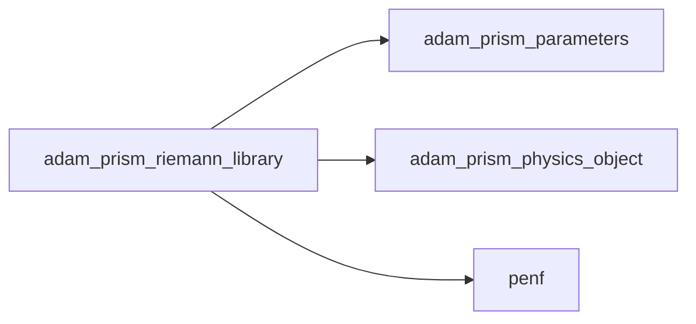
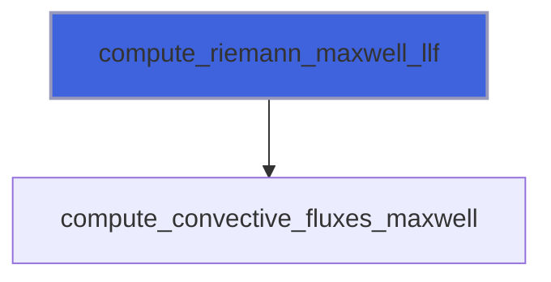
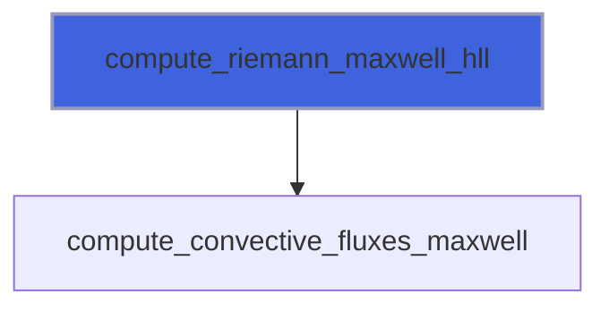
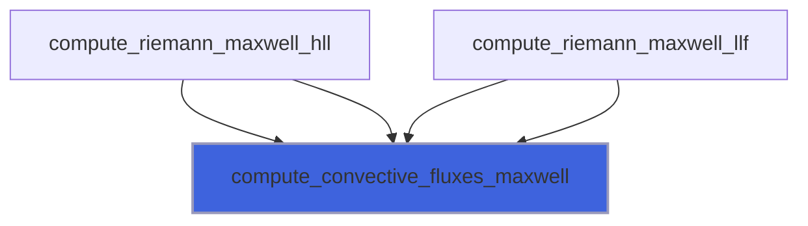

# adam_prism_riemann_library

> ADAM, PRISM Riemann Problem for Maxwell equations solvers and convective fluxes computations library.

**Source**: `src/app/prism/common/adam_prism_riemann_library.F90`

**Dependencies**



## Contents

- [compute_convective_fluxes_interface](#compute-convective-fluxes-interface)
- [compute_riemann_maxwell_llf](#compute-riemann-maxwell-llf)
- [compute_riemann_maxwell_hll](#compute-riemann-maxwell-hll)
- [compute_convective_fluxes_maxwell](#compute-convective-fluxes-maxwell)
- [compute_convective_fluxes_maxwell_div_d](#compute-convective-fluxes-maxwell-div-d)
- [compute_convective_fluxes_maxwell_div_b](#compute-convective-fluxes-maxwell-div-b)
- [compute_convective_fluxes_maxwell_div_d_b](#compute-convective-fluxes-maxwell-div-d-b)
- [compute_eigenvalues_vector](#compute-eigenvalues-vector)

## Interfaces

### compute_convective_fluxes_interface

## Subroutines

### compute_riemann_maxwell_llf

Solve the Riemann problem between the state 1 (left) and 4 (right) using the Local-Lax-Friedrichs (LLF, Rusanov) solver.

```fortran
subroutine compute_riemann_maxwell_llf(sir, nv, q1, q4, chi, f, lmax)
```

**Arguments**

| Name | Type | Intent | Attributes | Description |
|------|------|--------|------------|-------------|
| `sir` | real(kind=[R8P](/api/src/third_party/PENF/src/lib/penf_global_parameters_variables)) | in |  | Directional (1=x,2=y,3=z) increment. |
| `nv` | integer(kind=[I4P](/api/src/third_party/PENF/src/lib/penf_global_parameters_variables)) | in |  | Number of conservative varibales. |
| `q1` | real(kind=[R8P](/api/src/third_party/PENF/src/lib/penf_global_parameters_variables)) | in |  | Left state. |
| `q4` | real(kind=[R8P](/api/src/third_party/PENF/src/lib/penf_global_parameters_variables)) | in |  | Right state. |
| `chi` | real(kind=[R8P](/api/src/third_party/PENF/src/lib/penf_global_parameters_variables)) | in |  | Coefficiente velocità trasporto errori divergenza campi (non usato) |
| `f` | real(kind=[R8P](/api/src/third_party/PENF/src/lib/penf_global_parameters_variables)) | inout |  | Resulting fluxes. |
| `lmax` | real(kind=[R8P](/api/src/third_party/PENF/src/lib/penf_global_parameters_variables)) | out | optional | Maximum wave speed estimation. |

**Call graph**



### compute_riemann_maxwell_hll

Solve the Riemann problem between the state 1 (left) and 4 (right) using the Harten, Lax and van Leer (HLL) solver.

```fortran
subroutine compute_riemann_maxwell_hll(sir, nv, q1, q4, chi, f, lmax, lmin)
```

**Arguments**

| Name | Type | Intent | Attributes | Description |
|------|------|--------|------------|-------------|
| `sir` | real(kind=[R8P](/api/src/third_party/PENF/src/lib/penf_global_parameters_variables)) | in |  | Directional (1=x,2=y,3=z) increment. |
| `nv` | integer(kind=[I4P](/api/src/third_party/PENF/src/lib/penf_global_parameters_variables)) | in |  | Number of conservative varibales. |
| `q1` | real(kind=[R8P](/api/src/third_party/PENF/src/lib/penf_global_parameters_variables)) | in |  | Left state. |
| `q4` | real(kind=[R8P](/api/src/third_party/PENF/src/lib/penf_global_parameters_variables)) | in |  | Right state. |
| `chi` | real(kind=[R8P](/api/src/third_party/PENF/src/lib/penf_global_parameters_variables)) | in |  | Coefficiente velocità trasporto errori divergenza campi (non usato) |
| `f` | real(kind=[R8P](/api/src/third_party/PENF/src/lib/penf_global_parameters_variables)) | inout |  | Resulting fluxes. |
| `lmax` | real(kind=[R8P](/api/src/third_party/PENF/src/lib/penf_global_parameters_variables)) | out | optional | Maximum wave speed estimation. |
| `lmin` | real(kind=[R8P](/api/src/third_party/PENF/src/lib/penf_global_parameters_variables)) | out | optional | Maximum wave speed estimation. |

**Call graph**



### compute_convective_fluxes_maxwell

Compute convective fluxes.

```
 Fx(1) =  0       Fy(1) = -Bz/muz  Fz(1) =  By/muy
 Fx(2) =  Bz/muz  Fy(2) =  0       Fz(2) = -Bx/mux
 Fx(3) = -By/muy  Fy(3) =  Bx/mux  Fz(3) =  0
 Fx(4) =  0       Fy(4) =  Dz/epsz Fz(4) = -Dy/epsy
 Fx(5) = -Dz/epsz Fy(5) =  0       Fz(5) =  Dx/epsx
 Fx(6) =  Dy/epsy Fy(6) = -Dx/epsx Fz(6) =  0
```

```fortran
subroutine compute_convective_fluxes_maxwell(sir, q, f, chi)
```

**Arguments**

| Name | Type | Intent | Attributes | Description |
|------|------|--------|------------|-------------|
| `sir` | real(kind=[R8P](/api/src/third_party/PENF/src/lib/penf_global_parameters_variables)) | in |  | Direction array |
| `q` | real(kind=[R8P](/api/src/third_party/PENF/src/lib/penf_global_parameters_variables)) | in |  | Auxiliary variables. |
| `f` | real(kind=[R8P](/api/src/third_party/PENF/src/lib/penf_global_parameters_variables)) | inout |  | Conservative fluxes. |
| `chi` | real(kind=[R8P](/api/src/third_party/PENF/src/lib/penf_global_parameters_variables)) | in |  | Coefficiente velocità trasporto errori divergenza campi (non usato) |

**Call graph**



### compute_convective_fluxes_maxwell_div_d

Compute convective fluxes.
 J corrected with phi:
```
 Fx(1)  =  phi     Fy(1)  = -Bz/muz   Fz(1)  =  By/muy
 Fx(2)  =  Bz/muz  Fy(2)  =  phi      Fz(2)  = -Bx/mux
 Fx(3)  = -By/muy  Fy(3)  =  Bx/mux   Fz(3)  =  phi
 Fx(4)  =  0       Fy(4)  =  Dz/epsz  Fz(4)  = -Dy/epsy
 Fx(5)  = -Dz/epsz Fy(5)  =  0        Fz(5)  =  Dx/epsx
 Fx(6)  =  Dy/epsy Fy(6)  = -Dx/epsx  Fz(6)  =  0
 Fx(7)  =  0       Fy(7)  =  0        Fz(7)  =  0
 Fx(8)  =  0       Fy(8)  =  0        Fz(8)  =  0
 Fx(9)  =  0       Fy(9)  =  0        Fz(9)  =  0
 Fx(10) =  ch^2*Dx Fy(10) =  ch^2*Dy  Fz(10) =  ch^2*Dz
```

```fortran
subroutine compute_convective_fluxes_maxwell_div_d(sir, q, f, chi)
```

**Arguments**

| Name | Type | Intent | Attributes | Description |
|------|------|--------|------------|-------------|
| `sir` | real(kind=[R8P](/api/src/third_party/PENF/src/lib/penf_global_parameters_variables)) | in |  | Direction array |
| `q` | real(kind=[R8P](/api/src/third_party/PENF/src/lib/penf_global_parameters_variables)) | in |  | Auxiliary variables. |
| `f` | real(kind=[R8P](/api/src/third_party/PENF/src/lib/penf_global_parameters_variables)) | inout |  | Conservative fluxes. |
| `chi` | real(kind=[R8P](/api/src/third_party/PENF/src/lib/penf_global_parameters_variables)) | in |  | Coefficiente velocità trasporto errori divergenza campi |

### compute_convective_fluxes_maxwell_div_b

Compute convective fluxes.
 J corrected with phi:
```
 Fx(1)  =  phi     Fy(1)  = -Bz/muz   Fz(1)  =  By/muy
 Fx(2)  =  Bz/muz  Fy(2)  =  phi      Fz(2)  = -Bx/mux
 Fx(3)  = -By/muy  Fy(3)  =  Bx/mux   Fz(3)  =  phi
 Fx(4)  =  0       Fy(4)  =  Dz/epsz  Fz(4)  = -Dy/epsy
 Fx(5)  = -Dz/epsz Fy(5)  =  0        Fz(5)  =  Dx/epsx
 Fx(6)  =  Dy/epsy Fy(6)  = -Dx/epsx  Fz(6)  =  0
 Fx(7)  =  0       Fy(7)  =  0        Fz(7)  =  0
 Fx(8)  =  0       Fy(8)  =  0        Fz(8)  =  0
 Fx(9)  =  0       Fy(9)  =  0        Fz(9)  =  0
 Fx(10) =  ch^2*Dx Fy(10) =  ch^2*Dy  Fz(10) =  ch^2*Dz
```

```fortran
subroutine compute_convective_fluxes_maxwell_div_b(sir, q, f, chi)
```

**Arguments**

| Name | Type | Intent | Attributes | Description |
|------|------|--------|------------|-------------|
| `sir` | real(kind=[R8P](/api/src/third_party/PENF/src/lib/penf_global_parameters_variables)) | in |  | Direction array |
| `q` | real(kind=[R8P](/api/src/third_party/PENF/src/lib/penf_global_parameters_variables)) | in |  | Auxiliary variables. |
| `f` | real(kind=[R8P](/api/src/third_party/PENF/src/lib/penf_global_parameters_variables)) | inout |  | Conservative fluxes. |
| `chi` | real(kind=[R8P](/api/src/third_party/PENF/src/lib/penf_global_parameters_variables)) | in |  | Coefficiente velocità trasporto errori divergenza campi |

### compute_convective_fluxes_maxwell_div_d_b

Compute convective fluxes.
 J corrected with phi and psi:
```
 Fx(1)  =  phi     Fy(1)  = -Bz/muz    Fz(1)  =  By/muy
 Fx(2)  =  Bz/muz  Fy(2)  =  phi       Fz(2)  = -Bx/mux
 Fx(3)  = -By/muy  Fy(3)  =  Bx/mux    Fz(3)  =  phi
 Fx(4)  =  csi     Fy(4)  =  Dz/epsz   Fz(4)  = -Dy/epsy
 Fx(5)  = -Dz/epsz Fy(5)  =  csi       Fz(5)  =  Dx/epsx
 Fx(6)  =  Dy/epsy Fy(6)  = -Dx/epsx   Fz(6)  =  csi
 Fx(7)  =  0       Fy(7)  =  0         Fz(7)  =  0
 Fx(8)  =  0       Fy(8)  =  0         Fz(8)  =  0
 Fx(9)  =  0       Fy(9)  =  0         Fz(9)  =  0
 Fx(10) =  ch^2*Dx Fy(10) =  ch^2*Dy   Fz(10) =  ch^2*Dz
 Fx(11) =  ch^2*Bx Fy(10) =  ch^2*By   Fz(10) =  ch^2*Bz
```

```fortran
subroutine compute_convective_fluxes_maxwell_div_d_b(sir, q, f, chi)
```

**Arguments**

| Name | Type | Intent | Attributes | Description |
|------|------|--------|------------|-------------|
| `sir` | real(kind=[R8P](/api/src/third_party/PENF/src/lib/penf_global_parameters_variables)) | in |  | Direction array |
| `q` | real(kind=[R8P](/api/src/third_party/PENF/src/lib/penf_global_parameters_variables)) | in |  | Auxiliary variables. |
| `f` | real(kind=[R8P](/api/src/third_party/PENF/src/lib/penf_global_parameters_variables)) | inout |  | Conservative fluxes. |
| `chi` | real(kind=[R8P](/api/src/third_party/PENF/src/lib/penf_global_parameters_variables)) | in |  | Coefficiente velocità trasporto errori divergenza campi |

### compute_eigenvalues_vector

Compute eigenvalues vector for Maxwell equations in direction sir.

```fortran
subroutine compute_eigenvalues_vector(sir, p)
```

**Arguments**

| Name | Type | Intent | Attributes | Description |
|------|------|--------|------------|-------------|
| `sir` | real(kind=[R8P](/api/src/third_party/PENF/src/lib/penf_global_parameters_variables)) | in |  | Direction array |
| `p` | real(kind=[R8P](/api/src/third_party/PENF/src/lib/penf_global_parameters_variables)) | out |  | Eigenvalues vector |
