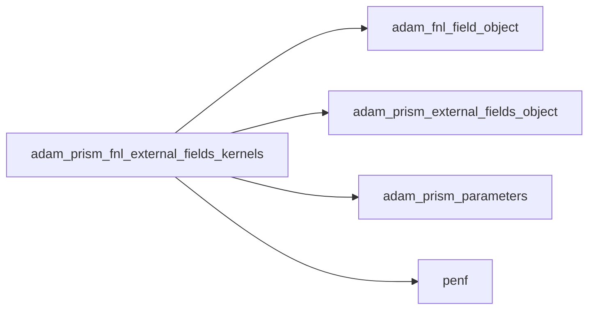
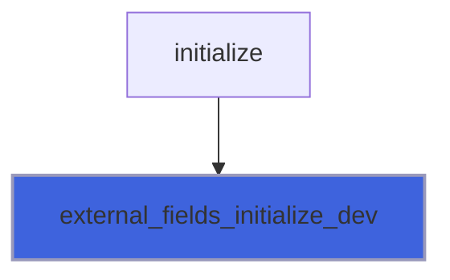

# adam_prism_fnl_external_fields_kernels

> ADAM, PRISM external fields definition, FNL backend kernels.

**Source**: `src/app/prism/fnl/adam_prism_fnl_external_fields_kernels.F90`

**Dependencies**



## Contents

- [add_external_fields_dev_interface](#add-external-fields-dev-interface)
- [sub_external_fields_dev_interface](#sub-external-fields-dev-interface)
- [external_fields_initialize_dev](#external-fields-initialize-dev)
- [add_external_fields_rmf_dev](#add-external-fields-rmf-dev)
- [sub_external_fields_rmf_dev](#sub-external-fields-rmf-dev)

## Variables

| Name | Type | Attributes | Description |
|------|------|------------|-------------|
| `add_external_fields_dev` | procedure(add_external_fields_dev_interface) | pointer | Add external fields. |
| `sub_external_fields_dev` | procedure(sub_external_fields_dev_interface) | pointer | Subtract external fields. |

## Interfaces

### add_external_fields_dev_interface

### sub_external_fields_dev_interface

## Subroutines

### external_fields_initialize_dev

Initialize external fields device kernels.

```fortran
subroutine external_fields_initialize_dev(external_fields)
```

**Arguments**

| Name | Type | Intent | Attributes | Description |
|------|------|--------|------------|-------------|
| `external_fields` | type([prism_external_fields_object](/api/src/app/prism/common/adam_prism_external_fields_object#prism-external-fields-object)) | in |  | External fields handler. |

**Call graph**



### add_external_fields_rmf_dev

Add rotating magnetic field to the field, device kernel.

```fortran
subroutine add_external_fields_rmf_dev(external_fields, field_gpu, dt, time, q_gpu, gamm)
```

**Arguments**

| Name | Type | Intent | Attributes | Description |
|------|------|--------|------------|-------------|
| `external_fields` | type([prism_external_fields_object](/api/src/app/prism/common/adam_prism_external_fields_object#prism-external-fields-object)) | in |  | External fields handler. |
| `field_gpu` | type([field_fnl_object](/api/src/lib/fnl/adam_fnl_field_object#field-fnl-object)) | in |  | Field. |
| `dt` | real(kind=[R8P](/api/src/third_party/PENF/src/lib/penf_global_parameters_variables)) | in |  | Time step. |
| `time` | real(kind=[R8P](/api/src/third_party/PENF/src/lib/penf_global_parameters_variables)) | in |  | Current time. |
| `q_gpu` | real(kind=[R8P](/api/src/third_party/PENF/src/lib/penf_global_parameters_variables)) | inout |  | Conservative variables. |
| `gamm` | real(kind=[R8P](/api/src/third_party/PENF/src/lib/penf_global_parameters_variables)) | in | optional | Gamma values of RK. |

### sub_external_fields_rmf_dev

Subtract rotating magnetic field to the field, device kernel.

```fortran
subroutine sub_external_fields_rmf_dev(external_fields, field_gpu, dt, time, q_gpu, gamm)
```

**Arguments**

| Name | Type | Intent | Attributes | Description |
|------|------|--------|------------|-------------|
| `external_fields` | type([prism_external_fields_object](/api/src/app/prism/common/adam_prism_external_fields_object#prism-external-fields-object)) | in |  | External fields handler. |
| `field_gpu` | type([field_fnl_object](/api/src/lib/fnl/adam_fnl_field_object#field-fnl-object)) | in |  | Field. |
| `dt` | real(kind=[R8P](/api/src/third_party/PENF/src/lib/penf_global_parameters_variables)) | in |  | Time step. |
| `time` | real(kind=[R8P](/api/src/third_party/PENF/src/lib/penf_global_parameters_variables)) | in |  | Current time. |
| `q_gpu` | real(kind=[R8P](/api/src/third_party/PENF/src/lib/penf_global_parameters_variables)) | inout |  | Conservative variables. |
| `gamm` | real(kind=[R8P](/api/src/third_party/PENF/src/lib/penf_global_parameters_variables)) | in | optional | Gamma values of RK. |
