# adam_prism_fnl_object

> ADAM, PRISM (Plasma Research usIng Simulation Methods) equations system class definition, GPU (FNL) backend.

**Source**: `src/app/prism/fnl/adam_prism_fnl_object.F90`

**Dependencies**

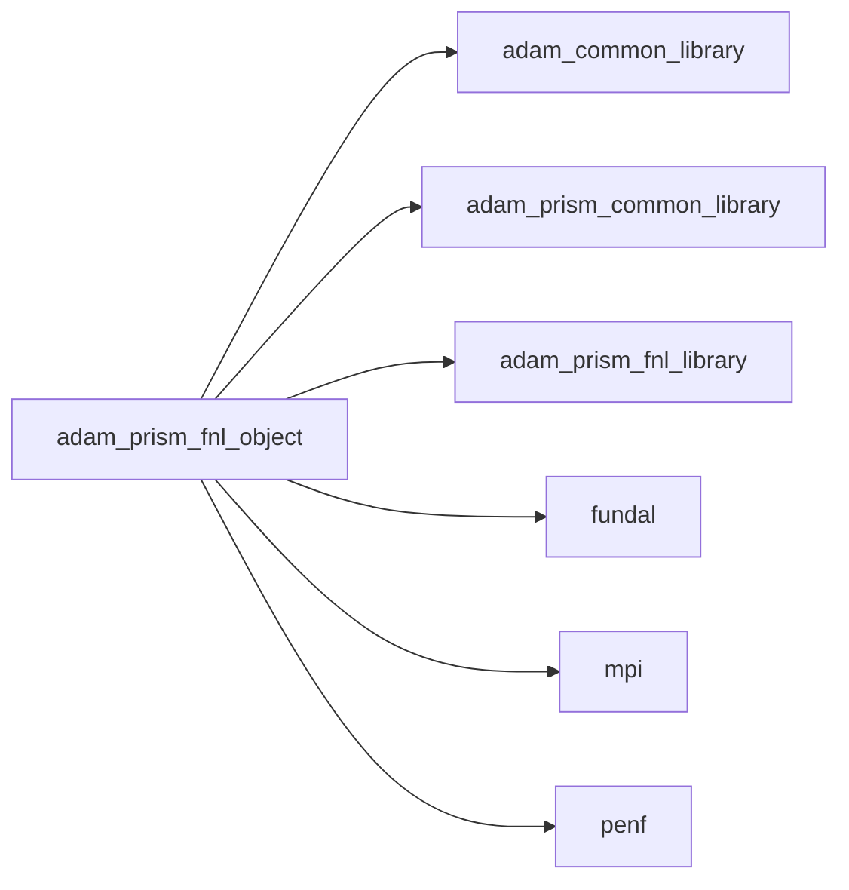

## Contents

- [prism_fnl_object](#prism-fnl-object)
- [compute_curl_interface](#compute-curl-interface)
- [compute_derivative1_interface](#compute-derivative1-interface)
- [compute_derivative2_interface](#compute-derivative2-interface)
- [compute_derivative4_interface](#compute-derivative4-interface)
- [compute_divergence_interface](#compute-divergence-interface)
- [compute_gradient_interface](#compute-gradient-interface)
- [compute_laplacian_interface](#compute-laplacian-interface)
- [compute_residuals_interface](#compute-residuals-interface)
- [integrate_interface](#integrate-interface)
- [allocate_gpu](#allocate-gpu)
- [copy_cpu_gpu](#copy-cpu-gpu)
- [copy_gpu_cpu](#copy-gpu-cpu)
- [initialize](#initialize)
- [load_restart_files](#load-restart-files)
- [save_residuals](#save-residuals)
- [save_simulation_data](#save-simulation-data)
- [apply_fwl_correction](#apply-fwl-correction)
- [compute_coils_current](#compute-coils-current)
- [set_boundary_conditions](#set-boundary-conditions)
- [set_initial_conditions](#set-initial-conditions)
- [update_ghost](#update-ghost)
- [update_rk_ghost](#update-rk-ghost)
- [compute_curl_fd](#compute-curl-fd)
- [compute_curl_fv](#compute-curl-fv)
- [compute_derivative1_fd](#compute-derivative1-fd)
- [compute_derivative1_fv](#compute-derivative1-fv)
- [compute_derivative2_fd](#compute-derivative2-fd)
- [compute_derivative2_fv](#compute-derivative2-fv)
- [compute_derivative4_fd](#compute-derivative4-fd)
- [compute_divergence_fd](#compute-divergence-fd)
- [compute_divergence_fv](#compute-divergence-fv)
- [compute_gradient_fd](#compute-gradient-fd)
- [compute_gradient_fv](#compute-gradient-fv)
- [compute_laplacian_fd](#compute-laplacian-fd)
- [compute_laplacian_fv](#compute-laplacian-fv)
- [compute_residuals_fd_centered](#compute-residuals-fd-centered)
- [integrate_blanesmoan](#integrate-blanesmoan)
- [integrate_cfm](#integrate-cfm)
- [integrate_leapfrog](#integrate-leapfrog)
- [integrate_leapfrog_pic](#integrate-leapfrog-pic)
- [integrate_rk_ls](#integrate-rk-ls)
- [integrate_rk_ssp](#integrate-rk-ssp)
- [integrate_rk_yoshida](#integrate-rk-yoshida)
- [simulate](#simulate)
- [compute_auxiliary_fields](#compute-auxiliary-fields)
- [compute_dt](#compute-dt)
- [compute_energy](#compute-energy)
- [compute_energy_error](#compute-energy-error)
- [impose_ct_correction](#impose-ct-correction)
- [impose_div_free](#impose-div-free)

## Derived Types

### prism_fnl_object

PRISM equations system class definition, GPU (FNL) backend.

**Inheritance**

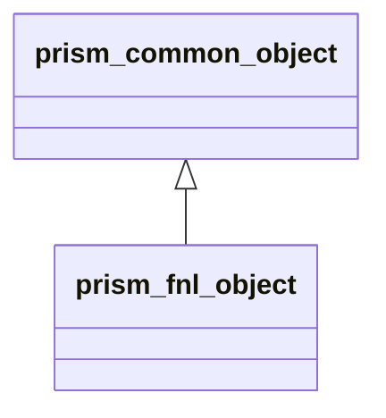

**Extends**: [`prism_common_object`](/api/src/app/prism/common/adam_prism_common_object#prism-common-object)

#### Components

| Name | Type | Attributes | Description |
|------|------|------------|-------------|
| `mpih` | type([mpih_object](/api/src/lib/common/adam_mpih_object#mpih-object)) |  | MPI handler. |
| `adam` | type([adam_object](/api/src/lib/common/adam_adam_object#adam-object)) |  | ADAM. |
| `field` | type([field_object](/api/src/lib/common/adam_field_object#field-object)) | pointer | The field. |
| `grid` | type([grid_object](/api/src/lib/common/adam_grid_object#grid-object)) | pointer | The grid. |
| `amr` | type([amr_object](/api/src/lib/common/adam_amr_object#amr-object)) |  | AMR marker handler. |
| `ib` | type([ib_object](/api/src/lib/common/adam_ib_object#ib-object)) |  | Immersed Boundary (IB) handler. |
| `slices` | type([slices_object](/api/src/lib/common/adam_slices_object#slices-object)) |  | Slices handler. |
| `blanesmoan` | type([blanesmoan_object](/api/src/lib/common/adam_blanes_moan_object#blanesmoan-object)) |  | Blanes-Moan integrator. |
| `cfm` | type([cfm_object](/api/src/lib/common/adam_cfm_object#cfm-object)) |  | Commutator-Free Magnus integrator. |
| `leapfrog` | type([leapfrog_object](/api/src/lib/common/adam_leapfrog_object#leapfrog-object)) |  | Leapfrog integrator. |
| `rk` | type([rk_object](/api/src/lib/common/adam_rk_object#rk-object)) |  | RK integrator. |
| `weno` | type([weno_object](/api/src/lib/common/adam_weno_object#weno-object)) |  | WENO reconstructor. |
| `flail` | type([flail_object](/api/src/lib/common/adam_flail_object#flail-object)) |  | Linear algebra methods handler. |
| `io` | type([prism_io_object](/api/src/app/prism/common/adam_prism_io_object#prism-io-object)) |  | IO handler. |
| `numerics` | type([prism_numerics_object](/api/src/app/prism/common/adam_prism_numerics_object#prism-numerics-object)) |  | Numerics handler. |
| `physics` | type([prism_physics_object](/api/src/app/prism/common/adam_prism_physics_object#prism-physics-object)) |  | Fluids physiscs handler. |
| `ic` | type([prism_ic_object](/api/src/app/prism/common/adam_prism_ic_object#prism-ic-object)) |  | Initial Conditions (IC) handler. |
| `bc` | type([prism_bc_object](/api/src/app/prism/common/adam_prism_bc_object#prism-bc-object)) |  | Boundary Conditions (BC) handler. |
| `rk_bc` | type([prism_rk_bc_object](/api/src/app/prism/common/adam_prism_rk_bc_object#prism-rk-bc-object)) |  | RK integrator for BC. |
| `time` | type([prism_time_object](/api/src/app/prism/common/adam_prism_time_object#prism-time-object)) |  | Time handler. |
| `fWLayer` | type([prism_fWLayer_object](/api/src/app/prism/common/adam_prism_fWLayer_object#prism-fwlayer-object)) |  | fWLayer handler. |
| `coil` | type([prism_coil_object](/api/src/app/prism/common/adam_prism_coil_object#prism-coil-object)) |  | Coils handler. |
| `external_fields` | type([prism_external_fields_object](/api/src/app/prism/common/adam_prism_external_fields_object#prism-external-fields-object)) |  | External fields handler. |
| `pic` | type([prism_pic_object](/api/src/app/prism/common/adam_prism_pic_object#prism-pic-object)) |  | Particle-in-Cell (PIC) handler. |
| `particle_injection` | type([prism_particle_injection_object](/api/src/app/prism/common/adam_prism_particle_injection_object#prism-particle-injection-object)) |  | Particle injection handler. |
| `leapfrog_pic` | type([prism_leapfrog_pic_object](/api/src/app/prism/common/adam_prism_leapfrog_pic_object#prism-leapfrog-pic-object)) |  | Leapfrog PIC integrator. |
| `rk_pic` | type([prism_rk_pic_object](/api/src/app/prism/common/adam_prism_rk_pic_object#prism-rk-pic-object)) |  | RK PIC integrator. |
| `ngc` | integer(kind=[I4P](/api/src/third_party/PENF/src/lib/penf_global_parameters_variables)) | pointer | Number of ghost cells. |
| `ni` | integer(kind=[I4P](/api/src/third_party/PENF/src/lib/penf_global_parameters_variables)) | pointer | Number of cells in i direction. |
| `nj` | integer(kind=[I4P](/api/src/third_party/PENF/src/lib/penf_global_parameters_variables)) | pointer | Number of cells in j direction. |
| `nk` | integer(kind=[I4P](/api/src/third_party/PENF/src/lib/penf_global_parameters_variables)) | pointer | Number of cells in k direction. |
| `nb` | integer(kind=[I4P](/api/src/third_party/PENF/src/lib/penf_global_parameters_variables)) | pointer | Total blocks number for MPI. |
| `blocks_number` | integer(kind=[I4P](/api/src/third_party/PENF/src/lib/penf_global_parameters_variables)) | pointer | Actual blocks number. |
| `nv` | integer(kind=[I4P](/api/src/third_party/PENF/src/lib/penf_global_parameters_variables)) | pointer | Number of variables in q vector. |
| `nv_c` | integer(kind=[I4P](/api/src/third_party/PENF/src/lib/penf_global_parameters_variables)) | pointer | Number of conservative variables in q vector. |
| `nv_s` | integer(kind=[I4P](/api/src/third_party/PENF/src/lib/penf_global_parameters_variables)) | pointer | Number of source variables in q vector. |
| `nv_cl` | integer(kind=[I4P](/api/src/third_party/PENF/src/lib/penf_global_parameters_variables)) | pointer | Number of divergence cleaning variables in q vector. |
| `q` | real(kind=[R8P](/api/src/third_party/PENF/src/lib/penf_global_parameters_variables)) | allocatable | Conservative cell centered variables. |
| `dq` | real(kind=[R8P](/api/src/third_party/PENF/src/lib/penf_global_parameters_variables)) | allocatable | Residuals right hand side. |
| `q_pic` | real(kind=[R8P](/api/src/third_party/PENF/src/lib/penf_global_parameters_variables)) | allocatable | PIC variables. |
| `pic_fields` | real(kind=[R8P](/api/src/third_party/PENF/src/lib/penf_global_parameters_variables)) | allocatable | Fields value at particle locations. |
| `curl` | real(kind=[R8P](/api/src/third_party/PENF/src/lib/penf_global_parameters_variables)) | allocatable | Curl fields. |
| `divergence` | real(kind=[R8P](/api/src/third_party/PENF/src/lib/penf_global_parameters_variables)) | allocatable | Divergence fields. |
| `q_name` | character(len=3) | allocatable | Fields names [1:nv]. |
| `energy_D` | real(kind=[R8P](/api/src/third_party/PENF/src/lib/penf_global_parameters_variables)) | allocatable | Energy of field D, time history. |
| `energy_B` | real(kind=[R8P](/api/src/third_party/PENF/src/lib/penf_global_parameters_variables)) | allocatable | Energy of field B, time history. |
| `rms_energy_error_D` | real(kind=[R8P](/api/src/third_party/PENF/src/lib/penf_global_parameters_variables)) |  | RMS energy error of D field. |
| `rms_energy_error_B` | real(kind=[R8P](/api/src/third_party/PENF/src/lib/penf_global_parameters_variables)) |  | RMS energy error of B field. |
| `mpih_gpu` | type([mpih_object](/api/src/lib/common/adam_mpih_object#mpih-object)) |  | MPI handler, FNL backend. |
| `field_gpu` | type([field_fnl_object](/api/src/lib/fnl/adam_fnl_field_object#field-fnl-object)) |  | The field, FNL backend. |
| `ib_gpu` | type([ib_fnl_object](/api/src/lib/fnl/adam_fnl_ib_object#ib-fnl-object)) |  | IB handler, FNL backend. |
| `rk_gpu` | type([rk_fnl_object](/api/src/lib/fnl/adam_fnl_rk_object#rk-fnl-object)) |  | RK integrator, FNL backend. |
| `weno_gpu` | type([weno_fnl_object](/api/src/lib/fnl/adam_fnl_weno_object#weno-fnl-object)) |  | WENO reconstructor, FNL backend. |
| `coil_gpu` | type([prism_fnl_coil_object](/api/src/app/prism/fnl/adam_prism_fnl_coil_object#prism-fnl-coil-object)) |  | Coil handler. |
| `fwlayer_gpu` | type([prism_fnl_fwlayer_object](/api/src/app/prism/fnl/adam_prism_fnl_fWLayer_object#prism-fnl-fwlayer-object)) |  | fWLayer handler. |
| `q_gpu` | real(kind=[R8P](/api/src/third_party/PENF/src/lib/penf_global_parameters_variables)) | pointer | Field cell centered variables. |
| `dq_gpu` | real(kind=[R8P](/api/src/third_party/PENF/src/lib/penf_global_parameters_variables)) | pointer | Residuals right hand side. |
| `flxyz_c_gpu` | real(kind=[R8P](/api/src/third_party/PENF/src/lib/penf_global_parameters_variables)) | pointer | Fluxes at cell center with +/- decomposition for all directions. |
| `flx_f_gpu` | real(kind=[R8P](/api/src/third_party/PENF/src/lib/penf_global_parameters_variables)) | pointer | Fluxes along x at cell face. |
| `fly_f_gpu` | real(kind=[R8P](/api/src/third_party/PENF/src/lib/penf_global_parameters_variables)) | pointer | Fluxes along y at cell face. |
| `flz_f_gpu` | real(kind=[R8P](/api/src/third_party/PENF/src/lib/penf_global_parameters_variables)) | pointer | Fluxes along z at cell face. |
| `curl_gpu` | real(kind=[R8P](/api/src/third_party/PENF/src/lib/penf_global_parameters_variables)) | pointer | Curl fields. |
| `divergence_gpu` | real(kind=[R8P](/api/src/third_party/PENF/src/lib/penf_global_parameters_variables)) | pointer | Divergence fields. |
| `compute_curl` | procedure(compute_curl_interface) | pass(self), pointer | Compute curl of vector field. |
| `compute_derivative1` | procedure(compute_derivative1_interface) | pass(self), pointer | Compute derivative1 of scalar field. |
| `compute_derivative2` | procedure(compute_derivative2_interface) | pass(self), pointer | Compute derivative2 of scalar field. |
| `compute_derivative4` | procedure(compute_derivative4_interface) | pass(self), pointer | Compute derivative4 of scalar field. |
| `compute_divergence` | procedure(compute_divergence_interface) | pass(self), pointer | Compute divergence of vector field. |
| `compute_gradient` | procedure(compute_gradient_interface) | pass(self), pointer | Compute gradient of scalar field. |
| `compute_laplacian` | procedure(compute_laplacian_interface) | pass(self), pointer | Compute laplacian of scalar field. |
| `compute_residuals` | procedure(compute_residuals_interface) | pass(self), pointer | Compute residuals, space operator. |
| `integrate` | procedure(integrate_interface) | pass(self), pointer | Integrate, time operator. |

#### Type-Bound Procedures

| Name | Attributes | Description |
|------|------------|-------------|
| `allocate_common` | pass(self) | Allocate common data. |
| `initialize_common` | pass(self) | Initialize the equation common data. |
| `save_energy_error` | pass(self) | Save energy error history. |
| `save_restart_files` | pass(self) | Save restart files. |
| `save_xh5f` | pass(self) | Save simulation data in XH5F format. |
| `allocate_gpu` | pass(self) | Allocate GPU data. |
| `copy_cpu_gpu` | pass(self) | Copy data from CPU to GPU. |
| `copy_gpu_cpu` | pass(self) | Copy data from GPU to CPU. |
| `initialize` | pass(self) | Initialize the equation. |
| `load_restart_files` | pass(self) | Load restart files. |
| `save_residuals` | pass(self) | Save residuals history. |
| `save_simulation_data` | pass(self) | Save all simulation data. |
| `apply_fwl_correction` | pass(self) | Apply fWLayer correction (if present) |
| `compute_coils_current` | pass(self) | Compute current coils sources. |
| `set_boundary_conditions` | pass(self) | Set boundary conditions of equation. |
| `set_initial_conditions` | pass(self) | Set initial conditions of equation. |
| `update_ghost` | pass(self) | Update ghost cells and set boundary conditions. |
| `update_rk_ghost` | pass(self) | Update RK stage ghost cells. |
| `compute_curl_fd` | pass(self) | Compute curl of vector field by finite difference. |
| `compute_curl_fv` | pass(self) | Compute curl of vector field by finite volume. |
| `compute_derivative1_fd` | pass(self) | Compute derivative1 of scalar fields, finite difference schemes. |
| `compute_derivative1_fv` | pass(self) | Compute derivative1 of scalar fields, finite volume schemes. |
| `compute_derivative2_fd` | pass(self) | Compute derivative2 of scalar fields, finite difference schemes. |
| `compute_derivative2_fv` | pass(self) | Compute derivative2 of scalar fields, finite volume schemes. |
| `compute_derivative4_fd` | pass(self) | Compute derivative4 of scalar fields, finite difference schemes. |
| `compute_divergence_fd` | pass(self) | Compute divergence of vector field by finite difference. |
| `compute_divergence_fv` | pass(self) | Compute divergence of vector field by finite volume. |
| `compute_gradient_fd` | pass(self) | Compute gradient of scalar field, finite difference schemes. |
| `compute_gradient_fv` | pass(self) | Compute gradient of scalar field, finite volume schemes. |
| `compute_laplacian_fd` | pass(self) | Compute laplacian of scalar field, finite difference schemes. |
| `compute_laplacian_fv` | pass(self) | Compute laplacian of scalar field, finite volume schemes. |
| `compute_residuals_fd_centered` | pass(self) | Compute residuals, centered finite difference schemes. |
| `integrate_blanesmoan` | pass(self) | Blanes and Moan scheme. |
| `integrate_cfm` | pass(self) | Commutator-Free Magnus scheme. |
| `integrate_leapfrog` | pass(self) | Leapfrog scheme. |
| `integrate_leapfrog_pic` | pass(self) | Leapfrog scheme, PIC version. |
| `integrate_rk_ls` | pass(self) | RK classical low storage schemes. |
| `integrate_rk_ssp` | pass(self) | SSP RK schemes. |
| `integrate_rk_yoshida` | pass(self) | Yoshida schemes. |
| `compute_auxiliary_fields` | pass(self) | Compute auxiliary fields. |
| `compute_dt` | pass(self) | Compute time step. |
| `compute_energy` | pass(self) | Compute energy. |
| `compute_energy_error` | pass(self) | Compute energy error. |
| `impose_ct_correction` | pass(self) | Impose Constrained Transport correction on q(ivar:ivar+2). |
| `impose_div_free` | pass(self) | Impose divergence-free property. |
| `simulate` | pass(self) | Perform the simulation. |

## Interfaces

### compute_curl_interface

### compute_derivative1_interface

### compute_derivative2_interface

### compute_derivative4_interface

### compute_divergence_interface

### compute_gradient_interface

### compute_laplacian_interface

### compute_residuals_interface

### integrate_interface

## Subroutines

### allocate_gpu

Allocate GPU data.

```fortran
subroutine allocate_gpu(self, q_gpu)
```

**Arguments**

| Name | Type | Intent | Attributes | Description |
|------|------|--------|------------|-------------|
| `self` | class([prism_fnl_object](/api/src/app/prism/fnl/adam_prism_fnl_object#prism-fnl-object)) | inout |  | The equation. |
| `q_gpu` | real(kind=[R8P](/api/src/third_party/PENF/src/lib/penf_global_parameters_variables)) | inout | target | Conservative variables. |

**Call graph**

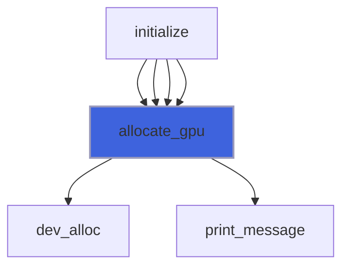

### copy_cpu_gpu

Copy data from CPU to GPU.

```fortran
subroutine copy_cpu_gpu(self)
```

**Arguments**

| Name | Type | Intent | Attributes | Description |
|------|------|--------|------------|-------------|
| `self` | class([prism_fnl_object](/api/src/app/prism/fnl/adam_prism_fnl_object#prism-fnl-object)) | inout |  | The equation. |

**Call graph**

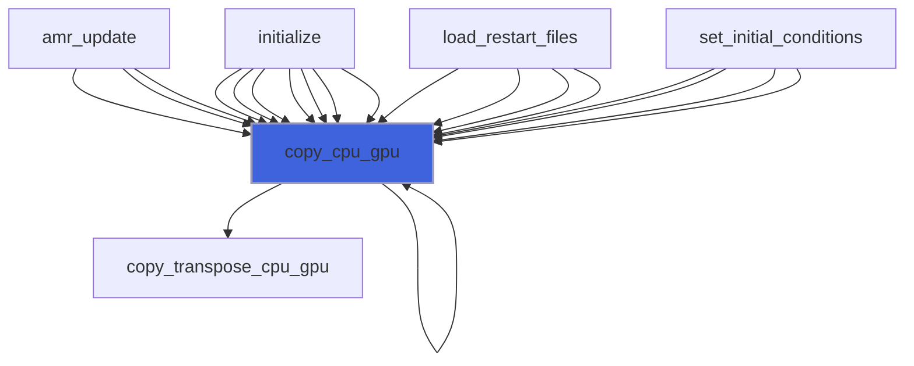

### copy_gpu_cpu

Copy data from GPU to CPU.

```fortran
subroutine copy_gpu_cpu(self, compute_copy_q_aux, copy_phi)
```

**Arguments**

| Name | Type | Intent | Attributes | Description |
|------|------|--------|------------|-------------|
| `self` | class([prism_fnl_object](/api/src/app/prism/fnl/adam_prism_fnl_object#prism-fnl-object)) | inout |  | The equation. |
| `compute_copy_q_aux` | logical | in | optional | Flag to compute auxiliary variables. |
| `copy_phi` | logical | in | optional | Copy also phi. |

**Call graph**

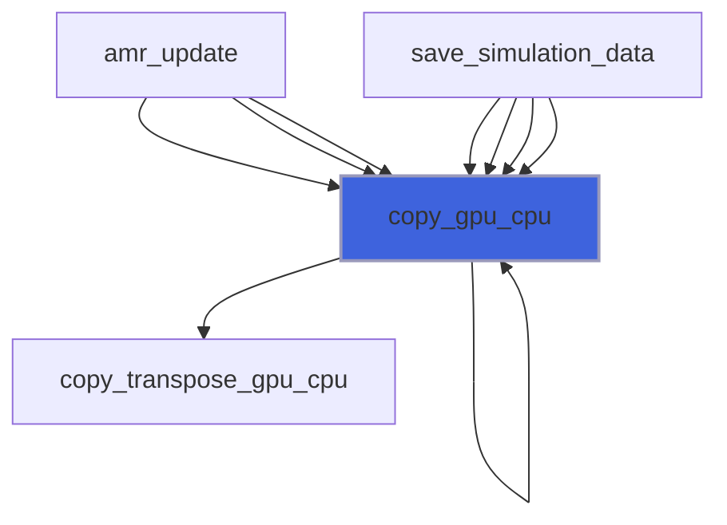

### initialize

Initialize the equation.

```fortran
subroutine initialize(self, filename)
```

**Arguments**

| Name | Type | Intent | Attributes | Description |
|------|------|--------|------------|-------------|
| `self` | class([prism_fnl_object](/api/src/app/prism/fnl/adam_prism_fnl_object#prism-fnl-object)) | inout |  | The equation. |
| `filename` | character(len=*) | in |  | Input file name. |

**Call graph**

```mermaid
flowchart TD
  add_node["add_node"] --> initialize["initialize"]
  analize["analize"] --> initialize["initialize"]
  build_connectivity["build_connectivity"] --> initialize["initialize"]
  distribute_facets["distribute_facets"] --> initialize["initialize"]
  distribute_facets_tree["distribute_facets_tree"] --> initialize["initialize"]
  export_vtk_file["export_vtk_file"] --> initialize["initialize"]
  initialize["initialize"] --> initialize["initialize"]
  initialize["initialize"] --> initialize["initialize"]
  initialize["initialize"] --> initialize["initialize"]
  initialize["initialize"] --> initialize["initialize"]
  initialize["initialize"] --> initialize["initialize"]
  initialize["initialize"] --> initialize["initialize"]
  initialize["initialize"] --> initialize["initialize"]
  initialize["initialize"] --> initialize["initialize"]
  initialize["initialize"] --> initialize["initialize"]
  initialize["initialize"] --> initialize["initialize"]
  initialize["initialize"] --> initialize["initialize"]
  initialize["initialize"] --> initialize["initialize"]
  initialize["initialize"] --> initialize["initialize"]
  initialize["initialize"] --> initialize["initialize"]
  initialize["initialize"] --> initialize["initialize"]
  initialize["initialize"] --> initialize["initialize"]
  initialize["initialize"] --> initialize["initialize"]
  initialize["initialize"] --> initialize["initialize"]
  initialize["initialize"] --> initialize["initialize"]
  initialize["initialize"] --> initialize["initialize"]
  initialize["initialize"] --> initialize["initialize"]
  initialize["initialize"] --> initialize["initialize"]
  initialize["initialize"] --> initialize["initialize"]
  initialize["initialize"] --> initialize["initialize"]
  initialize["initialize"] --> initialize["initialize"]
  initialize["initialize"] --> initialize["initialize"]
  initialize["initialize"] --> initialize["initialize"]
  initialize["initialize"] --> initialize["initialize"]
  initialize["initialize"] --> initialize["initialize"]
  initialize["initialize"] --> initialize["initialize"]
  initialize["initialize"] --> initialize["initialize"]
  initialize["initialize"] --> initialize["initialize"]
  initialize["initialize"] --> initialize["initialize"]
  initialize["initialize"] --> initialize["initialize"]
  initialize["initialize"] --> initialize["initialize"]
  initialize["initialize"] --> initialize["initialize"]
  initialize["initialize"] --> initialize["initialize"]
  initialize["initialize"] --> initialize["initialize"]
  initialize["initialize"] --> initialize["initialize"]
  initialize["initialize"] --> initialize["initialize"]
  initialize["initialize"] --> initialize["initialize"]
  initialize["initialize"] --> initialize["initialize"]
  initialize["initialize"] --> initialize["initialize"]
  initialize["initialize"] --> initialize["initialize"]
  initialize["initialize"] --> initialize["initialize"]
  initialize["initialize"] --> initialize["initialize"]
  initialize["initialize"] --> initialize["initialize"]
  initialize["initialize"] --> initialize["initialize"]
  initialize["initialize"] --> initialize["initialize"]
  initialize["initialize"] --> initialize["initialize"]
  initialize["initialize"] --> initialize["initialize"]
  initialize["initialize"] --> initialize["initialize"]
  initialize["initialize"] --> initialize["initialize"]
  initialize["initialize"] --> initialize["initialize"]
  initialize["initialize"] --> initialize["initialize"]
  initialize["initialize"] --> initialize["initialize"]
  initialize["initialize"] --> initialize["initialize"]
  initialize["initialize"] --> initialize["initialize"]
  initialize["initialize"] --> initialize["initialize"]
  initialize["initialize"] --> initialize["initialize"]
  initialize["initialize"] --> initialize["initialize"]
  initialize["initialize"] --> initialize["initialize"]
  initialize["initialize"] --> initialize["initialize"]
  initialize["initialize"] --> initialize["initialize"]
  initialize["initialize"] --> initialize["initialize"]
  initialize["initialize"] --> initialize["initialize"]
  initialize["initialize"] --> initialize["initialize"]
  initialize["initialize"] --> initialize["initialize"]
  initialize["initialize"] --> initialize["initialize"]
  initialize["initialize"] --> initialize["initialize"]
  initialize["initialize"] --> initialize["initialize"]
  initialize["initialize"] --> initialize["initialize"]
  initialize_common["initialize_common"] --> initialize["initialize"]
  initialize_common["initialize_common"] --> initialize["initialize"]
  initialize_common["initialize_common"] --> initialize["initialize"]
  initialize_common["initialize_common"] --> initialize["initialize"]
  load_from_file["load_from_file"] --> initialize["initialize"]
  load_from_file["load_from_file"] --> initialize["initialize"]
  open_file["open_file"] --> initialize["initialize"]
  open_file["open_file"] --> initialize["initialize"]
  open_file["open_file"] --> initialize["initialize"]
  resize["resize"] --> initialize["initialize"]
  save_into_file["save_into_file"] --> initialize["initialize"]
  save_vtk["save_vtk"] --> initialize["initialize"]
  simulate["simulate"] --> initialize["initialize"]
  simulate["simulate"] --> initialize["initialize"]
  simulate["simulate"] --> initialize["initialize"]
  simulate["simulate"] --> initialize["initialize"]
  simulate["simulate"] --> initialize["initialize"]
  simulate["simulate"] --> initialize["initialize"]
  simulate["simulate"] --> initialize["initialize"]
  test_stress["test_stress"] --> initialize["initialize"]
  initialize["initialize"] --> allocate_gpu["allocate_gpu"]
  initialize["initialize"] --> external_fields_initialize_dev["external_fields_initialize_dev"]
  initialize["initialize"] --> initialize["initialize"]
  initialize["initialize"] --> initialize_common["initialize_common"]
  initialize["initialize"] --> print_message["print_message"]
  style initialize fill:#3e63dd,stroke:#99b,stroke-width:2px
```

### load_restart_files

Save restart files.

```fortran
subroutine load_restart_files(self, t, time)
```

**Arguments**

| Name | Type | Intent | Attributes | Description |
|------|------|--------|------------|-------------|
| `self` | class([prism_fnl_object](/api/src/app/prism/fnl/adam_prism_fnl_object#prism-fnl-object)) | inout |  | The equation. |
| `t` | integer(kind=[I4P](/api/src/third_party/PENF/src/lib/penf_global_parameters_variables)) | out |  | Time iteration. |
| `time` | real(kind=[R8P](/api/src/third_party/PENF/src/lib/penf_global_parameters_variables)) | out |  | Time. |

**Call graph**

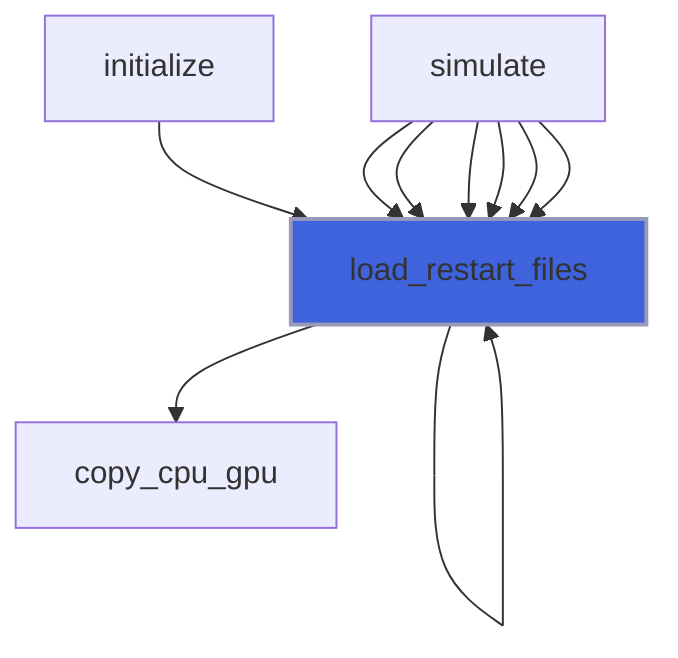

### save_residuals

Save residuals history.

```fortran
subroutine save_residuals(self)
```

**Arguments**

| Name | Type | Intent | Attributes | Description |
|------|------|--------|------------|-------------|
| `self` | class([prism_fnl_object](/api/src/app/prism/fnl/adam_prism_fnl_object#prism-fnl-object)) | inout |  | The equation. |

**Call graph**

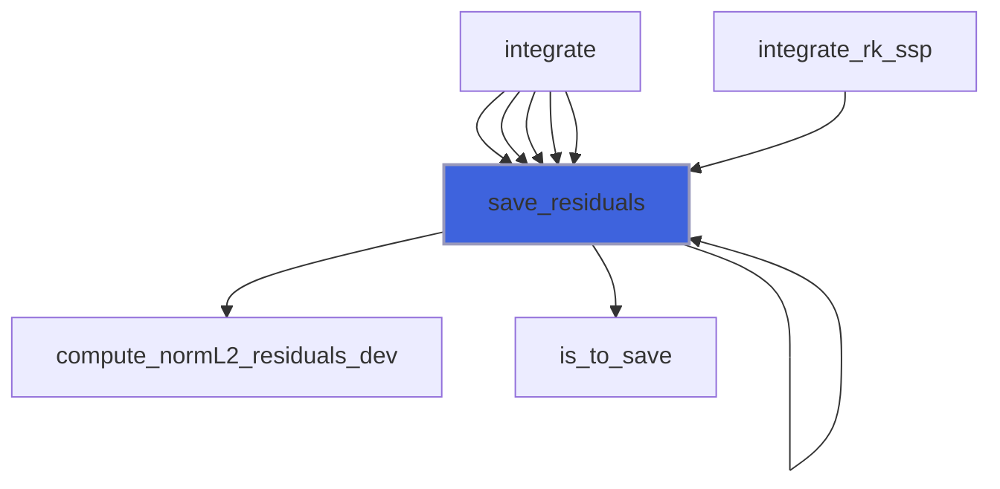

### save_simulation_data

Save all simulation data.

```fortran
subroutine save_simulation_data(self)
```

**Arguments**

| Name | Type | Intent | Attributes | Description |
|------|------|--------|------------|-------------|
| `self` | class([prism_fnl_object](/api/src/app/prism/fnl/adam_prism_fnl_object#prism-fnl-object)) | inout |  | The equation. |

**Call graph**

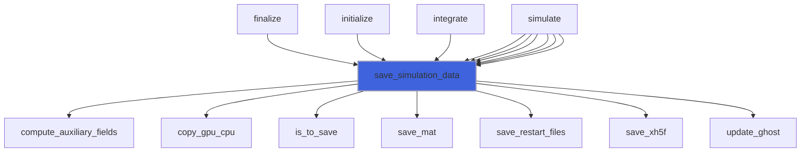

### apply_fwl_correction

Apply correction if a fWL is present.

```fortran
subroutine apply_fwl_correction(self)
```

**Arguments**

| Name | Type | Intent | Attributes | Description |
|------|------|--------|------------|-------------|
| `self` | class([prism_fnl_object](/api/src/app/prism/fnl/adam_prism_fnl_object#prism-fnl-object)) | inout |  | The equation. |

**Call graph**

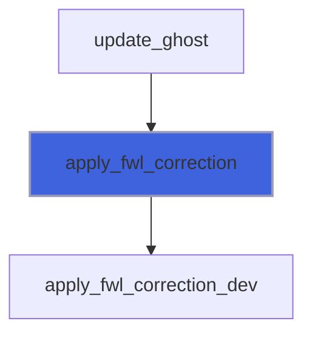

### compute_coils_current

Compute current coils sources.

```fortran
subroutine compute_coils_current(self, gamma)
```

**Arguments**

| Name | Type | Intent | Attributes | Description |
|------|------|--------|------------|-------------|
| `self` | class([prism_fnl_object](/api/src/app/prism/fnl/adam_prism_fnl_object#prism-fnl-object)) | inout |  | The equation. |
| `gamma` | real(kind=[R8P](/api/src/third_party/PENF/src/lib/penf_global_parameters_variables)) | in | optional | RK coefficient. |

**Call graph**

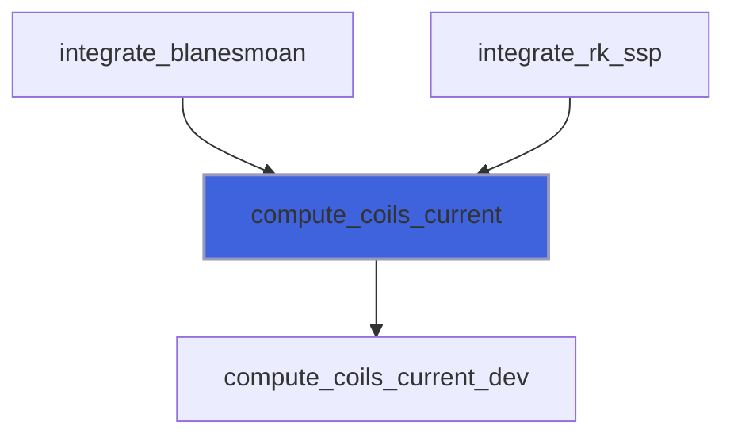

### set_boundary_conditions

Set boundary conditions of equation.

```fortran
subroutine set_boundary_conditions(self, q_gpu)
```

**Arguments**

| Name | Type | Intent | Attributes | Description |
|------|------|--------|------------|-------------|
| `self` | class([prism_fnl_object](/api/src/app/prism/fnl/adam_prism_fnl_object#prism-fnl-object)) | in |  | The equation. |
| `q_gpu` | real(kind=[R8P](/api/src/third_party/PENF/src/lib/penf_global_parameters_variables)) | inout |  | Conservative variables. |

**Call graph**

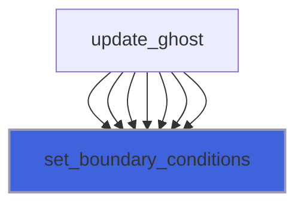

### set_initial_conditions

Set initial conditions of field.

```fortran
subroutine set_initial_conditions(self)
```

**Arguments**

| Name | Type | Intent | Attributes | Description |
|------|------|--------|------------|-------------|
| `self` | class([prism_fnl_object](/api/src/app/prism/fnl/adam_prism_fnl_object#prism-fnl-object)) | inout |  | The equation. |

**Call graph**

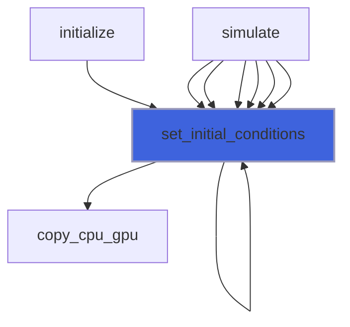

### update_ghost

Update ghost cells.
 If not specified all steps are perfermod, syncronous computation

```fortran
subroutine update_ghost(self, q_gpu, step, s)
```

**Arguments**

| Name | Type | Intent | Attributes | Description |
|------|------|--------|------------|-------------|
| `self` | class([prism_fnl_object](/api/src/app/prism/fnl/adam_prism_fnl_object#prism-fnl-object)) | inout |  | The equation. |
| `q_gpu` | real(kind=[R8P](/api/src/third_party/PENF/src/lib/penf_global_parameters_variables)) | inout |  | Conservative variables. |
| `step` | integer(kind=[I4P](/api/src/third_party/PENF/src/lib/penf_global_parameters_variables)) | in | optional | Step to be perfordmed in asyncronous comp. |
| `s` | integer(kind=[I4P](/api/src/third_party/PENF/src/lib/penf_global_parameters_variables)) | in | optional | Stage counter. |

**Call graph**

```mermaid
flowchart TD
  amr_update["amr_update"] --> update_ghost["update_ghost"]
  amr_update["amr_update"] --> update_ghost["update_ghost"]
  amr_update["amr_update"] --> update_ghost["update_ghost"]
  amr_update["amr_update"] --> update_ghost["update_ghost"]
  amr_update["amr_update"] --> update_ghost["update_ghost"]
  amr_update["amr_update"] --> update_ghost["update_ghost"]
  compute_residuals["compute_residuals"] --> update_ghost["update_ghost"]
  compute_residuals["compute_residuals"] --> update_ghost["update_ghost"]
  compute_residuals["compute_residuals"] --> update_ghost["update_ghost"]
  compute_residuals["compute_residuals"] --> update_ghost["update_ghost"]
  compute_residuals["compute_residuals"] --> update_ghost["update_ghost"]
  compute_residuals_fd_centered["compute_residuals_fd_centered"] --> update_ghost["update_ghost"]
  integrate_eikonal["integrate_eikonal"] --> update_ghost["update_ghost"]
  integrate_eikonal["integrate_eikonal"] --> update_ghost["update_ghost"]
  integrate_eikonal["integrate_eikonal"] --> update_ghost["update_ghost"]
  integrate_eikonal["integrate_eikonal"] --> update_ghost["update_ghost"]
  integrate_eikonal["integrate_eikonal"] --> update_ghost["update_ghost"]
  integrate_eikonal["integrate_eikonal"] --> update_ghost["update_ghost"]
  mark_by_grad_var["mark_by_grad_var"] --> update_ghost["update_ghost"]
  mark_by_grad_var["mark_by_grad_var"] --> update_ghost["update_ghost"]
  mark_by_grad_var["mark_by_grad_var"] --> update_ghost["update_ghost"]
  mark_by_grad_var["mark_by_grad_var"] --> update_ghost["update_ghost"]
  mark_by_grad_var["mark_by_grad_var"] --> update_ghost["update_ghost"]
  save_simulation_data["save_simulation_data"] --> update_ghost["update_ghost"]
  save_simulation_data["save_simulation_data"] --> update_ghost["update_ghost"]
  save_simulation_data["save_simulation_data"] --> update_ghost["update_ghost"]
  save_simulation_data["save_simulation_data"] --> update_ghost["update_ghost"]
  save_simulation_data["save_simulation_data"] --> update_ghost["update_ghost"]
  save_simulation_data["save_simulation_data"] --> update_ghost["update_ghost"]
  save_simulation_data["save_simulation_data"] --> update_ghost["update_ghost"]
  update_ghost["update_ghost"] --> apply_fwl_correction["apply_fwl_correction"]
  update_ghost["update_ghost"] --> set_boundary_conditions["set_boundary_conditions"]
  update_ghost["update_ghost"] --> update_ghost_local_gpu["update_ghost_local_gpu"]
  update_ghost["update_ghost"] --> update_ghost_mpi_gpu["update_ghost_mpi_gpu"]
  style update_ghost fill:#3e63dd,stroke:#99b,stroke-width:2px
```

### update_rk_ghost

Update RK ghost cells.

```fortran
subroutine update_rk_ghost(self, dt, phi_gpu)
```

**Arguments**

| Name | Type | Intent | Attributes | Description |
|------|------|--------|------------|-------------|
| `self` | class([prism_fnl_object](/api/src/app/prism/fnl/adam_prism_fnl_object#prism-fnl-object)) | inout |  | RK object. |
| `dt` | real(kind=[R8P](/api/src/third_party/PENF/src/lib/penf_global_parameters_variables)) | in |  | Current time step. |
| `phi_gpu` | real(kind=[R8P](/api/src/third_party/PENF/src/lib/penf_global_parameters_variables)) | in | optional | IB distance. |

**Call graph**

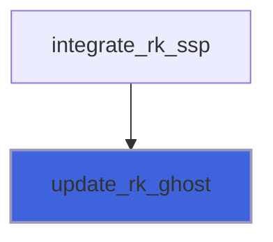

### compute_curl_fd

Compute curl of vector fields, div(q(ivar:ivar+2), using finite difference schemes.

```fortran
subroutine compute_curl_fd(self, ivar, q_gpu, curl_gpu)
```

**Arguments**

| Name | Type | Intent | Attributes | Description |
|------|------|--------|------------|-------------|
| `self` | class([prism_fnl_object](/api/src/app/prism/fnl/adam_prism_fnl_object#prism-fnl-object)) | in |  | The equation. |
| `ivar` | integer(kind=[I4P](/api/src/third_party/PENF/src/lib/penf_global_parameters_variables)) | in |  | Start index of variable of q. |
| `q_gpu` | real(kind=[R8P](/api/src/third_party/PENF/src/lib/penf_global_parameters_variables)) | in |  | Field variables. |
| `curl_gpu` | real(kind=[R8P](/api/src/third_party/PENF/src/lib/penf_global_parameters_variables)) | inout |  | Curl. |

**Call graph**

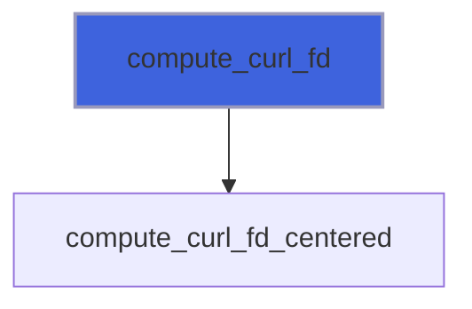

### compute_curl_fv

Compute curl of vector fields, div(q(ivar:ivar+2), using finite volume schemes.

```fortran
subroutine compute_curl_fv(self, ivar, q_gpu, curl_gpu)
```

**Arguments**

| Name | Type | Intent | Attributes | Description |
|------|------|--------|------------|-------------|
| `self` | class([prism_fnl_object](/api/src/app/prism/fnl/adam_prism_fnl_object#prism-fnl-object)) | in |  | The equation. |
| `ivar` | integer(kind=[I4P](/api/src/third_party/PENF/src/lib/penf_global_parameters_variables)) | in |  | Start index of variable of q. |
| `q_gpu` | real(kind=[R8P](/api/src/third_party/PENF/src/lib/penf_global_parameters_variables)) | in |  | Field variables. |
| `curl_gpu` | real(kind=[R8P](/api/src/third_party/PENF/src/lib/penf_global_parameters_variables)) | inout |  | Curl. |

**Call graph**

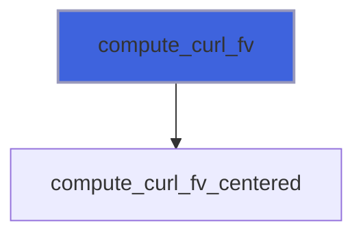

### compute_derivative1_fd

Compute derivative1 of scalar fields, dq(ivar)/ds, using finite difference schemes.

```fortran
subroutine compute_derivative1_fd(self, dir, ivar, q_gpu, dq_ds_gpu)
```

**Arguments**

| Name | Type | Intent | Attributes | Description |
|------|------|--------|------------|-------------|
| `self` | class([prism_fnl_object](/api/src/app/prism/fnl/adam_prism_fnl_object#prism-fnl-object)) | in |  | The equation. |
| `dir` | integer(kind=[I4P](/api/src/third_party/PENF/src/lib/penf_global_parameters_variables)) | in |  | Direction, 1=X, 2=Y, 3=Z. |
| `ivar` | integer(kind=[I4P](/api/src/third_party/PENF/src/lib/penf_global_parameters_variables)) | in |  | Start index of variable of q. |
| `q_gpu` | real(kind=[R8P](/api/src/third_party/PENF/src/lib/penf_global_parameters_variables)) | in |  | Field variables. |
| `dq_ds_gpu` | real(kind=[R8P](/api/src/third_party/PENF/src/lib/penf_global_parameters_variables)) | inout |  | Derivative1, dq/ds. |

**Call graph**

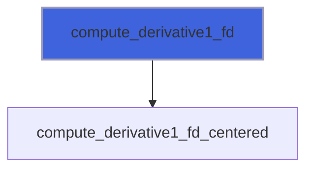

### compute_derivative1_fv

Compute derivative1 of scalar fields, dq(ivar)/ds, using finite volume schemes.

```fortran
subroutine compute_derivative1_fv(self, dir, ivar, q_gpu, dq_ds_gpu)
```

**Arguments**

| Name | Type | Intent | Attributes | Description |
|------|------|--------|------------|-------------|
| `self` | class([prism_fnl_object](/api/src/app/prism/fnl/adam_prism_fnl_object#prism-fnl-object)) | in |  | The equation. |
| `dir` | integer(kind=[I4P](/api/src/third_party/PENF/src/lib/penf_global_parameters_variables)) | in |  | Direction, 1=X, 2=Y, 3=Z. |
| `ivar` | integer(kind=[I4P](/api/src/third_party/PENF/src/lib/penf_global_parameters_variables)) | in |  | Start index of variable of q. |
| `q_gpu` | real(kind=[R8P](/api/src/third_party/PENF/src/lib/penf_global_parameters_variables)) | in |  | Field variables. |
| `dq_ds_gpu` | real(kind=[R8P](/api/src/third_party/PENF/src/lib/penf_global_parameters_variables)) | inout |  | Derivative1, dq/ds. |

**Call graph**


### compute_derivative2_fd

Compute derivative2 of scalar fields, d2q(ivar)/ds2, using finite difference schemes.

```fortran
subroutine compute_derivative2_fd(self, dir, ivar, q_gpu, d2q_ds2_gpu)
```

**Arguments**

| Name | Type | Intent | Attributes | Description |
|------|------|--------|------------|-------------|
| `self` | class([prism_fnl_object](/api/src/app/prism/fnl/adam_prism_fnl_object#prism-fnl-object)) | in |  | The equation. |
| `dir` | integer(kind=[I4P](/api/src/third_party/PENF/src/lib/penf_global_parameters_variables)) | in |  | Direction, 1=X, 2=Y, 3=Z. |
| `ivar` | integer(kind=[I4P](/api/src/third_party/PENF/src/lib/penf_global_parameters_variables)) | in |  | Start index of variable of q. |
| `q_gpu` | real(kind=[R8P](/api/src/third_party/PENF/src/lib/penf_global_parameters_variables)) | in |  | Field variables. |
| `d2q_ds2_gpu` | real(kind=[R8P](/api/src/third_party/PENF/src/lib/penf_global_parameters_variables)) | inout |  | Derivative2, d2q/ds2. |

**Call graph**


### compute_derivative2_fv

Compute derivative2 of scalar fields, d2q(ivar)/ds2, using finite volume schemes.

```fortran
subroutine compute_derivative2_fv(self, dir, ivar, q_gpu, d2q_ds2_gpu)
```

**Arguments**

| Name | Type | Intent | Attributes | Description |
|------|------|--------|------------|-------------|
| `self` | class([prism_fnl_object](/api/src/app/prism/fnl/adam_prism_fnl_object#prism-fnl-object)) | in |  | The equation. |
| `dir` | integer(kind=[I4P](/api/src/third_party/PENF/src/lib/penf_global_parameters_variables)) | in |  | Direction, 1=X, 2=Y, 3=Z. |
| `ivar` | integer(kind=[I4P](/api/src/third_party/PENF/src/lib/penf_global_parameters_variables)) | in |  | Start index of variable of q. |
| `q_gpu` | real(kind=[R8P](/api/src/third_party/PENF/src/lib/penf_global_parameters_variables)) | in |  | Field variables. |
| `d2q_ds2_gpu` | real(kind=[R8P](/api/src/third_party/PENF/src/lib/penf_global_parameters_variables)) | inout |  | Derivative2, d2q/ds2. |

**Call graph**

```mermaid
flowchart TD
  compute_derivative2_fv["compute_derivative2_fv"] --> compute_derivative2_fv_centered["compute_derivative2_fv_centered"]
  style compute_derivative2_fv fill:#3e63dd,stroke:#99b,stroke-width:2px
```

### compute_derivative4_fd

Compute derivative4 of scalar fields, d4q(ivar)/ds4, using finite difference schemes.

```fortran
subroutine compute_derivative4_fd(self, dir, ivar, q_gpu, d4q_ds4_gpu)
```

**Arguments**

| Name | Type | Intent | Attributes | Description |
|------|------|--------|------------|-------------|
| `self` | class([prism_fnl_object](/api/src/app/prism/fnl/adam_prism_fnl_object#prism-fnl-object)) | in |  | The equation. |
| `dir` | integer(kind=[I4P](/api/src/third_party/PENF/src/lib/penf_global_parameters_variables)) | in |  | Direction, 1=X, 2=Y, 3=Z. |
| `ivar` | integer(kind=[I4P](/api/src/third_party/PENF/src/lib/penf_global_parameters_variables)) | in |  | Start index of variable of q. |
| `q_gpu` | real(kind=[R8P](/api/src/third_party/PENF/src/lib/penf_global_parameters_variables)) | in |  | Field variables. |
| `d4q_ds4_gpu` | real(kind=[R8P](/api/src/third_party/PENF/src/lib/penf_global_parameters_variables)) | inout |  | Derivative4, d4q/ds4. |

**Call graph**

```mermaid
flowchart TD
  compute_derivative4_fd["compute_derivative4_fd"] --> compute_derivative4_fd_centered["compute_derivative4_fd_centered"]
  style compute_derivative4_fd fill:#3e63dd,stroke:#99b,stroke-width:2px
```

### compute_divergence_fd

Compute divergence of vector fields, div(q(ivar:ivar+2), using finite difference schemes.
 Directly computes divergence from transposed GPU layout (b,i,j,k,v).

```fortran
subroutine compute_divergence_fd(self, ivar, ovar, q_gpu, divergence_gpu)
```

**Arguments**

| Name | Type | Intent | Attributes | Description |
|------|------|--------|------------|-------------|
| `self` | class([prism_fnl_object](/api/src/app/prism/fnl/adam_prism_fnl_object#prism-fnl-object)) | in |  | The equation. |
| `ivar` | integer(kind=[I4P](/api/src/third_party/PENF/src/lib/penf_global_parameters_variables)) | in |  | Start index of field of q. |
| `ovar` | integer(kind=[I4P](/api/src/third_party/PENF/src/lib/penf_global_parameters_variables)) | in |  | Output index in divergence. |
| `q_gpu` | real(kind=[R8P](/api/src/third_party/PENF/src/lib/penf_global_parameters_variables)) | in |  | Field variables. |
| `divergence_gpu` | real(kind=[R8P](/api/src/third_party/PENF/src/lib/penf_global_parameters_variables)) | inout |  | Divergence. |

### compute_divergence_fv

Compute divergence of vector fields, div(q(ivar:ivar+2), using finite volume schemes.
 Directly computes divergence from transposed GPU layout (b,i,j,k,v).

```fortran
subroutine compute_divergence_fv(self, ivar, ovar, q_gpu, divergence_gpu)
```

**Arguments**

| Name | Type | Intent | Attributes | Description |
|------|------|--------|------------|-------------|
| `self` | class([prism_fnl_object](/api/src/app/prism/fnl/adam_prism_fnl_object#prism-fnl-object)) | in |  | The equation. |
| `ivar` | integer(kind=[I4P](/api/src/third_party/PENF/src/lib/penf_global_parameters_variables)) | in |  | Start index of field of q. |
| `ovar` | integer(kind=[I4P](/api/src/third_party/PENF/src/lib/penf_global_parameters_variables)) | in |  | Output index in divergence. |
| `q_gpu` | real(kind=[R8P](/api/src/third_party/PENF/src/lib/penf_global_parameters_variables)) | in |  | Field variables. |
| `divergence_gpu` | real(kind=[R8P](/api/src/third_party/PENF/src/lib/penf_global_parameters_variables)) | inout |  | Divergence. |

**Call graph**

```mermaid
flowchart TD
  compute_divergence_fv["compute_divergence_fv"] --> compute_reconstruction_r_fv_centered["compute_reconstruction_r_fv_centered"]
  style compute_divergence_fv fill:#3e63dd,stroke:#99b,stroke-width:2px
```

### compute_gradient_fd

Compute gradient of scalar variable q(ivar), finite difference schemes.

```fortran
subroutine compute_gradient_fd(self, ivar, q_gpu, gradient_gpu)
```

**Arguments**

| Name | Type | Intent | Attributes | Description |
|------|------|--------|------------|-------------|
| `self` | class([prism_fnl_object](/api/src/app/prism/fnl/adam_prism_fnl_object#prism-fnl-object)) | in |  | The equation. |
| `ivar` | integer(kind=[I4P](/api/src/third_party/PENF/src/lib/penf_global_parameters_variables)) | in |  | Index of scalar var of q. |
| `q_gpu` | real(kind=[R8P](/api/src/third_party/PENF/src/lib/penf_global_parameters_variables)) | in |  | Field variables. |
| `gradient_gpu` | real(kind=[R8P](/api/src/third_party/PENF/src/lib/penf_global_parameters_variables)) | inout |  | Gradient. |

**Call graph**

```mermaid
flowchart TD
  compute_gradient_fd["compute_gradient_fd"] --> compute_gradient_fd_centered["compute_gradient_fd_centered"]
  style compute_gradient_fd fill:#3e63dd,stroke:#99b,stroke-width:2px
```

### compute_gradient_fv

Compute gradient of scalar variable q(ivar), finite volume schemes.

```fortran
subroutine compute_gradient_fv(self, ivar, q_gpu, gradient_gpu)
```

**Arguments**

| Name | Type | Intent | Attributes | Description |
|------|------|--------|------------|-------------|
| `self` | class([prism_fnl_object](/api/src/app/prism/fnl/adam_prism_fnl_object#prism-fnl-object)) | in |  | The equation. |
| `ivar` | integer(kind=[I4P](/api/src/third_party/PENF/src/lib/penf_global_parameters_variables)) | in |  | Index of scalar var of q. |
| `q_gpu` | real(kind=[R8P](/api/src/third_party/PENF/src/lib/penf_global_parameters_variables)) | in |  | Field variables. |
| `gradient_gpu` | real(kind=[R8P](/api/src/third_party/PENF/src/lib/penf_global_parameters_variables)) | inout |  | Gradient. |

**Call graph**

```mermaid
flowchart TD
  compute_gradient_fv["compute_gradient_fv"] --> compute_gradient_fv_centered["compute_gradient_fv_centered"]
  style compute_gradient_fv fill:#3e63dd,stroke:#99b,stroke-width:2px
```

### compute_laplacian_fd

Compute laplacian of scalar variable q(ivar), finite difference schemes.

```fortran
subroutine compute_laplacian_fd(self, ivar, q_gpu, laplacian_gpu)
```

**Arguments**

| Name | Type | Intent | Attributes | Description |
|------|------|--------|------------|-------------|
| `self` | class([prism_fnl_object](/api/src/app/prism/fnl/adam_prism_fnl_object#prism-fnl-object)) | in |  | The equation. |
| `ivar` | integer(kind=[I4P](/api/src/third_party/PENF/src/lib/penf_global_parameters_variables)) | in |  | Index of scalar variable of q. |
| `q_gpu` | real(kind=[R8P](/api/src/third_party/PENF/src/lib/penf_global_parameters_variables)) | in |  | Field variables. |
| `laplacian_gpu` | real(kind=[R8P](/api/src/third_party/PENF/src/lib/penf_global_parameters_variables)) | inout |  | Gradient. |

**Call graph**

```mermaid
flowchart TD
  compute_laplacian_fd["compute_laplacian_fd"] --> compute_laplacian_fd_centered["compute_laplacian_fd_centered"]
  style compute_laplacian_fd fill:#3e63dd,stroke:#99b,stroke-width:2px
```

### compute_laplacian_fv

Compute laplacian of scalar variable q(ivar), finite volume schemes.

```fortran
subroutine compute_laplacian_fv(self, ivar, q_gpu, laplacian_gpu)
```

**Arguments**

| Name | Type | Intent | Attributes | Description |
|------|------|--------|------------|-------------|
| `self` | class([prism_fnl_object](/api/src/app/prism/fnl/adam_prism_fnl_object#prism-fnl-object)) | in |  | The equation. |
| `ivar` | integer(kind=[I4P](/api/src/third_party/PENF/src/lib/penf_global_parameters_variables)) | in |  | Index of scalar variable of q. |
| `q_gpu` | real(kind=[R8P](/api/src/third_party/PENF/src/lib/penf_global_parameters_variables)) | in |  | Field variables. |
| `laplacian_gpu` | real(kind=[R8P](/api/src/third_party/PENF/src/lib/penf_global_parameters_variables)) | inout |  | Gradient. |

**Call graph**

```mermaid
flowchart TD
  compute_laplacian_fv["compute_laplacian_fv"] --> compute_laplacian_fv_centered["compute_laplacian_fv_centered"]
  style compute_laplacian_fv fill:#3e63dd,stroke:#99b,stroke-width:2px
```

### compute_residuals_fd_centered

Compute residuals of equation, space operator, centered finite difference schemes.

```fortran
subroutine compute_residuals_fd_centered(self, q_gpu, dq_gpu, s)
```

**Arguments**

| Name | Type | Intent | Attributes | Description |
|------|------|--------|------------|-------------|
| `self` | class([prism_fnl_object](/api/src/app/prism/fnl/adam_prism_fnl_object#prism-fnl-object)) | inout |  | The equation. |
| `q_gpu` | real(kind=[R8P](/api/src/third_party/PENF/src/lib/penf_global_parameters_variables)) | inout |  | Conservative variables. |
| `dq_gpu` | real(kind=[R8P](/api/src/third_party/PENF/src/lib/penf_global_parameters_variables)) | inout |  | Residuals. |
| `s` | integer(kind=[I4P](/api/src/third_party/PENF/src/lib/penf_global_parameters_variables)) | in | optional | Stage counter. |

**Call graph**

```mermaid
flowchart TD
  compute_residuals_fd_centered["compute_residuals_fd_centered"] --> compute_curl_fd_centered_dev["compute_curl_fd_centered_dev"]
  compute_residuals_fd_centered["compute_residuals_fd_centered"] --> update_ghost["update_ghost"]
  style compute_residuals_fd_centered fill:#3e63dd,stroke:#99b,stroke-width:2px
```

### integrate_blanesmoan

Integrate equation, time operator, Blanes and Moan scheme.

```fortran
subroutine integrate_blanesmoan(self)
```

**Arguments**

| Name | Type | Intent | Attributes | Description |
|------|------|--------|------------|-------------|
| `self` | class([prism_fnl_object](/api/src/app/prism/fnl/adam_prism_fnl_object#prism-fnl-object)) | inout |  | The equation. |

**Call graph**

```mermaid
flowchart TD
  integrate_blanesmoan["integrate_blanesmoan"] --> compute_coils_current["compute_coils_current"]
  style integrate_blanesmoan fill:#3e63dd,stroke:#99b,stroke-width:2px
```

### integrate_cfm

Integrate equation, time operator, Commutator-Free Magnus integrator.

```fortran
subroutine integrate_cfm(self)
```

**Arguments**

| Name | Type | Intent | Attributes | Description |
|------|------|--------|------------|-------------|
| `self` | class([prism_fnl_object](/api/src/app/prism/fnl/adam_prism_fnl_object#prism-fnl-object)) | inout |  | The equation. |

### integrate_leapfrog

Integrate equation, time operator, leapfrog scheme.

```fortran
subroutine integrate_leapfrog(self)
```

**Arguments**

| Name | Type | Intent | Attributes | Description |
|------|------|--------|------------|-------------|
| `self` | class([prism_fnl_object](/api/src/app/prism/fnl/adam_prism_fnl_object#prism-fnl-object)) | inout |  | The equation. |

### integrate_leapfrog_pic

Integrate equation, time operator, leapfrog scheme.

```fortran
subroutine integrate_leapfrog_pic(self)
```

**Arguments**

| Name | Type | Intent | Attributes | Description |
|------|------|--------|------------|-------------|
| `self` | class([prism_fnl_object](/api/src/app/prism/fnl/adam_prism_fnl_object#prism-fnl-object)) | inout |  | The equation. |

### integrate_rk_ls

Integrate equation, time operator, RK classical low storage schemes.
 Low storage RK working on q_rk(:,:,:,:,:,1)/q as stages, update q in place.

```fortran
subroutine integrate_rk_ls(self)
```

**Arguments**

| Name | Type | Intent | Attributes | Description |
|------|------|--------|------------|-------------|
| `self` | class([prism_fnl_object](/api/src/app/prism/fnl/adam_prism_fnl_object#prism-fnl-object)) | inout |  | The equation. |

### integrate_rk_ssp

Integrate equation, time operator, SSP RK schemes.
 SSP RK working on q_rk as stages.

```fortran
subroutine integrate_rk_ssp(self)
```

**Arguments**

| Name | Type | Intent | Attributes | Description |
|------|------|--------|------------|-------------|
| `self` | class([prism_fnl_object](/api/src/app/prism/fnl/adam_prism_fnl_object#prism-fnl-object)) | inout |  | The equation. |

**Call graph**

```mermaid
flowchart TD
  integrate_rk_ssp["integrate_rk_ssp"] --> assign_stage["assign_stage"]
  integrate_rk_ssp["integrate_rk_ssp"] --> compute_coils_current["compute_coils_current"]
  integrate_rk_ssp["integrate_rk_ssp"] --> compute_stage["compute_stage"]
  integrate_rk_ssp["integrate_rk_ssp"] --> impose_div_free["impose_div_free"]
  integrate_rk_ssp["integrate_rk_ssp"] --> initialize_stages["initialize_stages"]
  integrate_rk_ssp["integrate_rk_ssp"] --> save_residuals["save_residuals"]
  integrate_rk_ssp["integrate_rk_ssp"] --> update_q["update_q"]
  integrate_rk_ssp["integrate_rk_ssp"] --> update_rk_ghost["update_rk_ghost"]
  style integrate_rk_ssp fill:#3e63dd,stroke:#99b,stroke-width:2px
```

### integrate_rk_yoshida

Integrate equation, time operator, Yoshida RK scheme.

```fortran
subroutine integrate_rk_yoshida(self)
```

**Arguments**

| Name | Type | Intent | Attributes | Description |
|------|------|--------|------------|-------------|
| `self` | class([prism_fnl_object](/api/src/app/prism/fnl/adam_prism_fnl_object#prism-fnl-object)) | inout |  | The equation. |

### simulate

Perform the simulation.

```fortran
subroutine simulate(self, filename)
```

**Arguments**

| Name | Type | Intent | Attributes | Description |
|------|------|--------|------------|-------------|
| `self` | class([prism_fnl_object](/api/src/app/prism/fnl/adam_prism_fnl_object#prism-fnl-object)) | inout |  | The equation. |
| `filename` | character(len=*) | in |  | Input file name. |

**Call graph**

```mermaid
flowchart TD
  simulate["simulate"] --> barrier["barrier"]
  simulate["simulate"] --> close_file_residuals["close_file_residuals"]
  simulate["simulate"] --> compute_dt["compute_dt"]
  simulate["simulate"] --> compute_energy["compute_energy"]
  simulate["simulate"] --> compute_energy_error["compute_energy_error"]
  simulate["simulate"] --> finalize["finalize"]
  simulate["simulate"] --> initialize["initialize"]
  simulate["simulate"] --> load_restart_files["load_restart_files"]
  simulate["simulate"] --> open_file_residuals["open_file_residuals"]
  simulate["simulate"] --> print_message["print_message"]
  simulate["simulate"] --> print_progress["print_progress"]
  simulate["simulate"] --> save_energy_error["save_energy_error"]
  simulate["simulate"] --> save_simulation_data["save_simulation_data"]
  simulate["simulate"] --> set_initial_conditions["set_initial_conditions"]
  simulate["simulate"] --> str["str"]
  style simulate fill:#3e63dd,stroke:#99b,stroke-width:2px
```

### compute_auxiliary_fields

Compute auxiliary fields.

```fortran
subroutine compute_auxiliary_fields(self)
```

**Arguments**

| Name | Type | Intent | Attributes | Description |
|------|------|--------|------------|-------------|
| `self` | class([prism_fnl_object](/api/src/app/prism/fnl/adam_prism_fnl_object#prism-fnl-object)) | inout |  | The equation. |

**Call graph**

```mermaid
flowchart TD
  save_simulation_data["save_simulation_data"] --> compute_auxiliary_fields["compute_auxiliary_fields"]
  style compute_auxiliary_fields fill:#3e63dd,stroke:#99b,stroke-width:2px
```

### compute_dt

Compute maximum time step accordingly to CFL stabilty criterion.

```fortran
subroutine compute_dt(self)
```

**Arguments**

| Name | Type | Intent | Attributes | Description |
|------|------|--------|------------|-------------|
| `self` | class([prism_fnl_object](/api/src/app/prism/fnl/adam_prism_fnl_object#prism-fnl-object)) | inout |  | The equation. |

**Call graph**

```mermaid
flowchart TD
  simulate["simulate"] --> compute_dt["compute_dt"]
  simulate["simulate"] --> compute_dt["compute_dt"]
  simulate["simulate"] --> compute_dt["compute_dt"]
  simulate["simulate"] --> compute_dt["compute_dt"]
  simulate["simulate"] --> compute_dt["compute_dt"]
  simulate["simulate"] --> compute_dt["compute_dt"]
  style compute_dt fill:#3e63dd,stroke:#99b,stroke-width:2px
```

### compute_energy

Compute energy.

```fortran
subroutine compute_energy(self)
```

**Arguments**

| Name | Type | Intent | Attributes | Description |
|------|------|--------|------------|-------------|
| `self` | class([prism_fnl_object](/api/src/app/prism/fnl/adam_prism_fnl_object#prism-fnl-object)) | inout |  | The equation. |

**Call graph**

```mermaid
flowchart TD
  simulate["simulate"] --> compute_energy["compute_energy"]
  compute_energy["compute_energy"] --> compute_e["compute_e"]
  style compute_energy fill:#3e63dd,stroke:#99b,stroke-width:2px
```

### compute_energy_error

Compute energy error.

```fortran
subroutine compute_energy_error(self)
```

**Arguments**

| Name | Type | Intent | Attributes | Description |
|------|------|--------|------------|-------------|
| `self` | class([prism_fnl_object](/api/src/app/prism/fnl/adam_prism_fnl_object#prism-fnl-object)) | inout |  | The equation. |

**Call graph**

```mermaid
flowchart TD
  simulate["simulate"] --> compute_energy_error["compute_energy_error"]
  style compute_energy_error fill:#3e63dd,stroke:#99b,stroke-width:2px
```

### impose_ct_correction

Impose Constrained Transport Correction on vectorial variable q(ivar:ivar+2).
 Note that self%divergence memory is used as buffer, be carefull.

```fortran
subroutine impose_ct_correction(self, ivar)
```

**Arguments**

| Name | Type | Intent | Attributes | Description |
|------|------|--------|------------|-------------|
| `self` | class([prism_fnl_object](/api/src/app/prism/fnl/adam_prism_fnl_object#prism-fnl-object)) | inout |  | The equation. |
| `ivar` | integer(kind=[I4P](/api/src/third_party/PENF/src/lib/penf_global_parameters_variables)) | in |  | Variable (start) index in q. |

**Call graph**

```mermaid
flowchart TD
  impose_div_free["impose_div_free"] --> impose_ct_correction["impose_ct_correction"]
  impose_ct_correction["impose_ct_correction"] --> print_message["print_message"]
  impose_ct_correction["impose_ct_correction"] --> str["str"]
  style impose_ct_correction fill:#3e63dd,stroke:#99b,stroke-width:2px
```

### impose_div_free

Impose divergence-free property.

```fortran
subroutine impose_div_free(self)
```

**Arguments**

| Name | Type | Intent | Attributes | Description |
|------|------|--------|------------|-------------|
| `self` | class([prism_fnl_object](/api/src/app/prism/fnl/adam_prism_fnl_object#prism-fnl-object)) | inout |  | The equation. |

**Call graph**

```mermaid
flowchart TD
  integrate_rk_ssp["integrate_rk_ssp"] --> impose_div_free["impose_div_free"]
  impose_div_free["impose_div_free"] --> impose_ct_correction["impose_ct_correction"]
  style impose_div_free fill:#3e63dd,stroke:#99b,stroke-width:2px
```
