# adam_adam_object

> ADAM, ADAM class definition.

**Source**: `src/lib/common/adam_adam_object.F90`

**Dependencies**

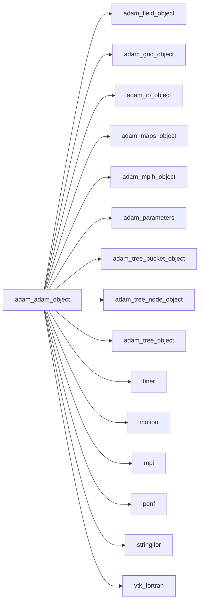

## Contents

- [adam_object](#adam-object)
- [adapt](#adapt)
- [amr_update](#amr-update)
- [blocks_reorder](#blocks-reorder)
- [check_blocks_number](#check-blocks-number)
- [compute_blocks_number](#compute-blocks-number)
- [load_restart_files](#load-restart-files)
- [initialize](#initialize)
- [interpolate_at_point](#interpolate-at-point)
- [make_comm_local_maps_ghost_bc](#make-comm-local-maps-ghost-bc)
- [mpi_gather_refinement_needed](#mpi-gather-refinement-needed)
- [mpi_redistribute](#mpi-redistribute)
- [prune](#prune)
- [refine_uniform](#refine-uniform)
- [save_restart_files](#save-restart-files)
- [save_hdf5](#save-hdf5)
- [save_slice](#save-slice)
- [save_vtk](#save-vtk)
- [save_xh5f](#save-xh5f)
- [save_xh5f_field_3D_R8P](#save-xh5f-field-3d-r8p)
- [save_xh5f_field_4D_R8P](#save-xh5f-field-4d-r8p)
- [save_xh5f_field_3D_R4P](#save-xh5f-field-3d-r4p)
- [save_xh5f_field_4D_R4P](#save-xh5f-field-4d-r4p)
- [save_xh5f_field_3D_I8P](#save-xh5f-field-3d-i8p)
- [save_xh5f_field_4D_I8P](#save-xh5f-field-4d-i8p)
- [save_xh5f_field_3D_I4P](#save-xh5f-field-3d-i4p)
- [save_xh5f_field_4D_I4P](#save-xh5f-field-4d-i4p)
- [save_xh5f_field_3D_I2P](#save-xh5f-field-3d-i2p)
- [save_xh5f_field_4D_I2P](#save-xh5f-field-4d-i2p)
- [save_xh5f_field_3D_I1P](#save-xh5f-field-3d-i1p)
- [save_xh5f_field_4D_I1P](#save-xh5f-field-4d-i1p)
- [close_hdf5](#close-hdf5)
- [open_hdf5](#open-hdf5)
- [save_hdf5_block](#save-hdf5-block)
- [close_xdmf](#close-xdmf)
- [open_xdmf](#open-xdmf)
- [save_xdmf_block](#save-xdmf-block)
- [description](#description)

## Derived Types

### adam_object

ADAM class definition.

#### Components

| Name | Type | Attributes | Description |
|------|------|------------|-------------|
| `mpih` | type([mpih_object](/api/src/third_party/FUNDAL/src/lib/fundal_mpih_object#mpih-object)) |  | The MPI handler. |
| `grid` | type([grid_object](/api/src/lib/common/adam_grid_object#grid-object)) |  | The grid. |
| `tree` | type([tree_object](/api/src/lib/common/adam_tree_object#tree-object)) |  | The tree. |
| `maps` | type([maps_object](/api/src/lib/common/adam_maps_object#maps-object)) |  | The maps. |
| `field` | type([field_object](/api/src/lib/common/adam_field_object#field-object)) |  | The field. |
| `io` | type([io_object](/api/src/lib/common/adam_io_object#io-object)) |  | The IO handler. |

#### Type-Bound Procedures

| Name | Attributes | Description |
|------|------------|-------------|
| `adapt` | pass(self) | Adapt tree/field accordingly to refine/derefine necessity. |
| `amr_update` | pass(self) | Update AMR status. |
| `blocks_reorder` | pass(self) | Reorder blocks (for asyncrhonous MPI) |
| `check_blocks_number` | pass(self) | Check if blocks number is groving too much. |
| `compute_blocks_number` | pass(self) | Compute maximum blocks number allocatable on memory available. |
| `description` | pass(self) | Return pretty-printed object description. |
| `initialize` | pass(self) | Initialize ADAM. |
| `interpolate_at_point` | pass(self) | Interpolate a scalar variable at a given point. |
| `load_restart_files` | pass(self) | Load restart files. |
| `make_comm_local_maps_ghost_bc` | pass(self) | Make communication/local maps of ghost cells. |
| `mpi_gather_refinement_needed` | pass(self) | Gather refinement needed. |
| `mpi_redistribute` | pass(self) | Redistribute nodes/blocks to processes, load balancing. |
| `prune` | pass(self) | Prune nodes/blocks. |
| `refine_uniform` | pass(self) | Refine all blocks uniformly. |
| `save_hdf5` | pass(self) | Save ADAM in HDF5 format. |
| `save_restart_files` | pass(self) | Save restart files. |
| `save_slice` | pass(self) | Save slice. |
| `save_vtk` | pass(self) | Save ADAM in VTK  format. |
| `save_xh5f` | pass(self) | Save ADAM in XH5F format. |
| `save_xh5f_field` |  | Save fields by XH5F file handler. |
| `save_xh5f_field_3D_R8P` | pass(self) | Save fields by XH5F file handler, rank 3D, kind R8P. |
| `save_xh5f_field_4D_R8P` | pass(self) | Save fields by XH5F file handler, rank 4D, kind R8P. |
| `save_xh5f_field_3D_R4P` | pass(self) | Save fields by XH5F file handler, rank 3D, kind R4P. |
| `save_xh5f_field_4D_R4P` | pass(self) | Save fields by XH5F file handler, rank 4D, kind R4P. |
| `save_xh5f_field_3D_I8P` | pass(self) | Save fields by XH5F file handler, rank 3D, kind I8P. |
| `save_xh5f_field_4D_I8P` | pass(self) | Save fields by XH5F file handler, rank 4D, kind I8P. |
| `save_xh5f_field_3D_I4P` | pass(self) | Save fields by XH5F file handler, rank 3D, kind I4P. |
| `save_xh5f_field_4D_I4P` | pass(self) | Save fields by XH5F file handler, rank 4D, kind I4P. |
| `save_xh5f_field_3D_I2P` | pass(self) | Save fields by XH5F file handler, rank 3D, kind I2P. |
| `save_xh5f_field_4D_I2P` | pass(self) | Save fields by XH5F file handler, rank 4D, kind I2P. |
| `save_xh5f_field_3D_I1P` | pass(self) | Save fields by XH5F file handler, rank 3D, kind I1P. |
| `save_xh5f_field_4D_I1P` | pass(self) | Save fields by XH5F file handler, rank 4D, kind I1P. |

## Subroutines

### adapt

Adapt tree/field accordingly to refine/derefine necessity.

```fortran
subroutine adapt(self, q)
```

**Arguments**

| Name | Type | Intent | Attributes | Description |
|------|------|--------|------------|-------------|
| `self` | class([adam_object](/api/src/lib/common/adam_adam_object#adam-object)) | inout |  | ADAM. |
| `q` | real(kind=[R8P](/api/src/third_party/PENF/src/lib/penf_global_parameters_variables)) | inout |  | Field cell centered variables. |

**Call graph**

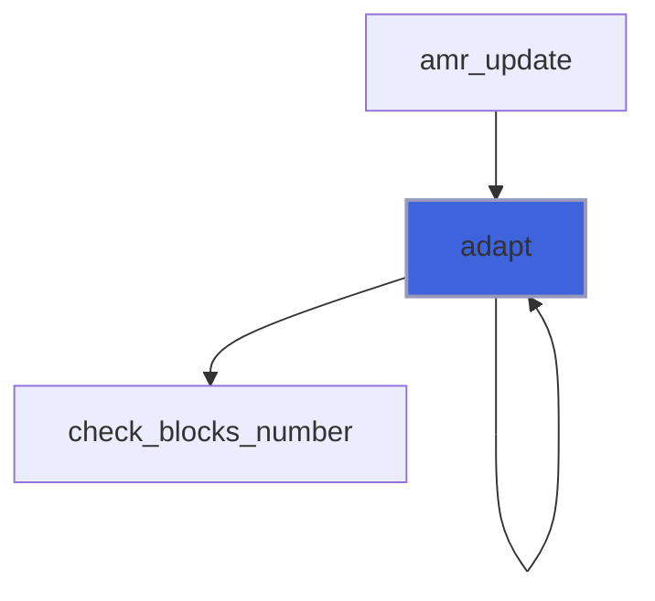

### amr_update

Update AMR status.

 Note: AMR update can be safely called only *after* update_ghost has been called for *q* variables, otherwise
 refine is not well done.
 Note: only if the AMR is UNIFORM and GLOBALLY made by tree, i.e. using mark_all_nodes, the mpi_redistribute can be avoided,
 otherwise mpi_gather_refinement_nedeed is not safe (having wrong nodes number counters).

```fortran
subroutine amr_update(self, q, is_marked_by_field, is_marked_by_tree, do_mpi_redistribute, do_blocks_reorder, is_grid_changed)
```

**Arguments**

| Name | Type | Intent | Attributes | Description |
|------|------|--------|------------|-------------|
| `self` | class([adam_object](/api/src/lib/common/adam_adam_object#adam-object)) | inout |  | ADAM. |
| `q` | real(kind=[R8P](/api/src/third_party/PENF/src/lib/penf_global_parameters_variables)) | inout |  | Field cell centered variables. |
| `is_marked_by_field` | logical | in | optional | Flag to check if marker is field. |
| `is_marked_by_tree` | logical | in | optional | Flag to check if marker is tree. |
| `do_mpi_redistribute` | logical | in | optional | Flag to activate MPI redistribute. |
| `do_blocks_reorder` | logical | in | optional | Flag to activate blocks reorder. |
| `is_grid_changed` | logical | out | optional | Flag to check if grid is changed. |

**Call graph**

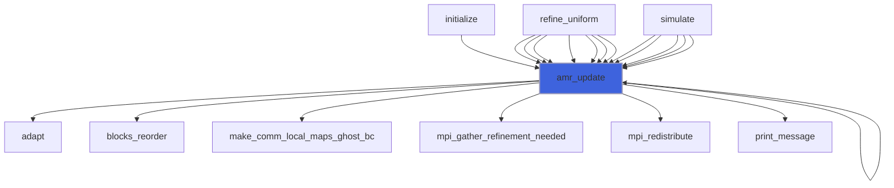

### blocks_reorder

Reorder blocks (for asyncrhonous MPI)

```fortran
subroutine blocks_reorder(self, q)
```

**Arguments**

| Name | Type | Intent | Attributes | Description |
|------|------|--------|------------|-------------|
| `self` | class([adam_object](/api/src/lib/common/adam_adam_object#adam-object)) | inout |  | ADAM. |
| `q` | real(kind=[R8P](/api/src/third_party/PENF/src/lib/penf_global_parameters_variables)) | inout |  | Field cell centered variables. |

**Call graph**

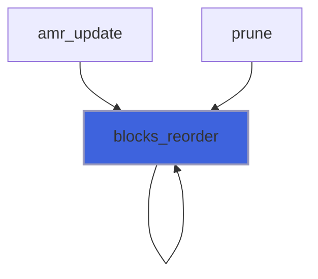

### check_blocks_number

Check if blocks number is groving too much.

```fortran
subroutine check_blocks_number(self)
```

**Arguments**

| Name | Type | Intent | Attributes | Description |
|------|------|--------|------------|-------------|
| `self` | class([adam_object](/api/src/lib/common/adam_adam_object#adam-object)) | inout |  | ADAM. |

**Call graph**

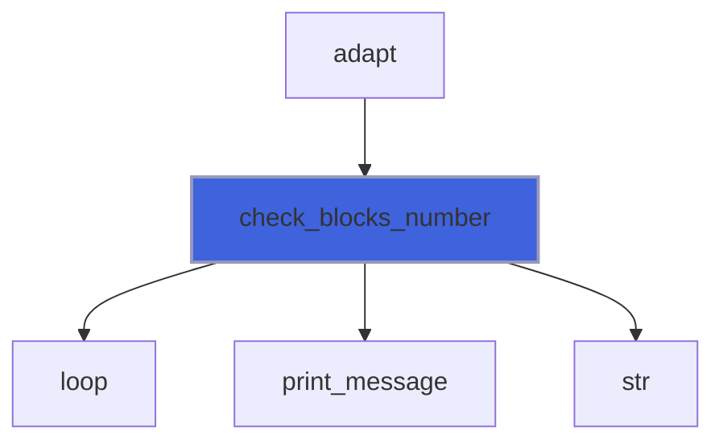

### compute_blocks_number

Compute maximum blocks number allocatable on memory available.

```fortran
subroutine compute_blocks_number(self, memory_avail, fields_number, nb, nodes_number)
```

**Arguments**

| Name | Type | Intent | Attributes | Description |
|------|------|--------|------------|-------------|
| `self` | class([adam_object](/api/src/lib/common/adam_adam_object#adam-object)) | in |  | ADAM. |
| `memory_avail` | real(kind=[R8P](/api/src/third_party/PENF/src/lib/penf_global_parameters_variables)) | in |  | Memory available for single MPI process (GBytes). |
| `fields_number` | integer(kind=[I4P](/api/src/third_party/PENF/src/lib/penf_global_parameters_variables)) | in |  | Fields number. |
| `nb` | integer(kind=[I4P](/api/src/third_party/PENF/src/lib/penf_global_parameters_variables)) | out |  | Maximum blocks number for single MPI process. |
| `nodes_number` | integer(kind=[I8P](/api/src/third_party/PENF/src/lib/penf_global_parameters_variables)) | out |  | Maximum blocks number for all MPI processes (nodes). |

**Call graph**

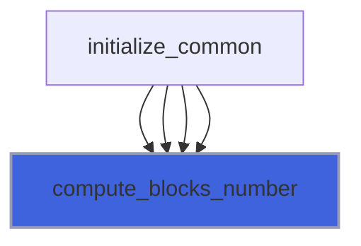

### load_restart_files

Load restart files.

```fortran
subroutine load_restart_files(self, basename, t, time, q)
```

**Arguments**

| Name | Type | Intent | Attributes | Description |
|------|------|--------|------------|-------------|
| `self` | class([adam_object](/api/src/lib/common/adam_adam_object#adam-object)) | inout |  | ADAM. |
| `basename` | character(len=*) | in |  | Base name of output files. |
| `t` | integer(kind=[I4P](/api/src/third_party/PENF/src/lib/penf_global_parameters_variables)) | out |  | Time iteration. |
| `time` | real(kind=[R8P](/api/src/third_party/PENF/src/lib/penf_global_parameters_variables)) | out |  | Time. |
| `q` | real(kind=[R8P](/api/src/third_party/PENF/src/lib/penf_global_parameters_variables)) | inout |  | Field cell centered variables. |

**Call graph**

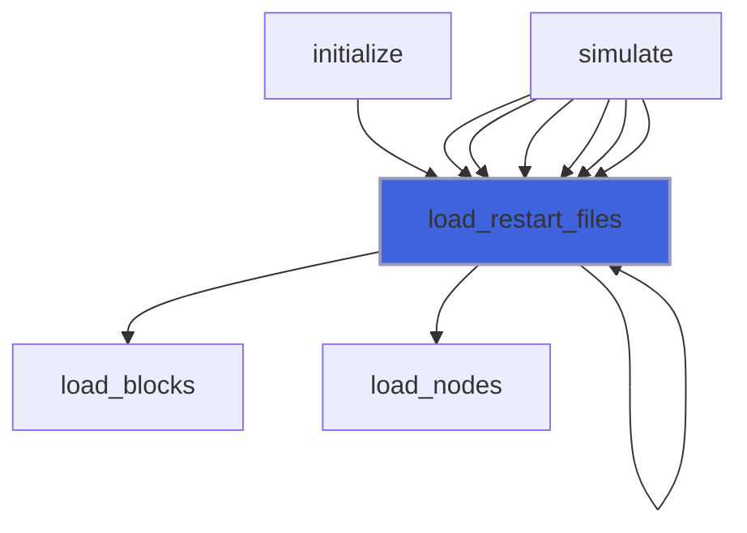

### initialize

Initialize ADAM.

```fortran
subroutine initialize(self, nb, file_parameters, do_grid_init, ni, nj, nk, ngc, emin, emax, bc_type, do_tree_init, max_load, nodes_number, buckets_number, ratio, max_level, add_adam, iu_ref_levels, i_prune, j_prune, k_prune, l_prune, do_maps_init, do_field_init, nv, q)
```

**Arguments**

| Name | Type | Intent | Attributes | Description |
|------|------|--------|------------|-------------|
| `self` | class([adam_object](/api/src/lib/common/adam_adam_object#adam-object)) | inout |  | ADAM. |
| `nb` | integer(kind=[I4P](/api/src/third_party/PENF/src/lib/penf_global_parameters_variables)) | in |  | Number of all blocks that can be stored in field. |
| `file_parameters` | type([file_ini](/api/src/third_party/FiNeR/src/lib/finer_file_ini_t#file-ini)) | inout | optional | INI file handler. |
| `do_grid_init` | logical | in | optional | Flag to activate grid initialize. |
| `ni` | integer(kind=[I4P](/api/src/third_party/PENF/src/lib/penf_global_parameters_variables)) | in | optional | Number of cells in X direction. |
| `nj` | integer(kind=[I4P](/api/src/third_party/PENF/src/lib/penf_global_parameters_variables)) | in | optional | Number of cells in Y direction. |
| `nk` | integer(kind=[I4P](/api/src/third_party/PENF/src/lib/penf_global_parameters_variables)) | in | optional | Number of cells in Z direction. |
| `ngc` | integer(kind=[I4P](/api/src/third_party/PENF/src/lib/penf_global_parameters_variables)) | in | optional | Number of ghost cells. |
| `emin` | real(kind=[R8P](/api/src/third_party/PENF/src/lib/penf_global_parameters_variables)) | in | optional | Coordinates of minium abscissa. |
| `emax` | real(kind=[R8P](/api/src/third_party/PENF/src/lib/penf_global_parameters_variables)) | in | optional | Coordinates of maxium abscissa. |
| `bc_type` | integer(kind=[I4P](/api/src/third_party/PENF/src/lib/penf_global_parameters_variables)) | in | optional | Type of boundary conditions in the 6 faces of grid. |
| `do_tree_init` | logical | in | optional | Flag to activate tree initialize. |
| `max_load` | real(kind=[R8P](/api/src/third_party/PENF/src/lib/penf_global_parameters_variables)) | in | optional | Maximum load of tree buckets. |
| `nodes_number` | integer(kind=[I8P](/api/src/third_party/PENF/src/lib/penf_global_parameters_variables)) | in | optional | Nodes number to be stored in the tree. |
| `buckets_number` | integer(kind=[I8P](/api/src/third_party/PENF/src/lib/penf_global_parameters_variables)) | in | optional | Number of buckets for initialize the tree. |
| `ratio` | integer(kind=[I4P](/api/src/third_party/PENF/src/lib/penf_global_parameters_variables)) | in | optional | Refinement ratio. |
| `max_level` | integer(kind=[I4P](/api/src/third_party/PENF/src/lib/penf_global_parameters_variables)) | in | optional | Maximum refinement level. |
| `add_adam` | logical | in | optional | Add ADAM node, the ancestor of all nodes. |
| `iu_ref_levels` | integer(kind=[I4P](/api/src/third_party/PENF/src/lib/penf_global_parameters_variables)) | in | optional | Uniform initial refinement. |
| `i_prune` | integer(kind=[I4P](/api/src/third_party/PENF/src/lib/penf_global_parameters_variables)) | in | optional | Pruning along x. |
| `j_prune` | integer(kind=[I4P](/api/src/third_party/PENF/src/lib/penf_global_parameters_variables)) | in | optional | Pruning along y. |
| `k_prune` | integer(kind=[I4P](/api/src/third_party/PENF/src/lib/penf_global_parameters_variables)) | in | optional | Pruning along z. |
| `l_prune` | integer(kind=[I4P](/api/src/third_party/PENF/src/lib/penf_global_parameters_variables)) | in | optional | Pruning level. |
| `do_maps_init` | logical | in | optional | Flag to activate maps initialize. |
| `do_field_init` | logical | in | optional | Flag to activate field initialize. |
| `nv` | integer(kind=[I4P](/api/src/third_party/PENF/src/lib/penf_global_parameters_variables)) | in | optional | Number of field variables. |
| `q` | real(kind=[R8P](/api/src/third_party/PENF/src/lib/penf_global_parameters_variables)) | inout | allocatable, optional | Field cell centered variables. |

**Call graph**

```mermaid
flowchart TD
  add_node["add_node"] --> initialize["initialize"]
  analize["analize"] --> initialize["initialize"]
  build_connectivity["build_connectivity"] --> initialize["initialize"]
  distribute_facets["distribute_facets"] --> initialize["initialize"]
  distribute_facets_tree["distribute_facets_tree"] --> initialize["initialize"]
  export_vtk_file["export_vtk_file"] --> initialize["initialize"]
  initialize["initialize"] --> initialize["initialize"]
  initialize["initialize"] --> initialize["initialize"]
  initialize["initialize"] --> initialize["initialize"]
  initialize["initialize"] --> initialize["initialize"]
  initialize["initialize"] --> initialize["initialize"]
  initialize["initialize"] --> initialize["initialize"]
  initialize["initialize"] --> initialize["initialize"]
  initialize["initialize"] --> initialize["initialize"]
  initialize["initialize"] --> initialize["initialize"]
  initialize["initialize"] --> initialize["initialize"]
  initialize["initialize"] --> initialize["initialize"]
  initialize["initialize"] --> initialize["initialize"]
  initialize["initialize"] --> initialize["initialize"]
  initialize["initialize"] --> initialize["initialize"]
  initialize["initialize"] --> initialize["initialize"]
  initialize["initialize"] --> initialize["initialize"]
  initialize["initialize"] --> initialize["initialize"]
  initialize["initialize"] --> initialize["initialize"]
  initialize["initialize"] --> initialize["initialize"]
  initialize["initialize"] --> initialize["initialize"]
  initialize["initialize"] --> initialize["initialize"]
  initialize["initialize"] --> initialize["initialize"]
  initialize["initialize"] --> initialize["initialize"]
  initialize["initialize"] --> initialize["initialize"]
  initialize["initialize"] --> initialize["initialize"]
  initialize["initialize"] --> initialize["initialize"]
  initialize["initialize"] --> initialize["initialize"]
  initialize["initialize"] --> initialize["initialize"]
  initialize["initialize"] --> initialize["initialize"]
  initialize["initialize"] --> initialize["initialize"]
  initialize["initialize"] --> initialize["initialize"]
  initialize["initialize"] --> initialize["initialize"]
  initialize["initialize"] --> initialize["initialize"]
  initialize["initialize"] --> initialize["initialize"]
  initialize["initialize"] --> initialize["initialize"]
  initialize["initialize"] --> initialize["initialize"]
  initialize["initialize"] --> initialize["initialize"]
  initialize["initialize"] --> initialize["initialize"]
  initialize["initialize"] --> initialize["initialize"]
  initialize["initialize"] --> initialize["initialize"]
  initialize["initialize"] --> initialize["initialize"]
  initialize["initialize"] --> initialize["initialize"]
  initialize["initialize"] --> initialize["initialize"]
  initialize["initialize"] --> initialize["initialize"]
  initialize["initialize"] --> initialize["initialize"]
  initialize["initialize"] --> initialize["initialize"]
  initialize["initialize"] --> initialize["initialize"]
  initialize["initialize"] --> initialize["initialize"]
  initialize["initialize"] --> initialize["initialize"]
  initialize["initialize"] --> initialize["initialize"]
  initialize["initialize"] --> initialize["initialize"]
  initialize["initialize"] --> initialize["initialize"]
  initialize["initialize"] --> initialize["initialize"]
  initialize["initialize"] --> initialize["initialize"]
  initialize["initialize"] --> initialize["initialize"]
  initialize["initialize"] --> initialize["initialize"]
  initialize["initialize"] --> initialize["initialize"]
  initialize["initialize"] --> initialize["initialize"]
  initialize["initialize"] --> initialize["initialize"]
  initialize["initialize"] --> initialize["initialize"]
  initialize["initialize"] --> initialize["initialize"]
  initialize["initialize"] --> initialize["initialize"]
  initialize["initialize"] --> initialize["initialize"]
  initialize["initialize"] --> initialize["initialize"]
  initialize["initialize"] --> initialize["initialize"]
  initialize["initialize"] --> initialize["initialize"]
  initialize["initialize"] --> initialize["initialize"]
  initialize["initialize"] --> initialize["initialize"]
  initialize["initialize"] --> initialize["initialize"]
  initialize["initialize"] --> initialize["initialize"]
  initialize["initialize"] --> initialize["initialize"]
  initialize["initialize"] --> initialize["initialize"]
  initialize_common["initialize_common"] --> initialize["initialize"]
  initialize_common["initialize_common"] --> initialize["initialize"]
  initialize_common["initialize_common"] --> initialize["initialize"]
  initialize_common["initialize_common"] --> initialize["initialize"]
  load_from_file["load_from_file"] --> initialize["initialize"]
  load_from_file["load_from_file"] --> initialize["initialize"]
  open_file["open_file"] --> initialize["initialize"]
  open_file["open_file"] --> initialize["initialize"]
  open_file["open_file"] --> initialize["initialize"]
  resize["resize"] --> initialize["initialize"]
  save_into_file["save_into_file"] --> initialize["initialize"]
  save_vtk["save_vtk"] --> initialize["initialize"]
  simulate["simulate"] --> initialize["initialize"]
  simulate["simulate"] --> initialize["initialize"]
  simulate["simulate"] --> initialize["initialize"]
  simulate["simulate"] --> initialize["initialize"]
  simulate["simulate"] --> initialize["initialize"]
  simulate["simulate"] --> initialize["initialize"]
  simulate["simulate"] --> initialize["initialize"]
  test_stress["test_stress"] --> initialize["initialize"]
  initialize["initialize"] --> amr_update["amr_update"]
  initialize["initialize"] --> initialize["initialize"]
  initialize["initialize"] --> print_message["print_message"]
  initialize["initialize"] --> str["str"]
  style initialize fill:#3e63dd,stroke:#99b,stroke-width:2px
```

### interpolate_at_point

Interpolate a scalar variable at a given point.

```fortran
subroutine interpolate_at_point(self, itype, point, q, qp, is_mine, p, qc, ijk, xyz, code, v)
```

**Arguments**

| Name | Type | Intent | Attributes | Description |
|------|------|--------|------------|-------------|
| `self` | class([adam_object](/api/src/lib/common/adam_adam_object#adam-object)) | inout |  | ADAM. |
| `itype` | character(len=*) | in |  | Type of interpolation. |
| `point` | real(kind=[R8P](/api/src/third_party/PENF/src/lib/penf_global_parameters_variables)) | in |  | Interpolation point xyz coordinates. |
| `q` | real(kind=[R8P](/api/src/third_party/PENF/src/lib/penf_global_parameters_variables)) | in |  | Q variables to be interpolated. |
| `qp` | real(kind=[R8P](/api/src/third_party/PENF/src/lib/penf_global_parameters_variables)) | out |  | Q variables interpolated at given point. |
| `is_mine` | logical | out |  | Flag to check if point interpolation belongs to myrank. |
| `p` | integer(kind=[I4P](/api/src/third_party/PENF/src/lib/penf_global_parameters_variables)) | in | optional | Power parameter. |
| `qc` | real(kind=[R8P](/api/src/third_party/PENF/src/lib/penf_global_parameters_variables)) | out | optional | Closest cells q-variable values. |
| `ijk` | integer(kind=[I4P](/api/src/third_party/PENF/src/lib/penf_global_parameters_variables)) | out | optional | Closest cells indexes. |
| `xyz` | real(kind=[R8P](/api/src/third_party/PENF/src/lib/penf_global_parameters_variables)) | out | optional | Closest cells center-coordinates. |
| `code` | integer(kind=[I8P](/api/src/third_party/PENF/src/lib/penf_global_parameters_variables)) | out | optional | Closest block Morton code. |
| `v` | integer(kind=[I4P](/api/src/third_party/PENF/src/lib/penf_global_parameters_variables)) | out | optional | Closest vertex index. |

**Call graph**

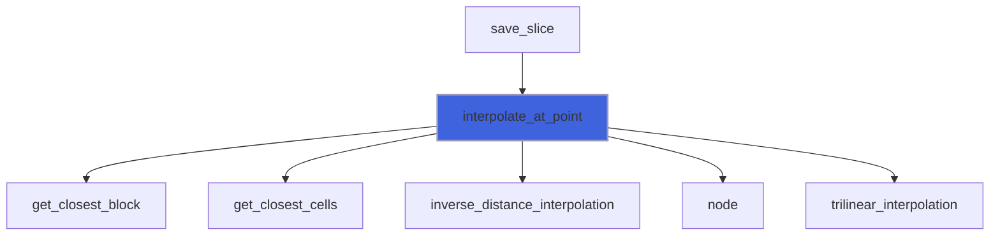

### make_comm_local_maps_ghost_bc

Make communication/local maps of ghost cells and boundary conditions.

```fortran
subroutine make_comm_local_maps_ghost_bc(self)
```

**Arguments**

| Name | Type | Intent | Attributes | Description |
|------|------|--------|------------|-------------|
| `self` | class([adam_object](/api/src/lib/common/adam_adam_object#adam-object)) | inout |  | ADAM. |

**Call graph**

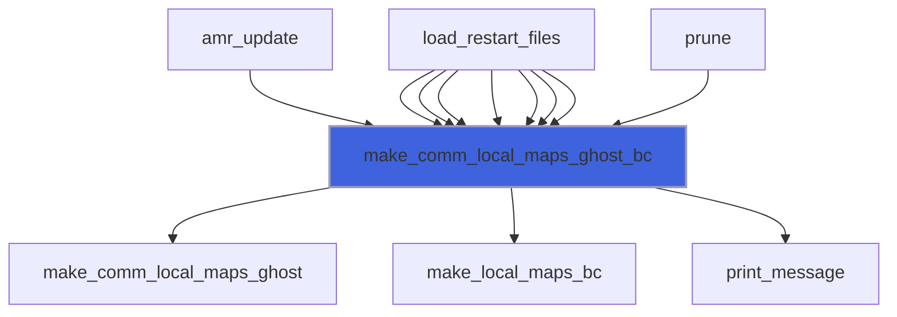

### mpi_gather_refinement_needed

Gather refinement needed.

```fortran
subroutine mpi_gather_refinement_needed(self, is_marked_by_field, is_marked_by_tree)
```

**Arguments**

| Name | Type | Intent | Attributes | Description |
|------|------|--------|------------|-------------|
| `self` | class([adam_object](/api/src/lib/common/adam_adam_object#adam-object)) | inout |  | ADAM. |
| `is_marked_by_field` | logical | in | optional | Flag to check if marker is field. |
| `is_marked_by_tree` | logical | in | optional | Flag to check if marker is tree. |

**Call graph**

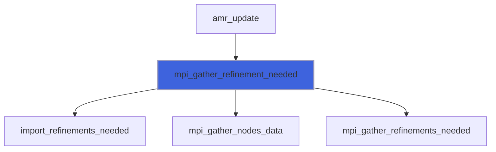

### mpi_redistribute

Redistribute nodes/blocks to processes, load balancing.

```fortran
subroutine mpi_redistribute(self, q)
```

**Arguments**

| Name | Type | Intent | Attributes | Description |
|------|------|--------|------------|-------------|
| `self` | class([adam_object](/api/src/lib/common/adam_adam_object#adam-object)) | inout |  | ADAM. |
| `q` | real(kind=[R8P](/api/src/third_party/PENF/src/lib/penf_global_parameters_variables)) | inout |  | Field cell centered variables. |

**Call graph**

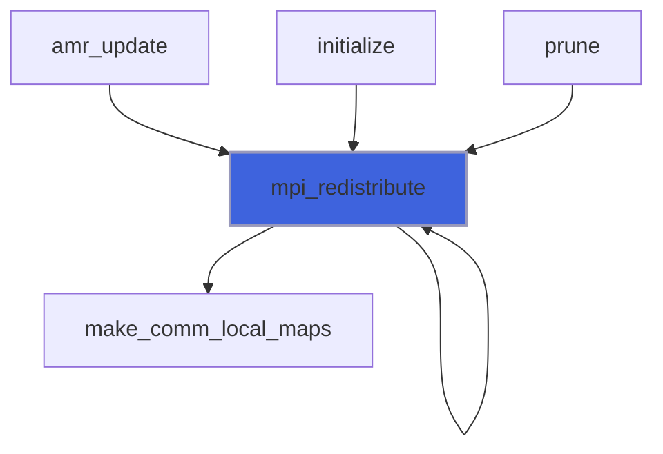

### prune

Prune nodes/blocks.

```fortran
subroutine prune(self, q, ijkl_prune, do_blocks_reorder)
```

**Arguments**

| Name | Type | Intent | Attributes | Description |
|------|------|--------|------------|-------------|
| `self` | class([adam_object](/api/src/lib/common/adam_adam_object#adam-object)) | inout |  | Adam. |
| `q` | real(kind=[R8P](/api/src/third_party/PENF/src/lib/penf_global_parameters_variables)) | inout |  | Field cell centered variables. |
| `ijkl_prune` | integer(kind=[I4P](/api/src/third_party/PENF/src/lib/penf_global_parameters_variables)) | inout |  | Maximum coordinates after which the prune operates. |
| `do_blocks_reorder` | logical | in | optional | Flag to activate blocks reorder. |

**Call graph**

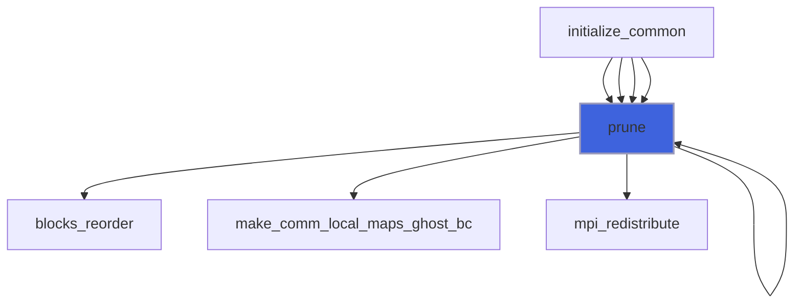

### refine_uniform

Refine all blocks uniformly.

```fortran
subroutine refine_uniform(self, refinement_levels, q, do_mpi_redistribute, do_blocks_reorder)
```

**Arguments**

| Name | Type | Intent | Attributes | Description |
|------|------|--------|------------|-------------|
| `self` | class([adam_object](/api/src/lib/common/adam_adam_object#adam-object)) | inout |  | Adam. |
| `refinement_levels` | integer(kind=[I4P](/api/src/third_party/PENF/src/lib/penf_global_parameters_variables)) | in |  | Number of refinement to be performed. |
| `q` | real(kind=[R8P](/api/src/third_party/PENF/src/lib/penf_global_parameters_variables)) | inout |  | Field cell centered variables. |
| `do_mpi_redistribute` | logical | in | optional | Flag to activate MPI redistribute. |
| `do_blocks_reorder` | logical | in | optional | Flag to activate blocks reorder. |

**Call graph**

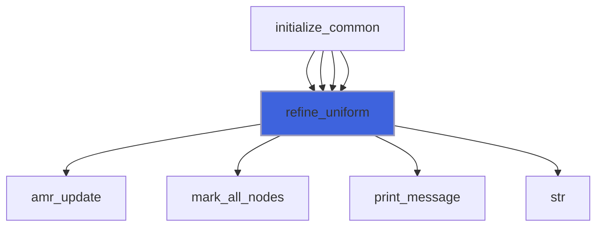

### save_restart_files

Save restart files.

```fortran
subroutine save_restart_files(self, basename, t, time, q)
```

**Arguments**

| Name | Type | Intent | Attributes | Description |
|------|------|--------|------------|-------------|
| `self` | class([adam_object](/api/src/lib/common/adam_adam_object#adam-object)) | in |  | ADAM. |
| `basename` | character(len=*) | in |  | Base name of output files. |
| `t` | integer(kind=[I4P](/api/src/third_party/PENF/src/lib/penf_global_parameters_variables)) | in |  | Time iteration. |
| `time` | real(kind=[R8P](/api/src/third_party/PENF/src/lib/penf_global_parameters_variables)) | in |  | Time. |
| `q` | real(kind=[R8P](/api/src/third_party/PENF/src/lib/penf_global_parameters_variables)) | in |  | Field cell centered variables. |

**Call graph**

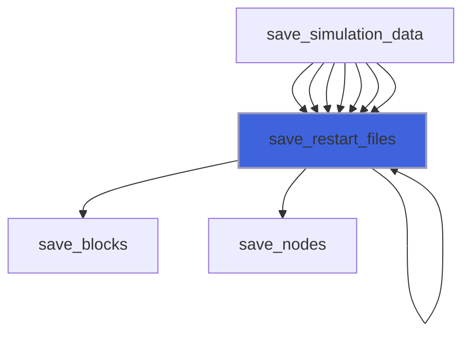

### save_hdf5

Save ADAM in HDF5 format.

```fortran
subroutine save_hdf5(self, basename, q, q_aux, q_name, q_aux_name, phi, directory, with_ghost, with_cell_morton, t, time)
```

**Arguments**

| Name | Type | Intent | Attributes | Description |
|------|------|--------|------------|-------------|
| `self` | class([adam_object](/api/src/lib/common/adam_adam_object#adam-object)) | inout |  | ADAM. |
| `basename` | character(len=*) | in |  | Base name of output files. |
| `q` | real(kind=[R8P](/api/src/third_party/PENF/src/lib/penf_global_parameters_variables)) | in |  | Q variables to be saved. |
| `q_aux` | real(kind=[R8P](/api/src/third_party/PENF/src/lib/penf_global_parameters_variables)) | in | optional | Q auxiliary variables to be saved. |
| `q_name` | character(len=*) | in | optional | Q variables names. |
| `q_aux_name` | character(len=*) | in | optional | Q auxiliary variables names. |
| `phi` | real(kind=[R8P](/api/src/third_party/PENF/src/lib/penf_global_parameters_variables)) | in | optional | (IB) distance function. |
| `directory` | character(len=*) | in | optional | Directory name of output files. |
| `with_ghost` | logical | in | optional | Flag to save ghost cells. |
| `with_cell_morton` | logical | in | optional | Flag to save Morton code also in cells. |
| `t` | integer(kind=[I4P](/api/src/third_party/PENF/src/lib/penf_global_parameters_variables)) | in | optional | Time iteration. |
| `time` | real(kind=[R8P](/api/src/third_party/PENF/src/lib/penf_global_parameters_variables)) | in | optional | Time. |

**Call graph**

```mermaid
flowchart TD
  save_hdf5["save_hdf5"] --> save_hdf5["save_hdf5"]
  save_hdf5["save_hdf5"] --> save_hdf5["save_hdf5"]
  save_hdf5["save_hdf5"] --> save_hdf5["save_hdf5"]
  save_hdf5["save_hdf5"] --> save_hdf5["save_hdf5"]
  save_restart_files["save_restart_files"] --> save_hdf5["save_hdf5"]
  save_restart_files["save_restart_files"] --> save_hdf5["save_hdf5"]
  save_restart_files["save_restart_files"] --> save_hdf5["save_hdf5"]
  save_restart_files["save_restart_files"] --> save_hdf5["save_hdf5"]
  save_simulation_data["save_simulation_data"] --> save_hdf5["save_hdf5"]
  save_simulation_data["save_simulation_data"] --> save_hdf5["save_hdf5"]
  save_simulation_data["save_simulation_data"] --> save_hdf5["save_hdf5"]
  save_simulation_data["save_simulation_data"] --> save_hdf5["save_hdf5"]
  save_hdf5["save_hdf5"] --> close_hdf5["close_hdf5"]
  save_hdf5["save_hdf5"] --> close_xdmf["close_xdmf"]
  save_hdf5["save_hdf5"] --> codes["codes"]
  save_hdf5["save_hdf5"] --> compute_metrics["compute_metrics"]
  save_hdf5["save_hdf5"] --> level["level"]
  save_hdf5["save_hdf5"] --> morton_to_coordinates["morton_to_coordinates"]
  save_hdf5["save_hdf5"] --> node["node"]
  save_hdf5["save_hdf5"] --> open_hdf5["open_hdf5"]
  save_hdf5["save_hdf5"] --> open_xdmf["open_xdmf"]
  save_hdf5["save_hdf5"] --> save_hdf5_block["save_hdf5_block"]
  save_hdf5["save_hdf5"] --> save_xdmf_block["save_xdmf_block"]
  save_hdf5["save_hdf5"] --> str["str"]
  save_hdf5["save_hdf5"] --> strz["strz"]
  style save_hdf5 fill:#3e63dd,stroke:#99b,stroke-width:2px
```

### save_slice

Save slice.

```fortran
subroutine save_slice(self, itype, points, basename, q, q_name, phi, t, time)
```

**Arguments**

| Name | Type | Intent | Attributes | Description |
|------|------|--------|------------|-------------|
| `self` | class([adam_object](/api/src/lib/common/adam_adam_object#adam-object)) | inout |  | ADAM. |
| `itype` | character(len=*) | in |  | Type of interpolation. |
| `points` | real(kind=[R8P](/api/src/third_party/PENF/src/lib/penf_global_parameters_variables)) | in |  | Interpolation points coordinates [1:3,1:ni,1:nj,1:nk]. |
| `basename` | character(len=*) | in |  | Base name of output files. |
| `q` | real(kind=[R8P](/api/src/third_party/PENF/src/lib/penf_global_parameters_variables)) | in |  | Q variables to be saved. |
| `q_name` | character(len=*) | in | optional | Variables names. |
| `phi` | real(kind=[R8P](/api/src/third_party/PENF/src/lib/penf_global_parameters_variables)) | in | optional | Distance function. |
| `t` | integer(kind=[I4P](/api/src/third_party/PENF/src/lib/penf_global_parameters_variables)) | in | optional | Time iteration. |
| `time` | real(kind=[R8P](/api/src/third_party/PENF/src/lib/penf_global_parameters_variables)) | in | optional | Time. |

**Call graph**

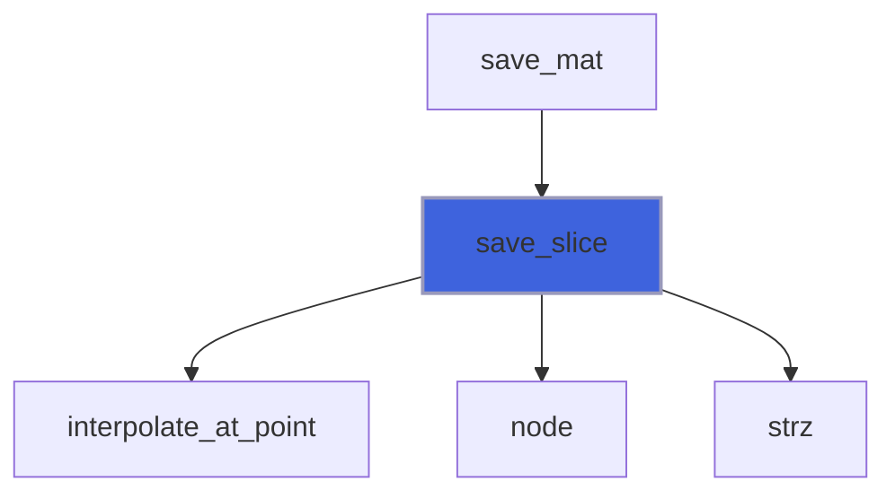

### save_vtk

Save ADAM in VTK files.

```fortran
subroutine save_vtk(self, basename, q, q_aux, q_name, q_aux_name, directory, with_ghost, with_cell_morton, t, time)
```

**Arguments**

| Name | Type | Intent | Attributes | Description |
|------|------|--------|------------|-------------|
| `self` | class([adam_object](/api/src/lib/common/adam_adam_object#adam-object)) | inout |  | ADAM. |
| `basename` | character(len=*) | in |  | Base name of output files. |
| `q` | real(kind=[R8P](/api/src/third_party/PENF/src/lib/penf_global_parameters_variables)) | in |  | Q variables to be saved. |
| `q_aux` | real(kind=[R8P](/api/src/third_party/PENF/src/lib/penf_global_parameters_variables)) | in | optional | Q auxiliary variables to be saved. |
| `q_name` | character(len=*) | in | optional | Variables names. |
| `q_aux_name` | character(len=*) | in | optional | Q auxiliary variables names. |
| `directory` | character(len=*) | in | optional | Output directory name. |
| `with_ghost` | logical | in | optional | Flag to save ghost cells. |
| `with_cell_morton` | logical | in | optional | Flag to save Morton code in cells. |
| `t` | integer(kind=[I4P](/api/src/third_party/PENF/src/lib/penf_global_parameters_variables)) | in | optional | Time iteration. |
| `time` | real(kind=[R8P](/api/src/third_party/PENF/src/lib/penf_global_parameters_variables)) | in | optional | Time. |

**Call graph**

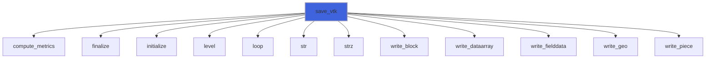

### save_xh5f

Save ADAM in XH5F format.

```fortran
subroutine save_xh5f(self, basename, q, q_name, directory, with_ghost, with_cell_morton, t, time, q_a1, q_a1_name, q_a2, q_a2_name, q_a3, q_a3_name, s_a1, s_a1_name, s_a2, s_a2_name, s_a3, s_a3_name)
```

**Arguments**

| Name | Type | Intent | Attributes | Description |
|------|------|--------|------------|-------------|
| `self` | class([adam_object](/api/src/lib/common/adam_adam_object#adam-object)) | inout |  | ADAM. |
| `basename` | character(len=*) | in |  | Base name of output files. |
| `q` | real(kind=[R8P](/api/src/third_party/PENF/src/lib/penf_global_parameters_variables)) | in |  | Q-vector variables [nv,ni,nj,nk,nb]. |
| `q_name` | character(len=*) | in | optional | Q-vector variables names [nv]. |
| `directory` | character(len=*) | in | optional | Directory name of output files. |
| `with_ghost` | logical | in | optional | Flag to save ghost cells. |
| `with_cell_morton` | logical | in | optional | Flag to save Morton code also in cells. |
| `t` | integer(kind=[I4P](/api/src/third_party/PENF/src/lib/penf_global_parameters_variables)) | in | optional | Time iteration. |
| `time` | real(kind=[R8P](/api/src/third_party/PENF/src/lib/penf_global_parameters_variables)) | in | optional | Time. |
| `q_a1` | real(kind=[R8P](/api/src/third_party/PENF/src/lib/penf_global_parameters_variables)) | in | optional | Q-vector auxiliary 1 variables [nv,ni,nj,nk,nb]. |
| `q_a1_name` | character(len=*) | in | optional | Q-vector auxiliary 1 variables names [nv]. |
| `q_a2` | real(kind=[R8P](/api/src/third_party/PENF/src/lib/penf_global_parameters_variables)) | in | optional | Q-vector auxiliary 2 variables [nv,ni,nj,nk,nb]. |
| `q_a2_name` | character(len=*) | in | optional | Q-vector auxiliary 2 variables names [nv]. |
| `q_a3` | real(kind=[R8P](/api/src/third_party/PENF/src/lib/penf_global_parameters_variables)) | in | optional | Q-vector auxiliary 3 variables [nv,ni,nj,nk,nb]. |
| `q_a3_name` | character(len=*) | in | optional | Q-vector auxiliary 3 variables names [nv]. |
| `s_a1` | real(kind=[R8P](/api/src/third_party/PENF/src/lib/penf_global_parameters_variables)) | in | optional | Scalar   auxiliary 1 variable [ni,nj,nk,nb]. |
| `s_a1_name` | character(len=*) | in | optional | Scalar   auxiliary 1 variable name. |
| `s_a2` | real(kind=[R8P](/api/src/third_party/PENF/src/lib/penf_global_parameters_variables)) | in | optional | Scalar   auxiliary 2 variable [ni,nj,nk,nb]. |
| `s_a2_name` | character(len=*) | in | optional | Scalar   auxiliary 2 variable name. |
| `s_a3` | real(kind=[R8P](/api/src/third_party/PENF/src/lib/penf_global_parameters_variables)) | in | optional | Scalar   auxiliary 3 variable [ni,nj,nk,nb]. |
| `s_a3_name` | character(len=*) | in | optional | Scalar   auxiliary 3 variable name. |

**Call graph**

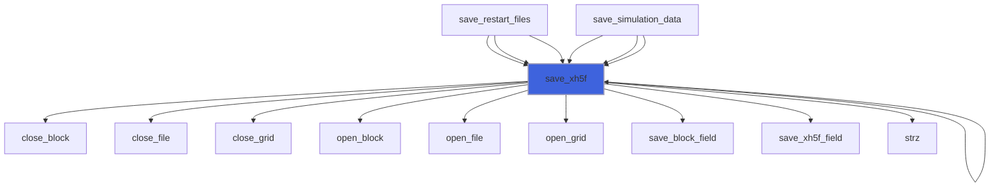

### save_xh5f_field_3D_R8P

Save q-vector/s-scalar fields by XH5F file handler, rank 3, kind R8P.

```fortran
subroutine save_xh5f_field_3D_R8P(self, xh5f, block_name, ijk, nijk, q, q_name)
```

**Arguments**

| Name | Type | Intent | Attributes | Description |
|------|------|--------|------------|-------------|
| `self` | class([adam_object](/api/src/lib/common/adam_adam_object#adam-object)) | inout |  | ADAM. |
| `xh5f` | type([xh5f_file_object](/api/src/third_party/MOTIOn/src/lib/motion_xh5f_file_object#xh5f-file-object)) | inout |  | XH5F file handler. |
| `block_name` | character(len=*) | in |  | Block name. |
| `ijk` | integer(kind=[I4P](/api/src/third_party/PENF/src/lib/penf_global_parameters_variables)) | in |  | Blocks extents. |
| `nijk` | integer(kind=[I8P](/api/src/third_party/PENF/src/lib/penf_global_parameters_variables)) | in |  | Blocks dimensions. |
| `q` | real(kind=[R8P](/api/src/third_party/PENF/src/lib/penf_global_parameters_variables)) | in |  | Scalar field [ni,nj,nk]. |
| `q_name` | character(len=*) | in | optional | Scalar field name. |

**Call graph**

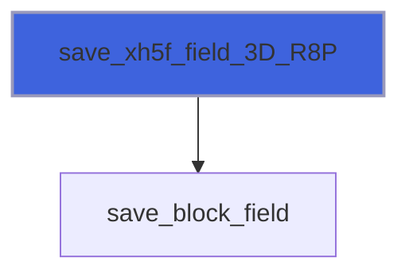

### save_xh5f_field_4D_R8P

Save q-vector/s-scalar fields by XH5F file handler, rank 4, kind R8P.

```fortran
subroutine save_xh5f_field_4D_R8P(self, xh5f, block_name, ijk, nijk, q, q_name)
```

**Arguments**

| Name | Type | Intent | Attributes | Description |
|------|------|--------|------------|-------------|
| `self` | class([adam_object](/api/src/lib/common/adam_adam_object#adam-object)) | inout |  | ADAM. |
| `xh5f` | type([xh5f_file_object](/api/src/third_party/MOTIOn/src/lib/motion_xh5f_file_object#xh5f-file-object)) | inout |  | XH5F file handler. |
| `block_name` | character(len=*) | in |  | Block name. |
| `ijk` | integer(kind=[I4P](/api/src/third_party/PENF/src/lib/penf_global_parameters_variables)) | in |  | Blocks extents. |
| `nijk` | integer(kind=[I8P](/api/src/third_party/PENF/src/lib/penf_global_parameters_variables)) | in |  | Blocks dimensions. |
| `q` | real(kind=[R8P](/api/src/third_party/PENF/src/lib/penf_global_parameters_variables)) | in |  | Vector fields [nv,ni,nj,nk]. |
| `q_name` | character(len=*) | in | optional | Vector fields names [nv]. |

**Call graph**

```mermaid
flowchart TD
  save_xh5f_field_4D_R8P["save_xh5f_field_4D_R8P"] --> save_block_field["save_block_field"]
  save_xh5f_field_4D_R8P["save_xh5f_field_4D_R8P"] --> strz["strz"]
  style save_xh5f_field_4D_R8P fill:#3e63dd,stroke:#99b,stroke-width:2px
```

### save_xh5f_field_3D_R4P

Save q-vector/s-scalar fields by XH5F file handler, rank 3, kind R4P.

```fortran
subroutine save_xh5f_field_3D_R4P(self, xh5f, block_name, ijk, nijk, q, q_name)
```

**Arguments**

| Name | Type | Intent | Attributes | Description |
|------|------|--------|------------|-------------|
| `self` | class([adam_object](/api/src/lib/common/adam_adam_object#adam-object)) | inout |  | ADAM. |
| `xh5f` | type([xh5f_file_object](/api/src/third_party/MOTIOn/src/lib/motion_xh5f_file_object#xh5f-file-object)) | inout |  | XH5F file handler. |
| `block_name` | character(len=*) | in |  | Block name. |
| `ijk` | integer(kind=[I4P](/api/src/third_party/PENF/src/lib/penf_global_parameters_variables)) | in |  | Blocks extents. |
| `nijk` | integer(kind=[I8P](/api/src/third_party/PENF/src/lib/penf_global_parameters_variables)) | in |  | Blocks dimensions. |
| `q` | real(kind=[R4P](/api/src/third_party/PENF/src/lib/penf_global_parameters_variables)) | in |  | Scalar field [ni,nj,nk]. |
| `q_name` | character(len=*) | in | optional | Scalar field name. |

**Call graph**

```mermaid
flowchart TD
  save_xh5f_field_3D_R4P["save_xh5f_field_3D_R4P"] --> save_block_field["save_block_field"]
  style save_xh5f_field_3D_R4P fill:#3e63dd,stroke:#99b,stroke-width:2px
```

### save_xh5f_field_4D_R4P

Save q-vector/s-scalar fields by XH5F file handler, rank 4, kind R4P.

```fortran
subroutine save_xh5f_field_4D_R4P(self, xh5f, block_name, ijk, nijk, q, q_name)
```

**Arguments**

| Name | Type | Intent | Attributes | Description |
|------|------|--------|------------|-------------|
| `self` | class([adam_object](/api/src/lib/common/adam_adam_object#adam-object)) | inout |  | ADAM. |
| `xh5f` | type([xh5f_file_object](/api/src/third_party/MOTIOn/src/lib/motion_xh5f_file_object#xh5f-file-object)) | inout |  | XH5F file handler. |
| `block_name` | character(len=*) | in |  | Block name. |
| `ijk` | integer(kind=[I4P](/api/src/third_party/PENF/src/lib/penf_global_parameters_variables)) | in |  | Blocks extents. |
| `nijk` | integer(kind=[I8P](/api/src/third_party/PENF/src/lib/penf_global_parameters_variables)) | in |  | Blocks dimensions. |
| `q` | real(kind=[R4P](/api/src/third_party/PENF/src/lib/penf_global_parameters_variables)) | in |  | Vector fields [nv,ni,nj,nk]. |
| `q_name` | character(len=*) | in | optional | Vector fields names [nv]. |

**Call graph**

```mermaid
flowchart TD
  save_xh5f_field_4D_R4P["save_xh5f_field_4D_R4P"] --> save_block_field["save_block_field"]
  save_xh5f_field_4D_R4P["save_xh5f_field_4D_R4P"] --> strz["strz"]
  style save_xh5f_field_4D_R4P fill:#3e63dd,stroke:#99b,stroke-width:2px
```

### save_xh5f_field_3D_I8P

Save q-vector/s-scalar fields by XH5F file handler, rank 3, kind I8P.

```fortran
subroutine save_xh5f_field_3D_I8P(self, xh5f, block_name, ijk, nijk, q, q_name)
```

**Arguments**

| Name | Type | Intent | Attributes | Description |
|------|------|--------|------------|-------------|
| `self` | class([adam_object](/api/src/lib/common/adam_adam_object#adam-object)) | inout |  | ADAM. |
| `xh5f` | type([xh5f_file_object](/api/src/third_party/MOTIOn/src/lib/motion_xh5f_file_object#xh5f-file-object)) | inout |  | XH5F file handler. |
| `block_name` | character(len=*) | in |  | Block name. |
| `ijk` | integer(kind=[I4P](/api/src/third_party/PENF/src/lib/penf_global_parameters_variables)) | in |  | Blocks extents. |
| `nijk` | integer(kind=[I8P](/api/src/third_party/PENF/src/lib/penf_global_parameters_variables)) | in |  | Blocks dimensions. |
| `q` | integer(kind=[I8P](/api/src/third_party/PENF/src/lib/penf_global_parameters_variables)) | in |  | Scalar field [ni,nj,nk]. |
| `q_name` | character(len=*) | in | optional | Scalar field name. |

**Call graph**

```mermaid
flowchart TD
  save_xh5f_field_3D_I8P["save_xh5f_field_3D_I8P"] --> save_block_field["save_block_field"]
  style save_xh5f_field_3D_I8P fill:#3e63dd,stroke:#99b,stroke-width:2px
```

### save_xh5f_field_4D_I8P

Save q-vector/s-scalar fields by XH5F file handler, rank 4, kind I8P.

```fortran
subroutine save_xh5f_field_4D_I8P(self, xh5f, block_name, ijk, nijk, q, q_name)
```

**Arguments**

| Name | Type | Intent | Attributes | Description |
|------|------|--------|------------|-------------|
| `self` | class([adam_object](/api/src/lib/common/adam_adam_object#adam-object)) | inout |  | ADAM. |
| `xh5f` | type([xh5f_file_object](/api/src/third_party/MOTIOn/src/lib/motion_xh5f_file_object#xh5f-file-object)) | inout |  | XH5F file handler. |
| `block_name` | character(len=*) | in |  | Block name. |
| `ijk` | integer(kind=[I4P](/api/src/third_party/PENF/src/lib/penf_global_parameters_variables)) | in |  | Blocks extents. |
| `nijk` | integer(kind=[I8P](/api/src/third_party/PENF/src/lib/penf_global_parameters_variables)) | in |  | Blocks dimensions. |
| `q` | integer(kind=[I8P](/api/src/third_party/PENF/src/lib/penf_global_parameters_variables)) | in |  | Vector fields [nv,ni,nj,nk]. |
| `q_name` | character(len=*) | in | optional | Vector fields names [nv]. |

**Call graph**

```mermaid
flowchart TD
  save_xh5f_field_4D_I8P["save_xh5f_field_4D_I8P"] --> save_block_field["save_block_field"]
  save_xh5f_field_4D_I8P["save_xh5f_field_4D_I8P"] --> strz["strz"]
  style save_xh5f_field_4D_I8P fill:#3e63dd,stroke:#99b,stroke-width:2px
```

### save_xh5f_field_3D_I4P

Save q-vector/s-scalar fields by XH5F file handler, rank 3, kind I4P.

```fortran
subroutine save_xh5f_field_3D_I4P(self, xh5f, block_name, ijk, nijk, q, q_name)
```

**Arguments**

| Name | Type | Intent | Attributes | Description |
|------|------|--------|------------|-------------|
| `self` | class([adam_object](/api/src/lib/common/adam_adam_object#adam-object)) | inout |  | ADAM. |
| `xh5f` | type([xh5f_file_object](/api/src/third_party/MOTIOn/src/lib/motion_xh5f_file_object#xh5f-file-object)) | inout |  | XH5F file handler. |
| `block_name` | character(len=*) | in |  | Block name. |
| `ijk` | integer(kind=[I4P](/api/src/third_party/PENF/src/lib/penf_global_parameters_variables)) | in |  | Blocks extents. |
| `nijk` | integer(kind=[I8P](/api/src/third_party/PENF/src/lib/penf_global_parameters_variables)) | in |  | Blocks dimensions. |
| `q` | integer(kind=[I4P](/api/src/third_party/PENF/src/lib/penf_global_parameters_variables)) | in |  | Scalar field [ni,nj,nk]. |
| `q_name` | character(len=*) | in | optional | Scalar field name. |

**Call graph**

```mermaid
flowchart TD
  save_xh5f_field_3D_I4P["save_xh5f_field_3D_I4P"] --> save_block_field["save_block_field"]
  style save_xh5f_field_3D_I4P fill:#3e63dd,stroke:#99b,stroke-width:2px
```

### save_xh5f_field_4D_I4P

Save q-vector/s-scalar fields by XH5F file handler, rank 4, kind I4P.

```fortran
subroutine save_xh5f_field_4D_I4P(self, xh5f, block_name, ijk, nijk, q, q_name)
```

**Arguments**

| Name | Type | Intent | Attributes | Description |
|------|------|--------|------------|-------------|
| `self` | class([adam_object](/api/src/lib/common/adam_adam_object#adam-object)) | inout |  | ADAM. |
| `xh5f` | type([xh5f_file_object](/api/src/third_party/MOTIOn/src/lib/motion_xh5f_file_object#xh5f-file-object)) | inout |  | XH5F file handler. |
| `block_name` | character(len=*) | in |  | Block name. |
| `ijk` | integer(kind=[I4P](/api/src/third_party/PENF/src/lib/penf_global_parameters_variables)) | in |  | Blocks extents. |
| `nijk` | integer(kind=[I8P](/api/src/third_party/PENF/src/lib/penf_global_parameters_variables)) | in |  | Blocks dimensions. |
| `q` | integer(kind=[I4P](/api/src/third_party/PENF/src/lib/penf_global_parameters_variables)) | in |  | Vector fields [nv,ni,nj,nk]. |
| `q_name` | character(len=*) | in | optional | Vector fields names [nv]. |

**Call graph**

```mermaid
flowchart TD
  save_xh5f_field_4D_I4P["save_xh5f_field_4D_I4P"] --> save_block_field["save_block_field"]
  save_xh5f_field_4D_I4P["save_xh5f_field_4D_I4P"] --> strz["strz"]
  style save_xh5f_field_4D_I4P fill:#3e63dd,stroke:#99b,stroke-width:2px
```

### save_xh5f_field_3D_I2P

Save q-vector/s-scalar fields by XH5F file handler, rank 3, kind I2P.

```fortran
subroutine save_xh5f_field_3D_I2P(self, xh5f, block_name, ijk, nijk, q, q_name)
```

**Arguments**

| Name | Type | Intent | Attributes | Description |
|------|------|--------|------------|-------------|
| `self` | class([adam_object](/api/src/lib/common/adam_adam_object#adam-object)) | inout |  | ADAM. |
| `xh5f` | type([xh5f_file_object](/api/src/third_party/MOTIOn/src/lib/motion_xh5f_file_object#xh5f-file-object)) | inout |  | XH5F file handler. |
| `block_name` | character(len=*) | in |  | Block name. |
| `ijk` | integer(kind=[I4P](/api/src/third_party/PENF/src/lib/penf_global_parameters_variables)) | in |  | Blocks extents. |
| `nijk` | integer(kind=[I8P](/api/src/third_party/PENF/src/lib/penf_global_parameters_variables)) | in |  | Blocks dimensions. |
| `q` | integer(kind=[I2P](/api/src/third_party/PENF/src/lib/penf_global_parameters_variables)) | in |  | Scalar field [ni,nj,nk]. |
| `q_name` | character(len=*) | in | optional | Scalar field name. |

**Call graph**

```mermaid
flowchart TD
  save_xh5f_field_3D_I2P["save_xh5f_field_3D_I2P"] --> save_block_field["save_block_field"]
  style save_xh5f_field_3D_I2P fill:#3e63dd,stroke:#99b,stroke-width:2px
```

### save_xh5f_field_4D_I2P

Save q-vector/s-scalar fields by XH5F file handler, rank 4, kind I2P.

```fortran
subroutine save_xh5f_field_4D_I2P(self, xh5f, block_name, ijk, nijk, q, q_name)
```

**Arguments**

| Name | Type | Intent | Attributes | Description |
|------|------|--------|------------|-------------|
| `self` | class([adam_object](/api/src/lib/common/adam_adam_object#adam-object)) | inout |  | ADAM. |
| `xh5f` | type([xh5f_file_object](/api/src/third_party/MOTIOn/src/lib/motion_xh5f_file_object#xh5f-file-object)) | inout |  | XH5F file handler. |
| `block_name` | character(len=*) | in |  | Block name. |
| `ijk` | integer(kind=[I4P](/api/src/third_party/PENF/src/lib/penf_global_parameters_variables)) | in |  | Blocks extents. |
| `nijk` | integer(kind=[I8P](/api/src/third_party/PENF/src/lib/penf_global_parameters_variables)) | in |  | Blocks dimensions. |
| `q` | integer(kind=[I2P](/api/src/third_party/PENF/src/lib/penf_global_parameters_variables)) | in |  | Vector fields [nv,ni,nj,nk]. |
| `q_name` | character(len=*) | in | optional | Vector fields names [nv]. |

**Call graph**

```mermaid
flowchart TD
  save_xh5f_field_4D_I2P["save_xh5f_field_4D_I2P"] --> save_block_field["save_block_field"]
  save_xh5f_field_4D_I2P["save_xh5f_field_4D_I2P"] --> strz["strz"]
  style save_xh5f_field_4D_I2P fill:#3e63dd,stroke:#99b,stroke-width:2px
```

### save_xh5f_field_3D_I1P

Save q-vector/s-scalar fields by XH5F file handler, rank 3, kind I1P.

```fortran
subroutine save_xh5f_field_3D_I1P(self, xh5f, block_name, ijk, nijk, q, q_name)
```

**Arguments**

| Name | Type | Intent | Attributes | Description |
|------|------|--------|------------|-------------|
| `self` | class([adam_object](/api/src/lib/common/adam_adam_object#adam-object)) | inout |  | ADAM. |
| `xh5f` | type([xh5f_file_object](/api/src/third_party/MOTIOn/src/lib/motion_xh5f_file_object#xh5f-file-object)) | inout |  | XH5F file handler. |
| `block_name` | character(len=*) | in |  | Block name. |
| `ijk` | integer(kind=[I4P](/api/src/third_party/PENF/src/lib/penf_global_parameters_variables)) | in |  | Blocks extents. |
| `nijk` | integer(kind=[I8P](/api/src/third_party/PENF/src/lib/penf_global_parameters_variables)) | in |  | Blocks dimensions. |
| `q` | integer(kind=[I1P](/api/src/third_party/PENF/src/lib/penf_global_parameters_variables)) | in |  | Scalar field [ni,nj,nk]. |
| `q_name` | character(len=*) | in | optional | Scalar field name. |

**Call graph**

```mermaid
flowchart TD
  save_xh5f_field_3D_I1P["save_xh5f_field_3D_I1P"] --> save_block_field["save_block_field"]
  style save_xh5f_field_3D_I1P fill:#3e63dd,stroke:#99b,stroke-width:2px
```

### save_xh5f_field_4D_I1P

Save q-vector/s-scalar fields by XH5F file handler, rank 4, kind I1P.

```fortran
subroutine save_xh5f_field_4D_I1P(self, xh5f, block_name, ijk, nijk, q, q_name)
```

**Arguments**

| Name | Type | Intent | Attributes | Description |
|------|------|--------|------------|-------------|
| `self` | class([adam_object](/api/src/lib/common/adam_adam_object#adam-object)) | inout |  | ADAM. |
| `xh5f` | type([xh5f_file_object](/api/src/third_party/MOTIOn/src/lib/motion_xh5f_file_object#xh5f-file-object)) | inout |  | XH5F file handler. |
| `block_name` | character(len=*) | in |  | Block name. |
| `ijk` | integer(kind=[I4P](/api/src/third_party/PENF/src/lib/penf_global_parameters_variables)) | in |  | Blocks extents. |
| `nijk` | integer(kind=[I8P](/api/src/third_party/PENF/src/lib/penf_global_parameters_variables)) | in |  | Blocks dimensions. |
| `q` | integer(kind=[I1P](/api/src/third_party/PENF/src/lib/penf_global_parameters_variables)) | in |  | Vector fields [nv,ni,nj,nk]. |
| `q_name` | character(len=*) | in | optional | Vector fields names [nv]. |

**Call graph**

```mermaid
flowchart TD
  save_xh5f_field_4D_I1P["save_xh5f_field_4D_I1P"] --> save_block_field["save_block_field"]
  save_xh5f_field_4D_I1P["save_xh5f_field_4D_I1P"] --> strz["strz"]
  style save_xh5f_field_4D_I1P fill:#3e63dd,stroke:#99b,stroke-width:2px
```

### close_hdf5

Close HDF5 file.

```fortran
subroutine close_hdf5(h5_file_id, h5_dspace_id)
```

**Arguments**

| Name | Type | Intent | Attributes | Description |
|------|------|--------|------------|-------------|
| `h5_file_id` | integer(kind=[HID_T](/api/src/third_party/MOTIOn/lib/hdf5/1.14.6/gnu/14.2.0/include/H5FORTRAN_TYPES)) | in |  | H5 File identifier. |
| `h5_dspace_id` | integer(kind=[HID_T](/api/src/third_party/MOTIOn/lib/hdf5/1.14.6/gnu/14.2.0/include/H5FORTRAN_TYPES)) | in |  | H5 Dataspace identifier. |

**Call graph**

```mermaid
flowchart TD
  save_hdf5["save_hdf5"] --> close_hdf5["close_hdf5"]
  style close_hdf5 fill:#3e63dd,stroke:#99b,stroke-width:2px
```

### open_hdf5

Open HDF5 file.

```fortran
subroutine open_hdf5(h5_file_name, ni, nj, nk, h5_file_id, h5_dspace_id)
```

**Arguments**

| Name | Type | Intent | Attributes | Description |
|------|------|--------|------------|-------------|
| `h5_file_name` | character(len=*) | in |  | H5 file name. |
| `ni` | integer(kind=[I8P](/api/src/third_party/PENF/src/lib/penf_global_parameters_variables)) | in |  | Blocks dimensions. |
| `nj` | integer(kind=[I8P](/api/src/third_party/PENF/src/lib/penf_global_parameters_variables)) | in |  | Blocks dimensions. |
| `nk` | integer(kind=[I8P](/api/src/third_party/PENF/src/lib/penf_global_parameters_variables)) | in |  | Blocks dimensions. |
| `h5_file_id` | integer(kind=[HID_T](/api/src/third_party/MOTIOn/lib/hdf5/1.14.6/gnu/14.2.0/include/H5FORTRAN_TYPES)) | out |  | H5 File identifier. |
| `h5_dspace_id` | integer(kind=[HID_T](/api/src/third_party/MOTIOn/lib/hdf5/1.14.6/gnu/14.2.0/include/H5FORTRAN_TYPES)) | out |  | H5 Dataspace identifier. |

**Call graph**

```mermaid
flowchart TD
  save_hdf5["save_hdf5"] --> open_hdf5["open_hdf5"]
  style open_hdf5 fill:#3e63dd,stroke:#99b,stroke-width:2px
```

### save_hdf5_block

Save block into HDF5 file.

```fortran
subroutine save_hdf5_block(h5_file_id, h5_dspace_id, myrank, code, block_index, ii, jj, kk, q, q_name, with_cell_morton, q_aux_name, q_aux, phi)
```

**Arguments**

| Name | Type | Intent | Attributes | Description |
|------|------|--------|------------|-------------|
| `h5_file_id` | integer(kind=[HID_T](/api/src/third_party/MOTIOn/lib/hdf5/1.14.6/gnu/14.2.0/include/H5FORTRAN_TYPES)) | in |  | H5 File identifier. |
| `h5_dspace_id` | integer(kind=[HID_T](/api/src/third_party/MOTIOn/lib/hdf5/1.14.6/gnu/14.2.0/include/H5FORTRAN_TYPES)) | in |  | H5 Dataspace identifier. |
| `myrank` | integer(kind=[I4P](/api/src/third_party/PENF/src/lib/penf_global_parameters_variables)) | in |  | MPI rank process. |
| `code` | integer(kind=[I8P](/api/src/third_party/PENF/src/lib/penf_global_parameters_variables)) | in |  | Block Morton code. |
| `block_index` | integer(kind=[I8P](/api/src/third_party/PENF/src/lib/penf_global_parameters_variables)) | in |  | Block index. |
| `ii` | integer(kind=[I4P](/api/src/third_party/PENF/src/lib/penf_global_parameters_variables)) | in |  | First and last i indexes. |
| `jj` | integer(kind=[I4P](/api/src/third_party/PENF/src/lib/penf_global_parameters_variables)) | in |  | First and last j indexes. |
| `kk` | integer(kind=[I4P](/api/src/third_party/PENF/src/lib/penf_global_parameters_variables)) | in |  | First and last k indexes. |
| `q` | real(kind=[R8P](/api/src/third_party/PENF/src/lib/penf_global_parameters_variables)) | in |  | Q variables to be saved. |
| `q_name` | character(len=*) | in |  | Q variables names. |
| `with_cell_morton` | logical | in |  | Flag to save Morton code also in cells. |
| `q_aux_name` | character(len=*) | in |  | Q auxiliary variables names. |
| `q_aux` | real(kind=[R8P](/api/src/third_party/PENF/src/lib/penf_global_parameters_variables)) | in | optional | Q auxiliary variables to be saved. |
| `phi` | real(kind=[R8P](/api/src/third_party/PENF/src/lib/penf_global_parameters_variables)) | in | optional | (IB) distance function. |

**Call graph**

```mermaid
flowchart TD
  save_hdf5["save_hdf5"] --> save_hdf5_block["save_hdf5_block"]
  save_hdf5_block["save_hdf5_block"] --> str["str"]
  style save_hdf5_block fill:#3e63dd,stroke:#99b,stroke-width:2px
```

### close_xdmf

Close XDMF file.

```fortran
subroutine close_xdmf(file_unit)
```

**Arguments**

| Name | Type | Intent | Attributes | Description |
|------|------|--------|------------|-------------|
| `file_unit` | integer(kind=[I4P](/api/src/third_party/PENF/src/lib/penf_global_parameters_variables)) | in |  | XDMF file unit. |

**Call graph**

```mermaid
flowchart TD
  save_hdf5["save_hdf5"] --> close_xdmf["close_xdmf"]
  style close_xdmf fill:#3e63dd,stroke:#99b,stroke-width:2px
```

### open_xdmf

Open XDMF file.

```fortran
subroutine open_xdmf(file_name, file_unit)
```

**Arguments**

| Name | Type | Intent | Attributes | Description |
|------|------|--------|------------|-------------|
| `file_name` | character(len=*) | in |  | XDMF file name. |
| `file_unit` | integer(kind=[I4P](/api/src/third_party/PENF/src/lib/penf_global_parameters_variables)) | out |  | XDMF file unit. |

**Call graph**

```mermaid
flowchart TD
  save_hdf5["save_hdf5"] --> open_xdmf["open_xdmf"]
  style open_xdmf fill:#3e63dd,stroke:#99b,stroke-width:2px
```

### save_xdmf_block

Save XDMF block.

```fortran
subroutine save_xdmf_block(file_unit, h5_file_name, rank, code, block_index, emin, dxyz, nijk, q_name, with_cell_morton, q_aux_name, solids_number, t, time)
```

**Arguments**

| Name | Type | Intent | Attributes | Description |
|------|------|--------|------------|-------------|
| `file_unit` | integer(kind=[I4P](/api/src/third_party/PENF/src/lib/penf_global_parameters_variables)) | in |  | XDMF file unit. |
| `h5_file_name` | character(len=*) | in |  | H5 file name. |
| `rank` | integer(kind=[I4P](/api/src/third_party/PENF/src/lib/penf_global_parameters_variables)) | in |  | MPI rank. |
| `code` | integer(kind=[I8P](/api/src/third_party/PENF/src/lib/penf_global_parameters_variables)) | in |  | Block Morton code. |
| `block_index` | integer(kind=[I8P](/api/src/third_party/PENF/src/lib/penf_global_parameters_variables)) | in |  | Block index. |
| `emin` | real(kind=[R8P](/api/src/third_party/PENF/src/lib/penf_global_parameters_variables)) | in |  | Block minimum extents. |
| `dxyz` | real(kind=[R8P](/api/src/third_party/PENF/src/lib/penf_global_parameters_variables)) | in |  | Block space steps. |
| `nijk` | integer(kind=[I4P](/api/src/third_party/PENF/src/lib/penf_global_parameters_variables)) | in |  | Block dimensions. |
| `q_name` | character(len=*) | in |  | Q variables names. |
| `with_cell_morton` | logical | in |  | Flag to save Morton code also in cells. |
| `q_aux_name` | character(len=:) | in | allocatable | Q auxiliary variables names. |
| `solids_number` | integer(kind=[I4P](/api/src/third_party/PENF/src/lib/penf_global_parameters_variables)) | in |  | Number of IB solids. |
| `t` | integer(kind=[I4P](/api/src/third_party/PENF/src/lib/penf_global_parameters_variables)) | in | optional | Time iteration. |
| `time` | real(kind=[R8P](/api/src/third_party/PENF/src/lib/penf_global_parameters_variables)) | in | optional | Time. |

**Call graph**

```mermaid
flowchart TD
  save_hdf5["save_hdf5"] --> save_xdmf_block["save_xdmf_block"]
  save_xdmf_block["save_xdmf_block"] --> str["str"]
  style save_xdmf_block fill:#3e63dd,stroke:#99b,stroke-width:2px
```

## Functions

### description

Return a pretty-formatted object description.

**Attributes**: pure

**Returns**: `character(len=:)`

```fortran
function description(self) result(desc)
```

**Arguments**

| Name | Type | Intent | Attributes | Description |
|------|------|--------|------------|-------------|
| `self` | class([adam_object](/api/src/lib/common/adam_adam_object#adam-object)) | in |  | Adam. |

**Call graph**

```mermaid
flowchart TD
  description["description"] --> description["description"]
  description["description"] --> description["description"]
  description["description"] --> description["description"]
  initialize["initialize"] --> description["description"]
  initialize["initialize"] --> description["description"]
  initialize["initialize"] --> description["description"]
  initialize["initialize"] --> description["description"]
  initialize["initialize"] --> description["description"]
  initialize["initialize"] --> description["description"]
  initialize["initialize"] --> description["description"]
  initialize["initialize"] --> description["description"]
  initialize["initialize"] --> description["description"]
  initialize["initialize"] --> description["description"]
  initialize["initialize"] --> description["description"]
  initialize["initialize"] --> description["description"]
  initialize["initialize"] --> description["description"]
  initialize["initialize"] --> description["description"]
  initialize["initialize"] --> description["description"]
  initialize["initialize"] --> description["description"]
  initialize["initialize"] --> description["description"]
  initialize["initialize"] --> description["description"]
  initialize["initialize"] --> description["description"]
  initialize["initialize"] --> description["description"]
  initialize["initialize"] --> description["description"]
  initialize["initialize"] --> description["description"]
  initialize["initialize"] --> description["description"]
  initialize["initialize"] --> description["description"]
  initialize["initialize"] --> description["description"]
  initialize["initialize"] --> description["description"]
  initialize["initialize"] --> description["description"]
  initialize["initialize"] --> description["description"]
  initialize["initialize"] --> description["description"]
  initialize["initialize"] --> description["description"]
  initialize["initialize"] --> description["description"]
  initialize["initialize"] --> description["description"]
  initialize["initialize"] --> description["description"]
  initialize["initialize"] --> description["description"]
  initialize["initialize"] --> description["description"]
  initialize["initialize"] --> description["description"]
  initialize["initialize"] --> description["description"]
  initialize["initialize"] --> description["description"]
  initialize["initialize"] --> description["description"]
  initialize["initialize"] --> description["description"]
  initialize["initialize"] --> description["description"]
  initialize["initialize"] --> description["description"]
  initialize["initialize"] --> description["description"]
  initialize["initialize"] --> description["description"]
  description["description"] --> description["description"]
  style description fill:#3e63dd,stroke:#99b,stroke-width:2px
```
