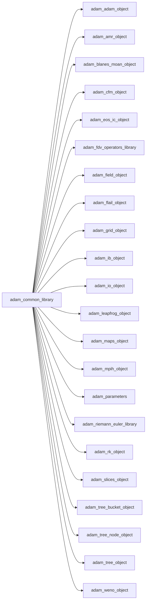

# adam_common_library

> ADAM common library, entry for all common classes and libraries.

**Source**: `src/lib/common/adam_common_library.F90`

**Dependencies**

```mermaid
graph LR
  adam_common_library["adam_common_library"] --> adam_adam_object["adam_adam_object"]
  adam_common_library["adam_common_library"] --> adam_amr_object["adam_amr_object"]
  adam_common_library["adam_common_library"] --> adam_blanes_moan_object["adam_blanes_moan_object"]
  adam_common_library["adam_common_library"] --> adam_cfm_object["adam_cfm_object"]
  adam_common_library["adam_common_library"] --> adam_eos_ic_object["adam_eos_ic_object"]
  adam_common_library["adam_common_library"] --> adam_fdv_operators_library["adam_fdv_operators_library"]
  adam_common_library["adam_common_library"] --> adam_field_object["adam_field_object"]
  adam_common_library["adam_common_library"] --> adam_flail_object["adam_flail_object"]
  adam_common_library["adam_common_library"] --> adam_grid_object["adam_grid_object"]
  adam_common_library["adam_common_library"] --> adam_ib_object["adam_ib_object"]
  adam_common_library["adam_common_library"] --> adam_io_object["adam_io_object"]
  adam_common_library["adam_common_library"] --> adam_leapfrog_object["adam_leapfrog_object"]
  adam_common_library["adam_common_library"] --> adam_maps_object["adam_maps_object"]
  adam_common_library["adam_common_library"] --> adam_mpih_object["adam_mpih_object"]
  adam_common_library["adam_common_library"] --> adam_parameters["adam_parameters"]
  adam_common_library["adam_common_library"] --> adam_riemann_euler_library["adam_riemann_euler_library"]
  adam_common_library["adam_common_library"] --> adam_rk_object["adam_rk_object"]
  adam_common_library["adam_common_library"] --> adam_slices_object["adam_slices_object"]
  adam_common_library["adam_common_library"] --> adam_tree_bucket_object["adam_tree_bucket_object"]
  adam_common_library["adam_common_library"] --> adam_tree_node_object["adam_tree_node_object"]
  adam_common_library["adam_common_library"] --> adam_tree_object["adam_tree_object"]
  adam_common_library["adam_common_library"] --> adam_weno_object["adam_weno_object"]
```
