# adam_eos_ic_object

> ADAM, Equations Of State (EOS) and physics for Ideal Compressible fluids, class definition, common to all backends.

**Source**: `src/lib/common/adam_eos_ic_object.F90`

**Dependencies**

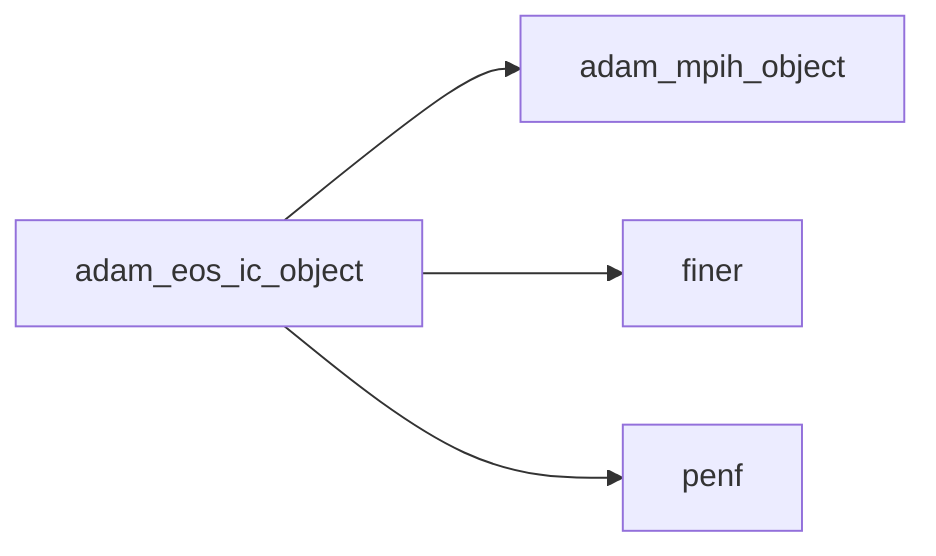

## Contents

- [eos_ic_object](#eos-ic-object)
- [eos_ic_object](#eos-ic-object)
- [compute_derivate](#compute-derivate)
- [destroy](#destroy)
- [initialize](#initialize)
- [load_from_file](#load-from-file)
- [save_into_file](#save-into-file)
- [eos_assign_eos](#eos-assign-eos)
- [conservative2primitive](#conservative2primitive)
- [description](#description)
- [primitive2conservative](#primitive2conservative)
- [density](#density)
- [internal_energy](#internal-energy)
- [pressure](#pressure)
- [speed_of_sound](#speed-of-sound)
- [temperature](#temperature)
- [total_energy](#total-energy)
- [total_entalpy](#total-entalpy)
- [ic_density](#ic-density)
- [ic_internal_energy](#ic-internal-energy)
- [ic_pressure](#ic-pressure)
- [ic_speed_of_sound](#ic-speed-of-sound)
- [ic_temperature](#ic-temperature)
- [ic_total_energy](#ic-total-energy)
- [ic_total_entalpy](#ic-total-entalpy)
- [ic_conservative2primitive](#ic-conservative2primitive)
- [ic_primitive2conservative](#ic-primitive2conservative)
- [eos_ic_instance](#eos-ic-instance)

## Variables

| Name | Type | Attributes | Description |
|------|------|------------|-------------|
| `INI_SECTION_NAME` | character(len=15) | parameter | INI file section name containing fluid eos. |

## Derived Types

### eos_ic_object

Equations Of State (EOS, ideal, compressible fluid) class definition.

#### Components

| Name | Type | Attributes | Description |
|------|------|------------|-------------|
| `mpih` | type([mpih_object](/api/src/third_party/FUNDAL/src/lib/fundal_mpih_object#mpih-object)) |  | MPI handler. |
| `id` | integer(kind=[I4P](/api/src/third_party/PENF/src/lib/penf_global_parameters_variables)) |  | Fluid specie unique ID. |
| `cp` | real(kind=[R8P](/api/src/third_party/PENF/src/lib/penf_global_parameters_variables)) |  | Specific heat at constant pressure `cp`. |
| `cv` | real(kind=[R8P](/api/src/third_party/PENF/src/lib/penf_global_parameters_variables)) |  | Specific heat at constant volume `cv`. |
| `g` | real(kind=[R8P](/api/src/third_party/PENF/src/lib/penf_global_parameters_variables)) |  | Specific heats ratio `gamma = cp / cv`. |
| `R` | real(kind=[R8P](/api/src/third_party/PENF/src/lib/penf_global_parameters_variables)) |  | Fluid constant `R = cp - cv`. |
| `gm1` | real(kind=[R8P](/api/src/third_party/PENF/src/lib/penf_global_parameters_variables)) |  | `gamma - 1`. |
| `gp1` | real(kind=[R8P](/api/src/third_party/PENF/src/lib/penf_global_parameters_variables)) |  | `gamma + 1`. |
| `delta` | real(kind=[R8P](/api/src/third_party/PENF/src/lib/penf_global_parameters_variables)) |  | `(gamma - 1) / 2`. |
| `eta` | real(kind=[R8P](/api/src/third_party/PENF/src/lib/penf_global_parameters_variables)) |  | `2 * gamma / (gamma - 1)`. |
| `mu` | real(kind=[R8P](/api/src/third_party/PENF/src/lib/penf_global_parameters_variables)) |  | Dynamic viscosity. |
| `kd` | real(kind=[R8P](/api/src/third_party/PENF/src/lib/penf_global_parameters_variables)) |  | Thermal diffusivity. |
| `dha` | real(kind=[R8P](/api/src/third_party/PENF/src/lib/penf_global_parameters_variables)) |  | Entalpy formation. |

#### Type-Bound Procedures

| Name | Attributes | Description |
|------|------------|-------------|
| `compute_derivate` | pass(self) | Compute derivate quantities (from `cp` and `cv`). |
| `description` | pass(self) | Return pretty-printed object description. |
| `destroy` | pass(self) | Destroy physics. |
| `initialize` | pass(self) | initialize physics. |
| `load_from_file` | pass(self) | Load from finer file. |
| `primitive2conservative` | pass(self) | Return conservative variables from primitive ones. |
| `save_into_file` | pass(self) | Save into finer file. |
| `density` | pass(self) | Return density. |
| `internal_energy` | pass(self) | Return specific internal energy. |
| `pressure` | pass(self) | Return pressure. |
| `speed_of_sound` | pass(self) | Return speed of sound. |
| `temperature` | pass(self) | Return temperature. |
| `total_energy` | pass(self) | Return total specific energy. |
| `total_entalpy` | pass(self) | Return total specific entalpy. |
| `assignment(=)` |  | Overload `=`. |
| `eos_assign_eos` | pass(lhs) | Operator `=`. |

## Interfaces

### eos_ic_object

Overload [eos_ic_object](/api/src/lib/common/adam_eos_ic_object#eos-ic-object) name with its constructor.

**Module procedures**: [`eos_ic_instance`](/api/src/lib/common/adam_eos_ic_object#eos-ic-instance)

## Subroutines

### compute_derivate

Compute derivate quantities (from `cp` and `cv`).

**Attributes**: elemental

```fortran
subroutine compute_derivate(self)
```

**Arguments**

| Name | Type | Intent | Attributes | Description |
|------|------|--------|------------|-------------|
| `self` | class([eos_ic_object](/api/src/lib/common/adam_eos_ic_object#eos-ic-object)) | inout |  | Fluid physics. |

**Call graph**

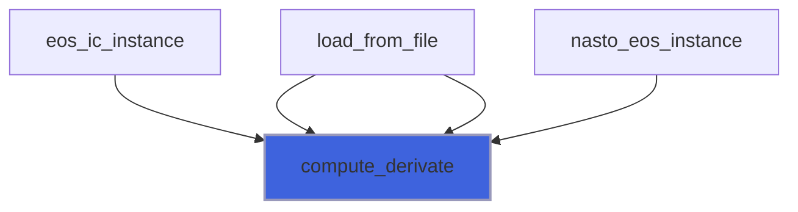

### destroy

Destroy physics.

**Attributes**: elemental

```fortran
subroutine destroy(self)
```

**Arguments**

| Name | Type | Intent | Attributes | Description |
|------|------|--------|------------|-------------|
| `self` | class([eos_ic_object](/api/src/lib/common/adam_eos_ic_object#eos-ic-object)) | inout |  | Fluid physics. |

**Call graph**

```mermaid
flowchart TD
  aabb_node_assign_aabb_node["aabb_node_assign_aabb_node"] --> destroy["destroy"]
  aabb_tree_assign_aabb_tree["aabb_tree_assign_aabb_tree"] --> destroy["destroy"]
  add_facets["add_facets"] --> destroy["destroy"]
  allocate_facets["allocate_facets"] --> destroy["destroy"]
  compute_facets_disconnected["compute_facets_disconnected"] --> destroy["destroy"]
  destroy["destroy"] --> destroy["destroy"]
  destroy_connectivity["destroy_connectivity"] --> destroy["destroy"]
  destroy_tree_node["destroy_tree_node"] --> destroy["destroy"]
  distribute_facets["distribute_facets"] --> destroy["destroy"]
  distribute_facets_tree["distribute_facets_tree"] --> destroy["destroy"]
  empty["empty"] --> destroy["destroy"]
  initialize["initialize"] --> destroy["destroy"]
  initialize["initialize"] --> destroy["destroy"]
  initialize["initialize"] --> destroy["destroy"]
  initialize["initialize"] --> destroy["destroy"]
  initialize["initialize"] --> destroy["destroy"]
  initialize["initialize"] --> destroy["destroy"]
  initialize["initialize"] --> destroy["destroy"]
  load_from_file["load_from_file"] --> destroy["destroy"]
  load_from_file["load_from_file"] --> destroy["destroy"]
  merge_vertices["merge_vertices"] --> destroy["destroy"]
  remove_by_pointer["remove_by_pointer"] --> destroy["destroy"]
  surface_stl_assign_surface_stl["surface_stl_assign_surface_stl"] --> destroy["destroy"]
  union["union"] --> destroy["destroy"]
  style destroy fill:#3e63dd,stroke:#99b,stroke-width:2px
```

### initialize

Initialize fluid physics.

```fortran
subroutine initialize(self, file_parameters, s, go_on_fail, physics, mu, kd, dha, cp, cv, gam, R, verbose)
```

**Arguments**

| Name | Type | Intent | Attributes | Description |
|------|------|--------|------------|-------------|
| `self` | class([eos_ic_object](/api/src/lib/common/adam_eos_ic_object#eos-ic-object)) | inout |  | Fluid physics. |
| `file_parameters` | type([file_ini](/api/src/third_party/FiNeR/src/lib/finer_file_ini_t#file-ini)) | in | optional | Simulation parameters ini file handler. |
| `s` | integer(kind=[I4P](/api/src/third_party/PENF/src/lib/penf_global_parameters_variables)) | in | optional | Fluid specie number. |
| `go_on_fail` | logical | in | optional | Go on if load fails. |
| `physics` | type([eos_ic_object](/api/src/lib/common/adam_eos_ic_object#eos-ic-object)) | in | optional | Fluid physics. |
| `mu` | real(kind=[R8P](/api/src/third_party/PENF/src/lib/penf_global_parameters_variables)) | in | optional | Dynamic viscosity. |
| `kd` | real(kind=[R8P](/api/src/third_party/PENF/src/lib/penf_global_parameters_variables)) | in | optional | Thermal diffusivity. |
| `dha` | real(kind=[R8P](/api/src/third_party/PENF/src/lib/penf_global_parameters_variables)) | in | optional | Entalpy formation. |
| `cp` | real(kind=[R8P](/api/src/third_party/PENF/src/lib/penf_global_parameters_variables)) | in | optional | Specific heat at constant pressure `cp` value. |
| `cv` | real(kind=[R8P](/api/src/third_party/PENF/src/lib/penf_global_parameters_variables)) | in | optional | Specific heat at constant volume `cv` value. |
| `gam` | real(kind=[R8P](/api/src/third_party/PENF/src/lib/penf_global_parameters_variables)) | in | optional | Specific heats ratio `gamma=cp/cv` value. |
| `R` | real(kind=[R8P](/api/src/third_party/PENF/src/lib/penf_global_parameters_variables)) | in | optional | Fluid constant `R=cp-cv` value. |
| `verbose` | logical | in | optional | Flag to activate verbose output. |

**Call graph**

```mermaid
flowchart TD
  add_node["add_node"] --> initialize["initialize"]
  analize["analize"] --> initialize["initialize"]
  build_connectivity["build_connectivity"] --> initialize["initialize"]
  distribute_facets["distribute_facets"] --> initialize["initialize"]
  distribute_facets_tree["distribute_facets_tree"] --> initialize["initialize"]
  export_vtk_file["export_vtk_file"] --> initialize["initialize"]
  initialize["initialize"] --> initialize["initialize"]
  initialize["initialize"] --> initialize["initialize"]
  initialize["initialize"] --> initialize["initialize"]
  initialize["initialize"] --> initialize["initialize"]
  initialize["initialize"] --> initialize["initialize"]
  initialize["initialize"] --> initialize["initialize"]
  initialize["initialize"] --> initialize["initialize"]
  initialize["initialize"] --> initialize["initialize"]
  initialize["initialize"] --> initialize["initialize"]
  initialize["initialize"] --> initialize["initialize"]
  initialize["initialize"] --> initialize["initialize"]
  initialize["initialize"] --> initialize["initialize"]
  initialize["initialize"] --> initialize["initialize"]
  initialize["initialize"] --> initialize["initialize"]
  initialize["initialize"] --> initialize["initialize"]
  initialize["initialize"] --> initialize["initialize"]
  initialize["initialize"] --> initialize["initialize"]
  initialize["initialize"] --> initialize["initialize"]
  initialize["initialize"] --> initialize["initialize"]
  initialize["initialize"] --> initialize["initialize"]
  initialize["initialize"] --> initialize["initialize"]
  initialize["initialize"] --> initialize["initialize"]
  initialize["initialize"] --> initialize["initialize"]
  initialize["initialize"] --> initialize["initialize"]
  initialize["initialize"] --> initialize["initialize"]
  initialize["initialize"] --> initialize["initialize"]
  initialize["initialize"] --> initialize["initialize"]
  initialize["initialize"] --> initialize["initialize"]
  initialize["initialize"] --> initialize["initialize"]
  initialize["initialize"] --> initialize["initialize"]
  initialize["initialize"] --> initialize["initialize"]
  initialize["initialize"] --> initialize["initialize"]
  initialize["initialize"] --> initialize["initialize"]
  initialize["initialize"] --> initialize["initialize"]
  initialize["initialize"] --> initialize["initialize"]
  initialize["initialize"] --> initialize["initialize"]
  initialize["initialize"] --> initialize["initialize"]
  initialize["initialize"] --> initialize["initialize"]
  initialize["initialize"] --> initialize["initialize"]
  initialize["initialize"] --> initialize["initialize"]
  initialize["initialize"] --> initialize["initialize"]
  initialize["initialize"] --> initialize["initialize"]
  initialize["initialize"] --> initialize["initialize"]
  initialize["initialize"] --> initialize["initialize"]
  initialize["initialize"] --> initialize["initialize"]
  initialize["initialize"] --> initialize["initialize"]
  initialize["initialize"] --> initialize["initialize"]
  initialize["initialize"] --> initialize["initialize"]
  initialize["initialize"] --> initialize["initialize"]
  initialize["initialize"] --> initialize["initialize"]
  initialize["initialize"] --> initialize["initialize"]
  initialize["initialize"] --> initialize["initialize"]
  initialize["initialize"] --> initialize["initialize"]
  initialize["initialize"] --> initialize["initialize"]
  initialize["initialize"] --> initialize["initialize"]
  initialize["initialize"] --> initialize["initialize"]
  initialize["initialize"] --> initialize["initialize"]
  initialize["initialize"] --> initialize["initialize"]
  initialize["initialize"] --> initialize["initialize"]
  initialize["initialize"] --> initialize["initialize"]
  initialize["initialize"] --> initialize["initialize"]
  initialize["initialize"] --> initialize["initialize"]
  initialize["initialize"] --> initialize["initialize"]
  initialize["initialize"] --> initialize["initialize"]
  initialize["initialize"] --> initialize["initialize"]
  initialize["initialize"] --> initialize["initialize"]
  initialize["initialize"] --> initialize["initialize"]
  initialize["initialize"] --> initialize["initialize"]
  initialize["initialize"] --> initialize["initialize"]
  initialize["initialize"] --> initialize["initialize"]
  initialize["initialize"] --> initialize["initialize"]
  initialize["initialize"] --> initialize["initialize"]
  initialize_common["initialize_common"] --> initialize["initialize"]
  initialize_common["initialize_common"] --> initialize["initialize"]
  initialize_common["initialize_common"] --> initialize["initialize"]
  initialize_common["initialize_common"] --> initialize["initialize"]
  load_from_file["load_from_file"] --> initialize["initialize"]
  load_from_file["load_from_file"] --> initialize["initialize"]
  open_file["open_file"] --> initialize["initialize"]
  open_file["open_file"] --> initialize["initialize"]
  open_file["open_file"] --> initialize["initialize"]
  resize["resize"] --> initialize["initialize"]
  save_into_file["save_into_file"] --> initialize["initialize"]
  save_vtk["save_vtk"] --> initialize["initialize"]
  simulate["simulate"] --> initialize["initialize"]
  simulate["simulate"] --> initialize["initialize"]
  simulate["simulate"] --> initialize["initialize"]
  simulate["simulate"] --> initialize["initialize"]
  simulate["simulate"] --> initialize["initialize"]
  simulate["simulate"] --> initialize["initialize"]
  simulate["simulate"] --> initialize["initialize"]
  test_stress["test_stress"] --> initialize["initialize"]
  initialize["initialize"] --> description["description"]
  initialize["initialize"] --> initialize["initialize"]
  initialize["initialize"] --> load_from_file["load_from_file"]
  style initialize fill:#3e63dd,stroke:#99b,stroke-width:2px
```

### load_from_file

Load from file.

```fortran
subroutine load_from_file(self, file_parameters, s, go_on_fail)
```

**Arguments**

| Name | Type | Intent | Attributes | Description |
|------|------|--------|------------|-------------|
| `self` | class([eos_ic_object](/api/src/lib/common/adam_eos_ic_object#eos-ic-object)) | inout |  | Fluid physics. |
| `file_parameters` | type([file_ini](/api/src/third_party/FiNeR/src/lib/finer_file_ini_t#file-ini)) | in |  | Simulation parameters ini file handler. |
| `s` | integer(kind=[I4P](/api/src/third_party/PENF/src/lib/penf_global_parameters_variables)) | in |  | Fluid specie number. |
| `go_on_fail` | logical | in | optional | Go on if load fails. |

**Call graph**

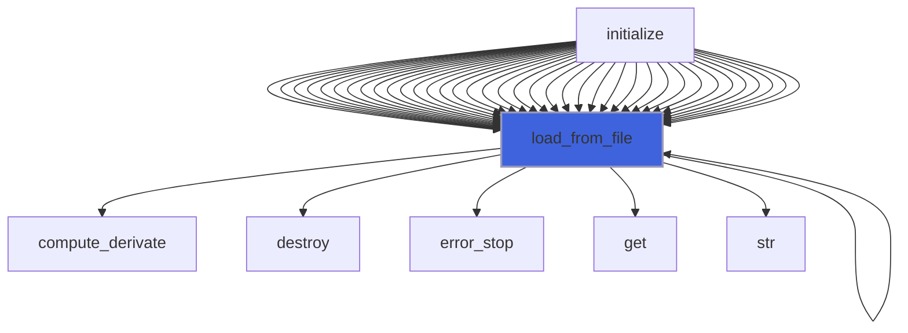

### save_into_file

Save into file.

```fortran
subroutine save_into_file(self, file_parameters, s)
```

**Arguments**

| Name | Type | Intent | Attributes | Description |
|------|------|--------|------------|-------------|
| `self` | class([eos_ic_object](/api/src/lib/common/adam_eos_ic_object#eos-ic-object)) | inout |  | Free conditions. |
| `file_parameters` | type([file_ini](/api/src/third_party/FiNeR/src/lib/finer_file_ini_t#file-ini)) | inout |  | Simulation parameters ini file handler. |
| `s` | integer(kind=[I4P](/api/src/third_party/PENF/src/lib/penf_global_parameters_variables)) | in |  | Fluid specie number. |

**Call graph**

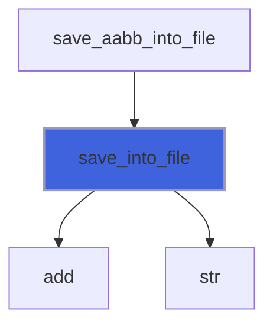

### eos_assign_eos

Operator `=`.

**Attributes**: pure

```fortran
subroutine eos_assign_eos(lhs, rhs)
```

**Arguments**

| Name | Type | Intent | Attributes | Description |
|------|------|--------|------------|-------------|
| `lhs` | class([eos_ic_object](/api/src/lib/common/adam_eos_ic_object#eos-ic-object)) | inout |  | Left hand side. |
| `rhs` | type([eos_ic_object](/api/src/lib/common/adam_eos_ic_object#eos-ic-object)) | in |  | Right hand side. |

## Functions

### conservative2primitive

Return primitive variables (r, u, v, w, p) from conservative variables (r, ru, rv, rw, rE).

**Attributes**: pure

**Returns**: real(kind=[R8P](/api/src/third_party/PENF/src/lib/penf_global_parameters_variables))

```fortran
function conservative2primitive(self, conservative) result(primitive)
```

**Arguments**

| Name | Type | Intent | Attributes | Description |
|------|------|--------|------------|-------------|
| `self` | class([eos_ic_object](/api/src/lib/common/adam_eos_ic_object#eos-ic-object)) | in |  | Fluid physics. |
| `conservative` | real(kind=[R8P](/api/src/third_party/PENF/src/lib/penf_global_parameters_variables)) | in |  | Conservative variables |

### description

Return a pretty-formatted object description.

**Attributes**: pure

**Returns**: `character(len=:)`

```fortran
function description(self) result(desc)
```

**Arguments**

| Name | Type | Intent | Attributes | Description |
|------|------|--------|------------|-------------|
| `self` | class([eos_ic_object](/api/src/lib/common/adam_eos_ic_object#eos-ic-object)) | in |  | Fluid physics. |

**Call graph**

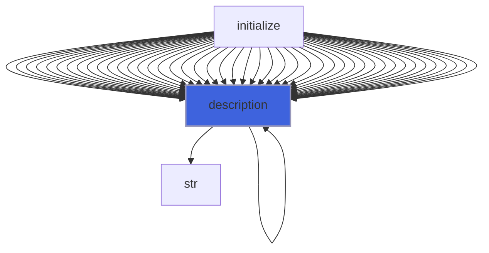

### primitive2conservative

Return conservative variables (r, ru, rv, rw, rE) from primitive variables (r, u, v, w, p).

**Attributes**: pure

**Returns**: real(kind=[R8P](/api/src/third_party/PENF/src/lib/penf_global_parameters_variables))

```fortran
function primitive2conservative(self, primitive) result(conservative)
```

**Arguments**

| Name | Type | Intent | Attributes | Description |
|------|------|--------|------------|-------------|
| `self` | class([eos_ic_object](/api/src/lib/common/adam_eos_ic_object#eos-ic-object)) | in |  | Fluid physics. |
| `primitive` | real(kind=[R8P](/api/src/third_party/PENF/src/lib/penf_global_parameters_variables)) | in |  | Primitive variables |

**Call graph**

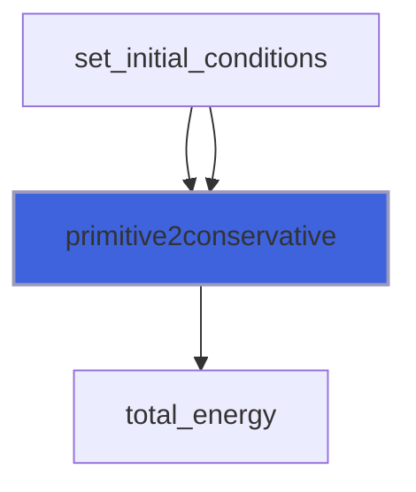

### density

Return density.

**Attributes**: elemental

**Returns**: real(kind=[R8P](/api/src/third_party/PENF/src/lib/penf_global_parameters_variables))

```fortran
function density(self, pressure, speed_of_sound) result(density_)
```

**Arguments**

| Name | Type | Intent | Attributes | Description |
|------|------|--------|------------|-------------|
| `self` | class([eos_ic_object](/api/src/lib/common/adam_eos_ic_object#eos-ic-object)) | in |  | Fluid physics. |
| `pressure` | real(kind=[R8P](/api/src/third_party/PENF/src/lib/penf_global_parameters_variables)) | in |  | Pressure value. |
| `speed_of_sound` | real(kind=[R8P](/api/src/third_party/PENF/src/lib/penf_global_parameters_variables)) | in |  | Speed of sound value. |

**Call graph**


### internal_energy

Return specific internal energy.

**Attributes**: elemental

**Returns**: real(kind=[R8P](/api/src/third_party/PENF/src/lib/penf_global_parameters_variables))

```fortran
function internal_energy(self, density, pressure) result(energy_)
```

**Arguments**

| Name | Type | Intent | Attributes | Description |
|------|------|--------|------------|-------------|
| `self` | class([eos_ic_object](/api/src/lib/common/adam_eos_ic_object#eos-ic-object)) | in |  | Fluid physics. |
| `density` | real(kind=[R8P](/api/src/third_party/PENF/src/lib/penf_global_parameters_variables)) | in |  | Density value. |
| `pressure` | real(kind=[R8P](/api/src/third_party/PENF/src/lib/penf_global_parameters_variables)) | in |  | Pressure value. |

**Call graph**

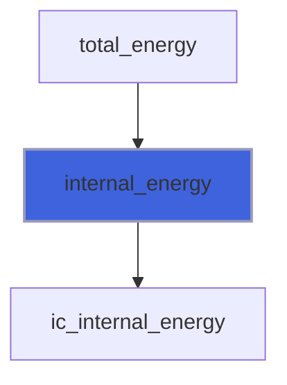

### pressure

Return pressure.

**Attributes**: elemental

**Returns**: real(kind=[R8P](/api/src/third_party/PENF/src/lib/penf_global_parameters_variables))

```fortran
function pressure(self, density, energy) result(pressure_)
```

**Arguments**

| Name | Type | Intent | Attributes | Description |
|------|------|--------|------------|-------------|
| `self` | class([eos_ic_object](/api/src/lib/common/adam_eos_ic_object#eos-ic-object)) | in |  | Fluid physics. |
| `density` | real(kind=[R8P](/api/src/third_party/PENF/src/lib/penf_global_parameters_variables)) | in |  | Density value. |
| `energy` | real(kind=[R8P](/api/src/third_party/PENF/src/lib/penf_global_parameters_variables)) | in |  | Specific internal energy value. |

**Call graph**


### speed_of_sound

Return speed of sound.

**Attributes**: elemental

**Returns**: real(kind=[R8P](/api/src/third_party/PENF/src/lib/penf_global_parameters_variables))

```fortran
function speed_of_sound(self, density, pressure) result(speed_of_sound_)
```

**Arguments**

| Name | Type | Intent | Attributes | Description |
|------|------|--------|------------|-------------|
| `self` | class([eos_ic_object](/api/src/lib/common/adam_eos_ic_object#eos-ic-object)) | in |  | Fluid physics. |
| `density` | real(kind=[R8P](/api/src/third_party/PENF/src/lib/penf_global_parameters_variables)) | in |  | Density value. |
| `pressure` | real(kind=[R8P](/api/src/third_party/PENF/src/lib/penf_global_parameters_variables)) | in |  | Pressure value. |

**Call graph**

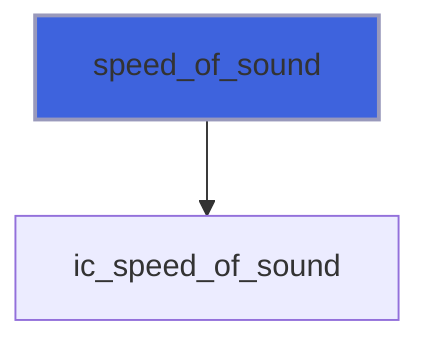

### temperature

Return temperature.

**Attributes**: elemental

**Returns**: real(kind=[R8P](/api/src/third_party/PENF/src/lib/penf_global_parameters_variables))

```fortran
function temperature(self, density, pressure) result(temperature_)
```

**Arguments**

| Name | Type | Intent | Attributes | Description |
|------|------|--------|------------|-------------|
| `self` | class([eos_ic_object](/api/src/lib/common/adam_eos_ic_object#eos-ic-object)) | in |  | Fluid physics. |
| `density` | real(kind=[R8P](/api/src/third_party/PENF/src/lib/penf_global_parameters_variables)) | in |  | Density value. |
| `pressure` | real(kind=[R8P](/api/src/third_party/PENF/src/lib/penf_global_parameters_variables)) | in |  | Pressure value. |

**Call graph**


### total_energy

Return total specific energy.

**Attributes**: elemental

**Returns**: real(kind=[R8P](/api/src/third_party/PENF/src/lib/penf_global_parameters_variables))

```fortran
function total_energy(self, density, pressure, velocity_sq_norm) result(energy_)
```

**Arguments**

| Name | Type | Intent | Attributes | Description |
|------|------|--------|------------|-------------|
| `self` | class([eos_ic_object](/api/src/lib/common/adam_eos_ic_object#eos-ic-object)) | in |  | Fluid physics. |
| `density` | real(kind=[R8P](/api/src/third_party/PENF/src/lib/penf_global_parameters_variables)) | in |  | Density value. |
| `pressure` | real(kind=[R8P](/api/src/third_party/PENF/src/lib/penf_global_parameters_variables)) | in |  | Pressure value. |
| `velocity_sq_norm` | real(kind=[R8P](/api/src/third_party/PENF/src/lib/penf_global_parameters_variables)) | in |  | Velocity vector square norm `\|\|velocity\|\|^2`. |

**Call graph**

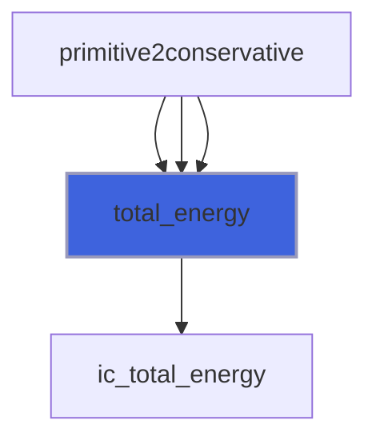

### total_entalpy

Return total specific entalpy.

**Attributes**: elemental

**Returns**: real(kind=[R8P](/api/src/third_party/PENF/src/lib/penf_global_parameters_variables))

```fortran
function total_entalpy(self, density, pressure, velocity_sq_norm) result(entalpy_)
```

**Arguments**

| Name | Type | Intent | Attributes | Description |
|------|------|--------|------------|-------------|
| `self` | class([eos_ic_object](/api/src/lib/common/adam_eos_ic_object#eos-ic-object)) | in |  | Fluid physics. |
| `density` | real(kind=[R8P](/api/src/third_party/PENF/src/lib/penf_global_parameters_variables)) | in |  | Density value. |
| `pressure` | real(kind=[R8P](/api/src/third_party/PENF/src/lib/penf_global_parameters_variables)) | in |  | Pressure value. |
| `velocity_sq_norm` | real(kind=[R8P](/api/src/third_party/PENF/src/lib/penf_global_parameters_variables)) | in |  | Velocity vector square norm `\|\|velocity\|\|^2`. |

**Call graph**

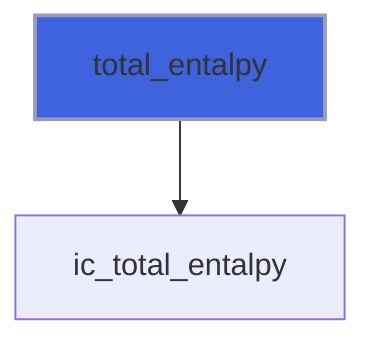

### ic_density

Return density for ideal compressible fluid.

**Attributes**: elemental

**Returns**: real(kind=[R8P](/api/src/third_party/PENF/src/lib/penf_global_parameters_variables))

```fortran
function ic_density(g, pressure, speed_of_sound) result(density_)
```

**Arguments**

| Name | Type | Intent | Attributes | Description |
|------|------|--------|------------|-------------|
| `g` | real(kind=[R8P](/api/src/third_party/PENF/src/lib/penf_global_parameters_variables)) | in |  | Specific heats ratio. |
| `pressure` | real(kind=[R8P](/api/src/third_party/PENF/src/lib/penf_global_parameters_variables)) | in |  | Pressure value. |
| `speed_of_sound` | real(kind=[R8P](/api/src/third_party/PENF/src/lib/penf_global_parameters_variables)) | in |  | Speed of sound value. |

**Call graph**

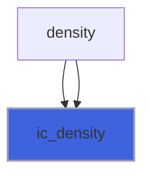

### ic_internal_energy

Return specific internal energy for ideal compressible fluid.

**Attributes**: elemental

**Returns**: real(kind=[R8P](/api/src/third_party/PENF/src/lib/penf_global_parameters_variables))

```fortran
function ic_internal_energy(gm1, density, pressure) result(energy_)
```

**Arguments**

| Name | Type | Intent | Attributes | Description |
|------|------|--------|------------|-------------|
| `gm1` | real(kind=[R8P](/api/src/third_party/PENF/src/lib/penf_global_parameters_variables)) | in |  | Specific heats ratio minus 1. |
| `density` | real(kind=[R8P](/api/src/third_party/PENF/src/lib/penf_global_parameters_variables)) | in |  | Density value. |
| `pressure` | real(kind=[R8P](/api/src/third_party/PENF/src/lib/penf_global_parameters_variables)) | in |  | Pressure value. |

**Call graph**

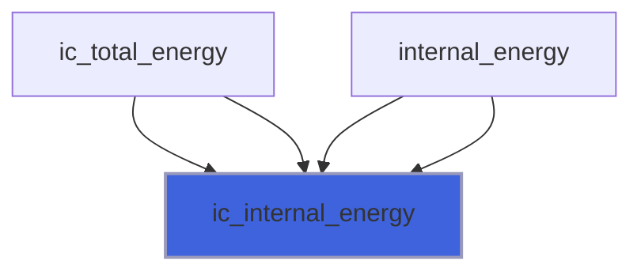

### ic_pressure

Return pressure for ideal compressible fluid.

**Attributes**: elemental

**Returns**: real(kind=[R8P](/api/src/third_party/PENF/src/lib/penf_global_parameters_variables))

```fortran
function ic_pressure(gm1, density, energy) result(pressure_)
```

**Arguments**

| Name | Type | Intent | Attributes | Description |
|------|------|--------|------------|-------------|
| `gm1` | real(kind=[R8P](/api/src/third_party/PENF/src/lib/penf_global_parameters_variables)) | in |  | Specific heats ratio minus 1. |
| `density` | real(kind=[R8P](/api/src/third_party/PENF/src/lib/penf_global_parameters_variables)) | in |  | Density value. |
| `energy` | real(kind=[R8P](/api/src/third_party/PENF/src/lib/penf_global_parameters_variables)) | in |  | Specific internal energy value. |

**Call graph**

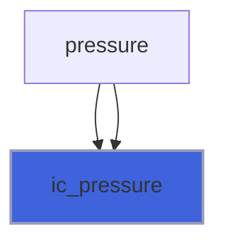

### ic_speed_of_sound

Return speed of sound for ideal compressible fluid.

**Attributes**: elemental

**Returns**: real(kind=[R8P](/api/src/third_party/PENF/src/lib/penf_global_parameters_variables))

```fortran
function ic_speed_of_sound(g, density, pressure) result(speed_of_sound_)
```

**Arguments**

| Name | Type | Intent | Attributes | Description |
|------|------|--------|------------|-------------|
| `g` | real(kind=[R8P](/api/src/third_party/PENF/src/lib/penf_global_parameters_variables)) | in |  | Specific heats ratio. |
| `density` | real(kind=[R8P](/api/src/third_party/PENF/src/lib/penf_global_parameters_variables)) | in |  | Density value. |
| `pressure` | real(kind=[R8P](/api/src/third_party/PENF/src/lib/penf_global_parameters_variables)) | in |  | Pressure value. |

**Call graph**

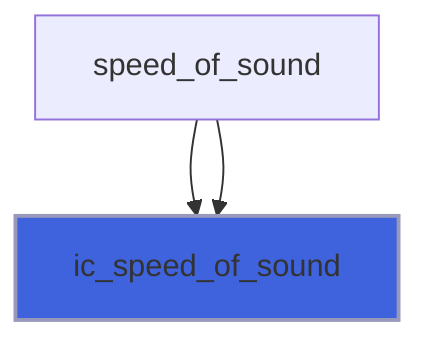

### ic_temperature

Return temperature for ideal compressible fluid.

**Attributes**: elemental

**Returns**: real(kind=[R8P](/api/src/third_party/PENF/src/lib/penf_global_parameters_variables))

```fortran
function ic_temperature(R, density, pressure) result(temperature_)
```

**Arguments**

| Name | Type | Intent | Attributes | Description |
|------|------|--------|------------|-------------|
| `R` | real(kind=[R8P](/api/src/third_party/PENF/src/lib/penf_global_parameters_variables)) | in |  | Fluid constant. |
| `density` | real(kind=[R8P](/api/src/third_party/PENF/src/lib/penf_global_parameters_variables)) | in |  | Density value. |
| `pressure` | real(kind=[R8P](/api/src/third_party/PENF/src/lib/penf_global_parameters_variables)) | in |  | Pressure value. |

**Call graph**

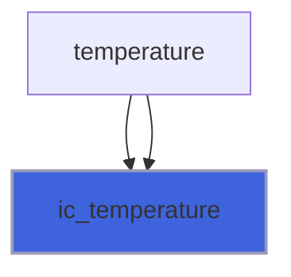

### ic_total_energy

Return total specific energy for ideal compressible fluid.

**Attributes**: elemental

**Returns**: real(kind=[R8P](/api/src/third_party/PENF/src/lib/penf_global_parameters_variables))

```fortran
function ic_total_energy(gm1, density, pressure, velocity_sq_norm) result(energy_)
```

**Arguments**

| Name | Type | Intent | Attributes | Description |
|------|------|--------|------------|-------------|
| `gm1` | real(kind=[R8P](/api/src/third_party/PENF/src/lib/penf_global_parameters_variables)) | in |  | Specific heats ratio minus 1. |
| `density` | real(kind=[R8P](/api/src/third_party/PENF/src/lib/penf_global_parameters_variables)) | in |  | Density value. |
| `pressure` | real(kind=[R8P](/api/src/third_party/PENF/src/lib/penf_global_parameters_variables)) | in |  | Pressure value. |
| `velocity_sq_norm` | real(kind=[R8P](/api/src/third_party/PENF/src/lib/penf_global_parameters_variables)) | in |  | Velocity vector square norm `\|\|velocity\|\|^2`. |

**Call graph**

```mermaid
flowchart TD
  ic_primitive2conservative["ic_primitive2conservative"] --> ic_total_energy["ic_total_energy"]
  total_energy["total_energy"] --> ic_total_energy["ic_total_energy"]
  total_energy["total_energy"] --> ic_total_energy["ic_total_energy"]
  ic_total_energy["ic_total_energy"] --> ic_internal_energy["ic_internal_energy"]
  style ic_total_energy fill:#3e63dd,stroke:#99b,stroke-width:2px
```

### ic_total_entalpy

Return total specific entalpy for ideal compressible fluid.

**Attributes**: elemental

**Returns**: real(kind=[R8P](/api/src/third_party/PENF/src/lib/penf_global_parameters_variables))

```fortran
function ic_total_entalpy(g, density, pressure, velocity_sq_norm) result(entalpy_)
```

**Arguments**

| Name | Type | Intent | Attributes | Description |
|------|------|--------|------------|-------------|
| `g` | real(kind=[R8P](/api/src/third_party/PENF/src/lib/penf_global_parameters_variables)) | in |  | Specific heats ratio. |
| `density` | real(kind=[R8P](/api/src/third_party/PENF/src/lib/penf_global_parameters_variables)) | in |  | Density value. |
| `pressure` | real(kind=[R8P](/api/src/third_party/PENF/src/lib/penf_global_parameters_variables)) | in |  | Pressure value. |
| `velocity_sq_norm` | real(kind=[R8P](/api/src/third_party/PENF/src/lib/penf_global_parameters_variables)) | in |  | Velocity vector square norm `\|\|velocity\|\|^2`. |

**Call graph**

```mermaid
flowchart TD
  total_entalpy["total_entalpy"] --> ic_total_entalpy["ic_total_entalpy"]
  total_entalpy["total_entalpy"] --> ic_total_entalpy["ic_total_entalpy"]
  style ic_total_entalpy fill:#3e63dd,stroke:#99b,stroke-width:2px
```

### ic_conservative2primitive

Return primitive variables (r, u, v, w, p) from conservative variables (r, ru, rv, rw, rE).

**Attributes**: pure

**Returns**: real(kind=[R8P](/api/src/third_party/PENF/src/lib/penf_global_parameters_variables))

```fortran
function ic_conservative2primitive(gm1, conservative) result(primitive)
```

**Arguments**

| Name | Type | Intent | Attributes | Description |
|------|------|--------|------------|-------------|
| `gm1` | real(kind=[R8P](/api/src/third_party/PENF/src/lib/penf_global_parameters_variables)) | in |  | Specific heats ratio minus 1. |
| `conservative` | real(kind=[R8P](/api/src/third_party/PENF/src/lib/penf_global_parameters_variables)) | in |  | Conservative variables |

### ic_primitive2conservative

Return conservative variables (r, ru, rv, rw, rE) from primitive variables (r, u, v, w, p).

**Attributes**: pure

**Returns**: real(kind=[R8P](/api/src/third_party/PENF/src/lib/penf_global_parameters_variables))

```fortran
function ic_primitive2conservative(gm1, primitive) result(conservative)
```

**Arguments**

| Name | Type | Intent | Attributes | Description |
|------|------|--------|------------|-------------|
| `gm1` | real(kind=[R8P](/api/src/third_party/PENF/src/lib/penf_global_parameters_variables)) | in |  | Specific heats ratio minus 1. |
| `primitive` | real(kind=[R8P](/api/src/third_party/PENF/src/lib/penf_global_parameters_variables)) | in |  | Primitive variables |

**Call graph**

```mermaid
flowchart TD
  ic_primitive2conservative["ic_primitive2conservative"] --> ic_total_energy["ic_total_energy"]
  style ic_primitive2conservative fill:#3e63dd,stroke:#99b,stroke-width:2px
```

### eos_ic_instance

Return and instance of [eos_ic_object](/api/src/lib/common/adam_eos_ic_object#eos-ic-object).

 @note This procedure is used for overloading [eos_ic_object](/api/src/lib/common/adam_eos_ic_object#eos-ic-object) name.

**Attributes**: elemental

**Returns**: type([eos_ic_object](/api/src/lib/common/adam_eos_ic_object#eos-ic-object))

```fortran
function eos_ic_instance(mu, kd, dha, cp, cv, gam, R) result(instance)
```

**Arguments**

| Name | Type | Intent | Attributes | Description |
|------|------|--------|------------|-------------|
| `mu` | real(kind=[R8P](/api/src/third_party/PENF/src/lib/penf_global_parameters_variables)) | in |  | Dynamic viscosity. |
| `kd` | real(kind=[R8P](/api/src/third_party/PENF/src/lib/penf_global_parameters_variables)) | in |  | Thermal diffusivity. |
| `dha` | real(kind=[R8P](/api/src/third_party/PENF/src/lib/penf_global_parameters_variables)) | in |  | Entalpy formation. |
| `cp` | real(kind=[R8P](/api/src/third_party/PENF/src/lib/penf_global_parameters_variables)) | in | optional | Specific heat at constant pressure `cp` value. |
| `cv` | real(kind=[R8P](/api/src/third_party/PENF/src/lib/penf_global_parameters_variables)) | in | optional | Specific heat at constant volume `cv` value. |
| `gam` | real(kind=[R8P](/api/src/third_party/PENF/src/lib/penf_global_parameters_variables)) | in | optional | Specific heats ratio `gamma=cp/cv` value. |
| `R` | real(kind=[R8P](/api/src/third_party/PENF/src/lib/penf_global_parameters_variables)) | in | optional | Fluid constant `R=cp-cv` value. |

**Call graph**

```mermaid
flowchart TD
  eos_ic_instance["eos_ic_instance"] --> compute_derivate["compute_derivate"]
  style eos_ic_instance fill:#3e63dd,stroke:#99b,stroke-width:2px
```
