# adam_fdv_operators_library

> ADAM, finite difference/volume operators approximations library.

**Source**: `src/lib/common/adam_fdv_operators_library.F90`

**Dependencies**


## Contents

- [compute_curl_fdv_interface](#compute-curl-fdv-interface)
- [compute_derivative1_fdv_interface](#compute-derivative1-fdv-interface)
- [compute_derivative2_fdv_interface](#compute-derivative2-fdv-interface)
- [compute_derivative3_fdv_interface](#compute-derivative3-fdv-interface)
- [compute_derivative4_fdv_interface](#compute-derivative4-fdv-interface)
- [compute_derivative5_fdv_interface](#compute-derivative5-fdv-interface)
- [compute_derivative6_fdv_interface](#compute-derivative6-fdv-interface)
- [compute_divergence_fdv_interface](#compute-divergence-fdv-interface)
- [compute_gradient_fdv_interface](#compute-gradient-fdv-interface)
- [compute_laplacian_fdv_interface](#compute-laplacian-fdv-interface)
- [compute_curl_fd_centered](#compute-curl-fd-centered)
- [compute_derivative1_fd_centered](#compute-derivative1-fd-centered)
- [compute_derivative2_fd_centered](#compute-derivative2-fd-centered)
- [compute_derivative3_fd_centered](#compute-derivative3-fd-centered)
- [compute_derivative4_fd_centered](#compute-derivative4-fd-centered)
- [compute_derivative5_fd_centered](#compute-derivative5-fd-centered)
- [compute_derivative6_fd_centered](#compute-derivative6-fd-centered)
- [compute_divergence_fd_centered](#compute-divergence-fd-centered)
- [compute_gradient_fd_centered](#compute-gradient-fd-centered)
- [compute_laplacian_fd_centered](#compute-laplacian-fd-centered)
- [compute_curl_fv_centered](#compute-curl-fv-centered)
- [compute_derivative1_fv_centered](#compute-derivative1-fv-centered)
- [compute_derivative2_fv_centered](#compute-derivative2-fv-centered)
- [compute_derivative3_fv_centered](#compute-derivative3-fv-centered)
- [compute_derivative4_fv_centered](#compute-derivative4-fv-centered)
- [compute_derivative5_fv_centered](#compute-derivative5-fv-centered)
- [compute_derivative6_fv_centered](#compute-derivative6-fv-centered)
- [compute_divergence_fv_centered](#compute-divergence-fv-centered)
- [compute_gradient_fv_centered](#compute-gradient-fv-centered)
- [compute_laplacian_fv_centered](#compute-laplacian-fv-centered)
- [compute_reconstruction_r_fv_centered](#compute-reconstruction-r-fv-centered)
- [compute_derivative1_fv_rupwind](#compute-derivative1-fv-rupwind)
- [compute_derivative2_fv_rupwind](#compute-derivative2-fv-rupwind)
- [compute_derivative3_fv_rupwind](#compute-derivative3-fv-rupwind)
- [compute_derivative4_fv_rupwind](#compute-derivative4-fv-rupwind)
- [compute_derivative5_fv_rupwind](#compute-derivative5-fv-rupwind)
- [compute_derivative6_fv_rupwind](#compute-derivative6-fv-rupwind)
- [compute_reconstruction_r_fv_rupwind](#compute-reconstruction-r-fv-rupwind)
- [compute_derivative1_fv_lupwind](#compute-derivative1-fv-lupwind)
- [compute_derivative2_fv_lupwind](#compute-derivative2-fv-lupwind)
- [compute_derivative3_fv_lupwind](#compute-derivative3-fv-lupwind)
- [compute_derivative4_fv_lupwind](#compute-derivative4-fv-lupwind)
- [compute_derivative5_fv_lupwind](#compute-derivative5-fv-lupwind)
- [compute_derivative6_fv_lupwind](#compute-derivative6-fv-lupwind)
- [compute_reconstruction_r_fv_lupwind](#compute-reconstruction-r-fv-lupwind)

## Variables

| Name | Type | Attributes | Description |
|------|------|------------|-------------|
| `S_MAX` | integer(kind=[I4P](/api/src/third_party/PENF/src/lib/penf_global_parameters_variables)) | parameter | Maximum (half) stencil length. |
| `FD1_CC_S1` | real(kind=[R8P](/api/src/third_party/PENF/src/lib/penf_global_parameters_variables)) | parameter | FD1C, S1. |
| `FD1_CC_S2` | real(kind=[R8P](/api/src/third_party/PENF/src/lib/penf_global_parameters_variables)) | parameter | FD1C, S2. |
| `FD1_CC_S3` | real(kind=[R8P](/api/src/third_party/PENF/src/lib/penf_global_parameters_variables)) | parameter | FD1C, S3. |
| `FD1_CC_S4` | real(kind=[R8P](/api/src/third_party/PENF/src/lib/penf_global_parameters_variables)) | parameter | FD1C, S4. |
| `FD1_CC_S5` | real(kind=[R8P](/api/src/third_party/PENF/src/lib/penf_global_parameters_variables)) | parameter | FD1C, S5. |
| `FD1_CC` | real(kind=[R8P](/api/src/third_party/PENF/src/lib/penf_global_parameters_variables)) | parameter | Finite difference derivative 1 centered coefficients. |
| `FD2_CC_S1` | real(kind=[R8P](/api/src/third_party/PENF/src/lib/penf_global_parameters_variables)) | parameter | FD2C, S1. |
| `FD2_CC_S2` | real(kind=[R8P](/api/src/third_party/PENF/src/lib/penf_global_parameters_variables)) | parameter | FD2C, S2. |
| `FD2_CC_S3` | real(kind=[R8P](/api/src/third_party/PENF/src/lib/penf_global_parameters_variables)) | parameter | FD2C, S3. |
| `FD2_CC_S4` | real(kind=[R8P](/api/src/third_party/PENF/src/lib/penf_global_parameters_variables)) | parameter | FD2C, S4. |
| `FD2_CC_S5` | real(kind=[R8P](/api/src/third_party/PENF/src/lib/penf_global_parameters_variables)) | parameter | FD2C, S5. |
| `FD2_CC` | real(kind=[R8P](/api/src/third_party/PENF/src/lib/penf_global_parameters_variables)) | parameter | Finite difference derivative 2 centered coefficients. |
| `FD3_CC_S1` | real(kind=[R8P](/api/src/third_party/PENF/src/lib/penf_global_parameters_variables)) | parameter | FD3C,S1. |
| `FD3_CC_S2` | real(kind=[R8P](/api/src/third_party/PENF/src/lib/penf_global_parameters_variables)) | parameter | FD3C,S2. |
| `FD3_CC_S3` | real(kind=[R8P](/api/src/third_party/PENF/src/lib/penf_global_parameters_variables)) | parameter | FD3C,S3. |
| `FD3_CC_S4` | real(kind=[R8P](/api/src/third_party/PENF/src/lib/penf_global_parameters_variables)) | parameter | FD3C,S4. |
| `FD3_CC_S5` | real(kind=[R8P](/api/src/third_party/PENF/src/lib/penf_global_parameters_variables)) | parameter | FD3C,S5. |
| `FD3_CC` | real(kind=[R8P](/api/src/third_party/PENF/src/lib/penf_global_parameters_variables)) | parameter | Finite difference derivative 3 centered coefficients. |
| `FD4_CC_S1` | real(kind=[R8P](/api/src/third_party/PENF/src/lib/penf_global_parameters_variables)) | parameter | FD4C,S1. |
| `FD4_CC_S2` | real(kind=[R8P](/api/src/third_party/PENF/src/lib/penf_global_parameters_variables)) | parameter | FD4C,S2. |
| `FD4_CC_S3` | real(kind=[R8P](/api/src/third_party/PENF/src/lib/penf_global_parameters_variables)) | parameter | FD4C,S3. |
| `FD4_CC_S4` | real(kind=[R8P](/api/src/third_party/PENF/src/lib/penf_global_parameters_variables)) | parameter | FD4C,S4. |
| `FD4_CC_S5` | real(kind=[R8P](/api/src/third_party/PENF/src/lib/penf_global_parameters_variables)) | parameter | FD4C,S5. |
| `FD4_CC` | real(kind=[R8P](/api/src/third_party/PENF/src/lib/penf_global_parameters_variables)) | parameter | Finite difference derivative 4 centered coefficients. |
| `FD5_CC_S2` | real(kind=[R8P](/api/src/third_party/PENF/src/lib/penf_global_parameters_variables)) | parameter | FD5C,S1. |
| `FD5_CC_S1` | real(kind=[R8P](/api/src/third_party/PENF/src/lib/penf_global_parameters_variables)) | parameter | FD5C,S2. |
| `FD5_CC_S3` | real(kind=[R8P](/api/src/third_party/PENF/src/lib/penf_global_parameters_variables)) | parameter | FD5C,S3. |
| `FD5_CC_S4` | real(kind=[R8P](/api/src/third_party/PENF/src/lib/penf_global_parameters_variables)) | parameter | FD5C,S4. |
| `FD5_CC_S5` | real(kind=[R8P](/api/src/third_party/PENF/src/lib/penf_global_parameters_variables)) | parameter | FD5C,S5. |
| `FD5_CC` | real(kind=[R8P](/api/src/third_party/PENF/src/lib/penf_global_parameters_variables)) | parameter | Finite difference derivative 5 centered coefficients. |
| `FD6_CC_S2` | real(kind=[R8P](/api/src/third_party/PENF/src/lib/penf_global_parameters_variables)) | parameter | FD6C,S1. |
| `FD6_CC_S1` | real(kind=[R8P](/api/src/third_party/PENF/src/lib/penf_global_parameters_variables)) | parameter | FD6C,S2. |
| `FD6_CC_S3` | real(kind=[R8P](/api/src/third_party/PENF/src/lib/penf_global_parameters_variables)) | parameter | FD6C,S3. |
| `FD6_CC_S4` | real(kind=[R8P](/api/src/third_party/PENF/src/lib/penf_global_parameters_variables)) | parameter | FD6C,S4. |
| `FD6_CC_S5` | real(kind=[R8P](/api/src/third_party/PENF/src/lib/penf_global_parameters_variables)) | parameter | FD6C,S5. |
| `FD6_CC` | real(kind=[R8P](/api/src/third_party/PENF/src/lib/penf_global_parameters_variables)) | parameter | Finite difference derivative 6 centered coefficients. |
| `FV1_CC_S1` | real(kind=[R8P](/api/src/third_party/PENF/src/lib/penf_global_parameters_variables)) | parameter | FV1C, S1. |
| `FV1_CC_S2` | real(kind=[R8P](/api/src/third_party/PENF/src/lib/penf_global_parameters_variables)) | parameter | FV1C, S2. |
| `FV1_CC_S3` | real(kind=[R8P](/api/src/third_party/PENF/src/lib/penf_global_parameters_variables)) | parameter | FV1C, S3. |
| `FV1_CC_S4` | real(kind=[R8P](/api/src/third_party/PENF/src/lib/penf_global_parameters_variables)) | parameter | FV1C, S4. |
| `FV1_CC_S5` | real(kind=[R8P](/api/src/third_party/PENF/src/lib/penf_global_parameters_variables)) | parameter | FV1C, S5. |
| `FV1_CC` | real(kind=[R8P](/api/src/third_party/PENF/src/lib/penf_global_parameters_variables)) | parameter | Finite volume centered reconstruction coefficients. |
| `FV1_UR_S1` | real(kind=[R8P](/api/src/third_party/PENF/src/lib/penf_global_parameters_variables)) | parameter | FV1UR, S1. |
| `FV1_UR_S2` | real(kind=[R8P](/api/src/third_party/PENF/src/lib/penf_global_parameters_variables)) | parameter | FV1UR, S2. |
| `FV1_UR_S3` | real(kind=[R8P](/api/src/third_party/PENF/src/lib/penf_global_parameters_variables)) | parameter | FV1UR, S3. |
| `FV1_UR_S4` | real(kind=[R8P](/api/src/third_party/PENF/src/lib/penf_global_parameters_variables)) | parameter | FV1UR, S4. |
| `FV1_UR_S5` | real(kind=[R8P](/api/src/third_party/PENF/src/lib/penf_global_parameters_variables)) | parameter | FV1UR, S5. |
| `FV1_UR` | real(kind=[R8P](/api/src/third_party/PENF/src/lib/penf_global_parameters_variables)) | parameter | Finite volume right-upwind reconstruction coefficients. |
| `FV1_UL_S1` | real(kind=[R8P](/api/src/third_party/PENF/src/lib/penf_global_parameters_variables)) | parameter | FV1UL, S1. |
| `FV1_UL_S2` | real(kind=[R8P](/api/src/third_party/PENF/src/lib/penf_global_parameters_variables)) | parameter | FV1UL, S2. |
| `FV1_UL_S3` | real(kind=[R8P](/api/src/third_party/PENF/src/lib/penf_global_parameters_variables)) | parameter | FV1UL, S3. |
| `FV1_UL_S4` | real(kind=[R8P](/api/src/third_party/PENF/src/lib/penf_global_parameters_variables)) | parameter | FV1UL, S4. |
| `FV1_UL_S5` | real(kind=[R8P](/api/src/third_party/PENF/src/lib/penf_global_parameters_variables)) | parameter | FV1UL, S5. |
| `FV1_UL` | real(kind=[R8P](/api/src/third_party/PENF/src/lib/penf_global_parameters_variables)) | parameter | Finite volume left-upwind reconstruction coefficients. |

## Interfaces

### compute_curl_fdv_interface

### compute_derivative1_fdv_interface

### compute_derivative2_fdv_interface

### compute_derivative3_fdv_interface

### compute_derivative4_fdv_interface

### compute_derivative5_fdv_interface

### compute_derivative6_fdv_interface

### compute_divergence_fdv_interface

### compute_gradient_fdv_interface

### compute_laplacian_fdv_interface

## Subroutines

### compute_curl_fd_centered

Compute curl of q vector field with finite difference centered scheme.

**Attributes**: pure

```fortran
subroutine compute_curl_fd_centered(s, dxyz, q, curl)
```

**Arguments**

| Name | Type | Intent | Attributes | Description |
|------|------|--------|------------|-------------|
| `s` | integer(kind=[I4P](/api/src/third_party/PENF/src/lib/penf_global_parameters_variables)) | in |  | Stencil len, half of accuracy order. |
| `dxyz` | real(kind=[R8P](/api/src/third_party/PENF/src/lib/penf_global_parameters_variables)) | in |  | Space steps [1:3]. |
| `q` | real(kind=[R8P](/api/src/third_party/PENF/src/lib/penf_global_parameters_variables)) | in |  | Vector field over the stencil [1:3,1-s:1+s,1-s:1+s,1-s:1+s]. |
| `curl` | real(kind=[R8P](/api/src/third_party/PENF/src/lib/penf_global_parameters_variables)) | out |  | Curl of q [1:3]. |

**Call graph**

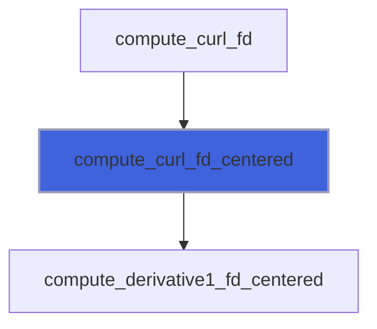

### compute_derivative1_fd_centered

Compute derivative of order 1 with finite difference centered scheme.

**Attributes**: pure

```fortran
subroutine compute_derivative1_fd_centered(s, ds, q, dq_ds)
```

**Arguments**

| Name | Type | Intent | Attributes | Description |
|------|------|--------|------------|-------------|
| `s` | integer(kind=[I4P](/api/src/third_party/PENF/src/lib/penf_global_parameters_variables)) | in |  | Stencil len, order=2*s. |
| `ds` | real(kind=[R8P](/api/src/third_party/PENF/src/lib/penf_global_parameters_variables)) | in |  | Space step. |
| `q` | real(kind=[R8P](/api/src/third_party/PENF/src/lib/penf_global_parameters_variables)) | in |  | Scalar field over the stencil [1-s:1+s]. |
| `dq_ds` | real(kind=[R8P](/api/src/third_party/PENF/src/lib/penf_global_parameters_variables)) | out |  | Derivative of order 1 of q, dq/ds. |

**Call graph**


### compute_derivative2_fd_centered

Compute derivative of order 2 with finite difference centered scheme.

**Attributes**: pure

```fortran
subroutine compute_derivative2_fd_centered(s, ds, q, d2q_ds2)
```

**Arguments**

| Name | Type | Intent | Attributes | Description |
|------|------|--------|------------|-------------|
| `s` | integer(kind=[I4P](/api/src/third_party/PENF/src/lib/penf_global_parameters_variables)) | in |  | Stencil len, order=2*s. |
| `ds` | real(kind=[R8P](/api/src/third_party/PENF/src/lib/penf_global_parameters_variables)) | in |  | Space step. |
| `q` | real(kind=[R8P](/api/src/third_party/PENF/src/lib/penf_global_parameters_variables)) | in |  | Scalar field over the stencil [1-s:1+s]. |
| `d2q_ds2` | real(kind=[R8P](/api/src/third_party/PENF/src/lib/penf_global_parameters_variables)) | out |  | Derivative of order 2 of q, d2q/ds2. |

**Call graph**

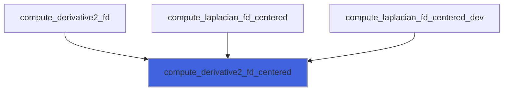

### compute_derivative3_fd_centered

Compute derivative of order 3 with finite difference centered scheme.

**Attributes**: pure

```fortran
subroutine compute_derivative3_fd_centered(s, ds, q, d3q_ds3)
```

**Arguments**

| Name | Type | Intent | Attributes | Description |
|------|------|--------|------------|-------------|
| `s` | integer(kind=[I4P](/api/src/third_party/PENF/src/lib/penf_global_parameters_variables)) | in |  | Stencil len, order=2*s. |
| `ds` | real(kind=[R8P](/api/src/third_party/PENF/src/lib/penf_global_parameters_variables)) | in |  | Space step. |
| `q` | real(kind=[R8P](/api/src/third_party/PENF/src/lib/penf_global_parameters_variables)) | in |  | Scalar field over the stencil [1-s:1+s]. |
| `d3q_ds3` | real(kind=[R8P](/api/src/third_party/PENF/src/lib/penf_global_parameters_variables)) | out |  | Derivative of order 3 of q, d3q/ds3. |

### compute_derivative4_fd_centered

Compute derivative of order 4 with finite difference centered scheme.

**Attributes**: pure

```fortran
subroutine compute_derivative4_fd_centered(s, ds, q, d4q_ds4)
```

**Arguments**

| Name | Type | Intent | Attributes | Description |
|------|------|--------|------------|-------------|
| `s` | integer(kind=[I4P](/api/src/third_party/PENF/src/lib/penf_global_parameters_variables)) | in |  | Stencil len, order=2*s-2. |
| `ds` | real(kind=[R8P](/api/src/third_party/PENF/src/lib/penf_global_parameters_variables)) | in |  | Space step. |
| `q` | real(kind=[R8P](/api/src/third_party/PENF/src/lib/penf_global_parameters_variables)) | in |  | Scalar field over the stencil [1-s:1+s]. |
| `d4q_ds4` | real(kind=[R8P](/api/src/third_party/PENF/src/lib/penf_global_parameters_variables)) | out |  | Derivative of order 4 of q, d4q/ds4. |

**Call graph**

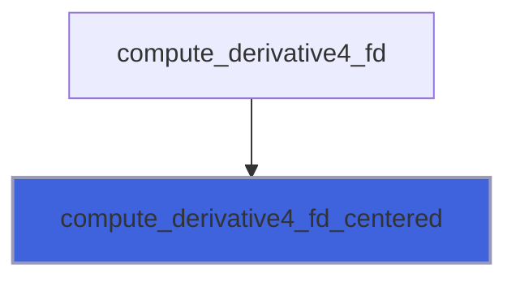

### compute_derivative5_fd_centered

Compute derivative of order 5 with finite difference centered scheme.

**Attributes**: pure

```fortran
subroutine compute_derivative5_fd_centered(s, ds, q, d5q_ds5)
```

**Arguments**

| Name | Type | Intent | Attributes | Description |
|------|------|--------|------------|-------------|
| `s` | integer(kind=[I4P](/api/src/third_party/PENF/src/lib/penf_global_parameters_variables)) | in |  | Stencil len, order=2*s. |
| `ds` | real(kind=[R8P](/api/src/third_party/PENF/src/lib/penf_global_parameters_variables)) | in |  | Space step. |
| `q` | real(kind=[R8P](/api/src/third_party/PENF/src/lib/penf_global_parameters_variables)) | in |  | Scalar field over the stencil [1-s:1+s]. |
| `d5q_ds5` | real(kind=[R8P](/api/src/third_party/PENF/src/lib/penf_global_parameters_variables)) | out |  | Derivative of order 5 of q, d5q/ds5. |

### compute_derivative6_fd_centered

Compute derivative of order 6 with finite difference centered scheme.

**Attributes**: pure

```fortran
subroutine compute_derivative6_fd_centered(s, ds, q, d6q_ds6)
```

**Arguments**

| Name | Type | Intent | Attributes | Description |
|------|------|--------|------------|-------------|
| `s` | integer(kind=[I4P](/api/src/third_party/PENF/src/lib/penf_global_parameters_variables)) | in |  | Stencil len, order=2*s-4. |
| `ds` | real(kind=[R8P](/api/src/third_party/PENF/src/lib/penf_global_parameters_variables)) | in |  | Space step. |
| `q` | real(kind=[R8P](/api/src/third_party/PENF/src/lib/penf_global_parameters_variables)) | in |  | Scalar field over the stencil [1-s:1+s]. |
| `d6q_ds6` | real(kind=[R8P](/api/src/third_party/PENF/src/lib/penf_global_parameters_variables)) | out |  | Derivative of order 6 of q, d6q/ds6. |

### compute_divergence_fd_centered

Compute divergence of q vector field with finite difference centered scheme.

**Attributes**: pure

```fortran
subroutine compute_divergence_fd_centered(s, dxyz, q, divergence)
```

**Arguments**

| Name | Type | Intent | Attributes | Description |
|------|------|--------|------------|-------------|
| `s` | integer(kind=[I4P](/api/src/third_party/PENF/src/lib/penf_global_parameters_variables)) | in |  | Stencil len, half of accuracy order. |
| `dxyz` | real(kind=[R8P](/api/src/third_party/PENF/src/lib/penf_global_parameters_variables)) | in |  | Space steps [1:3]. |
| `q` | real(kind=[R8P](/api/src/third_party/PENF/src/lib/penf_global_parameters_variables)) | in |  | Vector field over the stencil [1:3,1-s:1+s,1-s:1+s,1-s:1+s]. |
| `divergence` | real(kind=[R8P](/api/src/third_party/PENF/src/lib/penf_global_parameters_variables)) | out |  | Divergence of q. |

**Call graph**


### compute_gradient_fd_centered

Compute gradient of q scalar field with finite difference centered scheme.

**Attributes**: pure

```fortran
subroutine compute_gradient_fd_centered(s, dxyz, q, gradient)
```

**Arguments**

| Name | Type | Intent | Attributes | Description |
|------|------|--------|------------|-------------|
| `s` | integer(kind=[I4P](/api/src/third_party/PENF/src/lib/penf_global_parameters_variables)) | in |  | Stencil len, half of accuracy order. |
| `dxyz` | real(kind=[R8P](/api/src/third_party/PENF/src/lib/penf_global_parameters_variables)) | in |  | Space steps [1:3]. |
| `q` | real(kind=[R8P](/api/src/third_party/PENF/src/lib/penf_global_parameters_variables)) | in |  | Scalar field over the stencil [1-s:1+s,1-s:1+s,1-s:1+s]. |
| `gradient` | real(kind=[R8P](/api/src/third_party/PENF/src/lib/penf_global_parameters_variables)) | out |  | Gradient of q [1:3]. |

**Call graph**

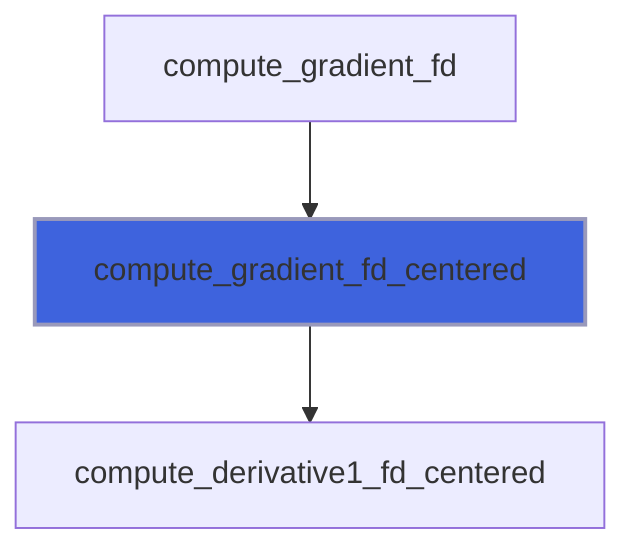

### compute_laplacian_fd_centered

Compute laplacian of q scalar field with finite difference centered scheme.

**Attributes**: pure

```fortran
subroutine compute_laplacian_fd_centered(s, dxyz, q, laplacian)
```

**Arguments**

| Name | Type | Intent | Attributes | Description |
|------|------|--------|------------|-------------|
| `s` | integer(kind=[I4P](/api/src/third_party/PENF/src/lib/penf_global_parameters_variables)) | in |  | Stencil len, half of accuracy order. |
| `dxyz` | real(kind=[R8P](/api/src/third_party/PENF/src/lib/penf_global_parameters_variables)) | in |  | Space steps [1:3]. |
| `q` | real(kind=[R8P](/api/src/third_party/PENF/src/lib/penf_global_parameters_variables)) | in |  | Scalar field over the stencil [1-s:1+s,1-s:1+s,1-s:1+s]. |
| `laplacian` | real(kind=[R8P](/api/src/third_party/PENF/src/lib/penf_global_parameters_variables)) | out |  | Laplacian of q. |

**Call graph**

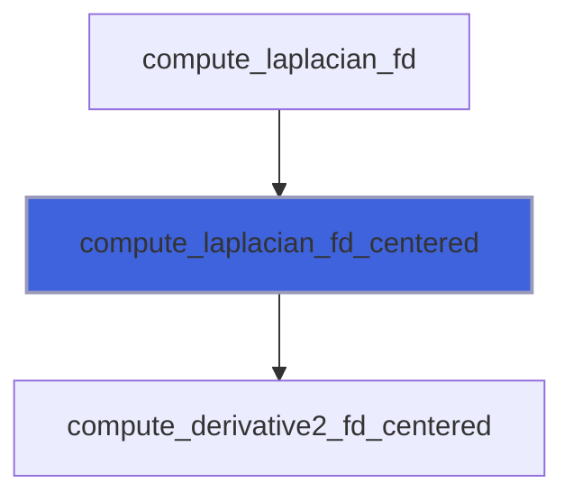

### compute_curl_fv_centered

Compute curl of q vector field with finite volume centered scheme.

**Attributes**: pure

```fortran
subroutine compute_curl_fv_centered(s, dxyz, q, curl)
```

**Arguments**

| Name | Type | Intent | Attributes | Description |
|------|------|--------|------------|-------------|
| `s` | integer(kind=[I4P](/api/src/third_party/PENF/src/lib/penf_global_parameters_variables)) | in |  | Stencil len, half of accuracy order. |
| `dxyz` | real(kind=[R8P](/api/src/third_party/PENF/src/lib/penf_global_parameters_variables)) | in |  | Space steps [1:3]. |
| `q` | real(kind=[R8P](/api/src/third_party/PENF/src/lib/penf_global_parameters_variables)) | in |  | Vector field over the stencil [1:3,1-s:1+s,1-s:1+s,1-s:1+s]. |
| `curl` | real(kind=[R8P](/api/src/third_party/PENF/src/lib/penf_global_parameters_variables)) | out |  | Curl of q [1:3]. |

**Call graph**


### compute_derivative1_fv_centered

Compute derivative of order 1 with finite volume centered scheme.

**Attributes**: pure

```fortran
subroutine compute_derivative1_fv_centered(s, ds, q, dq_ds)
```

**Arguments**

| Name | Type | Intent | Attributes | Description |
|------|------|--------|------------|-------------|
| `s` | integer(kind=[I4P](/api/src/third_party/PENF/src/lib/penf_global_parameters_variables)) | in |  | Stencil len, half of accuracy order. |
| `ds` | real(kind=[R8P](/api/src/third_party/PENF/src/lib/penf_global_parameters_variables)) | in |  | Space step. |
| `q` | real(kind=[R8P](/api/src/third_party/PENF/src/lib/penf_global_parameters_variables)) | in |  | Scalar field over the stencil [1-s:1+s]. |
| `dq_ds` | real(kind=[R8P](/api/src/third_party/PENF/src/lib/penf_global_parameters_variables)) | out |  | Derivative of order 1 of q, dq/ds. |

**Call graph**

```mermaid
flowchart TD
  compute_curl_fv_centered["compute_curl_fv_centered"] --> compute_derivative1_fv_centered["compute_derivative1_fv_centered"]
  compute_curl_fv_centered_dev["compute_curl_fv_centered_dev"] --> compute_derivative1_fv_centered["compute_derivative1_fv_centered"]
  compute_derivative1_fv["compute_derivative1_fv"] --> compute_derivative1_fv_centered["compute_derivative1_fv_centered"]
  compute_derivative2_fv_centered["compute_derivative2_fv_centered"] --> compute_derivative1_fv_centered["compute_derivative1_fv_centered"]
  compute_divergence_fv_centered["compute_divergence_fv_centered"] --> compute_derivative1_fv_centered["compute_derivative1_fv_centered"]
  compute_divergence_fv_centered_dev["compute_divergence_fv_centered_dev"] --> compute_derivative1_fv_centered["compute_derivative1_fv_centered"]
  compute_gradient_fv_centered["compute_gradient_fv_centered"] --> compute_derivative1_fv_centered["compute_derivative1_fv_centered"]
  compute_gradient_fv_centered_dev["compute_gradient_fv_centered_dev"] --> compute_derivative1_fv_centered["compute_derivative1_fv_centered"]
  compute_derivative1_fv_centered["compute_derivative1_fv_centered"] --> compute_reconstruction_r_fv_centered["compute_reconstruction_r_fv_centered"]
  style compute_derivative1_fv_centered fill:#3e63dd,stroke:#99b,stroke-width:2px
```

### compute_derivative2_fv_centered

Compute derivative of order 2 with finite volume centered scheme.

**Attributes**: pure

```fortran
subroutine compute_derivative2_fv_centered(s, ds, q, d2q_ds2)
```

**Arguments**

| Name | Type | Intent | Attributes | Description |
|------|------|--------|------------|-------------|
| `s` | integer(kind=[I4P](/api/src/third_party/PENF/src/lib/penf_global_parameters_variables)) | in |  | Stencil len, half of accuracy order. |
| `ds` | real(kind=[R8P](/api/src/third_party/PENF/src/lib/penf_global_parameters_variables)) | in |  | Space step. |
| `q` | real(kind=[R8P](/api/src/third_party/PENF/src/lib/penf_global_parameters_variables)) | in |  | Scalar field over the stencil [1-s:1+s]. |
| `d2q_ds2` | real(kind=[R8P](/api/src/third_party/PENF/src/lib/penf_global_parameters_variables)) | out |  | Derivative of order 2 of q, d2q/ds2. |

**Call graph**

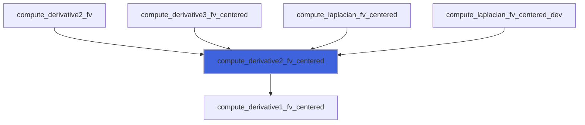

### compute_derivative3_fv_centered

Compute derivative of order 3 with finite volume centered scheme.

**Attributes**: pure

```fortran
subroutine compute_derivative3_fv_centered(s, ds, q, d3q_ds3)
```

**Arguments**

| Name | Type | Intent | Attributes | Description |
|------|------|--------|------------|-------------|
| `s` | integer(kind=[I4P](/api/src/third_party/PENF/src/lib/penf_global_parameters_variables)) | in |  | Stencil len, half of accuracy order. |
| `ds` | real(kind=[R8P](/api/src/third_party/PENF/src/lib/penf_global_parameters_variables)) | in |  | Space step. |
| `q` | real(kind=[R8P](/api/src/third_party/PENF/src/lib/penf_global_parameters_variables)) | in |  | Scalar field over the stencil [1-s:1+s]. |
| `d3q_ds3` | real(kind=[R8P](/api/src/third_party/PENF/src/lib/penf_global_parameters_variables)) | out |  | Derivative of order 3 of q, d3q/ds3. |

**Call graph**


### compute_derivative4_fv_centered

Compute derivative of order 4 with finite volume centered scheme.

**Attributes**: pure

```fortran
subroutine compute_derivative4_fv_centered(s, ds, q, d4q_ds4)
```

**Arguments**

| Name | Type | Intent | Attributes | Description |
|------|------|--------|------------|-------------|
| `s` | integer(kind=[I4P](/api/src/third_party/PENF/src/lib/penf_global_parameters_variables)) | in |  | Stencil len, half of accuracy order. |
| `ds` | real(kind=[R8P](/api/src/third_party/PENF/src/lib/penf_global_parameters_variables)) | in |  | Space step. |
| `q` | real(kind=[R8P](/api/src/third_party/PENF/src/lib/penf_global_parameters_variables)) | in |  | Scalar field over the stencil [1-s:1+s]. |
| `d4q_ds4` | real(kind=[R8P](/api/src/third_party/PENF/src/lib/penf_global_parameters_variables)) | out |  | Derivative of order 4 of q, d4q/ds4. |

**Call graph**


### compute_derivative5_fv_centered

Compute derivative of order 5 with finite volume centered scheme.

**Attributes**: pure

```fortran
subroutine compute_derivative5_fv_centered(s, ds, q, d5q_ds5)
```

**Arguments**

| Name | Type | Intent | Attributes | Description |
|------|------|--------|------------|-------------|
| `s` | integer(kind=[I4P](/api/src/third_party/PENF/src/lib/penf_global_parameters_variables)) | in |  | Stencil len, half of accuracy order. |
| `ds` | real(kind=[R8P](/api/src/third_party/PENF/src/lib/penf_global_parameters_variables)) | in |  | Space step. |
| `q` | real(kind=[R8P](/api/src/third_party/PENF/src/lib/penf_global_parameters_variables)) | in |  | Scalar field over the stencil [1-s:1+s]. |
| `d5q_ds5` | real(kind=[R8P](/api/src/third_party/PENF/src/lib/penf_global_parameters_variables)) | out |  | Derivative of order 5 of q, d5q/ds5. |

**Call graph**

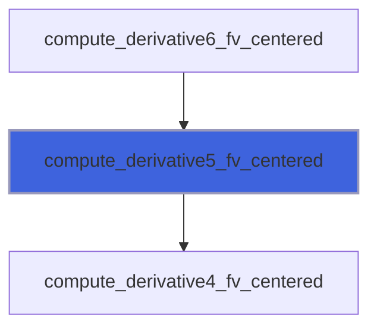

### compute_derivative6_fv_centered

Compute derivative of order 6 with finite volume centered scheme.

**Attributes**: pure

```fortran
subroutine compute_derivative6_fv_centered(s, ds, q, d6q_ds6)
```

**Arguments**

| Name | Type | Intent | Attributes | Description |
|------|------|--------|------------|-------------|
| `s` | integer(kind=[I4P](/api/src/third_party/PENF/src/lib/penf_global_parameters_variables)) | in |  | Stencil len, half of accuracy order. |
| `ds` | real(kind=[R8P](/api/src/third_party/PENF/src/lib/penf_global_parameters_variables)) | in |  | Space step. |
| `q` | real(kind=[R8P](/api/src/third_party/PENF/src/lib/penf_global_parameters_variables)) | in |  | Scalar field over the stencil [1-s:1+s]. |
| `d6q_ds6` | real(kind=[R8P](/api/src/third_party/PENF/src/lib/penf_global_parameters_variables)) | out |  | Derivative of order 6 of q, d6q/ds6. |

**Call graph**


### compute_divergence_fv_centered

Compute divergence of q vector field with finite volume centered scheme.

**Attributes**: pure

```fortran
subroutine compute_divergence_fv_centered(s, dxyz, q, divergence)
```

**Arguments**

| Name | Type | Intent | Attributes | Description |
|------|------|--------|------------|-------------|
| `s` | integer(kind=[I4P](/api/src/third_party/PENF/src/lib/penf_global_parameters_variables)) | in |  | Stencil len, half of accuracy order. |
| `dxyz` | real(kind=[R8P](/api/src/third_party/PENF/src/lib/penf_global_parameters_variables)) | in |  | Space steps [1:3]. |
| `q` | real(kind=[R8P](/api/src/third_party/PENF/src/lib/penf_global_parameters_variables)) | in |  | Vector field over the stencil [1:3,1-s:1+s,1-s:1+s,1-s:1+s]. |
| `divergence` | real(kind=[R8P](/api/src/third_party/PENF/src/lib/penf_global_parameters_variables)) | out |  | Divergence of q. |

**Call graph**

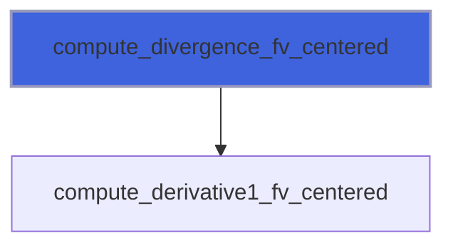

### compute_gradient_fv_centered

Compute gradient of q scalar field with finite volume centered scheme.

**Attributes**: pure

```fortran
subroutine compute_gradient_fv_centered(s, dxyz, q, gradient)
```

**Arguments**

| Name | Type | Intent | Attributes | Description |
|------|------|--------|------------|-------------|
| `s` | integer(kind=[I4P](/api/src/third_party/PENF/src/lib/penf_global_parameters_variables)) | in |  | Stencil len, half of accuracy order. |
| `dxyz` | real(kind=[R8P](/api/src/third_party/PENF/src/lib/penf_global_parameters_variables)) | in |  | Space steps [1:3]. |
| `q` | real(kind=[R8P](/api/src/third_party/PENF/src/lib/penf_global_parameters_variables)) | in |  | Scalar field over the stencil [1-s:1+s,1-s:1+s,1-s:1+s]. |
| `gradient` | real(kind=[R8P](/api/src/third_party/PENF/src/lib/penf_global_parameters_variables)) | out |  | Gradient of q [1:3]. |

**Call graph**

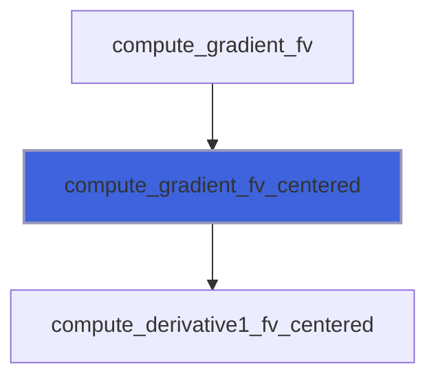

### compute_laplacian_fv_centered

Compute laplacian of q scalar field with finite volume centered scheme.

**Attributes**: pure

```fortran
subroutine compute_laplacian_fv_centered(s, dxyz, q, laplacian)
```

**Arguments**

| Name | Type | Intent | Attributes | Description |
|------|------|--------|------------|-------------|
| `s` | integer(kind=[I4P](/api/src/third_party/PENF/src/lib/penf_global_parameters_variables)) | in |  | Stencil len, half of accuracy order. |
| `dxyz` | real(kind=[R8P](/api/src/third_party/PENF/src/lib/penf_global_parameters_variables)) | in |  | Space steps [1:3]. |
| `q` | real(kind=[R8P](/api/src/third_party/PENF/src/lib/penf_global_parameters_variables)) | in |  | Scalar field over the stencil [1-s:1+s,1-s:1+s,1-s:1+s]. |
| `laplacian` | real(kind=[R8P](/api/src/third_party/PENF/src/lib/penf_global_parameters_variables)) | out |  | Laplacian of q. |

**Call graph**

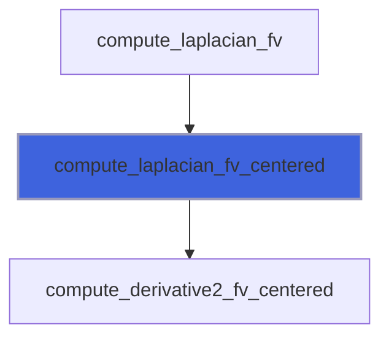

### compute_reconstruction_r_fv_centered

Compute reconstruction at right interface from cell center average values. Centered schemes.

**Attributes**: pure

```fortran
subroutine compute_reconstruction_r_fv_centered(s, q, qr)
```

**Arguments**

| Name | Type | Intent | Attributes | Description |
|------|------|--------|------------|-------------|
| `s` | integer(kind=[I4P](/api/src/third_party/PENF/src/lib/penf_global_parameters_variables)) | in |  | Stencil len, half of accuracy order. |
| `q` | real(kind=[R8P](/api/src/third_party/PENF/src/lib/penf_global_parameters_variables)) | in |  | Scalar field over the stencil [1-s:s]. |
| `qr` | real(kind=[R8P](/api/src/third_party/PENF/src/lib/penf_global_parameters_variables)) | out |  | Reconstruction at right interface of field. |

**Call graph**

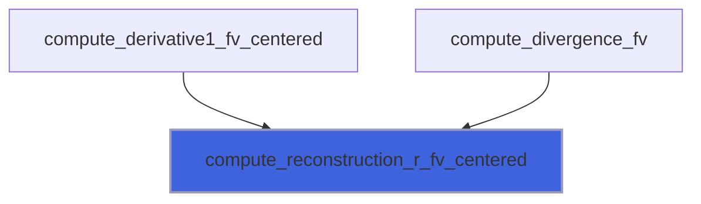

### compute_derivative1_fv_rupwind

Compute derivative of order 1 with finite volume right-upwind scheme.

**Attributes**: pure

```fortran
subroutine compute_derivative1_fv_rupwind(s, ds, q, dq_ds)
```

**Arguments**

| Name | Type | Intent | Attributes | Description |
|------|------|--------|------------|-------------|
| `s` | integer(kind=[I4P](/api/src/third_party/PENF/src/lib/penf_global_parameters_variables)) | in |  | Stencil len, accuracy order. |
| `ds` | real(kind=[R8P](/api/src/third_party/PENF/src/lib/penf_global_parameters_variables)) | in |  | Space step. |
| `q` | real(kind=[R8P](/api/src/third_party/PENF/src/lib/penf_global_parameters_variables)) | in |  | Scalar field over the stencil [0:1+s]. |
| `dq_ds` | real(kind=[R8P](/api/src/third_party/PENF/src/lib/penf_global_parameters_variables)) | out |  | Derivative of order 1 of q, dq/ds. |

**Call graph**

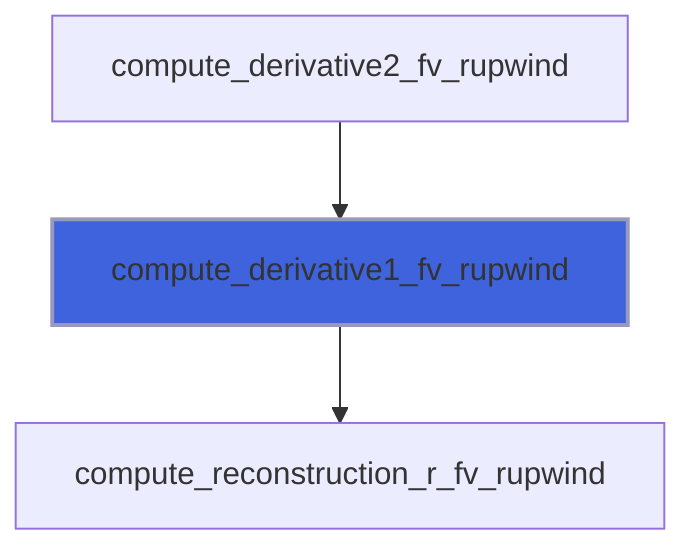

### compute_derivative2_fv_rupwind

Compute derivative of order 2 with finite volume right-upwind scheme.

**Attributes**: pure

```fortran
subroutine compute_derivative2_fv_rupwind(s, ds, q, d2q_ds2)
```

**Arguments**

| Name | Type | Intent | Attributes | Description |
|------|------|--------|------------|-------------|
| `s` | integer(kind=[I4P](/api/src/third_party/PENF/src/lib/penf_global_parameters_variables)) | in |  | Stencil len, half of accuracy order. |
| `ds` | real(kind=[R8P](/api/src/third_party/PENF/src/lib/penf_global_parameters_variables)) | in |  | Space step. |
| `q` | real(kind=[R8P](/api/src/third_party/PENF/src/lib/penf_global_parameters_variables)) | in |  | Scalar field over the stencil [0:1+s]. |
| `d2q_ds2` | real(kind=[R8P](/api/src/third_party/PENF/src/lib/penf_global_parameters_variables)) | out |  | Derivative of order 2 of q, d2q/ds2. |

**Call graph**

```mermaid
flowchart TD
  compute_derivative3_fv_rupwind["compute_derivative3_fv_rupwind"] --> compute_derivative2_fv_rupwind["compute_derivative2_fv_rupwind"]
  compute_derivative2_fv_rupwind["compute_derivative2_fv_rupwind"] --> compute_derivative1_fv_rupwind["compute_derivative1_fv_rupwind"]
  style compute_derivative2_fv_rupwind fill:#3e63dd,stroke:#99b,stroke-width:2px
```

### compute_derivative3_fv_rupwind

Compute derivative of order 3 with finite volume right-upwind scheme.

**Attributes**: pure

```fortran
subroutine compute_derivative3_fv_rupwind(s, ds, q, d3q_ds3)
```

**Arguments**

| Name | Type | Intent | Attributes | Description |
|------|------|--------|------------|-------------|
| `s` | integer(kind=[I4P](/api/src/third_party/PENF/src/lib/penf_global_parameters_variables)) | in |  | Stencil len, half of accuracy order. |
| `ds` | real(kind=[R8P](/api/src/third_party/PENF/src/lib/penf_global_parameters_variables)) | in |  | Space step. |
| `q` | real(kind=[R8P](/api/src/third_party/PENF/src/lib/penf_global_parameters_variables)) | in |  | Scalar field over the stencil [0:1+s]. |
| `d3q_ds3` | real(kind=[R8P](/api/src/third_party/PENF/src/lib/penf_global_parameters_variables)) | out |  | Derivative of order 3 of q, d3q/ds3. |

**Call graph**

```mermaid
flowchart TD
  compute_derivative4_fv_rupwind["compute_derivative4_fv_rupwind"] --> compute_derivative3_fv_rupwind["compute_derivative3_fv_rupwind"]
  compute_derivative3_fv_rupwind["compute_derivative3_fv_rupwind"] --> compute_derivative2_fv_rupwind["compute_derivative2_fv_rupwind"]
  style compute_derivative3_fv_rupwind fill:#3e63dd,stroke:#99b,stroke-width:2px
```

### compute_derivative4_fv_rupwind

Compute derivative of order 4 with finite volume right-upwind scheme.

**Attributes**: pure

```fortran
subroutine compute_derivative4_fv_rupwind(s, ds, q, d4q_ds4)
```

**Arguments**

| Name | Type | Intent | Attributes | Description |
|------|------|--------|------------|-------------|
| `s` | integer(kind=[I4P](/api/src/third_party/PENF/src/lib/penf_global_parameters_variables)) | in |  | Stencil len, half of accuracy order. |
| `ds` | real(kind=[R8P](/api/src/third_party/PENF/src/lib/penf_global_parameters_variables)) | in |  | Space step. |
| `q` | real(kind=[R8P](/api/src/third_party/PENF/src/lib/penf_global_parameters_variables)) | in |  | Scalar field over the stencil [0:1+s]. |
| `d4q_ds4` | real(kind=[R8P](/api/src/third_party/PENF/src/lib/penf_global_parameters_variables)) | out |  | Derivative of order 4 of q, d4q/ds4. |

**Call graph**

```mermaid
flowchart TD
  compute_derivative5_fv_rupwind["compute_derivative5_fv_rupwind"] --> compute_derivative4_fv_rupwind["compute_derivative4_fv_rupwind"]
  compute_derivative4_fv_rupwind["compute_derivative4_fv_rupwind"] --> compute_derivative3_fv_rupwind["compute_derivative3_fv_rupwind"]
  style compute_derivative4_fv_rupwind fill:#3e63dd,stroke:#99b,stroke-width:2px
```

### compute_derivative5_fv_rupwind

Compute derivative of order 5 with finite volume right-upwind scheme.

**Attributes**: pure

```fortran
subroutine compute_derivative5_fv_rupwind(s, ds, q, d5q_ds5)
```

**Arguments**

| Name | Type | Intent | Attributes | Description |
|------|------|--------|------------|-------------|
| `s` | integer(kind=[I4P](/api/src/third_party/PENF/src/lib/penf_global_parameters_variables)) | in |  | Stencil len, half of accuracy order. |
| `ds` | real(kind=[R8P](/api/src/third_party/PENF/src/lib/penf_global_parameters_variables)) | in |  | Space step. |
| `q` | real(kind=[R8P](/api/src/third_party/PENF/src/lib/penf_global_parameters_variables)) | in |  | Scalar field over the stencil [0:1+s]. |
| `d5q_ds5` | real(kind=[R8P](/api/src/third_party/PENF/src/lib/penf_global_parameters_variables)) | out |  | Derivative of order 5 of q, d5q/ds5. |

**Call graph**

```mermaid
flowchart TD
  compute_derivative6_fv_rupwind["compute_derivative6_fv_rupwind"] --> compute_derivative5_fv_rupwind["compute_derivative5_fv_rupwind"]
  compute_derivative5_fv_rupwind["compute_derivative5_fv_rupwind"] --> compute_derivative4_fv_rupwind["compute_derivative4_fv_rupwind"]
  style compute_derivative5_fv_rupwind fill:#3e63dd,stroke:#99b,stroke-width:2px
```

### compute_derivative6_fv_rupwind

Compute derivative of order 6 with finite volume right-upwind scheme.

**Attributes**: pure

```fortran
subroutine compute_derivative6_fv_rupwind(s, ds, q, d6q_ds6)
```

**Arguments**

| Name | Type | Intent | Attributes | Description |
|------|------|--------|------------|-------------|
| `s` | integer(kind=[I4P](/api/src/third_party/PENF/src/lib/penf_global_parameters_variables)) | in |  | Stencil len, half of accuracy order. |
| `ds` | real(kind=[R8P](/api/src/third_party/PENF/src/lib/penf_global_parameters_variables)) | in |  | Space step. |
| `q` | real(kind=[R8P](/api/src/third_party/PENF/src/lib/penf_global_parameters_variables)) | in |  | Scalar field over the stencil [0:1+s]. |
| `d6q_ds6` | real(kind=[R8P](/api/src/third_party/PENF/src/lib/penf_global_parameters_variables)) | out |  | Derivative of order 6 of q, d6q/ds6. |

**Call graph**

```mermaid
flowchart TD
  compute_derivative6_fv_rupwind["compute_derivative6_fv_rupwind"] --> compute_derivative5_fv_rupwind["compute_derivative5_fv_rupwind"]
  style compute_derivative6_fv_rupwind fill:#3e63dd,stroke:#99b,stroke-width:2px
```

### compute_reconstruction_r_fv_rupwind

Compute reconstruction at right interface from cell center average values, left-upwind schemes.

**Attributes**: pure

```fortran
subroutine compute_reconstruction_r_fv_rupwind(s, q, qr)
```

**Arguments**

| Name | Type | Intent | Attributes | Description |
|------|------|--------|------------|-------------|
| `s` | integer(kind=[I4P](/api/src/third_party/PENF/src/lib/penf_global_parameters_variables)) | in |  | Stencil len, accuracy order. |
| `q` | real(kind=[R8P](/api/src/third_party/PENF/src/lib/penf_global_parameters_variables)) | in |  | Scalar field over the stencil [0:s]. |
| `qr` | real(kind=[R8P](/api/src/third_party/PENF/src/lib/penf_global_parameters_variables)) | out |  | Reconstruction at right interface of field. |

**Call graph**

```mermaid
flowchart TD
  compute_derivative1_fv_rupwind["compute_derivative1_fv_rupwind"] --> compute_reconstruction_r_fv_rupwind["compute_reconstruction_r_fv_rupwind"]
  style compute_reconstruction_r_fv_rupwind fill:#3e63dd,stroke:#99b,stroke-width:2px
```

### compute_derivative1_fv_lupwind

Compute derivative of order 1 with finite volume left-upwind scheme.

**Attributes**: pure

```fortran
subroutine compute_derivative1_fv_lupwind(s, ds, q, dq_ds)
```

**Arguments**

| Name | Type | Intent | Attributes | Description |
|------|------|--------|------------|-------------|
| `s` | integer(kind=[I4P](/api/src/third_party/PENF/src/lib/penf_global_parameters_variables)) | in |  | Stencil len, accuracy order. |
| `ds` | real(kind=[R8P](/api/src/third_party/PENF/src/lib/penf_global_parameters_variables)) | in |  | Space step. |
| `q` | real(kind=[R8P](/api/src/third_party/PENF/src/lib/penf_global_parameters_variables)) | in |  | Scalar field over the stencil [-s:0]. |
| `dq_ds` | real(kind=[R8P](/api/src/third_party/PENF/src/lib/penf_global_parameters_variables)) | out |  | Derivative of order 1 of q, dq/ds. |

**Call graph**

```mermaid
flowchart TD
  compute_derivative2_fv_lupwind["compute_derivative2_fv_lupwind"] --> compute_derivative1_fv_lupwind["compute_derivative1_fv_lupwind"]
  compute_derivative1_fv_lupwind["compute_derivative1_fv_lupwind"] --> compute_reconstruction_r_fv_lupwind["compute_reconstruction_r_fv_lupwind"]
  style compute_derivative1_fv_lupwind fill:#3e63dd,stroke:#99b,stroke-width:2px
```

### compute_derivative2_fv_lupwind

Compute derivative of order 2 with finite volume left-upwind scheme.

**Attributes**: pure

```fortran
subroutine compute_derivative2_fv_lupwind(s, ds, q, d2q_ds2)
```

**Arguments**

| Name | Type | Intent | Attributes | Description |
|------|------|--------|------------|-------------|
| `s` | integer(kind=[I4P](/api/src/third_party/PENF/src/lib/penf_global_parameters_variables)) | in |  | Stencil len, half of accuracy order. |
| `ds` | real(kind=[R8P](/api/src/third_party/PENF/src/lib/penf_global_parameters_variables)) | in |  | Space step. |
| `q` | real(kind=[R8P](/api/src/third_party/PENF/src/lib/penf_global_parameters_variables)) | in |  | Scalar field over the stencil [-s:0]. |
| `d2q_ds2` | real(kind=[R8P](/api/src/third_party/PENF/src/lib/penf_global_parameters_variables)) | out |  | Derivative of order 2 of q, d2q/ds2. |

**Call graph**

```mermaid
flowchart TD
  compute_derivative3_fv_lupwind["compute_derivative3_fv_lupwind"] --> compute_derivative2_fv_lupwind["compute_derivative2_fv_lupwind"]
  compute_derivative2_fv_lupwind["compute_derivative2_fv_lupwind"] --> compute_derivative1_fv_lupwind["compute_derivative1_fv_lupwind"]
  style compute_derivative2_fv_lupwind fill:#3e63dd,stroke:#99b,stroke-width:2px
```

### compute_derivative3_fv_lupwind

Compute derivative of order 3 with finite volume left-upwind scheme.

**Attributes**: pure

```fortran
subroutine compute_derivative3_fv_lupwind(s, ds, q, d3q_ds3)
```

**Arguments**

| Name | Type | Intent | Attributes | Description |
|------|------|--------|------------|-------------|
| `s` | integer(kind=[I4P](/api/src/third_party/PENF/src/lib/penf_global_parameters_variables)) | in |  | Stencil len, half of accuracy order. |
| `ds` | real(kind=[R8P](/api/src/third_party/PENF/src/lib/penf_global_parameters_variables)) | in |  | Space step. |
| `q` | real(kind=[R8P](/api/src/third_party/PENF/src/lib/penf_global_parameters_variables)) | in |  | Scalar field over the stencil [-s:0]. |
| `d3q_ds3` | real(kind=[R8P](/api/src/third_party/PENF/src/lib/penf_global_parameters_variables)) | out |  | Derivative of order 3 of q, d3q/ds3. |

**Call graph**

```mermaid
flowchart TD
  compute_derivative4_fv_lupwind["compute_derivative4_fv_lupwind"] --> compute_derivative3_fv_lupwind["compute_derivative3_fv_lupwind"]
  compute_derivative3_fv_lupwind["compute_derivative3_fv_lupwind"] --> compute_derivative2_fv_lupwind["compute_derivative2_fv_lupwind"]
  style compute_derivative3_fv_lupwind fill:#3e63dd,stroke:#99b,stroke-width:2px
```

### compute_derivative4_fv_lupwind

Compute derivative of order 4 with finite volume left-upwind scheme.

**Attributes**: pure

```fortran
subroutine compute_derivative4_fv_lupwind(s, ds, q, d4q_ds4)
```

**Arguments**

| Name | Type | Intent | Attributes | Description |
|------|------|--------|------------|-------------|
| `s` | integer(kind=[I4P](/api/src/third_party/PENF/src/lib/penf_global_parameters_variables)) | in |  | Stencil len, half of accuracy order. |
| `ds` | real(kind=[R8P](/api/src/third_party/PENF/src/lib/penf_global_parameters_variables)) | in |  | Space step. |
| `q` | real(kind=[R8P](/api/src/third_party/PENF/src/lib/penf_global_parameters_variables)) | in |  | Scalar field over the stencil [-s:0]. |
| `d4q_ds4` | real(kind=[R8P](/api/src/third_party/PENF/src/lib/penf_global_parameters_variables)) | out |  | Derivative of order 4 of q, d4q/ds4. |

**Call graph**

```mermaid
flowchart TD
  compute_derivative5_fv_lupwind["compute_derivative5_fv_lupwind"] --> compute_derivative4_fv_lupwind["compute_derivative4_fv_lupwind"]
  compute_derivative4_fv_lupwind["compute_derivative4_fv_lupwind"] --> compute_derivative3_fv_lupwind["compute_derivative3_fv_lupwind"]
  style compute_derivative4_fv_lupwind fill:#3e63dd,stroke:#99b,stroke-width:2px
```

### compute_derivative5_fv_lupwind

Compute derivative of order 5 with finite volume left-upwind scheme.

**Attributes**: pure

```fortran
subroutine compute_derivative5_fv_lupwind(s, ds, q, d5q_ds5)
```

**Arguments**

| Name | Type | Intent | Attributes | Description |
|------|------|--------|------------|-------------|
| `s` | integer(kind=[I4P](/api/src/third_party/PENF/src/lib/penf_global_parameters_variables)) | in |  | Stencil len, half of accuracy order. |
| `ds` | real(kind=[R8P](/api/src/third_party/PENF/src/lib/penf_global_parameters_variables)) | in |  | Space step. |
| `q` | real(kind=[R8P](/api/src/third_party/PENF/src/lib/penf_global_parameters_variables)) | in |  | Scalar field over the stencil [-s:0]. |
| `d5q_ds5` | real(kind=[R8P](/api/src/third_party/PENF/src/lib/penf_global_parameters_variables)) | out |  | Derivative of order 5 of q, d5q/ds5. |

**Call graph**

```mermaid
flowchart TD
  compute_derivative6_fv_lupwind["compute_derivative6_fv_lupwind"] --> compute_derivative5_fv_lupwind["compute_derivative5_fv_lupwind"]
  compute_derivative5_fv_lupwind["compute_derivative5_fv_lupwind"] --> compute_derivative4_fv_lupwind["compute_derivative4_fv_lupwind"]
  style compute_derivative5_fv_lupwind fill:#3e63dd,stroke:#99b,stroke-width:2px
```

### compute_derivative6_fv_lupwind

Compute derivative of order 6 with finite volume left-upwind scheme.

**Attributes**: pure

```fortran
subroutine compute_derivative6_fv_lupwind(s, ds, q, d6q_ds6)
```

**Arguments**

| Name | Type | Intent | Attributes | Description |
|------|------|--------|------------|-------------|
| `s` | integer(kind=[I4P](/api/src/third_party/PENF/src/lib/penf_global_parameters_variables)) | in |  | Stencil len, half of accuracy order. |
| `ds` | real(kind=[R8P](/api/src/third_party/PENF/src/lib/penf_global_parameters_variables)) | in |  | Space step. |
| `q` | real(kind=[R8P](/api/src/third_party/PENF/src/lib/penf_global_parameters_variables)) | in |  | Scalar field over the stencil [-s:0]. |
| `d6q_ds6` | real(kind=[R8P](/api/src/third_party/PENF/src/lib/penf_global_parameters_variables)) | out |  | Derivative of order 6 of q, d6q/ds6. |

**Call graph**

```mermaid
flowchart TD
  compute_derivative6_fv_lupwind["compute_derivative6_fv_lupwind"] --> compute_derivative5_fv_lupwind["compute_derivative5_fv_lupwind"]
  style compute_derivative6_fv_lupwind fill:#3e63dd,stroke:#99b,stroke-width:2px
```

### compute_reconstruction_r_fv_lupwind

Compute reconstruction at right interface from cell center average values, left-upwind schemes.

**Attributes**: pure

```fortran
subroutine compute_reconstruction_r_fv_lupwind(s, q, qr)
```

**Arguments**

| Name | Type | Intent | Attributes | Description |
|------|------|--------|------------|-------------|
| `s` | integer(kind=[I4P](/api/src/third_party/PENF/src/lib/penf_global_parameters_variables)) | in |  | Stencil len, accuracy order. |
| `q` | real(kind=[R8P](/api/src/third_party/PENF/src/lib/penf_global_parameters_variables)) | in |  | Scalar field over the stencil [1-s:0]. |
| `qr` | real(kind=[R8P](/api/src/third_party/PENF/src/lib/penf_global_parameters_variables)) | out |  | Reconstruction at right interface of field. |

**Call graph**

```mermaid
flowchart TD
  compute_derivative1_fv_lupwind["compute_derivative1_fv_lupwind"] --> compute_reconstruction_r_fv_lupwind["compute_reconstruction_r_fv_lupwind"]
  style compute_reconstruction_r_fv_lupwind fill:#3e63dd,stroke:#99b,stroke-width:2px
```
