# adam_field_object

> ADAM, field class definition.

 A structured block is composed of hexahedron finite volumes with quadrilateral faces using the
 following internal numeration for nodes and faces:
```
 /|\Z
  |                            F(4)         _ F(6)
  |                            /|\          /!
  |                        7    |          /    8
  |                         *------------------*
  |                        /|   |        /    /|
  |                       / |   |       /    / |
  |                      /  |   |      /    /  |
  |                     /   |   |     /    /   |
  |                    /    |   |    +    /    |
  |                   /     |   |        /     |
  |                  /      |   +       /      |
  |                 /      3|          /       |4
  |                /        * --------/--------*
  |      F(1)<----/----+   /         /        /
  |              *------------------*    +-------->F(2)
  |             5|       /          |6      /
  |              |      /           |      /
  |              |     /        +   |     /
  |              |    /         |   |    /
  |              |   /      +   |   |   /
  |              |  /      /    |   |  /
  |              | /      /     |   | /
  |              |/      /      |   |/
  |              *------------------*
  |             1      /        |    2
  |                   /        \|/
  |   _ Y           |/_       F(3)
  |   /|         F(5)
  |  /
  | /
  |/                                                    X
  O----------------------------------------------------->
```
 Each hexadron cells is faces-connected to its neighboring, thus the cells build a structured block with implicit
 connectivity, e.g. in 2D space a FriVolous block could be as the following:
```
                 _ J
                 /|                          _____
               5+ ...*----*----*----*----*...     |
               /    /    /    /    /    /         |
              /    /    /    /    /    /          |
            4+ ...*----*----*----*----*...        |
            /    /    /    /    /    /            |
           /    /    /    /    /    /             |
         3+ ...*----*----*----*----*...           |  Structured block of 4x4 Finite Volumes
         /    /    / FV /    /    /               |
        /    /    /    /    /    /                |
      2+ ...*----*----*----*----*...              |
      /    /    /    /    /    /                  |
     /    /    /    /    /    /                   |
   1+ ...*----*----*----*----*...                 |
   /     .    .    .    .    .                    |
  /      .    .    .    .    .               _____
 O-------+----+----+----+----+-------------> I
         1    2    3    4    5
```

**Source**: `src/lib/common/adam_field_object.F90`

**Dependencies**

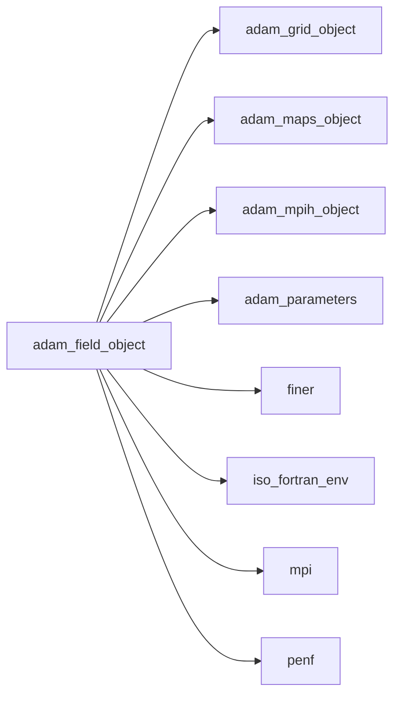

## Contents

- [field_object](#field-object)
- [adapt](#adapt)
- [blocks_reorder](#blocks-reorder)
- [compute_metrics](#compute-metrics)
- [compute_normL2_residuals](#compute-norml2-residuals)
- [initialize](#initialize)
- [load_blocks](#load-blocks)
- [load_from_ini_file](#load-from-ini-file)
- [mark_sphere](#mark-sphere)
- [mark_all_blocks](#mark-all-blocks)
- [mpi_gather_refinements_needed](#mpi-gather-refinements-needed)
- [mpi_redistribute](#mpi-redistribute)
- [save_blocks](#save-blocks)
- [update_ghost_local](#update-ghost-local)
- [update_ghost_mpi](#update-ghost-mpi)
- [derefine1D](#derefine1d)
- [derefine2D](#derefine2d)
- [derefine3D](#derefine3d)
- [refine1D](#refine1d)
- [refine2D](#refine2d)
- [refine3D](#refine3d)
- [description](#description)
- [do_caxis_intersect](#do-caxis-intersect)
- [do_cplane_intersect](#do-cplane-intersect)
- [do_ray_intersect](#do-ray-intersect)

## Derived Types

### field_object

Field class definition.

#### Components

| Name | Type | Attributes | Description |
|------|------|------------|-------------|
| `mpih` | type([mpih_object](/api/src/lib/common/adam_mpih_object#mpih-object)) |  | MPI handler. |
| `grid` | type([grid_object](/api/src/lib/common/adam_grid_object#grid-object)) | pointer | The grid. |
| `maps` | type([maps_object](/api/src/lib/common/adam_maps_object#maps-object)) | pointer | The maps. |
| `nv` | integer(kind=[I4P](/api/src/third_party/PENF/src/lib/penf_global_parameters_variables)) |  | Number of field variables. |
| `nv_pic` | integer(kind=[I4P](/api/src/third_party/PENF/src/lib/penf_global_parameters_variables)) |  | Number of PIC (Particle In Cell) variables. |
| `block_weight` | integer(kind=[I4P](/api/src/third_party/PENF/src/lib/penf_global_parameters_variables)) |  | Block weight, `cells_number * variables_number`. |
| `block_weight_pic` | integer(kind=[I4P](/api/src/third_party/PENF/src/lib/penf_global_parameters_variables)) |  | Block weight, `particles_number * pic_variables_number`. |
| `nb` | integer(kind=[I4P](/api/src/third_party/PENF/src/lib/penf_global_parameters_variables)) |  | Number of all blocks that can be stored. |
| `blocks_number` | integer(kind=[I4P](/api/src/third_party/PENF/src/lib/penf_global_parameters_variables)) |  | Number of blocks actually stored. |
| `np` | integer(kind=[I4P](/api/src/third_party/PENF/src/lib/penf_global_parameters_variables)) |  | Number of all particles that can be stored for each block. |
| `code` | integer(kind=[I8P](/api/src/third_party/PENF/src/lib/penf_global_parameters_variables)) | allocatable | Morton codes [nb]. |
| `coordinates` | integer(kind=[I4P](/api/src/third_party/PENF/src/lib/penf_global_parameters_variables)) | allocatable | Coordinates IJKL for each block [4,nb]. |
| `particles_number` | integer(kind=[I4P](/api/src/third_party/PENF/src/lib/penf_global_parameters_variables)) | allocatable | Number of partcles actually stored in each block [nb]. |
| `emin` | real(kind=[R8P](/api/src/third_party/PENF/src/lib/penf_global_parameters_variables)) | allocatable | Coordinates of minimum abscissa of each block [3,nb]. |
| `emax` | real(kind=[R8P](/api/src/third_party/PENF/src/lib/penf_global_parameters_variables)) | allocatable | Coordinates of maximum abscissa of each block [3,nb]. |
| `dxyz` | real(kind=[R8P](/api/src/third_party/PENF/src/lib/penf_global_parameters_variables)) | allocatable | Space steps of each block [3,nb]. |
| `x_node` | real(kind=[R8P](/api/src/third_party/PENF/src/lib/penf_global_parameters_variables)) | allocatable | X node coordinates [0-ngc:ni+ngc,nb]. |
| `y_node` | real(kind=[R8P](/api/src/third_party/PENF/src/lib/penf_global_parameters_variables)) | allocatable | Y node coordinates [0-ngc:nj+ngc,nb]. |
| `z_node` | real(kind=[R8P](/api/src/third_party/PENF/src/lib/penf_global_parameters_variables)) | allocatable | Z node coordinates [0-ngc:nk+ngc,nb]. |
| `x_cell` | real(kind=[R8P](/api/src/third_party/PENF/src/lib/penf_global_parameters_variables)) | allocatable | X cell coordinates [1-ngc:ni+ngc,nb]. |
| `y_cell` | real(kind=[R8P](/api/src/third_party/PENF/src/lib/penf_global_parameters_variables)) | allocatable | Y cell coordinates [1-ngc:nj+ngc,nb]. |
| `z_cell` | real(kind=[R8P](/api/src/third_party/PENF/src/lib/penf_global_parameters_variables)) | allocatable | Z cell coordinates [1-ngc:nk+ngc,nb]. |
| `blocks_numbers` | integer(kind=[I4P](/api/src/third_party/PENF/src/lib/penf_global_parameters_variables)) | allocatable | Number of blocks actually stored in all processes. |
| `refinements_needed` | integer(kind=[I4P](/api/src/third_party/PENF/src/lib/penf_global_parameters_variables)) | allocatable | Refinements needed of my blocks. |
| `refinements_needed_all` | integer(kind=[I4P](/api/src/third_party/PENF/src/lib/penf_global_parameters_variables)) | allocatable | Refinements needed of all blocks. |
| `disp_count` | integer(kind=[I4P](/api/src/third_party/PENF/src/lib/penf_global_parameters_variables)) | allocatable | Displacement of blocks that are received from process. |
| `inner_blocks_number` | integer(kind=[I4P](/api/src/third_party/PENF/src/lib/penf_global_parameters_variables)) |  | Number of inner blocks where I need fecs. |
| `q_work` | real(kind=[R8P](/api/src/third_party/PENF/src/lib/penf_global_parameters_variables)) | allocatable | Field cell centered variables, working buffer memory. |
| `residuals` | real(kind=[R8P](/api/src/third_party/PENF/src/lib/penf_global_parameters_variables)) | allocatable | Field residuals, normalized. |
| `ngc` | integer(kind=[I4P](/api/src/third_party/PENF/src/lib/penf_global_parameters_variables)) | pointer | Number of ghost cells. |
| `ni` | integer(kind=[I4P](/api/src/third_party/PENF/src/lib/penf_global_parameters_variables)) | pointer | Number of cells in i direction. |
| `nj` | integer(kind=[I4P](/api/src/third_party/PENF/src/lib/penf_global_parameters_variables)) | pointer | Number of cells in j direction. |
| `nk` | integer(kind=[I4P](/api/src/third_party/PENF/src/lib/penf_global_parameters_variables)) | pointer | Number of cells in k direction. |

#### Type-Bound Procedures

| Name | Attributes | Description |
|------|------------|-------------|
| `adapt` | pass(self) | Adapt field accordingly to refine/derefine necessity. |
| `blocks_reorder` | pass(self) | Reorder blocks indexes in field. |
| `compute_metrics` | pass(self) | Compute metrics of each block. |
| `compute_normL2_residuals` | pass(self) | Compute L2 norm of residuals. |
| `description` | pass(self) | Return pretty-printed object description. |
| `do_caxis_intersect` | pass(self) | Return true if a block is intersected by coordinate-axis. |
| `do_cplane_intersect` | pass(self) | Return true if a block is intersected by coordinate-plane. |
| `do_ray_intersect` | pass(self) | Return true if a block is intersected by ray. |
| `initialize` | pass(self) | Initialize the field. |
| `load_blocks` | pass(self) | Load blocks data, used for restarting. |
| `load_from_ini_file` | pass(self) | Load object data from INI file. |
| `mark_all_blocks` | pass(self) | Mark all blocks to be refined, derefined, ecc. |
| `mark_sphere` | pass(self) | Mark blocks to be refined/derefined by sphere distance. |
| `mpi_gather_refinements_needed` | pass(self) | Gather blocks refinement needed status between MPI processes. |
| `mpi_redistribute` | pass(self) | Redistribute blocks to processes. |
| `save_blocks` | pass(self) | Save blocks data, used for restarting. |
| `update_ghost_local` | pass(self) | Update ghosts locally. |
| `update_ghost_mpi` | pass(self) | Update ghosts MPI. |
| `derefine1D` | pass(self) | Derefine blocks, 1D. |
| `derefine2D` | pass(self) | Derefine blocks, 2D. |
| `derefine3D` | pass(self) | Derefine blocks, 3D. |
| `refine1D` | pass(self) | Refine blocks, 1D. |
| `refine2D` | pass(self) | Refine blocks, 2D. |
| `refine3D` | pass(self) | Refine blocks, 3D. |

## Subroutines

### adapt

Adapt field accordingly to refine/derefine necessity.

```fortran
subroutine adapt(self, ratio, block_to_refine, block_refined, block_to_derefine, block_derefined, q)
```

**Arguments**

| Name | Type | Intent | Attributes | Description |
|------|------|--------|------------|-------------|
| `self` | class([field_object](/api/src/lib/common/adam_field_object#field-object)) | inout |  | The field. |
| `ratio` | integer(kind=[I4P](/api/src/third_party/PENF/src/lib/penf_global_parameters_variables)) | in |  | Refinement ratio. |
| `block_to_refine` | integer(kind=[I8P](/api/src/third_party/PENF/src/lib/penf_global_parameters_variables)) | in | allocatable | List of field blocks to be refined. |
| `block_refined` | integer(kind=[I8P](/api/src/third_party/PENF/src/lib/penf_global_parameters_variables)) | in | allocatable | List of field refined blocks with Morton code. |
| `block_to_derefine` | integer(kind=[I8P](/api/src/third_party/PENF/src/lib/penf_global_parameters_variables)) | in | allocatable | List of field blocks to be derefined. |
| `block_derefined` | integer(kind=[I8P](/api/src/third_party/PENF/src/lib/penf_global_parameters_variables)) | in | allocatable | List of field derefined blocks with Morton code. |
| `q` | real(kind=[R8P](/api/src/third_party/PENF/src/lib/penf_global_parameters_variables)) | inout |  | Field cell centered variables. |

**Call graph**

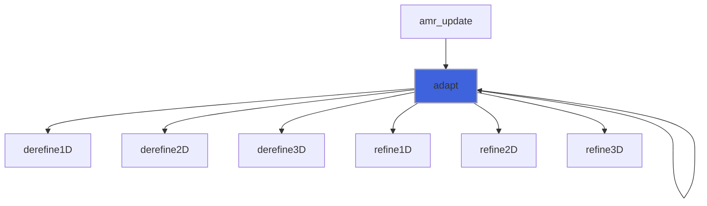

### blocks_reorder

Reorder blocks indexes in field.

```fortran
subroutine blocks_reorder(self, q)
```

**Arguments**

| Name | Type | Intent | Attributes | Description |
|------|------|--------|------------|-------------|
| `self` | class([field_object](/api/src/lib/common/adam_field_object#field-object)) | inout |  | The field. |
| `q` | real(kind=[R8P](/api/src/third_party/PENF/src/lib/penf_global_parameters_variables)) | inout |  | Field cell centered variables. |

**Call graph**

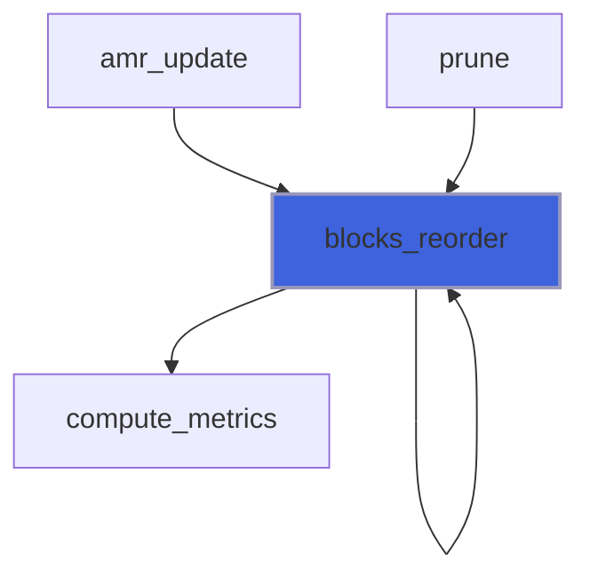

### compute_metrics

Compute metrics of each block.

```fortran
subroutine compute_metrics(self)
```

**Arguments**

| Name | Type | Intent | Attributes | Description |
|------|------|--------|------------|-------------|
| `self` | class([field_object](/api/src/lib/common/adam_field_object#field-object)) | inout |  | The field. |

**Call graph**

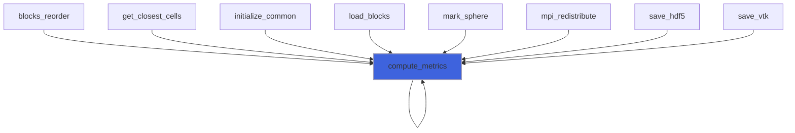

### compute_normL2_residuals

Compute L2 norm of residuals.

```fortran
subroutine compute_normL2_residuals(self, dq, norm)
```

**Arguments**

| Name | Type | Intent | Attributes | Description |
|------|------|--------|------------|-------------|
| `self` | class([field_object](/api/src/lib/common/adam_field_object#field-object)) | in |  | The field. |
| `dq` | real(kind=[R8P](/api/src/third_party/PENF/src/lib/penf_global_parameters_variables)) | in |  | Residuals. |
| `norm` | real(kind=[R8P](/api/src/third_party/PENF/src/lib/penf_global_parameters_variables)) | inout |  | Residuals norm. |

**Call graph**

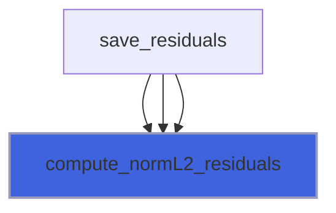

### initialize

Initialize field.

```fortran
subroutine initialize(self, grid, maps, file_parameters, nv, nv_pic, nb, np, q)
```

**Arguments**

| Name | Type | Intent | Attributes | Description |
|------|------|--------|------------|-------------|
| `self` | class([field_object](/api/src/lib/common/adam_field_object#field-object)) | inout |  | The field. |
| `grid` | type([grid_object](/api/src/lib/common/adam_grid_object#grid-object)) | in | target | The grid. |
| `maps` | type([maps_object](/api/src/lib/common/adam_maps_object#maps-object)) | in | target | The maps. |
| `file_parameters` | type([file_ini](/api/src/third_party/FiNeR/src/lib/finer_file_ini_t#file-ini)) | inout | optional | INI file handler. |
| `nv` | integer(kind=[I4P](/api/src/third_party/PENF/src/lib/penf_global_parameters_variables)) | in | optional | Number of field variables. |
| `nv_pic` | integer(kind=[I4P](/api/src/third_party/PENF/src/lib/penf_global_parameters_variables)) | in | optional | Number of PIC variables. |
| `nb` | integer(kind=[I4P](/api/src/third_party/PENF/src/lib/penf_global_parameters_variables)) | in | optional | Number of all blocks that can be stored. |
| `np` | integer(kind=[I4P](/api/src/third_party/PENF/src/lib/penf_global_parameters_variables)) | in | optional | Number of all particles that can be stored in each block. |
| `q` | real(kind=[R8P](/api/src/third_party/PENF/src/lib/penf_global_parameters_variables)) | inout | allocatable, optional | Field cell centered variables. |

**Call graph**

```mermaid
flowchart TD
  add_node["add_node"] --> initialize["initialize"]
  analize["analize"] --> initialize["initialize"]
  build_connectivity["build_connectivity"] --> initialize["initialize"]
  distribute_facets["distribute_facets"] --> initialize["initialize"]
  distribute_facets_tree["distribute_facets_tree"] --> initialize["initialize"]
  export_vtk_file["export_vtk_file"] --> initialize["initialize"]
  initialize["initialize"] --> initialize["initialize"]
  initialize["initialize"] --> initialize["initialize"]
  initialize["initialize"] --> initialize["initialize"]
  initialize["initialize"] --> initialize["initialize"]
  initialize["initialize"] --> initialize["initialize"]
  initialize["initialize"] --> initialize["initialize"]
  initialize["initialize"] --> initialize["initialize"]
  initialize["initialize"] --> initialize["initialize"]
  initialize["initialize"] --> initialize["initialize"]
  initialize["initialize"] --> initialize["initialize"]
  initialize["initialize"] --> initialize["initialize"]
  initialize["initialize"] --> initialize["initialize"]
  initialize["initialize"] --> initialize["initialize"]
  initialize["initialize"] --> initialize["initialize"]
  initialize["initialize"] --> initialize["initialize"]
  initialize["initialize"] --> initialize["initialize"]
  initialize["initialize"] --> initialize["initialize"]
  initialize["initialize"] --> initialize["initialize"]
  initialize["initialize"] --> initialize["initialize"]
  initialize["initialize"] --> initialize["initialize"]
  initialize["initialize"] --> initialize["initialize"]
  initialize["initialize"] --> initialize["initialize"]
  initialize["initialize"] --> initialize["initialize"]
  initialize["initialize"] --> initialize["initialize"]
  initialize["initialize"] --> initialize["initialize"]
  initialize["initialize"] --> initialize["initialize"]
  initialize["initialize"] --> initialize["initialize"]
  initialize["initialize"] --> initialize["initialize"]
  initialize["initialize"] --> initialize["initialize"]
  initialize["initialize"] --> initialize["initialize"]
  initialize["initialize"] --> initialize["initialize"]
  initialize["initialize"] --> initialize["initialize"]
  initialize["initialize"] --> initialize["initialize"]
  initialize["initialize"] --> initialize["initialize"]
  initialize["initialize"] --> initialize["initialize"]
  initialize["initialize"] --> initialize["initialize"]
  initialize["initialize"] --> initialize["initialize"]
  initialize["initialize"] --> initialize["initialize"]
  initialize["initialize"] --> initialize["initialize"]
  initialize["initialize"] --> initialize["initialize"]
  initialize["initialize"] --> initialize["initialize"]
  initialize["initialize"] --> initialize["initialize"]
  initialize["initialize"] --> initialize["initialize"]
  initialize["initialize"] --> initialize["initialize"]
  initialize["initialize"] --> initialize["initialize"]
  initialize["initialize"] --> initialize["initialize"]
  initialize["initialize"] --> initialize["initialize"]
  initialize["initialize"] --> initialize["initialize"]
  initialize["initialize"] --> initialize["initialize"]
  initialize["initialize"] --> initialize["initialize"]
  initialize["initialize"] --> initialize["initialize"]
  initialize["initialize"] --> initialize["initialize"]
  initialize["initialize"] --> initialize["initialize"]
  initialize["initialize"] --> initialize["initialize"]
  initialize["initialize"] --> initialize["initialize"]
  initialize["initialize"] --> initialize["initialize"]
  initialize["initialize"] --> initialize["initialize"]
  initialize["initialize"] --> initialize["initialize"]
  initialize["initialize"] --> initialize["initialize"]
  initialize["initialize"] --> initialize["initialize"]
  initialize["initialize"] --> initialize["initialize"]
  initialize["initialize"] --> initialize["initialize"]
  initialize["initialize"] --> initialize["initialize"]
  initialize["initialize"] --> initialize["initialize"]
  initialize["initialize"] --> initialize["initialize"]
  initialize["initialize"] --> initialize["initialize"]
  initialize["initialize"] --> initialize["initialize"]
  initialize["initialize"] --> initialize["initialize"]
  initialize["initialize"] --> initialize["initialize"]
  initialize["initialize"] --> initialize["initialize"]
  initialize["initialize"] --> initialize["initialize"]
  initialize["initialize"] --> initialize["initialize"]
  initialize_common["initialize_common"] --> initialize["initialize"]
  initialize_common["initialize_common"] --> initialize["initialize"]
  initialize_common["initialize_common"] --> initialize["initialize"]
  initialize_common["initialize_common"] --> initialize["initialize"]
  load_from_file["load_from_file"] --> initialize["initialize"]
  load_from_file["load_from_file"] --> initialize["initialize"]
  open_file["open_file"] --> initialize["initialize"]
  open_file["open_file"] --> initialize["initialize"]
  open_file["open_file"] --> initialize["initialize"]
  resize["resize"] --> initialize["initialize"]
  save_into_file["save_into_file"] --> initialize["initialize"]
  save_vtk["save_vtk"] --> initialize["initialize"]
  simulate["simulate"] --> initialize["initialize"]
  simulate["simulate"] --> initialize["initialize"]
  simulate["simulate"] --> initialize["initialize"]
  simulate["simulate"] --> initialize["initialize"]
  simulate["simulate"] --> initialize["initialize"]
  simulate["simulate"] --> initialize["initialize"]
  simulate["simulate"] --> initialize["initialize"]
  test_stress["test_stress"] --> initialize["initialize"]
  initialize["initialize"] --> allocate_variable["allocate_variable"]
  initialize["initialize"] --> initialize["initialize"]
  initialize["initialize"] --> load_from_ini_file["load_from_ini_file"]
  initialize["initialize"] --> print_message["print_message"]
  style initialize fill:#3e63dd,stroke:#99b,stroke-width:2px
```

### load_blocks

Load blocks data, used for restarting.

 Note: blocks memory must be already initialized with enough memory (proper nv,ni,nj,nk,ngc and nb>=blocks number).

```fortran
subroutine load_blocks(self, basename, q)
```

**Arguments**

| Name | Type | Intent | Attributes | Description |
|------|------|--------|------------|-------------|
| `self` | class([field_object](/api/src/lib/common/adam_field_object#field-object)) | inout |  | The field. |
| `basename` | character(len=*) | in |  | Output base name. |
| `q` | real(kind=[R8P](/api/src/third_party/PENF/src/lib/penf_global_parameters_variables)) | inout |  | Field cell centered variables. |

**Call graph**

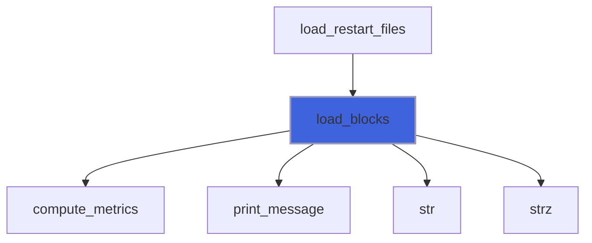

### load_from_ini_file

Load object data from INI file.

```fortran
subroutine load_from_ini_file(self, file_parameters)
```

**Arguments**

| Name | Type | Intent | Attributes | Description |
|------|------|--------|------------|-------------|
| `self` | class([field_object](/api/src/lib/common/adam_field_object#field-object)) | inout |  | The field. |
| `file_parameters` | type([file_ini](/api/src/third_party/FiNeR/src/lib/finer_file_ini_t#file-ini)) | inout |  | INI file handler. |

**Call graph**

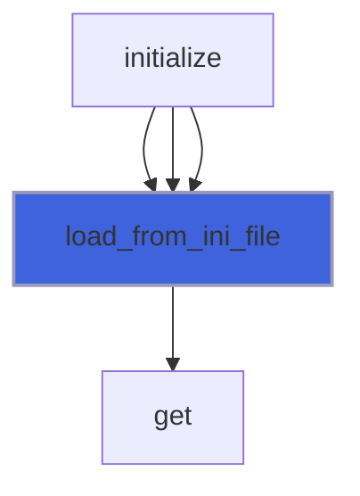

### mark_sphere

Mark blocks to be refined/derefined by sphere distance.

```fortran
subroutine mark_sphere(self, center, radius, threshold)
```

**Arguments**

| Name | Type | Intent | Attributes | Description |
|------|------|--------|------------|-------------|
| `self` | class([field_object](/api/src/lib/common/adam_field_object#field-object)) | inout |  | The field. |
| `center` | real(kind=[R8P](/api/src/third_party/PENF/src/lib/penf_global_parameters_variables)) | in |  | Sphere center coordinates [x,y,z]. |
| `radius` | real(kind=[R8P](/api/src/third_party/PENF/src/lib/penf_global_parameters_variables)) | in |  | Sphere radius. |
| `threshold` | real(kind=[R8P](/api/src/third_party/PENF/src/lib/penf_global_parameters_variables)) | in | optional | Threshold for sphere proximity. |

**Call graph**

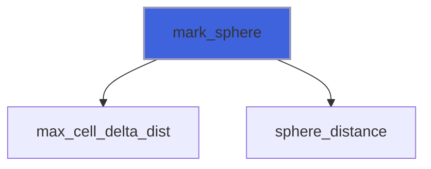

### mark_all_blocks

Mark all blocks to be refined, derefined, ecc.

```fortran
subroutine mark_all_blocks(self, mark)
```

**Arguments**

| Name | Type | Intent | Attributes | Description |
|------|------|--------|------------|-------------|
| `self` | class([field_object](/api/src/lib/common/adam_field_object#field-object)) | inout |  | The tree. |
| `mark` | integer(kind=[I4P](/api/src/third_party/PENF/src/lib/penf_global_parameters_variables)) | in |  | Mark to be imposed [TO_BE_REFINED,...]. |

### mpi_gather_refinements_needed

Gather blocks refinement needed status between MPI processes.

```fortran
subroutine mpi_gather_refinements_needed(self)
```

**Arguments**

| Name | Type | Intent | Attributes | Description |
|------|------|--------|------------|-------------|
| `self` | class([field_object](/api/src/lib/common/adam_field_object#field-object)) | inout |  | The field. |

**Call graph**

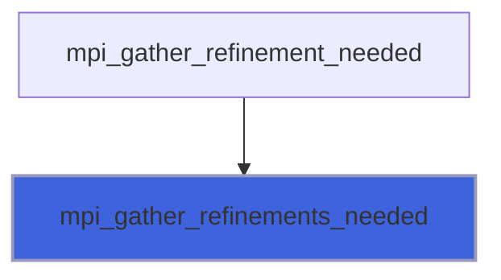

### mpi_redistribute

Redistribute blocks to processes.
 @TODO: Morton codes are not yet redistributed, must be fixed.

```fortran
subroutine mpi_redistribute(self, q)
```

**Arguments**

| Name | Type | Intent | Attributes | Description |
|------|------|--------|------------|-------------|
| `self` | class([field_object](/api/src/lib/common/adam_field_object#field-object)) | inout |  | The field. |
| `q` | real(kind=[R8P](/api/src/third_party/PENF/src/lib/penf_global_parameters_variables)) | inout |  | Field cell centered variables. |

**Call graph**

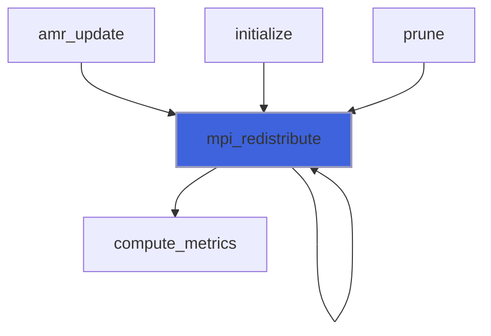

### save_blocks

Save blocks data, used for restarting.

```fortran
subroutine save_blocks(self, basename, q)
```

**Arguments**

| Name | Type | Intent | Attributes | Description |
|------|------|--------|------------|-------------|
| `self` | class([field_object](/api/src/lib/common/adam_field_object#field-object)) | in |  | The field. |
| `basename` | character(len=*) | in |  | Output base name. |
| `q` | real(kind=[R8P](/api/src/third_party/PENF/src/lib/penf_global_parameters_variables)) | in |  | Field cell centered variables. |

**Call graph**

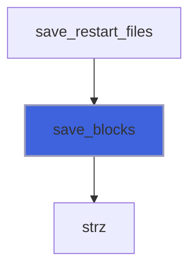

### update_ghost_local

Update (local) ghost cells.

```fortran
subroutine update_ghost_local(self, q)
```

**Arguments**

| Name | Type | Intent | Attributes | Description |
|------|------|--------|------------|-------------|
| `self` | class([field_object](/api/src/lib/common/adam_field_object#field-object)) | in |  | The base backend. |
| `q` | real(kind=[R8P](/api/src/third_party/PENF/src/lib/penf_global_parameters_variables)) | inout |  | Field component to be updated. |

**Call graph**

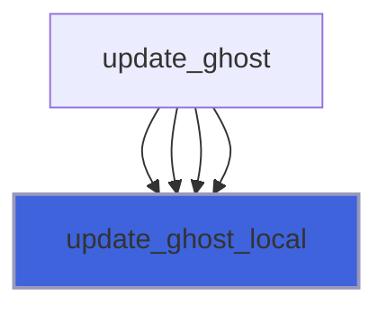

### update_ghost_mpi

Update ghost cells within other processes.

```fortran
subroutine update_ghost_mpi(self, q, step)
```

**Arguments**

| Name | Type | Intent | Attributes | Description |
|------|------|--------|------------|-------------|
| `self` | class([field_object](/api/src/lib/common/adam_field_object#field-object)) | inout |  | The base backend. |
| `q` | real(kind=[R8P](/api/src/third_party/PENF/src/lib/penf_global_parameters_variables)) | inout |  | Field component to be updated. |
| `step` | integer(kind=[I4P](/api/src/third_party/PENF/src/lib/penf_global_parameters_variables)) | in | optional | Step to be perfordmed in asyncronous comp. |

**Call graph**

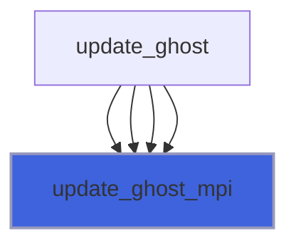

### derefine1D

Derefine blocks.

 Note: blocks number is not updated: mpi redistribute does it. This is dangerous...

```fortran
subroutine derefine1D(self, ratio, block_to_derefine, block_derefined, q)
```

**Arguments**

| Name | Type | Intent | Attributes | Description |
|------|------|--------|------------|-------------|
| `self` | class([field_object](/api/src/lib/common/adam_field_object#field-object)) | inout |  | The field. |
| `ratio` | integer(kind=[I4P](/api/src/third_party/PENF/src/lib/penf_global_parameters_variables)) | in |  | Refinement ratio. |
| `block_to_derefine` | integer(kind=[I8P](/api/src/third_party/PENF/src/lib/penf_global_parameters_variables)) | in | allocatable | List of blocks to be derefined. |
| `block_derefined` | integer(kind=[I8P](/api/src/third_party/PENF/src/lib/penf_global_parameters_variables)) | in | allocatable | List of derefined blocks with Morton code. |
| `q` | real(kind=[R8P](/api/src/third_party/PENF/src/lib/penf_global_parameters_variables)) | inout |  | Field cell centered variables. |

**Call graph**

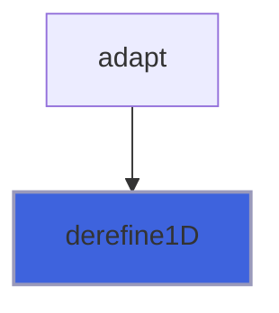

### derefine2D

Derefine blocks.

 Note: blocks number is not updated: mpi redistribute does it. This is dangerous...

```fortran
subroutine derefine2D(self, ratio, block_to_derefine, block_derefined, q)
```

**Arguments**

| Name | Type | Intent | Attributes | Description |
|------|------|--------|------------|-------------|
| `self` | class([field_object](/api/src/lib/common/adam_field_object#field-object)) | inout |  | The field. |
| `ratio` | integer(kind=[I4P](/api/src/third_party/PENF/src/lib/penf_global_parameters_variables)) | in |  | Refinement ratio. |
| `block_to_derefine` | integer(kind=[I8P](/api/src/third_party/PENF/src/lib/penf_global_parameters_variables)) | in | allocatable | List of blocks to be derefined. |
| `block_derefined` | integer(kind=[I8P](/api/src/third_party/PENF/src/lib/penf_global_parameters_variables)) | in | allocatable | List of derefined blocks with Morton code. |
| `q` | real(kind=[R8P](/api/src/third_party/PENF/src/lib/penf_global_parameters_variables)) | inout |  | Field cell centered variables. |

**Call graph**


### derefine3D

Derefine blocks.

 Note: blocks number is not updated: mpi redistribute does it. This is dangerous...

```fortran
subroutine derefine3D(self, ratio, block_to_derefine, block_derefined, q)
```

**Arguments**

| Name | Type | Intent | Attributes | Description |
|------|------|--------|------------|-------------|
| `self` | class([field_object](/api/src/lib/common/adam_field_object#field-object)) | inout |  | The field. |
| `ratio` | integer(kind=[I4P](/api/src/third_party/PENF/src/lib/penf_global_parameters_variables)) | in |  | Refinement ratio. |
| `block_to_derefine` | integer(kind=[I8P](/api/src/third_party/PENF/src/lib/penf_global_parameters_variables)) | in | allocatable | List of blocks to be derefined. |
| `block_derefined` | integer(kind=[I8P](/api/src/third_party/PENF/src/lib/penf_global_parameters_variables)) | in | allocatable | List of derefined blocks with Morton code. |
| `q` | real(kind=[R8P](/api/src/third_party/PENF/src/lib/penf_global_parameters_variables)) | inout |  | Field cell centered variables. |

**Call graph**


### refine1D

Refine blocks.

 Note: blocks number is not updated: mpi redistribute does it. This is dangerous...

```fortran
subroutine refine1D(self, ratio, block_to_refine, block_refined, q)
```

**Arguments**

| Name | Type | Intent | Attributes | Description |
|------|------|--------|------------|-------------|
| `self` | class([field_object](/api/src/lib/common/adam_field_object#field-object)) | inout |  | The field. |
| `ratio` | integer(kind=[I4P](/api/src/third_party/PENF/src/lib/penf_global_parameters_variables)) | in |  | Refinement ratio. |
| `block_to_refine` | integer(kind=[I8P](/api/src/third_party/PENF/src/lib/penf_global_parameters_variables)) | in | allocatable | List of blocks to be refined. |
| `block_refined` | integer(kind=[I8P](/api/src/third_party/PENF/src/lib/penf_global_parameters_variables)) | in | allocatable | List of refined blocks with Morton code. |
| `q` | real(kind=[R8P](/api/src/third_party/PENF/src/lib/penf_global_parameters_variables)) | inout |  | Field cell centered variables. |

**Call graph**


### refine2D

Refine blocks.

 Note: blocks number is not updated: mpi redistribute does it. This is dangerous...

```fortran
subroutine refine2D(self, ratio, block_to_refine, block_refined, q)
```

**Arguments**

| Name | Type | Intent | Attributes | Description |
|------|------|--------|------------|-------------|
| `self` | class([field_object](/api/src/lib/common/adam_field_object#field-object)) | inout |  | The field. |
| `ratio` | integer(kind=[I4P](/api/src/third_party/PENF/src/lib/penf_global_parameters_variables)) | in |  | Refinement ratio. |
| `block_to_refine` | integer(kind=[I8P](/api/src/third_party/PENF/src/lib/penf_global_parameters_variables)) | in | allocatable | List of blocks to be refined. |
| `block_refined` | integer(kind=[I8P](/api/src/third_party/PENF/src/lib/penf_global_parameters_variables)) | in | allocatable | List of refined blocks with Morton code. |
| `q` | real(kind=[R8P](/api/src/third_party/PENF/src/lib/penf_global_parameters_variables)) | inout |  | Field cell centered variables. |

**Call graph**

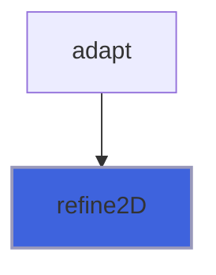

### refine3D

Refine blocks.

 Note: blocks number is not updated: mpi redistribute does it. This is dangerous...

```fortran
subroutine refine3D(self, ratio, block_to_refine, block_refined, q)
```

**Arguments**

| Name | Type | Intent | Attributes | Description |
|------|------|--------|------------|-------------|
| `self` | class([field_object](/api/src/lib/common/adam_field_object#field-object)) | inout |  | The field. |
| `ratio` | integer(kind=[I4P](/api/src/third_party/PENF/src/lib/penf_global_parameters_variables)) | in |  | Refinement ratio. |
| `block_to_refine` | integer(kind=[I8P](/api/src/third_party/PENF/src/lib/penf_global_parameters_variables)) | in | allocatable | List of blocks to be refined. |
| `block_refined` | integer(kind=[I8P](/api/src/third_party/PENF/src/lib/penf_global_parameters_variables)) | in | allocatable | List of refined blocks with Morton code. |
| `q` | real(kind=[R8P](/api/src/third_party/PENF/src/lib/penf_global_parameters_variables)) | inout |  | Field cell centered variables. |

**Call graph**


## Functions

### description

Return a pretty-formatted object description.

**Attributes**: pure

**Returns**: `character(len=:)`

```fortran
function description(self) result(desc)
```

**Arguments**

| Name | Type | Intent | Attributes | Description |
|------|------|--------|------------|-------------|
| `self` | class([field_object](/api/src/lib/common/adam_field_object#field-object)) | in |  | The field. |

**Call graph**

```mermaid
flowchart TD
  description["description"] --> description["description"]
  description["description"] --> description["description"]
  description["description"] --> description["description"]
  initialize["initialize"] --> description["description"]
  initialize["initialize"] --> description["description"]
  initialize["initialize"] --> description["description"]
  initialize["initialize"] --> description["description"]
  initialize["initialize"] --> description["description"]
  initialize["initialize"] --> description["description"]
  initialize["initialize"] --> description["description"]
  initialize["initialize"] --> description["description"]
  initialize["initialize"] --> description["description"]
  initialize["initialize"] --> description["description"]
  initialize["initialize"] --> description["description"]
  initialize["initialize"] --> description["description"]
  initialize["initialize"] --> description["description"]
  initialize["initialize"] --> description["description"]
  initialize["initialize"] --> description["description"]
  initialize["initialize"] --> description["description"]
  initialize["initialize"] --> description["description"]
  initialize["initialize"] --> description["description"]
  initialize["initialize"] --> description["description"]
  initialize["initialize"] --> description["description"]
  initialize["initialize"] --> description["description"]
  initialize["initialize"] --> description["description"]
  initialize["initialize"] --> description["description"]
  initialize["initialize"] --> description["description"]
  initialize["initialize"] --> description["description"]
  initialize["initialize"] --> description["description"]
  initialize["initialize"] --> description["description"]
  initialize["initialize"] --> description["description"]
  initialize["initialize"] --> description["description"]
  initialize["initialize"] --> description["description"]
  initialize["initialize"] --> description["description"]
  initialize["initialize"] --> description["description"]
  initialize["initialize"] --> description["description"]
  initialize["initialize"] --> description["description"]
  initialize["initialize"] --> description["description"]
  initialize["initialize"] --> description["description"]
  initialize["initialize"] --> description["description"]
  initialize["initialize"] --> description["description"]
  initialize["initialize"] --> description["description"]
  initialize["initialize"] --> description["description"]
  initialize["initialize"] --> description["description"]
  initialize["initialize"] --> description["description"]
  initialize["initialize"] --> description["description"]
  initialize["initialize"] --> description["description"]
  description["description"] --> str["str"]
  style description fill:#3e63dd,stroke:#99b,stroke-width:2px
```

### do_caxis_intersect

Return true if a block is intersected by coordinate-axis.

**Returns**: `logical`

```fortran
function do_caxis_intersect(self, b, caxis_origin, caxis_direction, caxis_block_indexes) result(do_intersect)
```

**Arguments**

| Name | Type | Intent | Attributes | Description |
|------|------|--------|------------|-------------|
| `self` | class([field_object](/api/src/lib/common/adam_field_object#field-object)) | inout |  | The field. |
| `b` | integer(kind=[I4P](/api/src/third_party/PENF/src/lib/penf_global_parameters_variables)) | in |  | Block index. |
| `caxis_origin` | real(kind=[R8P](/api/src/third_party/PENF/src/lib/penf_global_parameters_variables)) | in |  | Coordinate-axis origin. |
| `caxis_direction` | real(kind=[R8P](/api/src/third_party/PENF/src/lib/penf_global_parameters_variables)) | in |  | Coordinate-axis direction. |
| `caxis_block_indexes` | integer(kind=[I4P](/api/src/third_party/PENF/src/lib/penf_global_parameters_variables)) | out | optional | Block-local indexes of caxis intersection. |

### do_cplane_intersect

Return true if a block is intersected by coordinate-plane.

**Returns**: `logical`

```fortran
function do_cplane_intersect(self, b, cplane_origin, cplane_normal, cplane_block_indexes) result(do_intersect)
```

**Arguments**

| Name | Type | Intent | Attributes | Description |
|------|------|--------|------------|-------------|
| `self` | class([field_object](/api/src/lib/common/adam_field_object#field-object)) | inout |  | The field. |
| `b` | integer(kind=[I4P](/api/src/third_party/PENF/src/lib/penf_global_parameters_variables)) | in |  | Block index. |
| `cplane_origin` | real(kind=[R8P](/api/src/third_party/PENF/src/lib/penf_global_parameters_variables)) | in |  | Coordinate-plane origin. |
| `cplane_normal` | real(kind=[R8P](/api/src/third_party/PENF/src/lib/penf_global_parameters_variables)) | in |  | Coordinate-plane normal. |
| `cplane_block_indexes` | integer(kind=[I4P](/api/src/third_party/PENF/src/lib/penf_global_parameters_variables)) | out | optional | Block-local indexes of cplane intersection. |

**Call graph**

```mermaid
flowchart TD
  do_cplane_intersect["do_cplane_intersect"] --> do_cplane_intersect["do_cplane_intersect"]
  do_cplane_intersect["do_cplane_intersect"] --> do_cplane_intersect["do_cplane_intersect"]
  style do_cplane_intersect fill:#3e63dd,stroke:#99b,stroke-width:2px
```

### do_ray_intersect

Return true if a block is intersected by ray from ray_origin and oriented as ray_direction vector.

**Returns**: `logical`

```fortran
function do_ray_intersect(self, b, ray_origin, ray_direction) result(do_intersect)
```

**Arguments**

| Name | Type | Intent | Attributes | Description |
|------|------|--------|------------|-------------|
| `self` | class([field_object](/api/src/lib/common/adam_field_object#field-object)) | inout |  | The field. |
| `b` | integer(kind=[I4P](/api/src/third_party/PENF/src/lib/penf_global_parameters_variables)) | in |  | Block index. |
| `ray_origin` | real(kind=[R8P](/api/src/third_party/PENF/src/lib/penf_global_parameters_variables)) | in |  | Ray origin. |
| `ray_direction` | real(kind=[R8P](/api/src/third_party/PENF/src/lib/penf_global_parameters_variables)) | in |  | Ray direction. |

**Call graph**

```mermaid
flowchart TD
  do_ray_intersect["do_ray_intersect"] --> do_ray_intersect["do_ray_intersect"]
  ray_intersections_number["ray_intersections_number"] --> do_ray_intersect["do_ray_intersect"]
  ray_intersections_number_node["ray_intersections_number_node"] --> do_ray_intersect["do_ray_intersect"]
  do_ray_intersect["do_ray_intersect"] --> check_slab["check_slab"]
  style do_ray_intersect fill:#3e63dd,stroke:#99b,stroke-width:2px
```
