# adam_grid_object

> ADAM, grid class definition.

**Source**: `src/lib/common/adam_grid_object.F90`

**Dependencies**

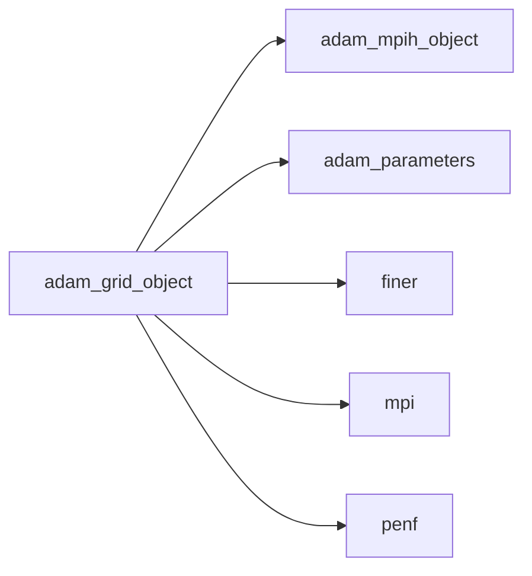

## Contents

- [grid_object](#grid-object)
- [cell_xyz](#cell-xyz)
- [compute_metrics](#compute-metrics)
- [compute_weight_neighbor](#compute-weight-neighbor)
- [initialize](#initialize)
- [load_from_ini_file](#load-from-ini-file)
- [node_xyz](#node-xyz)
- [set_bc_type](#set-bc-type)
- [block_emin](#block-emin)
- [block_emax](#block-emax)
- [description](#description)
- [do_cplane_intersect](#do-cplane-intersect)
- [fec_bc_type](#fec-bc-type)
- [get_closest_block](#get-closest-block)

## Variables

| Name | Type | Attributes | Description |
|------|------|------------|-------------|
| `MAX_REF_LEVELS` | integer(kind=[I4P](/api/src/third_party/PENF/src/lib/penf_global_parameters_variables)) | parameter | Maximum refinement levels. |
| `INI_SECTION_NAME` | character(len=4) | parameter | INI (config) file section name containing configs. |

## Derived Types

### grid_object

Grid class definition.

#### Components

| Name | Type | Attributes | Description |
|------|------|------------|-------------|
| `mpih` | type([mpih_object](/api/src/lib/common/adam_mpih_object#mpih-object)) |  | MPI handler. |
| `domain_emin` | real(kind=[R8P](/api/src/third_party/PENF/src/lib/penf_global_parameters_variables)) |  | Coordinates of minimum abscissa of whole domain. |
| `domain_emax` | real(kind=[R8P](/api/src/third_party/PENF/src/lib/penf_global_parameters_variables)) |  | Coordinates of maximum abscissa of whole domain. |
| `ni` | integer(kind=[I4P](/api/src/third_party/PENF/src/lib/penf_global_parameters_variables)) |  | Number of cells in i direction. |
| `nj` | integer(kind=[I4P](/api/src/third_party/PENF/src/lib/penf_global_parameters_variables)) |  | Number of cells in j direction. |
| `nk` | integer(kind=[I4P](/api/src/third_party/PENF/src/lib/penf_global_parameters_variables)) |  | Number of cells in k direction. |
| `ngc` | integer(kind=[I4P](/api/src/third_party/PENF/src/lib/penf_global_parameters_variables)) |  | Number of ghost cells. |
| `block_weight` | integer(kind=[I4P](/api/src/third_party/PENF/src/lib/penf_global_parameters_variables)) |  | Weight of single block. |
| `weight_neighbor` | integer(kind=[I4P](/api/src/third_party/PENF/src/lib/penf_global_parameters_variables)) |  | Weight of neighbors (cells number). |
| `bc_type` | integer(kind=[I4P](/api/src/third_party/PENF/src/lib/penf_global_parameters_variables)) |  | Type of boundary conditions in the 6 faces of grid. |
| `is_ijk_periodic` | logical |  | Flag to indicate if the direction i, j or k is periodic. |
| `block_dxyz` | real(kind=[R8P](/api/src/third_party/PENF/src/lib/penf_global_parameters_variables)) | allocatable | Blocks space steps for each level [3,0:MAX_REF_LEVELS]. |
| `cell_dxyz` | real(kind=[R8P](/api/src/third_party/PENF/src/lib/penf_global_parameters_variables)) | allocatable | Cells  space steps for each level [3,0:MAX_REF_LEVELS]. |
| `nb_max` | integer(kind=[I4P](/api/src/third_party/PENF/src/lib/penf_global_parameters_variables)) | allocatable | Number of maximum blocks in each direction for each level. |
| `lin_space_x` | real(kind=[R8P](/api/src/third_party/PENF/src/lib/penf_global_parameters_variables)) | allocatable | Lin. space x for each level [0-ngc:ni+ngc,MAX_REF_LEVELS]. |
| `lin_space_y` | real(kind=[R8P](/api/src/third_party/PENF/src/lib/penf_global_parameters_variables)) | allocatable | Lin. space y for each level [0-ngc:nj+ngc,MAX_REF_LEVELS]. |
| `lin_space_z` | real(kind=[R8P](/api/src/third_party/PENF/src/lib/penf_global_parameters_variables)) | allocatable | Lin. space z for each level [0-ngc:nk+ngc,MAX_REF_LEVELS]. |
| `null_xyz` | logical |  | Handy tags for nullify equations in some direction. |

#### Type-Bound Procedures

| Name | Attributes | Description |
|------|------------|-------------|
| `block_emin` | pass(self) | Return block emin given its coordinates. |
| `block_emax` | pass(self) | Return block emax given its coordinates. |
| `cell_xyz` | pass(self) | Return cells xyz abscissa given block coordinates. |
| `compute_metrics` | pass(self) | Compute metrics of a block. |
| `compute_weight_neighbor` | pass(self) | Compute weight of neighbors. |
| `description` | pass(self) | Return pretty-printed object description. |
| `do_cplane_intersect` | nopass | Return true if a block is intersected by coordinate-plane. |
| `fec_bc_type` | pass(self) | Return BC type of given fec. |
| `get_closest_block` | pass(self) | Get the closest block to a given point at a given level. |
| `initialize` | pass(self) | Initialize the field. |
| `load_from_ini_file` | pass(self) | Load object data from INI file. |
| `node_xyz` | pass(self) | Return nodes xyz abscissa given block coordinates. |
| `set_bc_type` | pass(self) | Set grid boundary conditions accordingly with app'equation object. |

## Subroutines

### cell_xyz

Return cells xyz abscissa given block coordinates.

```fortran
subroutine cell_xyz(self, coordinates, x_cell, y_cell, z_cell)
```

**Arguments**

| Name | Type | Intent | Attributes | Description |
|------|------|--------|------------|-------------|
| `self` | class([grid_object](/api/src/lib/common/adam_grid_object#grid-object)) | in |  | The grid. |
| `coordinates` | integer(kind=[I4P](/api/src/third_party/PENF/src/lib/penf_global_parameters_variables)) | in |  | Block coordinates. |
| `x_cell` | real(kind=[R8P](/api/src/third_party/PENF/src/lib/penf_global_parameters_variables)) | out | optional | X coordinates. |
| `y_cell` | real(kind=[R8P](/api/src/third_party/PENF/src/lib/penf_global_parameters_variables)) | out | optional | Y coordinates. |
| `z_cell` | real(kind=[R8P](/api/src/third_party/PENF/src/lib/penf_global_parameters_variables)) | out | optional | Z coordinates. |

**Call graph**

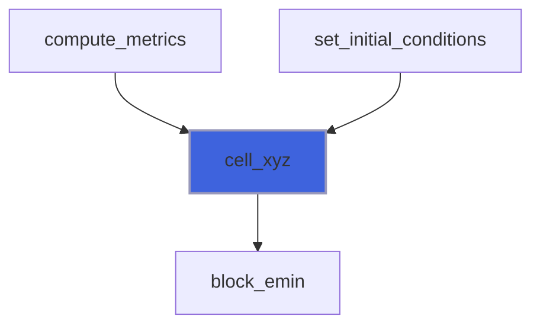

### compute_metrics

Compute metrics of a block.

```fortran
subroutine compute_metrics(self, coordinates, dx, dy, dz, emin, emax, x_node, y_node, z_node, x_cell, y_cell, z_cell)
```

**Arguments**

| Name | Type | Intent | Attributes | Description |
|------|------|--------|------------|-------------|
| `self` | class([grid_object](/api/src/lib/common/adam_grid_object#grid-object)) | in |  | The grid. |
| `coordinates` | integer(kind=[I4P](/api/src/third_party/PENF/src/lib/penf_global_parameters_variables)) | in |  | Block coordinates. |
| `dx` | real(kind=[R8P](/api/src/third_party/PENF/src/lib/penf_global_parameters_variables)) | out | optional | Space steps. |
| `dy` | real(kind=[R8P](/api/src/third_party/PENF/src/lib/penf_global_parameters_variables)) | out | optional | Space steps. |
| `dz` | real(kind=[R8P](/api/src/third_party/PENF/src/lib/penf_global_parameters_variables)) | out | optional | Space steps. |
| `emin` | real(kind=[R8P](/api/src/third_party/PENF/src/lib/penf_global_parameters_variables)) | out | optional | Min/max abscissa of block. |
| `emax` | real(kind=[R8P](/api/src/third_party/PENF/src/lib/penf_global_parameters_variables)) | out | optional | Min/max abscissa of block. |
| `x_node` | real(kind=[R8P](/api/src/third_party/PENF/src/lib/penf_global_parameters_variables)) | out | optional | X coordinates. |
| `y_node` | real(kind=[R8P](/api/src/third_party/PENF/src/lib/penf_global_parameters_variables)) | out | optional | Y coordinates. |
| `z_node` | real(kind=[R8P](/api/src/third_party/PENF/src/lib/penf_global_parameters_variables)) | out | optional | Z coordinates. |
| `x_cell` | real(kind=[R8P](/api/src/third_party/PENF/src/lib/penf_global_parameters_variables)) | out | optional | X coordinates. |
| `y_cell` | real(kind=[R8P](/api/src/third_party/PENF/src/lib/penf_global_parameters_variables)) | out | optional | Y coordinates. |
| `z_cell` | real(kind=[R8P](/api/src/third_party/PENF/src/lib/penf_global_parameters_variables)) | out | optional | Z coordinates. |

**Call graph**

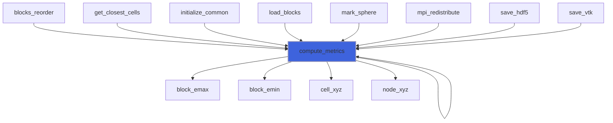

### compute_weight_neighbor

Compute weight of neighbors.

```fortran
subroutine compute_weight_neighbor(self)
```

**Arguments**

| Name | Type | Intent | Attributes | Description |
|------|------|--------|------------|-------------|
| `self` | class([grid_object](/api/src/lib/common/adam_grid_object#grid-object)) | inout |  | The grid. |

**Call graph**

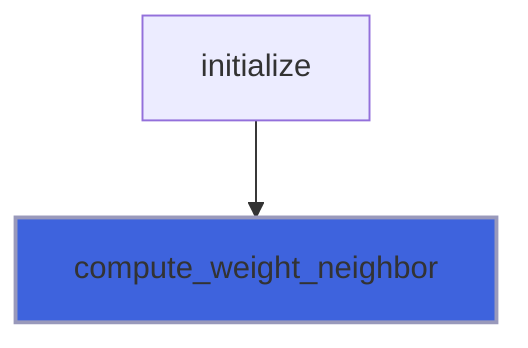

### initialize

Initialize field.

```fortran
subroutine initialize(self, file_parameters, ni, nj, nk, ngc, emin, emax, bc_type, verbose)
```

**Arguments**

| Name | Type | Intent | Attributes | Description |
|------|------|--------|------------|-------------|
| `self` | class([grid_object](/api/src/lib/common/adam_grid_object#grid-object)) | inout |  | The grid. |
| `file_parameters` | type([file_ini](/api/src/third_party/FiNeR/src/lib/finer_file_ini_t#file-ini)) | inout |  | INI file handler. |
| `ni` | integer(kind=[I4P](/api/src/third_party/PENF/src/lib/penf_global_parameters_variables)) | in | optional | Number of cells in X direction. |
| `nj` | integer(kind=[I4P](/api/src/third_party/PENF/src/lib/penf_global_parameters_variables)) | in | optional | Number of cells in Y direction. |
| `nk` | integer(kind=[I4P](/api/src/third_party/PENF/src/lib/penf_global_parameters_variables)) | in | optional | Number of cells in Z direction. |
| `ngc` | integer(kind=[I4P](/api/src/third_party/PENF/src/lib/penf_global_parameters_variables)) | in | optional | Number of ghost cells. |
| `emin` | real(kind=[R8P](/api/src/third_party/PENF/src/lib/penf_global_parameters_variables)) | in | optional | Coordinates of minium abscissa. |
| `emax` | real(kind=[R8P](/api/src/third_party/PENF/src/lib/penf_global_parameters_variables)) | in | optional | Coordinates of maxium abscissa. |
| `bc_type` | integer(kind=[I4P](/api/src/third_party/PENF/src/lib/penf_global_parameters_variables)) | in | optional | Type of boundary conditions in the 6 faces of grid. |
| `verbose` | logical | in | optional | Flag to activate verbose output. |

**Call graph**

```mermaid
flowchart TD
  add_node["add_node"] --> initialize["initialize"]
  analize["analize"] --> initialize["initialize"]
  build_connectivity["build_connectivity"] --> initialize["initialize"]
  distribute_facets["distribute_facets"] --> initialize["initialize"]
  distribute_facets_tree["distribute_facets_tree"] --> initialize["initialize"]
  export_vtk_file["export_vtk_file"] --> initialize["initialize"]
  initialize["initialize"] --> initialize["initialize"]
  initialize["initialize"] --> initialize["initialize"]
  initialize["initialize"] --> initialize["initialize"]
  initialize["initialize"] --> initialize["initialize"]
  initialize["initialize"] --> initialize["initialize"]
  initialize["initialize"] --> initialize["initialize"]
  initialize["initialize"] --> initialize["initialize"]
  initialize["initialize"] --> initialize["initialize"]
  initialize["initialize"] --> initialize["initialize"]
  initialize["initialize"] --> initialize["initialize"]
  initialize["initialize"] --> initialize["initialize"]
  initialize["initialize"] --> initialize["initialize"]
  initialize["initialize"] --> initialize["initialize"]
  initialize["initialize"] --> initialize["initialize"]
  initialize["initialize"] --> initialize["initialize"]
  initialize["initialize"] --> initialize["initialize"]
  initialize["initialize"] --> initialize["initialize"]
  initialize["initialize"] --> initialize["initialize"]
  initialize["initialize"] --> initialize["initialize"]
  initialize["initialize"] --> initialize["initialize"]
  initialize["initialize"] --> initialize["initialize"]
  initialize["initialize"] --> initialize["initialize"]
  initialize["initialize"] --> initialize["initialize"]
  initialize["initialize"] --> initialize["initialize"]
  initialize["initialize"] --> initialize["initialize"]
  initialize["initialize"] --> initialize["initialize"]
  initialize["initialize"] --> initialize["initialize"]
  initialize["initialize"] --> initialize["initialize"]
  initialize["initialize"] --> initialize["initialize"]
  initialize["initialize"] --> initialize["initialize"]
  initialize["initialize"] --> initialize["initialize"]
  initialize["initialize"] --> initialize["initialize"]
  initialize["initialize"] --> initialize["initialize"]
  initialize["initialize"] --> initialize["initialize"]
  initialize["initialize"] --> initialize["initialize"]
  initialize["initialize"] --> initialize["initialize"]
  initialize["initialize"] --> initialize["initialize"]
  initialize["initialize"] --> initialize["initialize"]
  initialize["initialize"] --> initialize["initialize"]
  initialize["initialize"] --> initialize["initialize"]
  initialize["initialize"] --> initialize["initialize"]
  initialize["initialize"] --> initialize["initialize"]
  initialize["initialize"] --> initialize["initialize"]
  initialize["initialize"] --> initialize["initialize"]
  initialize["initialize"] --> initialize["initialize"]
  initialize["initialize"] --> initialize["initialize"]
  initialize["initialize"] --> initialize["initialize"]
  initialize["initialize"] --> initialize["initialize"]
  initialize["initialize"] --> initialize["initialize"]
  initialize["initialize"] --> initialize["initialize"]
  initialize["initialize"] --> initialize["initialize"]
  initialize["initialize"] --> initialize["initialize"]
  initialize["initialize"] --> initialize["initialize"]
  initialize["initialize"] --> initialize["initialize"]
  initialize["initialize"] --> initialize["initialize"]
  initialize["initialize"] --> initialize["initialize"]
  initialize["initialize"] --> initialize["initialize"]
  initialize["initialize"] --> initialize["initialize"]
  initialize["initialize"] --> initialize["initialize"]
  initialize["initialize"] --> initialize["initialize"]
  initialize["initialize"] --> initialize["initialize"]
  initialize["initialize"] --> initialize["initialize"]
  initialize["initialize"] --> initialize["initialize"]
  initialize["initialize"] --> initialize["initialize"]
  initialize["initialize"] --> initialize["initialize"]
  initialize["initialize"] --> initialize["initialize"]
  initialize["initialize"] --> initialize["initialize"]
  initialize["initialize"] --> initialize["initialize"]
  initialize["initialize"] --> initialize["initialize"]
  initialize["initialize"] --> initialize["initialize"]
  initialize["initialize"] --> initialize["initialize"]
  initialize["initialize"] --> initialize["initialize"]
  initialize_common["initialize_common"] --> initialize["initialize"]
  initialize_common["initialize_common"] --> initialize["initialize"]
  initialize_common["initialize_common"] --> initialize["initialize"]
  initialize_common["initialize_common"] --> initialize["initialize"]
  load_from_file["load_from_file"] --> initialize["initialize"]
  load_from_file["load_from_file"] --> initialize["initialize"]
  open_file["open_file"] --> initialize["initialize"]
  open_file["open_file"] --> initialize["initialize"]
  open_file["open_file"] --> initialize["initialize"]
  resize["resize"] --> initialize["initialize"]
  save_into_file["save_into_file"] --> initialize["initialize"]
  save_vtk["save_vtk"] --> initialize["initialize"]
  simulate["simulate"] --> initialize["initialize"]
  simulate["simulate"] --> initialize["initialize"]
  simulate["simulate"] --> initialize["initialize"]
  simulate["simulate"] --> initialize["initialize"]
  simulate["simulate"] --> initialize["initialize"]
  simulate["simulate"] --> initialize["initialize"]
  simulate["simulate"] --> initialize["initialize"]
  test_stress["test_stress"] --> initialize["initialize"]
  initialize["initialize"] --> compute_weight_neighbor["compute_weight_neighbor"]
  initialize["initialize"] --> description["description"]
  initialize["initialize"] --> get["get"]
  initialize["initialize"] --> initialize["initialize"]
  initialize["initialize"] --> load_from_ini_file["load_from_ini_file"]
  initialize["initialize"] --> print_message["print_message"]
  style initialize fill:#3e63dd,stroke:#99b,stroke-width:2px
```

### load_from_ini_file

Load object data from INI file.

```fortran
subroutine load_from_ini_file(self, file_parameters, go_on_fail)
```

**Arguments**

| Name | Type | Intent | Attributes | Description |
|------|------|--------|------------|-------------|
| `self` | class([grid_object](/api/src/lib/common/adam_grid_object#grid-object)) | inout |  | The grid. |
| `file_parameters` | type([file_ini](/api/src/third_party/FiNeR/src/lib/finer_file_ini_t#file-ini)) | inout |  | INI file handler. |
| `go_on_fail` | logical | in | optional | Go on if load fails. |

**Call graph**

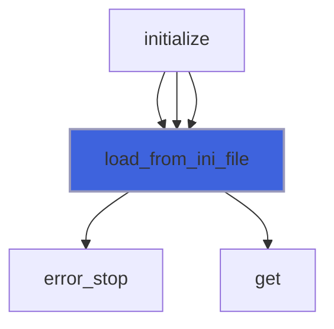

### node_xyz

Return nodes xyz abscissa given block coordinates.

```fortran
subroutine node_xyz(self, coordinates, x_node, y_node, z_node)
```

**Arguments**

| Name | Type | Intent | Attributes | Description |
|------|------|--------|------------|-------------|
| `self` | class([grid_object](/api/src/lib/common/adam_grid_object#grid-object)) | in |  | The grid. |
| `coordinates` | integer(kind=[I4P](/api/src/third_party/PENF/src/lib/penf_global_parameters_variables)) | in |  | Block coordinates. |
| `x_node` | real(kind=[R8P](/api/src/third_party/PENF/src/lib/penf_global_parameters_variables)) | out | optional | X coordinates. |
| `y_node` | real(kind=[R8P](/api/src/third_party/PENF/src/lib/penf_global_parameters_variables)) | out | optional | Y coordinates. |
| `z_node` | real(kind=[R8P](/api/src/third_party/PENF/src/lib/penf_global_parameters_variables)) | out | optional | Z coordinates. |

**Call graph**

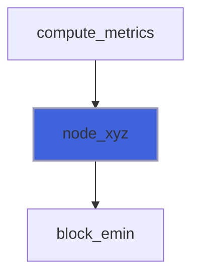

### set_bc_type

Set grid boundary conditions accordingly with app'equation object.

```fortran
subroutine set_bc_type(self, bc_type)
```

**Arguments**

| Name | Type | Intent | Attributes | Description |
|------|------|--------|------------|-------------|
| `self` | class([grid_object](/api/src/lib/common/adam_grid_object#grid-object)) | inout |  | The grid. |
| `bc_type` | integer(kind=[I4P](/api/src/third_party/PENF/src/lib/penf_global_parameters_variables)) | in |  | Type of boundary conditions in the 6 faces of grid. |

## Functions

### block_emin

Return block emin given its coordinates.

**Returns**: real(kind=[R8P](/api/src/third_party/PENF/src/lib/penf_global_parameters_variables))

```fortran
function block_emin(self, coordinates) result(emin)
```

**Arguments**

| Name | Type | Intent | Attributes | Description |
|------|------|--------|------------|-------------|
| `self` | class([grid_object](/api/src/lib/common/adam_grid_object#grid-object)) | in |  | The grid. |
| `coordinates` | integer(kind=[I4P](/api/src/third_party/PENF/src/lib/penf_global_parameters_variables)) | in |  | Block coordinates. |

**Call graph**

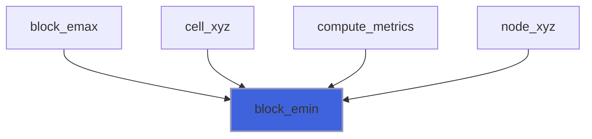

### block_emax

Return block emax given its coordinates.

**Returns**: real(kind=[R8P](/api/src/third_party/PENF/src/lib/penf_global_parameters_variables))

```fortran
function block_emax(self, coordinates) result(emax)
```

**Arguments**

| Name | Type | Intent | Attributes | Description |
|------|------|--------|------------|-------------|
| `self` | class([grid_object](/api/src/lib/common/adam_grid_object#grid-object)) | in |  | The grid. |
| `coordinates` | integer(kind=[I4P](/api/src/third_party/PENF/src/lib/penf_global_parameters_variables)) | in |  | Block coordinates. |

**Call graph**

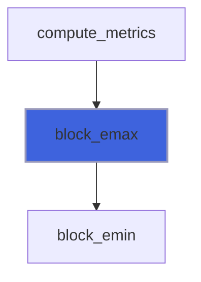

### description

Return a pretty-formatted object description.

**Attributes**: pure

**Returns**: `character(len=:)`

```fortran
function description(self) result(desc)
```

**Arguments**

| Name | Type | Intent | Attributes | Description |
|------|------|--------|------------|-------------|
| `self` | class([grid_object](/api/src/lib/common/adam_grid_object#grid-object)) | in |  | The grid. |

**Call graph**

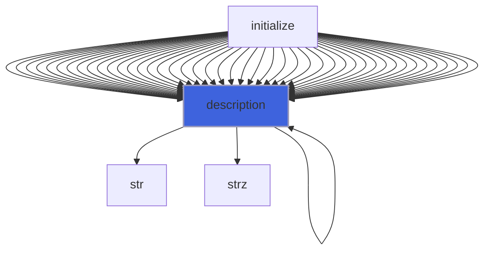

### do_cplane_intersect

Return true if a block is intersected by coordinate-plane.

**Returns**: `logical`

```fortran
function do_cplane_intersect(emin, emax, dxyz, cplane_origin, cplane_normal, cplane_block_indexes) result(do_intersect)
```

**Arguments**

| Name | Type | Intent | Attributes | Description |
|------|------|--------|------------|-------------|
| `emin` | real(kind=[R8P](/api/src/third_party/PENF/src/lib/penf_global_parameters_variables)) | in |  | Block extents. |
| `emax` | real(kind=[R8P](/api/src/third_party/PENF/src/lib/penf_global_parameters_variables)) | in |  | Block extents. |
| `dxyz` | real(kind=[R8P](/api/src/third_party/PENF/src/lib/penf_global_parameters_variables)) | in |  | Block space steps. |
| `cplane_origin` | real(kind=[R8P](/api/src/third_party/PENF/src/lib/penf_global_parameters_variables)) | in |  | Coordinate-plane origin. |
| `cplane_normal` | real(kind=[R8P](/api/src/third_party/PENF/src/lib/penf_global_parameters_variables)) | in |  | Coordinate-plane normal. |
| `cplane_block_indexes` | integer(kind=[I4P](/api/src/third_party/PENF/src/lib/penf_global_parameters_variables)) | out | optional | Block-local indexes of cplane intersection. |

**Call graph**

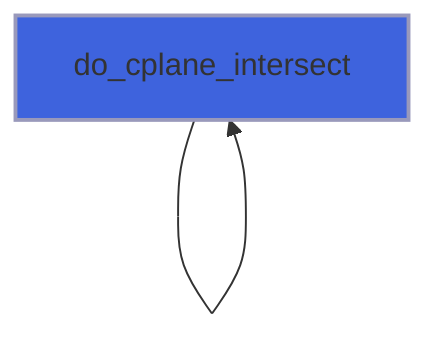

### fec_bc_type

Return BC type of given fec.

**Returns**: integer(kind=[I4P](/api/src/third_party/PENF/src/lib/penf_global_parameters_variables))

```fortran
function fec_bc_type(self, fec) result(bc_type)
```

**Arguments**

| Name | Type | Intent | Attributes | Description |
|------|------|--------|------------|-------------|
| `self` | class([grid_object](/api/src/lib/common/adam_grid_object#grid-object)) | in |  | The grid. |
| `fec` | integer(kind=[I4P](/api/src/third_party/PENF/src/lib/penf_global_parameters_variables)) | in |  | Current fec. |

**Call graph**

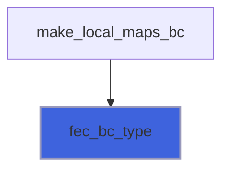

### get_closest_block

Get the closest block to a given point at a given level.

**Returns**: integer(kind=[I4P](/api/src/third_party/PENF/src/lib/penf_global_parameters_variables))

```fortran
function get_closest_block(self, point, level) result(ijk)
```

**Arguments**

| Name | Type | Intent | Attributes | Description |
|------|------|--------|------------|-------------|
| `self` | class([grid_object](/api/src/lib/common/adam_grid_object#grid-object)) | inout |  | The grid. |
| `point` | real(kind=[R8P](/api/src/third_party/PENF/src/lib/penf_global_parameters_variables)) | in |  | Point xyz coordinates. |
| `level` | integer(kind=[I4P](/api/src/third_party/PENF/src/lib/penf_global_parameters_variables)) | in |  | Refinement level. |

**Call graph**

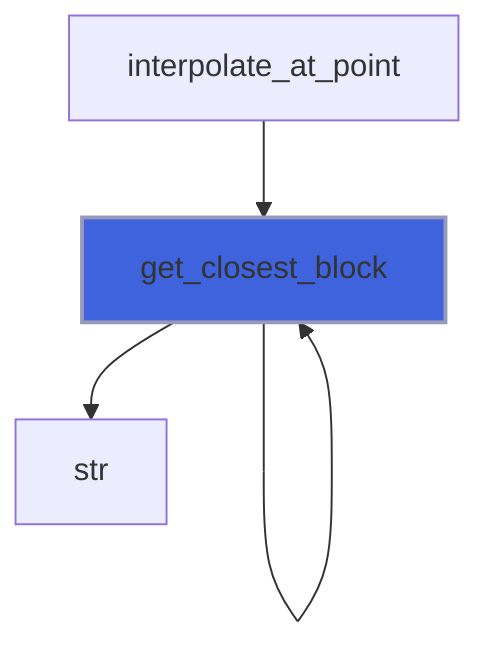
