# adam_ib_object

> ADAM, IB class definition, CPU backend.

**Source**: `src/lib/common/adam_ib_object.F90`

**Dependencies**

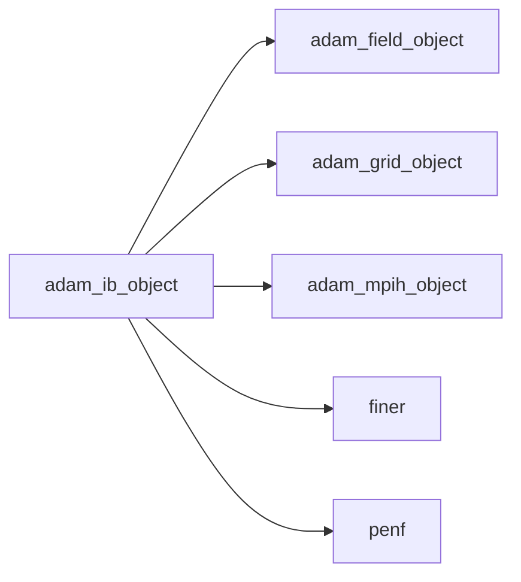

## Contents

- [analytical_sphere_object](#analytical-sphere-object)
- [analytical_rectangle_object](#analytical-rectangle-object)
- [ib_object](#ib-object)
- [compute_phi](#compute-phi)
- [compute_phi_all_solids](#compute-phi-all-solids)
- [initialize](#initialize)
- [load_from_file](#load-from-file)
- [move_phi](#move-phi)
- [evolve_eikonal](#evolve-eikonal)
- [invert_eikonal](#invert-eikonal)
- [compute_phi_analytical_sphere](#compute-phi-analytical-sphere)
- [compute_phi_analytical_circle](#compute-phi-analytical-circle)
- [compute_phi_analytical_rectangle](#compute-phi-analytical-rectangle)
- [description](#description)
- [sphere_to_array](#sphere-to-array)

## Variables

| Name | Type | Attributes | Description |
|------|------|------------|-------------|
| `INI_SECTION_NAME` | character(len=5) | parameter | INI (config) file section name containing IB configs. |
| `IB_ANALYTICAL_SPHERE` | character(len=20) | parameter | Analytical sphere solid. |
| `IB_ANALYTICAL_CIRCLE` | character(len=20) | parameter | Analytical circle solid. |
| `IB_ANALYTICAL_RECTANGLE` | character(len=20) | parameter | Analytical rectangle solid. |
| `IB_DEFINITIONS` | character(len=20) | parameter | Available solid definitions. |
| `BCS_VISCOUS` | integer(kind=[I4P](/api/src/third_party/PENF/src/lib/penf_global_parameters_variables)) | parameter | Visous wall. |
| `BCS_EULER` | integer(kind=[I4P](/api/src/third_party/PENF/src/lib/penf_global_parameters_variables)) | parameter | Inviscid wall. |

## Derived Types

### analytical_sphere_object

Analytical sphere (or circle) solid class.

#### Components

| Name | Type | Attributes | Description |
|------|------|------------|-------------|
| `center` | real(kind=[R8P](/api/src/third_party/PENF/src/lib/penf_global_parameters_variables)) |  | Sphere center. |
| `radius` | real(kind=[R8P](/api/src/third_party/PENF/src/lib/penf_global_parameters_variables)) |  | Sphere radius. |
| `axis` | character(len=1) |  | Axis (x,y,z) normal in case of circle solid. |

### analytical_rectangle_object

Analytical rectangle solid class.

#### Components

| Name | Type | Attributes | Description |
|------|------|------------|-------------|
| `center` | real(kind=[R8P](/api/src/third_party/PENF/src/lib/penf_global_parameters_variables)) |  | Sphere center. |
| `edge` | real(kind=[R8P](/api/src/third_party/PENF/src/lib/penf_global_parameters_variables)) |  | Major/minor edge length. |
| `axis` | character(len=1) |  | Axis (x,y,z) normal. |

### ib_object

IB class definition, CPU backend.

#### Components

| Name | Type | Attributes | Description |
|------|------|------------|-------------|
| `mpih` | type([mpih_object](/api/src/third_party/FUNDAL/src/lib/fundal_mpih_object#mpih-object)) |  | MPI handler. |
| `solids_number` | integer(kind=[I4P](/api/src/third_party/PENF/src/lib/penf_global_parameters_variables)) |  | Number of solids (only 1 supported now). |
| `s_name` | character(len=99) | allocatable | Solid name. |
| `bc_type` | integer(kind=[I4P](/api/src/third_party/PENF/src/lib/penf_global_parameters_variables)) | allocatable | Boundary condition type. |
| `q` | real(kind=[R8P](/api/src/third_party/PENF/src/lib/penf_global_parameters_variables)) | allocatable | Variables array for boundary conditions. |
| `definition` | character(len=99) | allocatable | (Type of) Solid definition. |
| `sphere` | type([analytical_sphere_object](/api/src/lib/common/adam_ib_object#analytical-sphere-object)) | allocatable | Analytical sphere/circle solid. |
| `rectangle` | type([analytical_rectangle_object](/api/src/lib/common/adam_ib_object#analytical-rectangle-object)) | allocatable | Analytical rectangle solid. |
| `n_eikonal` | integer(kind=[I4P](/api/src/third_party/PENF/src/lib/penf_global_parameters_variables)) |  | Number of eikonal integration steps. |
| `field` | type([field_object](/api/src/lib/common/adam_field_object#field-object)) | pointer | The field. |
| `grid` | type([grid_object](/api/src/lib/common/adam_grid_object#grid-object)) | pointer | The grid. |
| `phi` | real(kind=[R8P](/api/src/third_party/PENF/src/lib/penf_global_parameters_variables)) | allocatable | IB distance function. |

#### Type-Bound Procedures

| Name | Attributes | Description |
|------|------------|-------------|
| `compute_phi` | pass(self) | Compute distance function. |
| `compute_phi_all_solids` | pass(self) | Compute last phi index, all solids summary. |
| `description` | pass(self) | Return pretty-printed object description. |
| `evolve_eikonal` | pass(self) | Evolve eikonal equation. |
| `initialize` | pass(self) | Initialize IB. |
| `invert_eikonal` | pass(self) | Invert eikonal equation over q inside IB. |
| `load_from_file` | pass(self) | Load config from file. |
| `move_phi` | pass(self) | Move phi and the actual ptree representation. |
| `sphere_to_array` | pass(self) | Convert analytical sphere class data to array data. |
| `compute_phi_analytical_sphere` | pass(self) | Compute distance for analytical sphere solids. |
| `compute_phi_analytical_circle` | pass(self) | Compute distance for analytical circle solids. |
| `compute_phi_analytical_rectangle` | pass(self) | Compute distance for analytical rectangle solids. |

## Subroutines

### compute_phi

Compute phi, distance from IB solid.

```fortran
subroutine compute_phi(self, verbose)
```

**Arguments**

| Name | Type | Intent | Attributes | Description |
|------|------|--------|------------|-------------|
| `self` | class([ib_object](/api/src/lib/common/adam_ib_object#ib-object)) | inout |  | IB. |
| `verbose` | logical | in | optional | Flag to trigger verbose prints. |

**Call graph**

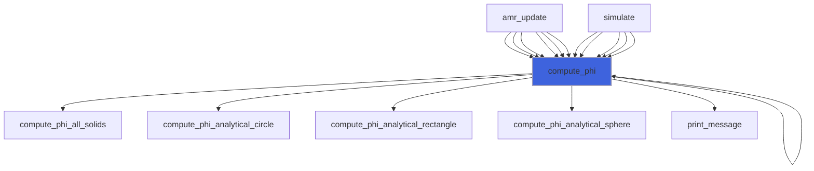

### compute_phi_all_solids

Compute phi, distance from IB solid.

```fortran
subroutine compute_phi_all_solids(self, verbose)
```

**Arguments**

| Name | Type | Intent | Attributes | Description |
|------|------|--------|------------|-------------|
| `self` | class([ib_object](/api/src/lib/common/adam_ib_object#ib-object)) | inout |  | IB. |
| `verbose` | logical | in | optional | Flag to trigger verbose prints. |

**Call graph**

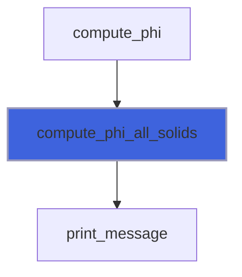

### initialize

Initialize the equation.

```fortran
subroutine initialize(self, grid, field, file_parameters)
```

**Arguments**

| Name | Type | Intent | Attributes | Description |
|------|------|--------|------------|-------------|
| `self` | class([ib_object](/api/src/lib/common/adam_ib_object#ib-object)) | inout |  | IB. |
| `grid` | type([grid_object](/api/src/lib/common/adam_grid_object#grid-object)) | in | target | The grid. |
| `field` | type([field_object](/api/src/lib/common/adam_field_object#field-object)) | in | target | The field. |
| `file_parameters` | type([file_ini](/api/src/third_party/FiNeR/src/lib/finer_file_ini_t#file-ini)) | inout |  | INI file handler. |

**Call graph**

```mermaid
flowchart TD
  add_node["add_node"] --> initialize["initialize"]
  analize["analize"] --> initialize["initialize"]
  build_connectivity["build_connectivity"] --> initialize["initialize"]
  distribute_facets["distribute_facets"] --> initialize["initialize"]
  distribute_facets_tree["distribute_facets_tree"] --> initialize["initialize"]
  export_vtk_file["export_vtk_file"] --> initialize["initialize"]
  initialize["initialize"] --> initialize["initialize"]
  initialize["initialize"] --> initialize["initialize"]
  initialize["initialize"] --> initialize["initialize"]
  initialize["initialize"] --> initialize["initialize"]
  initialize["initialize"] --> initialize["initialize"]
  initialize["initialize"] --> initialize["initialize"]
  initialize["initialize"] --> initialize["initialize"]
  initialize["initialize"] --> initialize["initialize"]
  initialize["initialize"] --> initialize["initialize"]
  initialize["initialize"] --> initialize["initialize"]
  initialize["initialize"] --> initialize["initialize"]
  initialize["initialize"] --> initialize["initialize"]
  initialize["initialize"] --> initialize["initialize"]
  initialize["initialize"] --> initialize["initialize"]
  initialize["initialize"] --> initialize["initialize"]
  initialize["initialize"] --> initialize["initialize"]
  initialize["initialize"] --> initialize["initialize"]
  initialize["initialize"] --> initialize["initialize"]
  initialize["initialize"] --> initialize["initialize"]
  initialize["initialize"] --> initialize["initialize"]
  initialize["initialize"] --> initialize["initialize"]
  initialize["initialize"] --> initialize["initialize"]
  initialize["initialize"] --> initialize["initialize"]
  initialize["initialize"] --> initialize["initialize"]
  initialize["initialize"] --> initialize["initialize"]
  initialize["initialize"] --> initialize["initialize"]
  initialize["initialize"] --> initialize["initialize"]
  initialize["initialize"] --> initialize["initialize"]
  initialize["initialize"] --> initialize["initialize"]
  initialize["initialize"] --> initialize["initialize"]
  initialize["initialize"] --> initialize["initialize"]
  initialize["initialize"] --> initialize["initialize"]
  initialize["initialize"] --> initialize["initialize"]
  initialize["initialize"] --> initialize["initialize"]
  initialize["initialize"] --> initialize["initialize"]
  initialize["initialize"] --> initialize["initialize"]
  initialize["initialize"] --> initialize["initialize"]
  initialize["initialize"] --> initialize["initialize"]
  initialize["initialize"] --> initialize["initialize"]
  initialize["initialize"] --> initialize["initialize"]
  initialize["initialize"] --> initialize["initialize"]
  initialize["initialize"] --> initialize["initialize"]
  initialize["initialize"] --> initialize["initialize"]
  initialize["initialize"] --> initialize["initialize"]
  initialize["initialize"] --> initialize["initialize"]
  initialize["initialize"] --> initialize["initialize"]
  initialize["initialize"] --> initialize["initialize"]
  initialize["initialize"] --> initialize["initialize"]
  initialize["initialize"] --> initialize["initialize"]
  initialize["initialize"] --> initialize["initialize"]
  initialize["initialize"] --> initialize["initialize"]
  initialize["initialize"] --> initialize["initialize"]
  initialize["initialize"] --> initialize["initialize"]
  initialize["initialize"] --> initialize["initialize"]
  initialize["initialize"] --> initialize["initialize"]
  initialize["initialize"] --> initialize["initialize"]
  initialize["initialize"] --> initialize["initialize"]
  initialize["initialize"] --> initialize["initialize"]
  initialize["initialize"] --> initialize["initialize"]
  initialize["initialize"] --> initialize["initialize"]
  initialize["initialize"] --> initialize["initialize"]
  initialize["initialize"] --> initialize["initialize"]
  initialize["initialize"] --> initialize["initialize"]
  initialize["initialize"] --> initialize["initialize"]
  initialize["initialize"] --> initialize["initialize"]
  initialize["initialize"] --> initialize["initialize"]
  initialize["initialize"] --> initialize["initialize"]
  initialize["initialize"] --> initialize["initialize"]
  initialize["initialize"] --> initialize["initialize"]
  initialize["initialize"] --> initialize["initialize"]
  initialize["initialize"] --> initialize["initialize"]
  initialize["initialize"] --> initialize["initialize"]
  initialize_common["initialize_common"] --> initialize["initialize"]
  initialize_common["initialize_common"] --> initialize["initialize"]
  initialize_common["initialize_common"] --> initialize["initialize"]
  initialize_common["initialize_common"] --> initialize["initialize"]
  load_from_file["load_from_file"] --> initialize["initialize"]
  load_from_file["load_from_file"] --> initialize["initialize"]
  open_file["open_file"] --> initialize["initialize"]
  open_file["open_file"] --> initialize["initialize"]
  open_file["open_file"] --> initialize["initialize"]
  resize["resize"] --> initialize["initialize"]
  save_into_file["save_into_file"] --> initialize["initialize"]
  save_vtk["save_vtk"] --> initialize["initialize"]
  simulate["simulate"] --> initialize["initialize"]
  simulate["simulate"] --> initialize["initialize"]
  simulate["simulate"] --> initialize["initialize"]
  simulate["simulate"] --> initialize["initialize"]
  simulate["simulate"] --> initialize["initialize"]
  simulate["simulate"] --> initialize["initialize"]
  simulate["simulate"] --> initialize["initialize"]
  test_stress["test_stress"] --> initialize["initialize"]
  initialize["initialize"] --> description["description"]
  initialize["initialize"] --> initialize["initialize"]
  initialize["initialize"] --> load_from_file["load_from_file"]
  initialize["initialize"] --> print_message["print_message"]
  style initialize fill:#3e63dd,stroke:#99b,stroke-width:2px
```

### load_from_file

Load config from file.

```fortran
subroutine load_from_file(self, file_parameters, go_on_fail)
```

**Arguments**

| Name | Type | Intent | Attributes | Description |
|------|------|--------|------------|-------------|
| `self` | class([ib_object](/api/src/lib/common/adam_ib_object#ib-object)) | inout |  | IB. |
| `file_parameters` | type([file_ini](/api/src/third_party/FiNeR/src/lib/finer_file_ini_t#file-ini)) | in |  | Simulation parameters ini file handler. |
| `go_on_fail` | logical | in | optional | Go on if load fails. |

**Call graph**

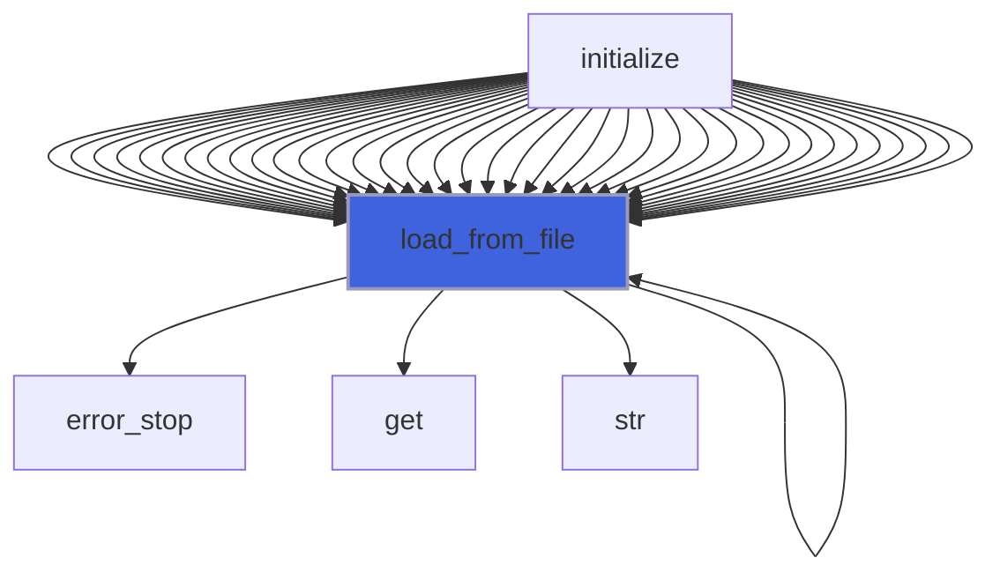

### move_phi

Move phi.

```fortran
subroutine move_phi(self, velocity, s)
```

**Arguments**

| Name | Type | Intent | Attributes | Description |
|------|------|--------|------------|-------------|
| `self` | class([ib_object](/api/src/lib/common/adam_ib_object#ib-object)) | inout |  | IB. |
| `velocity` | real(kind=[R8P](/api/src/third_party/PENF/src/lib/penf_global_parameters_variables)) | in |  | Velocity of the movement. |
| `s` | integer(kind=[I4P](/api/src/third_party/PENF/src/lib/penf_global_parameters_variables)) | in |  | Solid index. |

**Call graph**

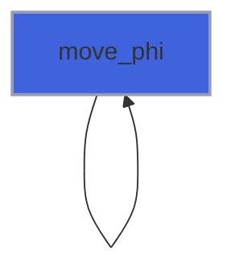

### evolve_eikonal

Evolve eikonal equation.

```fortran
subroutine evolve_eikonal(self, q)
```

**Arguments**

| Name | Type | Intent | Attributes | Description |
|------|------|--------|------------|-------------|
| `self` | class([ib_object](/api/src/lib/common/adam_ib_object#ib-object)) | in |  | IB. |
| `q` | real(kind=[R8P](/api/src/third_party/PENF/src/lib/penf_global_parameters_variables)) | inout |  | Conservative variables. |

**Call graph**

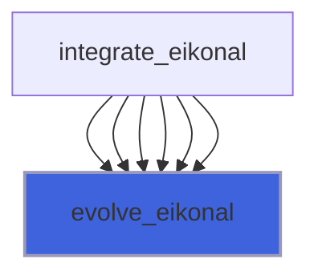

### invert_eikonal

Invert eikonal equation over q inside IB.

```fortran
subroutine invert_eikonal(self, q)
```

**Arguments**

| Name | Type | Intent | Attributes | Description |
|------|------|--------|------------|-------------|
| `self` | class([ib_object](/api/src/lib/common/adam_ib_object#ib-object)) | in |  | IB. |
| `q` | real(kind=[R8P](/api/src/third_party/PENF/src/lib/penf_global_parameters_variables)) | inout |  | Conservative variables. |

**Call graph**

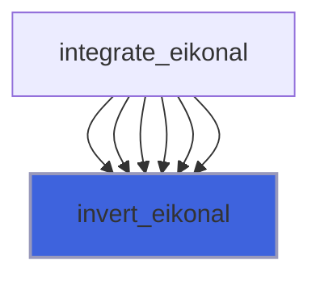

### compute_phi_analytical_sphere

Compute distance for analytical sphere solid.

```fortran
subroutine compute_phi_analytical_sphere(self, solid, sphere)
```

**Arguments**

| Name | Type | Intent | Attributes | Description |
|------|------|--------|------------|-------------|
| `self` | class([ib_object](/api/src/lib/common/adam_ib_object#ib-object)) | inout |  | IB. |
| `solid` | integer(kind=[I4P](/api/src/third_party/PENF/src/lib/penf_global_parameters_variables)) | in |  | Solid index. |
| `sphere` | type([analytical_sphere_object](/api/src/lib/common/adam_ib_object#analytical-sphere-object)) | in |  | Analytical sphere solid. |

**Call graph**

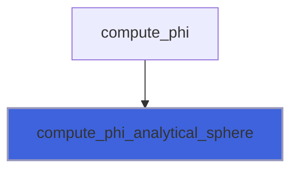

### compute_phi_analytical_circle

Compute distance function for analytical circle (2D) solid.

```fortran
subroutine compute_phi_analytical_circle(self, solid, sphere)
```

**Arguments**

| Name | Type | Intent | Attributes | Description |
|------|------|--------|------------|-------------|
| `self` | class([ib_object](/api/src/lib/common/adam_ib_object#ib-object)) | inout |  | IB. |
| `solid` | integer(kind=[I4P](/api/src/third_party/PENF/src/lib/penf_global_parameters_variables)) | in |  | Solid index. |
| `sphere` | type([analytical_sphere_object](/api/src/lib/common/adam_ib_object#analytical-sphere-object)) | in |  | Analytical circle solid. |

**Call graph**

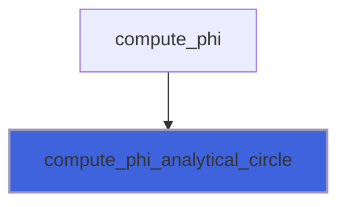

### compute_phi_analytical_rectangle

Compute distance function for analytical rectangle (2D) solid.

```fortran
subroutine compute_phi_analytical_rectangle(self, solid, rectangle)
```

**Arguments**

| Name | Type | Intent | Attributes | Description |
|------|------|--------|------------|-------------|
| `self` | class([ib_object](/api/src/lib/common/adam_ib_object#ib-object)) | inout |  | IB. |
| `solid` | integer(kind=[I4P](/api/src/third_party/PENF/src/lib/penf_global_parameters_variables)) | in |  | Solid index. |
| `rectangle` | type([analytical_rectangle_object](/api/src/lib/common/adam_ib_object#analytical-rectangle-object)) | in |  | Analytical rectangle solid. |

**Call graph**

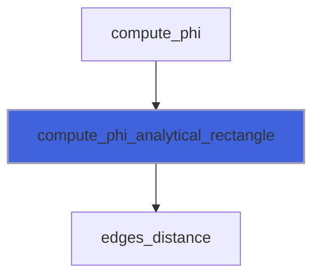

## Functions

### description

Return a pretty-formatted object description.

**Attributes**: pure

**Returns**: `character(len=:)`

```fortran
function description(self) result(desc)
```

**Arguments**

| Name | Type | Intent | Attributes | Description |
|------|------|--------|------------|-------------|
| `self` | class([ib_object](/api/src/lib/common/adam_ib_object#ib-object)) | in |  | IB. |

**Call graph**

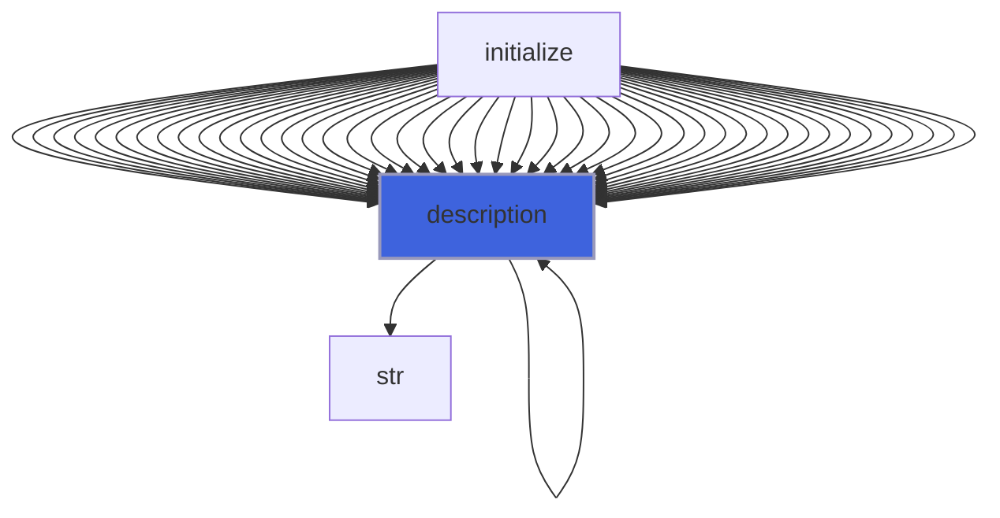

### sphere_to_array

Convert analytical sphere class data to array data.

**Returns**: real(kind=[R8P](/api/src/third_party/PENF/src/lib/penf_global_parameters_variables))

```fortran
function sphere_to_array(self, ib) result(array)
```

**Arguments**

| Name | Type | Intent | Attributes | Description |
|------|------|--------|------------|-------------|
| `self` | class([ib_object](/api/src/lib/common/adam_ib_object#ib-object)) | in |  | IB. |
| `ib` | integer(kind=[I4P](/api/src/third_party/PENF/src/lib/penf_global_parameters_variables)) | in |  | Index of IB solid. |

**Call graph**

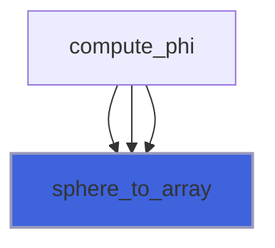
