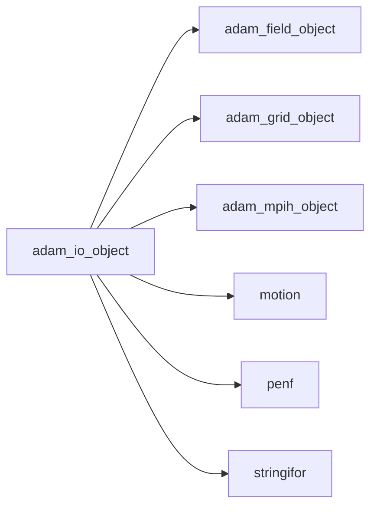
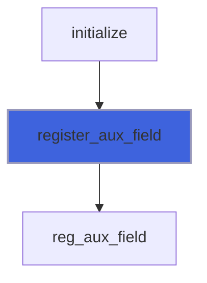
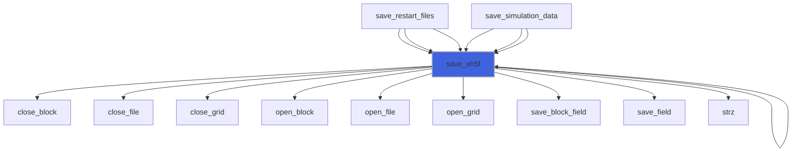
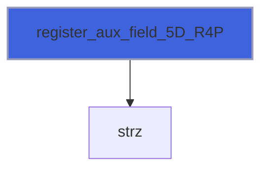
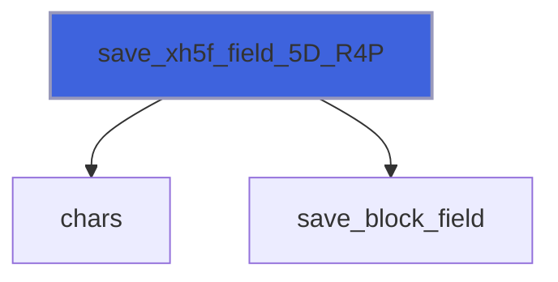
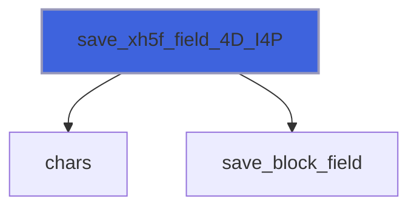

# adam_io_object

> ADAM, IO class definition.

**Source**: `src/lib/common/adam_io_object.F90`

**Dependencies**



## Contents

- [io_object](#io-object)
- [reg_aux_field](#reg-aux-field)
- [initialize](#initialize)
- [register_aux_field](#register-aux-field)
- [save_xh5f](#save-xh5f)
- [register_aux_field_4D_R8P](#register-aux-field-4d-r8p)
- [register_aux_field_5D_R8P](#register-aux-field-5d-r8p)
- [save_xh5f_field_4D_R8P](#save-xh5f-field-4d-r8p)
- [save_xh5f_field_5D_R8P](#save-xh5f-field-5d-r8p)
- [register_aux_field_4D_R4P](#register-aux-field-4d-r4p)
- [register_aux_field_5D_R4P](#register-aux-field-5d-r4p)
- [save_xh5f_field_4D_R4P](#save-xh5f-field-4d-r4p)
- [save_xh5f_field_5D_R4P](#save-xh5f-field-5d-r4p)
- [register_aux_field_4D_I8P](#register-aux-field-4d-i8p)
- [register_aux_field_5D_I8P](#register-aux-field-5d-i8p)
- [save_xh5f_field_4D_I8P](#save-xh5f-field-4d-i8p)
- [save_xh5f_field_5D_I8P](#save-xh5f-field-5d-i8p)
- [register_aux_field_4D_I4P](#register-aux-field-4d-i4p)
- [register_aux_field_5D_I4P](#register-aux-field-5d-i4p)
- [save_xh5f_field_4D_I4P](#save-xh5f-field-4d-i4p)
- [save_xh5f_field_5D_I4P](#save-xh5f-field-5d-i4p)
- [register_aux_field_4D_I2P](#register-aux-field-4d-i2p)
- [register_aux_field_5D_I2P](#register-aux-field-5d-i2p)
- [save_xh5f_field_4D_I2P](#save-xh5f-field-4d-i2p)
- [save_xh5f_field_5D_I2P](#save-xh5f-field-5d-i2p)
- [register_aux_field_4D_I1P](#register-aux-field-4d-i1p)
- [register_aux_field_5D_I1P](#register-aux-field-5d-i1p)
- [save_xh5f_field_4D_I1P](#save-xh5f-field-4d-i1p)
- [save_xh5f_field_5D_I1P](#save-xh5f-field-5d-i1p)

## Derived Types

### io_object

ADAM class definition.

#### Components

| Name | Type | Attributes | Description |
|------|------|------------|-------------|
| `mpih` | type([mpih_object](/api/src/third_party/FUNDAL/src/lib/fundal_mpih_object#mpih-object)) |  | The MPI handler. |
| `grid` | type([grid_object](/api/src/lib/common/adam_grid_object#grid-object)) | pointer | The grid. |
| `field` | type([field_object](/api/src/lib/common/adam_field_object#field-object)) | pointer | The field. |
| `q1_R8P` | real(kind=[R8P](/api/src/third_party/PENF/src/lib/penf_global_parameters_variables)) | pointer | Auxiliary (1) vector cell centered fields [nv,ni,nj,nk,nb], kind R8P. |
| `q2_R8P` | real(kind=[R8P](/api/src/third_party/PENF/src/lib/penf_global_parameters_variables)) | pointer | Auxiliary (2) vector cell centered fields [nv,ni,nj,nk,nb], kind R8P. |
| `q3_R8P` | real(kind=[R8P](/api/src/third_party/PENF/src/lib/penf_global_parameters_variables)) | pointer | Auxiliary (3) vector cell centered fields [nv,ni,nj,nk,nb], kind R8P. |
| `q4_R8P` | real(kind=[R8P](/api/src/third_party/PENF/src/lib/penf_global_parameters_variables)) | pointer | Auxiliary (4) vector cell centered fields [nv,ni,nj,nk,nb], kind R8P. |
| `q5_R8P` | real(kind=[R8P](/api/src/third_party/PENF/src/lib/penf_global_parameters_variables)) | pointer | Auxiliary (5) vector cell centered fields [nv,ni,nj,nk,nb], kind R8P. |
| `q6_R8P` | real(kind=[R8P](/api/src/third_party/PENF/src/lib/penf_global_parameters_variables)) | pointer | Auxiliary (6) vector cell centered fields [nv,ni,nj,nk,nb], kind R8P. |
| `q7_R8P` | real(kind=[R8P](/api/src/third_party/PENF/src/lib/penf_global_parameters_variables)) | pointer | Auxiliary (7) vector cell centered fields [nv,ni,nj,nk,nb], kind R8P. |
| `q8_R8P` | real(kind=[R8P](/api/src/third_party/PENF/src/lib/penf_global_parameters_variables)) | pointer | Auxiliary (8) vector cell centered fields [nv,ni,nj,nk,nb], kind R8P. |
| `q9_R8P` | real(kind=[R8P](/api/src/third_party/PENF/src/lib/penf_global_parameters_variables)) | pointer | Auxiliary (9) vector cell centered fields [nv,ni,nj,nk,nb], kind R8P. |
| `q1_R4P` | real(kind=[R4P](/api/src/third_party/PENF/src/lib/penf_global_parameters_variables)) | pointer | Auxiliary (1) vector cell centered fields [nv,ni,nj,nk,nb], kind R4P. |
| `q2_R4P` | real(kind=[R4P](/api/src/third_party/PENF/src/lib/penf_global_parameters_variables)) | pointer | Auxiliary (2) vector cell centered fields [nv,ni,nj,nk,nb], kind R4P. |
| `q3_R4P` | real(kind=[R4P](/api/src/third_party/PENF/src/lib/penf_global_parameters_variables)) | pointer | Auxiliary (3) vector cell centered fields [nv,ni,nj,nk,nb], kind R4P. |
| `q4_R4P` | real(kind=[R4P](/api/src/third_party/PENF/src/lib/penf_global_parameters_variables)) | pointer | Auxiliary (4) vector cell centered fields [nv,ni,nj,nk,nb], kind R4P. |
| `q5_R4P` | real(kind=[R4P](/api/src/third_party/PENF/src/lib/penf_global_parameters_variables)) | pointer | Auxiliary (5) vector cell centered fields [nv,ni,nj,nk,nb], kind R4P. |
| `q1_I8P` | integer(kind=[I8P](/api/src/third_party/PENF/src/lib/penf_global_parameters_variables)) | pointer | Auxiliary (1) vector cell centered fields [nv,ni,nj,nk,nb], kind I8P. |
| `q2_I8P` | integer(kind=[I8P](/api/src/third_party/PENF/src/lib/penf_global_parameters_variables)) | pointer | Auxiliary (2) vector cell centered fields [nv,ni,nj,nk,nb], kind I8P. |
| `q3_I8P` | integer(kind=[I8P](/api/src/third_party/PENF/src/lib/penf_global_parameters_variables)) | pointer | Auxiliary (3) vector cell centered fields [nv,ni,nj,nk,nb], kind I8P. |
| `q4_I8P` | integer(kind=[I8P](/api/src/third_party/PENF/src/lib/penf_global_parameters_variables)) | pointer | Auxiliary (4) vector cell centered fields [nv,ni,nj,nk,nb], kind I8P. |
| `q5_I8P` | integer(kind=[I8P](/api/src/third_party/PENF/src/lib/penf_global_parameters_variables)) | pointer | Auxiliary (5) vector cell centered fields [nv,ni,nj,nk,nb], kind I8P. |
| `q1_I4P` | integer(kind=[I4P](/api/src/third_party/PENF/src/lib/penf_global_parameters_variables)) | pointer | Auxiliary (1) vector cell centered fields [nv,ni,nj,nk,nb], kind I4P. |
| `q2_I4P` | integer(kind=[I4P](/api/src/third_party/PENF/src/lib/penf_global_parameters_variables)) | pointer | Auxiliary (2) vector cell centered fields [nv,ni,nj,nk,nb], kind I4P. |
| `q3_I4P` | integer(kind=[I4P](/api/src/third_party/PENF/src/lib/penf_global_parameters_variables)) | pointer | Auxiliary (3) vector cell centered fields [nv,ni,nj,nk,nb], kind I4P. |
| `q4_I4P` | integer(kind=[I4P](/api/src/third_party/PENF/src/lib/penf_global_parameters_variables)) | pointer | Auxiliary (4) vector cell centered fields [nv,ni,nj,nk,nb], kind I4P. |
| `q5_I4P` | integer(kind=[I4P](/api/src/third_party/PENF/src/lib/penf_global_parameters_variables)) | pointer | Auxiliary (5) vector cell centered fields [nv,ni,nj,nk,nb], kind I4P. |
| `q1_I2P` | integer(kind=[I2P](/api/src/third_party/PENF/src/lib/penf_global_parameters_variables)) | pointer | Auxiliary (1) vector cell centered fields [nv,ni,nj,nk,nb], kind I2P. |
| `q2_I2P` | integer(kind=[I2P](/api/src/third_party/PENF/src/lib/penf_global_parameters_variables)) | pointer | Auxiliary (2) vector cell centered fields [nv,ni,nj,nk,nb], kind I2P. |
| `q3_I2P` | integer(kind=[I2P](/api/src/third_party/PENF/src/lib/penf_global_parameters_variables)) | pointer | Auxiliary (3) vector cell centered fields [nv,ni,nj,nk,nb], kind I2P. |
| `q4_I2P` | integer(kind=[I2P](/api/src/third_party/PENF/src/lib/penf_global_parameters_variables)) | pointer | Auxiliary (4) vector cell centered fields [nv,ni,nj,nk,nb], kind I2P. |
| `q5_I2P` | integer(kind=[I2P](/api/src/third_party/PENF/src/lib/penf_global_parameters_variables)) | pointer | Auxiliary (5) vector cell centered fields [nv,ni,nj,nk,nb], kind I2P. |
| `q1_I1P` | integer(kind=[I1P](/api/src/third_party/PENF/src/lib/penf_global_parameters_variables)) | pointer | Auxiliary (1) vector cell centered fields [nv,ni,nj,nk,nb], kind I1P. |
| `q2_I1P` | integer(kind=[I1P](/api/src/third_party/PENF/src/lib/penf_global_parameters_variables)) | pointer | Auxiliary (2) vector cell centered fields [nv,ni,nj,nk,nb], kind I1P. |
| `q3_I1P` | integer(kind=[I1P](/api/src/third_party/PENF/src/lib/penf_global_parameters_variables)) | pointer | Auxiliary (3) vector cell centered fields [nv,ni,nj,nk,nb], kind I1P. |
| `q4_I1P` | integer(kind=[I1P](/api/src/third_party/PENF/src/lib/penf_global_parameters_variables)) | pointer | Auxiliary (4) vector cell centered fields [nv,ni,nj,nk,nb], kind I1P. |
| `q5_I1P` | integer(kind=[I1P](/api/src/third_party/PENF/src/lib/penf_global_parameters_variables)) | pointer | Auxiliary (5) vector cell centered fields [nv,ni,nj,nk,nb], kind I1P. |
| `s1_R8P` | real(kind=[R8P](/api/src/third_party/PENF/src/lib/penf_global_parameters_variables)) | pointer | Auxiliary (1) scalar cell centered fields [   ni,nj,nk,nb], kind R8P. |
| `s2_R8P` | real(kind=[R8P](/api/src/third_party/PENF/src/lib/penf_global_parameters_variables)) | pointer | Auxiliary (2) scalar cell centered fields [   ni,nj,nk,nb], kind R8P. |
| `s3_R8P` | real(kind=[R8P](/api/src/third_party/PENF/src/lib/penf_global_parameters_variables)) | pointer | Auxiliary (3) scalar cell centered fields [   ni,nj,nk,nb], kind R8P. |
| `s4_R8P` | real(kind=[R8P](/api/src/third_party/PENF/src/lib/penf_global_parameters_variables)) | pointer | Auxiliary (4) scalar cell centered fields [   ni,nj,nk,nb], kind R8P. |
| `s5_R8P` | real(kind=[R8P](/api/src/third_party/PENF/src/lib/penf_global_parameters_variables)) | pointer | Auxiliary (5) scalar cell centered fields [   ni,nj,nk,nb], kind R8P. |
| `s1_R4P` | real(kind=[R4P](/api/src/third_party/PENF/src/lib/penf_global_parameters_variables)) | pointer | Auxiliary (1) scalar cell centered fields [   ni,nj,nk,nb], kind R4P. |
| `s2_R4P` | real(kind=[R4P](/api/src/third_party/PENF/src/lib/penf_global_parameters_variables)) | pointer | Auxiliary (2) scalar cell centered fields [   ni,nj,nk,nb], kind R4P. |
| `s3_R4P` | real(kind=[R4P](/api/src/third_party/PENF/src/lib/penf_global_parameters_variables)) | pointer | Auxiliary (3) scalar cell centered fields [   ni,nj,nk,nb], kind R4P. |
| `s4_R4P` | real(kind=[R4P](/api/src/third_party/PENF/src/lib/penf_global_parameters_variables)) | pointer | Auxiliary (4) scalar cell centered fields [   ni,nj,nk,nb], kind R4P. |
| `s5_R4P` | real(kind=[R4P](/api/src/third_party/PENF/src/lib/penf_global_parameters_variables)) | pointer | Auxiliary (5) scalar cell centered fields [   ni,nj,nk,nb], kind R4P. |
| `s1_I8P` | integer(kind=[I8P](/api/src/third_party/PENF/src/lib/penf_global_parameters_variables)) | pointer | Auxiliary (1) scalar cell centered fields [   ni,nj,nk,nb], kind I8P. |
| `s2_I8P` | integer(kind=[I8P](/api/src/third_party/PENF/src/lib/penf_global_parameters_variables)) | pointer | Auxiliary (2) scalar cell centered fields [   ni,nj,nk,nb], kind I8P. |
| `s3_I8P` | integer(kind=[I8P](/api/src/third_party/PENF/src/lib/penf_global_parameters_variables)) | pointer | Auxiliary (3) scalar cell centered fields [   ni,nj,nk,nb], kind I8P. |
| `s4_I8P` | integer(kind=[I8P](/api/src/third_party/PENF/src/lib/penf_global_parameters_variables)) | pointer | Auxiliary (4) scalar cell centered fields [   ni,nj,nk,nb], kind I8P. |
| `s5_I8P` | integer(kind=[I8P](/api/src/third_party/PENF/src/lib/penf_global_parameters_variables)) | pointer | Auxiliary (5) scalar cell centered fields [   ni,nj,nk,nb], kind I8P. |
| `s1_I4P` | integer(kind=[I4P](/api/src/third_party/PENF/src/lib/penf_global_parameters_variables)) | pointer | Auxiliary (1) scalar cell centered fields [   ni,nj,nk,nb], kind I4P. |
| `s2_I4P` | integer(kind=[I4P](/api/src/third_party/PENF/src/lib/penf_global_parameters_variables)) | pointer | Auxiliary (2) scalar cell centered fields [   ni,nj,nk,nb], kind I4P. |
| `s3_I4P` | integer(kind=[I4P](/api/src/third_party/PENF/src/lib/penf_global_parameters_variables)) | pointer | Auxiliary (3) scalar cell centered fields [   ni,nj,nk,nb], kind I4P. |
| `s4_I4P` | integer(kind=[I4P](/api/src/third_party/PENF/src/lib/penf_global_parameters_variables)) | pointer | Auxiliary (4) scalar cell centered fields [   ni,nj,nk,nb], kind I4P. |
| `s5_I4P` | integer(kind=[I4P](/api/src/third_party/PENF/src/lib/penf_global_parameters_variables)) | pointer | Auxiliary (5) scalar cell centered fields [   ni,nj,nk,nb], kind I4P. |
| `s1_I2P` | integer(kind=[I2P](/api/src/third_party/PENF/src/lib/penf_global_parameters_variables)) | pointer | Auxiliary (1) scalar cell centered fields [   ni,nj,nk,nb], kind I2P. |
| `s2_I2P` | integer(kind=[I2P](/api/src/third_party/PENF/src/lib/penf_global_parameters_variables)) | pointer | Auxiliary (2) scalar cell centered fields [   ni,nj,nk,nb], kind I2P. |
| `s3_I2P` | integer(kind=[I2P](/api/src/third_party/PENF/src/lib/penf_global_parameters_variables)) | pointer | Auxiliary (3) scalar cell centered fields [   ni,nj,nk,nb], kind I2P. |
| `s4_I2P` | integer(kind=[I2P](/api/src/third_party/PENF/src/lib/penf_global_parameters_variables)) | pointer | Auxiliary (4) scalar cell centered fields [   ni,nj,nk,nb], kind I2P. |
| `s5_I2P` | integer(kind=[I2P](/api/src/third_party/PENF/src/lib/penf_global_parameters_variables)) | pointer | Auxiliary (5) scalar cell centered fields [   ni,nj,nk,nb], kind I2P. |
| `s1_I1P` | integer(kind=[I1P](/api/src/third_party/PENF/src/lib/penf_global_parameters_variables)) | pointer | Auxiliary (1) scalar cell centered fields [   ni,nj,nk,nb], kind I1P. |
| `s2_I1P` | integer(kind=[I1P](/api/src/third_party/PENF/src/lib/penf_global_parameters_variables)) | pointer | Auxiliary (2) scalar cell centered fields [   ni,nj,nk,nb], kind I1P. |
| `s3_I1P` | integer(kind=[I1P](/api/src/third_party/PENF/src/lib/penf_global_parameters_variables)) | pointer | Auxiliary (3) scalar cell centered fields [   ni,nj,nk,nb], kind I1P. |
| `s4_I1P` | integer(kind=[I1P](/api/src/third_party/PENF/src/lib/penf_global_parameters_variables)) | pointer | Auxiliary (4) scalar cell centered fields [   ni,nj,nk,nb], kind I1P. |
| `s5_I1P` | integer(kind=[I1P](/api/src/third_party/PENF/src/lib/penf_global_parameters_variables)) | pointer | Auxiliary (5) scalar cell centered fields [   ni,nj,nk,nb], kind I1P. |
| `q1_R8P_name` | type([string](/api/src/third_party/StringiFor/src/lib/stringifor_string_t#string)) | allocatable | Auxiliary (1) vector fields names [nv], kind R8P. |
| `q2_R8P_name` | type([string](/api/src/third_party/StringiFor/src/lib/stringifor_string_t#string)) | allocatable | Auxiliary (2) vector fields names [nv], kind R8P. |
| `q3_R8P_name` | type([string](/api/src/third_party/StringiFor/src/lib/stringifor_string_t#string)) | allocatable | Auxiliary (3) vector fields names [nv], kind R8P. |
| `q4_R8P_name` | type([string](/api/src/third_party/StringiFor/src/lib/stringifor_string_t#string)) | allocatable | Auxiliary (4) vector fields names [nv], kind R8P. |
| `q5_R8P_name` | type([string](/api/src/third_party/StringiFor/src/lib/stringifor_string_t#string)) | allocatable | Auxiliary (5) vector fields names [nv], kind R8P. |
| `q6_R8P_name` | type([string](/api/src/third_party/StringiFor/src/lib/stringifor_string_t#string)) | allocatable | Auxiliary (6) vector fields names [nv], kind R8P. |
| `q7_R8P_name` | type([string](/api/src/third_party/StringiFor/src/lib/stringifor_string_t#string)) | allocatable | Auxiliary (7) vector fields names [nv], kind R8P. |
| `q8_R8P_name` | type([string](/api/src/third_party/StringiFor/src/lib/stringifor_string_t#string)) | allocatable | Auxiliary (8) vector fields names [nv], kind R8P. |
| `q9_R8P_name` | type([string](/api/src/third_party/StringiFor/src/lib/stringifor_string_t#string)) | allocatable | Auxiliary (9) vector fields names [nv], kind R8P. |
| `q1_R4P_name` | type([string](/api/src/third_party/StringiFor/src/lib/stringifor_string_t#string)) | allocatable | Auxiliary (1) vector fields names [nv], kind R4P. |
| `q2_R4P_name` | type([string](/api/src/third_party/StringiFor/src/lib/stringifor_string_t#string)) | allocatable | Auxiliary (2) vector fields names [nv], kind R4P. |
| `q3_R4P_name` | type([string](/api/src/third_party/StringiFor/src/lib/stringifor_string_t#string)) | allocatable | Auxiliary (3) vector fields names [nv], kind R4P. |
| `q4_R4P_name` | type([string](/api/src/third_party/StringiFor/src/lib/stringifor_string_t#string)) | allocatable | Auxiliary (4) vector fields names [nv], kind R4P. |
| `q5_R4P_name` | type([string](/api/src/third_party/StringiFor/src/lib/stringifor_string_t#string)) | allocatable | Auxiliary (5) vector fields names [nv], kind R4P. |
| `q1_I8P_name` | type([string](/api/src/third_party/StringiFor/src/lib/stringifor_string_t#string)) | allocatable | Auxiliary (1) vector fields names [nv], kind I8P. |
| `q2_I8P_name` | type([string](/api/src/third_party/StringiFor/src/lib/stringifor_string_t#string)) | allocatable | Auxiliary (2) vector fields names [nv], kind I8P. |
| `q3_I8P_name` | type([string](/api/src/third_party/StringiFor/src/lib/stringifor_string_t#string)) | allocatable | Auxiliary (3) vector fields names [nv], kind I8P. |
| `q4_I8P_name` | type([string](/api/src/third_party/StringiFor/src/lib/stringifor_string_t#string)) | allocatable | Auxiliary (4) vector fields names [nv], kind I8P. |
| `q5_I8P_name` | type([string](/api/src/third_party/StringiFor/src/lib/stringifor_string_t#string)) | allocatable | Auxiliary (5) vector fields names [nv], kind I8P. |
| `q1_I4P_name` | type([string](/api/src/third_party/StringiFor/src/lib/stringifor_string_t#string)) | allocatable | Auxiliary (1) vector fields names [nv], kind I4P. |
| `q2_I4P_name` | type([string](/api/src/third_party/StringiFor/src/lib/stringifor_string_t#string)) | allocatable | Auxiliary (2) vector fields names [nv], kind I4P. |
| `q3_I4P_name` | type([string](/api/src/third_party/StringiFor/src/lib/stringifor_string_t#string)) | allocatable | Auxiliary (3) vector fields names [nv], kind I4P. |
| `q4_I4P_name` | type([string](/api/src/third_party/StringiFor/src/lib/stringifor_string_t#string)) | allocatable | Auxiliary (4) vector fields names [nv], kind I4P. |
| `q5_I4P_name` | type([string](/api/src/third_party/StringiFor/src/lib/stringifor_string_t#string)) | allocatable | Auxiliary (5) vector fields names [nv], kind I4P. |
| `q1_I2P_name` | type([string](/api/src/third_party/StringiFor/src/lib/stringifor_string_t#string)) | allocatable | Auxiliary (1) vector fields names [nv], kind I2P. |
| `q2_I2P_name` | type([string](/api/src/third_party/StringiFor/src/lib/stringifor_string_t#string)) | allocatable | Auxiliary (2) vector fields names [nv], kind I2P. |
| `q3_I2P_name` | type([string](/api/src/third_party/StringiFor/src/lib/stringifor_string_t#string)) | allocatable | Auxiliary (3) vector fields names [nv], kind I2P. |
| `q4_I2P_name` | type([string](/api/src/third_party/StringiFor/src/lib/stringifor_string_t#string)) | allocatable | Auxiliary (4) vector fields names [nv], kind I2P. |
| `q5_I2P_name` | type([string](/api/src/third_party/StringiFor/src/lib/stringifor_string_t#string)) | allocatable | Auxiliary (5) vector fields names [nv], kind I2P. |
| `q1_I1P_name` | type([string](/api/src/third_party/StringiFor/src/lib/stringifor_string_t#string)) | allocatable | Auxiliary (1) vector fields names [nv], kind I1P. |
| `q2_I1P_name` | type([string](/api/src/third_party/StringiFor/src/lib/stringifor_string_t#string)) | allocatable | Auxiliary (2) vector fields names [nv], kind I1P. |
| `q3_I1P_name` | type([string](/api/src/third_party/StringiFor/src/lib/stringifor_string_t#string)) | allocatable | Auxiliary (3) vector fields names [nv], kind I1P. |
| `q4_I1P_name` | type([string](/api/src/third_party/StringiFor/src/lib/stringifor_string_t#string)) | allocatable | Auxiliary (4) vector fields names [nv], kind I1P. |
| `q5_I1P_name` | type([string](/api/src/third_party/StringiFor/src/lib/stringifor_string_t#string)) | allocatable | Auxiliary (5) vector fields names [nv], kind I1P. |
| `s1_R8P_name` | type([string](/api/src/third_party/StringiFor/src/lib/stringifor_string_t#string)) |  | Auxiliary (1) scalar field name, kind R8P. |
| `s2_R8P_name` | type([string](/api/src/third_party/StringiFor/src/lib/stringifor_string_t#string)) |  | Auxiliary (2) scalar field name, kind R8P. |
| `s3_R8P_name` | type([string](/api/src/third_party/StringiFor/src/lib/stringifor_string_t#string)) |  | Auxiliary (3) scalar field name, kind R8P. |
| `s4_R8P_name` | type([string](/api/src/third_party/StringiFor/src/lib/stringifor_string_t#string)) |  | Auxiliary (4) scalar field name, kind R8P. |
| `s5_R8P_name` | type([string](/api/src/third_party/StringiFor/src/lib/stringifor_string_t#string)) |  | Auxiliary (5) scalar field name, kind R8P. |
| `s1_R4P_name` | type([string](/api/src/third_party/StringiFor/src/lib/stringifor_string_t#string)) |  | Auxiliary (1) scalar field name, kind R4P. |
| `s2_R4P_name` | type([string](/api/src/third_party/StringiFor/src/lib/stringifor_string_t#string)) |  | Auxiliary (2) scalar field name, kind R4P. |
| `s3_R4P_name` | type([string](/api/src/third_party/StringiFor/src/lib/stringifor_string_t#string)) |  | Auxiliary (3) scalar field name, kind R4P. |
| `s4_R4P_name` | type([string](/api/src/third_party/StringiFor/src/lib/stringifor_string_t#string)) |  | Auxiliary (4) scalar field name, kind R4P. |
| `s5_R4P_name` | type([string](/api/src/third_party/StringiFor/src/lib/stringifor_string_t#string)) |  | Auxiliary (5) scalar field name, kind R4P. |
| `s1_I8P_name` | type([string](/api/src/third_party/StringiFor/src/lib/stringifor_string_t#string)) |  | Auxiliary (1) scalar field name, kind I8P. |
| `s2_I8P_name` | type([string](/api/src/third_party/StringiFor/src/lib/stringifor_string_t#string)) |  | Auxiliary (2) scalar field name, kind I8P. |
| `s3_I8P_name` | type([string](/api/src/third_party/StringiFor/src/lib/stringifor_string_t#string)) |  | Auxiliary (3) scalar field name, kind I8P. |
| `s4_I8P_name` | type([string](/api/src/third_party/StringiFor/src/lib/stringifor_string_t#string)) |  | Auxiliary (4) scalar field name, kind I8P. |
| `s5_I8P_name` | type([string](/api/src/third_party/StringiFor/src/lib/stringifor_string_t#string)) |  | Auxiliary (5) scalar field name, kind I8P. |
| `s1_I4P_name` | type([string](/api/src/third_party/StringiFor/src/lib/stringifor_string_t#string)) |  | Auxiliary (1) scalar field name, kind I4P. |
| `s2_I4P_name` | type([string](/api/src/third_party/StringiFor/src/lib/stringifor_string_t#string)) |  | Auxiliary (2) scalar field name, kind I4P. |
| `s3_I4P_name` | type([string](/api/src/third_party/StringiFor/src/lib/stringifor_string_t#string)) |  | Auxiliary (3) scalar field name, kind I4P. |
| `s4_I4P_name` | type([string](/api/src/third_party/StringiFor/src/lib/stringifor_string_t#string)) |  | Auxiliary (4) scalar field name, kind I4P. |
| `s5_I4P_name` | type([string](/api/src/third_party/StringiFor/src/lib/stringifor_string_t#string)) |  | Auxiliary (5) scalar field name, kind I4P. |
| `s1_I2P_name` | type([string](/api/src/third_party/StringiFor/src/lib/stringifor_string_t#string)) |  | Auxiliary (1) scalar field name, kind I2P. |
| `s2_I2P_name` | type([string](/api/src/third_party/StringiFor/src/lib/stringifor_string_t#string)) |  | Auxiliary (2) scalar field name, kind I2P. |
| `s3_I2P_name` | type([string](/api/src/third_party/StringiFor/src/lib/stringifor_string_t#string)) |  | Auxiliary (3) scalar field name, kind I2P. |
| `s4_I2P_name` | type([string](/api/src/third_party/StringiFor/src/lib/stringifor_string_t#string)) |  | Auxiliary (4) scalar field name, kind I2P. |
| `s5_I2P_name` | type([string](/api/src/third_party/StringiFor/src/lib/stringifor_string_t#string)) |  | Auxiliary (5) scalar field name, kind I2P. |
| `s1_I1P_name` | type([string](/api/src/third_party/StringiFor/src/lib/stringifor_string_t#string)) |  | Auxiliary (1) scalar field name, kind I1P. |
| `s2_I1P_name` | type([string](/api/src/third_party/StringiFor/src/lib/stringifor_string_t#string)) |  | Auxiliary (2) scalar field name, kind I1P. |
| `s3_I1P_name` | type([string](/api/src/third_party/StringiFor/src/lib/stringifor_string_t#string)) |  | Auxiliary (3) scalar field name, kind I1P. |
| `s4_I1P_name` | type([string](/api/src/third_party/StringiFor/src/lib/stringifor_string_t#string)) |  | Auxiliary (4) scalar field name, kind I1P. |
| `s5_I1P_name` | type([string](/api/src/third_party/StringiFor/src/lib/stringifor_string_t#string)) |  | Auxiliary (5) scalar field name, kind I1P. |

#### Type-Bound Procedures

| Name | Attributes | Description |
|------|------------|-------------|
| `initialize` | pass(self) | Initialize class. |
| `register_aux_field` | pass(self) | Register auxiliary field. |
| `save_xh5f` | pass(self) | Save in XH5F (XDMF/HDF5) format. |
| `save_field` |  | Save fields by XH5F (XDMF/HDF5) file handler. |
| `save_xh5f_field_4D_R8P` | pass(self) | Save fields by XH5F file handler, rank 4D, kind R8P. |
| `save_xh5f_field_4D_R4P` | pass(self) | Save fields by XH5F file handler, rank 4D, kind R4P. |
| `save_xh5f_field_4D_I8P` | pass(self) | Save fields by XH5F file handler, rank 4D, kind I8P. |
| `save_xh5f_field_4D_I4P` | pass(self) | Save fields by XH5F file handler, rank 4D, kind I4P. |
| `save_xh5f_field_4D_I2P` | pass(self) | Save fields by XH5F file handler, rank 4D, kind I2P. |
| `save_xh5f_field_4D_I1P` | pass(self) | Save fields by XH5F file handler, rank 4D, kind I1P. |
| `save_xh5f_field_5D_R8P` | pass(self) | Save fields by XH5F file handler, rank 5D, kind R8P. |
| `save_xh5f_field_5D_R4P` | pass(self) | Save fields by XH5F file handler, rank 5D, kind R4P. |
| `save_xh5f_field_5D_I8P` | pass(self) | Save fields by XH5F file handler, rank 5D, kind I8P. |
| `save_xh5f_field_5D_I4P` | pass(self) | Save fields by XH5F file handler, rank 5D, kind I4P. |
| `save_xh5f_field_5D_I2P` | pass(self) | Save fields by XH5F file handler, rank 5D, kind I2P. |
| `save_xh5f_field_5D_I1P` | pass(self) | Save fields by XH5F file handler, rank 5D, kind I1P. |

## Interfaces

### reg_aux_field

Register auxiliary fields data into ADAM IO class, non TBP.

**Module procedures**: [`register_aux_field_4D_R8P`](/api/src/lib/common/adam_io_object#register-aux-field-4d-r8p), [`register_aux_field_4D_R4P`](/api/src/lib/common/adam_io_object#register-aux-field-4d-r4p), [`register_aux_field_4D_I8P`](/api/src/lib/common/adam_io_object#register-aux-field-4d-i8p), [`register_aux_field_4D_I4P`](/api/src/lib/common/adam_io_object#register-aux-field-4d-i4p), [`register_aux_field_4D_I2P`](/api/src/lib/common/adam_io_object#register-aux-field-4d-i2p), [`register_aux_field_4D_I1P`](/api/src/lib/common/adam_io_object#register-aux-field-4d-i1p), [`register_aux_field_5D_R8P`](/api/src/lib/common/adam_io_object#register-aux-field-5d-r8p), [`register_aux_field_5D_R4P`](/api/src/lib/common/adam_io_object#register-aux-field-5d-r4p), [`register_aux_field_5D_I8P`](/api/src/lib/common/adam_io_object#register-aux-field-5d-i8p), [`register_aux_field_5D_I4P`](/api/src/lib/common/adam_io_object#register-aux-field-5d-i4p), [`register_aux_field_5D_I2P`](/api/src/lib/common/adam_io_object#register-aux-field-5d-i2p), [`register_aux_field_5D_I1P`](/api/src/lib/common/adam_io_object#register-aux-field-5d-i1p)

## Subroutines

### initialize

Initialize class.

```fortran
subroutine initialize(self, grid, field, q1_R8P, q1_R8P_name, q2_R8P, q2_R8P_name, q3_R8P, q3_R8P_name, q4_R8P, q4_R8P_name, q5_R8P, q5_R8P_name, q6_R8P, q6_R8P_name, q7_R8P, q7_R8P_name, q8_R8P, q8_R8P_name, q9_R8P, q9_R8P_name, q1_R4P, q1_R4P_name, q2_R4P, q2_R4P_name, q3_R4P, q3_R4P_name, q4_R4P, q4_R4P_name, q5_R4P, q5_R4P_name, q1_I8P, q1_I8P_name, q2_I8P, q2_I8P_name, q3_I8P, q3_I8P_name, q4_I8P, q4_I8P_name, q5_I8P, q5_I8P_name, q1_I4P, q1_I4P_name, q2_I4P, q2_I4P_name, q3_I4P, q3_I4P_name, q4_I4P, q4_I4P_name, q5_I4P, q5_I4P_name, q1_I2P, q1_I2P_name, q2_I2P, q2_I2P_name, q3_I2P, q3_I2P_name, q4_I2P, q4_I2P_name, q5_I2P, q5_I2P_name, q1_I1P, q1_I1P_name, q2_I1P, q2_I1P_name, q3_I1P, q3_I1P_name, q4_I1P, q4_I1P_name, q5_I1P, q5_I1P_name, s1_R8P, s1_R8P_name, s2_R8P, s2_R8P_name, s3_R8P, s3_R8P_name, s4_R8P, s4_R8P_name, s5_R8P, s5_R8P_name, s1_R4P, s1_R4P_name, s2_R4P, s2_R4P_name, s3_R4P, s3_R4P_name, s4_R4P, s4_R4P_name, s5_R4P, s5_R4P_name, s1_I8P, s1_I8P_name, s2_I8P, s2_I8P_name, s3_I8P, s3_I8P_name, s4_I8P, s4_I8P_name, s5_I8P, s5_I8P_name, s1_I4P, s1_I4P_name, s2_I4P, s2_I4P_name, s3_I4P, s3_I4P_name, s4_I4P, s4_I4P_name, s5_I4P, s5_I4P_name, s1_I2P, s1_I2P_name, s2_I2P, s2_I2P_name, s3_I2P, s3_I2P_name, s4_I2P, s4_I2P_name, s5_I2P, s5_I2P_name, s1_I1P, s1_I1P_name, s2_I1P, s2_I1P_name, s3_I1P, s3_I1P_name, s4_I1P, s4_I1P_name, s5_I1P, s5_I1P_name)
```

**Arguments**

| Name | Type | Intent | Attributes | Description |
|------|------|--------|------------|-------------|
| `self` | class([io_object](/api/src/lib/common/adam_io_object#io-object)) | inout |  | IO handler. |
| `grid` | type([grid_object](/api/src/lib/common/adam_grid_object#grid-object)) | in | target | The grid. |
| `field` | type([field_object](/api/src/lib/common/adam_field_object#field-object)) | in | target | The field. |
| `q1_R8P` | real(kind=[R8P](/api/src/third_party/PENF/src/lib/penf_global_parameters_variables)) | in | target, optional | Auxiliary (1) vector cell centered fields, kind R8P. |
| `q1_R8P_name` | character(len=*) | in | optional | Auxiliary (1) vector fields names, kind R8P. |
| `q2_R8P` | real(kind=[R8P](/api/src/third_party/PENF/src/lib/penf_global_parameters_variables)) | in | target, optional | Auxiliary (2) vector cell centered fields, kind R8P. |
| `q2_R8P_name` | character(len=*) | in | optional | Auxiliary (2) vector fields names, kind R8P. |
| `q3_R8P` | real(kind=[R8P](/api/src/third_party/PENF/src/lib/penf_global_parameters_variables)) | in | target, optional | Auxiliary (3) vector cell centered fields, kind R8P. |
| `q3_R8P_name` | character(len=*) | in | optional | Auxiliary (3) vector fields names, kind R8P. |
| `q4_R8P` | real(kind=[R8P](/api/src/third_party/PENF/src/lib/penf_global_parameters_variables)) | in | target, optional | Auxiliary (4) vector cell centered fields, kind R8P. |
| `q4_R8P_name` | character(len=*) | in | optional | Auxiliary (4) vector fields names, kind R8P. |
| `q5_R8P` | real(kind=[R8P](/api/src/third_party/PENF/src/lib/penf_global_parameters_variables)) | in | target, optional | Auxiliary (5) vector cell centered fields, kind R8P. |
| `q5_R8P_name` | character(len=*) | in | optional | Auxiliary (5) vector fields names, kind R8P. |
| `q6_R8P` | real(kind=[R8P](/api/src/third_party/PENF/src/lib/penf_global_parameters_variables)) | in | target, optional | Auxiliary (6) vector cell centered fields, kind R8P. |
| `q6_R8P_name` | character(len=*) | in | optional | Auxiliary (6) vector fields names, kind R8P. |
| `q7_R8P` | real(kind=[R8P](/api/src/third_party/PENF/src/lib/penf_global_parameters_variables)) | in | target, optional | Auxiliary (7) vector cell centered fields, kind R8P. |
| `q7_R8P_name` | character(len=*) | in | optional | Auxiliary (7) vector fields names, kind R8P. |
| `q8_R8P` | real(kind=[R8P](/api/src/third_party/PENF/src/lib/penf_global_parameters_variables)) | in | target, optional | Auxiliary (8) vector cell centered fields, kind R8P. |
| `q8_R8P_name` | character(len=*) | in | optional | Auxiliary (8) vector fields names, kind R8P. |
| `q9_R8P` | real(kind=[R8P](/api/src/third_party/PENF/src/lib/penf_global_parameters_variables)) | in | target, optional | Auxiliary (9) vector cell centered fields, kind R8P. |
| `q9_R8P_name` | character(len=*) | in | optional | Auxiliary (9) vector fields names, kind R8P. |
| `q1_R4P` | real(kind=[R4P](/api/src/third_party/PENF/src/lib/penf_global_parameters_variables)) | in | target, optional | Auxiliary (1) vector cell centered fields, kind R4P. |
| `q1_R4P_name` | character(len=*) | in | optional | Auxiliary (1) vector fields names, kind R4P. |
| `q2_R4P` | real(kind=[R4P](/api/src/third_party/PENF/src/lib/penf_global_parameters_variables)) | in | target, optional | Auxiliary (2) vector cell centered fields, kind R4P. |
| `q2_R4P_name` | character(len=*) | in | optional | Auxiliary (2) vector fields names, kind R4P. |
| `q3_R4P` | real(kind=[R4P](/api/src/third_party/PENF/src/lib/penf_global_parameters_variables)) | in | target, optional | Auxiliary (3) vector cell centered fields, kind R4P. |
| `q3_R4P_name` | character(len=*) | in | optional | Auxiliary (3) vector fields names, kind R4P. |
| `q4_R4P` | real(kind=[R4P](/api/src/third_party/PENF/src/lib/penf_global_parameters_variables)) | in | target, optional | Auxiliary (4) vector cell centered fields, kind R4P. |
| `q4_R4P_name` | character(len=*) | in | optional | Auxiliary (4) vector fields names, kind R4P. |
| `q5_R4P` | real(kind=[R4P](/api/src/third_party/PENF/src/lib/penf_global_parameters_variables)) | in | target, optional | Auxiliary (5) vector cell centered fields, kind R4P. |
| `q5_R4P_name` | character(len=*) | in | optional | Auxiliary (5) vector fields names, kind R4P. |
| `q1_I8P` | integer(kind=[I8P](/api/src/third_party/PENF/src/lib/penf_global_parameters_variables)) | in | target, optional | Auxiliary (1) vector cell centered fields, kind I8P. |
| `q1_I8P_name` | character(len=*) | in | optional | Auxiliary (1) vector fields names, kind I8P. |
| `q2_I8P` | integer(kind=[I8P](/api/src/third_party/PENF/src/lib/penf_global_parameters_variables)) | in | target, optional | Auxiliary (2) vector cell centered fields, kind I8P. |
| `q2_I8P_name` | character(len=*) | in | optional | Auxiliary (2) vector fields names, kind I8P. |
| `q3_I8P` | integer(kind=[I8P](/api/src/third_party/PENF/src/lib/penf_global_parameters_variables)) | in | target, optional | Auxiliary (3) vector cell centered fields, kind I8P. |
| `q3_I8P_name` | character(len=*) | in | optional | Auxiliary (3) vector fields names, kind I8P. |
| `q4_I8P` | integer(kind=[I8P](/api/src/third_party/PENF/src/lib/penf_global_parameters_variables)) | in | target, optional | Auxiliary (4) vector cell centered fields, kind I8P. |
| `q4_I8P_name` | character(len=*) | in | optional | Auxiliary (4) vector fields names, kind I8P. |
| `q5_I8P` | integer(kind=[I8P](/api/src/third_party/PENF/src/lib/penf_global_parameters_variables)) | in | target, optional | Auxiliary (5) vector cell centered fields, kind I8P. |
| `q5_I8P_name` | character(len=*) | in | optional | Auxiliary (5) vector fields names, kind I8P. |
| `q1_I4P` | integer(kind=[I4P](/api/src/third_party/PENF/src/lib/penf_global_parameters_variables)) | in | target, optional | Auxiliary (1) vector cell centered fields, kind I4P. |
| `q1_I4P_name` | character(len=*) | in | optional | Auxiliary (1) vector fields names, kind I4P. |
| `q2_I4P` | integer(kind=[I4P](/api/src/third_party/PENF/src/lib/penf_global_parameters_variables)) | in | target, optional | Auxiliary (2) vector cell centered fields, kind I4P. |
| `q2_I4P_name` | character(len=*) | in | optional | Auxiliary (2) vector fields names, kind I4P. |
| `q3_I4P` | integer(kind=[I4P](/api/src/third_party/PENF/src/lib/penf_global_parameters_variables)) | in | target, optional | Auxiliary (3) vector cell centered fields, kind I4P. |
| `q3_I4P_name` | character(len=*) | in | optional | Auxiliary (3) vector fields names, kind I4P. |
| `q4_I4P` | integer(kind=[I4P](/api/src/third_party/PENF/src/lib/penf_global_parameters_variables)) | in | target, optional | Auxiliary (4) vector cell centered fields, kind I4P. |
| `q4_I4P_name` | character(len=*) | in | optional | Auxiliary (4) vector fields names, kind I4P. |
| `q5_I4P` | integer(kind=[I4P](/api/src/third_party/PENF/src/lib/penf_global_parameters_variables)) | in | target, optional | Auxiliary (5) vector cell centered fields, kind I4P. |
| `q5_I4P_name` | character(len=*) | in | optional | Auxiliary (5) vector fields names, kind I4P. |
| `q1_I2P` | integer(kind=[I2P](/api/src/third_party/PENF/src/lib/penf_global_parameters_variables)) | in | target, optional | Auxiliary (1) vector cell centered fields, kind I2P. |
| `q1_I2P_name` | character(len=*) | in | optional | Auxiliary (1) vector fields names, kind I2P. |
| `q2_I2P` | integer(kind=[I2P](/api/src/third_party/PENF/src/lib/penf_global_parameters_variables)) | in | target, optional | Auxiliary (2) vector cell centered fields, kind I2P. |
| `q2_I2P_name` | character(len=*) | in | optional | Auxiliary (2) vector fields names, kind I2P. |
| `q3_I2P` | integer(kind=[I2P](/api/src/third_party/PENF/src/lib/penf_global_parameters_variables)) | in | target, optional | Auxiliary (3) vector cell centered fields, kind I2P. |
| `q3_I2P_name` | character(len=*) | in | optional | Auxiliary (3) vector fields names, kind I2P. |
| `q4_I2P` | integer(kind=[I2P](/api/src/third_party/PENF/src/lib/penf_global_parameters_variables)) | in | target, optional | Auxiliary (4) vector cell centered fields, kind I2P. |
| `q4_I2P_name` | character(len=*) | in | optional | Auxiliary (4) vector fields names, kind I2P. |
| `q5_I2P` | integer(kind=[I2P](/api/src/third_party/PENF/src/lib/penf_global_parameters_variables)) | in | target, optional | Auxiliary (5) vector cell centered fields, kind I2P. |
| `q5_I2P_name` | character(len=*) | in | optional | Auxiliary (5) vector fields names, kind I2P. |
| `q1_I1P` | integer(kind=[I1P](/api/src/third_party/PENF/src/lib/penf_global_parameters_variables)) | in | target, optional | Auxiliary (1) vector cell centered fields, kind I1P. |
| `q1_I1P_name` | character(len=*) | in | optional | Auxiliary (1) vector fields names, kind I1P. |
| `q2_I1P` | integer(kind=[I1P](/api/src/third_party/PENF/src/lib/penf_global_parameters_variables)) | in | target, optional | Auxiliary (2) vector cell centered fields, kind I1P. |
| `q2_I1P_name` | character(len=*) | in | optional | Auxiliary (2) vector fields names, kind I1P. |
| `q3_I1P` | integer(kind=[I1P](/api/src/third_party/PENF/src/lib/penf_global_parameters_variables)) | in | target, optional | Auxiliary (3) vector cell centered fields, kind I1P. |
| `q3_I1P_name` | character(len=*) | in | optional | Auxiliary (3) vector fields names, kind I1P. |
| `q4_I1P` | integer(kind=[I1P](/api/src/third_party/PENF/src/lib/penf_global_parameters_variables)) | in | target, optional | Auxiliary (4) vector cell centered fields, kind I1P. |
| `q4_I1P_name` | character(len=*) | in | optional | Auxiliary (4) vector fields names, kind I1P. |
| `q5_I1P` | integer(kind=[I1P](/api/src/third_party/PENF/src/lib/penf_global_parameters_variables)) | in | target, optional | Auxiliary (5) vector cell centered fields, kind I1P. |
| `q5_I1P_name` | character(len=*) | in | optional | Auxiliary (5) vector fields names, kind I1P. |
| `s1_R8P` | real(kind=[R8P](/api/src/third_party/PENF/src/lib/penf_global_parameters_variables)) | in | target, optional | Auxiliary (1) scalar cell centered fields, kind R8P. |
| `s1_R8P_name` | character(len=*) | in | optional | Auxiliary (1) scalar field name, kind R8P. |
| `s2_R8P` | real(kind=[R8P](/api/src/third_party/PENF/src/lib/penf_global_parameters_variables)) | in | target, optional | Auxiliary (2) scalar cell centered fields, kind R8P. |
| `s2_R8P_name` | character(len=*) | in | optional | Auxiliary (2) scalar field name, kind R8P. |
| `s3_R8P` | real(kind=[R8P](/api/src/third_party/PENF/src/lib/penf_global_parameters_variables)) | in | target, optional | Auxiliary (3) scalar cell centered fields, kind R8P. |
| `s3_R8P_name` | character(len=*) | in | optional | Auxiliary (3) scalar field name, kind R8P. |
| `s4_R8P` | real(kind=[R8P](/api/src/third_party/PENF/src/lib/penf_global_parameters_variables)) | in | target, optional | Auxiliary (4) scalar cell centered fields, kind R8P. |
| `s4_R8P_name` | character(len=*) | in | optional | Auxiliary (4) scalar field name, kind R8P. |
| `s5_R8P` | real(kind=[R8P](/api/src/third_party/PENF/src/lib/penf_global_parameters_variables)) | in | target, optional | Auxiliary (5) scalar cell centered fields, kind R8P. |
| `s5_R8P_name` | character(len=*) | in | optional | Auxiliary (5) scalar field name, kind R8P. |
| `s1_R4P` | real(kind=[R4P](/api/src/third_party/PENF/src/lib/penf_global_parameters_variables)) | in | target, optional | Auxiliary (1) scalar cell centered fields, kind R4P. |
| `s1_R4P_name` | character(len=*) | in | optional | Auxiliary (1) scalar field name, kind R4P. |
| `s2_R4P` | real(kind=[R4P](/api/src/third_party/PENF/src/lib/penf_global_parameters_variables)) | in | target, optional | Auxiliary (2) scalar cell centered fields, kind R4P. |
| `s2_R4P_name` | character(len=*) | in | optional | Auxiliary (2) scalar field name, kind R4P. |
| `s3_R4P` | real(kind=[R4P](/api/src/third_party/PENF/src/lib/penf_global_parameters_variables)) | in | target, optional | Auxiliary (3) scalar cell centered fields, kind R4P. |
| `s3_R4P_name` | character(len=*) | in | optional | Auxiliary (3) scalar field name, kind R4P. |
| `s4_R4P` | real(kind=[R4P](/api/src/third_party/PENF/src/lib/penf_global_parameters_variables)) | in | target, optional | Auxiliary (4) scalar cell centered fields, kind R4P. |
| `s4_R4P_name` | character(len=*) | in | optional | Auxiliary (4) scalar field name, kind R4P. |
| `s5_R4P` | real(kind=[R4P](/api/src/third_party/PENF/src/lib/penf_global_parameters_variables)) | in | target, optional | Auxiliary (5) scalar cell centered fields, kind R4P. |
| `s5_R4P_name` | character(len=*) | in | optional | Auxiliary (5) scalar field name, kind R4P. |
| `s1_I8P` | integer(kind=[I8P](/api/src/third_party/PENF/src/lib/penf_global_parameters_variables)) | in | target, optional | Auxiliary (1) scalar cell centered fields, kind I8P. |
| `s1_I8P_name` | character(len=*) | in | optional | Auxiliary (1) scalar field name, kind I8P. |
| `s2_I8P` | integer(kind=[I8P](/api/src/third_party/PENF/src/lib/penf_global_parameters_variables)) | in | target, optional | Auxiliary (2) scalar cell centered fields, kind I8P. |
| `s2_I8P_name` | character(len=*) | in | optional | Auxiliary (2) scalar field name, kind I8P. |
| `s3_I8P` | integer(kind=[I8P](/api/src/third_party/PENF/src/lib/penf_global_parameters_variables)) | in | target, optional | Auxiliary (3) scalar cell centered fields, kind I8P. |
| `s3_I8P_name` | character(len=*) | in | optional | Auxiliary (3) scalar field name, kind I8P. |
| `s4_I8P` | integer(kind=[I8P](/api/src/third_party/PENF/src/lib/penf_global_parameters_variables)) | in | target, optional | Auxiliary (4) scalar cell centered fields, kind I8P. |
| `s4_I8P_name` | character(len=*) | in | optional | Auxiliary (4) scalar field name, kind I8P. |
| `s5_I8P` | integer(kind=[I8P](/api/src/third_party/PENF/src/lib/penf_global_parameters_variables)) | in | target, optional | Auxiliary (5) scalar cell centered fields, kind I8P. |
| `s5_I8P_name` | character(len=*) | in | optional | Auxiliary (5) scalar field name, kind I8P. |
| `s1_I4P` | integer(kind=[I4P](/api/src/third_party/PENF/src/lib/penf_global_parameters_variables)) | in | target, optional | Auxiliary (1) scalar cell centered fields, kind I4P. |
| `s1_I4P_name` | character(len=*) | in | optional | Auxiliary (1) scalar field name, kind I4P. |
| `s2_I4P` | integer(kind=[I4P](/api/src/third_party/PENF/src/lib/penf_global_parameters_variables)) | in | target, optional | Auxiliary (2) scalar cell centered fields, kind I4P. |
| `s2_I4P_name` | character(len=*) | in | optional | Auxiliary (2) scalar field name, kind I4P. |
| `s3_I4P` | integer(kind=[I4P](/api/src/third_party/PENF/src/lib/penf_global_parameters_variables)) | in | target, optional | Auxiliary (3) scalar cell centered fields, kind I4P. |
| `s3_I4P_name` | character(len=*) | in | optional | Auxiliary (3) scalar field name, kind I4P. |
| `s4_I4P` | integer(kind=[I4P](/api/src/third_party/PENF/src/lib/penf_global_parameters_variables)) | in | target, optional | Auxiliary (4) scalar cell centered fields, kind I4P. |
| `s4_I4P_name` | character(len=*) | in | optional | Auxiliary (4) scalar field name, kind I4P. |
| `s5_I4P` | integer(kind=[I4P](/api/src/third_party/PENF/src/lib/penf_global_parameters_variables)) | in | target, optional | Auxiliary (5) scalar cell centered fields, kind I4P. |
| `s5_I4P_name` | character(len=*) | in | optional | Auxiliary (5) scalar field name, kind I4P. |
| `s1_I2P` | integer(kind=[I2P](/api/src/third_party/PENF/src/lib/penf_global_parameters_variables)) | in | target, optional | Auxiliary (1) scalar cell centered fields, kind I2P. |
| `s1_I2P_name` | character(len=*) | in | optional | Auxiliary (1) scalar field name, kind I2P. |
| `s2_I2P` | integer(kind=[I2P](/api/src/third_party/PENF/src/lib/penf_global_parameters_variables)) | in | target, optional | Auxiliary (2) scalar cell centered fields, kind I2P. |
| `s2_I2P_name` | character(len=*) | in | optional | Auxiliary (2) scalar field name, kind I2P. |
| `s3_I2P` | integer(kind=[I2P](/api/src/third_party/PENF/src/lib/penf_global_parameters_variables)) | in | target, optional | Auxiliary (3) scalar cell centered fields, kind I2P. |
| `s3_I2P_name` | character(len=*) | in | optional | Auxiliary (3) scalar field name, kind I2P. |
| `s4_I2P` | integer(kind=[I2P](/api/src/third_party/PENF/src/lib/penf_global_parameters_variables)) | in | target, optional | Auxiliary (4) scalar cell centered fields, kind I2P. |
| `s4_I2P_name` | character(len=*) | in | optional | Auxiliary (4) scalar field name, kind I2P. |
| `s5_I2P` | integer(kind=[I2P](/api/src/third_party/PENF/src/lib/penf_global_parameters_variables)) | in | target, optional | Auxiliary (5) scalar cell centered fields, kind I2P. |
| `s5_I2P_name` | character(len=*) | in | optional | Auxiliary (5) scalar field name, kind I2P. |
| `s1_I1P` | integer(kind=[I1P](/api/src/third_party/PENF/src/lib/penf_global_parameters_variables)) | in | target, optional | Auxiliary (1) scalar cell centered fields, kind I1P. |
| `s1_I1P_name` | character(len=*) | in | optional | Auxiliary (1) scalar field name, kind I1P. |
| `s2_I1P` | integer(kind=[I1P](/api/src/third_party/PENF/src/lib/penf_global_parameters_variables)) | in | target, optional | Auxiliary (2) scalar cell centered fields, kind I1P. |
| `s2_I1P_name` | character(len=*) | in | optional | Auxiliary (2) scalar field name, kind I1P. |
| `s3_I1P` | integer(kind=[I1P](/api/src/third_party/PENF/src/lib/penf_global_parameters_variables)) | in | target, optional | Auxiliary (3) scalar cell centered fields, kind I1P. |
| `s3_I1P_name` | character(len=*) | in | optional | Auxiliary (3) scalar field name, kind I1P. |
| `s4_I1P` | integer(kind=[I1P](/api/src/third_party/PENF/src/lib/penf_global_parameters_variables)) | in | target, optional | Auxiliary (4) scalar cell centered fields, kind I1P. |
| `s4_I1P_name` | character(len=*) | in | optional | Auxiliary (4) scalar field name, kind I1P. |
| `s5_I1P` | integer(kind=[I1P](/api/src/third_party/PENF/src/lib/penf_global_parameters_variables)) | in | target, optional | Auxiliary (5) scalar cell centered fields, kind I1P. |
| `s5_I1P_name` | character(len=*) | in | optional | Auxiliary (5) scalar field name, kind I1P. |

**Call graph**



```mermaid
flowchart TD
  add_node["add_node"] --> initialize["initialize"]
  analize["analize"] --> initialize["initialize"]
  build_connectivity["build_connectivity"] --> initialize["initialize"]
  distribute_facets["distribute_facets"] --> initialize["initialize"]
  distribute_facets_tree["distribute_facets_tree"] --> initialize["initialize"]
  export_vtk_file["export_vtk_file"] --> initialize["initialize"]
  initialize["initialize"] --> initialize["initialize"]
  initialize["initialize"] --> initialize["initialize"]
  initialize["initialize"] --> initialize["initialize"]
  initialize["initialize"] --> initialize["initialize"]
  initialize["initialize"] --> initialize["initialize"]
  initialize["initialize"] --> initialize["initialize"]
  initialize["initialize"] --> initialize["initialize"]
  initialize["initialize"] --> initialize["initialize"]
  initialize["initialize"] --> initialize["initialize"]
  initialize["initialize"] --> initialize["initialize"]
  initialize["initialize"] --> initialize["initialize"]
  initialize["initialize"] --> initialize["initialize"]
  initialize["initialize"] --> initialize["initialize"]
  initialize["initialize"] --> initialize["initialize"]
  initialize["initialize"] --> initialize["initialize"]
  initialize["initialize"] --> initialize["initialize"]
  initialize["initialize"] --> initialize["initialize"]
  initialize["initialize"] --> initialize["initialize"]
  initialize["initialize"] --> initialize["initialize"]
  initialize["initialize"] --> initialize["initialize"]
  initialize["initialize"] --> initialize["initialize"]
  initialize["initialize"] --> initialize["initialize"]
  initialize["initialize"] --> initialize["initialize"]
  initialize["initialize"] --> initialize["initialize"]
  initialize["initialize"] --> initialize["initialize"]
  initialize["initialize"] --> initialize["initialize"]
  initialize["initialize"] --> initialize["initialize"]
  initialize["initialize"] --> initialize["initialize"]
  initialize["initialize"] --> initialize["initialize"]
  initialize["initialize"] --> initialize["initialize"]
  initialize["initialize"] --> initialize["initialize"]
  initialize["initialize"] --> initialize["initialize"]
  initialize["initialize"] --> initialize["initialize"]
  initialize["initialize"] --> initialize["initialize"]
  initialize["initialize"] --> initialize["initialize"]
  initialize["initialize"] --> initialize["initialize"]
  initialize["initialize"] --> initialize["initialize"]
  initialize["initialize"] --> initialize["initialize"]
  initialize["initialize"] --> initialize["initialize"]
  initialize["initialize"] --> initialize["initialize"]
  initialize["initialize"] --> initialize["initialize"]
  initialize["initialize"] --> initialize["initialize"]
  initialize["initialize"] --> initialize["initialize"]
  initialize["initialize"] --> initialize["initialize"]
  initialize["initialize"] --> initialize["initialize"]
  initialize["initialize"] --> initialize["initialize"]
  initialize["initialize"] --> initialize["initialize"]
  initialize["initialize"] --> initialize["initialize"]
  initialize["initialize"] --> initialize["initialize"]
  initialize["initialize"] --> initialize["initialize"]
  initialize["initialize"] --> initialize["initialize"]
  initialize["initialize"] --> initialize["initialize"]
  initialize["initialize"] --> initialize["initialize"]
  initialize["initialize"] --> initialize["initialize"]
  initialize["initialize"] --> initialize["initialize"]
  initialize["initialize"] --> initialize["initialize"]
  initialize["initialize"] --> initialize["initialize"]
  initialize["initialize"] --> initialize["initialize"]
  initialize["initialize"] --> initialize["initialize"]
  initialize["initialize"] --> initialize["initialize"]
  initialize["initialize"] --> initialize["initialize"]
  initialize["initialize"] --> initialize["initialize"]
  initialize["initialize"] --> initialize["initialize"]
  initialize["initialize"] --> initialize["initialize"]
  initialize["initialize"] --> initialize["initialize"]
  initialize["initialize"] --> initialize["initialize"]
  initialize["initialize"] --> initialize["initialize"]
  initialize["initialize"] --> initialize["initialize"]
  initialize["initialize"] --> initialize["initialize"]
  initialize["initialize"] --> initialize["initialize"]
  initialize["initialize"] --> initialize["initialize"]
  initialize["initialize"] --> initialize["initialize"]
  initialize_common["initialize_common"] --> initialize["initialize"]
  initialize_common["initialize_common"] --> initialize["initialize"]
  initialize_common["initialize_common"] --> initialize["initialize"]
  initialize_common["initialize_common"] --> initialize["initialize"]
  load_from_file["load_from_file"] --> initialize["initialize"]
  load_from_file["load_from_file"] --> initialize["initialize"]
  open_file["open_file"] --> initialize["initialize"]
  open_file["open_file"] --> initialize["initialize"]
  open_file["open_file"] --> initialize["initialize"]
  resize["resize"] --> initialize["initialize"]
  save_into_file["save_into_file"] --> initialize["initialize"]
  save_vtk["save_vtk"] --> initialize["initialize"]
  simulate["simulate"] --> initialize["initialize"]
  simulate["simulate"] --> initialize["initialize"]
  simulate["simulate"] --> initialize["initialize"]
  simulate["simulate"] --> initialize["initialize"]
  simulate["simulate"] --> initialize["initialize"]
  simulate["simulate"] --> initialize["initialize"]
  simulate["simulate"] --> initialize["initialize"]
  test_stress["test_stress"] --> initialize["initialize"]
  initialize["initialize"] --> initialize["initialize"]
  initialize["initialize"] --> print_message["print_message"]
  initialize["initialize"] --> register_aux_field["register_aux_field"]
  style initialize fill:#3e63dd,stroke:#99b,stroke-width:2px
```

### register_aux_field

Register auxiliary fields.

```fortran
subroutine register_aux_field(self, q1_R8P, q1_R8P_name, q2_R8P, q2_R8P_name, q3_R8P, q3_R8P_name, q4_R8P, q4_R8P_name, q5_R8P, q5_R8P_name, q6_R8P, q6_R8P_name, q7_R8P, q7_R8P_name, q8_R8P, q8_R8P_name, q9_R8P, q9_R8P_name, q1_R4P, q1_R4P_name, q2_R4P, q2_R4P_name, q3_R4P, q3_R4P_name, q4_R4P, q4_R4P_name, q5_R4P, q5_R4P_name, q1_I8P, q1_I8P_name, q2_I8P, q2_I8P_name, q3_I8P, q3_I8P_name, q4_I8P, q4_I8P_name, q5_I8P, q5_I8P_name, q1_I4P, q1_I4P_name, q2_I4P, q2_I4P_name, q3_I4P, q3_I4P_name, q4_I4P, q4_I4P_name, q5_I4P, q5_I4P_name, q1_I2P, q1_I2P_name, q2_I2P, q2_I2P_name, q3_I2P, q3_I2P_name, q4_I2P, q4_I2P_name, q5_I2P, q5_I2P_name, q1_I1P, q1_I1P_name, q2_I1P, q2_I1P_name, q3_I1P, q3_I1P_name, q4_I1P, q4_I1P_name, q5_I1P, q5_I1P_name, s1_R8P, s1_R8P_name, s2_R8P, s2_R8P_name, s3_R8P, s3_R8P_name, s4_R8P, s4_R8P_name, s5_R8P, s5_R8P_name, s1_R4P, s1_R4P_name, s2_R4P, s2_R4P_name, s3_R4P, s3_R4P_name, s4_R4P, s4_R4P_name, s5_R4P, s5_R4P_name, s1_I8P, s1_I8P_name, s2_I8P, s2_I8P_name, s3_I8P, s3_I8P_name, s4_I8P, s4_I8P_name, s5_I8P, s5_I8P_name, s1_I4P, s1_I4P_name, s2_I4P, s2_I4P_name, s3_I4P, s3_I4P_name, s4_I4P, s4_I4P_name, s5_I4P, s5_I4P_name, s1_I2P, s1_I2P_name, s2_I2P, s2_I2P_name, s3_I2P, s3_I2P_name, s4_I2P, s4_I2P_name, s5_I2P, s5_I2P_name, s1_I1P, s1_I1P_name, s2_I1P, s2_I1P_name, s3_I1P, s3_I1P_name, s4_I1P, s4_I1P_name, s5_I1P, s5_I1P_name)
```

**Arguments**

| Name | Type | Intent | Attributes | Description |
|------|------|--------|------------|-------------|
| `self` | class([io_object](/api/src/lib/common/adam_io_object#io-object)) | inout |  | IO handler. |
| `q1_R8P` | real(kind=[R8P](/api/src/third_party/PENF/src/lib/penf_global_parameters_variables)) | in | target, optional | Auxiliary (1) vector cell centered fields, kind R8P. |
| `q1_R8P_name` | character(len=*) | in | optional | Auxiliary (1) vector fields names, kind R8P. |
| `q2_R8P` | real(kind=[R8P](/api/src/third_party/PENF/src/lib/penf_global_parameters_variables)) | in | target, optional | Auxiliary (2) vector cell centered fields, kind R8P. |
| `q2_R8P_name` | character(len=*) | in | optional | Auxiliary (2) vector fields names, kind R8P. |
| `q3_R8P` | real(kind=[R8P](/api/src/third_party/PENF/src/lib/penf_global_parameters_variables)) | in | target, optional | Auxiliary (3) vector cell centered fields, kind R8P. |
| `q3_R8P_name` | character(len=*) | in | optional | Auxiliary (3) vector fields names, kind R8P. |
| `q4_R8P` | real(kind=[R8P](/api/src/third_party/PENF/src/lib/penf_global_parameters_variables)) | in | target, optional | Auxiliary (4) vector cell centered fields, kind R8P. |
| `q4_R8P_name` | character(len=*) | in | optional | Auxiliary (4) vector fields names, kind R8P. |
| `q5_R8P` | real(kind=[R8P](/api/src/third_party/PENF/src/lib/penf_global_parameters_variables)) | in | target, optional | Auxiliary (5) vector cell centered fields, kind R8P. |
| `q5_R8P_name` | character(len=*) | in | optional | Auxiliary (5) vector fields names, kind R8P. |
| `q6_R8P` | real(kind=[R8P](/api/src/third_party/PENF/src/lib/penf_global_parameters_variables)) | in | target, optional | Auxiliary (6) vector cell centered fields, kind R8P. |
| `q6_R8P_name` | character(len=*) | in | optional | Auxiliary (6) vector fields names, kind R8P. |
| `q7_R8P` | real(kind=[R8P](/api/src/third_party/PENF/src/lib/penf_global_parameters_variables)) | in | target, optional | Auxiliary (7) vector cell centered fields, kind R8P. |
| `q7_R8P_name` | character(len=*) | in | optional | Auxiliary (7) vector fields names, kind R8P. |
| `q8_R8P` | real(kind=[R8P](/api/src/third_party/PENF/src/lib/penf_global_parameters_variables)) | in | target, optional | Auxiliary (8) vector cell centered fields, kind R8P. |
| `q8_R8P_name` | character(len=*) | in | optional | Auxiliary (8) vector fields names, kind R8P. |
| `q9_R8P` | real(kind=[R8P](/api/src/third_party/PENF/src/lib/penf_global_parameters_variables)) | in | target, optional | Auxiliary (9) vector cell centered fields, kind R8P. |
| `q9_R8P_name` | character(len=*) | in | optional | Auxiliary (9) vector fields names, kind R8P. |
| `q1_R4P` | real(kind=[R4P](/api/src/third_party/PENF/src/lib/penf_global_parameters_variables)) | in | target, optional | Auxiliary (1) vector cell centered fields, kind R4P. |
| `q1_R4P_name` | character(len=*) | in | optional | Auxiliary (1) vector fields names, kind R4P. |
| `q2_R4P` | real(kind=[R4P](/api/src/third_party/PENF/src/lib/penf_global_parameters_variables)) | in | target, optional | Auxiliary (2) vector cell centered fields, kind R4P. |
| `q2_R4P_name` | character(len=*) | in | optional | Auxiliary (2) vector fields names, kind R4P. |
| `q3_R4P` | real(kind=[R4P](/api/src/third_party/PENF/src/lib/penf_global_parameters_variables)) | in | target, optional | Auxiliary (3) vector cell centered fields, kind R4P. |
| `q3_R4P_name` | character(len=*) | in | optional | Auxiliary (3) vector fields names, kind R4P. |
| `q4_R4P` | real(kind=[R4P](/api/src/third_party/PENF/src/lib/penf_global_parameters_variables)) | in | target, optional | Auxiliary (4) vector cell centered fields, kind R4P. |
| `q4_R4P_name` | character(len=*) | in | optional | Auxiliary (4) vector fields names, kind R4P. |
| `q5_R4P` | real(kind=[R4P](/api/src/third_party/PENF/src/lib/penf_global_parameters_variables)) | in | target, optional | Auxiliary (5) vector cell centered fields, kind R4P. |
| `q5_R4P_name` | character(len=*) | in | optional | Auxiliary (5) vector fields names, kind R4P. |
| `q1_I8P` | integer(kind=[I8P](/api/src/third_party/PENF/src/lib/penf_global_parameters_variables)) | in | target, optional | Auxiliary (1) vector cell centered fields, kind I8P. |
| `q1_I8P_name` | character(len=*) | in | optional | Auxiliary (1) vector fields names, kind I8P. |
| `q2_I8P` | integer(kind=[I8P](/api/src/third_party/PENF/src/lib/penf_global_parameters_variables)) | in | target, optional | Auxiliary (2) vector cell centered fields, kind I8P. |
| `q2_I8P_name` | character(len=*) | in | optional | Auxiliary (2) vector fields names, kind I8P. |
| `q3_I8P` | integer(kind=[I8P](/api/src/third_party/PENF/src/lib/penf_global_parameters_variables)) | in | target, optional | Auxiliary (3) vector cell centered fields, kind I8P. |
| `q3_I8P_name` | character(len=*) | in | optional | Auxiliary (3) vector fields names, kind I8P. |
| `q4_I8P` | integer(kind=[I8P](/api/src/third_party/PENF/src/lib/penf_global_parameters_variables)) | in | target, optional | Auxiliary (4) vector cell centered fields, kind I8P. |
| `q4_I8P_name` | character(len=*) | in | optional | Auxiliary (4) vector fields names, kind I8P. |
| `q5_I8P` | integer(kind=[I8P](/api/src/third_party/PENF/src/lib/penf_global_parameters_variables)) | in | target, optional | Auxiliary (5) vector cell centered fields, kind I8P. |
| `q5_I8P_name` | character(len=*) | in | optional | Auxiliary (5) vector fields names, kind I8P. |
| `q1_I4P` | integer(kind=[I4P](/api/src/third_party/PENF/src/lib/penf_global_parameters_variables)) | in | target, optional | Auxiliary (1) vector cell centered fields, kind I4P. |
| `q1_I4P_name` | character(len=*) | in | optional | Auxiliary (1) vector fields names, kind I4P. |
| `q2_I4P` | integer(kind=[I4P](/api/src/third_party/PENF/src/lib/penf_global_parameters_variables)) | in | target, optional | Auxiliary (2) vector cell centered fields, kind I4P. |
| `q2_I4P_name` | character(len=*) | in | optional | Auxiliary (2) vector fields names, kind I4P. |
| `q3_I4P` | integer(kind=[I4P](/api/src/third_party/PENF/src/lib/penf_global_parameters_variables)) | in | target, optional | Auxiliary (3) vector cell centered fields, kind I4P. |
| `q3_I4P_name` | character(len=*) | in | optional | Auxiliary (3) vector fields names, kind I4P. |
| `q4_I4P` | integer(kind=[I4P](/api/src/third_party/PENF/src/lib/penf_global_parameters_variables)) | in | target, optional | Auxiliary (4) vector cell centered fields, kind I4P. |
| `q4_I4P_name` | character(len=*) | in | optional | Auxiliary (4) vector fields names, kind I4P. |
| `q5_I4P` | integer(kind=[I4P](/api/src/third_party/PENF/src/lib/penf_global_parameters_variables)) | in | target, optional | Auxiliary (5) vector cell centered fields, kind I4P. |
| `q5_I4P_name` | character(len=*) | in | optional | Auxiliary (5) vector fields names, kind I4P. |
| `q1_I2P` | integer(kind=[I2P](/api/src/third_party/PENF/src/lib/penf_global_parameters_variables)) | in | target, optional | Auxiliary (1) vector cell centered fields, kind I2P. |
| `q1_I2P_name` | character(len=*) | in | optional | Auxiliary (1) vector fields names, kind I2P. |
| `q2_I2P` | integer(kind=[I2P](/api/src/third_party/PENF/src/lib/penf_global_parameters_variables)) | in | target, optional | Auxiliary (2) vector cell centered fields, kind I2P. |
| `q2_I2P_name` | character(len=*) | in | optional | Auxiliary (2) vector fields names, kind I2P. |
| `q3_I2P` | integer(kind=[I2P](/api/src/third_party/PENF/src/lib/penf_global_parameters_variables)) | in | target, optional | Auxiliary (3) vector cell centered fields, kind I2P. |
| `q3_I2P_name` | character(len=*) | in | optional | Auxiliary (3) vector fields names, kind I2P. |
| `q4_I2P` | integer(kind=[I2P](/api/src/third_party/PENF/src/lib/penf_global_parameters_variables)) | in | target, optional | Auxiliary (4) vector cell centered fields, kind I2P. |
| `q4_I2P_name` | character(len=*) | in | optional | Auxiliary (4) vector fields names, kind I2P. |
| `q5_I2P` | integer(kind=[I2P](/api/src/third_party/PENF/src/lib/penf_global_parameters_variables)) | in | target, optional | Auxiliary (5) vector cell centered fields, kind I2P. |
| `q5_I2P_name` | character(len=*) | in | optional | Auxiliary (5) vector fields names, kind I2P. |
| `q1_I1P` | integer(kind=[I1P](/api/src/third_party/PENF/src/lib/penf_global_parameters_variables)) | in | target, optional | Auxiliary (1) vector cell centered fields, kind I1P. |
| `q1_I1P_name` | character(len=*) | in | optional | Auxiliary (1) vector fields names, kind I1P. |
| `q2_I1P` | integer(kind=[I1P](/api/src/third_party/PENF/src/lib/penf_global_parameters_variables)) | in | target, optional | Auxiliary (2) vector cell centered fields, kind I1P. |
| `q2_I1P_name` | character(len=*) | in | optional | Auxiliary (2) vector fields names, kind I1P. |
| `q3_I1P` | integer(kind=[I1P](/api/src/third_party/PENF/src/lib/penf_global_parameters_variables)) | in | target, optional | Auxiliary (3) vector cell centered fields, kind I1P. |
| `q3_I1P_name` | character(len=*) | in | optional | Auxiliary (3) vector fields names, kind I1P. |
| `q4_I1P` | integer(kind=[I1P](/api/src/third_party/PENF/src/lib/penf_global_parameters_variables)) | in | target, optional | Auxiliary (4) vector cell centered fields, kind I1P. |
| `q4_I1P_name` | character(len=*) | in | optional | Auxiliary (4) vector fields names, kind I1P. |
| `q5_I1P` | integer(kind=[I1P](/api/src/third_party/PENF/src/lib/penf_global_parameters_variables)) | in | target, optional | Auxiliary (5) vector cell centered fields, kind I1P. |
| `q5_I1P_name` | character(len=*) | in | optional | Auxiliary (5) vector fields names, kind I1P. |
| `s1_R8P` | real(kind=[R8P](/api/src/third_party/PENF/src/lib/penf_global_parameters_variables)) | in | target, optional | Auxiliary (1) scalar cell centered fields, kind R8P. |
| `s1_R8P_name` | character(len=*) | in | optional | Auxiliary (1) scalar field name, kind R8P. |
| `s2_R8P` | real(kind=[R8P](/api/src/third_party/PENF/src/lib/penf_global_parameters_variables)) | in | target, optional | Auxiliary (2) scalar cell centered fields, kind R8P. |
| `s2_R8P_name` | character(len=*) | in | optional | Auxiliary (2) scalar field name, kind R8P. |
| `s3_R8P` | real(kind=[R8P](/api/src/third_party/PENF/src/lib/penf_global_parameters_variables)) | in | target, optional | Auxiliary (3) scalar cell centered fields, kind R8P. |
| `s3_R8P_name` | character(len=*) | in | optional | Auxiliary (3) scalar field name, kind R8P. |
| `s4_R8P` | real(kind=[R8P](/api/src/third_party/PENF/src/lib/penf_global_parameters_variables)) | in | target, optional | Auxiliary (4) scalar cell centered fields, kind R8P. |
| `s4_R8P_name` | character(len=*) | in | optional | Auxiliary (4) scalar field name, kind R8P. |
| `s5_R8P` | real(kind=[R8P](/api/src/third_party/PENF/src/lib/penf_global_parameters_variables)) | in | target, optional | Auxiliary (5) scalar cell centered fields, kind R8P. |
| `s5_R8P_name` | character(len=*) | in | optional | Auxiliary (5) scalar field name, kind R8P. |
| `s1_R4P` | real(kind=[R4P](/api/src/third_party/PENF/src/lib/penf_global_parameters_variables)) | in | target, optional | Auxiliary (1) scalar cell centered fields, kind R4P. |
| `s1_R4P_name` | character(len=*) | in | optional | Auxiliary (1) scalar field name, kind R4P. |
| `s2_R4P` | real(kind=[R4P](/api/src/third_party/PENF/src/lib/penf_global_parameters_variables)) | in | target, optional | Auxiliary (2) scalar cell centered fields, kind R4P. |
| `s2_R4P_name` | character(len=*) | in | optional | Auxiliary (2) scalar field name, kind R4P. |
| `s3_R4P` | real(kind=[R4P](/api/src/third_party/PENF/src/lib/penf_global_parameters_variables)) | in | target, optional | Auxiliary (3) scalar cell centered fields, kind R4P. |
| `s3_R4P_name` | character(len=*) | in | optional | Auxiliary (3) scalar field name, kind R4P. |
| `s4_R4P` | real(kind=[R4P](/api/src/third_party/PENF/src/lib/penf_global_parameters_variables)) | in | target, optional | Auxiliary (4) scalar cell centered fields, kind R4P. |
| `s4_R4P_name` | character(len=*) | in | optional | Auxiliary (4) scalar field name, kind R4P. |
| `s5_R4P` | real(kind=[R4P](/api/src/third_party/PENF/src/lib/penf_global_parameters_variables)) | in | target, optional | Auxiliary (5) scalar cell centered fields, kind R4P. |
| `s5_R4P_name` | character(len=*) | in | optional | Auxiliary (5) scalar field name, kind R4P. |
| `s1_I8P` | integer(kind=[I8P](/api/src/third_party/PENF/src/lib/penf_global_parameters_variables)) | in | target, optional | Auxiliary (1) scalar cell centered fields, kind I8P. |
| `s1_I8P_name` | character(len=*) | in | optional | Auxiliary (1) scalar field name, kind I8P. |
| `s2_I8P` | integer(kind=[I8P](/api/src/third_party/PENF/src/lib/penf_global_parameters_variables)) | in | target, optional | Auxiliary (2) scalar cell centered fields, kind I8P. |
| `s2_I8P_name` | character(len=*) | in | optional | Auxiliary (2) scalar field name, kind I8P. |
| `s3_I8P` | integer(kind=[I8P](/api/src/third_party/PENF/src/lib/penf_global_parameters_variables)) | in | target, optional | Auxiliary (3) scalar cell centered fields, kind I8P. |
| `s3_I8P_name` | character(len=*) | in | optional | Auxiliary (3) scalar field name, kind I8P. |
| `s4_I8P` | integer(kind=[I8P](/api/src/third_party/PENF/src/lib/penf_global_parameters_variables)) | in | target, optional | Auxiliary (4) scalar cell centered fields, kind I8P. |
| `s4_I8P_name` | character(len=*) | in | optional | Auxiliary (4) scalar field name, kind I8P. |
| `s5_I8P` | integer(kind=[I8P](/api/src/third_party/PENF/src/lib/penf_global_parameters_variables)) | in | target, optional | Auxiliary (5) scalar cell centered fields, kind I8P. |
| `s5_I8P_name` | character(len=*) | in | optional | Auxiliary (5) scalar field name, kind I8P. |
| `s1_I4P` | integer(kind=[I4P](/api/src/third_party/PENF/src/lib/penf_global_parameters_variables)) | in | target, optional | Auxiliary (1) scalar cell centered fields, kind I4P. |
| `s1_I4P_name` | character(len=*) | in | optional | Auxiliary (1) scalar field name, kind I4P. |
| `s2_I4P` | integer(kind=[I4P](/api/src/third_party/PENF/src/lib/penf_global_parameters_variables)) | in | target, optional | Auxiliary (2) scalar cell centered fields, kind I4P. |
| `s2_I4P_name` | character(len=*) | in | optional | Auxiliary (2) scalar field name, kind I4P. |
| `s3_I4P` | integer(kind=[I4P](/api/src/third_party/PENF/src/lib/penf_global_parameters_variables)) | in | target, optional | Auxiliary (3) scalar cell centered fields, kind I4P. |
| `s3_I4P_name` | character(len=*) | in | optional | Auxiliary (3) scalar field name, kind I4P. |
| `s4_I4P` | integer(kind=[I4P](/api/src/third_party/PENF/src/lib/penf_global_parameters_variables)) | in | target, optional | Auxiliary (4) scalar cell centered fields, kind I4P. |
| `s4_I4P_name` | character(len=*) | in | optional | Auxiliary (4) scalar field name, kind I4P. |
| `s5_I4P` | integer(kind=[I4P](/api/src/third_party/PENF/src/lib/penf_global_parameters_variables)) | in | target, optional | Auxiliary (5) scalar cell centered fields, kind I4P. |
| `s5_I4P_name` | character(len=*) | in | optional | Auxiliary (5) scalar field name, kind I4P. |
| `s1_I2P` | integer(kind=[I2P](/api/src/third_party/PENF/src/lib/penf_global_parameters_variables)) | in | target, optional | Auxiliary (1) scalar cell centered fields, kind I2P. |
| `s1_I2P_name` | character(len=*) | in | optional | Auxiliary (1) scalar field name, kind I2P. |
| `s2_I2P` | integer(kind=[I2P](/api/src/third_party/PENF/src/lib/penf_global_parameters_variables)) | in | target, optional | Auxiliary (2) scalar cell centered fields, kind I2P. |
| `s2_I2P_name` | character(len=*) | in | optional | Auxiliary (2) scalar field name, kind I2P. |
| `s3_I2P` | integer(kind=[I2P](/api/src/third_party/PENF/src/lib/penf_global_parameters_variables)) | in | target, optional | Auxiliary (3) scalar cell centered fields, kind I2P. |
| `s3_I2P_name` | character(len=*) | in | optional | Auxiliary (3) scalar field name, kind I2P. |
| `s4_I2P` | integer(kind=[I2P](/api/src/third_party/PENF/src/lib/penf_global_parameters_variables)) | in | target, optional | Auxiliary (4) scalar cell centered fields, kind I2P. |
| `s4_I2P_name` | character(len=*) | in | optional | Auxiliary (4) scalar field name, kind I2P. |
| `s5_I2P` | integer(kind=[I2P](/api/src/third_party/PENF/src/lib/penf_global_parameters_variables)) | in | target, optional | Auxiliary (5) scalar cell centered fields, kind I2P. |
| `s5_I2P_name` | character(len=*) | in | optional | Auxiliary (5) scalar field name, kind I2P. |
| `s1_I1P` | integer(kind=[I1P](/api/src/third_party/PENF/src/lib/penf_global_parameters_variables)) | in | target, optional | Auxiliary (1) scalar cell centered fields, kind I1P. |
| `s1_I1P_name` | character(len=*) | in | optional | Auxiliary (1) scalar field name, kind I1P. |
| `s2_I1P` | integer(kind=[I1P](/api/src/third_party/PENF/src/lib/penf_global_parameters_variables)) | in | target, optional | Auxiliary (2) scalar cell centered fields, kind I1P. |
| `s2_I1P_name` | character(len=*) | in | optional | Auxiliary (2) scalar field name, kind I1P. |
| `s3_I1P` | integer(kind=[I1P](/api/src/third_party/PENF/src/lib/penf_global_parameters_variables)) | in | target, optional | Auxiliary (3) scalar cell centered fields, kind I1P. |
| `s3_I1P_name` | character(len=*) | in | optional | Auxiliary (3) scalar field name, kind I1P. |
| `s4_I1P` | integer(kind=[I1P](/api/src/third_party/PENF/src/lib/penf_global_parameters_variables)) | in | target, optional | Auxiliary (4) scalar cell centered fields, kind I1P. |
| `s4_I1P_name` | character(len=*) | in | optional | Auxiliary (4) scalar field name, kind I1P. |
| `s5_I1P` | integer(kind=[I1P](/api/src/third_party/PENF/src/lib/penf_global_parameters_variables)) | in | target, optional | Auxiliary (5) scalar cell centered fields, kind I1P. |
| `s5_I1P_name` | character(len=*) | in | optional | Auxiliary (5) scalar field name, kind I1P. |

**Call graph**



### save_xh5f

Save ADAM in XH5F format.

```fortran
subroutine save_xh5f(self, basename, q, q_name, directory, with_ghost, with_cell_morton, t, time)
```

**Arguments**

| Name | Type | Intent | Attributes | Description |
|------|------|--------|------------|-------------|
| `self` | class([io_object](/api/src/lib/common/adam_io_object#io-object)) | inout |  | IO handler. |
| `basename` | character(len=*) | in |  | Base name of output files. |
| `q` | real(kind=[R8P](/api/src/third_party/PENF/src/lib/penf_global_parameters_variables)) | in |  | Q-vector variables [nv,ni,nj,nk,nb]. |
| `q_name` | character(len=*) | in | optional | Q-vector variables names [nv]. |
| `directory` | character(len=*) | in | optional | Directory name of output files. |
| `with_ghost` | logical | in | optional | Flag to save ghost cells. |
| `with_cell_morton` | logical | in | optional | Flag to save Morton code also in cells. |
| `t` | integer(kind=[I4P](/api/src/third_party/PENF/src/lib/penf_global_parameters_variables)) | in | optional | Time iteration. |
| `time` | real(kind=[R8P](/api/src/third_party/PENF/src/lib/penf_global_parameters_variables)) | in | optional | Time. |

**Call graph**



### register_aux_field_4D_R8P

Register auxiliary fields data into ADAM IO class, rank 4, kind R8P.

```fortran
subroutine register_aux_field_4D_R8P(q_src, q_name_src, q_reg, q_name_reg)
```

**Arguments**

| Name | Type | Intent | Attributes | Description |
|------|------|--------|------------|-------------|
| `q_src` | real(kind=[R8P](/api/src/third_party/PENF/src/lib/penf_global_parameters_variables)) | in | target | Auxiliary vector cell centered fields, source. |
| `q_name_src` | character(len=*) | in | optional | Auxiliary vector fields names, source. |
| `q_reg` | real(kind=[R8P](/api/src/third_party/PENF/src/lib/penf_global_parameters_variables)) | out | pointer | Auxiliary vector cell centered fields, registered. |
| `q_name_reg` | type([string](/api/src/third_party/StringiFor/src/lib/stringifor_string_t#string)) | out |  | Auxiliary vector cell centered fields names, registered. |

### register_aux_field_5D_R8P

Register auxiliary fields data into ADAM IO class, rank 5, kind R8P.

```fortran
subroutine register_aux_field_5D_R8P(q_src, q_name_src, q_reg, q_name_reg)
```

**Arguments**

| Name | Type | Intent | Attributes | Description |
|------|------|--------|------------|-------------|
| `q_src` | real(kind=[R8P](/api/src/third_party/PENF/src/lib/penf_global_parameters_variables)) | in | target | Auxiliary vector cell centered fields, source. |
| `q_name_src` | character(len=*) | in | optional | Auxiliary vector fields names, source. |
| `q_reg` | real(kind=[R8P](/api/src/third_party/PENF/src/lib/penf_global_parameters_variables)) | out | pointer | Auxiliary vector cell centered fields, registered. |
| `q_name_reg` | type([string](/api/src/third_party/StringiFor/src/lib/stringifor_string_t#string)) | out | allocatable | Auxiliary vector cell centered fields names, registered. |

**Call graph**


### save_xh5f_field_4D_R8P

Save q-vector/s-scalar fields by XH5F file handler, rank 4, kind R8P.

```fortran
subroutine save_xh5f_field_4D_R8P(self, xh5f, block_name, ijk, nijk, q, q_name)
```

**Arguments**

| Name | Type | Intent | Attributes | Description |
|------|------|--------|------------|-------------|
| `self` | class([io_object](/api/src/lib/common/adam_io_object#io-object)) | inout |  | IO handler. |
| `xh5f` | type([xh5f_file_object](/api/src/third_party/MOTIOn/src/lib/motion_xh5f_file_object#xh5f-file-object)) | inout |  | XH5F file handler. |
| `block_name` | character(len=*) | in |  | Block name. |
| `ijk` | integer(kind=[I4P](/api/src/third_party/PENF/src/lib/penf_global_parameters_variables)) | in |  | Blocks extents. |
| `nijk` | integer(kind=[I8P](/api/src/third_party/PENF/src/lib/penf_global_parameters_variables)) | in |  | Blocks dimensions. |
| `q` | real(kind=[R8P](/api/src/third_party/PENF/src/lib/penf_global_parameters_variables)) | in |  | Scalar field [ni,nj,nk]. |
| `q_name` | type([string](/api/src/third_party/StringiFor/src/lib/stringifor_string_t#string)) | in |  | Scalar field name. |

**Call graph**


### save_xh5f_field_5D_R8P

Save q-vector/s-scalar fields by XH5F file handler, rank 5, kind R8P.

```fortran
subroutine save_xh5f_field_5D_R8P(self, xh5f, block_name, ijk, nijk, q, q_name)
```

**Arguments**

| Name | Type | Intent | Attributes | Description |
|------|------|--------|------------|-------------|
| `self` | class([io_object](/api/src/lib/common/adam_io_object#io-object)) | inout |  | IO handler. |
| `xh5f` | type([xh5f_file_object](/api/src/third_party/MOTIOn/src/lib/motion_xh5f_file_object#xh5f-file-object)) | inout |  | XH5F file handler. |
| `block_name` | character(len=*) | in |  | Block name. |
| `ijk` | integer(kind=[I4P](/api/src/third_party/PENF/src/lib/penf_global_parameters_variables)) | in |  | Blocks extents. |
| `nijk` | integer(kind=[I8P](/api/src/third_party/PENF/src/lib/penf_global_parameters_variables)) | in |  | Blocks dimensions. |
| `q` | real(kind=[R8P](/api/src/third_party/PENF/src/lib/penf_global_parameters_variables)) | in |  | Vector fields [nv,ni,nj,nk]. |
| `q_name` | type([string](/api/src/third_party/StringiFor/src/lib/stringifor_string_t#string)) | in |  | Vector fields names [nv]. |

**Call graph**


### register_aux_field_4D_R4P

Register auxiliary fields data into ADAM IO class, rank 4, kind R4P.

```fortran
subroutine register_aux_field_4D_R4P(q_src, q_name_src, q_reg, q_name_reg)
```

**Arguments**

| Name | Type | Intent | Attributes | Description |
|------|------|--------|------------|-------------|
| `q_src` | real(kind=[R4P](/api/src/third_party/PENF/src/lib/penf_global_parameters_variables)) | in | target | Auxiliary vector cell centered fields, source. |
| `q_name_src` | character(len=*) | in | optional | Auxiliary vector fields names, source. |
| `q_reg` | real(kind=[R4P](/api/src/third_party/PENF/src/lib/penf_global_parameters_variables)) | out | pointer | Auxiliary vector cell centered fields, registered. |
| `q_name_reg` | type([string](/api/src/third_party/StringiFor/src/lib/stringifor_string_t#string)) | out |  | Auxiliary vector cell centered fields names, registered. |

### register_aux_field_5D_R4P

Register auxiliary fields data into ADAM IO class, rank 5, kind R4P.

```fortran
subroutine register_aux_field_5D_R4P(q_src, q_name_src, q_reg, q_name_reg)
```

**Arguments**

| Name | Type | Intent | Attributes | Description |
|------|------|--------|------------|-------------|
| `q_src` | real(kind=[R4P](/api/src/third_party/PENF/src/lib/penf_global_parameters_variables)) | in | target | Auxiliary vector cell centered fields, source. |
| `q_name_src` | character(len=*) | in | optional | Auxiliary vector fields names, source. |
| `q_reg` | real(kind=[R4P](/api/src/third_party/PENF/src/lib/penf_global_parameters_variables)) | out | pointer | Auxiliary vector cell centered fields, registered. |
| `q_name_reg` | type([string](/api/src/third_party/StringiFor/src/lib/stringifor_string_t#string)) | out | allocatable | Auxiliary vector cell centered fields names, registered. |

**Call graph**



### save_xh5f_field_4D_R4P

Save q-vector/s-scalar fields by XH5F file handler, rank 4, kind R4P.

```fortran
subroutine save_xh5f_field_4D_R4P(self, xh5f, block_name, ijk, nijk, q, q_name)
```

**Arguments**

| Name | Type | Intent | Attributes | Description |
|------|------|--------|------------|-------------|
| `self` | class([io_object](/api/src/lib/common/adam_io_object#io-object)) | inout |  | IO handler. |
| `xh5f` | type([xh5f_file_object](/api/src/third_party/MOTIOn/src/lib/motion_xh5f_file_object#xh5f-file-object)) | inout |  | XH5F file handler. |
| `block_name` | character(len=*) | in |  | Block name. |
| `ijk` | integer(kind=[I4P](/api/src/third_party/PENF/src/lib/penf_global_parameters_variables)) | in |  | Blocks extents. |
| `nijk` | integer(kind=[I8P](/api/src/third_party/PENF/src/lib/penf_global_parameters_variables)) | in |  | Blocks dimensions. |
| `q` | real(kind=[R4P](/api/src/third_party/PENF/src/lib/penf_global_parameters_variables)) | in |  | Scalar field [ni,nj,nk]. |
| `q_name` | type([string](/api/src/third_party/StringiFor/src/lib/stringifor_string_t#string)) | in |  | Scalar field name. |

**Call graph**


### save_xh5f_field_5D_R4P

Save q-vector/s-scalar fields by XH5F file handler, rank 5, kind R4P.

```fortran
subroutine save_xh5f_field_5D_R4P(self, xh5f, block_name, ijk, nijk, q, q_name)
```

**Arguments**

| Name | Type | Intent | Attributes | Description |
|------|------|--------|------------|-------------|
| `self` | class([io_object](/api/src/lib/common/adam_io_object#io-object)) | inout |  | IO handler. |
| `xh5f` | type([xh5f_file_object](/api/src/third_party/MOTIOn/src/lib/motion_xh5f_file_object#xh5f-file-object)) | inout |  | XH5F file handler. |
| `block_name` | character(len=*) | in |  | Block name. |
| `ijk` | integer(kind=[I4P](/api/src/third_party/PENF/src/lib/penf_global_parameters_variables)) | in |  | Blocks extents. |
| `nijk` | integer(kind=[I8P](/api/src/third_party/PENF/src/lib/penf_global_parameters_variables)) | in |  | Blocks dimensions. |
| `q` | real(kind=[R4P](/api/src/third_party/PENF/src/lib/penf_global_parameters_variables)) | in |  | Vector fields [nv,ni,nj,nk]. |
| `q_name` | type([string](/api/src/third_party/StringiFor/src/lib/stringifor_string_t#string)) | in |  | Vector fields names [nv]. |

**Call graph**



### register_aux_field_4D_I8P

Register auxiliary fields data into ADAM IO class, rank 4, kind I8P.

```fortran
subroutine register_aux_field_4D_I8P(q_src, q_name_src, q_reg, q_name_reg)
```

**Arguments**

| Name | Type | Intent | Attributes | Description |
|------|------|--------|------------|-------------|
| `q_src` | integer(kind=[I8P](/api/src/third_party/PENF/src/lib/penf_global_parameters_variables)) | in | target | Auxiliary vector cell centered fields, source. |
| `q_name_src` | character(len=*) | in | optional | Auxiliary vector fields names, source. |
| `q_reg` | integer(kind=[I8P](/api/src/third_party/PENF/src/lib/penf_global_parameters_variables)) | out | pointer | Auxiliary vector cell centered fields, registered. |
| `q_name_reg` | type([string](/api/src/third_party/StringiFor/src/lib/stringifor_string_t#string)) | out |  | Auxiliary vector cell centered fields names, registered. |

### register_aux_field_5D_I8P

Register auxiliary fields data into ADAM IO class, rank 5, kind I8P.

```fortran
subroutine register_aux_field_5D_I8P(q_src, q_name_src, q_reg, q_name_reg)
```

**Arguments**

| Name | Type | Intent | Attributes | Description |
|------|------|--------|------------|-------------|
| `q_src` | integer(kind=[I8P](/api/src/third_party/PENF/src/lib/penf_global_parameters_variables)) | in | target | Auxiliary vector cell centered fields, source. |
| `q_name_src` | character(len=*) | in | optional | Auxiliary vector fields names, source. |
| `q_reg` | integer(kind=[I8P](/api/src/third_party/PENF/src/lib/penf_global_parameters_variables)) | out | pointer | Auxiliary vector cell centered fields, registered. |
| `q_name_reg` | type([string](/api/src/third_party/StringiFor/src/lib/stringifor_string_t#string)) | out | allocatable | Auxiliary vector cell centered fields names, registered. |

**Call graph**


### save_xh5f_field_4D_I8P

Save q-vector/s-scalar fields by XH5F file handler, rank 4, kind I8P.

```fortran
subroutine save_xh5f_field_4D_I8P(self, xh5f, block_name, ijk, nijk, q, q_name)
```

**Arguments**

| Name | Type | Intent | Attributes | Description |
|------|------|--------|------------|-------------|
| `self` | class([io_object](/api/src/lib/common/adam_io_object#io-object)) | inout |  | IO handler. |
| `xh5f` | type([xh5f_file_object](/api/src/third_party/MOTIOn/src/lib/motion_xh5f_file_object#xh5f-file-object)) | inout |  | XH5F file handler. |
| `block_name` | character(len=*) | in |  | Block name. |
| `ijk` | integer(kind=[I4P](/api/src/third_party/PENF/src/lib/penf_global_parameters_variables)) | in |  | Blocks extents. |
| `nijk` | integer(kind=[I8P](/api/src/third_party/PENF/src/lib/penf_global_parameters_variables)) | in |  | Blocks dimensions. |
| `q` | integer(kind=[I8P](/api/src/third_party/PENF/src/lib/penf_global_parameters_variables)) | in |  | Scalar field [ni,nj,nk]. |
| `q_name` | type([string](/api/src/third_party/StringiFor/src/lib/stringifor_string_t#string)) | in |  | Scalar field name. |

**Call graph**


### save_xh5f_field_5D_I8P

Save q-vector/s-scalar fields by XH5F file handler, rank 5, kind I8P.

```fortran
subroutine save_xh5f_field_5D_I8P(self, xh5f, block_name, ijk, nijk, q, q_name)
```

**Arguments**

| Name | Type | Intent | Attributes | Description |
|------|------|--------|------------|-------------|
| `self` | class([io_object](/api/src/lib/common/adam_io_object#io-object)) | inout |  | IO handler. |
| `xh5f` | type([xh5f_file_object](/api/src/third_party/MOTIOn/src/lib/motion_xh5f_file_object#xh5f-file-object)) | inout |  | XH5F file handler. |
| `block_name` | character(len=*) | in |  | Block name. |
| `ijk` | integer(kind=[I4P](/api/src/third_party/PENF/src/lib/penf_global_parameters_variables)) | in |  | Blocks extents. |
| `nijk` | integer(kind=[I8P](/api/src/third_party/PENF/src/lib/penf_global_parameters_variables)) | in |  | Blocks dimensions. |
| `q` | integer(kind=[I8P](/api/src/third_party/PENF/src/lib/penf_global_parameters_variables)) | in |  | Vector fields [nv,ni,nj,nk]. |
| `q_name` | type([string](/api/src/third_party/StringiFor/src/lib/stringifor_string_t#string)) | in |  | Vector fields names [nv]. |

**Call graph**


### register_aux_field_4D_I4P

Register auxiliary fields data into ADAM IO class, rank 4, kind I4P.

```fortran
subroutine register_aux_field_4D_I4P(q_src, q_name_src, q_reg, q_name_reg)
```

**Arguments**

| Name | Type | Intent | Attributes | Description |
|------|------|--------|------------|-------------|
| `q_src` | integer(kind=[I4P](/api/src/third_party/PENF/src/lib/penf_global_parameters_variables)) | in | target | Auxiliary vector cell centered fields, source. |
| `q_name_src` | character(len=*) | in | optional | Auxiliary vector fields names, source. |
| `q_reg` | integer(kind=[I4P](/api/src/third_party/PENF/src/lib/penf_global_parameters_variables)) | out | pointer | Auxiliary vector cell centered fields, registered. |
| `q_name_reg` | type([string](/api/src/third_party/StringiFor/src/lib/stringifor_string_t#string)) | out |  | Auxiliary vector cell centered fields names, registered. |

### register_aux_field_5D_I4P

Register auxiliary fields data into ADAM IO class, rank 5, kind I4P.

```fortran
subroutine register_aux_field_5D_I4P(q_src, q_name_src, q_reg, q_name_reg)
```

**Arguments**

| Name | Type | Intent | Attributes | Description |
|------|------|--------|------------|-------------|
| `q_src` | integer(kind=[I4P](/api/src/third_party/PENF/src/lib/penf_global_parameters_variables)) | in | target | Auxiliary vector cell centered fields, source. |
| `q_name_src` | character(len=*) | in | optional | Auxiliary vector fields names, source. |
| `q_reg` | integer(kind=[I4P](/api/src/third_party/PENF/src/lib/penf_global_parameters_variables)) | out | pointer | Auxiliary vector cell centered fields, registered. |
| `q_name_reg` | type([string](/api/src/third_party/StringiFor/src/lib/stringifor_string_t#string)) | out | allocatable | Auxiliary vector cell centered fields names, registered. |

**Call graph**


### save_xh5f_field_4D_I4P

Save q-vector/s-scalar fields by XH5F file handler, rank 4, kind I4P.

```fortran
subroutine save_xh5f_field_4D_I4P(self, xh5f, block_name, ijk, nijk, q, q_name)
```

**Arguments**

| Name | Type | Intent | Attributes | Description |
|------|------|--------|------------|-------------|
| `self` | class([io_object](/api/src/lib/common/adam_io_object#io-object)) | inout |  | IO handler. |
| `xh5f` | type([xh5f_file_object](/api/src/third_party/MOTIOn/src/lib/motion_xh5f_file_object#xh5f-file-object)) | inout |  | XH5F file handler. |
| `block_name` | character(len=*) | in |  | Block name. |
| `ijk` | integer(kind=[I4P](/api/src/third_party/PENF/src/lib/penf_global_parameters_variables)) | in |  | Blocks extents. |
| `nijk` | integer(kind=[I8P](/api/src/third_party/PENF/src/lib/penf_global_parameters_variables)) | in |  | Blocks dimensions. |
| `q` | integer(kind=[I4P](/api/src/third_party/PENF/src/lib/penf_global_parameters_variables)) | in |  | Scalar field [ni,nj,nk]. |
| `q_name` | type([string](/api/src/third_party/StringiFor/src/lib/stringifor_string_t#string)) | in |  | Scalar field name. |

**Call graph**



### save_xh5f_field_5D_I4P

Save q-vector/s-scalar fields by XH5F file handler, rank 5, kind I4P.

```fortran
subroutine save_xh5f_field_5D_I4P(self, xh5f, block_name, ijk, nijk, q, q_name)
```

**Arguments**

| Name | Type | Intent | Attributes | Description |
|------|------|--------|------------|-------------|
| `self` | class([io_object](/api/src/lib/common/adam_io_object#io-object)) | inout |  | IO handler. |
| `xh5f` | type([xh5f_file_object](/api/src/third_party/MOTIOn/src/lib/motion_xh5f_file_object#xh5f-file-object)) | inout |  | XH5F file handler. |
| `block_name` | character(len=*) | in |  | Block name. |
| `ijk` | integer(kind=[I4P](/api/src/third_party/PENF/src/lib/penf_global_parameters_variables)) | in |  | Blocks extents. |
| `nijk` | integer(kind=[I8P](/api/src/third_party/PENF/src/lib/penf_global_parameters_variables)) | in |  | Blocks dimensions. |
| `q` | integer(kind=[I4P](/api/src/third_party/PENF/src/lib/penf_global_parameters_variables)) | in |  | Vector fields [nv,ni,nj,nk]. |
| `q_name` | type([string](/api/src/third_party/StringiFor/src/lib/stringifor_string_t#string)) | in |  | Vector fields names [nv]. |

**Call graph**

```mermaid
flowchart TD
  save_xh5f_field_5D_I4P["save_xh5f_field_5D_I4P"] --> chars["chars"]
  save_xh5f_field_5D_I4P["save_xh5f_field_5D_I4P"] --> save_block_field["save_block_field"]
  style save_xh5f_field_5D_I4P fill:#3e63dd,stroke:#99b,stroke-width:2px
```

### register_aux_field_4D_I2P

Register auxiliary fields data into ADAM IO class, rank 4, kind I2P.

```fortran
subroutine register_aux_field_4D_I2P(q_src, q_name_src, q_reg, q_name_reg)
```

**Arguments**

| Name | Type | Intent | Attributes | Description |
|------|------|--------|------------|-------------|
| `q_src` | integer(kind=[I2P](/api/src/third_party/PENF/src/lib/penf_global_parameters_variables)) | in | target | Auxiliary vector cell centered fields, source. |
| `q_name_src` | character(len=*) | in | optional | Auxiliary vector fields names, source. |
| `q_reg` | integer(kind=[I2P](/api/src/third_party/PENF/src/lib/penf_global_parameters_variables)) | out | pointer | Auxiliary vector cell centered fields, registered. |
| `q_name_reg` | type([string](/api/src/third_party/StringiFor/src/lib/stringifor_string_t#string)) | out |  | Auxiliary vector cell centered fields names, registered. |

### register_aux_field_5D_I2P

Register auxiliary fields data into ADAM IO class, rank 5, kind I2P.

```fortran
subroutine register_aux_field_5D_I2P(q_src, q_name_src, q_reg, q_name_reg)
```

**Arguments**

| Name | Type | Intent | Attributes | Description |
|------|------|--------|------------|-------------|
| `q_src` | integer(kind=[I2P](/api/src/third_party/PENF/src/lib/penf_global_parameters_variables)) | in | target | Auxiliary vector cell centered fields, source. |
| `q_name_src` | character(len=*) | in | optional | Auxiliary vector fields names, source. |
| `q_reg` | integer(kind=[I2P](/api/src/third_party/PENF/src/lib/penf_global_parameters_variables)) | out | pointer | Auxiliary vector cell centered fields, registered. |
| `q_name_reg` | type([string](/api/src/third_party/StringiFor/src/lib/stringifor_string_t#string)) | out | allocatable | Auxiliary vector cell centered fields names, registered. |

**Call graph**

```mermaid
flowchart TD
  register_aux_field_5D_I2P["register_aux_field_5D_I2P"] --> strz["strz"]
  style register_aux_field_5D_I2P fill:#3e63dd,stroke:#99b,stroke-width:2px
```

### save_xh5f_field_4D_I2P

Save q-vector/s-scalar fields by XH5F file handler, rank 4, kind I2P.

```fortran
subroutine save_xh5f_field_4D_I2P(self, xh5f, block_name, ijk, nijk, q, q_name)
```

**Arguments**

| Name | Type | Intent | Attributes | Description |
|------|------|--------|------------|-------------|
| `self` | class([io_object](/api/src/lib/common/adam_io_object#io-object)) | inout |  | IO handler. |
| `xh5f` | type([xh5f_file_object](/api/src/third_party/MOTIOn/src/lib/motion_xh5f_file_object#xh5f-file-object)) | inout |  | XH5F file handler. |
| `block_name` | character(len=*) | in |  | Block name. |
| `ijk` | integer(kind=[I4P](/api/src/third_party/PENF/src/lib/penf_global_parameters_variables)) | in |  | Blocks extents. |
| `nijk` | integer(kind=[I8P](/api/src/third_party/PENF/src/lib/penf_global_parameters_variables)) | in |  | Blocks dimensions. |
| `q` | integer(kind=[I2P](/api/src/third_party/PENF/src/lib/penf_global_parameters_variables)) | in |  | Scalar field [ni,nj,nk]. |
| `q_name` | type([string](/api/src/third_party/StringiFor/src/lib/stringifor_string_t#string)) | in |  | Scalar field name. |

**Call graph**


### save_xh5f_field_5D_I2P

Save q-vector/s-scalar fields by XH5F file handler, rank 5, kind I2P.

```fortran
subroutine save_xh5f_field_5D_I2P(self, xh5f, block_name, ijk, nijk, q, q_name)
```

**Arguments**

| Name | Type | Intent | Attributes | Description |
|------|------|--------|------------|-------------|
| `self` | class([io_object](/api/src/lib/common/adam_io_object#io-object)) | inout |  | IO handler. |
| `xh5f` | type([xh5f_file_object](/api/src/third_party/MOTIOn/src/lib/motion_xh5f_file_object#xh5f-file-object)) | inout |  | XH5F file handler. |
| `block_name` | character(len=*) | in |  | Block name. |
| `ijk` | integer(kind=[I4P](/api/src/third_party/PENF/src/lib/penf_global_parameters_variables)) | in |  | Blocks extents. |
| `nijk` | integer(kind=[I8P](/api/src/third_party/PENF/src/lib/penf_global_parameters_variables)) | in |  | Blocks dimensions. |
| `q` | integer(kind=[I2P](/api/src/third_party/PENF/src/lib/penf_global_parameters_variables)) | in |  | Vector fields [nv,ni,nj,nk]. |
| `q_name` | type([string](/api/src/third_party/StringiFor/src/lib/stringifor_string_t#string)) | in |  | Vector fields names [nv]. |

**Call graph**


### register_aux_field_4D_I1P

Register auxiliary fields data into ADAM IO class, rank 4, kind I1P.

```fortran
subroutine register_aux_field_4D_I1P(q_src, q_name_src, q_reg, q_name_reg)
```

**Arguments**

| Name | Type | Intent | Attributes | Description |
|------|------|--------|------------|-------------|
| `q_src` | integer(kind=[I1P](/api/src/third_party/PENF/src/lib/penf_global_parameters_variables)) | in | target | Auxiliary vector cell centered fields, source. |
| `q_name_src` | character(len=*) | in | optional | Auxiliary vector fields names, source. |
| `q_reg` | integer(kind=[I1P](/api/src/third_party/PENF/src/lib/penf_global_parameters_variables)) | out | pointer | Auxiliary vector cell centered fields, registered. |
| `q_name_reg` | type([string](/api/src/third_party/StringiFor/src/lib/stringifor_string_t#string)) | out |  | Auxiliary vector cell centered fields names, registered. |

### register_aux_field_5D_I1P

Register auxiliary fields data into ADAM IO class, rank 5, kind I1P.

```fortran
subroutine register_aux_field_5D_I1P(q_src, q_name_src, q_reg, q_name_reg)
```

**Arguments**

| Name | Type | Intent | Attributes | Description |
|------|------|--------|------------|-------------|
| `q_src` | integer(kind=[I1P](/api/src/third_party/PENF/src/lib/penf_global_parameters_variables)) | in | target | Auxiliary vector cell centered fields, source. |
| `q_name_src` | character(len=*) | in | optional | Auxiliary vector fields names, source. |
| `q_reg` | integer(kind=[I1P](/api/src/third_party/PENF/src/lib/penf_global_parameters_variables)) | out | pointer | Auxiliary vector cell centered fields, registered. |
| `q_name_reg` | type([string](/api/src/third_party/StringiFor/src/lib/stringifor_string_t#string)) | out | allocatable | Auxiliary vector cell centered fields names, registered. |

**Call graph**


### save_xh5f_field_4D_I1P

Save q-vector/s-scalar fields by XH5F file handler, rank 4, kind I1P.

```fortran
subroutine save_xh5f_field_4D_I1P(self, xh5f, block_name, ijk, nijk, q, q_name)
```

**Arguments**

| Name | Type | Intent | Attributes | Description |
|------|------|--------|------------|-------------|
| `self` | class([io_object](/api/src/lib/common/adam_io_object#io-object)) | inout |  | IO handler. |
| `xh5f` | type([xh5f_file_object](/api/src/third_party/MOTIOn/src/lib/motion_xh5f_file_object#xh5f-file-object)) | inout |  | XH5F file handler. |
| `block_name` | character(len=*) | in |  | Block name. |
| `ijk` | integer(kind=[I4P](/api/src/third_party/PENF/src/lib/penf_global_parameters_variables)) | in |  | Blocks extents. |
| `nijk` | integer(kind=[I8P](/api/src/third_party/PENF/src/lib/penf_global_parameters_variables)) | in |  | Blocks dimensions. |
| `q` | integer(kind=[I1P](/api/src/third_party/PENF/src/lib/penf_global_parameters_variables)) | in |  | Scalar field [ni,nj,nk]. |
| `q_name` | type([string](/api/src/third_party/StringiFor/src/lib/stringifor_string_t#string)) | in |  | Scalar field name. |

**Call graph**

```mermaid
flowchart TD
  save_xh5f_field_4D_I1P["save_xh5f_field_4D_I1P"] --> chars["chars"]
  save_xh5f_field_4D_I1P["save_xh5f_field_4D_I1P"] --> save_block_field["save_block_field"]
  style save_xh5f_field_4D_I1P fill:#3e63dd,stroke:#99b,stroke-width:2px
```

### save_xh5f_field_5D_I1P

Save q-vector/s-scalar fields by XH5F file handler, rank 5, kind I1P.

```fortran
subroutine save_xh5f_field_5D_I1P(self, xh5f, block_name, ijk, nijk, q, q_name)
```

**Arguments**

| Name | Type | Intent | Attributes | Description |
|------|------|--------|------------|-------------|
| `self` | class([io_object](/api/src/lib/common/adam_io_object#io-object)) | inout |  | IO handler. |
| `xh5f` | type([xh5f_file_object](/api/src/third_party/MOTIOn/src/lib/motion_xh5f_file_object#xh5f-file-object)) | inout |  | XH5F file handler. |
| `block_name` | character(len=*) | in |  | Block name. |
| `ijk` | integer(kind=[I4P](/api/src/third_party/PENF/src/lib/penf_global_parameters_variables)) | in |  | Blocks extents. |
| `nijk` | integer(kind=[I8P](/api/src/third_party/PENF/src/lib/penf_global_parameters_variables)) | in |  | Blocks dimensions. |
| `q` | integer(kind=[I1P](/api/src/third_party/PENF/src/lib/penf_global_parameters_variables)) | in |  | Vector fields [nv,ni,nj,nk]. |
| `q_name` | type([string](/api/src/third_party/StringiFor/src/lib/stringifor_string_t#string)) | in |  | Vector fields names [nv]. |

**Call graph**

```mermaid
flowchart TD
  save_xh5f_field_5D_I1P["save_xh5f_field_5D_I1P"] --> chars["chars"]
  save_xh5f_field_5D_I1P["save_xh5f_field_5D_I1P"] --> save_block_field["save_block_field"]
  style save_xh5f_field_5D_I1P fill:#3e63dd,stroke:#99b,stroke-width:2px
```
