# adam_maps_object

> ADAM, maps class definition

**Source**: `src/lib/common/adam_maps_object.F90`

**Dependencies**

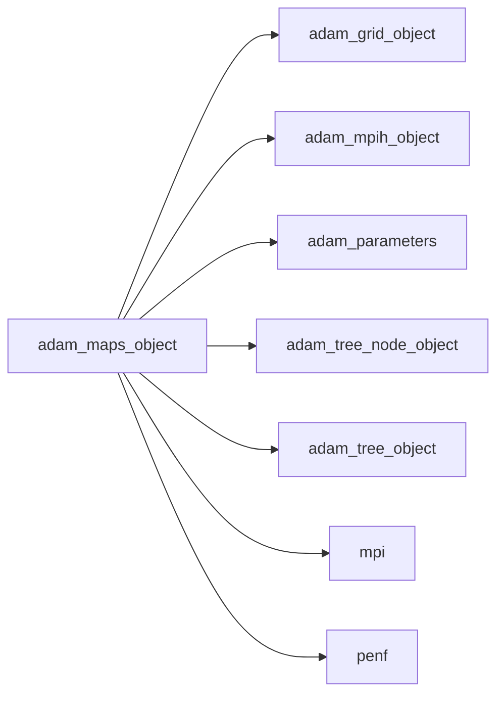

## Contents

- [maps_object](#maps-object)
- [blocks_reorder](#blocks-reorder)
- [initialize](#initialize)
- [make_comm_local_maps](#make-comm-local-maps)
- [make_comm_local_maps_ghost](#make-comm-local-maps-ghost)
- [mpi_gather_nodes_data](#mpi-gather-nodes-data)
- [save_local_map](#save-local-map)
- [make_local_maps_bc](#make-local-maps-bc)
- [alloc_comm_local_maps_ghost](#alloc-comm-local-maps-ghost)
- [count_bc_numbers](#count-bc-numbers)
- [make_comm_map_recv_ghost_cell](#make-comm-map-recv-ghost-cell)
- [make_comm_map_send_ghost_cell](#make-comm-map-send-ghost-cell)
- [make_local_map_ghost_cell](#make-local-map-ghost-cell)
- [populate_comm_local_maps_ghost](#populate-comm-local-maps-ghost)
- [populate_local_map_bc_crown](#populate-local-map-bc-crown)
- [set_local_map_bc](#set-local-map-bc)
- [ijk_mmd](#ijk-mmd)
- [ijk_mmd_ghost](#ijk-mmd-ghost)
- [bc_cells_number](#bc-cells-number)

## Derived Types

### maps_object

Maps class definition

#### Components

| Name | Type | Attributes | Description |
|------|------|------------|-------------|
| `mpih` | type([mpih_object](/api/src/lib/common/adam_mpih_object#mpih-object)) |  | MPI handler. |
| `grid` | type([grid_object](/api/src/lib/common/adam_grid_object#grid-object)) | pointer | Grid data. |
| `tree` | type([tree_object](/api/src/lib/common/adam_tree_object#tree-object)) | pointer | Tree data. |
| `local_map` | integer(kind=[I8P](/api/src/third_party/PENF/src/lib/penf_global_parameters_variables)) | allocatable | Local map, list block index changes of my nodes. |
| `local_map_ghost` | integer(kind=[I8P](/api/src/third_party/PENF/src/lib/penf_global_parameters_variables)) | allocatable | Local map for ghost cells updating [fec_number, 4]. |
| `local_map_ghost_cell` | integer(kind=[I8P](/api/src/third_party/PENF/src/lib/penf_global_parameters_variables)) | allocatable | Local map ghost cells update, cells order. |
| `local_map_bc_face` | integer(kind=[I8P](/api/src/third_party/PENF/src/lib/penf_global_parameters_variables)) | allocatable | Local map for face BC ghost cells. |
| `local_map_bc_edge` | integer(kind=[I8P](/api/src/third_party/PENF/src/lib/penf_global_parameters_variables)) | allocatable | Local map for edge BC ghost cells. |
| `local_map_bc_corner` | integer(kind=[I8P](/api/src/third_party/PENF/src/lib/penf_global_parameters_variables)) | allocatable | Local map for corner BC ghost cells. |
| `local_map_bc_crown` | integer(kind=[I8P](/api/src/third_party/PENF/src/lib/penf_global_parameters_variables)) | allocatable | Local map for face BC ghost cells, crown order. |
| `my_nodes_number` | integer(kind=[I4P](/api/src/third_party/PENF/src/lib/penf_global_parameters_variables)) |  | Number of my nodes, keep_nodes_number + recv_nodes_number. |
| `send_nodes_number` | integer(kind=[I4P](/api/src/third_party/PENF/src/lib/penf_global_parameters_variables)) |  | Number of nodes to be sent. |
| `recv_nodes_number` | integer(kind=[I4P](/api/src/third_party/PENF/src/lib/penf_global_parameters_variables)) |  | Number of nodes to be received. |
| `keep_nodes_number` | integer(kind=[I4P](/api/src/third_party/PENF/src/lib/penf_global_parameters_variables)) |  | Number of nodes to be keept. |
| `inner_blocks_number` | integer(kind=[I4P](/api/src/third_party/PENF/src/lib/penf_global_parameters_variables)) |  | Number of inner blocks where I need fecs. |
| `inner_outer_block_map` | integer(kind=[I4P](/api/src/third_party/PENF/src/lib/penf_global_parameters_variables)) | allocatable | Inner/outer blocks map. |
| `comm_map_n_send` | integer(kind=[I4P](/api/src/third_party/PENF/src/lib/penf_global_parameters_variables)) | allocatable | Communication map, number of blocks to send [procs_number]. |
| `comm_map_n_recv` | integer(kind=[I4P](/api/src/third_party/PENF/src/lib/penf_global_parameters_variables)) | allocatable | Communication map, number of blocks to recv [procs_number]. |
| `comm_map_send_ptr` | integer(kind=[I4P](/api/src/third_party/PENF/src/lib/penf_global_parameters_variables)) | allocatable | Communication map, pointers in list to send [procs_number+1]. |
| `comm_map_recv_ptr` | integer(kind=[I4P](/api/src/third_party/PENF/src/lib/penf_global_parameters_variables)) | allocatable | Communication map, pointers in list to recv [procs_number+1]. |
| `comm_map_send` | integer(kind=[I8P](/api/src/third_party/PENF/src/lib/penf_global_parameters_variables)) | allocatable | Communication map, blocks to send [sum(comm_map_n_send)]. |
| `comm_map_recv` | integer(kind=[I8P](/api/src/third_party/PENF/src/lib/penf_global_parameters_variables)) | allocatable | Communication map, blocks to receive [sum(comm_map_n_recv)]. |
| `comm_map_n_send_ghost` | integer(kind=[I4P](/api/src/third_party/PENF/src/lib/penf_global_parameters_variables)) | allocatable | Communication map, number of ghost celss to send [procs_number]. |
| `comm_map_n_recv_ghost` | integer(kind=[I4P](/api/src/third_party/PENF/src/lib/penf_global_parameters_variables)) | allocatable | Communication map, number of ghost celss to recv [procs_number]. |
| `comm_map_send_ptr_ghost` | integer(kind=[I4P](/api/src/third_party/PENF/src/lib/penf_global_parameters_variables)) | allocatable | Communication map, pointers in list to send [procs_number+1]. |
| `comm_map_recv_ptr_ghost` | integer(kind=[I4P](/api/src/third_party/PENF/src/lib/penf_global_parameters_variables)) | allocatable | Communication map, pointers in list to recv [procs_number+1]. |
| `comm_map_send_ghost` | integer(kind=[I8P](/api/src/third_party/PENF/src/lib/penf_global_parameters_variables)) | allocatable | Communication map, send ghost cells, fec order. |
| `comm_map_send_ghost_cell` | integer(kind=[I8P](/api/src/third_party/PENF/src/lib/penf_global_parameters_variables)) | allocatable | Communication map, send ghost cells, cells order. |
| `comm_map_recv_ghost` | integer(kind=[I8P](/api/src/third_party/PENF/src/lib/penf_global_parameters_variables)) | allocatable | Communication map, recv ghost cells, fec order. |
| `comm_map_recv_ghost_cell` | integer(kind=[I8P](/api/src/third_party/PENF/src/lib/penf_global_parameters_variables)) | allocatable | Communication map, recv ghost cells, cells order. |
| `send_buffer_ghost` | real(kind=[R8P](/api/src/third_party/PENF/src/lib/penf_global_parameters_variables)) | allocatable | Send buffer of ghost cells. |
| `recv_buffer_ghost` | real(kind=[R8P](/api/src/third_party/PENF/src/lib/penf_global_parameters_variables)) | allocatable | Receive buffer of ghost cells. |

#### Type-Bound Procedures

| Name | Attributes | Description |
|------|------------|-------------|
| `blocks_reorder` | pass(self) | Reorder blocks indexes in field. |
| `initialize` | pass(self) | Initialize maps. |
| `make_comm_local_maps` | pass(self) | Make communication/local maps. |
| `make_comm_local_maps_ghost` | pass(self) | Make communication/local maps of ghost cells. |
| `make_local_maps_bc` | pass(self) | Make local maps of boundary conditions. |
| `mpi_gather_nodes_data` | pass(self) | Gather nodes data between MPI processes. |
| `save_local_map` | pass(self) | Save local map. |
| `alloc_comm_local_maps_ghost` | pass(self) | Allocate communication/local maps of ghost cells. |
| `count_bc_numbers` | pass(self) | Count BC numbers. |
| `ijk_mmd` | pass(self) | Return IJK min/max/delta. |
| `ijk_mmd_ghost` | pass(self) | Return IJK min/max/delta, ghost maps. |
| `make_comm_map_recv_ghost_cell` | pass(self) | Make communication recv map of ghost cells in cell order. |
| `make_comm_map_send_ghost_cell` | pass(self) | Make communication send map of ghost cells in cell order. |
| `make_local_map_ghost_cell` | pass(self) | Make local map of ghost cells in cell order. |
| `populate_comm_local_maps_ghost` | pass(self) | Populate communication/local maps of ghost cells. |

## Subroutines

### blocks_reorder

Reorder blocks indexes in field.

```fortran
subroutine blocks_reorder(self)
```

**Arguments**

| Name | Type | Intent | Attributes | Description |
|------|------|--------|------------|-------------|
| `self` | class([maps_object](/api/src/lib/common/adam_maps_object#maps-object)) | inout |  | The maps. |

**Call graph**

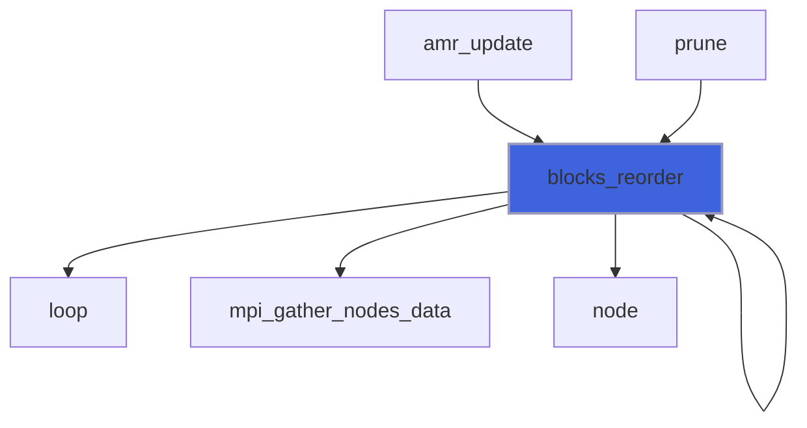

### initialize

Initialize maps.

```fortran
subroutine initialize(self, grid, tree)
```

**Arguments**

| Name | Type | Intent | Attributes | Description |
|------|------|--------|------------|-------------|
| `self` | class([maps_object](/api/src/lib/common/adam_maps_object#maps-object)) | inout |  | The maps. |
| `grid` | type([grid_object](/api/src/lib/common/adam_grid_object#grid-object)) | in | target | The grid. |
| `tree` | type([tree_object](/api/src/lib/common/adam_tree_object#tree-object)) | in | target | The tree. |

**Call graph**

```mermaid
flowchart TD
  add_node["add_node"] --> initialize["initialize"]
  analize["analize"] --> initialize["initialize"]
  build_connectivity["build_connectivity"] --> initialize["initialize"]
  distribute_facets["distribute_facets"] --> initialize["initialize"]
  distribute_facets_tree["distribute_facets_tree"] --> initialize["initialize"]
  export_vtk_file["export_vtk_file"] --> initialize["initialize"]
  initialize["initialize"] --> initialize["initialize"]
  initialize["initialize"] --> initialize["initialize"]
  initialize["initialize"] --> initialize["initialize"]
  initialize["initialize"] --> initialize["initialize"]
  initialize["initialize"] --> initialize["initialize"]
  initialize["initialize"] --> initialize["initialize"]
  initialize["initialize"] --> initialize["initialize"]
  initialize["initialize"] --> initialize["initialize"]
  initialize["initialize"] --> initialize["initialize"]
  initialize["initialize"] --> initialize["initialize"]
  initialize["initialize"] --> initialize["initialize"]
  initialize["initialize"] --> initialize["initialize"]
  initialize["initialize"] --> initialize["initialize"]
  initialize["initialize"] --> initialize["initialize"]
  initialize["initialize"] --> initialize["initialize"]
  initialize["initialize"] --> initialize["initialize"]
  initialize["initialize"] --> initialize["initialize"]
  initialize["initialize"] --> initialize["initialize"]
  initialize["initialize"] --> initialize["initialize"]
  initialize["initialize"] --> initialize["initialize"]
  initialize["initialize"] --> initialize["initialize"]
  initialize["initialize"] --> initialize["initialize"]
  initialize["initialize"] --> initialize["initialize"]
  initialize["initialize"] --> initialize["initialize"]
  initialize["initialize"] --> initialize["initialize"]
  initialize["initialize"] --> initialize["initialize"]
  initialize["initialize"] --> initialize["initialize"]
  initialize["initialize"] --> initialize["initialize"]
  initialize["initialize"] --> initialize["initialize"]
  initialize["initialize"] --> initialize["initialize"]
  initialize["initialize"] --> initialize["initialize"]
  initialize["initialize"] --> initialize["initialize"]
  initialize["initialize"] --> initialize["initialize"]
  initialize["initialize"] --> initialize["initialize"]
  initialize["initialize"] --> initialize["initialize"]
  initialize["initialize"] --> initialize["initialize"]
  initialize["initialize"] --> initialize["initialize"]
  initialize["initialize"] --> initialize["initialize"]
  initialize["initialize"] --> initialize["initialize"]
  initialize["initialize"] --> initialize["initialize"]
  initialize["initialize"] --> initialize["initialize"]
  initialize["initialize"] --> initialize["initialize"]
  initialize["initialize"] --> initialize["initialize"]
  initialize["initialize"] --> initialize["initialize"]
  initialize["initialize"] --> initialize["initialize"]
  initialize["initialize"] --> initialize["initialize"]
  initialize["initialize"] --> initialize["initialize"]
  initialize["initialize"] --> initialize["initialize"]
  initialize["initialize"] --> initialize["initialize"]
  initialize["initialize"] --> initialize["initialize"]
  initialize["initialize"] --> initialize["initialize"]
  initialize["initialize"] --> initialize["initialize"]
  initialize["initialize"] --> initialize["initialize"]
  initialize["initialize"] --> initialize["initialize"]
  initialize["initialize"] --> initialize["initialize"]
  initialize["initialize"] --> initialize["initialize"]
  initialize["initialize"] --> initialize["initialize"]
  initialize["initialize"] --> initialize["initialize"]
  initialize["initialize"] --> initialize["initialize"]
  initialize["initialize"] --> initialize["initialize"]
  initialize["initialize"] --> initialize["initialize"]
  initialize["initialize"] --> initialize["initialize"]
  initialize["initialize"] --> initialize["initialize"]
  initialize["initialize"] --> initialize["initialize"]
  initialize["initialize"] --> initialize["initialize"]
  initialize["initialize"] --> initialize["initialize"]
  initialize["initialize"] --> initialize["initialize"]
  initialize["initialize"] --> initialize["initialize"]
  initialize["initialize"] --> initialize["initialize"]
  initialize["initialize"] --> initialize["initialize"]
  initialize["initialize"] --> initialize["initialize"]
  initialize["initialize"] --> initialize["initialize"]
  initialize_common["initialize_common"] --> initialize["initialize"]
  initialize_common["initialize_common"] --> initialize["initialize"]
  initialize_common["initialize_common"] --> initialize["initialize"]
  initialize_common["initialize_common"] --> initialize["initialize"]
  load_from_file["load_from_file"] --> initialize["initialize"]
  load_from_file["load_from_file"] --> initialize["initialize"]
  open_file["open_file"] --> initialize["initialize"]
  open_file["open_file"] --> initialize["initialize"]
  open_file["open_file"] --> initialize["initialize"]
  resize["resize"] --> initialize["initialize"]
  save_into_file["save_into_file"] --> initialize["initialize"]
  save_vtk["save_vtk"] --> initialize["initialize"]
  simulate["simulate"] --> initialize["initialize"]
  simulate["simulate"] --> initialize["initialize"]
  simulate["simulate"] --> initialize["initialize"]
  simulate["simulate"] --> initialize["initialize"]
  simulate["simulate"] --> initialize["initialize"]
  simulate["simulate"] --> initialize["initialize"]
  simulate["simulate"] --> initialize["initialize"]
  test_stress["test_stress"] --> initialize["initialize"]
  initialize["initialize"] --> initialize["initialize"]
  initialize["initialize"] --> print_message["print_message"]
  style initialize fill:#3e63dd,stroke:#99b,stroke-width:2px
```

### make_comm_local_maps

Make communication/local maps.
```
   comm_map_send     = [ 17, 511, 92, 3, 54, 56, 11, 12...] (block index).
                          |   |       |  ||       |
   comm_map_send_ptr = [  0,  1,  3,  4,  4, 6, (8)]        (pointer to comm_map_send)
   comm_map_recv     = [ 23, 4, 51, 69, 145, 2, 72, 16, 6]  (block index).
                         |       |  ||          |       |
   comm_map_recv_prt = [ 0,  2,  3,  3,  6, 8, (9)]         (pointer to comm_map_recv)
```

```fortran
subroutine make_comm_local_maps(self)
```

**Arguments**

| Name | Type | Intent | Attributes | Description |
|------|------|--------|------------|-------------|
| `self` | class([maps_object](/api/src/lib/common/adam_maps_object#maps-object)) | inout |  | The maps. |

**Call graph**

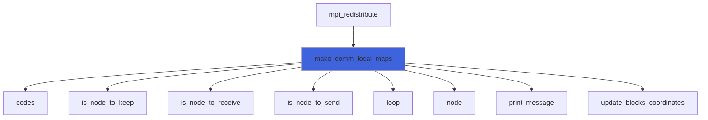

### make_comm_local_maps_ghost

Make communication/local maps of ghost cells.

```fortran
subroutine make_comm_local_maps_ghost(self, nv)
```

**Arguments**

| Name | Type | Intent | Attributes | Description |
|------|------|--------|------------|-------------|
| `self` | class([maps_object](/api/src/lib/common/adam_maps_object#maps-object)) | inout |  | The maps. |
| `nv` | integer(kind=[I4P](/api/src/third_party/PENF/src/lib/penf_global_parameters_variables)) | in |  | Number of field variables. |

**Call graph**

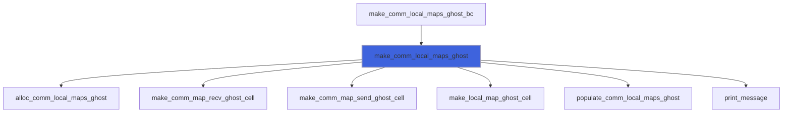

### mpi_gather_nodes_data

Gather nodes data status between MPI processes.

```fortran
subroutine mpi_gather_nodes_data(self, node_member)
```

**Arguments**

| Name | Type | Intent | Attributes | Description |
|------|------|--------|------------|-------------|
| `self` | class([maps_object](/api/src/lib/common/adam_maps_object#maps-object)) | inout |  | The maps. |
| `node_member` | character(len=*) | in |  | Node member to be shared. |

**Call graph**

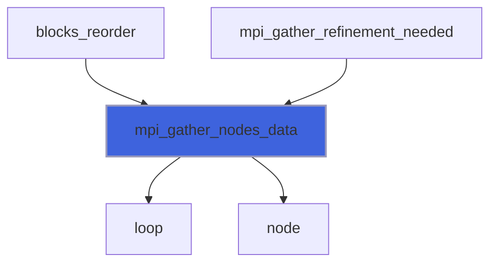

### save_local_map

Save local map.

```fortran
subroutine save_local_map(self, file_name)
```

**Arguments**

| Name | Type | Intent | Attributes | Description |
|------|------|--------|------------|-------------|
| `self` | class([maps_object](/api/src/lib/common/adam_maps_object#maps-object)) | in |  | The maps. |
| `file_name` | character(len=*) | in |  | Output file name. |

### make_local_maps_bc

Make local maps of boundary conditions.

```fortran
subroutine make_local_maps_bc(self, verbose)
```

**Arguments**

| Name | Type | Intent | Attributes | Description |
|------|------|--------|------------|-------------|
| `self` | class([maps_object](/api/src/lib/common/adam_maps_object#maps-object)) | inout |  | The maps. |
| `verbose` | logical | in | optional | Flag to activate verbose mode. |

**Call graph**

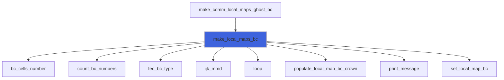

### alloc_comm_local_maps_ghost

Allocate communication/local maps of ghost cells, `local_map_ghost, comm_map_send_ghost, comm_map_recv_ghost`.

```fortran
subroutine alloc_comm_local_maps_ghost(self, nv)
```

**Arguments**

| Name | Type | Intent | Attributes | Description |
|------|------|--------|------------|-------------|
| `self` | class([maps_object](/api/src/lib/common/adam_maps_object#maps-object)) | inout |  | The maps. |
| `nv` | integer(kind=[I4P](/api/src/third_party/PENF/src/lib/penf_global_parameters_variables)) | in |  | Number of field variables. |

**Call graph**

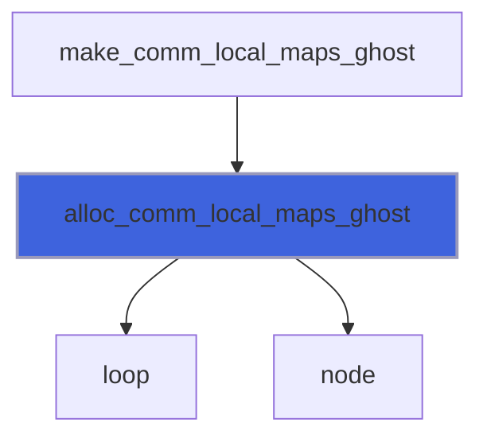

### count_bc_numbers

Count faces/edges/corners BC numbers.

```fortran
subroutine count_bc_numbers(self, fec_bc_faces_number, fec_bc_edges_number, fec_bc_corners_number)
```

**Arguments**

| Name | Type | Intent | Attributes | Description |
|------|------|--------|------------|-------------|
| `self` | class([maps_object](/api/src/lib/common/adam_maps_object#maps-object)) | inout |  | The maps. |
| `fec_bc_faces_number` | integer(kind=[I4P](/api/src/third_party/PENF/src/lib/penf_global_parameters_variables)) | out |  | BC faces number. |
| `fec_bc_edges_number` | integer(kind=[I4P](/api/src/third_party/PENF/src/lib/penf_global_parameters_variables)) | out |  | BC edges number. |
| `fec_bc_corners_number` | integer(kind=[I4P](/api/src/third_party/PENF/src/lib/penf_global_parameters_variables)) | out |  | BC corners number. |

**Call graph**

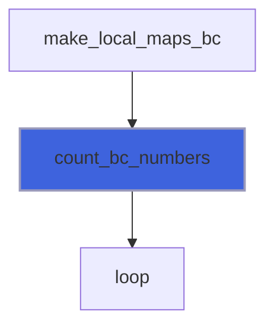

### make_comm_map_recv_ghost_cell

Make communication receive map of ghost cells in cell order.

```fortran
subroutine make_comm_map_recv_ghost_cell(self, nv)
```

**Arguments**

| Name | Type | Intent | Attributes | Description |
|------|------|--------|------------|-------------|
| `self` | class([maps_object](/api/src/lib/common/adam_maps_object#maps-object)) | inout |  | The maps. |
| `nv` | integer(kind=[I4P](/api/src/third_party/PENF/src/lib/penf_global_parameters_variables)) | in |  | Number of field variables. |

**Call graph**


### make_comm_map_send_ghost_cell

Make communication send map of ghost cells in cell order.

```fortran
subroutine make_comm_map_send_ghost_cell(self, nv)
```

**Arguments**

| Name | Type | Intent | Attributes | Description |
|------|------|--------|------------|-------------|
| `self` | class([maps_object](/api/src/lib/common/adam_maps_object#maps-object)) | inout |  | The maps. |
| `nv` | integer(kind=[I4P](/api/src/third_party/PENF/src/lib/penf_global_parameters_variables)) | in |  | Number of field variables. |

**Call graph**

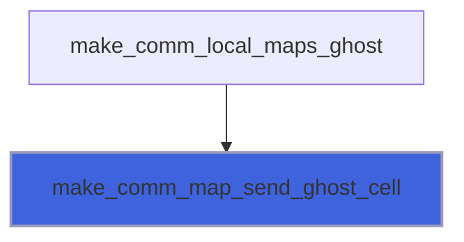

### make_local_map_ghost_cell

Make local map of ghost cells in cell order.

```fortran
subroutine make_local_map_ghost_cell(self)
```

**Arguments**

| Name | Type | Intent | Attributes | Description |
|------|------|--------|------------|-------------|
| `self` | class([maps_object](/api/src/lib/common/adam_maps_object#maps-object)) | inout |  | The maps. |

**Call graph**

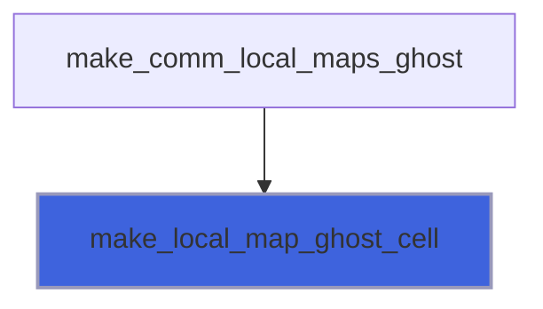

### populate_comm_local_maps_ghost

Populate communication/local maps of ghost cells, `local_map_ghost, comm_map_send_ghost, comm_map_recv_ghost`.

```fortran
subroutine populate_comm_local_maps_ghost(self)
```

**Arguments**

| Name | Type | Intent | Attributes | Description |
|------|------|--------|------------|-------------|
| `self` | class([maps_object](/api/src/lib/common/adam_maps_object#maps-object)) | inout |  | The maps. |

**Call graph**

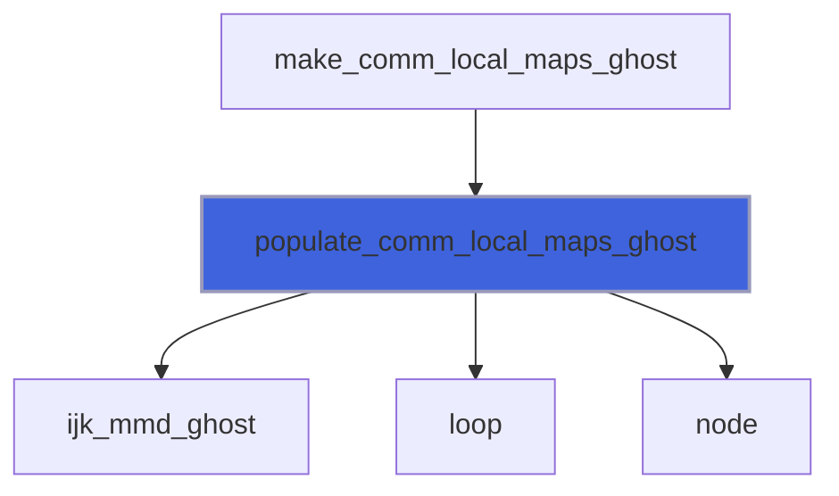

### populate_local_map_bc_crown

Populate map of BC cells in crown order.

```fortran
subroutine populate_local_map_bc_crown(local_map_bc, local_map_bc_crown, c_crown)
```

**Arguments**

| Name | Type | Intent | Attributes | Description |
|------|------|--------|------------|-------------|
| `local_map_bc` | integer(kind=[I8P](/api/src/third_party/PENF/src/lib/penf_global_parameters_variables)) | in |  | Local map for BC ghost cells. |
| `local_map_bc_crown` | integer(kind=[I8P](/api/src/third_party/PENF/src/lib/penf_global_parameters_variables)) | inout |  | Local map for face BC ghost cells, crown order. |
| `c_crown` | integer(kind=[I4P](/api/src/third_party/PENF/src/lib/penf_global_parameters_variables)) | inout |  | Counter. |

**Call graph**

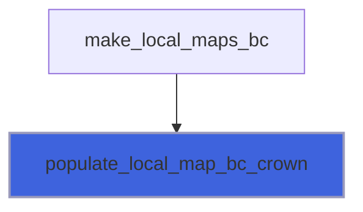

### set_local_map_bc

Set data into faces/edges/corners local map BC.

```fortran
subroutine set_local_map_bc(fec, block_index, neighbor_bc_fec, ijk_min_max_delta, fec_bc_type, local_map_bc)
```

**Arguments**

| Name | Type | Intent | Attributes | Description |
|------|------|--------|------------|-------------|
| `fec` | integer(kind=[I4P](/api/src/third_party/PENF/src/lib/penf_global_parameters_variables)) | in |  | Current fec. |
| `block_index` | integer(kind=[I8P](/api/src/third_party/PENF/src/lib/penf_global_parameters_variables)) | in |  | Block index in field blocks array. |
| `neighbor_bc_fec` | integer(kind=[I8P](/api/src/third_party/PENF/src/lib/penf_global_parameters_variables)) | in |  | Neighbors fec for BC. |
| `ijk_min_max_delta` | integer(kind=[I8P](/api/src/third_party/PENF/src/lib/penf_global_parameters_variables)) | in |  | IJK min/max/delta. |
| `fec_bc_type` | integer(kind=[I8P](/api/src/third_party/PENF/src/lib/penf_global_parameters_variables)) | in |  | BC type. |
| `local_map_bc` | integer(kind=[I8P](/api/src/third_party/PENF/src/lib/penf_global_parameters_variables)) | inout |  | Local map BC data. |

**Call graph**

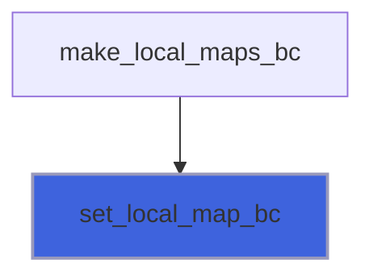

## Functions

### ijk_mmd

Return IJK min/max/delta.

**Returns**: integer(kind=[I8P](/api/src/third_party/PENF/src/lib/penf_global_parameters_variables))

```fortran
function ijk_mmd(self, fec, neighbor_bc_fec) result(ijk_min_max_delta)
```

**Arguments**

| Name | Type | Intent | Attributes | Description |
|------|------|--------|------------|-------------|
| `self` | class([maps_object](/api/src/lib/common/adam_maps_object#maps-object)) | in |  | The maps. |
| `fec` | integer(kind=[I4P](/api/src/third_party/PENF/src/lib/penf_global_parameters_variables)) | in |  | Current fec number. |
| `neighbor_bc_fec` | integer(kind=[I4P](/api/src/third_party/PENF/src/lib/penf_global_parameters_variables)) | in |  | Neighbors fec for BC. |

**Call graph**

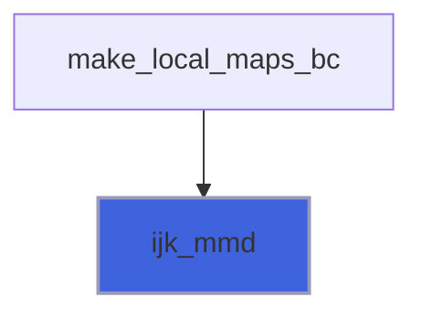

### ijk_mmd_ghost

Return IJK min/max/delta, ghost maps.

**Returns**: integer(kind=[I8P](/api/src/third_party/PENF/src/lib/penf_global_parameters_variables))

```fortran
function ijk_mmd_ghost(self, fec, portion) result(ijk_min_max_delta)
```

**Arguments**

| Name | Type | Intent | Attributes | Description |
|------|------|--------|------------|-------------|
| `self` | class([maps_object](/api/src/lib/common/adam_maps_object#maps-object)) | in |  | The maps. |
| `fec` | integer(kind=[I4P](/api/src/third_party/PENF/src/lib/penf_global_parameters_variables)) | in |  | Current fec number. |
| `portion` | integer(kind=[I8P](/api/src/third_party/PENF/src/lib/penf_global_parameters_variables)) | in |  | Current portion. |

**Call graph**

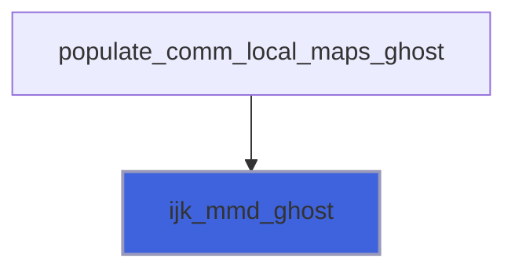

### bc_cells_number

Return BC cells number.

**Returns**: integer(kind=[I4P](/api/src/third_party/PENF/src/lib/penf_global_parameters_variables))

```fortran
function bc_cells_number(local_map_bc) result(cells_number)
```

**Arguments**

| Name | Type | Intent | Attributes | Description |
|------|------|--------|------------|-------------|
| `local_map_bc` | integer(kind=[I8P](/api/src/third_party/PENF/src/lib/penf_global_parameters_variables)) | in |  | Local map for BC ghost cells. |

**Call graph**

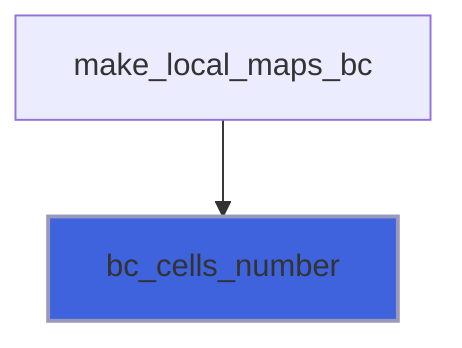
