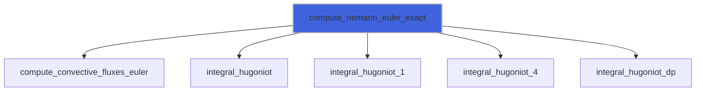
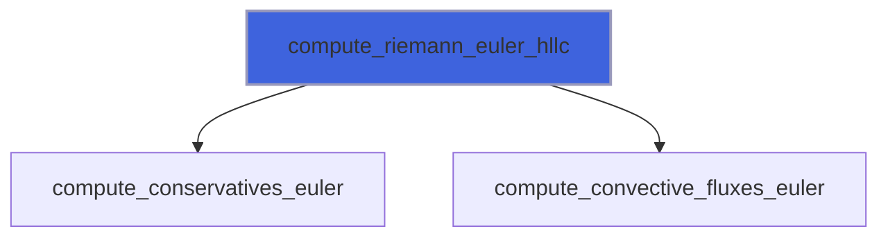
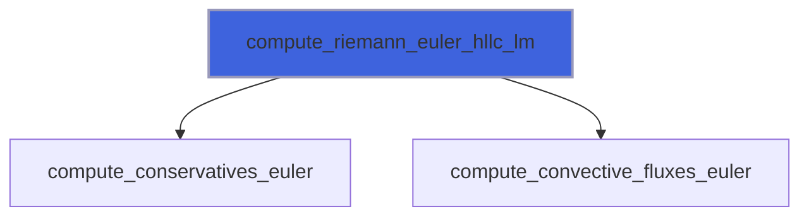
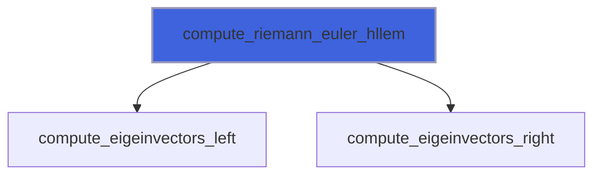
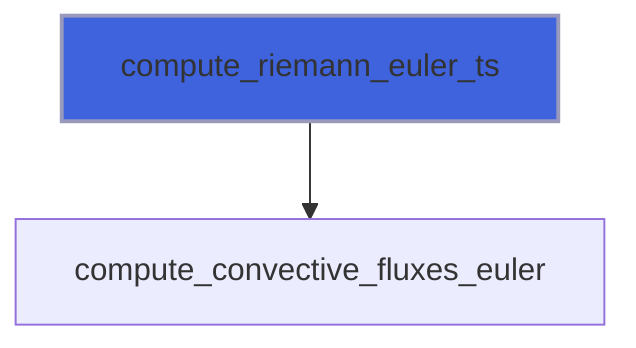
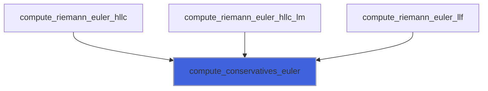
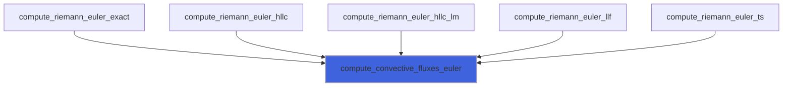
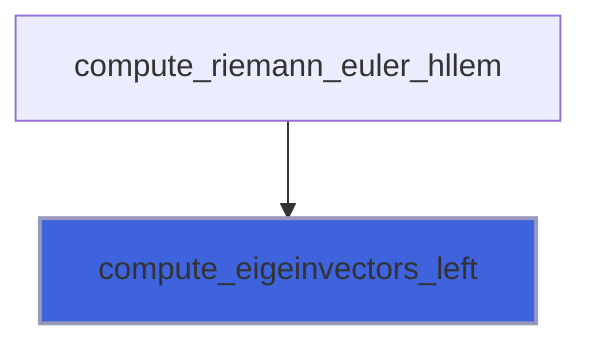
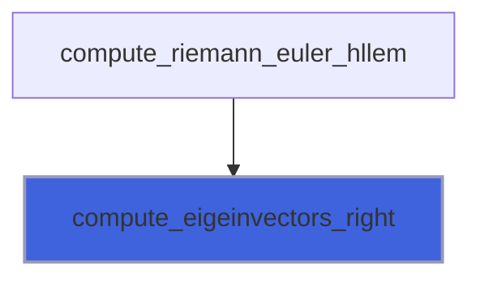

# adam_riemann_euler_library

> ADAM, Riemann Problem for Euler equations solvers and convective fluxes computations library.

**Source**: `src/lib/common/adam_riemann_euler_library.F90`

**Dependencies**


## Contents

- [compute_riemann_euler_exact](#compute-riemann-euler-exact)
- [compute_riemann_euler_hllc](#compute-riemann-euler-hllc)
- [compute_riemann_euler_hllc_lm](#compute-riemann-euler-hllc-lm)
- [compute_riemann_euler_hllem](#compute-riemann-euler-hllem)
- [compute_riemann_euler_llf](#compute-riemann-euler-llf)
- [compute_riemann_euler_ts](#compute-riemann-euler-ts)
- [compute_conservatives_euler](#compute-conservatives-euler)
- [compute_convective_fluxes_euler](#compute-convective-fluxes-euler)
- [compute_eigeinvectors_left](#compute-eigeinvectors-left)
- [compute_eigeinvectors_right](#compute-eigeinvectors-right)

## Subroutines

### compute_riemann_euler_exact

Solve the Riemann problem between the state 1 (left) and 4 (right) using exact Integral/Rainkine-Hugonoit relations.

```fortran
subroutine compute_riemann_euler_exact(si, sir, uni, ut1, ut2, nv, q_aux1, q_aux4, f, lmax)
```

**Arguments**

| Name | Type | Intent | Attributes | Description |
|------|------|--------|------------|-------------|
| `si` | integer(kind=[I4P](/api/src/third_party/PENF/src/lib/penf_global_parameters_variables)) | in |  | Directional (1=x,2=y,3=z) increment. |
| `sir` | real(kind=[R8P](/api/src/third_party/PENF/src/lib/penf_global_parameters_variables)) | in |  | Directional (1=x,2=y,3=z) increment. |
| `uni` | integer(kind=[I4P](/api/src/third_party/PENF/src/lib/penf_global_parameters_variables)) | in |  | Index of normal and tangential velocities. |
| `ut1` | integer(kind=[I4P](/api/src/third_party/PENF/src/lib/penf_global_parameters_variables)) | in |  | Index of normal and tangential velocities. |
| `ut2` | integer(kind=[I4P](/api/src/third_party/PENF/src/lib/penf_global_parameters_variables)) | in |  | Index of normal and tangential velocities. |
| `nv` | integer(kind=[I4P](/api/src/third_party/PENF/src/lib/penf_global_parameters_variables)) | in |  | Number of conservative varibales. |
| `q_aux1` | real(kind=[R8P](/api/src/third_party/PENF/src/lib/penf_global_parameters_variables)) | in |  | Left state, auxiliary variables. |
| `q_aux4` | real(kind=[R8P](/api/src/third_party/PENF/src/lib/penf_global_parameters_variables)) | in |  | Left state, auxiliary variables. |
| `f` | real(kind=[R8P](/api/src/third_party/PENF/src/lib/penf_global_parameters_variables)) | inout |  | Resulting fluxes. |
| `lmax` | real(kind=[R8P](/api/src/third_party/PENF/src/lib/penf_global_parameters_variables)) | out | optional | Maximum wave speed estimation. |

**Call graph**



### compute_riemann_euler_hllc

Solve the Riemann problem between the state 1 (left) and 4 (right) using the HLLC solver.

```fortran
subroutine compute_riemann_euler_hllc(si, sir, uni, ut1, ut2, nv, q_aux1, q_aux4, f, lmax)
```

**Arguments**

| Name | Type | Intent | Attributes | Description |
|------|------|--------|------------|-------------|
| `si` | integer(kind=[I4P](/api/src/third_party/PENF/src/lib/penf_global_parameters_variables)) | in |  | Directional (1=x,2=y,3=z) increment. |
| `sir` | real(kind=[R8P](/api/src/third_party/PENF/src/lib/penf_global_parameters_variables)) | in |  | Directional (1=x,2=y,3=z) increment. |
| `uni` | integer(kind=[I4P](/api/src/third_party/PENF/src/lib/penf_global_parameters_variables)) | in |  | Index of normal and tangential velocities. |
| `ut1` | integer(kind=[I4P](/api/src/third_party/PENF/src/lib/penf_global_parameters_variables)) | in |  | Index of normal and tangential velocities. |
| `ut2` | integer(kind=[I4P](/api/src/third_party/PENF/src/lib/penf_global_parameters_variables)) | in |  | Index of normal and tangential velocities. |
| `nv` | integer(kind=[I4P](/api/src/third_party/PENF/src/lib/penf_global_parameters_variables)) | in |  | Number of conservative varibales. |
| `q_aux1` | real(kind=[R8P](/api/src/third_party/PENF/src/lib/penf_global_parameters_variables)) | in |  | Left state, auxiliary variables. |
| `q_aux4` | real(kind=[R8P](/api/src/third_party/PENF/src/lib/penf_global_parameters_variables)) | in |  | Left state, auxiliary variables. |
| `f` | real(kind=[R8P](/api/src/third_party/PENF/src/lib/penf_global_parameters_variables)) | inout |  | Resulting fluxes. |
| `lmax` | real(kind=[R8P](/api/src/third_party/PENF/src/lib/penf_global_parameters_variables)) | out | optional | Maximum wave speed estimation. |

**Call graph**



### compute_riemann_euler_hllc_lm

Solve the Riemann problem between the state 1 (left) and 4 (right) using the HLLC-LM solver.
 The algorithm is based on the Low Mach (LM) modification, see "A shock-stable modification of the HLLC Riemann solver with
 reduced numerical dissipation", Nico Fleischmann, Stefan Adami, Nikolaus A. Adams, 2020.

```fortran
subroutine compute_riemann_euler_hllc_lm(si, sir, uni, ut1, ut2, nv, q_aux1, q_aux4, f, lmax)
```

**Arguments**

| Name | Type | Intent | Attributes | Description |
|------|------|--------|------------|-------------|
| `si` | integer(kind=[I4P](/api/src/third_party/PENF/src/lib/penf_global_parameters_variables)) | in |  | Directional (1=x,2=y,3=z) increment. |
| `sir` | real(kind=[R8P](/api/src/third_party/PENF/src/lib/penf_global_parameters_variables)) | in |  | Directional (1=x,2=y,3=z) increment. |
| `uni` | integer(kind=[I4P](/api/src/third_party/PENF/src/lib/penf_global_parameters_variables)) | in |  | Index of normal and tangential velocities. |
| `ut1` | integer(kind=[I4P](/api/src/third_party/PENF/src/lib/penf_global_parameters_variables)) | in |  | Index of normal and tangential velocities. |
| `ut2` | integer(kind=[I4P](/api/src/third_party/PENF/src/lib/penf_global_parameters_variables)) | in |  | Index of normal and tangential velocities. |
| `nv` | integer(kind=[I4P](/api/src/third_party/PENF/src/lib/penf_global_parameters_variables)) | in |  | Number of conservative varibales. |
| `q_aux1` | real(kind=[R8P](/api/src/third_party/PENF/src/lib/penf_global_parameters_variables)) | in |  | Left state, auxiliary variables. |
| `q_aux4` | real(kind=[R8P](/api/src/third_party/PENF/src/lib/penf_global_parameters_variables)) | in |  | Left state, auxiliary variables. |
| `f` | real(kind=[R8P](/api/src/third_party/PENF/src/lib/penf_global_parameters_variables)) | inout |  | Resulting fluxes. |
| `lmax` | real(kind=[R8P](/api/src/third_party/PENF/src/lib/penf_global_parameters_variables)) | out | optional | Maximum wave speed estimation. |

**Call graph**



### compute_riemann_euler_hllem

Solve the Riemann problem between the state 1 (left) and 4 (right) using the HLLEM solver.
 See Dumbser and Balsara "A new efficient formulation of the HLLEM Riemann solver for general conservative and non-conservative
 hyperbolic systems", 2016, Journal of Compuational Physics.

```fortran
subroutine compute_riemann_euler_hllem(si, sir, uni, ut1, ut2, nv, q_aux1, q_aux4, f, lmax)
```

**Arguments**

| Name | Type | Intent | Attributes | Description |
|------|------|--------|------------|-------------|
| `si` | integer(kind=[I4P](/api/src/third_party/PENF/src/lib/penf_global_parameters_variables)) | in |  | Directional (1=x,2=y,3=z) increment. |
| `sir` | real(kind=[R8P](/api/src/third_party/PENF/src/lib/penf_global_parameters_variables)) | in |  | Directional (1=x,2=y,3=z) increment. |
| `uni` | integer(kind=[I4P](/api/src/third_party/PENF/src/lib/penf_global_parameters_variables)) | in |  | Index of normal and tangential velocities. |
| `ut1` | integer(kind=[I4P](/api/src/third_party/PENF/src/lib/penf_global_parameters_variables)) | in |  | Index of normal and tangential velocities. |
| `ut2` | integer(kind=[I4P](/api/src/third_party/PENF/src/lib/penf_global_parameters_variables)) | in |  | Index of normal and tangential velocities. |
| `nv` | integer(kind=[I4P](/api/src/third_party/PENF/src/lib/penf_global_parameters_variables)) | in |  | Number of conservative varibales. |
| `q_aux1` | real(kind=[R8P](/api/src/third_party/PENF/src/lib/penf_global_parameters_variables)) | in |  | Left state, auxiliary variables. |
| `q_aux4` | real(kind=[R8P](/api/src/third_party/PENF/src/lib/penf_global_parameters_variables)) | in |  | Left state, auxiliary variables. |
| `f` | real(kind=[R8P](/api/src/third_party/PENF/src/lib/penf_global_parameters_variables)) | inout |  | Resulting fluxes. |
| `lmax` | real(kind=[R8P](/api/src/third_party/PENF/src/lib/penf_global_parameters_variables)) | out | optional | Maximum wave speed estimation. |

**Call graph**



### compute_riemann_euler_llf

Solve the Riemann problem between the state 1 (left) and 4 (right) using the Local-Lax-Friedrichs (LLF, Rusanov) solver.

```fortran
subroutine compute_riemann_euler_llf(si, sir, uni, ut1, ut2, nv, q_aux1, q_aux4, f, lmax)
```

**Arguments**

| Name | Type | Intent | Attributes | Description |
|------|------|--------|------------|-------------|
| `si` | integer(kind=[I4P](/api/src/third_party/PENF/src/lib/penf_global_parameters_variables)) | in |  | Directional (1=x,2=y,3=z) increment. |
| `sir` | real(kind=[R8P](/api/src/third_party/PENF/src/lib/penf_global_parameters_variables)) | in |  | Directional (1=x,2=y,3=z) increment. |
| `uni` | integer(kind=[I4P](/api/src/third_party/PENF/src/lib/penf_global_parameters_variables)) | in |  | Index of normal and tangential velocities. |
| `ut1` | integer(kind=[I4P](/api/src/third_party/PENF/src/lib/penf_global_parameters_variables)) | in |  | Index of normal and tangential velocities. |
| `ut2` | integer(kind=[I4P](/api/src/third_party/PENF/src/lib/penf_global_parameters_variables)) | in |  | Index of normal and tangential velocities. |
| `nv` | integer(kind=[I4P](/api/src/third_party/PENF/src/lib/penf_global_parameters_variables)) | in |  | Number of conservative varibales. |
| `q_aux1` | real(kind=[R8P](/api/src/third_party/PENF/src/lib/penf_global_parameters_variables)) | in |  | Left state, auxiliary variables. |
| `q_aux4` | real(kind=[R8P](/api/src/third_party/PENF/src/lib/penf_global_parameters_variables)) | in |  | Left state, auxiliary variables. |
| `f` | real(kind=[R8P](/api/src/third_party/PENF/src/lib/penf_global_parameters_variables)) | inout |  | Resulting fluxes. |
| `lmax` | real(kind=[R8P](/api/src/third_party/PENF/src/lib/penf_global_parameters_variables)) | out | optional | Maximum wave speed estimation. |

**Call graph**


### compute_riemann_euler_ts

Solve the Riemann problem between the state 1 (left) and 4 (right) using the Two-Shocks (TS) approximation.

```fortran
subroutine compute_riemann_euler_ts(si, sir, uni, ut1, ut2, nv, q_aux1, q_aux4, f, lmax)
```

**Arguments**

| Name | Type | Intent | Attributes | Description |
|------|------|--------|------------|-------------|
| `si` | integer(kind=[I4P](/api/src/third_party/PENF/src/lib/penf_global_parameters_variables)) | in |  | Directional (1=x,2=y,3=z) increment. |
| `sir` | real(kind=[R8P](/api/src/third_party/PENF/src/lib/penf_global_parameters_variables)) | in |  | Directional (1=x,2=y,3=z) increment. |
| `uni` | integer(kind=[I4P](/api/src/third_party/PENF/src/lib/penf_global_parameters_variables)) | in |  | Index of normal and tangential velocities. |
| `ut1` | integer(kind=[I4P](/api/src/third_party/PENF/src/lib/penf_global_parameters_variables)) | in |  | Index of normal and tangential velocities. |
| `ut2` | integer(kind=[I4P](/api/src/third_party/PENF/src/lib/penf_global_parameters_variables)) | in |  | Index of normal and tangential velocities. |
| `nv` | integer(kind=[I4P](/api/src/third_party/PENF/src/lib/penf_global_parameters_variables)) | in |  | Number of conservative varibales. |
| `q_aux1` | real(kind=[R8P](/api/src/third_party/PENF/src/lib/penf_global_parameters_variables)) | in |  | Left state, auxiliary variables. |
| `q_aux4` | real(kind=[R8P](/api/src/third_party/PENF/src/lib/penf_global_parameters_variables)) | in |  | Left state, auxiliary variables. |
| `f` | real(kind=[R8P](/api/src/third_party/PENF/src/lib/penf_global_parameters_variables)) | inout |  | Resulting fluxes. |
| `lmax` | real(kind=[R8P](/api/src/third_party/PENF/src/lib/penf_global_parameters_variables)) | out | optional | Maximum wave speed estimation. |

**Call graph**



### compute_conservatives_euler

Compute convervative variables from auxiliary ones.

**Attributes**: pure

```fortran
subroutine compute_conservatives_euler(q_aux, q)
```

**Arguments**

| Name | Type | Intent | Attributes | Description |
|------|------|--------|------------|-------------|
| `q_aux` | real(kind=[R8P](/api/src/third_party/PENF/src/lib/penf_global_parameters_variables)) | in |  | Auxiliary variables. |
| `q` | real(kind=[R8P](/api/src/third_party/PENF/src/lib/penf_global_parameters_variables)) | inout |  | Conservative varibales. |

**Call graph**



### compute_convective_fluxes_euler

Compute convective fluxes for Euler equations from auxiliary variables.

**Attributes**: pure

```fortran
subroutine compute_convective_fluxes_euler(sir, q_aux, f)
```

**Arguments**

| Name | Type | Intent | Attributes | Description |
|------|------|--------|------------|-------------|
| `sir` | real(kind=[R8P](/api/src/third_party/PENF/src/lib/penf_global_parameters_variables)) | in |  | Directional (1=x,2=y,3=z) increment. |
| `q_aux` | real(kind=[R8P](/api/src/third_party/PENF/src/lib/penf_global_parameters_variables)) | in |  | Auxiliary variables. |
| `f` | real(kind=[R8P](/api/src/third_party/PENF/src/lib/penf_global_parameters_variables)) | inout |  | Conservative fluxes. |

**Call graph**



### compute_eigeinvectors_left

Compute left eigenvectors matrix (L) of the Jacobian fluxes matrix $A=R \Lambda L$ in primitive variables form.
 @note This function consider only the normal direction:
 $\frac{\partial P}{\partial t} + R \Lambda L \frac{\partial P}{\partial n} = 0$ where P are the primitive variables and
 n is the normal direction. R is the matrix of the right eigenvectors, $\Lambda$ is the diagonal matrix of the eigenvalues
 and L is the matrix of the left eigenvectors.

**Attributes**: pure

```fortran
subroutine compute_eigeinvectors_left(gm1, u, a, el)
```

**Arguments**

| Name | Type | Intent | Attributes | Description |
|------|------|--------|------------|-------------|
| `gm1` | real(kind=[R8P](/api/src/third_party/PENF/src/lib/penf_global_parameters_variables)) | in |  | Specific heats ration minus one, g-1. |
| `u` | real(kind=[R8P](/api/src/third_party/PENF/src/lib/penf_global_parameters_variables)) | in |  | Normal velocity. |
| `a` | real(kind=[R8P](/api/src/third_party/PENF/src/lib/penf_global_parameters_variables)) | in |  | Speed of sound. |
| `el` | real(kind=[R8P](/api/src/third_party/PENF/src/lib/penf_global_parameters_variables)) | inout |  | Left eigenvectors matrix. |

**Call graph**



### compute_eigeinvectors_right

Compute right eigenvectors matrix (R) of the Jacobian fluxes matrix $A=R \Lambda L$ in primitive variables form.
 @note This function consider only the normal direction:
 $\frac{\partial P}{\partial t} + R \Lambda L \frac{\partial P}{\partial n} = 0$ where P are the primitive variables and
 n is the normal direction. R is the matrix of the right eigenvectors, $\Lambda$ is the diagonal matrix of the eigenvalues
 and L is the matrix of the left eigenvectors.

**Attributes**: pure

```fortran
subroutine compute_eigeinvectors_right(H, u, a, er)
```

**Arguments**

| Name | Type | Intent | Attributes | Description |
|------|------|--------|------------|-------------|
| `H` | real(kind=[R8P](/api/src/third_party/PENF/src/lib/penf_global_parameters_variables)) | in |  | Total specific entalpy. |
| `u` | real(kind=[R8P](/api/src/third_party/PENF/src/lib/penf_global_parameters_variables)) | in |  | Normal velocity. |
| `a` | real(kind=[R8P](/api/src/third_party/PENF/src/lib/penf_global_parameters_variables)) | in |  | Speed of sound. |
| `er` | real(kind=[R8P](/api/src/third_party/PENF/src/lib/penf_global_parameters_variables)) | inout |  | Right eigenvectors matrix. |

**Call graph**


