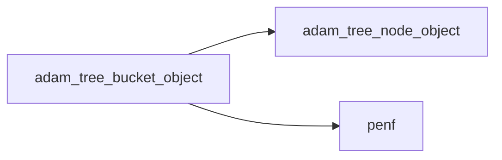
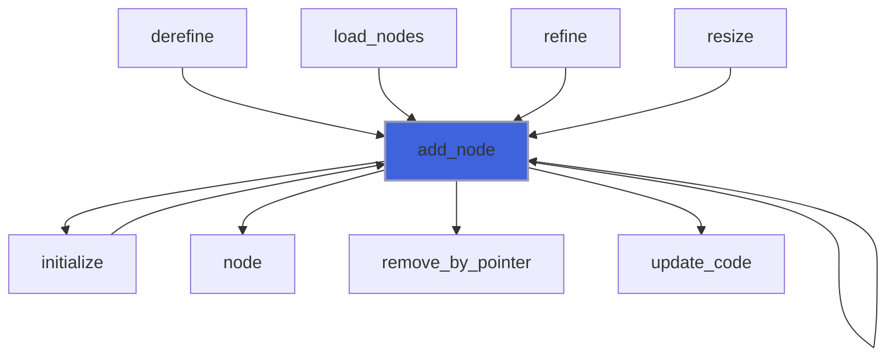
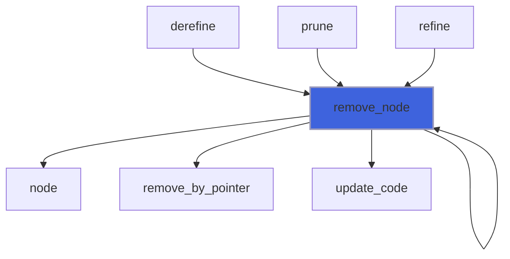
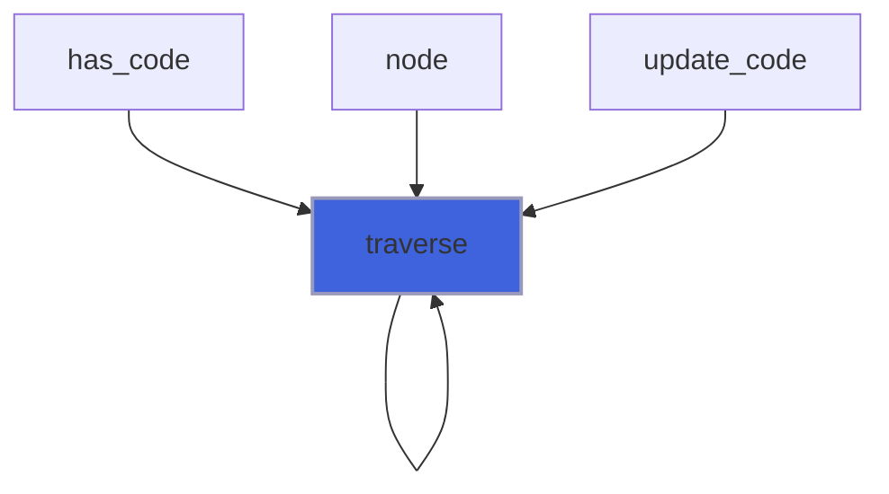
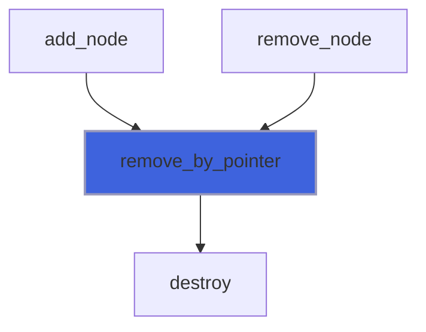
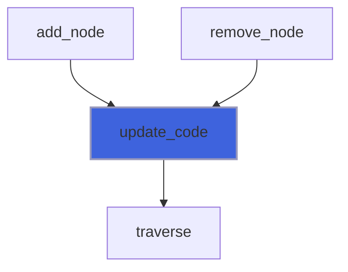
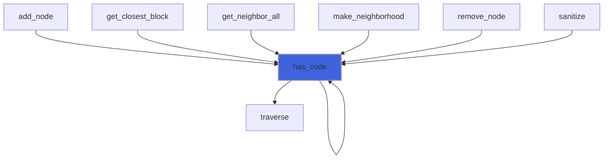

```mermaid
flowchart TD
  add_node["add_node"] --> node["node"]
  alloc_comm_local_maps_ghost["alloc_comm_local_maps_ghost"] --> node["node"]
  blocks_reorder["blocks_reorder"] --> node["node"]
  derefine["derefine"] --> node["node"]
  interpolate_at_point["interpolate_at_point"] --> node["node"]
  make_comm_local_maps["make_comm_local_maps"] --> node["node"]
  mpi_gather_nodes_data["mpi_gather_nodes_data"] --> node["node"]
  mpi_redistribute["mpi_redistribute"] --> node["node"]
  node["node"] --> node["node"]
  populate_comm_local_maps_ghost["populate_comm_local_maps_ghost"] --> node["node"]
  print_code_topology["print_code_topology"] --> node["node"]
  refine["refine"] --> node["node"]
  remove_node["remove_node"] --> node["node"]
  sanitize["sanitize"] --> node["node"]
  save_hdf5["save_hdf5"] --> node["node"]
  save_nodes["save_nodes"] --> node["node"]
  save_slice["save_slice"] --> node["node"]
  node["node"] --> traverse["traverse"]
  style node fill:#3e63dd,stroke:#99b,stroke-width:2px
```

# adam_tree_bucket_object

> ADAM, tree bucket class definition.
 The bucket is implemented as a dictionary based on a double linked list.

**Source**: `src/lib/common/adam_tree_bucket_object.f90`

**Dependencies**



## Contents

- [tree_bucket_object](#tree-bucket-object)
- [len](#len)
- [add_node](#add-node)
- [destroy](#destroy)
- [remove_node](#remove-node)
- [traverse](#traverse)
- [remove_by_pointer](#remove-by-pointer)
- [update_code](#update-code)
- [tree_bucket_len](#tree-bucket-len)
- [has_code](#has-code)
- [loop](#loop)
- [node](#node)

## Derived Types

### tree_bucket_object

tree bucket class definition.

#### Components

| Name | Type | Attributes | Description |
|------|------|------------|-------------|
| `head` | type([tree_node_object](/api/src/lib/common/adam_tree_node_object#tree-node-object)) | pointer | The first node in the tree bucket. |
| `tail` | type([tree_node_object](/api/src/lib/common/adam_tree_node_object#tree-node-object)) | pointer | The last node in the tree bucket. |
| `nodes_number` | integer(kind=[I4P](/api/src/third_party/PENF/src/lib/penf_global_parameters_variables)) |  | Number of nodes in the tree bucket. |
| `code` | integer(kind=[I8P](/api/src/third_party/PENF/src/lib/penf_global_parameters_variables)) |  | Minimum and maximum unique code values actually stored. |

#### Type-Bound Procedures

| Name | Attributes | Description |
|------|------------|-------------|
| `add_node` | pass(self) | Add a node pointer to the tree bucket. |
| `destroy` | pass(self) | Destroy the tree bucket. |
| `has_code` | pass(self) | Check if the code is present in the tree bucket. |
| `loop` | pass(self) | Sentinel while-loop on nodes returning the code. |
| `node` | pass(self) | Return a pointer to a node. |
| `remove_node` | pass(self) | Remove a node from the tree bucket, given the code. |
| `traverse` | pass(self) | Traverse tree bucket from head to tail calling the iterator procedure. |
| `remove_by_pointer` | pass(self) | Remove node from tree bucket, given pointer to it. |
| `update_code` | pass(self) | Update minimum and maximum unique code values. |

## Interfaces

### len

Overload `len` builtin for accepting a [tree_bucket_object](/api/src/lib/common/adam_tree_bucket_object#tree-bucket-object).

**Module procedures**: [`tree_bucket_len`](/api/src/lib/common/adam_tree_bucket_object#tree-bucket-len)

## Subroutines

### add_node

Add a node pointer to the tree bucket.

 @note If a node with the same code is already in the tree bucket, it is removed and the new one will replace it.

```fortran
subroutine add_node(self, code, refinement_needed, myrank, block_index)
```

**Arguments**

| Name | Type | Intent | Attributes | Description |
|------|------|--------|------------|-------------|
| `self` | class([tree_bucket_object](/api/src/lib/common/adam_tree_bucket_object#tree-bucket-object)) | inout |  | The tree bucket. |
| `code` | integer(kind=[I8P](/api/src/third_party/PENF/src/lib/penf_global_parameters_variables)) | in |  | The Morton code. |
| `refinement_needed` | integer(kind=[I4P](/api/src/third_party/PENF/src/lib/penf_global_parameters_variables)) | in | optional | Flag for refinement/derefinement algorithm. |
| `myrank` | integer(kind=[I4P](/api/src/third_party/PENF/src/lib/penf_global_parameters_variables)) | in | optional | MPI rank process. |
| `block_index` | integer(kind=[I8P](/api/src/third_party/PENF/src/lib/penf_global_parameters_variables)) | in | optional | Block index in the field array. |

**Call graph**



### destroy

Destroy the tree bucket.

```fortran
subroutine destroy(self)
```

**Arguments**

| Name | Type | Intent | Attributes | Description |
|------|------|--------|------------|-------------|
| `self` | class([tree_bucket_object](/api/src/lib/common/adam_tree_bucket_object#tree-bucket-object)) | inout |  | The tree bucket. |

**Call graph**



```mermaid
flowchart TD
  aabb_node_assign_aabb_node["aabb_node_assign_aabb_node"] --> destroy["destroy"]
  aabb_tree_assign_aabb_tree["aabb_tree_assign_aabb_tree"] --> destroy["destroy"]
  add_facets["add_facets"] --> destroy["destroy"]
  allocate_facets["allocate_facets"] --> destroy["destroy"]
  compute_facets_disconnected["compute_facets_disconnected"] --> destroy["destroy"]
  destroy["destroy"] --> destroy["destroy"]
  destroy_connectivity["destroy_connectivity"] --> destroy["destroy"]
  destroy_tree_node["destroy_tree_node"] --> destroy["destroy"]
  distribute_facets["distribute_facets"] --> destroy["destroy"]
  distribute_facets_tree["distribute_facets_tree"] --> destroy["destroy"]
  empty["empty"] --> destroy["destroy"]
  initialize["initialize"] --> destroy["destroy"]
  initialize["initialize"] --> destroy["destroy"]
  initialize["initialize"] --> destroy["destroy"]
  initialize["initialize"] --> destroy["destroy"]
  initialize["initialize"] --> destroy["destroy"]
  initialize["initialize"] --> destroy["destroy"]
  initialize["initialize"] --> destroy["destroy"]
  load_from_file["load_from_file"] --> destroy["destroy"]
  load_from_file["load_from_file"] --> destroy["destroy"]
  merge_vertices["merge_vertices"] --> destroy["destroy"]
  remove_by_pointer["remove_by_pointer"] --> destroy["destroy"]
  surface_stl_assign_surface_stl["surface_stl_assign_surface_stl"] --> destroy["destroy"]
  union["union"] --> destroy["destroy"]
  destroy["destroy"] --> destroy_tree_node["destroy_tree_node"]
  style destroy fill:#3e63dd,stroke:#99b,stroke-width:2px
```

### remove_node

Remove a node from the tree bucket, given the code.

```fortran
subroutine remove_node(self, code)
```

**Arguments**

| Name | Type | Intent | Attributes | Description |
|------|------|--------|------------|-------------|
| `self` | class([tree_bucket_object](/api/src/lib/common/adam_tree_bucket_object#tree-bucket-object)) | inout |  | The tree bucket. |
| `code` | integer(kind=[I8P](/api/src/third_party/PENF/src/lib/penf_global_parameters_variables)) | in |  | The Morton code. |

**Call graph**



### traverse

Traverse tree bucket from head to tail calling the iterator procedure.

```fortran
subroutine traverse(self, iterator)
```

**Arguments**

| Name | Type | Intent | Attributes | Description |
|------|------|--------|------------|-------------|
| `self` | class([tree_bucket_object](/api/src/lib/common/adam_tree_bucket_object#tree-bucket-object)) | in |  | The tree bucket. |
| `iterator` | procedure(iterator_interface) |  |  | The iterator procedure to call for each node. |

**Call graph**



### remove_by_pointer

Remove node from tree bucket, given pointer to it.

```fortran
subroutine remove_by_pointer(self, p)
```

**Arguments**

| Name | Type | Intent | Attributes | Description |
|------|------|--------|------------|-------------|
| `self` | class([tree_bucket_object](/api/src/lib/common/adam_tree_bucket_object#tree-bucket-object)) | inout |  | The tree bucket. |
| `p` | type([tree_node_object](/api/src/lib/common/adam_tree_node_object#tree-node-object)) | inout | pointer | Pointer to the node to remove. |

**Call graph**



### update_code

Update minimum and maximum unique code values.

```fortran
subroutine update_code(self)
```

**Arguments**

| Name | Type | Intent | Attributes | Description |
|------|------|--------|------------|-------------|
| `self` | class([tree_bucket_object](/api/src/lib/common/adam_tree_bucket_object#tree-bucket-object)) | inout |  | The tree bucket. |

**Call graph**



## Functions

### tree_bucket_len

Return the number of nodes of the tree bucket, namely the tree bucket length.

**Attributes**: elemental

**Returns**: integer(kind=[I4P](/api/src/third_party/PENF/src/lib/penf_global_parameters_variables))

```fortran
function tree_bucket_len(self) result(length)
```

**Arguments**

| Name | Type | Intent | Attributes | Description |
|------|------|--------|------------|-------------|
| `self` | type([tree_bucket_object](/api/src/lib/common/adam_tree_bucket_object#tree-bucket-object)) | in |  | The tree bucket. |

### has_code

Check if the code is present in the tree bucket.

**Returns**: `logical`

```fortran
function has_code(self, code)
```

**Arguments**

| Name | Type | Intent | Attributes | Description |
|------|------|--------|------------|-------------|
| `self` | class([tree_bucket_object](/api/src/lib/common/adam_tree_bucket_object#tree-bucket-object)) | in |  | The tree bucket. |
| `code` | integer(kind=[I8P](/api/src/third_party/PENF/src/lib/penf_global_parameters_variables)) | in |  | The Morton code. |

**Call graph**



### loop

Sentinel while-loop on nodes returning the code (for tree bucket looping).

**Returns**: `logical`

```fortran
function loop(self, code) result(again)
```

**Arguments**

| Name | Type | Intent | Attributes | Description |
|------|------|--------|------------|-------------|
| `self` | class([tree_bucket_object](/api/src/lib/common/adam_tree_bucket_object#tree-bucket-object)) | in |  | The tree bucket. |
| `code` | integer(kind=[I8P](/api/src/third_party/PENF/src/lib/penf_global_parameters_variables)) | out | optional | The Morton code. |

**Call graph**


### node

Return a pointer to a node in the tree bucket.

**Returns**: type([tree_node_object](/api/src/lib/common/adam_tree_node_object#tree-node-object))

```fortran
function node(self, code) result(p)
```

**Arguments**

| Name | Type | Intent | Attributes | Description |
|------|------|--------|------------|-------------|
| `self` | class([tree_bucket_object](/api/src/lib/common/adam_tree_bucket_object#tree-bucket-object)) | in |  | The tree bucket. |
| `code` | integer(kind=[I8P](/api/src/third_party/PENF/src/lib/penf_global_parameters_variables)) | in |  | The Morton code. |

**Call graph**


