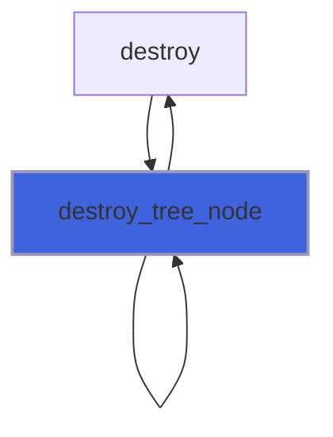

# adam_tree_node_object

> ADAM, tree node class definition.

**Source**: `src/lib/common/adam_tree_node_object.f90`

**Dependencies**


## Contents

- [tree_node_neighbor_object](#tree-node-neighbor-object)
- [tree_node_object](#tree-node-object)
- [destroy_tree_node](#destroy-tree-node)
- [destroy](#destroy)
- [initialize](#initialize)
- [tree_node_assign_tree_node](#tree-node-assign-tree-node)

## Derived Types

### tree_node_neighbor_object

Tree node neighbor class definition

#### Components

| Name | Type | Attributes | Description |
|------|------|------------|-------------|
| `ntype` | integer(kind=[I4P](/api/src/third_party/PENF/src/lib/penf_global_parameters_variables)) |  | Type of neighbor. |
| `codes` | integer(kind=[I8P](/api/src/third_party/PENF/src/lib/penf_global_parameters_variables)) | allocatable | Neighbors Morton codes list, [1] or [ratio/2]. |
| `portion` | integer(kind=[I4P](/api/src/third_party/PENF/src/lib/penf_global_parameters_variables)) |  | Neighbors portion. |
| `bc_fec` | integer(kind=[I4P](/api/src/third_party/PENF/src/lib/penf_global_parameters_variables)) |  | Neighbors fec for BC. |

### tree_node_object

Tree node class definition.

#### Components

| Name | Type | Attributes | Description |
|------|------|------------|-------------|
| `i_am_new` | logical |  | Flag to check if the node is just born. |
| `code` | integer(kind=[I8P](/api/src/third_party/PENF/src/lib/penf_global_parameters_variables)) |  | The Morton code. |
| `refinement_needed` | integer(kind=[I4P](/api/src/third_party/PENF/src/lib/penf_global_parameters_variables)) |  | Flag for refinement/derefinement algorithm. |
| `myrank` | integer(kind=[I4P](/api/src/third_party/PENF/src/lib/penf_global_parameters_variables)) |  | MPI rank process. |
| `myrank_new` | integer(kind=[I4P](/api/src/third_party/PENF/src/lib/penf_global_parameters_variables)) |  | New MPI rank process. |
| `block_index` | integer(kind=[I8P](/api/src/third_party/PENF/src/lib/penf_global_parameters_variables)) |  | Block index in the field array. |
| `block_index_new` | integer(kind=[I8P](/api/src/third_party/PENF/src/lib/penf_global_parameters_variables)) |  | New block index in the field array. |
| `neighbor` | type([tree_node_neighbor_object](/api/src/lib/common/adam_tree_node_object#tree-node-neighbor-object)) |  | Neighborhood data. |
| `surface_stl_distance` | real(kind=[R8P](/api/src/third_party/PENF/src/lib/penf_global_parameters_variables)) |  | Distance from STL surface. |
| `next` | type([tree_node_object](/api/src/lib/common/adam_tree_node_object#tree-node-object)) | pointer | The next node in the tree. |
| `previous` | type([tree_node_object](/api/src/lib/common/adam_tree_node_object#tree-node-object)) | pointer | The previous node in the tree. |

#### Type-Bound Procedures

| Name | Attributes | Description |
|------|------------|-------------|
| `destroy` | pass(self) | Destroy tree node. |
| `initialize` | pass(self) | Initialize tree node. |
| `assignment(=)` |  | Overload `=`. |
| `tree_node_assign_tree_node` | pass(lhs) | Operator `=`. |

## Subroutines

### destroy_tree_node

Destroy tree node and its subsequent ones.

**Attributes**: recursive

```fortran
subroutine destroy_tree_node(node)
```

**Arguments**

| Name | Type | Intent | Attributes | Description |
|------|------|--------|------------|-------------|
| `node` | type([tree_node_object](/api/src/lib/common/adam_tree_node_object#tree-node-object)) | inout | pointer | The node. |

**Call graph**



### destroy

Destroy tree node.

**Attributes**: elemental

```fortran
subroutine destroy(self)
```

**Arguments**

| Name | Type | Intent | Attributes | Description |
|------|------|--------|------------|-------------|
| `self` | class([tree_node_object](/api/src/lib/common/adam_tree_node_object#tree-node-object)) | inout |  | Tree node. |

**Call graph**



```mermaid
flowchart TD
  aabb_node_assign_aabb_node["aabb_node_assign_aabb_node"] --> destroy["destroy"]
  aabb_tree_assign_aabb_tree["aabb_tree_assign_aabb_tree"] --> destroy["destroy"]
  add_facets["add_facets"] --> destroy["destroy"]
  allocate_facets["allocate_facets"] --> destroy["destroy"]
  compute_facets_disconnected["compute_facets_disconnected"] --> destroy["destroy"]
  destroy["destroy"] --> destroy["destroy"]
  destroy_connectivity["destroy_connectivity"] --> destroy["destroy"]
  destroy_tree_node["destroy_tree_node"] --> destroy["destroy"]
  distribute_facets["distribute_facets"] --> destroy["destroy"]
  distribute_facets_tree["distribute_facets_tree"] --> destroy["destroy"]
  empty["empty"] --> destroy["destroy"]
  initialize["initialize"] --> destroy["destroy"]
  initialize["initialize"] --> destroy["destroy"]
  initialize["initialize"] --> destroy["destroy"]
  initialize["initialize"] --> destroy["destroy"]
  initialize["initialize"] --> destroy["destroy"]
  initialize["initialize"] --> destroy["destroy"]
  initialize["initialize"] --> destroy["destroy"]
  load_from_file["load_from_file"] --> destroy["destroy"]
  load_from_file["load_from_file"] --> destroy["destroy"]
  merge_vertices["merge_vertices"] --> destroy["destroy"]
  remove_by_pointer["remove_by_pointer"] --> destroy["destroy"]
  surface_stl_assign_surface_stl["surface_stl_assign_surface_stl"] --> destroy["destroy"]
  union["union"] --> destroy["destroy"]
  style destroy fill:#3e63dd,stroke:#99b,stroke-width:2px
```

### initialize

Initialize tree node.

```fortran
subroutine initialize(self, code, refinement_needed, myrank, block_index)
```

**Arguments**

| Name | Type | Intent | Attributes | Description |
|------|------|--------|------------|-------------|
| `self` | class([tree_node_object](/api/src/lib/common/adam_tree_node_object#tree-node-object)) | inout |  | Tree node. |
| `code` | integer(kind=[I8P](/api/src/third_party/PENF/src/lib/penf_global_parameters_variables)) | in |  | The Morton code. |
| `refinement_needed` | integer(kind=[I4P](/api/src/third_party/PENF/src/lib/penf_global_parameters_variables)) | in | optional | Flag for refinement/derefinement algorithm. |
| `myrank` | integer(kind=[I4P](/api/src/third_party/PENF/src/lib/penf_global_parameters_variables)) | in | optional | MPI rank process. |
| `block_index` | integer(kind=[I8P](/api/src/third_party/PENF/src/lib/penf_global_parameters_variables)) | in | optional | Block index in the field array. |

**Call graph**



```mermaid
flowchart TD
  add_node["add_node"] --> initialize["initialize"]
  analize["analize"] --> initialize["initialize"]
  build_connectivity["build_connectivity"] --> initialize["initialize"]
  distribute_facets["distribute_facets"] --> initialize["initialize"]
  distribute_facets_tree["distribute_facets_tree"] --> initialize["initialize"]
  export_vtk_file["export_vtk_file"] --> initialize["initialize"]
  initialize["initialize"] --> initialize["initialize"]
  initialize["initialize"] --> initialize["initialize"]
  initialize["initialize"] --> initialize["initialize"]
  initialize["initialize"] --> initialize["initialize"]
  initialize["initialize"] --> initialize["initialize"]
  initialize["initialize"] --> initialize["initialize"]
  initialize["initialize"] --> initialize["initialize"]
  initialize["initialize"] --> initialize["initialize"]
  initialize["initialize"] --> initialize["initialize"]
  initialize["initialize"] --> initialize["initialize"]
  initialize["initialize"] --> initialize["initialize"]
  initialize["initialize"] --> initialize["initialize"]
  initialize["initialize"] --> initialize["initialize"]
  initialize["initialize"] --> initialize["initialize"]
  initialize["initialize"] --> initialize["initialize"]
  initialize["initialize"] --> initialize["initialize"]
  initialize["initialize"] --> initialize["initialize"]
  initialize["initialize"] --> initialize["initialize"]
  initialize["initialize"] --> initialize["initialize"]
  initialize["initialize"] --> initialize["initialize"]
  initialize["initialize"] --> initialize["initialize"]
  initialize["initialize"] --> initialize["initialize"]
  initialize["initialize"] --> initialize["initialize"]
  initialize["initialize"] --> initialize["initialize"]
  initialize["initialize"] --> initialize["initialize"]
  initialize["initialize"] --> initialize["initialize"]
  initialize["initialize"] --> initialize["initialize"]
  initialize["initialize"] --> initialize["initialize"]
  initialize["initialize"] --> initialize["initialize"]
  initialize["initialize"] --> initialize["initialize"]
  initialize["initialize"] --> initialize["initialize"]
  initialize["initialize"] --> initialize["initialize"]
  initialize["initialize"] --> initialize["initialize"]
  initialize["initialize"] --> initialize["initialize"]
  initialize["initialize"] --> initialize["initialize"]
  initialize["initialize"] --> initialize["initialize"]
  initialize["initialize"] --> initialize["initialize"]
  initialize["initialize"] --> initialize["initialize"]
  initialize["initialize"] --> initialize["initialize"]
  initialize["initialize"] --> initialize["initialize"]
  initialize["initialize"] --> initialize["initialize"]
  initialize["initialize"] --> initialize["initialize"]
  initialize["initialize"] --> initialize["initialize"]
  initialize["initialize"] --> initialize["initialize"]
  initialize["initialize"] --> initialize["initialize"]
  initialize["initialize"] --> initialize["initialize"]
  initialize["initialize"] --> initialize["initialize"]
  initialize["initialize"] --> initialize["initialize"]
  initialize["initialize"] --> initialize["initialize"]
  initialize["initialize"] --> initialize["initialize"]
  initialize["initialize"] --> initialize["initialize"]
  initialize["initialize"] --> initialize["initialize"]
  initialize["initialize"] --> initialize["initialize"]
  initialize["initialize"] --> initialize["initialize"]
  initialize["initialize"] --> initialize["initialize"]
  initialize["initialize"] --> initialize["initialize"]
  initialize["initialize"] --> initialize["initialize"]
  initialize["initialize"] --> initialize["initialize"]
  initialize["initialize"] --> initialize["initialize"]
  initialize["initialize"] --> initialize["initialize"]
  initialize["initialize"] --> initialize["initialize"]
  initialize["initialize"] --> initialize["initialize"]
  initialize["initialize"] --> initialize["initialize"]
  initialize["initialize"] --> initialize["initialize"]
  initialize["initialize"] --> initialize["initialize"]
  initialize["initialize"] --> initialize["initialize"]
  initialize["initialize"] --> initialize["initialize"]
  initialize["initialize"] --> initialize["initialize"]
  initialize["initialize"] --> initialize["initialize"]
  initialize["initialize"] --> initialize["initialize"]
  initialize["initialize"] --> initialize["initialize"]
  initialize["initialize"] --> initialize["initialize"]
  initialize_common["initialize_common"] --> initialize["initialize"]
  initialize_common["initialize_common"] --> initialize["initialize"]
  initialize_common["initialize_common"] --> initialize["initialize"]
  initialize_common["initialize_common"] --> initialize["initialize"]
  load_from_file["load_from_file"] --> initialize["initialize"]
  load_from_file["load_from_file"] --> initialize["initialize"]
  open_file["open_file"] --> initialize["initialize"]
  open_file["open_file"] --> initialize["initialize"]
  open_file["open_file"] --> initialize["initialize"]
  resize["resize"] --> initialize["initialize"]
  save_into_file["save_into_file"] --> initialize["initialize"]
  save_vtk["save_vtk"] --> initialize["initialize"]
  simulate["simulate"] --> initialize["initialize"]
  simulate["simulate"] --> initialize["initialize"]
  simulate["simulate"] --> initialize["initialize"]
  simulate["simulate"] --> initialize["initialize"]
  simulate["simulate"] --> initialize["initialize"]
  simulate["simulate"] --> initialize["initialize"]
  simulate["simulate"] --> initialize["initialize"]
  test_stress["test_stress"] --> initialize["initialize"]
  initialize["initialize"] --> destroy["destroy"]
  style initialize fill:#3e63dd,stroke:#99b,stroke-width:2px
```

### tree_node_assign_tree_node

Operator `=`.

**Attributes**: pure

```fortran
subroutine tree_node_assign_tree_node(lhs, rhs)
```

**Arguments**

| Name | Type | Intent | Attributes | Description |
|------|------|--------|------------|-------------|
| `lhs` | class([tree_node_object](/api/src/lib/common/adam_tree_node_object#tree-node-object)) | inout |  | Left hand side. |
| `rhs` | type([tree_node_object](/api/src/lib/common/adam_tree_node_object#tree-node-object)) | in |  | Right hand side. |
