# adam_tree_object

> ADAM, tree class definition.
 The tree data structure is organized as a hash table and can be arranged as octree or quadtree simply adopting the proper
 refinement ratio, namely 8 or 4 ratio respectively.

 The tree exploits the Morton order for the linearization of the tree. A prototype of quadtree is represented below.

            j^
    L=0      |
      L=1    |
        L=2  |
          L=3|
             |------------------------------------------------
          7  |  10   11  |  14   15  |  58   59  |  62   63  |
        3----|    10     |    11     |    14     |    15     |
          6  |  8    9   |  12   13  |  56   57  |  60   61  |
      1------|---------- 2 ----------|---------- 3 ----------|
          5  |  34   45  |  38   39  |  50   51  |  54   55  |
        2----|     8     |     9     |    12     |    13     |
          4  |  32   33  |  36   37  |  48   49  |  52   53  |
    0--------|-----------|--------- -1 ----------|-----------|
          3  |  10   11  |  14   15  |  26   27  |  30   31  |
        1----|     2     |     3     |     6     |     7     |
          2  |  8    9   |  12   13  |  24   25  |  28   29  |
      0------|---------- 0 ----------|---------- 1 ----------|
          1  |  2    3   |  6    7   |  18   19  |  22   23  |
        0----|     0     |     1     |     4     |     5     |
          0  |  0    1   |  4    5   |  16   17  |  20   21  |
             O------------------------------------------------------>
                0 |  1   |  2 |  3   |  4 |  5   |  6 |  7     L=3  i
                  0      |    1      |    2      |    3        L=2
                         0           |           1             L=1
                                     0                         L=0

 In the above representation each refinement level is represented *alone*, namely without taking into account the existence of
 previous levels. However, the real hierarchy can be taken into account by simply adding the offset derived from the previous
 levels, thus the numbering becomes as below.

            j^
    L=0      |
      L=1    |
        L=2  |
          L=3|
             |------------------------------------------------
          7  |  62   63  |  66   67  |  78   79  |  82   63  |
        3----|    14     |    15     |    18     |    19     |
          6  |  60   61  |  64   65  |  76   77  |  80   81  |
      1------|---------- 2 ----------|---------- 3 ----------|
          5  |  54   55  |  58   59  |  70   71  |  74   75  |
        2----|    12     |    13     |    16     |    17     |
          4  |  52   53  |  56   57  |  68   69  |  72   73  |
    0--------|-----------|--------- -1 ----------|-----------|
          3  |  30   31  |  34   35  |  46   47  |  50   51  |
        1----|     6     |     7     |    10     |    11     |
          2  |  28   29  |  32   33  |  44   45  |  48   49  |
      0------|---------- 0 ----------|---------- 1 ----------|
          1  |  22   23  |  26   27  |  38   39  |  42   43  |
        0----|     4     |     5     |     8     |     9     |
          0  |  20   21  |  24   25  |  36   37  |  40   41  |
             O------------------------------------------------------>
                0 |  1   |  2 |  3   |  4 |  5   |  6 |  7     L=3  i
                  0      |    1      |    2      |    3        L=2
                         0           |           1             L=1
                                     0                         L=0

 This last numbering is the complete Morton order where the Morton code ideintifing a node entails all the spatial information,
 the refinement level L and the spatial coordinatates IJ.
 Sometimes it is convenient to use the representation where level L is not encoded into the Morton order, but the conversion is as
 as adding the offset of previous level, namely using the funcion `first_at_level`.
 Note that the ancestor node has Morton code -1, it is the ancestor of all nodes, it is **Adam**.
 For the octree case (3D case) the ordering is equivalent, simply the local children fall in [0,7] instead of [0,3], namely the
 local numbering is always [0, ratio-1], as represented below.

  ^
 /|\Z
  |
  |                            G----------*----------H
  |                           /|         /|         /|
  |                          / |        / |        / |
  |                         /  |       /  |       /  |
  |                        /   |      /   |      /   |
  |                       /    *-----/----*-----/----*
  |            6 <-------/--+ /|    /    /|    /   +---------> 7
  |                     *----------*----------*    / |
  |                    /|   /  |  /|   /  |  /|   /  |
  |                   / |  /   | / |  /   | / |  /   |
  |                  /  | /    E/--|-/----*/--|-/----F
  |         2 <-----/---|/--+ //   |/    //   |/  +---------> 3
  |                /    *-----/----*-----/----*    /
  |    4 <--------/--+ /|   //    /|   //   +------------> 5
  |              C----------*----------D    / |  /
  |              |   /  | / |   /  | / |   /  | /
  |              |  /   |/  |  /   |/  |  /   |/
  |              | /    *---|-/----*---|-/----*
  |      0 <-----|/--+ /    |/    /    |/  +------------> 1
  |              *----------*----------*    /
  |              |   /      |   /      |   /
  |              |  /       |  /       |  /
  |   _ Y        | /        | /        | /
  |   /|         |/         |/         |/
  |  /           A----------*----------B
  | /
  |/                                                    X
  o------------------------------------------------------------------->

 Edges numeration:
  AC = fec-7
  BD = fec-8
  EG = fec-9
  FH = fec-10
  AE = fec-11
  BF = fec-12
  CG = fec-13
  DH = fec-14
  AB = fec-15
  EF = fec-16
  CD = fec-17
  GH = fec-18
 Corners numeration:
  A  = fec-19
  B  = fec-20
  E  = fec-21
  F  = fec-22
  C  = fec-23
  D  = fec-24
  G  = fec-25
  H  = fec-26

**Source**: `src/lib/common/adam_tree_object.F90`

**Dependencies**

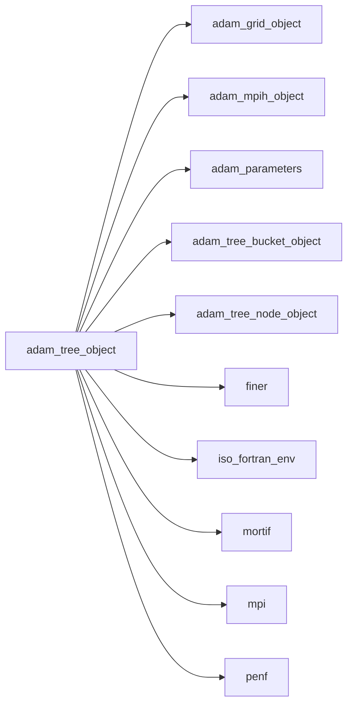

## Contents

- [tree_object](#tree-object)
- [adapt](#adapt)
- [get_closest_cells](#get-closest-cells)
- [initialize](#initialize)
- [load_nodes](#load-nodes)
- [load_from_ini_file](#load-from-ini-file)
- [make_neighborhood](#make-neighborhood)
- [mark_all_nodes](#mark-all-nodes)
- [mark_sphere](#mark-sphere)
- [prune](#prune)
- [resize](#resize)
- [save_nodes](#save-nodes)
- [traverse](#traverse)
- [update_blocks_coordinates](#update-blocks-coordinates)
- [import_refinements_needed](#import-refinements-needed)
- [mpi_redistribute](#mpi-redistribute)
- [get_neighbor_all](#get-neighbor-all)
- [is_greater_by_level](#is-greater-by-level)
- [is_greater_by_pos](#is-greater-by-pos)
- [is_lower_by_level](#is-lower-by-level)
- [is_lower_by_pos](#is-lower-by-pos)
- [morton_to_coordinates1D](#morton-to-coordinates1d)
- [morton_to_coordinates2D](#morton-to-coordinates2d)
- [morton_to_coordinates3D](#morton-to-coordinates3d)
- [print_code_topology](#print-code-topology)
- [add_node](#add-node)
- [derefine](#derefine)
- [empty](#empty)
- [refine](#refine)
- [remove_node](#remove-node)
- [sanitize](#sanitize)
- [codes](#codes)
- [description](#description)
- [get_closest_block](#get-closest-block)
- [has_code](#has-code)
- [hash](#hash)
- [loop](#loop)
- [max_cell_delta](#max-cell-delta)
- [node](#node)
- [prime_buckets_number](#prime-buckets-number)
- [level](#level)
- [all_siblings](#all-siblings)
- [child](#child)
- [child_local](#child-local)
- [children](#children)
- [coordinates1D_to_morton](#coordinates1d-to-morton)
- [coordinates2D_to_morton](#coordinates2d-to-morton)
- [coordinates3D_to_morton](#coordinates3d-to-morton)
- [finest_at_level](#finest-at-level)
- [first_at_level](#first-at-level)
- [first_common_parent](#first-common-parent)
- [greater](#greater)
- [last_at_level](#last-at-level)
- [lower](#lower)
- [parent](#parent)
- [parent_at_level](#parent-at-level)
- [path](#path)
- [siblings](#siblings)

## Variables

| Name | Type | Attributes | Description |
|------|------|------------|-------------|
| `NODE_LESS_REFINED` | integer(kind=[I4P](/api/src/third_party/PENF/src/lib/penf_global_parameters_variables)) | parameter | Less refined node type. |
| `NODE_STANDARD` | integer(kind=[I4P](/api/src/third_party/PENF/src/lib/penf_global_parameters_variables)) | parameter | Standard node type. |
| `NODE_MORE_REFINED` | integer(kind=[I4P](/api/src/third_party/PENF/src/lib/penf_global_parameters_variables)) | parameter | More refined node type. |
| `NODE_BOUNDARY_CONDITION` | integer(kind=[I4P](/api/src/third_party/PENF/src/lib/penf_global_parameters_variables)) | parameter | Boundary condition node type. |
| `TREE_BUCKETS_NUMBER_DEF` | integer(kind=[I8P](/api/src/third_party/PENF/src/lib/penf_global_parameters_variables)) | parameter | Default number of buckets of hash table. |
| `TREE_MAX_LOAD` | real(kind=[R8P](/api/src/third_party/PENF/src/lib/penf_global_parameters_variables)) | parameter | Maximum load of hash table buckets. |
| `TREE_MAX_SANITIZE_ITERATIONS` | integer(kind=[I4P](/api/src/third_party/PENF/src/lib/penf_global_parameters_variables)) | parameter | Default number of tree sanitize iterations. |

## Derived Types

### tree_object

Tree class definition.

#### Components

| Name | Type | Attributes | Description |
|------|------|------------|-------------|
| `mpih` | type([mpih_object](/api/src/third_party/FUNDAL/src/lib/fundal_mpih_object#mpih-object)) |  | MPI handler. |
| `grid` | type([grid_object](/api/src/lib/common/adam_grid_object#grid-object)) | pointer | Grid data. |
| `bucket` | type([tree_bucket_object](/api/src/lib/common/adam_tree_bucket_object#tree-bucket-object)) | allocatable | Tree buckets. |
| `buckets_number` | integer(kind=[I8P](/api/src/third_party/PENF/src/lib/penf_global_parameters_variables)) |  | Number of buckets used. |
| `nodes_number` | integer(kind=[I4P](/api/src/third_party/PENF/src/lib/penf_global_parameters_variables)) |  | Number of nodes actually stored, namely the tree length. |
| `max_load` | real(kind=[R8P](/api/src/third_party/PENF/src/lib/penf_global_parameters_variables)) |  | Maximum load of tree buckets. |
| `ratio` | integer(kind=[I4P](/api/src/third_party/PENF/src/lib/penf_global_parameters_variables)) |  | Refinement ratio. |
| `max_level` | integer(kind=[I4P](/api/src/third_party/PENF/src/lib/penf_global_parameters_variables)) |  | Maximum refinement level. |
| `is_initialized_` | logical |  | Initialization status. |
| `ijkl_prune` | integer(kind=[I4P](/api/src/third_party/PENF/src/lib/penf_global_parameters_variables)) |  | IJKL prune indexes for simple-initial-forest. |
| `iu_ref_levels` | integer(kind=[I4P](/api/src/third_party/PENF/src/lib/penf_global_parameters_variables)) |  | Initial uniform refinement levels. |
| `my_nodes_number` | integer(kind=[I4P](/api/src/third_party/PENF/src/lib/penf_global_parameters_variables)) |  | Number of my nodes, keep_nodes_number + recv_nodes_number. |
| `n_my_derefine` | integer(kind=[I8P](/api/src/third_party/PENF/src/lib/penf_global_parameters_variables)) |  | Number of my nodes to be derefined. |
| `n_my_refine` | integer(kind=[I8P](/api/src/third_party/PENF/src/lib/penf_global_parameters_variables)) |  | Number of my nodes to be refined. |
| `last_block_index` | integer(kind=[I8P](/api/src/third_party/PENF/src/lib/penf_global_parameters_variables)) |  | Last block index in the field array. |
| `node_to_refine` | integer(kind=[I8P](/api/src/third_party/PENF/src/lib/penf_global_parameters_variables)) | allocatable | List of nodes to be refined. |
| `node_to_derefine` | integer(kind=[I8P](/api/src/third_party/PENF/src/lib/penf_global_parameters_variables)) | allocatable | List of nodes to be derefined. |
| `block_to_refine` | integer(kind=[I8P](/api/src/third_party/PENF/src/lib/penf_global_parameters_variables)) | allocatable | List of field blocks to be refined. |
| `block_refined` | integer(kind=[I8P](/api/src/third_party/PENF/src/lib/penf_global_parameters_variables)) | allocatable | List of field refined blocks with Morton code. |
| `block_to_derefine` | integer(kind=[I8P](/api/src/third_party/PENF/src/lib/penf_global_parameters_variables)) | allocatable | List of field blocks to be derefined. |
| `block_derefined` | integer(kind=[I8P](/api/src/third_party/PENF/src/lib/penf_global_parameters_variables)) | allocatable | List of field derefined blocks with Morton code. |
| `block_coordinates` | integer(kind=[I4P](/api/src/third_party/PENF/src/lib/penf_global_parameters_variables)) | allocatable | Block coordinates of redistributed blocks [4,blocks_number]. |
| `block_code` | integer(kind=[I8P](/api/src/third_party/PENF/src/lib/penf_global_parameters_variables)) | allocatable | Block Morton code of redistributed blocks [blocks_number]. |

#### Type-Bound Procedures

| Name | Attributes | Description |
|------|------------|-------------|
| `adapt` | pass(self) | Adapt tree accordingly to refine/derefine necessity. |
| `codes` | pass(self) | Return the list of (sorted) codes actually stored in the tree. |
| `description` | pass(self) | Return pretty-printed object description. |
| `get_closest_block` | pass(self) | Get the closest block to a given point. |
| `get_closest_cells` | pass(self) | Get the closest cells to a given point. |
| `hash` | pass(self) | Hash the key. |
| `has_code` | pass(self) | Check if the code is present in the tree. |
| `initialize` | pass(self) | Initialize the tree. |
| `load_nodes` | pass(self) | Load nodes data, used for restart. |
| `load_from_ini_file` | pass(self) | Load object data from INI file. |
| `loop` | pass(self) | Sentinel while-loop on nodes returning the code. |
| `mark_all_nodes` | pass(self) | Mark all nodes to be refined, derefined, ecc. |
| `mark_sphere` | pass(self) | Mark nodes to be refined/derefined by sphere distance. |
| `max_cell_delta` | nopass | Return the maximum cell delta given a comparison distance. |
| `node` | pass(self) | Return a pointer to a node. |
| `prime_buckets_number` | pass(self) | Return the buckets number as nearest prime number given nodes number. |
| `prune` | pass(self) | Prune nodes. |
| `resize` | pass(self) | Resize the tree. |
| `save_nodes` | pass(self) | Save nodes data, used for restart. |
| `traverse` | pass(self) | Traverse tree calling the iterator procedure. |
| `update_blocks_coordinates` | pass(self) | Update blocks coordinates of redistributed nodes. |
| `import_refinements_needed` | pass(self) | Import refinements needed status changed externally. |
| `mpi_redistribute` | pass(self) | Redistribute nodes to MPI processes, load balancing. |
| `coordinates_to_morton` |  | Return the Morton code given space-level coordinates. |
| `level` | pass(self) | Return the refinement level given the code. |
| `morton_to_coordinates` |  | Return the space-level coordinates given Morton code. |
| `all_siblings` | pass(self) | Return all siblings Morton code given Morton code. |
| `child` | pass(self) | Return the i-th child given Morton code. |
| `child_local` | pass(self) | Return the child index in the local numbering. |
| `children` | pass(self) | Return the children list given Morton code. |
| `coordinates3D_to_morton` | pass(self) | Return the Morton code given ijkl coordinates. |
| `coordinates2D_to_morton` | pass(self) | Return the Morton code given ijl coordinates. |
| `coordinates1D_to_morton` | pass(self) | Return the Morton code given il coordinates. |
| `finest_at_level` | pass(self) | Return the finest node code at given level. |
| `first_at_level` | pass(self) | Return the first node code at given level. |
| `first_common_parent` | pass(self) | Return the first common parent given two codes. |
| `get_neighbor_all` | pass(self) | Return the neighbor given face/edge/corner of given Morton code. |
| `greater` | pass(self) | Return true if code is greater than other. |
| `is_greater_by_level` | pass(self) | Return true if code is greater than other, comparing level. |
| `is_greater_by_pos` | pass(self) | Return true if code is greater than other, comparing position |
| `is_lower_by_level` | pass(self) | Return true if code is lower than other, comparing level. |
| `is_lower_by_pos` | pass(self) | Return true if code is lower than other, comparing position. |
| `last_at_level` | pass(self) | Return the last node code at given level. |
| `lower` | pass(self) | Return true if code is lower than other. |
| `make_neighborhood` | pass(self) | Make neighborhood all whole tree and store it in nodes. |
| `morton_to_coordinates3D` | pass(self) | Return the ijkl coordinates given Morton code. |
| `morton_to_coordinates2D` | pass(self) | Return the ijl coordinates given Morton code. |
| `morton_to_coordinates1D` | pass(self) | Return the il coordinates given Morton code. |
| `parent` | pass(self) | Return the parent given Morton code. |
| `parent_at_level` | pass(self) | Return the parent given Morton code at given level. |
| `path` | pass(self) | Return the path codes, the list of codes from given node to root. |
| `print_code_topology` | pass(self) | Print all code topology data. |
| `siblings` | pass(self) | Return the siblings Morton code given Morton code. |
| `add_node` | pass(self) | Add a node pointer to the tree. |
| `derefine` | pass(self) | Derefine nodes. |
| `empty` | pass(self) | Empty tree, i.e. remove all nodes, without destroy the tree. |
| `refine` | pass(self) | Refine nodes. |
| `remove_node` | pass(self) | Remove a node from the tree, given the key. |
| `sanitize` | pass(self) | Sanitize the tree. |

## Subroutines

### adapt

Adapt tree accordingly to refine/derefine necessity.

```fortran
subroutine adapt(self)
```

**Arguments**

| Name | Type | Intent | Attributes | Description |
|------|------|--------|------------|-------------|
| `self` | class([tree_object](/api/src/lib/common/adam_tree_object#tree-object)) | inout |  | The tree. |

**Call graph**

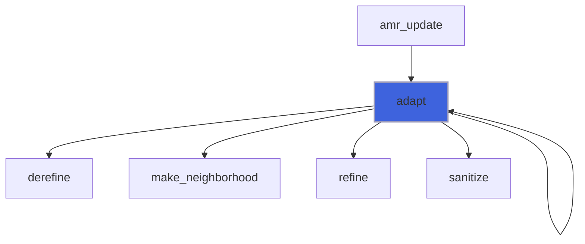

### get_closest_cells

Get the closest cells to a given point.

```fortran
subroutine get_closest_cells(self, point, code, ijk, v, xyz)
```

**Arguments**

| Name | Type | Intent | Attributes | Description |
|------|------|--------|------------|-------------|
| `self` | class([tree_object](/api/src/lib/common/adam_tree_object#tree-object)) | in |  | The tree. |
| `point` | real(kind=[R8P](/api/src/third_party/PENF/src/lib/penf_global_parameters_variables)) | in |  | Point xyz coordinates. |
| `code` | integer(kind=[I8P](/api/src/third_party/PENF/src/lib/penf_global_parameters_variables)) | in |  | The Morton code of the closest block. |
| `ijk` | integer(kind=[I4P](/api/src/third_party/PENF/src/lib/penf_global_parameters_variables)) | out |  | Closest cells indexes. |
| `v` | integer(kind=[I4P](/api/src/third_party/PENF/src/lib/penf_global_parameters_variables)) | out | optional | Closest vertex index. |
| `xyz` | real(kind=[R8P](/api/src/third_party/PENF/src/lib/penf_global_parameters_variables)) | out | optional | Closest cells center-coordinates. |

**Call graph**

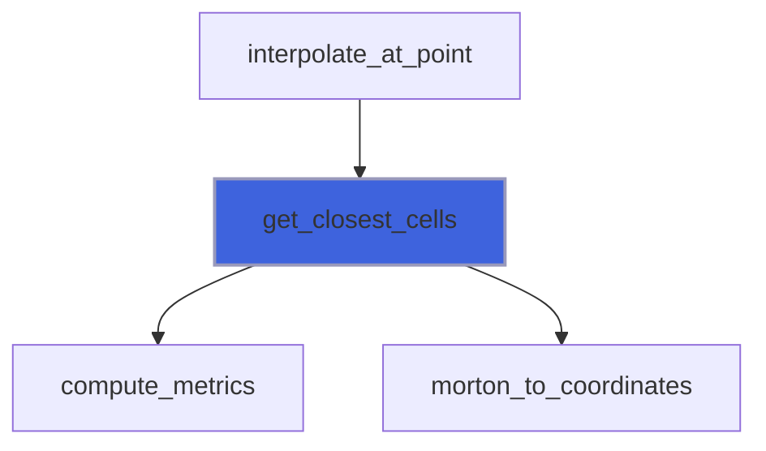

### initialize

Initialize the tree.

```fortran
subroutine initialize(self, grid, file_parameters, max_load, nodes_number, buckets_number, ratio, max_level, add_adam, iu_ref_levels, i_prune, j_prune, k_prune, l_prune)
```

**Arguments**

| Name | Type | Intent | Attributes | Description |
|------|------|--------|------------|-------------|
| `self` | class([tree_object](/api/src/lib/common/adam_tree_object#tree-object)) | inout |  | The tree. |
| `grid` | type([grid_object](/api/src/lib/common/adam_grid_object#grid-object)) | in | target | Grid data. |
| `file_parameters` | type([file_ini](/api/src/third_party/FiNeR/src/lib/finer_file_ini_t#file-ini)) | inout | optional | INI file handler. |
| `max_load` | real(kind=[R8P](/api/src/third_party/PENF/src/lib/penf_global_parameters_variables)) | in | optional | Maximum load of tree buckets. |
| `nodes_number` | integer(kind=[I8P](/api/src/third_party/PENF/src/lib/penf_global_parameters_variables)) | in | optional | Nodes number to be stored in the tree. |
| `buckets_number` | integer(kind=[I8P](/api/src/third_party/PENF/src/lib/penf_global_parameters_variables)) | in | optional | Number of buckets for initialize the tree. |
| `ratio` | integer(kind=[I4P](/api/src/third_party/PENF/src/lib/penf_global_parameters_variables)) | in | optional | Refinement ratio. |
| `max_level` | integer(kind=[I4P](/api/src/third_party/PENF/src/lib/penf_global_parameters_variables)) | in | optional | Maximum refinement level. |
| `add_adam` | logical | in | optional | Add ADAM node, the ancestor of all nodes. |
| `iu_ref_levels` | integer(kind=[I4P](/api/src/third_party/PENF/src/lib/penf_global_parameters_variables)) | in | optional | Uniform initial refinement. |
| `i_prune` | integer(kind=[I4P](/api/src/third_party/PENF/src/lib/penf_global_parameters_variables)) | in | optional | Pruning along x. |
| `j_prune` | integer(kind=[I4P](/api/src/third_party/PENF/src/lib/penf_global_parameters_variables)) | in | optional | Pruning along y. |
| `k_prune` | integer(kind=[I4P](/api/src/third_party/PENF/src/lib/penf_global_parameters_variables)) | in | optional | Pruning along z. |
| `l_prune` | integer(kind=[I4P](/api/src/third_party/PENF/src/lib/penf_global_parameters_variables)) | in | optional | Pruning level. |

**Call graph**

```mermaid
flowchart TD
  add_node["add_node"] --> initialize["initialize"]
  analize["analize"] --> initialize["initialize"]
  build_connectivity["build_connectivity"] --> initialize["initialize"]
  distribute_facets["distribute_facets"] --> initialize["initialize"]
  distribute_facets_tree["distribute_facets_tree"] --> initialize["initialize"]
  export_vtk_file["export_vtk_file"] --> initialize["initialize"]
  initialize["initialize"] --> initialize["initialize"]
  initialize["initialize"] --> initialize["initialize"]
  initialize["initialize"] --> initialize["initialize"]
  initialize["initialize"] --> initialize["initialize"]
  initialize["initialize"] --> initialize["initialize"]
  initialize["initialize"] --> initialize["initialize"]
  initialize["initialize"] --> initialize["initialize"]
  initialize["initialize"] --> initialize["initialize"]
  initialize["initialize"] --> initialize["initialize"]
  initialize["initialize"] --> initialize["initialize"]
  initialize["initialize"] --> initialize["initialize"]
  initialize["initialize"] --> initialize["initialize"]
  initialize["initialize"] --> initialize["initialize"]
  initialize["initialize"] --> initialize["initialize"]
  initialize["initialize"] --> initialize["initialize"]
  initialize["initialize"] --> initialize["initialize"]
  initialize["initialize"] --> initialize["initialize"]
  initialize["initialize"] --> initialize["initialize"]
  initialize["initialize"] --> initialize["initialize"]
  initialize["initialize"] --> initialize["initialize"]
  initialize["initialize"] --> initialize["initialize"]
  initialize["initialize"] --> initialize["initialize"]
  initialize["initialize"] --> initialize["initialize"]
  initialize["initialize"] --> initialize["initialize"]
  initialize["initialize"] --> initialize["initialize"]
  initialize["initialize"] --> initialize["initialize"]
  initialize["initialize"] --> initialize["initialize"]
  initialize["initialize"] --> initialize["initialize"]
  initialize["initialize"] --> initialize["initialize"]
  initialize["initialize"] --> initialize["initialize"]
  initialize["initialize"] --> initialize["initialize"]
  initialize["initialize"] --> initialize["initialize"]
  initialize["initialize"] --> initialize["initialize"]
  initialize["initialize"] --> initialize["initialize"]
  initialize["initialize"] --> initialize["initialize"]
  initialize["initialize"] --> initialize["initialize"]
  initialize["initialize"] --> initialize["initialize"]
  initialize["initialize"] --> initialize["initialize"]
  initialize["initialize"] --> initialize["initialize"]
  initialize["initialize"] --> initialize["initialize"]
  initialize["initialize"] --> initialize["initialize"]
  initialize["initialize"] --> initialize["initialize"]
  initialize["initialize"] --> initialize["initialize"]
  initialize["initialize"] --> initialize["initialize"]
  initialize["initialize"] --> initialize["initialize"]
  initialize["initialize"] --> initialize["initialize"]
  initialize["initialize"] --> initialize["initialize"]
  initialize["initialize"] --> initialize["initialize"]
  initialize["initialize"] --> initialize["initialize"]
  initialize["initialize"] --> initialize["initialize"]
  initialize["initialize"] --> initialize["initialize"]
  initialize["initialize"] --> initialize["initialize"]
  initialize["initialize"] --> initialize["initialize"]
  initialize["initialize"] --> initialize["initialize"]
  initialize["initialize"] --> initialize["initialize"]
  initialize["initialize"] --> initialize["initialize"]
  initialize["initialize"] --> initialize["initialize"]
  initialize["initialize"] --> initialize["initialize"]
  initialize["initialize"] --> initialize["initialize"]
  initialize["initialize"] --> initialize["initialize"]
  initialize["initialize"] --> initialize["initialize"]
  initialize["initialize"] --> initialize["initialize"]
  initialize["initialize"] --> initialize["initialize"]
  initialize["initialize"] --> initialize["initialize"]
  initialize["initialize"] --> initialize["initialize"]
  initialize["initialize"] --> initialize["initialize"]
  initialize["initialize"] --> initialize["initialize"]
  initialize["initialize"] --> initialize["initialize"]
  initialize["initialize"] --> initialize["initialize"]
  initialize["initialize"] --> initialize["initialize"]
  initialize["initialize"] --> initialize["initialize"]
  initialize["initialize"] --> initialize["initialize"]
  initialize_common["initialize_common"] --> initialize["initialize"]
  initialize_common["initialize_common"] --> initialize["initialize"]
  initialize_common["initialize_common"] --> initialize["initialize"]
  initialize_common["initialize_common"] --> initialize["initialize"]
  load_from_file["load_from_file"] --> initialize["initialize"]
  load_from_file["load_from_file"] --> initialize["initialize"]
  open_file["open_file"] --> initialize["initialize"]
  open_file["open_file"] --> initialize["initialize"]
  open_file["open_file"] --> initialize["initialize"]
  resize["resize"] --> initialize["initialize"]
  save_into_file["save_into_file"] --> initialize["initialize"]
  save_vtk["save_vtk"] --> initialize["initialize"]
  simulate["simulate"] --> initialize["initialize"]
  simulate["simulate"] --> initialize["initialize"]
  simulate["simulate"] --> initialize["initialize"]
  simulate["simulate"] --> initialize["initialize"]
  simulate["simulate"] --> initialize["initialize"]
  simulate["simulate"] --> initialize["initialize"]
  simulate["simulate"] --> initialize["initialize"]
  test_stress["test_stress"] --> initialize["initialize"]
  initialize["initialize"] --> add_node["add_node"]
  initialize["initialize"] --> description["description"]
  initialize["initialize"] --> initialize["initialize"]
  initialize["initialize"] --> load_from_ini_file["load_from_ini_file"]
  initialize["initialize"] --> make_neighborhood["make_neighborhood"]
  initialize["initialize"] --> mpi_redistribute["mpi_redistribute"]
  initialize["initialize"] --> prime_buckets_number["prime_buckets_number"]
  initialize["initialize"] --> print_message["print_message"]
  style initialize fill:#3e63dd,stroke:#99b,stroke-width:2px
```

### load_nodes

Load nodes data, used for restart.

 Note: the tree is made empty before lading nodes data.

```fortran
subroutine load_nodes(self, file_name)
```

**Arguments**

| Name | Type | Intent | Attributes | Description |
|------|------|--------|------------|-------------|
| `self` | class([tree_object](/api/src/lib/common/adam_tree_object#tree-object)) | inout |  | The tree. |
| `file_name` | character(len=*) | in |  | Output file name. |

**Call graph**

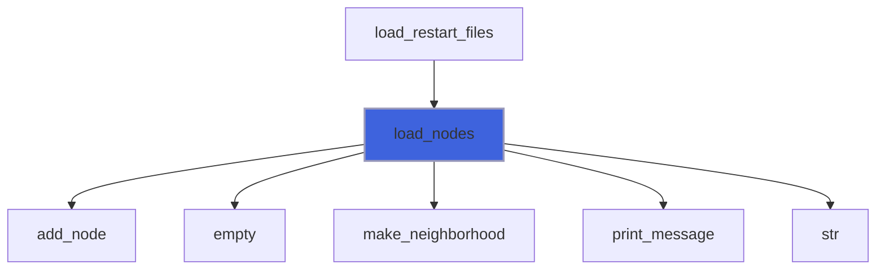

### load_from_ini_file

Load object data from INI file.

```fortran
subroutine load_from_ini_file(self, file_parameters)
```

**Arguments**

| Name | Type | Intent | Attributes | Description |
|------|------|--------|------------|-------------|
| `self` | class([tree_object](/api/src/lib/common/adam_tree_object#tree-object)) | inout |  | The tree. |
| `file_parameters` | type([file_ini](/api/src/third_party/FiNeR/src/lib/finer_file_ini_t#file-ini)) | inout |  | INI file handler. |

**Call graph**

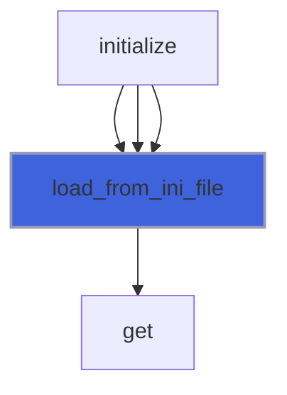

### make_neighborhood

Make neighborhood all whole tree and store it in nodes.

```fortran
subroutine make_neighborhood(self)
```

**Arguments**

| Name | Type | Intent | Attributes | Description |
|------|------|--------|------------|-------------|
| `self` | class([tree_object](/api/src/lib/common/adam_tree_object#tree-object)) | inout |  | The tree. |

**Call graph**

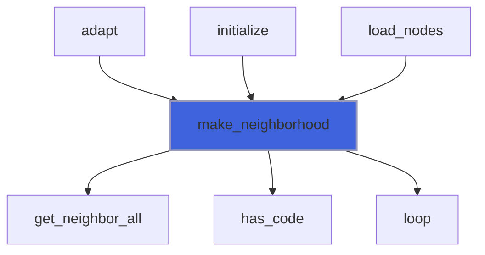

### mark_all_nodes

Mark all nodes to be refined, derefined, ecc.

```fortran
subroutine mark_all_nodes(self, mark)
```

**Arguments**

| Name | Type | Intent | Attributes | Description |
|------|------|--------|------------|-------------|
| `self` | class([tree_object](/api/src/lib/common/adam_tree_object#tree-object)) | inout |  | The tree. |
| `mark` | integer(kind=[I4P](/api/src/third_party/PENF/src/lib/penf_global_parameters_variables)) | in |  | Mark to be imposed [TO_BE_REFINED,...]. |

**Call graph**

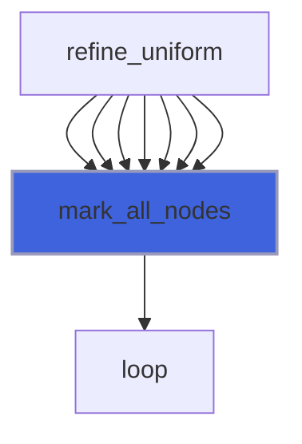

### mark_sphere

Mark all nodes inside a sphere to be refined.

```fortran
subroutine mark_sphere(self, center, radius, threshold)
```

**Arguments**

| Name | Type | Intent | Attributes | Description |
|------|------|--------|------------|-------------|
| `self` | class([tree_object](/api/src/lib/common/adam_tree_object#tree-object)) | inout |  | The tree. |
| `center` | real(kind=[R8P](/api/src/third_party/PENF/src/lib/penf_global_parameters_variables)) | in |  | Sphere center coordinates [x,y,z]. |
| `radius` | real(kind=[R8P](/api/src/third_party/PENF/src/lib/penf_global_parameters_variables)) | in |  | Sphere radius. |
| `threshold` | real(kind=[R8P](/api/src/third_party/PENF/src/lib/penf_global_parameters_variables)) | in | optional | Threshold for sphere proximity. |

**Call graph**

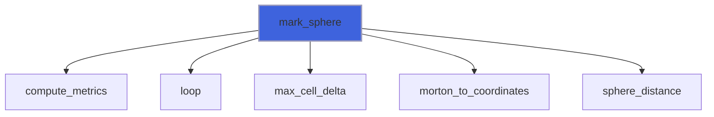

### prune

Prune nodes.

```fortran
subroutine prune(self, ijkl_prune)
```

**Arguments**

| Name | Type | Intent | Attributes | Description |
|------|------|--------|------------|-------------|
| `self` | class([tree_object](/api/src/lib/common/adam_tree_object#tree-object)) | inout |  | The tree. |
| `ijkl_prune` | integer(kind=[I4P](/api/src/third_party/PENF/src/lib/penf_global_parameters_variables)) | inout |  | Maximum coordinates after which the prune operates. |

**Call graph**

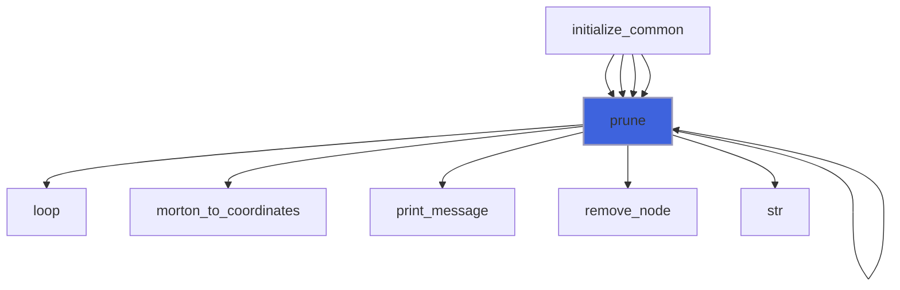

### resize

Resize the tree.

```fortran
subroutine resize(self, nodes_number, max_load)
```

**Arguments**

| Name | Type | Intent | Attributes | Description |
|------|------|--------|------------|-------------|
| `self` | class([tree_object](/api/src/lib/common/adam_tree_object#tree-object)) | inout |  | The tree. |
| `nodes_number` | integer(kind=[I8P](/api/src/third_party/PENF/src/lib/penf_global_parameters_variables)) | in |  | Nodes number to be stored in the tree. |
| `max_load` | real(kind=[R8P](/api/src/third_party/PENF/src/lib/penf_global_parameters_variables)) | in | optional | Maximum load of tree buckets. |

**Call graph**

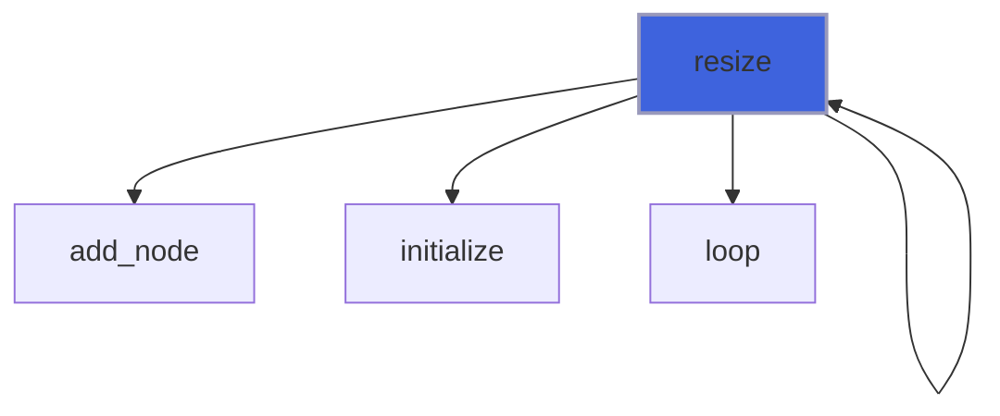

### save_nodes

Save nodes data, used for restart.

```fortran
subroutine save_nodes(self, file_name)
```

**Arguments**

| Name | Type | Intent | Attributes | Description |
|------|------|--------|------------|-------------|
| `self` | class([tree_object](/api/src/lib/common/adam_tree_object#tree-object)) | in |  | The tree. |
| `file_name` | character(len=*) | in |  | Output file name. |

**Call graph**

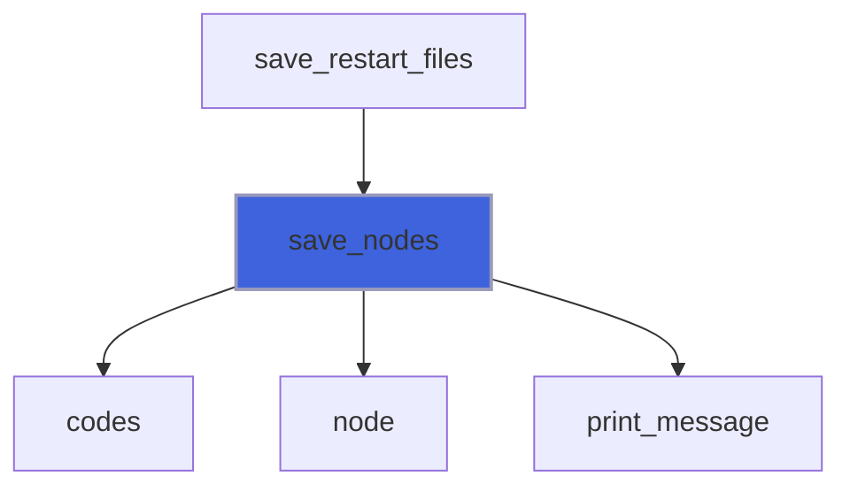

### traverse

Traverse tree calling the iterator procedure.

```fortran
subroutine traverse(self, iterator)
```

**Arguments**

| Name | Type | Intent | Attributes | Description |
|------|------|--------|------------|-------------|
| `self` | class([tree_object](/api/src/lib/common/adam_tree_object#tree-object)) | in |  | The tree. |
| `iterator` | procedure(iterator_interface) |  |  | The (key) iterator procedure to call for each node. |

**Call graph**

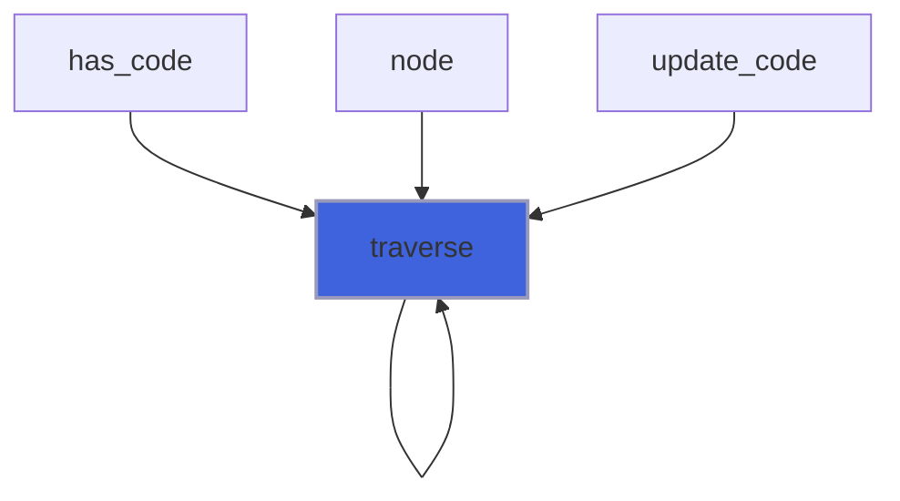

### update_blocks_coordinates

Update blocks coordinates of redistributed nodes.

```fortran
subroutine update_blocks_coordinates(self, my_nodes_number)
```

**Arguments**

| Name | Type | Intent | Attributes | Description |
|------|------|--------|------------|-------------|
| `self` | class([tree_object](/api/src/lib/common/adam_tree_object#tree-object)) | inout |  | The tree. |
| `my_nodes_number` | integer(kind=[I4P](/api/src/third_party/PENF/src/lib/penf_global_parameters_variables)) | in |  | Number of my nodes, keep_nodes_number + recv_nodes_number. |

**Call graph**

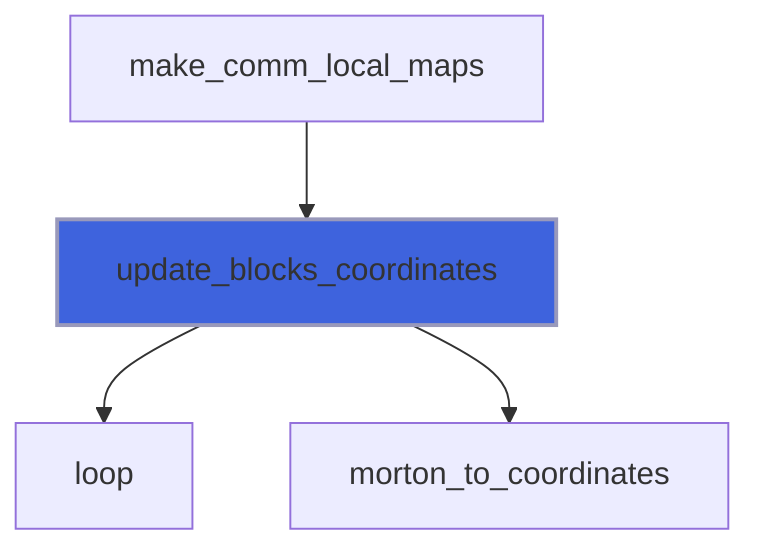

### import_refinements_needed

Import refinements needed status changed externally.

```fortran
subroutine import_refinements_needed(self, refinements_needed_all, disp_count)
```

**Arguments**

| Name | Type | Intent | Attributes | Description |
|------|------|--------|------------|-------------|
| `self` | class([tree_object](/api/src/lib/common/adam_tree_object#tree-object)) | inout |  | The tree. |
| `refinements_needed_all` | integer(kind=[I4P](/api/src/third_party/PENF/src/lib/penf_global_parameters_variables)) | in | allocatable | Refinements needed of all blocks. |
| `disp_count` | integer(kind=[I4P](/api/src/third_party/PENF/src/lib/penf_global_parameters_variables)) | in | allocatable | Displacement of blocks that are received from process. |

**Call graph**

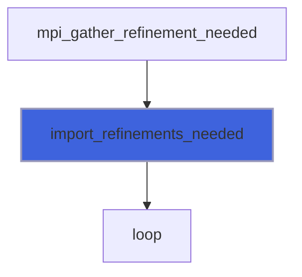

### mpi_redistribute

Redistribute nodes to processes, load balancing.

 The nodes are distributed among all process exploiting the Morton ordering spatiality. Simply, the sorted list of codes are
 splitted in chunk of `nodes_number/procs_number` balancing the workload. However, the algorithm checks if the splits fall
 among siblings that cannot be splitted: if this scenario happens the siblings are placed in the same process for preserving
 the spatiality. The algorithm is sophisticated enough to place the siblings alternatively to the *left* or *right* process
 accordingly to where the split falls, namely to the *right* if the split falls in the first half of siblings or to the *left*
 if it falls in the second half.

```fortran
subroutine mpi_redistribute(self)
```

**Arguments**

| Name | Type | Intent | Attributes | Description |
|------|------|--------|------------|-------------|
| `self` | class([tree_object](/api/src/lib/common/adam_tree_object#tree-object)) | inout |  | The tree. |

**Call graph**

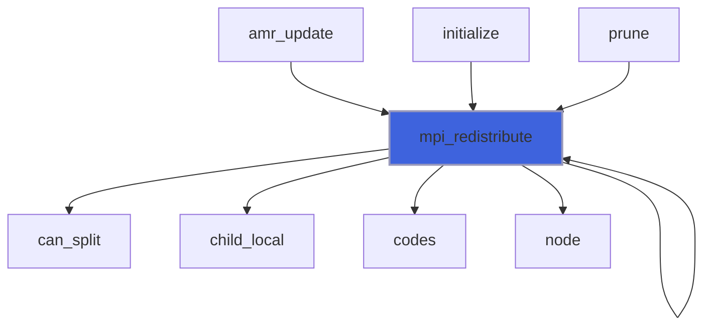

### get_neighbor_all

Return the neighbor in a given face/edge/corner of given Morton code.

 The direction `fec` is organized as: faces=[1,6], edges=[7,18], corners=[19,26].

 We define *direct neighbor* the neighbor of given code in the given face at the same level of the given code
 either if it exists or not.

```fortran
subroutine get_neighbor_all(self, code, face, neighbor, neighbor_type, neighbor_portion, neighbor_bc_fec)
```

**Arguments**

| Name | Type | Intent | Attributes | Description |
|------|------|--------|------------|-------------|
| `self` | class([tree_object](/api/src/lib/common/adam_tree_object#tree-object)) | in |  | The tree. |
| `code` | integer(kind=[I8P](/api/src/third_party/PENF/src/lib/penf_global_parameters_variables)) | in |  | Morton code. |
| `face` | integer(kind=[I4P](/api/src/third_party/PENF/src/lib/penf_global_parameters_variables)) | in |  | Face queried. |
| `neighbor` | integer(kind=[I8P](/api/src/third_party/PENF/src/lib/penf_global_parameters_variables)) | out | allocatable | Neighbors codes list, [1] or [ratio/2]. |
| `neighbor_type` | integer(kind=[I4P](/api/src/third_party/PENF/src/lib/penf_global_parameters_variables)) | out |  | Type of neighbor. |
| `neighbor_portion` | integer(kind=[I4P](/api/src/third_party/PENF/src/lib/penf_global_parameters_variables)) | out | optional | Neighbors portion. |
| `neighbor_bc_fec` | integer(kind=[I4P](/api/src/third_party/PENF/src/lib/penf_global_parameters_variables)) | out | optional | Neighbors fec for BC. |

**Call graph**

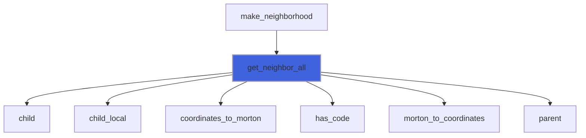

### is_greater_by_level

Return true if code is greater than other, comparing level.

```fortran
subroutine is_greater_by_level(self, lhs, rhs, res)
```

**Arguments**

| Name | Type | Intent | Attributes | Description |
|------|------|--------|------------|-------------|
| `self` | class([tree_object](/api/src/lib/common/adam_tree_object#tree-object)) | in |  | The tree. |
| `lhs` | integer(kind=[I8P](/api/src/third_party/PENF/src/lib/penf_global_parameters_variables)) | in |  | Left hand side of code comparison. |
| `rhs` | integer(kind=[I8P](/api/src/third_party/PENF/src/lib/penf_global_parameters_variables)) | in |  | Right hand side of code comparison. |
| `res` | logical | out |  | Comparison result. |

**Call graph**

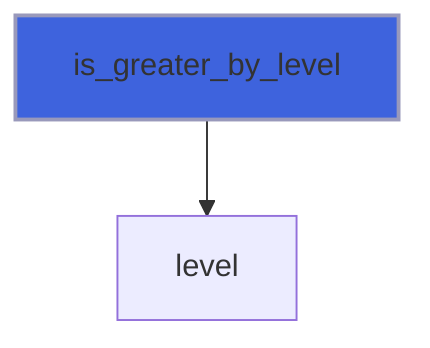

### is_greater_by_pos

Return true if code is greater than other, comparing position.

```fortran
subroutine is_greater_by_pos(self, lhs, rhs, res)
```

**Arguments**

| Name | Type | Intent | Attributes | Description |
|------|------|--------|------------|-------------|
| `self` | class([tree_object](/api/src/lib/common/adam_tree_object#tree-object)) | in |  | The tree. |
| `lhs` | integer(kind=[I8P](/api/src/third_party/PENF/src/lib/penf_global_parameters_variables)) | in |  | Left hand side of code comparison. |
| `rhs` | integer(kind=[I8P](/api/src/third_party/PENF/src/lib/penf_global_parameters_variables)) | in |  | Right hand side of code comparison. |
| `res` | logical | out |  | Comparison result. |

**Call graph**

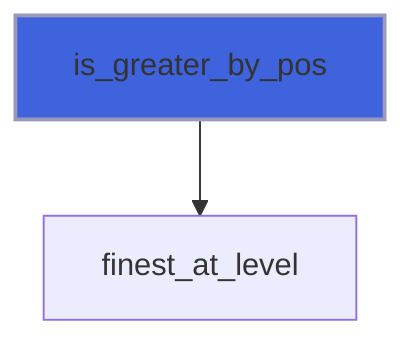

### is_lower_by_level

Return true if code is lower than other, comparing level.

```fortran
subroutine is_lower_by_level(self, lhs, rhs, res)
```

**Arguments**

| Name | Type | Intent | Attributes | Description |
|------|------|--------|------------|-------------|
| `self` | class([tree_object](/api/src/lib/common/adam_tree_object#tree-object)) | in |  | The tree. |
| `lhs` | integer(kind=[I8P](/api/src/third_party/PENF/src/lib/penf_global_parameters_variables)) | in |  | Left hand side of code comparison. |
| `rhs` | integer(kind=[I8P](/api/src/third_party/PENF/src/lib/penf_global_parameters_variables)) | in |  | Right hand side of code comparison. |
| `res` | logical | out |  | Comparison result. |

**Call graph**


### is_lower_by_pos

Return true if code is lower than other, comparing position.

```fortran
subroutine is_lower_by_pos(self, lhs, rhs, res)
```

**Arguments**

| Name | Type | Intent | Attributes | Description |
|------|------|--------|------------|-------------|
| `self` | class([tree_object](/api/src/lib/common/adam_tree_object#tree-object)) | in |  | The tree. |
| `lhs` | integer(kind=[I8P](/api/src/third_party/PENF/src/lib/penf_global_parameters_variables)) | in |  | Left hand side of code comparison. |
| `rhs` | integer(kind=[I8P](/api/src/third_party/PENF/src/lib/penf_global_parameters_variables)) | in |  | Right hand side of code comparison. |
| `res` | logical | out |  | Comparison result. |

**Call graph**

```mermaid
flowchart TD
  is_lower_by_pos["is_lower_by_pos"] --> finest_at_level["finest_at_level"]
  style is_lower_by_pos fill:#3e63dd,stroke:#99b,stroke-width:2px
```

### morton_to_coordinates1D

Return the il coordinates given Morton code.

```fortran
subroutine morton_to_coordinates1D(self, code, i, l)
```

**Arguments**

| Name | Type | Intent | Attributes | Description |
|------|------|--------|------------|-------------|
| `self` | class([tree_object](/api/src/lib/common/adam_tree_object#tree-object)) | in |  | The tree. |
| `code` | integer(kind=[I8P](/api/src/third_party/PENF/src/lib/penf_global_parameters_variables)) | in |  | Morton code. |
| `i` | integer(kind=[I4P](/api/src/third_party/PENF/src/lib/penf_global_parameters_variables)) | out |  | I coordinate. |
| `l` | integer(kind=[I4P](/api/src/third_party/PENF/src/lib/penf_global_parameters_variables)) | out |  | L coordinate. |

**Call graph**

```mermaid
flowchart TD
  morton_to_coordinates1D["morton_to_coordinates1D"] --> last_at_level["last_at_level"]
  morton_to_coordinates1D["morton_to_coordinates1D"] --> level["level"]
  style morton_to_coordinates1D fill:#3e63dd,stroke:#99b,stroke-width:2px
```

### morton_to_coordinates2D

Return the ijl coordinates given Morton code.

```fortran
subroutine morton_to_coordinates2D(self, code, i, j, l)
```

**Arguments**

| Name | Type | Intent | Attributes | Description |
|------|------|--------|------------|-------------|
| `self` | class([tree_object](/api/src/lib/common/adam_tree_object#tree-object)) | in |  | The tree. |
| `code` | integer(kind=[I8P](/api/src/third_party/PENF/src/lib/penf_global_parameters_variables)) | in |  | Morton code. |
| `i` | integer(kind=[I4P](/api/src/third_party/PENF/src/lib/penf_global_parameters_variables)) | out |  | I coordinate. |
| `j` | integer(kind=[I4P](/api/src/third_party/PENF/src/lib/penf_global_parameters_variables)) | out |  | J coordinate. |
| `l` | integer(kind=[I4P](/api/src/third_party/PENF/src/lib/penf_global_parameters_variables)) | out |  | L coordinate. |

**Call graph**

```mermaid
flowchart TD
  morton_to_coordinates2D["morton_to_coordinates2D"] --> child_local["child_local"]
  morton_to_coordinates2D["morton_to_coordinates2D"] --> demorton2D["demorton2D"]
  morton_to_coordinates2D["morton_to_coordinates2D"] --> level["level"]
  morton_to_coordinates2D["morton_to_coordinates2D"] --> path["path"]
  style morton_to_coordinates2D fill:#3e63dd,stroke:#99b,stroke-width:2px
```

### morton_to_coordinates3D

Return the ijkl coordinates given Morton code.

```fortran
subroutine morton_to_coordinates3D(self, code, i, j, k, l)
```

**Arguments**

| Name | Type | Intent | Attributes | Description |
|------|------|--------|------------|-------------|
| `self` | class([tree_object](/api/src/lib/common/adam_tree_object#tree-object)) | in |  | The tree. |
| `code` | integer(kind=[I8P](/api/src/third_party/PENF/src/lib/penf_global_parameters_variables)) | in |  | Morton code. |
| `i` | integer(kind=[I4P](/api/src/third_party/PENF/src/lib/penf_global_parameters_variables)) | out |  | I coordinate. |
| `j` | integer(kind=[I4P](/api/src/third_party/PENF/src/lib/penf_global_parameters_variables)) | out |  | J coordinate. |
| `k` | integer(kind=[I4P](/api/src/third_party/PENF/src/lib/penf_global_parameters_variables)) | out |  | K coordinate. |
| `l` | integer(kind=[I4P](/api/src/third_party/PENF/src/lib/penf_global_parameters_variables)) | out |  | L coordinate. |

**Call graph**

```mermaid
flowchart TD
  morton_to_coordinates3D["morton_to_coordinates3D"] --> child_local["child_local"]
  morton_to_coordinates3D["morton_to_coordinates3D"] --> demorton3D["demorton3D"]
  morton_to_coordinates3D["morton_to_coordinates3D"] --> level["level"]
  morton_to_coordinates3D["morton_to_coordinates3D"] --> path["path"]
  style morton_to_coordinates3D fill:#3e63dd,stroke:#99b,stroke-width:2px
```

### print_code_topology

Print all code topology data.

```fortran
subroutine print_code_topology(self, code, coordinates, level, parent, parents, path, child, child_local_code, finest, siblings, neighbor, block_index, whole)
```

**Arguments**

| Name | Type | Intent | Attributes | Description |
|------|------|--------|------------|-------------|
| `self` | class([tree_object](/api/src/lib/common/adam_tree_object#tree-object)) | in |  | The tree. |
| `code` | integer(kind=[I8P](/api/src/third_party/PENF/src/lib/penf_global_parameters_variables)) | in |  | Morton code. |
| `coordinates` | logical | in | optional | Coordinates. |
| `level` | logical | in | optional | Level of node. |
| `parent` | logical | in | optional | Parent of code. |
| `parents` | logical | in | optional | Parents list. |
| `path` | logical | in | optional | Path from node to parent of first level. |
| `child` | logical | in | optional | (First) Child of code. |
| `child_local_code` | logical | in | optional | Local child-numbering of code. |
| `finest` | logical | in | optional | Finest Morton code. |
| `siblings` | logical | in | optional | Siblings of code. |
| `neighbor` | logical | in | optional | Neighbor of code. |
| `block_index` | logical | in | optional | Block index in the field array. |
| `whole` | logical | in | optional | Whole topology data. |

**Call graph**

```mermaid
flowchart TD
  print_code_topology["print_code_topology"] --> child["child"]
  print_code_topology["print_code_topology"] --> child_local["child_local"]
  print_code_topology["print_code_topology"] --> finest_at_level["finest_at_level"]
  print_code_topology["print_code_topology"] --> level["level"]
  print_code_topology["print_code_topology"] --> morton_to_coordinates["morton_to_coordinates"]
  print_code_topology["print_code_topology"] --> node["node"]
  print_code_topology["print_code_topology"] --> parent["parent"]
  print_code_topology["print_code_topology"] --> parent_at_level["parent_at_level"]
  print_code_topology["print_code_topology"] --> path["path"]
  print_code_topology["print_code_topology"] --> print_message["print_message"]
  print_code_topology["print_code_topology"] --> siblings["siblings"]
  print_code_topology["print_code_topology"] --> str["str"]
  style print_code_topology fill:#3e63dd,stroke:#99b,stroke-width:2px
```

### add_node

Add a node pointer to the tree.

 @note If a node with the same key is already in the tree, it is removed and the new one will replace it.

```fortran
subroutine add_node(self, code, refinement_needed, rank, block_index, update_last_block_index)
```

**Arguments**

| Name | Type | Intent | Attributes | Description |
|------|------|--------|------------|-------------|
| `self` | class([tree_object](/api/src/lib/common/adam_tree_object#tree-object)) | inout |  | The tree. |
| `code` | integer(kind=[I8P](/api/src/third_party/PENF/src/lib/penf_global_parameters_variables)) | in |  | The Morton code. |
| `refinement_needed` | integer(kind=[I4P](/api/src/third_party/PENF/src/lib/penf_global_parameters_variables)) | in | optional | Flag for refinement/derefinement algorithm. |
| `rank` | integer(kind=[I4P](/api/src/third_party/PENF/src/lib/penf_global_parameters_variables)) | in | optional | MPI rank process. |
| `block_index` | integer(kind=[I8P](/api/src/third_party/PENF/src/lib/penf_global_parameters_variables)) | in | optional | Block index in the field array. |
| `update_last_block_index` | logical | in | optional | Update or not last block index. |

**Call graph**

```mermaid
flowchart TD
  add_node["add_node"] --> add_node["add_node"]
  derefine["derefine"] --> add_node["add_node"]
  initialize["initialize"] --> add_node["add_node"]
  load_nodes["load_nodes"] --> add_node["add_node"]
  refine["refine"] --> add_node["add_node"]
  resize["resize"] --> add_node["add_node"]
  add_node["add_node"] --> add_node["add_node"]
  add_node["add_node"] --> has_code["has_code"]
  add_node["add_node"] --> hash["hash"]
  style add_node fill:#3e63dd,stroke:#99b,stroke-width:2px
```

### derefine

Derefine nodes.

```fortran
subroutine derefine(self)
```

**Arguments**

| Name | Type | Intent | Attributes | Description |
|------|------|--------|------------|-------------|
| `self` | class([tree_object](/api/src/lib/common/adam_tree_object#tree-object)) | inout |  | The tree. |

**Call graph**

```mermaid
flowchart TD
  adapt["adapt"] --> derefine["derefine"]
  derefine["derefine"] --> add_node["add_node"]
  derefine["derefine"] --> node["node"]
  derefine["derefine"] --> parent["parent"]
  derefine["derefine"] --> remove_node["remove_node"]
  style derefine fill:#3e63dd,stroke:#99b,stroke-width:2px
```

### empty

Empty tree, i.e. remove all nodes, without destroy the tree.

```fortran
subroutine empty(self)
```

**Arguments**

| Name | Type | Intent | Attributes | Description |
|------|------|--------|------------|-------------|
| `self` | class([tree_object](/api/src/lib/common/adam_tree_object#tree-object)) | inout |  | The tree. |

**Call graph**

```mermaid
flowchart TD
  load_nodes["load_nodes"] --> empty["empty"]
  empty["empty"] --> destroy["destroy"]
  style empty fill:#3e63dd,stroke:#99b,stroke-width:2px
```

### refine

Refine nodes.

```fortran
subroutine refine(self)
```

**Arguments**

| Name | Type | Intent | Attributes | Description |
|------|------|--------|------------|-------------|
| `self` | class([tree_object](/api/src/lib/common/adam_tree_object#tree-object)) | inout |  | The tree. |

**Call graph**

```mermaid
flowchart TD
  adapt["adapt"] --> refine["refine"]
  refine["refine"] --> add_node["add_node"]
  refine["refine"] --> child["child"]
  refine["refine"] --> node["node"]
  refine["refine"] --> remove_node["remove_node"]
  style refine fill:#3e63dd,stroke:#99b,stroke-width:2px
```

### remove_node

Remove a node from the tree, given the code.

```fortran
subroutine remove_node(self, code)
```

**Arguments**

| Name | Type | Intent | Attributes | Description |
|------|------|--------|------------|-------------|
| `self` | class([tree_object](/api/src/lib/common/adam_tree_object#tree-object)) | inout |  | The tree. |
| `code` | integer(kind=[I8P](/api/src/third_party/PENF/src/lib/penf_global_parameters_variables)) | in |  | The Morton code. |

**Call graph**

```mermaid
flowchart TD
  derefine["derefine"] --> remove_node["remove_node"]
  prune["prune"] --> remove_node["remove_node"]
  refine["refine"] --> remove_node["remove_node"]
  remove_node["remove_node"] --> remove_node["remove_node"]
  remove_node["remove_node"] --> has_code["has_code"]
  remove_node["remove_node"] --> hash["hash"]
  remove_node["remove_node"] --> remove_node["remove_node"]
  style remove_node fill:#3e63dd,stroke:#99b,stroke-width:2px
```

### sanitize

Sanitize the tree.

```fortran
subroutine sanitize(self, iterations_number)
```

**Arguments**

| Name | Type | Intent | Attributes | Description |
|------|------|--------|------------|-------------|
| `self` | class([tree_object](/api/src/lib/common/adam_tree_object#tree-object)) | inout |  | The tree. |
| `iterations_number` | integer(kind=[I4P](/api/src/third_party/PENF/src/lib/penf_global_parameters_variables)) | in | optional | Sanitazie iterations number. |

**Call graph**

```mermaid
flowchart TD
  adapt["adapt"] --> sanitize["sanitize"]
  sanitize["sanitize"] --> all_siblings["all_siblings"]
  sanitize["sanitize"] --> has_code["has_code"]
  sanitize["sanitize"] --> level["level"]
  sanitize["sanitize"] --> loop["loop"]
  sanitize["sanitize"] --> node["node"]
  sanitize["sanitize"] --> siblings["siblings"]
  sanitize["sanitize"] --> str["str"]
  style sanitize fill:#3e63dd,stroke:#99b,stroke-width:2px
```

## Functions

### codes

Return the list of (sorted) codes actually stored in the tree.

**Returns**: integer(kind=[I8P](/api/src/third_party/PENF/src/lib/penf_global_parameters_variables))

```fortran
function codes(self, only_mine, sort_by_level)
```

**Arguments**

| Name | Type | Intent | Attributes | Description |
|------|------|--------|------------|-------------|
| `self` | class([tree_object](/api/src/lib/common/adam_tree_object#tree-object)) | in |  | The tree. |
| `only_mine` | logical | in | optional | If true return only the nodes of myrank process. |
| `sort_by_level` | logical | in | optional | If true sort codes be level instead of position. |

**Call graph**

```mermaid
flowchart TD
  make_comm_local_maps["make_comm_local_maps"] --> codes["codes"]
  mpi_redistribute["mpi_redistribute"] --> codes["codes"]
  save_hdf5["save_hdf5"] --> codes["codes"]
  save_nodes["save_nodes"] --> codes["codes"]
  codes["codes"] --> loop["loop"]
  codes["codes"] --> mergesort["mergesort"]
  style codes fill:#3e63dd,stroke:#99b,stroke-width:2px
```

### description

Return a pretty-formatted object description.

**Attributes**: pure

**Returns**: `character(len=:)`

```fortran
function description(self) result(desc)
```

**Arguments**

| Name | Type | Intent | Attributes | Description |
|------|------|--------|------------|-------------|
| `self` | class([tree_object](/api/src/lib/common/adam_tree_object#tree-object)) | in |  | The tree. |

**Call graph**

```mermaid
flowchart TD
  description["description"] --> description["description"]
  description["description"] --> description["description"]
  description["description"] --> description["description"]
  initialize["initialize"] --> description["description"]
  initialize["initialize"] --> description["description"]
  initialize["initialize"] --> description["description"]
  initialize["initialize"] --> description["description"]
  initialize["initialize"] --> description["description"]
  initialize["initialize"] --> description["description"]
  initialize["initialize"] --> description["description"]
  initialize["initialize"] --> description["description"]
  initialize["initialize"] --> description["description"]
  initialize["initialize"] --> description["description"]
  initialize["initialize"] --> description["description"]
  initialize["initialize"] --> description["description"]
  initialize["initialize"] --> description["description"]
  initialize["initialize"] --> description["description"]
  initialize["initialize"] --> description["description"]
  initialize["initialize"] --> description["description"]
  initialize["initialize"] --> description["description"]
  initialize["initialize"] --> description["description"]
  initialize["initialize"] --> description["description"]
  initialize["initialize"] --> description["description"]
  initialize["initialize"] --> description["description"]
  initialize["initialize"] --> description["description"]
  initialize["initialize"] --> description["description"]
  initialize["initialize"] --> description["description"]
  initialize["initialize"] --> description["description"]
  initialize["initialize"] --> description["description"]
  initialize["initialize"] --> description["description"]
  initialize["initialize"] --> description["description"]
  initialize["initialize"] --> description["description"]
  initialize["initialize"] --> description["description"]
  initialize["initialize"] --> description["description"]
  initialize["initialize"] --> description["description"]
  initialize["initialize"] --> description["description"]
  initialize["initialize"] --> description["description"]
  initialize["initialize"] --> description["description"]
  initialize["initialize"] --> description["description"]
  initialize["initialize"] --> description["description"]
  initialize["initialize"] --> description["description"]
  initialize["initialize"] --> description["description"]
  initialize["initialize"] --> description["description"]
  initialize["initialize"] --> description["description"]
  initialize["initialize"] --> description["description"]
  initialize["initialize"] --> description["description"]
  initialize["initialize"] --> description["description"]
  description["description"] --> str["str"]
  style description fill:#3e63dd,stroke:#99b,stroke-width:2px
```

### get_closest_block

Get the closest block to a given point.

**Returns**: integer(kind=[I8P](/api/src/third_party/PENF/src/lib/penf_global_parameters_variables))

```fortran
function get_closest_block(self, point) result(code)
```

**Arguments**

| Name | Type | Intent | Attributes | Description |
|------|------|--------|------------|-------------|
| `self` | class([tree_object](/api/src/lib/common/adam_tree_object#tree-object)) | inout |  | The tree. |
| `point` | real(kind=[R8P](/api/src/third_party/PENF/src/lib/penf_global_parameters_variables)) | in |  | Point xyz coordinates. |

**Call graph**

```mermaid
flowchart TD
  get_closest_block["get_closest_block"] --> get_closest_block["get_closest_block"]
  interpolate_at_point["interpolate_at_point"] --> get_closest_block["get_closest_block"]
  get_closest_block["get_closest_block"] --> coordinates_to_morton["coordinates_to_morton"]
  get_closest_block["get_closest_block"] --> get_closest_block["get_closest_block"]
  get_closest_block["get_closest_block"] --> has_code["has_code"]
  get_closest_block["get_closest_block"] --> path["path"]
  get_closest_block["get_closest_block"] --> str["str"]
  style get_closest_block fill:#3e63dd,stroke:#99b,stroke-width:2px
```

### has_code

Check if the key is present in the tree.

**Returns**: `logical`

```fortran
function has_code(self, code)
```

**Arguments**

| Name | Type | Intent | Attributes | Description |
|------|------|--------|------------|-------------|
| `self` | class([tree_object](/api/src/lib/common/adam_tree_object#tree-object)) | in |  | The tree. |
| `code` | integer(kind=[I8P](/api/src/third_party/PENF/src/lib/penf_global_parameters_variables)) | in |  | The Morton code. |

**Call graph**

```mermaid
flowchart TD
  add_node["add_node"] --> has_code["has_code"]
  get_closest_block["get_closest_block"] --> has_code["has_code"]
  get_neighbor_all["get_neighbor_all"] --> has_code["has_code"]
  has_code["has_code"] --> has_code["has_code"]
  make_neighborhood["make_neighborhood"] --> has_code["has_code"]
  remove_node["remove_node"] --> has_code["has_code"]
  sanitize["sanitize"] --> has_code["has_code"]
  has_code["has_code"] --> has_code["has_code"]
  has_code["has_code"] --> hash["hash"]
  style has_code fill:#3e63dd,stroke:#99b,stroke-width:2px
```

### hash

Hash the key.

**Attributes**: elemental

**Returns**: integer(kind=[I4P](/api/src/third_party/PENF/src/lib/penf_global_parameters_variables))

```fortran
function hash(self, code) result(bucket)
```

**Arguments**

| Name | Type | Intent | Attributes | Description |
|------|------|--------|------------|-------------|
| `self` | class([tree_object](/api/src/lib/common/adam_tree_object#tree-object)) | in |  | The tree. |
| `code` | integer(kind=[I8P](/api/src/third_party/PENF/src/lib/penf_global_parameters_variables)) | in |  | The Morton code. |

**Call graph**

```mermaid
flowchart TD
  add_node["add_node"] --> hash["hash"]
  has_code["has_code"] --> hash["hash"]
  node["node"] --> hash["hash"]
  remove_node["remove_node"] --> hash["hash"]
  style hash fill:#3e63dd,stroke:#99b,stroke-width:2px
```

### loop

Sentinel while-loop on nodes returning the code (for tree looping).

**Returns**: `logical`

```fortran
function loop(self, code, node_ptr) result(again)
```

**Arguments**

| Name | Type | Intent | Attributes | Description |
|------|------|--------|------------|-------------|
| `self` | class([tree_object](/api/src/lib/common/adam_tree_object#tree-object)) | in |  | The tree bucket. |
| `code` | integer(kind=[I8P](/api/src/third_party/PENF/src/lib/penf_global_parameters_variables)) | out | optional | The Morton code. |
| `node_ptr` | type([tree_node_object](/api/src/lib/common/adam_tree_node_object#tree-node-object)) | out | pointer, optional | Pointer to current node. |

**Call graph**

```mermaid
flowchart TD
  alloc_comm_local_maps_ghost["alloc_comm_local_maps_ghost"] --> loop["loop"]
  blocks_reorder["blocks_reorder"] --> loop["loop"]
  check_blocks_number["check_blocks_number"] --> loop["loop"]
  codes["codes"] --> loop["loop"]
  count_bc_numbers["count_bc_numbers"] --> loop["loop"]
  file_ini_autotest["file_ini_autotest"] --> loop["loop"]
  import_refinements_needed["import_refinements_needed"] --> loop["loop"]
  loop_options["loop_options"] --> loop["loop"]
  loop_options_section["loop_options_section"] --> loop["loop"]
  make_comm_local_maps["make_comm_local_maps"] --> loop["loop"]
  make_local_maps_bc["make_local_maps_bc"] --> loop["loop"]
  make_neighborhood["make_neighborhood"] --> loop["loop"]
  mark_all_nodes["mark_all_nodes"] --> loop["loop"]
  mark_sphere["mark_sphere"] --> loop["loop"]
  mpi_gather_nodes_data["mpi_gather_nodes_data"] --> loop["loop"]
  populate_comm_local_maps_ghost["populate_comm_local_maps_ghost"] --> loop["loop"]
  prune["prune"] --> loop["loop"]
  resize["resize"] --> loop["loop"]
  sanitize["sanitize"] --> loop["loop"]
  save_vtk["save_vtk"] --> loop["loop"]
  update_blocks_coordinates["update_blocks_coordinates"] --> loop["loop"]
  style loop fill:#3e63dd,stroke:#99b,stroke-width:2px
```

### max_cell_delta

Return the maximum cell delta given a comparison distance.

**Returns**: real(kind=[R8P](/api/src/third_party/PENF/src/lib/penf_global_parameters_variables))

```fortran
function max_cell_delta(distance) result(delta)
```

**Arguments**

| Name | Type | Intent | Attributes | Description |
|------|------|--------|------------|-------------|
| `distance` | real(kind=[R8P](/api/src/third_party/PENF/src/lib/penf_global_parameters_variables)) | in |  | Comparison distance. |

**Call graph**

```mermaid
flowchart TD
  mark_sphere["mark_sphere"] --> max_cell_delta["max_cell_delta"]
  style max_cell_delta fill:#3e63dd,stroke:#99b,stroke-width:2px
```

### node

Return a pointer to a node in the tree.

**Returns**: type([tree_node_object](/api/src/lib/common/adam_tree_node_object#tree-node-object))

```fortran
function node(self, code) result(p)
```

**Arguments**

| Name | Type | Intent | Attributes | Description |
|------|------|--------|------------|-------------|
| `self` | class([tree_object](/api/src/lib/common/adam_tree_object#tree-object)) | in |  | The tree. |
| `code` | integer(kind=[I8P](/api/src/third_party/PENF/src/lib/penf_global_parameters_variables)) | in |  | The Morton code. |

**Call graph**

```mermaid
flowchart TD
  add_node["add_node"] --> node["node"]
  alloc_comm_local_maps_ghost["alloc_comm_local_maps_ghost"] --> node["node"]
  blocks_reorder["blocks_reorder"] --> node["node"]
  derefine["derefine"] --> node["node"]
  interpolate_at_point["interpolate_at_point"] --> node["node"]
  make_comm_local_maps["make_comm_local_maps"] --> node["node"]
  mpi_gather_nodes_data["mpi_gather_nodes_data"] --> node["node"]
  mpi_redistribute["mpi_redistribute"] --> node["node"]
  node["node"] --> node["node"]
  populate_comm_local_maps_ghost["populate_comm_local_maps_ghost"] --> node["node"]
  print_code_topology["print_code_topology"] --> node["node"]
  refine["refine"] --> node["node"]
  remove_node["remove_node"] --> node["node"]
  sanitize["sanitize"] --> node["node"]
  save_hdf5["save_hdf5"] --> node["node"]
  save_nodes["save_nodes"] --> node["node"]
  save_slice["save_slice"] --> node["node"]
  node["node"] --> hash["hash"]
  node["node"] --> node["node"]
  style node fill:#3e63dd,stroke:#99b,stroke-width:2px
```

### prime_buckets_number

Return the buckets number as the nearest prime number given nodes number.

 @note The balanced buckets number is computing considering the tree load defined in `self` and using the
 Sieve of Eratoshenes for findining the nearest prime number.

**Attributes**: elemental

**Returns**: integer(kind=[I8P](/api/src/third_party/PENF/src/lib/penf_global_parameters_variables))

```fortran
function prime_buckets_number(self, nodes_number) result(buckets_number)
```

**Arguments**

| Name | Type | Intent | Attributes | Description |
|------|------|--------|------------|-------------|
| `self` | class([tree_object](/api/src/lib/common/adam_tree_object#tree-object)) | in |  | The tree. |
| `nodes_number` | integer(kind=[I8P](/api/src/third_party/PENF/src/lib/penf_global_parameters_variables)) | in |  | Nodes number to be stored in the tree. |

**Call graph**

```mermaid
flowchart TD
  initialize["initialize"] --> prime_buckets_number["prime_buckets_number"]
  style prime_buckets_number fill:#3e63dd,stroke:#99b,stroke-width:2px
```

### level

Return the refinement level given the code.

**Attributes**: elemental

**Returns**: integer(kind=[I4P](/api/src/third_party/PENF/src/lib/penf_global_parameters_variables))

```fortran
function level(self, code)
```

**Arguments**

| Name | Type | Intent | Attributes | Description |
|------|------|--------|------------|-------------|
| `self` | class([tree_object](/api/src/lib/common/adam_tree_object#tree-object)) | in |  | The tree. |
| `code` | integer(kind=[I8P](/api/src/third_party/PENF/src/lib/penf_global_parameters_variables)) | in |  | Morton code. |

**Call graph**

```mermaid
flowchart TD
  finest_at_level["finest_at_level"] --> level["level"]
  is_greater_by_level["is_greater_by_level"] --> level["level"]
  is_lower_by_level["is_lower_by_level"] --> level["level"]
  morton_to_coordinates1D["morton_to_coordinates1D"] --> level["level"]
  morton_to_coordinates2D["morton_to_coordinates2D"] --> level["level"]
  morton_to_coordinates3D["morton_to_coordinates3D"] --> level["level"]
  path["path"] --> level["level"]
  print_code_topology["print_code_topology"] --> level["level"]
  sanitize["sanitize"] --> level["level"]
  save_hdf5["save_hdf5"] --> level["level"]
  save_vtk["save_vtk"] --> level["level"]
  style level fill:#3e63dd,stroke:#99b,stroke-width:2px
```

### all_siblings

Return all siblings Morton code given Morton code (included into the list).

**Attributes**: pure

**Returns**: integer(kind=[I8P](/api/src/third_party/PENF/src/lib/penf_global_parameters_variables))

```fortran
function all_siblings(self, code) result(siblings)
```

**Arguments**

| Name | Type | Intent | Attributes | Description |
|------|------|--------|------------|-------------|
| `self` | class([tree_object](/api/src/lib/common/adam_tree_object#tree-object)) | in |  | The tree. |
| `code` | integer(kind=[I8P](/api/src/third_party/PENF/src/lib/penf_global_parameters_variables)) | in |  | Morton code. |

**Call graph**

```mermaid
flowchart TD
  sanitize["sanitize"] --> all_siblings["all_siblings"]
  all_siblings["all_siblings"] --> child_local["child_local"]
  style all_siblings fill:#3e63dd,stroke:#99b,stroke-width:2px
```

### child

Return the i-th child given Morton code.

**Attributes**: elemental

**Returns**: integer(kind=[I8P](/api/src/third_party/PENF/src/lib/penf_global_parameters_variables))

```fortran
function child(self, code, i)
```

**Arguments**

| Name | Type | Intent | Attributes | Description |
|------|------|--------|------------|-------------|
| `self` | class([tree_object](/api/src/lib/common/adam_tree_object#tree-object)) | in |  | The tree. |
| `code` | integer(kind=[I8P](/api/src/third_party/PENF/src/lib/penf_global_parameters_variables)) | in |  | Morton code. |
| `i` | integer(kind=[I4P](/api/src/third_party/PENF/src/lib/penf_global_parameters_variables)) | in |  | Child index [0, ratio-1]. |

**Call graph**

```mermaid
flowchart TD
  children["children"] --> child["child"]
  finest_at_level["finest_at_level"] --> child["child"]
  first_at_level["first_at_level"] --> child["child"]
  get_neighbor_all["get_neighbor_all"] --> child["child"]
  print_code_topology["print_code_topology"] --> child["child"]
  refine["refine"] --> child["child"]
  style child fill:#3e63dd,stroke:#99b,stroke-width:2px
```

### child_local

Return the child index in the local numbering.

**Attributes**: elemental

**Returns**: integer(kind=[I8P](/api/src/third_party/PENF/src/lib/penf_global_parameters_variables))

```fortran
function child_local(self, code) result(child)
```

**Arguments**

| Name | Type | Intent | Attributes | Description |
|------|------|--------|------------|-------------|
| `self` | class([tree_object](/api/src/lib/common/adam_tree_object#tree-object)) | in |  | The tree. |
| `code` | integer(kind=[I8P](/api/src/third_party/PENF/src/lib/penf_global_parameters_variables)) | in |  | Morton code. |

**Call graph**

```mermaid
flowchart TD
  all_siblings["all_siblings"] --> child_local["child_local"]
  get_neighbor_all["get_neighbor_all"] --> child_local["child_local"]
  morton_to_coordinates2D["morton_to_coordinates2D"] --> child_local["child_local"]
  morton_to_coordinates3D["morton_to_coordinates3D"] --> child_local["child_local"]
  mpi_redistribute["mpi_redistribute"] --> child_local["child_local"]
  print_code_topology["print_code_topology"] --> child_local["child_local"]
  siblings["siblings"] --> child_local["child_local"]
  style child_local fill:#3e63dd,stroke:#99b,stroke-width:2px
```

### children

Return the children given Morton code.

**Attributes**: pure

**Returns**: integer(kind=[I8P](/api/src/third_party/PENF/src/lib/penf_global_parameters_variables))

```fortran
function children(self, code)
```

**Arguments**

| Name | Type | Intent | Attributes | Description |
|------|------|--------|------------|-------------|
| `self` | class([tree_object](/api/src/lib/common/adam_tree_object#tree-object)) | in |  | The tree. |
| `code` | integer(kind=[I8P](/api/src/third_party/PENF/src/lib/penf_global_parameters_variables)) | in |  | Morton code. |

**Call graph**

```mermaid
flowchart TD
  children["children"] --> child["child"]
  style children fill:#3e63dd,stroke:#99b,stroke-width:2px
```

### coordinates1D_to_morton

Return the Morton code given ijl coordinates.

**Returns**: integer(kind=[I8P](/api/src/third_party/PENF/src/lib/penf_global_parameters_variables))

```fortran
function coordinates1D_to_morton(self, i, l) result(code)
```

**Arguments**

| Name | Type | Intent | Attributes | Description |
|------|------|--------|------------|-------------|
| `self` | class([tree_object](/api/src/lib/common/adam_tree_object#tree-object)) | in |  | The tree. |
| `i` | integer(kind=[I4P](/api/src/third_party/PENF/src/lib/penf_global_parameters_variables)) | in |  | I coordinate. |
| `l` | integer(kind=[I4P](/api/src/third_party/PENF/src/lib/penf_global_parameters_variables)) | in |  | L coordinate. |

**Call graph**

```mermaid
flowchart TD
  coordinates1D_to_morton["coordinates1D_to_morton"] --> first_at_level["first_at_level"]
  style coordinates1D_to_morton fill:#3e63dd,stroke:#99b,stroke-width:2px
```

### coordinates2D_to_morton

Return the Morton code given ijl coordinates.

**Returns**: integer(kind=[I8P](/api/src/third_party/PENF/src/lib/penf_global_parameters_variables))

```fortran
function coordinates2D_to_morton(self, i, j, l) result(code)
```

**Arguments**

| Name | Type | Intent | Attributes | Description |
|------|------|--------|------------|-------------|
| `self` | class([tree_object](/api/src/lib/common/adam_tree_object#tree-object)) | in |  | The tree. |
| `i` | integer(kind=[I4P](/api/src/third_party/PENF/src/lib/penf_global_parameters_variables)) | in |  | I coordinate. |
| `j` | integer(kind=[I4P](/api/src/third_party/PENF/src/lib/penf_global_parameters_variables)) | in |  | J coordinate. |
| `l` | integer(kind=[I4P](/api/src/third_party/PENF/src/lib/penf_global_parameters_variables)) | in |  | L coordinate. |

**Call graph**

```mermaid
flowchart TD
  coordinates2D_to_morton["coordinates2D_to_morton"] --> first_at_level["first_at_level"]
  coordinates2D_to_morton["coordinates2D_to_morton"] --> morton2D["morton2D"]
  style coordinates2D_to_morton fill:#3e63dd,stroke:#99b,stroke-width:2px
```

### coordinates3D_to_morton

Return the Morton code given ijkl coordinates.

**Returns**: integer(kind=[I8P](/api/src/third_party/PENF/src/lib/penf_global_parameters_variables))

```fortran
function coordinates3D_to_morton(self, i, j, k, l) result(code)
```

**Arguments**

| Name | Type | Intent | Attributes | Description |
|------|------|--------|------------|-------------|
| `self` | class([tree_object](/api/src/lib/common/adam_tree_object#tree-object)) | in |  | The tree. |
| `i` | integer(kind=[I4P](/api/src/third_party/PENF/src/lib/penf_global_parameters_variables)) | in |  | I coordinate. |
| `j` | integer(kind=[I4P](/api/src/third_party/PENF/src/lib/penf_global_parameters_variables)) | in |  | J coordinate. |
| `k` | integer(kind=[I4P](/api/src/third_party/PENF/src/lib/penf_global_parameters_variables)) | in |  | K coordinate. |
| `l` | integer(kind=[I4P](/api/src/third_party/PENF/src/lib/penf_global_parameters_variables)) | in |  | L coordinate. |

**Call graph**

```mermaid
flowchart TD
  coordinates3D_to_morton["coordinates3D_to_morton"] --> first_at_level["first_at_level"]
  coordinates3D_to_morton["coordinates3D_to_morton"] --> morton3D["morton3D"]
  style coordinates3D_to_morton fill:#3e63dd,stroke:#99b,stroke-width:2px
```

### finest_at_level

Return the inest node code at given level, namely the last child at a given level.

**Attributes**: elemental

**Returns**: integer(kind=[I8P](/api/src/third_party/PENF/src/lib/penf_global_parameters_variables))

```fortran
function finest_at_level(self, code, level) result(finest)
```

**Arguments**

| Name | Type | Intent | Attributes | Description |
|------|------|--------|------------|-------------|
| `self` | class([tree_object](/api/src/lib/common/adam_tree_object#tree-object)) | in |  | The tree. |
| `code` | integer(kind=[I8P](/api/src/third_party/PENF/src/lib/penf_global_parameters_variables)) | in |  | Morton code. |
| `level` | integer(kind=[I4P](/api/src/third_party/PENF/src/lib/penf_global_parameters_variables)) | in |  | Refinement level. |

**Call graph**

```mermaid
flowchart TD
  greater["greater"] --> finest_at_level["finest_at_level"]
  is_greater_by_pos["is_greater_by_pos"] --> finest_at_level["finest_at_level"]
  is_lower_by_pos["is_lower_by_pos"] --> finest_at_level["finest_at_level"]
  lower["lower"] --> finest_at_level["finest_at_level"]
  print_code_topology["print_code_topology"] --> finest_at_level["finest_at_level"]
  finest_at_level["finest_at_level"] --> child["child"]
  finest_at_level["finest_at_level"] --> level["level"]
  style finest_at_level fill:#3e63dd,stroke:#99b,stroke-width:2px
```

### first_at_level

Return the first node code at given level.

**Attributes**: elemental

**Returns**: integer(kind=[I8P](/api/src/third_party/PENF/src/lib/penf_global_parameters_variables))

```fortran
function first_at_level(self, level) result(code)
```

**Arguments**

| Name | Type | Intent | Attributes | Description |
|------|------|--------|------------|-------------|
| `self` | class([tree_object](/api/src/lib/common/adam_tree_object#tree-object)) | in |  | The tree. |
| `level` | integer(kind=[I4P](/api/src/third_party/PENF/src/lib/penf_global_parameters_variables)) | in |  | Refinement level. |

**Call graph**

```mermaid
flowchart TD
  coordinates1D_to_morton["coordinates1D_to_morton"] --> first_at_level["first_at_level"]
  coordinates2D_to_morton["coordinates2D_to_morton"] --> first_at_level["first_at_level"]
  coordinates3D_to_morton["coordinates3D_to_morton"] --> first_at_level["first_at_level"]
  last_at_level["last_at_level"] --> first_at_level["first_at_level"]
  first_at_level["first_at_level"] --> child["child"]
  style first_at_level fill:#3e63dd,stroke:#99b,stroke-width:2px
```

### first_common_parent

Return the first common parent given two codes.

**Attributes**: elemental

**Returns**: integer(kind=[I8P](/api/src/third_party/PENF/src/lib/penf_global_parameters_variables))

```fortran
function first_common_parent(self, code1, code2) result(fc_parent)
```

**Arguments**

| Name | Type | Intent | Attributes | Description |
|------|------|--------|------------|-------------|
| `self` | class([tree_object](/api/src/lib/common/adam_tree_object#tree-object)) | in |  | The tree. |
| `code1` | integer(kind=[I8P](/api/src/third_party/PENF/src/lib/penf_global_parameters_variables)) | in |  | Morton codes. |
| `code2` | integer(kind=[I8P](/api/src/third_party/PENF/src/lib/penf_global_parameters_variables)) | in |  | Morton codes. |

### greater

Return true if code is greater than other.

**Attributes**: elemental

**Returns**: `logical`

```fortran
function greater(self, lhs, rhs) result(res)
```

**Arguments**

| Name | Type | Intent | Attributes | Description |
|------|------|--------|------------|-------------|
| `self` | class([tree_object](/api/src/lib/common/adam_tree_object#tree-object)) | in |  | The tree. |
| `lhs` | integer(kind=[I8P](/api/src/third_party/PENF/src/lib/penf_global_parameters_variables)) | in |  | Left hand side of code comparison. |
| `rhs` | integer(kind=[I8P](/api/src/third_party/PENF/src/lib/penf_global_parameters_variables)) | in |  | Right hand side of code comparison. |

**Call graph**

```mermaid
flowchart TD
  greater["greater"] --> finest_at_level["finest_at_level"]
  style greater fill:#3e63dd,stroke:#99b,stroke-width:2px
```

### last_at_level

Return the last node code at given level.

**Attributes**: elemental

**Returns**: integer(kind=[I8P](/api/src/third_party/PENF/src/lib/penf_global_parameters_variables))

```fortran
function last_at_level(self, level) result(code)
```

**Arguments**

| Name | Type | Intent | Attributes | Description |
|------|------|--------|------------|-------------|
| `self` | class([tree_object](/api/src/lib/common/adam_tree_object#tree-object)) | in |  | The tree. |
| `level` | integer(kind=[I4P](/api/src/third_party/PENF/src/lib/penf_global_parameters_variables)) | in |  | Refinement level. |

**Call graph**

```mermaid
flowchart TD
  morton_to_coordinates1D["morton_to_coordinates1D"] --> last_at_level["last_at_level"]
  last_at_level["last_at_level"] --> first_at_level["first_at_level"]
  style last_at_level fill:#3e63dd,stroke:#99b,stroke-width:2px
```

### lower

Return true if code is lower than other.

**Attributes**: elemental

**Returns**: `logical`

```fortran
function lower(self, lhs, rhs) result(res)
```

**Arguments**

| Name | Type | Intent | Attributes | Description |
|------|------|--------|------------|-------------|
| `self` | class([tree_object](/api/src/lib/common/adam_tree_object#tree-object)) | in |  | The tree. |
| `lhs` | integer(kind=[I8P](/api/src/third_party/PENF/src/lib/penf_global_parameters_variables)) | in |  | Left hand side of code comparison. |
| `rhs` | integer(kind=[I8P](/api/src/third_party/PENF/src/lib/penf_global_parameters_variables)) | in |  | Right hand side of code comparison. |

**Call graph**

```mermaid
flowchart TD
  capitalize["capitalize"] --> lower["lower"]
  initialize["initialize"] --> lower["lower"]
  initialize["initialize"] --> lower["lower"]
  snakecase["snakecase"] --> lower["lower"]
  lower["lower"] --> finest_at_level["finest_at_level"]
  style lower fill:#3e63dd,stroke:#99b,stroke-width:2px
```

### parent

Return the parent given Morton code.

**Attributes**: elemental

**Returns**: integer(kind=[I8P](/api/src/third_party/PENF/src/lib/penf_global_parameters_variables))

```fortran
function parent(self, code)
```

**Arguments**

| Name | Type | Intent | Attributes | Description |
|------|------|--------|------------|-------------|
| `self` | class([tree_object](/api/src/lib/common/adam_tree_object#tree-object)) | in |  | The tree. |
| `code` | integer(kind=[I8P](/api/src/third_party/PENF/src/lib/penf_global_parameters_variables)) | in |  | Morton code. |

**Call graph**

```mermaid
flowchart TD
  derefine["derefine"] --> parent["parent"]
  get_neighbor_all["get_neighbor_all"] --> parent["parent"]
  path["path"] --> parent["parent"]
  print_code_topology["print_code_topology"] --> parent["parent"]
  style parent fill:#3e63dd,stroke:#99b,stroke-width:2px
```

### parent_at_level

Return the parent given Morton code at a given level.

**Attributes**: elemental

**Returns**: integer(kind=[I8P](/api/src/third_party/PENF/src/lib/penf_global_parameters_variables))

```fortran
function parent_at_level(self, code, level) result(parent)
```

**Arguments**

| Name | Type | Intent | Attributes | Description |
|------|------|--------|------------|-------------|
| `self` | class([tree_object](/api/src/lib/common/adam_tree_object#tree-object)) | in |  | The tree. |
| `code` | integer(kind=[I8P](/api/src/third_party/PENF/src/lib/penf_global_parameters_variables)) | in |  | Morton code. |
| `level` | integer(kind=[I4P](/api/src/third_party/PENF/src/lib/penf_global_parameters_variables)) | in |  | Refinement level. |

**Call graph**

```mermaid
flowchart TD
  print_code_topology["print_code_topology"] --> parent_at_level["parent_at_level"]
  parent_at_level["parent_at_level"] --> path["path"]
  style parent_at_level fill:#3e63dd,stroke:#99b,stroke-width:2px
```

### path

Return the path codes, the list of codes from given node to root.

**Attributes**: pure

**Returns**: integer(kind=[I8P](/api/src/third_party/PENF/src/lib/penf_global_parameters_variables))

```fortran
function path(self, code)
```

**Arguments**

| Name | Type | Intent | Attributes | Description |
|------|------|--------|------------|-------------|
| `self` | class([tree_object](/api/src/lib/common/adam_tree_object#tree-object)) | in |  | The tree. |
| `code` | integer(kind=[I8P](/api/src/third_party/PENF/src/lib/penf_global_parameters_variables)) | in |  | Morton code. |

**Call graph**

```mermaid
flowchart TD
  get_closest_block["get_closest_block"] --> path["path"]
  morton_to_coordinates2D["morton_to_coordinates2D"] --> path["path"]
  morton_to_coordinates3D["morton_to_coordinates3D"] --> path["path"]
  parent_at_level["parent_at_level"] --> path["path"]
  print_code_topology["print_code_topology"] --> path["path"]
  path["path"] --> level["level"]
  path["path"] --> parent["parent"]
  style path fill:#3e63dd,stroke:#99b,stroke-width:2px
```

### siblings

Return the siblings Morton code given Morton code.

**Attributes**: pure

**Returns**: integer(kind=[I8P](/api/src/third_party/PENF/src/lib/penf_global_parameters_variables))

```fortran
function siblings(self, code)
```

**Arguments**

| Name | Type | Intent | Attributes | Description |
|------|------|--------|------------|-------------|
| `self` | class([tree_object](/api/src/lib/common/adam_tree_object#tree-object)) | in |  | The tree. |
| `code` | integer(kind=[I8P](/api/src/third_party/PENF/src/lib/penf_global_parameters_variables)) | in |  | Morton code. |

**Call graph**

```mermaid
flowchart TD
  print_code_topology["print_code_topology"] --> siblings["siblings"]
  sanitize["sanitize"] --> siblings["siblings"]
  siblings["siblings"] --> child_local["child_local"]
  style siblings fill:#3e63dd,stroke:#99b,stroke-width:2px
```
