# adam_weno_object

> ADAM, WENO class definition.
 Detailed reference of this implementation in contained into NASA/CR-97-206253 ICASE Report No. 97-65 "Essentially
 Non-Oscillatory and Weighted Essentially Non-Oscillatory Schemes for Hyperbolic Conservation Laws" of Chi-Wang Shu (1997).
 The stencil is arragnged as the following where for the sake of simplicity the case S=3 for interface 1/2 is sketched:

```
                       1/2
                       L|R
      -2     -1      0  |   1      2      3
...|------|------|------|------|------|------|...
    -^  ^+ -^  ^+ -^  ^+ -^  ^+ -^  ^+ -^  ^+
      \/     \/     \/     \/     \/     \/
...|------|------|------|------|------|------|...
   |stencil 0 R         |      |      |      |
   |____________________|      |      |      |
   |      |stencil 1 R         |      |      |
   |      |____________________|      |      |
   |      |      |stencil 2 R         |      |
   |      |      |____________________|      |
   |      |stencil 0 L         |      |      |
   |      |____________________|      |      |
   |             |stencil 1 L         |      |
   |             |____________________|      |
   |                    |stencil 2 L         |
   |                    |____________________|
   |centered (big) stencil                   |
   |_________________________________________|
```
 Note that:

 + For upwind   reconstruction the right (+) cell values are [-2,-1,0,1,2  ];
 + For upwind   reconstruction the left  (-) cell values are [-1, 0,1,2,3  ];
 + For centered reconstruction the           cell values are [-2,-1,0,1,2,3];

 To simplify the calculation for the upwind reconstruction the cell values for the left (-) reconstruction
 are passed in array shifted to left with the same bounds of the right (+) values, i.e. [-2:2]
 or [1-S:-1+S], while for the centered reconstruction the big stencil [-2:3] or [1-S:S] is passed.

 Non TBP procedures are also provided for use without class object in device backend kernels.

**Source**: `src/lib/common/adam_weno_object.F90`

**Dependencies**

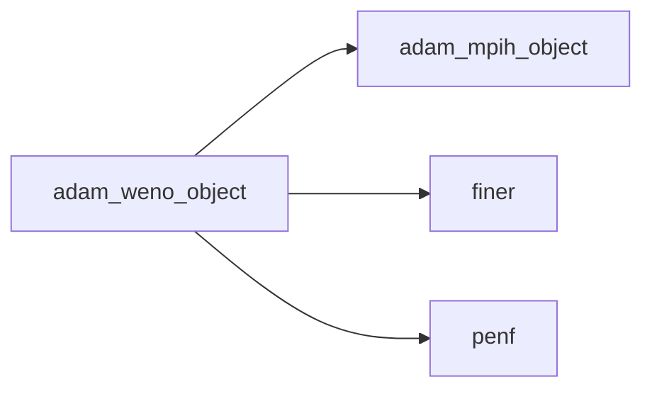

## Contents

- [weno_object](#weno-object)
- [initialize](#initialize)
- [load_from_file](#load-from-file)
- [reconstruct_upwind](#reconstruct-upwind)
- [initialize_centered_S1](#initialize-centered-s1)
- [initialize_centered_S2](#initialize-centered-s2)
- [initialize_centered_S3](#initialize-centered-s3)
- [initialize_centered_S4](#initialize-centered-s4)
- [initialize_upwind_S1](#initialize-upwind-s1)
- [initialize_upwind_S2](#initialize-upwind-s2)
- [initialize_upwind_S3](#initialize-upwind-s3)
- [initialize_upwind_S4](#initialize-upwind-s4)
- [initialize_upwind_S5](#initialize-upwind-s5)
- [compute_polynomials_upwind](#compute-polynomials-upwind)
- [compute_weights_upwind](#compute-weights-upwind)
- [weno_compute_convolution](#weno-compute-convolution)
- [weno_compute_polynomials_upwind](#weno-compute-polynomials-upwind)
- [weno_compute_weights_upwind](#weno-compute-weights-upwind)
- [weno_reconstruct_centered](#weno-reconstruct-centered)
- [weno_reconstruct_upwind](#weno-reconstruct-upwind)
- [description](#description)

## Variables

| Name | Type | Attributes | Description |
|------|------|------------|-------------|
| `S_MAX` | integer(kind=[I4P](/api/src/third_party/PENF/src/lib/penf_global_parameters_variables)) | parameter | Maximum number/dimensions of stencils. |
| `S_MAX_M1` | integer(kind=[I4P](/api/src/third_party/PENF/src/lib/penf_global_parameters_variables)) | parameter | Maximum number/dimensions of stencils minus 1. |
| `WENO_U_1` | character(len=8) | parameter | Parameter of WENO scheme, upwind   S=1, order 1. |
| `WENO_U_3` | character(len=8) | parameter | Parameter of WENO scheme, upwind   S=2, order 3. |
| `WENO_U_5` | character(len=8) | parameter | Parameter of WENO scheme, upwind   S=3, order 5. |
| `WENO_U_7` | character(len=8) | parameter | Parameter of WENO scheme, upwind   S=4, order 7. |
| `WENO_U_9` | character(len=8) | parameter | Parameter of WENO scheme, upwind   S=5, order 9. |
| `WENO_C_2` | character(len=8) | parameter | Parameter of WENO scheme, centered S=1, order 2. |
| `WENO_C_4` | character(len=8) | parameter | Parameter of WENO scheme, centered S=2, order 4. |
| `WENO_C_6` | character(len=8) | parameter | Parameter of WENO scheme, centered S=3, order 6. |
| `WENO_C_8` | character(len=8) | parameter | Parameter of WENO scheme, centered S=4, order 8. |
| `INI_SECTION_NAME` | character(len=4) | parameter | INI (config) file section name containing time configs. |

## Derived Types

### weno_object

WENO class definition.

#### Components

| Name | Type | Attributes | Description |
|------|------|------------|-------------|
| `mpih` | type([mpih_object](/api/src/third_party/FUNDAL/src/lib/fundal_mpih_object#mpih-object)) |  | MPI handler. |
| `scheme` | character(len=:) | allocatable | WENO scheme. |
| `S` | integer(kind=[I4P](/api/src/third_party/PENF/src/lib/penf_global_parameters_variables)) |  | Stencils number/dimensions, 2S-1 order of accuracy. |
| `is_centered` | logical |  | Centered scheme flag. |
| `a` | real(kind=[R8P](/api/src/third_party/PENF/src/lib/penf_global_parameters_variables)) | allocatable | Optimal weights                    [1:2,0:S-1,1:S]. |
| `p` | real(kind=[R8P](/api/src/third_party/PENF/src/lib/penf_global_parameters_variables)) | allocatable | Polinomials coefficients           [1:2,0:S-1,0:S-1,1:S]. |
| `d` | real(kind=[R8P](/api/src/third_party/PENF/src/lib/penf_global_parameters_variables)) | allocatable | Smoothness indicators coefficients [0:S-1,0:S-1,0:S-1,1:S]. |
| `c` | real(kind=[R8P](/api/src/third_party/PENF/src/lib/penf_global_parameters_variables)) | allocatable | Centered polynomials coefficients [1-S:S,1:S]. |
| `zeps` | real(kind=[R8P](/api/src/third_party/PENF/src/lib/penf_global_parameters_variables)) |  | Parameter for avoiding division by zero in computing IS. |
| `sodd` | integer(kind=[I4P](/api/src/third_party/PENF/src/lib/penf_global_parameters_variables)) |  | Branching between odd and even number of stencils (mod(S,2)). |
| `wexp` | integer(kind=[I4P](/api/src/third_party/PENF/src/lib/penf_global_parameters_variables)) |  | Exponent for growing the diffusive part of weights. |
| `ror_number` | integer(kind=[I4P](/api/src/third_party/PENF/src/lib/penf_global_parameters_variables)) |  | Number of ROR iterations. |
| `ror_schemes` | integer(kind=[I4P](/api/src/third_party/PENF/src/lib/penf_global_parameters_variables)) | allocatable | Scheme (S value) for each ROR iteration. |
| `ror_threshold` | real(kind=[R8P](/api/src/third_party/PENF/src/lib/penf_global_parameters_variables)) |  | ROR threshold triggering. |
| `ror_vars_number` | integer(kind=[I4P](/api/src/third_party/PENF/src/lib/penf_global_parameters_variables)) |  | Number of variables to check in ROR iterations. |
| `ror_ivar` | integer(kind=[I4P](/api/src/third_party/PENF/src/lib/penf_global_parameters_variables)) | allocatable | Index of each variable to check in ROR iterations. |
| `enable_ror_stats` | logical |  | Enable ror statistic saving. |
| `ib_reduction_extent` | integer(kind=[I4P](/api/src/third_party/PENF/src/lib/penf_global_parameters_variables)) |  | Extent of order reduction close to IB solids. |
| `ib_reduced_order` | integer(kind=[I4P](/api/src/third_party/PENF/src/lib/penf_global_parameters_variables)) |  | Reduced order (S value) close to IB solids. |
| `ror_stats` | integer(kind=[I4P](/api/src/third_party/PENF/src/lib/penf_global_parameters_variables)) | allocatable | ROR statistics. |
| `cell_scheme` | integer(kind=[I4P](/api/src/third_party/PENF/src/lib/penf_global_parameters_variables)) | allocatable | Local-cell WENO scheme: S everywhere, but modified close to solids. |

#### Type-Bound Procedures

| Name | Attributes | Description |
|------|------------|-------------|
| `description` | pass(self) | Return pretty-printed object description. |
| `initialize` | pass(self) | Initialize class. |
| `load_from_file` | pass(self) | Load config from file. |
| `reconstruct_upwind` | pass(self) | Return WENO upwind  reconstruction of 2S-1 order. |
| `initialize_centered_S1` | pass(self) | Initialize centered coefficients for S=1. |
| `initialize_centered_S2` | pass(self) | Initialize centered coefficients for S=2. |
| `initialize_centered_S3` | pass(self) | Initialize centered coefficients for S=3. |
| `initialize_centered_S4` | pass(self) | Initialize centered coefficients for S=4. |
| `initialize_upwind_S1` | pass(self) | Initialize upwind coefficients for S=1. |
| `initialize_upwind_S2` | pass(self) | Initialize upwind coefficients for S=2. |
| `initialize_upwind_S3` | pass(self) | Initialize upwind coefficients for S=3. |
| `initialize_upwind_S4` | pass(self) | Initialize upwind coefficients for S=4. |
| `initialize_upwind_S5` | pass(self) | Initialize upwind coefficients for S=5. |
| `compute_polynomials_upwind` | pass(self) | Compute WENO polynomials upwind. |
| `compute_weights_upwind` | pass(self) | Compute WENO weights. |

## Subroutines

### initialize

Initialize class.

```fortran
subroutine initialize(self, file_parameters, scheme, nb, ngc, ni, nj, nk)
```

**Arguments**

| Name | Type | Intent | Attributes | Description |
|------|------|--------|------------|-------------|
| `self` | class([weno_object](/api/src/lib/common/adam_weno_object#weno-object)) | inout |  | WENO object. |
| `file_parameters` | type([file_ini](/api/src/third_party/FiNeR/src/lib/finer_file_ini_t#file-ini)) | in | optional | Simulation parameters ini file handler. |
| `scheme` | character(len=*) | in | optional | WENO scheme. |
| `nb` | integer(kind=[I4P](/api/src/third_party/PENF/src/lib/penf_global_parameters_variables)) | in |  | Total blocks number for MPI. |
| `ngc` | integer(kind=[I4P](/api/src/third_party/PENF/src/lib/penf_global_parameters_variables)) | in |  | Number of ghost cells. |
| `ni` | integer(kind=[I4P](/api/src/third_party/PENF/src/lib/penf_global_parameters_variables)) | in |  | Number of cells in i direction. |
| `nj` | integer(kind=[I4P](/api/src/third_party/PENF/src/lib/penf_global_parameters_variables)) | in |  | Number of cells in j direction. |
| `nk` | integer(kind=[I4P](/api/src/third_party/PENF/src/lib/penf_global_parameters_variables)) | in |  | Number of cells in k direction. |

**Call graph**

```mermaid
flowchart TD
  add_node["add_node"] --> initialize["initialize"]
  analize["analize"] --> initialize["initialize"]
  build_connectivity["build_connectivity"] --> initialize["initialize"]
  distribute_facets["distribute_facets"] --> initialize["initialize"]
  distribute_facets_tree["distribute_facets_tree"] --> initialize["initialize"]
  export_vtk_file["export_vtk_file"] --> initialize["initialize"]
  initialize["initialize"] --> initialize["initialize"]
  initialize["initialize"] --> initialize["initialize"]
  initialize["initialize"] --> initialize["initialize"]
  initialize["initialize"] --> initialize["initialize"]
  initialize["initialize"] --> initialize["initialize"]
  initialize["initialize"] --> initialize["initialize"]
  initialize["initialize"] --> initialize["initialize"]
  initialize["initialize"] --> initialize["initialize"]
  initialize["initialize"] --> initialize["initialize"]
  initialize["initialize"] --> initialize["initialize"]
  initialize["initialize"] --> initialize["initialize"]
  initialize["initialize"] --> initialize["initialize"]
  initialize["initialize"] --> initialize["initialize"]
  initialize["initialize"] --> initialize["initialize"]
  initialize["initialize"] --> initialize["initialize"]
  initialize["initialize"] --> initialize["initialize"]
  initialize["initialize"] --> initialize["initialize"]
  initialize["initialize"] --> initialize["initialize"]
  initialize["initialize"] --> initialize["initialize"]
  initialize["initialize"] --> initialize["initialize"]
  initialize["initialize"] --> initialize["initialize"]
  initialize["initialize"] --> initialize["initialize"]
  initialize["initialize"] --> initialize["initialize"]
  initialize["initialize"] --> initialize["initialize"]
  initialize["initialize"] --> initialize["initialize"]
  initialize["initialize"] --> initialize["initialize"]
  initialize["initialize"] --> initialize["initialize"]
  initialize["initialize"] --> initialize["initialize"]
  initialize["initialize"] --> initialize["initialize"]
  initialize["initialize"] --> initialize["initialize"]
  initialize["initialize"] --> initialize["initialize"]
  initialize["initialize"] --> initialize["initialize"]
  initialize["initialize"] --> initialize["initialize"]
  initialize["initialize"] --> initialize["initialize"]
  initialize["initialize"] --> initialize["initialize"]
  initialize["initialize"] --> initialize["initialize"]
  initialize["initialize"] --> initialize["initialize"]
  initialize["initialize"] --> initialize["initialize"]
  initialize["initialize"] --> initialize["initialize"]
  initialize["initialize"] --> initialize["initialize"]
  initialize["initialize"] --> initialize["initialize"]
  initialize["initialize"] --> initialize["initialize"]
  initialize["initialize"] --> initialize["initialize"]
  initialize["initialize"] --> initialize["initialize"]
  initialize["initialize"] --> initialize["initialize"]
  initialize["initialize"] --> initialize["initialize"]
  initialize["initialize"] --> initialize["initialize"]
  initialize["initialize"] --> initialize["initialize"]
  initialize["initialize"] --> initialize["initialize"]
  initialize["initialize"] --> initialize["initialize"]
  initialize["initialize"] --> initialize["initialize"]
  initialize["initialize"] --> initialize["initialize"]
  initialize["initialize"] --> initialize["initialize"]
  initialize["initialize"] --> initialize["initialize"]
  initialize["initialize"] --> initialize["initialize"]
  initialize["initialize"] --> initialize["initialize"]
  initialize["initialize"] --> initialize["initialize"]
  initialize["initialize"] --> initialize["initialize"]
  initialize["initialize"] --> initialize["initialize"]
  initialize["initialize"] --> initialize["initialize"]
  initialize["initialize"] --> initialize["initialize"]
  initialize["initialize"] --> initialize["initialize"]
  initialize["initialize"] --> initialize["initialize"]
  initialize["initialize"] --> initialize["initialize"]
  initialize["initialize"] --> initialize["initialize"]
  initialize["initialize"] --> initialize["initialize"]
  initialize["initialize"] --> initialize["initialize"]
  initialize["initialize"] --> initialize["initialize"]
  initialize["initialize"] --> initialize["initialize"]
  initialize["initialize"] --> initialize["initialize"]
  initialize["initialize"] --> initialize["initialize"]
  initialize["initialize"] --> initialize["initialize"]
  initialize_common["initialize_common"] --> initialize["initialize"]
  initialize_common["initialize_common"] --> initialize["initialize"]
  initialize_common["initialize_common"] --> initialize["initialize"]
  initialize_common["initialize_common"] --> initialize["initialize"]
  load_from_file["load_from_file"] --> initialize["initialize"]
  load_from_file["load_from_file"] --> initialize["initialize"]
  open_file["open_file"] --> initialize["initialize"]
  open_file["open_file"] --> initialize["initialize"]
  open_file["open_file"] --> initialize["initialize"]
  resize["resize"] --> initialize["initialize"]
  save_into_file["save_into_file"] --> initialize["initialize"]
  save_vtk["save_vtk"] --> initialize["initialize"]
  simulate["simulate"] --> initialize["initialize"]
  simulate["simulate"] --> initialize["initialize"]
  simulate["simulate"] --> initialize["initialize"]
  simulate["simulate"] --> initialize["initialize"]
  simulate["simulate"] --> initialize["initialize"]
  simulate["simulate"] --> initialize["initialize"]
  simulate["simulate"] --> initialize["initialize"]
  test_stress["test_stress"] --> initialize["initialize"]
  initialize["initialize"] --> allocate_coefficients["allocate_coefficients"]
  initialize["initialize"] --> description["description"]
  initialize["initialize"] --> error_stop["error_stop"]
  initialize["initialize"] --> initialize["initialize"]
  initialize["initialize"] --> initialize_centered_S1["initialize_centered_S1"]
  initialize["initialize"] --> initialize_centered_S2["initialize_centered_S2"]
  initialize["initialize"] --> initialize_centered_S3["initialize_centered_S3"]
  initialize["initialize"] --> initialize_centered_S4["initialize_centered_S4"]
  initialize["initialize"] --> initialize_upwind_S1["initialize_upwind_S1"]
  initialize["initialize"] --> initialize_upwind_S2["initialize_upwind_S2"]
  initialize["initialize"] --> initialize_upwind_S3["initialize_upwind_S3"]
  initialize["initialize"] --> initialize_upwind_S4["initialize_upwind_S4"]
  initialize["initialize"] --> initialize_upwind_S5["initialize_upwind_S5"]
  initialize["initialize"] --> load_from_file["load_from_file"]
  initialize["initialize"] --> print_message["print_message"]
  style initialize fill:#3e63dd,stroke:#99b,stroke-width:2px
```

### load_from_file

Load config from file.

```fortran
subroutine load_from_file(self, file_parameters, go_on_fail)
```

**Arguments**

| Name | Type | Intent | Attributes | Description |
|------|------|--------|------------|-------------|
| `self` | class([weno_object](/api/src/lib/common/adam_weno_object#weno-object)) | inout |  | WENO object. |
| `file_parameters` | type([file_ini](/api/src/third_party/FiNeR/src/lib/finer_file_ini_t#file-ini)) | in |  | Simulation parameters ini file handler. |
| `go_on_fail` | logical | in | optional | Go on if load fails. |

**Call graph**

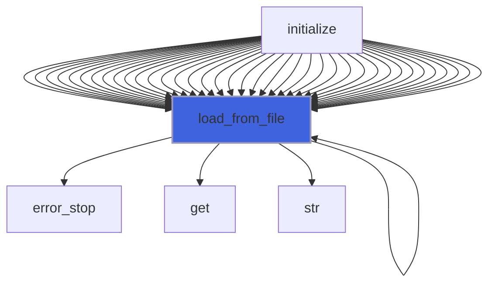

### reconstruct_upwind

Reconstruct by WENO upwind method of 2S-1 order.

**Attributes**: pure

```fortran
subroutine reconstruct_upwind(self, S, v, vr)
```

**Arguments**

| Name | Type | Intent | Attributes | Description |
|------|------|--------|------------|-------------|
| `self` | class([weno_object](/api/src/lib/common/adam_weno_object#weno-object)) | in |  | WENO object. |
| `S` | integer(kind=[I4P](/api/src/third_party/PENF/src/lib/penf_global_parameters_variables)) | in |  | Number of stencils used. |
| `v` | real(kind=[R8P](/api/src/third_party/PENF/src/lib/penf_global_parameters_variables)) | in |  | Variables to be reconstructed. |
| `vr` | real(kind=[R8P](/api/src/third_party/PENF/src/lib/penf_global_parameters_variables)) | out |  | Left and right (1,2) interface value of reconstructed v. |

**Call graph**

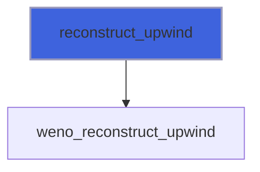

### initialize_centered_S1

Initialize coefficients for centered S=1, 2S=2th order.

```fortran
subroutine initialize_centered_S1(self)
```

**Arguments**

| Name | Type | Intent | Attributes | Description |
|------|------|--------|------------|-------------|
| `self` | class([weno_object](/api/src/lib/common/adam_weno_object#weno-object)) | inout |  | WENO object. |

**Call graph**

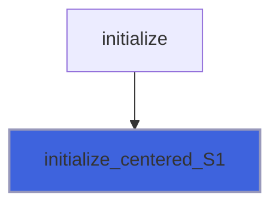

### initialize_centered_S2

Initialize coefficients for centered S=2, 2S=4th order.

```fortran
subroutine initialize_centered_S2(self)
```

**Arguments**

| Name | Type | Intent | Attributes | Description |
|------|------|--------|------------|-------------|
| `self` | class([weno_object](/api/src/lib/common/adam_weno_object#weno-object)) | inout |  | WENO object. |

**Call graph**


### initialize_centered_S3

Initialize coefficients for centered S=3, 2S=6th order.

```fortran
subroutine initialize_centered_S3(self)
```

**Arguments**

| Name | Type | Intent | Attributes | Description |
|------|------|--------|------------|-------------|
| `self` | class([weno_object](/api/src/lib/common/adam_weno_object#weno-object)) | inout |  | WENO object. |

**Call graph**


### initialize_centered_S4

Initialize coefficients for centered S=4, 2S=8th order.

```fortran
subroutine initialize_centered_S4(self)
```

**Arguments**

| Name | Type | Intent | Attributes | Description |
|------|------|--------|------------|-------------|
| `self` | class([weno_object](/api/src/lib/common/adam_weno_object#weno-object)) | inout |  | WENO object. |

**Call graph**


### initialize_upwind_S1

Initialize coefficients for upwind S=1.

```fortran
subroutine initialize_upwind_S1(self)
```

**Arguments**

| Name | Type | Intent | Attributes | Description |
|------|------|--------|------------|-------------|
| `self` | class([weno_object](/api/src/lib/common/adam_weno_object#weno-object)) | inout |  | WENO object. |

**Call graph**


### initialize_upwind_S2

Initialize coefficients for upwind S=2, 2S-1=3rd order.

```fortran
subroutine initialize_upwind_S2(self)
```

**Arguments**

| Name | Type | Intent | Attributes | Description |
|------|------|--------|------------|-------------|
| `self` | class([weno_object](/api/src/lib/common/adam_weno_object#weno-object)) | inout |  | WENO object. |

**Call graph**


### initialize_upwind_S3

Initialize coefficients for upwind S=3, 2S-1=5th order.

```fortran
subroutine initialize_upwind_S3(self)
```

**Arguments**

| Name | Type | Intent | Attributes | Description |
|------|------|--------|------------|-------------|
| `self` | class([weno_object](/api/src/lib/common/adam_weno_object#weno-object)) | inout |  | WENO object. |

**Call graph**


### initialize_upwind_S4

Initialize coefficients for upwind S=4, 2S-1=7th order.

```fortran
subroutine initialize_upwind_S4(self)
```

**Arguments**

| Name | Type | Intent | Attributes | Description |
|------|------|--------|------------|-------------|
| `self` | class([weno_object](/api/src/lib/common/adam_weno_object#weno-object)) | inout |  | WENO object. |

**Call graph**


### initialize_upwind_S5

Initialize coefficients for upwind S=5, 2S-1=9th order.

```fortran
subroutine initialize_upwind_S5(self)
```

**Arguments**

| Name | Type | Intent | Attributes | Description |
|------|------|--------|------------|-------------|
| `self` | class([weno_object](/api/src/lib/common/adam_weno_object#weno-object)) | inout |  | WENO object. |

**Call graph**


### compute_polynomials_upwind

Compute WENO polynomials upwind.

**Attributes**: pure

```fortran
subroutine compute_polynomials_upwind(self, S, v, vp)
```

**Arguments**

| Name | Type | Intent | Attributes | Description |
|------|------|--------|------------|-------------|
| `self` | class([weno_object](/api/src/lib/common/adam_weno_object#weno-object)) | in |  | WENO object. |
| `S` | integer(kind=[I4P](/api/src/third_party/PENF/src/lib/penf_global_parameters_variables)) | in |  | Number of stencils used. |
| `v` | real(kind=[R8P](/api/src/third_party/PENF/src/lib/penf_global_parameters_variables)) | in |  | Variable to be reconstructed. |
| `vp` | real(kind=[R8P](/api/src/third_party/PENF/src/lib/penf_global_parameters_variables)) | out |  | Polynomial reconstructions. |

**Call graph**

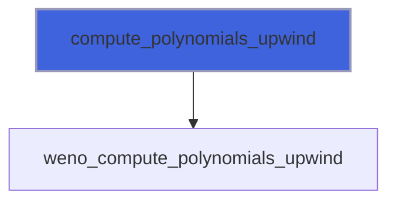

### compute_weights_upwind

Compute WENO weights upwind.

**Attributes**: pure

```fortran
subroutine compute_weights_upwind(self, S, v, w)
```

**Arguments**

| Name | Type | Intent | Attributes | Description |
|------|------|--------|------------|-------------|
| `self` | class([weno_object](/api/src/lib/common/adam_weno_object#weno-object)) | in |  | WENO object. |
| `S` | integer(kind=[I4P](/api/src/third_party/PENF/src/lib/penf_global_parameters_variables)) | in |  | Number of stencils used. |
| `v` | real(kind=[R8P](/api/src/third_party/PENF/src/lib/penf_global_parameters_variables)) | in |  | Variable to be reconstructed. |
| `w` | real(kind=[R8P](/api/src/third_party/PENF/src/lib/penf_global_parameters_variables)) | out |  | Weights of the stencils. |

**Call graph**

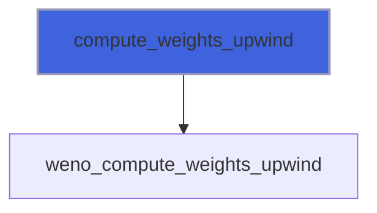

### weno_compute_convolution

Compute WENO convulution, non TBP.

**Attributes**: pure

```fortran
subroutine weno_compute_convolution(S, vp, w, vr)
```

**Arguments**

| Name | Type | Intent | Attributes | Description |
|------|------|--------|------------|-------------|
| `S` | integer(kind=[I4P](/api/src/third_party/PENF/src/lib/penf_global_parameters_variables)) | in |  | Number of stencils used. |
| `vp` | real(kind=[R8P](/api/src/third_party/PENF/src/lib/penf_global_parameters_variables)) | in |  | Polynomial reconstructions. |
| `w` | real(kind=[R8P](/api/src/third_party/PENF/src/lib/penf_global_parameters_variables)) | in |  | Weights of the stencils. |
| `vr` | real(kind=[R8P](/api/src/third_party/PENF/src/lib/penf_global_parameters_variables)) | out |  | Left and right (1,2) interface value of reconstructed v. |

**Call graph**

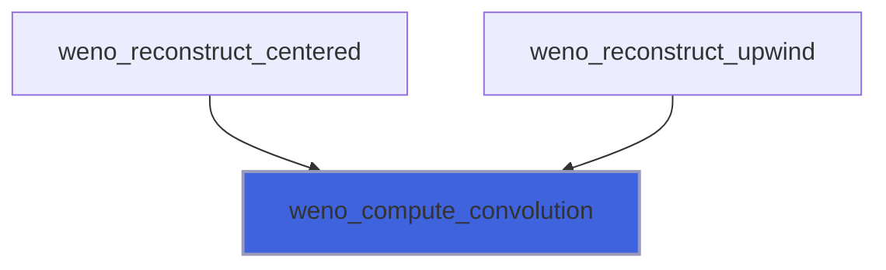

### weno_compute_polynomials_upwind

Compute WENO polynomials upwind, non TBP.

**Attributes**: pure

```fortran
subroutine weno_compute_polynomials_upwind(S, weno_p, v, vp)
```

**Arguments**

| Name | Type | Intent | Attributes | Description |
|------|------|--------|------------|-------------|
| `S` | integer(kind=[I4P](/api/src/third_party/PENF/src/lib/penf_global_parameters_variables)) | in |  | Number of stencils used. |
| `weno_p` | real(kind=[R8P](/api/src/third_party/PENF/src/lib/penf_global_parameters_variables)) | in |  | Polinomials coefficients. |
| `v` | real(kind=[R8P](/api/src/third_party/PENF/src/lib/penf_global_parameters_variables)) | in |  | Variable to be reconstructed. |
| `vp` | real(kind=[R8P](/api/src/third_party/PENF/src/lib/penf_global_parameters_variables)) | out |  | Polynomial reconstructions. |

**Call graph**

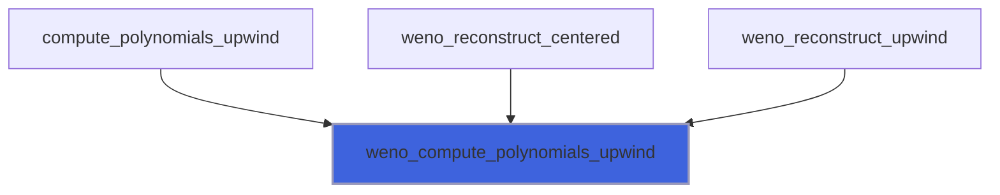

### weno_compute_weights_upwind

Compute WENO weights, non TBP.

**Attributes**: pure

```fortran
subroutine weno_compute_weights_upwind(S, weno_a, weno_d, weno_zeps, v, w)
```

**Arguments**

| Name | Type | Intent | Attributes | Description |
|------|------|--------|------------|-------------|
| `S` | integer(kind=[I4P](/api/src/third_party/PENF/src/lib/penf_global_parameters_variables)) | in |  | Number of stencils used. |
| `weno_a` | real(kind=[R8P](/api/src/third_party/PENF/src/lib/penf_global_parameters_variables)) | in |  | Optimal weights. |
| `weno_d` | real(kind=[R8P](/api/src/third_party/PENF/src/lib/penf_global_parameters_variables)) | in |  | Smoothness indicators coefficients. |
| `weno_zeps` | real(kind=[R8P](/api/src/third_party/PENF/src/lib/penf_global_parameters_variables)) | in |  | Parameter for avoiding division by zero in computing IS. |
| `v` | real(kind=[R8P](/api/src/third_party/PENF/src/lib/penf_global_parameters_variables)) | in |  | Variable to be reconstructed. |
| `w` | real(kind=[R8P](/api/src/third_party/PENF/src/lib/penf_global_parameters_variables)) | out |  | Weights of the stencils. |

**Call graph**

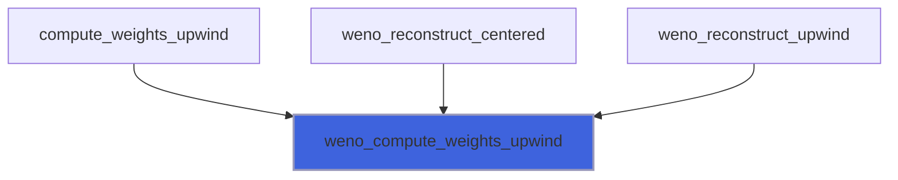

### weno_reconstruct_centered

Reconstruct by WENO centered method of 2S order, non TBP.

**Attributes**: pure

```fortran
subroutine weno_reconstruct_centered(S, weno_a, weno_p, weno_d, weno_c, weno_zeps, v, vr)
```

**Arguments**

| Name | Type | Intent | Attributes | Description |
|------|------|--------|------------|-------------|
| `S` | integer(kind=[I4P](/api/src/third_party/PENF/src/lib/penf_global_parameters_variables)) | in |  | Number of stencils used. |
| `weno_a` | real(kind=[R8P](/api/src/third_party/PENF/src/lib/penf_global_parameters_variables)) | in |  | Optimal weights. |
| `weno_p` | real(kind=[R8P](/api/src/third_party/PENF/src/lib/penf_global_parameters_variables)) | in |  | Polinomials coefficients. |
| `weno_d` | real(kind=[R8P](/api/src/third_party/PENF/src/lib/penf_global_parameters_variables)) | in |  | Smoothness indicators coefficients. |
| `weno_c` | real(kind=[R8P](/api/src/third_party/PENF/src/lib/penf_global_parameters_variables)) | in |  | Centered polinomials coefficients. |
| `weno_zeps` | real(kind=[R8P](/api/src/third_party/PENF/src/lib/penf_global_parameters_variables)) | in |  | Parameter for avoiding division by zero in computing IS. |
| `v` | real(kind=[R8P](/api/src/third_party/PENF/src/lib/penf_global_parameters_variables)) | in |  | Variables to be reconstructed. |
| `vr` | real(kind=[R8P](/api/src/third_party/PENF/src/lib/penf_global_parameters_variables)) | out |  | Left and right (1,2) interface value of reconstructed v. |

**Call graph**

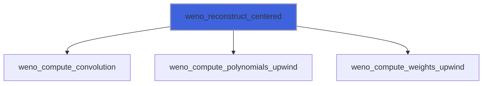

### weno_reconstruct_upwind

Reconstruct by WENO upwind method of 2S-1 order, non TBP.

**Attributes**: pure

```fortran
subroutine weno_reconstruct_upwind(S, weno_a, weno_p, weno_d, weno_zeps, v, vr)
```

**Arguments**

| Name | Type | Intent | Attributes | Description |
|------|------|--------|------------|-------------|
| `S` | integer(kind=[I4P](/api/src/third_party/PENF/src/lib/penf_global_parameters_variables)) | in |  | Number of stencils used. |
| `weno_a` | real(kind=[R8P](/api/src/third_party/PENF/src/lib/penf_global_parameters_variables)) | in |  | Optimal weights. |
| `weno_p` | real(kind=[R8P](/api/src/third_party/PENF/src/lib/penf_global_parameters_variables)) | in |  | Polinomials coefficients. |
| `weno_d` | real(kind=[R8P](/api/src/third_party/PENF/src/lib/penf_global_parameters_variables)) | in |  | Smoothness indicators coefficients. |
| `weno_zeps` | real(kind=[R8P](/api/src/third_party/PENF/src/lib/penf_global_parameters_variables)) | in |  | Parameter for avoiding division by zero in computing IS. |
| `v` | real(kind=[R8P](/api/src/third_party/PENF/src/lib/penf_global_parameters_variables)) | in |  | Variables to be reconstructed. |
| `vr` | real(kind=[R8P](/api/src/third_party/PENF/src/lib/penf_global_parameters_variables)) | out |  | Left and right (1,2) interface value of reconstructed v. |

**Call graph**

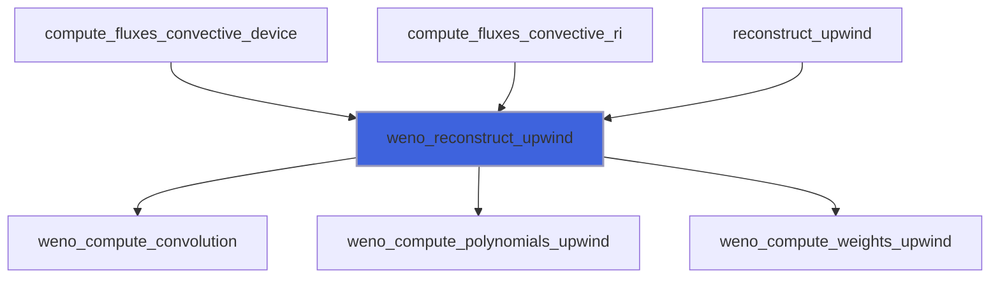

## Functions

### description

Return a pretty-formatted object description.

**Attributes**: pure

**Returns**: `character(len=:)`

```fortran
function description(self) result(desc)
```

**Arguments**

| Name | Type | Intent | Attributes | Description |
|------|------|--------|------------|-------------|
| `self` | class([weno_object](/api/src/lib/common/adam_weno_object#weno-object)) | in |  | WENO object. |

**Call graph**

```mermaid
flowchart TD
  description["description"] --> description["description"]
  description["description"] --> description["description"]
  description["description"] --> description["description"]
  initialize["initialize"] --> description["description"]
  initialize["initialize"] --> description["description"]
  initialize["initialize"] --> description["description"]
  initialize["initialize"] --> description["description"]
  initialize["initialize"] --> description["description"]
  initialize["initialize"] --> description["description"]
  initialize["initialize"] --> description["description"]
  initialize["initialize"] --> description["description"]
  initialize["initialize"] --> description["description"]
  initialize["initialize"] --> description["description"]
  initialize["initialize"] --> description["description"]
  initialize["initialize"] --> description["description"]
  initialize["initialize"] --> description["description"]
  initialize["initialize"] --> description["description"]
  initialize["initialize"] --> description["description"]
  initialize["initialize"] --> description["description"]
  initialize["initialize"] --> description["description"]
  initialize["initialize"] --> description["description"]
  initialize["initialize"] --> description["description"]
  initialize["initialize"] --> description["description"]
  initialize["initialize"] --> description["description"]
  initialize["initialize"] --> description["description"]
  initialize["initialize"] --> description["description"]
  initialize["initialize"] --> description["description"]
  initialize["initialize"] --> description["description"]
  initialize["initialize"] --> description["description"]
  initialize["initialize"] --> description["description"]
  initialize["initialize"] --> description["description"]
  initialize["initialize"] --> description["description"]
  initialize["initialize"] --> description["description"]
  initialize["initialize"] --> description["description"]
  initialize["initialize"] --> description["description"]
  initialize["initialize"] --> description["description"]
  initialize["initialize"] --> description["description"]
  initialize["initialize"] --> description["description"]
  initialize["initialize"] --> description["description"]
  initialize["initialize"] --> description["description"]
  initialize["initialize"] --> description["description"]
  initialize["initialize"] --> description["description"]
  initialize["initialize"] --> description["description"]
  initialize["initialize"] --> description["description"]
  initialize["initialize"] --> description["description"]
  initialize["initialize"] --> description["description"]
  initialize["initialize"] --> description["description"]
  description["description"] --> str["str"]
  style description fill:#3e63dd,stroke:#99b,stroke-width:2px
```
