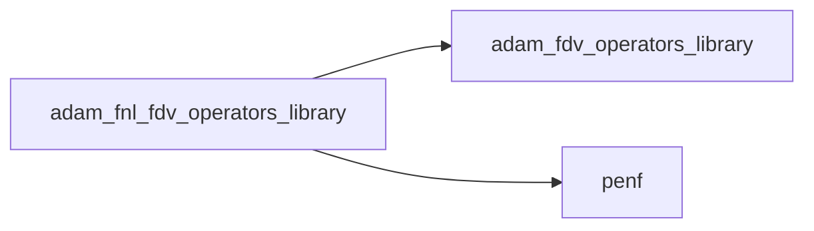
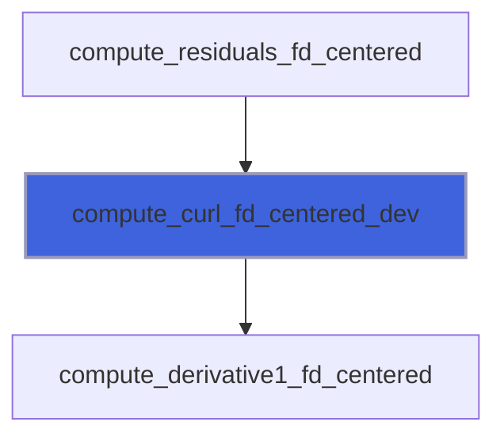
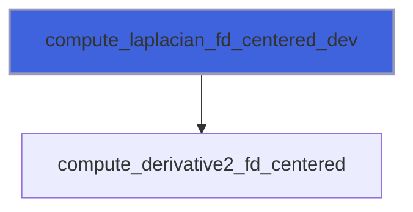
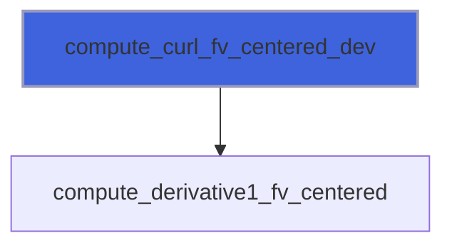
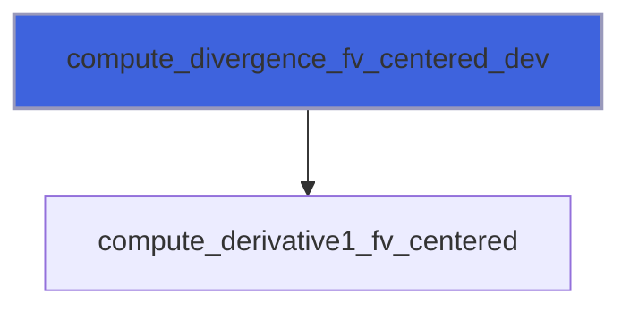
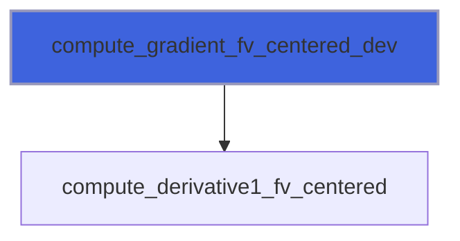

# adam_fnl_fdv_operators_library

> ADAM, finite difference/volume operators approximations library, FNL device backend.

**Source**: `src/lib/fnl/adam_fnl_fdv_operators_library.F90`

**Dependencies**



## Contents

- [compute_curl_fd_centered_dev](#compute-curl-fd-centered-dev)
- [compute_divergence_fd_centered_dev](#compute-divergence-fd-centered-dev)
- [compute_gradient_fd_centered_dev](#compute-gradient-fd-centered-dev)
- [compute_laplacian_fd_centered_dev](#compute-laplacian-fd-centered-dev)
- [compute_curl_fv_centered_dev](#compute-curl-fv-centered-dev)
- [compute_divergence_fv_centered_dev](#compute-divergence-fv-centered-dev)
- [compute_gradient_fv_centered_dev](#compute-gradient-fv-centered-dev)
- [compute_laplacian_fv_centered_dev](#compute-laplacian-fv-centered-dev)

## Subroutines

### compute_curl_fd_centered_dev

Compute curl of q vector field with finite difference centered scheme.

**Attributes**: pure

```fortran
subroutine compute_curl_fd_centered_dev(s, dxyz, qsx_y, qsx_z, qsy_x, qsy_z, qsz_x, qsz_y, curl)
```

**Arguments**

| Name | Type | Intent | Attributes | Description |
|------|------|--------|------------|-------------|
| `s` | integer(kind=[I4P](/api/src/third_party/PENF/src/lib/penf_global_parameters_variables)) | in |  | Stencil len, half of accuracy order. |
| `dxyz` | real(kind=[R8P](/api/src/third_party/PENF/src/lib/penf_global_parameters_variables)) | in |  | Space steps [1:3]. |
| `qsx_y` | real(kind=[R8P](/api/src/third_party/PENF/src/lib/penf_global_parameters_variables)) | in |  | Y component of vector field over the x stencil. |
| `qsx_z` | real(kind=[R8P](/api/src/third_party/PENF/src/lib/penf_global_parameters_variables)) | in |  | Z component of vector field over the x stencil. |
| `qsy_x` | real(kind=[R8P](/api/src/third_party/PENF/src/lib/penf_global_parameters_variables)) | in |  | X component of vector field over the y stencil. |
| `qsy_z` | real(kind=[R8P](/api/src/third_party/PENF/src/lib/penf_global_parameters_variables)) | in |  | Z component of vector field over the y stencil. |
| `qsz_x` | real(kind=[R8P](/api/src/third_party/PENF/src/lib/penf_global_parameters_variables)) | in |  | X component of vector field over the z stencil. |
| `qsz_y` | real(kind=[R8P](/api/src/third_party/PENF/src/lib/penf_global_parameters_variables)) | in |  | Y component of vector field over the z stencil. |
| `curl` | real(kind=[R8P](/api/src/third_party/PENF/src/lib/penf_global_parameters_variables)) | out |  | Curl of q [1:3]. |

**Call graph**



### compute_divergence_fd_centered_dev

Compute divergence of q vector field with finite difference centered scheme.
 FNL device backend: q has variables as last dimension [1-s:1+s,1-s:1+s,1-s:1+s,1:3].

**Attributes**: pure

```fortran
subroutine compute_divergence_fd_centered_dev(s, dxyz, q, divergence)
```

**Arguments**

| Name | Type | Intent | Attributes | Description |
|------|------|--------|------------|-------------|
| `s` | integer(kind=[I4P](/api/src/third_party/PENF/src/lib/penf_global_parameters_variables)) | in |  | Stencil len, half of accuracy order. |
| `dxyz` | real(kind=[R8P](/api/src/third_party/PENF/src/lib/penf_global_parameters_variables)) | in |  | Space steps [1:3]. |
| `q` | real(kind=[R8P](/api/src/third_party/PENF/src/lib/penf_global_parameters_variables)) | in |  | Vector field over the stencil [1-s:1+s,1-s:1+s,1-s:1+s,1:3]. |
| `divergence` | real(kind=[R8P](/api/src/third_party/PENF/src/lib/penf_global_parameters_variables)) | out |  | Divergence of q. |

**Call graph**


### compute_gradient_fd_centered_dev

Compute gradient of q scalar field with finite difference centered scheme.

**Attributes**: pure

```fortran
subroutine compute_gradient_fd_centered_dev(s, dxyz, q, gradient)
```

**Arguments**

| Name | Type | Intent | Attributes | Description |
|------|------|--------|------------|-------------|
| `s` | integer(kind=[I4P](/api/src/third_party/PENF/src/lib/penf_global_parameters_variables)) | in |  | Stencil len, half of accuracy order. |
| `dxyz` | real(kind=[R8P](/api/src/third_party/PENF/src/lib/penf_global_parameters_variables)) | in |  | Space steps [1:3]. |
| `q` | real(kind=[R8P](/api/src/third_party/PENF/src/lib/penf_global_parameters_variables)) | in |  | Scalar field over the stencil [1-s:1+s,1-s:1+s,1-s:1+s]. |
| `gradient` | real(kind=[R8P](/api/src/third_party/PENF/src/lib/penf_global_parameters_variables)) | out |  | Gradient of q [1:3]. |

**Call graph**


### compute_laplacian_fd_centered_dev

Compute laplacian of q scalar field with finite difference centered scheme.

**Attributes**: pure

```fortran
subroutine compute_laplacian_fd_centered_dev(s, dxyz, q, laplacian)
```

**Arguments**

| Name | Type | Intent | Attributes | Description |
|------|------|--------|------------|-------------|
| `s` | integer(kind=[I4P](/api/src/third_party/PENF/src/lib/penf_global_parameters_variables)) | in |  | Stencil len, half of accuracy order. |
| `dxyz` | real(kind=[R8P](/api/src/third_party/PENF/src/lib/penf_global_parameters_variables)) | in |  | Space steps [1:3]. |
| `q` | real(kind=[R8P](/api/src/third_party/PENF/src/lib/penf_global_parameters_variables)) | in |  | Scalar field over the stencil [1-s:1+s,1-s:1+s,1-s:1+s]. |
| `laplacian` | real(kind=[R8P](/api/src/third_party/PENF/src/lib/penf_global_parameters_variables)) | out |  | Laplacian of q. |

**Call graph**



### compute_curl_fv_centered_dev

Compute curl of q vector field with finite volume centered scheme.
 FNL device backend: q has variables as last dimension [1-s:1+s,1-s:1+s,1-s:1+s,1:3].

**Attributes**: pure

```fortran
subroutine compute_curl_fv_centered_dev(s, dxyz, q, curl)
```

**Arguments**

| Name | Type | Intent | Attributes | Description |
|------|------|--------|------------|-------------|
| `s` | integer(kind=[I4P](/api/src/third_party/PENF/src/lib/penf_global_parameters_variables)) | in |  | Stencil len, half of accuracy order. |
| `dxyz` | real(kind=[R8P](/api/src/third_party/PENF/src/lib/penf_global_parameters_variables)) | in |  | Space steps [1:3]. |
| `q` | real(kind=[R8P](/api/src/third_party/PENF/src/lib/penf_global_parameters_variables)) | in |  | Vector field over the stencil [1-s:1+s,1-s:1+s,1-s:1+s,1:3]. |
| `curl` | real(kind=[R8P](/api/src/third_party/PENF/src/lib/penf_global_parameters_variables)) | out |  | Curl of q [1:3]. |

**Call graph**



### compute_divergence_fv_centered_dev

Compute divergence of q vector field with finite volume centered scheme.
 FNL device backend: q has variables as last dimension [1-s:1+s,1-s:1+s,1-s:1+s,1:3].

**Attributes**: pure

```fortran
subroutine compute_divergence_fv_centered_dev(s, dxyz, q, divergence)
```

**Arguments**

| Name | Type | Intent | Attributes | Description |
|------|------|--------|------------|-------------|
| `s` | integer(kind=[I4P](/api/src/third_party/PENF/src/lib/penf_global_parameters_variables)) | in |  | Stencil len, half of accuracy order. |
| `dxyz` | real(kind=[R8P](/api/src/third_party/PENF/src/lib/penf_global_parameters_variables)) | in |  | Space steps [1:3]. |
| `q` | real(kind=[R8P](/api/src/third_party/PENF/src/lib/penf_global_parameters_variables)) | in |  | Vector field over the stencil [1-s:1+s,1-s:1+s,1-s:1+s,1:3]. |
| `divergence` | real(kind=[R8P](/api/src/third_party/PENF/src/lib/penf_global_parameters_variables)) | out |  | Divergence of q. |

**Call graph**



### compute_gradient_fv_centered_dev

Compute gradient of q scalar field with finite volume centered scheme.

**Attributes**: pure

```fortran
subroutine compute_gradient_fv_centered_dev(s, dxyz, q, gradient)
```

**Arguments**

| Name | Type | Intent | Attributes | Description |
|------|------|--------|------------|-------------|
| `s` | integer(kind=[I4P](/api/src/third_party/PENF/src/lib/penf_global_parameters_variables)) | in |  | Stencil len, half of accuracy order. |
| `dxyz` | real(kind=[R8P](/api/src/third_party/PENF/src/lib/penf_global_parameters_variables)) | in |  | Space steps [1:3]. |
| `q` | real(kind=[R8P](/api/src/third_party/PENF/src/lib/penf_global_parameters_variables)) | in |  | Scalar field over the stencil [1-s:1+s,1-s:1+s,1-s:1+s]. |
| `gradient` | real(kind=[R8P](/api/src/third_party/PENF/src/lib/penf_global_parameters_variables)) | out |  | Gradient of q [1:3]. |

**Call graph**



### compute_laplacian_fv_centered_dev

Compute laplacian of q scalar field with finite volume centered scheme.

**Attributes**: pure

```fortran
subroutine compute_laplacian_fv_centered_dev(s, dxyz, q, laplacian)
```

**Arguments**

| Name | Type | Intent | Attributes | Description |
|------|------|--------|------------|-------------|
| `s` | integer(kind=[I4P](/api/src/third_party/PENF/src/lib/penf_global_parameters_variables)) | in |  | Stencil len, half of accuracy order. |
| `dxyz` | real(kind=[R8P](/api/src/third_party/PENF/src/lib/penf_global_parameters_variables)) | in |  | Space steps [1:3]. |
| `q` | real(kind=[R8P](/api/src/third_party/PENF/src/lib/penf_global_parameters_variables)) | in |  | Scalar field over the stencil [1-s:1+s,1-s:1+s,1-s:1+s]. |
| `laplacian` | real(kind=[R8P](/api/src/third_party/PENF/src/lib/penf_global_parameters_variables)) | out |  | Laplacian of q. |

**Call graph**


