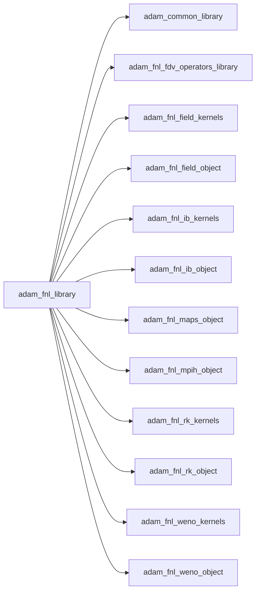

# adam_fnl_library

> ADAM FNL library, entry for all FNL (and common) classes and libraries.

**Source**: `src/lib/fnl/adam_fnl_library.F90`

**Dependencies**

```mermaid
graph LR
  adam_fnl_library["adam_fnl_library"] --> adam_common_library["adam_common_library"]
  adam_fnl_library["adam_fnl_library"] --> adam_fnl_fdv_operators_library["adam_fnl_fdv_operators_library"]
  adam_fnl_library["adam_fnl_library"] --> adam_fnl_field_kernels["adam_fnl_field_kernels"]
  adam_fnl_library["adam_fnl_library"] --> adam_fnl_field_object["adam_fnl_field_object"]
  adam_fnl_library["adam_fnl_library"] --> adam_fnl_ib_kernels["adam_fnl_ib_kernels"]
  adam_fnl_library["adam_fnl_library"] --> adam_fnl_ib_object["adam_fnl_ib_object"]
  adam_fnl_library["adam_fnl_library"] --> adam_fnl_maps_object["adam_fnl_maps_object"]
  adam_fnl_library["adam_fnl_library"] --> adam_fnl_mpih_object["adam_fnl_mpih_object"]
  adam_fnl_library["adam_fnl_library"] --> adam_fnl_rk_kernels["adam_fnl_rk_kernels"]
  adam_fnl_library["adam_fnl_library"] --> adam_fnl_rk_object["adam_fnl_rk_object"]
  adam_fnl_library["adam_fnl_library"] --> adam_fnl_weno_kernels["adam_fnl_weno_kernels"]
  adam_fnl_library["adam_fnl_library"] --> adam_fnl_weno_object["adam_fnl_weno_object"]
```
