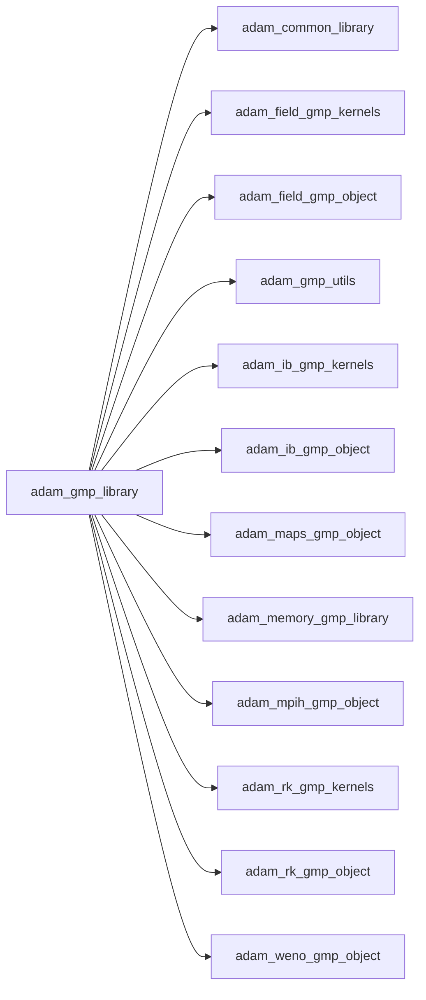

# adam_gmp_library

> ADAM GMP library, entry for all GMP (and common) classes and libraries.

**Source**: `src/lib/gmp/adam_gmp_library.F90`

**Dependencies**

```mermaid
graph LR
  adam_gmp_library["adam_gmp_library"] --> adam_common_library["adam_common_library"]
  adam_gmp_library["adam_gmp_library"] --> adam_field_gmp_kernels["adam_field_gmp_kernels"]
  adam_gmp_library["adam_gmp_library"] --> adam_field_gmp_object["adam_field_gmp_object"]
  adam_gmp_library["adam_gmp_library"] --> adam_gmp_utils["adam_gmp_utils"]
  adam_gmp_library["adam_gmp_library"] --> adam_ib_gmp_kernels["adam_ib_gmp_kernels"]
  adam_gmp_library["adam_gmp_library"] --> adam_ib_gmp_object["adam_ib_gmp_object"]
  adam_gmp_library["adam_gmp_library"] --> adam_maps_gmp_object["adam_maps_gmp_object"]
  adam_gmp_library["adam_gmp_library"] --> adam_memory_gmp_library["adam_memory_gmp_library"]
  adam_gmp_library["adam_gmp_library"] --> adam_mpih_gmp_object["adam_mpih_gmp_object"]
  adam_gmp_library["adam_gmp_library"] --> adam_rk_gmp_kernels["adam_rk_gmp_kernels"]
  adam_gmp_library["adam_gmp_library"] --> adam_rk_gmp_object["adam_rk_gmp_object"]
  adam_gmp_library["adam_gmp_library"] --> adam_weno_gmp_object["adam_weno_gmp_object"]
```
