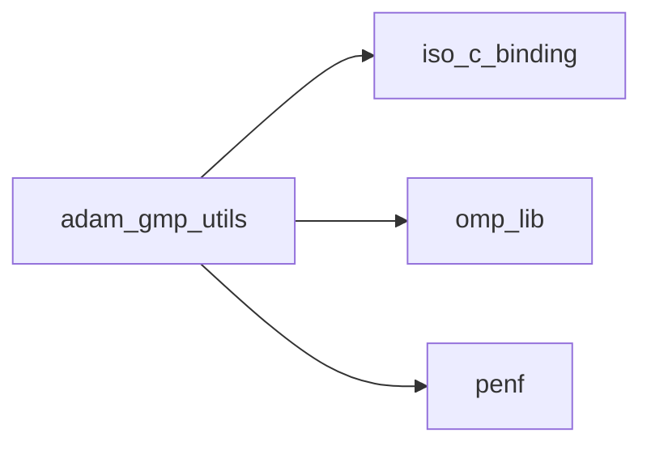
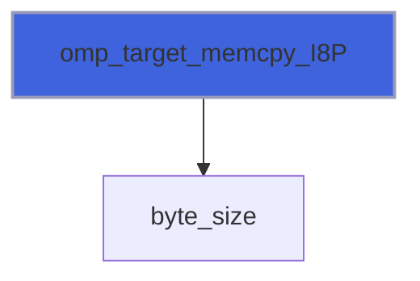

# adam_gmp_utils

**Source**: `src/lib/gmp/adam_gmp_utils.F90`

**Dependencies**



## Contents

- [omp_target_alloc_f](#omp-target-alloc-f)
- [omp_target_free_f](#omp-target-free-f)
- [omp_target_memcpy_f](#omp-target-memcpy-f)
- [omp_target_alloc_R8P_1D](#omp-target-alloc-r8p-1d)
- [omp_target_alloc_R8P_2D](#omp-target-alloc-r8p-2d)
- [omp_target_alloc_R8P_3D](#omp-target-alloc-r8p-3d)
- [omp_target_alloc_R8P_4D](#omp-target-alloc-r8p-4d)
- [omp_target_alloc_R8P_5D](#omp-target-alloc-r8p-5d)
- [omp_target_alloc_R8P_6D](#omp-target-alloc-r8p-6d)
- [omp_target_alloc_I4P_1D](#omp-target-alloc-i4p-1d)
- [omp_target_alloc_I4P_2D](#omp-target-alloc-i4p-2d)
- [omp_target_alloc_I4P_5D](#omp-target-alloc-i4p-5d)
- [omp_target_alloc_I8P_1D](#omp-target-alloc-i8p-1d)
- [omp_target_alloc_I8P_2D](#omp-target-alloc-i8p-2d)
- [omp_target_alloc_I8P_3D](#omp-target-alloc-i8p-3d)
- [omp_target_free_R8P_1D](#omp-target-free-r8p-1d)
- [omp_target_free_R8P_2D](#omp-target-free-r8p-2d)
- [omp_target_free_R8P_3D](#omp-target-free-r8p-3d)
- [omp_target_free_R8P_4D](#omp-target-free-r8p-4d)
- [omp_target_free_R8P_5D](#omp-target-free-r8p-5d)
- [omp_target_free_R8P_6D](#omp-target-free-r8p-6d)
- [omp_target_free_I4P_1D](#omp-target-free-i4p-1d)
- [omp_target_free_I4P_2D](#omp-target-free-i4p-2d)
- [omp_target_free_I4P_5D](#omp-target-free-i4p-5d)
- [omp_target_free_I8P_1D](#omp-target-free-i8p-1d)
- [omp_target_free_I8P_2D](#omp-target-free-i8p-2d)
- [omp_target_free_I8P_3D](#omp-target-free-i8p-3d)
- [omp_target_memcpy_R8P](#omp-target-memcpy-r8p)
- [omp_target_memcpy_I4P](#omp-target-memcpy-i4p)
- [omp_target_memcpy_I8P](#omp-target-memcpy-i8p)

## Interfaces

### omp_target_alloc_f

**Module procedures**: [`omp_target_alloc_R8P_1D`](/api/src/lib/gmp/adam_gmp_utils#omp-target-alloc-r8p-1d), [`omp_target_alloc_R8P_2D`](/api/src/lib/gmp/adam_gmp_utils#omp-target-alloc-r8p-2d), [`omp_target_alloc_R8P_3D`](/api/src/lib/gmp/adam_gmp_utils#omp-target-alloc-r8p-3d), [`omp_target_alloc_R8P_4D`](/api/src/lib/gmp/adam_gmp_utils#omp-target-alloc-r8p-4d), [`omp_target_alloc_R8P_5D`](/api/src/lib/gmp/adam_gmp_utils#omp-target-alloc-r8p-5d), [`omp_target_alloc_R8P_6D`](/api/src/lib/gmp/adam_gmp_utils#omp-target-alloc-r8p-6d), [`omp_target_alloc_I4P_1D`](/api/src/lib/gmp/adam_gmp_utils#omp-target-alloc-i4p-1d), [`omp_target_alloc_I4P_2D`](/api/src/lib/gmp/adam_gmp_utils#omp-target-alloc-i4p-2d), [`omp_target_alloc_I4P_5D`](/api/src/lib/gmp/adam_gmp_utils#omp-target-alloc-i4p-5d), [`omp_target_alloc_I8P_1D`](/api/src/lib/gmp/adam_gmp_utils#omp-target-alloc-i8p-1d), [`omp_target_alloc_I8P_2D`](/api/src/lib/gmp/adam_gmp_utils#omp-target-alloc-i8p-2d), [`omp_target_alloc_I8P_3D`](/api/src/lib/gmp/adam_gmp_utils#omp-target-alloc-i8p-3d)

### omp_target_free_f

**Module procedures**: [`omp_target_free_R8P_1D`](/api/src/lib/gmp/adam_gmp_utils#omp-target-free-r8p-1d), [`omp_target_free_R8P_2D`](/api/src/lib/gmp/adam_gmp_utils#omp-target-free-r8p-2d), [`omp_target_free_R8P_3D`](/api/src/lib/gmp/adam_gmp_utils#omp-target-free-r8p-3d), [`omp_target_free_R8P_4D`](/api/src/lib/gmp/adam_gmp_utils#omp-target-free-r8p-4d), [`omp_target_free_R8P_5D`](/api/src/lib/gmp/adam_gmp_utils#omp-target-free-r8p-5d), [`omp_target_free_R8P_6D`](/api/src/lib/gmp/adam_gmp_utils#omp-target-free-r8p-6d), [`omp_target_free_I4P_1D`](/api/src/lib/gmp/adam_gmp_utils#omp-target-free-i4p-1d), [`omp_target_free_I4P_2D`](/api/src/lib/gmp/adam_gmp_utils#omp-target-free-i4p-2d), [`omp_target_free_I4P_5D`](/api/src/lib/gmp/adam_gmp_utils#omp-target-free-i4p-5d), [`omp_target_free_I8P_1D`](/api/src/lib/gmp/adam_gmp_utils#omp-target-free-i8p-1d), [`omp_target_free_I8P_2D`](/api/src/lib/gmp/adam_gmp_utils#omp-target-free-i8p-2d), [`omp_target_free_I8P_3D`](/api/src/lib/gmp/adam_gmp_utils#omp-target-free-i8p-3d)

### omp_target_memcpy_f

**Module procedures**: [`omp_target_memcpy_R8P`](/api/src/lib/gmp/adam_gmp_utils#omp-target-memcpy-r8p), [`omp_target_memcpy_I4P`](/api/src/lib/gmp/adam_gmp_utils#omp-target-memcpy-i4p), [`omp_target_memcpy_I8P`](/api/src/lib/gmp/adam_gmp_utils#omp-target-memcpy-i8p)

## Subroutines

### omp_target_alloc_R8P_1D

```fortran
subroutine omp_target_alloc_R8P_1D(fptr_dev, ubounds, omp_dev, ierr, lbounds, init_value)
```

**Arguments**

| Name | Type | Intent | Attributes | Description |
|------|------|--------|------------|-------------|
| `fptr_dev` | real(kind=[R8P](/api/src/third_party/PENF/src/lib/penf_global_parameters_variables)) | out | pointer |  |
| `ubounds` | integer(kind=[I4P](/api/src/third_party/PENF/src/lib/penf_global_parameters_variables)) | in |  |  |
| `omp_dev` | integer(kind=[I4P](/api/src/third_party/PENF/src/lib/penf_global_parameters_variables)) | in | optional |  |
| `ierr` | integer(kind=[I4P](/api/src/third_party/PENF/src/lib/penf_global_parameters_variables)) | out |  |  |
| `lbounds` | integer(kind=[I4P](/api/src/third_party/PENF/src/lib/penf_global_parameters_variables)) | in | optional |  |
| `init_value` | real(kind=[R8P](/api/src/third_party/PENF/src/lib/penf_global_parameters_variables)) | in | optional |  |

**Call graph**


### omp_target_alloc_R8P_2D

```fortran
subroutine omp_target_alloc_R8P_2D(fptr_dev, ubounds, omp_dev, ierr, lbounds, init_value)
```

**Arguments**

| Name | Type | Intent | Attributes | Description |
|------|------|--------|------------|-------------|
| `fptr_dev` | real(kind=[R8P](/api/src/third_party/PENF/src/lib/penf_global_parameters_variables)) | out | pointer |  |
| `ubounds` | integer(kind=[I4P](/api/src/third_party/PENF/src/lib/penf_global_parameters_variables)) | in |  |  |
| `omp_dev` | integer(kind=[I4P](/api/src/third_party/PENF/src/lib/penf_global_parameters_variables)) | in | optional |  |
| `ierr` | integer(kind=[I4P](/api/src/third_party/PENF/src/lib/penf_global_parameters_variables)) | out |  |  |
| `lbounds` | integer(kind=[I4P](/api/src/third_party/PENF/src/lib/penf_global_parameters_variables)) | in | optional |  |
| `init_value` | real(kind=[R8P](/api/src/third_party/PENF/src/lib/penf_global_parameters_variables)) | in | optional |  |

**Call graph**


### omp_target_alloc_R8P_3D

```fortran
subroutine omp_target_alloc_R8P_3D(fptr_dev, ubounds, omp_dev, ierr, lbounds, init_value)
```

**Arguments**

| Name | Type | Intent | Attributes | Description |
|------|------|--------|------------|-------------|
| `fptr_dev` | real(kind=[R8P](/api/src/third_party/PENF/src/lib/penf_global_parameters_variables)) | out | pointer |  |
| `ubounds` | integer(kind=[I4P](/api/src/third_party/PENF/src/lib/penf_global_parameters_variables)) | in |  |  |
| `omp_dev` | integer(kind=[I4P](/api/src/third_party/PENF/src/lib/penf_global_parameters_variables)) | in | optional |  |
| `ierr` | integer(kind=[I4P](/api/src/third_party/PENF/src/lib/penf_global_parameters_variables)) | out |  |  |
| `lbounds` | integer(kind=[I4P](/api/src/third_party/PENF/src/lib/penf_global_parameters_variables)) | in | optional |  |
| `init_value` | real(kind=[R8P](/api/src/third_party/PENF/src/lib/penf_global_parameters_variables)) | in | optional |  |

**Call graph**


### omp_target_alloc_R8P_4D

```fortran
subroutine omp_target_alloc_R8P_4D(fptr_dev, ubounds, omp_dev, ierr, lbounds, init_value)
```

**Arguments**

| Name | Type | Intent | Attributes | Description |
|------|------|--------|------------|-------------|
| `fptr_dev` | real(kind=[R8P](/api/src/third_party/PENF/src/lib/penf_global_parameters_variables)) | out | pointer |  |
| `ubounds` | integer(kind=[I4P](/api/src/third_party/PENF/src/lib/penf_global_parameters_variables)) | in |  |  |
| `omp_dev` | integer(kind=[I4P](/api/src/third_party/PENF/src/lib/penf_global_parameters_variables)) | in | optional |  |
| `ierr` | integer(kind=[I4P](/api/src/third_party/PENF/src/lib/penf_global_parameters_variables)) | out |  |  |
| `lbounds` | integer(kind=[I4P](/api/src/third_party/PENF/src/lib/penf_global_parameters_variables)) | in | optional |  |
| `init_value` | real(kind=[R8P](/api/src/third_party/PENF/src/lib/penf_global_parameters_variables)) | in | optional |  |

**Call graph**


### omp_target_alloc_R8P_5D

```fortran
subroutine omp_target_alloc_R8P_5D(fptr_dev, ubounds, omp_dev, ierr, lbounds, init_value)
```

**Arguments**

| Name | Type | Intent | Attributes | Description |
|------|------|--------|------------|-------------|
| `fptr_dev` | real(kind=[R8P](/api/src/third_party/PENF/src/lib/penf_global_parameters_variables)) | out | pointer |  |
| `ubounds` | integer(kind=[I4P](/api/src/third_party/PENF/src/lib/penf_global_parameters_variables)) | in |  |  |
| `omp_dev` | integer(kind=[I4P](/api/src/third_party/PENF/src/lib/penf_global_parameters_variables)) | in | optional |  |
| `ierr` | integer(kind=[I4P](/api/src/third_party/PENF/src/lib/penf_global_parameters_variables)) | out |  |  |
| `lbounds` | integer(kind=[I4P](/api/src/third_party/PENF/src/lib/penf_global_parameters_variables)) | in | optional |  |
| `init_value` | real(kind=[R8P](/api/src/third_party/PENF/src/lib/penf_global_parameters_variables)) | in | optional |  |

**Call graph**


### omp_target_alloc_R8P_6D

```fortran
subroutine omp_target_alloc_R8P_6D(fptr_dev, ubounds, omp_dev, ierr, lbounds, init_value)
```

**Arguments**

| Name | Type | Intent | Attributes | Description |
|------|------|--------|------------|-------------|
| `fptr_dev` | real(kind=[R8P](/api/src/third_party/PENF/src/lib/penf_global_parameters_variables)) | out | pointer |  |
| `ubounds` | integer(kind=[I4P](/api/src/third_party/PENF/src/lib/penf_global_parameters_variables)) | in |  |  |
| `omp_dev` | integer(kind=[I4P](/api/src/third_party/PENF/src/lib/penf_global_parameters_variables)) | in |  |  |
| `ierr` | integer(kind=[I4P](/api/src/third_party/PENF/src/lib/penf_global_parameters_variables)) | out |  |  |
| `lbounds` | integer(kind=[I4P](/api/src/third_party/PENF/src/lib/penf_global_parameters_variables)) | in | optional |  |
| `init_value` | real(kind=[R8P](/api/src/third_party/PENF/src/lib/penf_global_parameters_variables)) | in | optional |  |

**Call graph**


### omp_target_alloc_I4P_1D

```fortran
subroutine omp_target_alloc_I4P_1D(fptr_dev, ubounds, omp_dev, ierr, lbounds, init_value)
```

**Arguments**

| Name | Type | Intent | Attributes | Description |
|------|------|--------|------------|-------------|
| `fptr_dev` | integer(kind=[I4P](/api/src/third_party/PENF/src/lib/penf_global_parameters_variables)) | out | pointer |  |
| `ubounds` | integer(kind=[I4P](/api/src/third_party/PENF/src/lib/penf_global_parameters_variables)) | in |  |  |
| `omp_dev` | integer(kind=[I4P](/api/src/third_party/PENF/src/lib/penf_global_parameters_variables)) | in |  |  |
| `ierr` | integer(kind=[I4P](/api/src/third_party/PENF/src/lib/penf_global_parameters_variables)) | out |  |  |
| `lbounds` | integer(kind=[I4P](/api/src/third_party/PENF/src/lib/penf_global_parameters_variables)) | in | optional |  |
| `init_value` | integer(kind=[I4P](/api/src/third_party/PENF/src/lib/penf_global_parameters_variables)) | in | optional |  |

**Call graph**


### omp_target_alloc_I4P_2D

```fortran
subroutine omp_target_alloc_I4P_2D(fptr_dev, ubounds, omp_dev, ierr, lbounds, init_value)
```

**Arguments**

| Name | Type | Intent | Attributes | Description |
|------|------|--------|------------|-------------|
| `fptr_dev` | integer(kind=[I4P](/api/src/third_party/PENF/src/lib/penf_global_parameters_variables)) | out | pointer |  |
| `ubounds` | integer(kind=[I4P](/api/src/third_party/PENF/src/lib/penf_global_parameters_variables)) | in |  |  |
| `omp_dev` | integer(kind=[I4P](/api/src/third_party/PENF/src/lib/penf_global_parameters_variables)) | in |  |  |
| `ierr` | integer(kind=[I4P](/api/src/third_party/PENF/src/lib/penf_global_parameters_variables)) | out |  |  |
| `lbounds` | integer(kind=[I4P](/api/src/third_party/PENF/src/lib/penf_global_parameters_variables)) | in | optional |  |
| `init_value` | integer(kind=[I4P](/api/src/third_party/PENF/src/lib/penf_global_parameters_variables)) | in | optional |  |

**Call graph**


### omp_target_alloc_I4P_5D

```fortran
subroutine omp_target_alloc_I4P_5D(fptr_dev, ubounds, omp_dev, ierr, lbounds, init_value)
```

**Arguments**

| Name | Type | Intent | Attributes | Description |
|------|------|--------|------------|-------------|
| `fptr_dev` | integer(kind=[I4P](/api/src/third_party/PENF/src/lib/penf_global_parameters_variables)) | out | pointer |  |
| `ubounds` | integer(kind=[I4P](/api/src/third_party/PENF/src/lib/penf_global_parameters_variables)) | in |  |  |
| `omp_dev` | integer(kind=[I4P](/api/src/third_party/PENF/src/lib/penf_global_parameters_variables)) | in |  |  |
| `ierr` | integer(kind=[I4P](/api/src/third_party/PENF/src/lib/penf_global_parameters_variables)) | out |  |  |
| `lbounds` | integer(kind=[I4P](/api/src/third_party/PENF/src/lib/penf_global_parameters_variables)) | in | optional |  |
| `init_value` | integer(kind=[I4P](/api/src/third_party/PENF/src/lib/penf_global_parameters_variables)) | in | optional |  |

**Call graph**


### omp_target_alloc_I8P_1D

```fortran
subroutine omp_target_alloc_I8P_1D(fptr_dev, ubounds, omp_dev, ierr, lbounds, init_value)
```

**Arguments**

| Name | Type | Intent | Attributes | Description |
|------|------|--------|------------|-------------|
| `fptr_dev` | integer(kind=[I8P](/api/src/third_party/PENF/src/lib/penf_global_parameters_variables)) | out | pointer |  |
| `ubounds` | integer(kind=[I4P](/api/src/third_party/PENF/src/lib/penf_global_parameters_variables)) | in |  |  |
| `omp_dev` | integer(kind=[I4P](/api/src/third_party/PENF/src/lib/penf_global_parameters_variables)) | in |  |  |
| `ierr` | integer(kind=[I4P](/api/src/third_party/PENF/src/lib/penf_global_parameters_variables)) | out |  |  |
| `lbounds` | integer(kind=[I4P](/api/src/third_party/PENF/src/lib/penf_global_parameters_variables)) | in | optional |  |
| `init_value` | integer(kind=[I8P](/api/src/third_party/PENF/src/lib/penf_global_parameters_variables)) | in | optional |  |

**Call graph**


### omp_target_alloc_I8P_2D

```fortran
subroutine omp_target_alloc_I8P_2D(fptr_dev, ubounds, omp_dev, ierr, lbounds, init_value)
```

**Arguments**

| Name | Type | Intent | Attributes | Description |
|------|------|--------|------------|-------------|
| `fptr_dev` | integer(kind=[I8P](/api/src/third_party/PENF/src/lib/penf_global_parameters_variables)) | out | pointer |  |
| `ubounds` | integer(kind=[I4P](/api/src/third_party/PENF/src/lib/penf_global_parameters_variables)) | in |  |  |
| `omp_dev` | integer(kind=[I4P](/api/src/third_party/PENF/src/lib/penf_global_parameters_variables)) | in |  |  |
| `ierr` | integer(kind=[I4P](/api/src/third_party/PENF/src/lib/penf_global_parameters_variables)) | out |  |  |
| `lbounds` | integer(kind=[I4P](/api/src/third_party/PENF/src/lib/penf_global_parameters_variables)) | in | optional |  |
| `init_value` | integer(kind=[I8P](/api/src/third_party/PENF/src/lib/penf_global_parameters_variables)) | in | optional |  |

**Call graph**


### omp_target_alloc_I8P_3D

```fortran
subroutine omp_target_alloc_I8P_3D(fptr_dev, ubounds, omp_dev, ierr, lbounds, init_value)
```

**Arguments**

| Name | Type | Intent | Attributes | Description |
|------|------|--------|------------|-------------|
| `fptr_dev` | integer(kind=[I8P](/api/src/third_party/PENF/src/lib/penf_global_parameters_variables)) | out | pointer |  |
| `ubounds` | integer(kind=[I4P](/api/src/third_party/PENF/src/lib/penf_global_parameters_variables)) | in |  |  |
| `omp_dev` | integer(kind=[I4P](/api/src/third_party/PENF/src/lib/penf_global_parameters_variables)) | in |  |  |
| `ierr` | integer(kind=[I4P](/api/src/third_party/PENF/src/lib/penf_global_parameters_variables)) | out |  |  |
| `lbounds` | integer(kind=[I4P](/api/src/third_party/PENF/src/lib/penf_global_parameters_variables)) | in | optional |  |
| `init_value` | integer(kind=[I8P](/api/src/third_party/PENF/src/lib/penf_global_parameters_variables)) | in | optional |  |

**Call graph**


### omp_target_free_R8P_1D

```fortran
subroutine omp_target_free_R8P_1D(fptr_dev, omp_dev)
```

**Arguments**

| Name | Type | Intent | Attributes | Description |
|------|------|--------|------------|-------------|
| `fptr_dev` | real(kind=[R8P](/api/src/third_party/PENF/src/lib/penf_global_parameters_variables)) | out | pointer |  |
| `omp_dev` | integer | in |  |  |

### omp_target_free_R8P_2D

```fortran
subroutine omp_target_free_R8P_2D(fptr_dev, omp_dev)
```

**Arguments**

| Name | Type | Intent | Attributes | Description |
|------|------|--------|------------|-------------|
| `fptr_dev` | real(kind=[R8P](/api/src/third_party/PENF/src/lib/penf_global_parameters_variables)) | out | pointer |  |
| `omp_dev` | integer | in |  |  |

### omp_target_free_R8P_3D

```fortran
subroutine omp_target_free_R8P_3D(fptr_dev, omp_dev)
```

**Arguments**

| Name | Type | Intent | Attributes | Description |
|------|------|--------|------------|-------------|
| `fptr_dev` | real(kind=[R8P](/api/src/third_party/PENF/src/lib/penf_global_parameters_variables)) | out | pointer |  |
| `omp_dev` | integer | in |  |  |

### omp_target_free_R8P_4D

```fortran
subroutine omp_target_free_R8P_4D(fptr_dev, omp_dev)
```

**Arguments**

| Name | Type | Intent | Attributes | Description |
|------|------|--------|------------|-------------|
| `fptr_dev` | real(kind=[R8P](/api/src/third_party/PENF/src/lib/penf_global_parameters_variables)) | out | pointer |  |
| `omp_dev` | integer | in |  |  |

### omp_target_free_R8P_5D

```fortran
subroutine omp_target_free_R8P_5D(fptr_dev, omp_dev)
```

**Arguments**

| Name | Type | Intent | Attributes | Description |
|------|------|--------|------------|-------------|
| `fptr_dev` | real(kind=[R8P](/api/src/third_party/PENF/src/lib/penf_global_parameters_variables)) | out | pointer |  |
| `omp_dev` | integer | in |  |  |

### omp_target_free_R8P_6D

```fortran
subroutine omp_target_free_R8P_6D(fptr_dev, omp_dev)
```

**Arguments**

| Name | Type | Intent | Attributes | Description |
|------|------|--------|------------|-------------|
| `fptr_dev` | real(kind=[R8P](/api/src/third_party/PENF/src/lib/penf_global_parameters_variables)) | out | pointer |  |
| `omp_dev` | integer | in |  |  |

### omp_target_free_I4P_1D

```fortran
subroutine omp_target_free_I4P_1D(fptr_dev, omp_dev)
```

**Arguments**

| Name | Type | Intent | Attributes | Description |
|------|------|--------|------------|-------------|
| `fptr_dev` | integer(kind=[I4P](/api/src/third_party/PENF/src/lib/penf_global_parameters_variables)) | out | pointer |  |
| `omp_dev` | integer(kind=[I4P](/api/src/third_party/PENF/src/lib/penf_global_parameters_variables)) | in |  |  |

### omp_target_free_I4P_2D

```fortran
subroutine omp_target_free_I4P_2D(fptr_dev, omp_dev)
```

**Arguments**

| Name | Type | Intent | Attributes | Description |
|------|------|--------|------------|-------------|
| `fptr_dev` | integer(kind=[I4P](/api/src/third_party/PENF/src/lib/penf_global_parameters_variables)) | out | pointer |  |
| `omp_dev` | integer(kind=[I4P](/api/src/third_party/PENF/src/lib/penf_global_parameters_variables)) | in |  |  |

### omp_target_free_I4P_5D

```fortran
subroutine omp_target_free_I4P_5D(fptr_dev, omp_dev)
```

**Arguments**

| Name | Type | Intent | Attributes | Description |
|------|------|--------|------------|-------------|
| `fptr_dev` | integer(kind=[I4P](/api/src/third_party/PENF/src/lib/penf_global_parameters_variables)) | out | pointer |  |
| `omp_dev` | integer(kind=[I4P](/api/src/third_party/PENF/src/lib/penf_global_parameters_variables)) | in |  |  |

### omp_target_free_I8P_1D

```fortran
subroutine omp_target_free_I8P_1D(fptr_dev, omp_dev)
```

**Arguments**

| Name | Type | Intent | Attributes | Description |
|------|------|--------|------------|-------------|
| `fptr_dev` | integer(kind=[I8P](/api/src/third_party/PENF/src/lib/penf_global_parameters_variables)) | out | pointer |  |
| `omp_dev` | integer(kind=[I4P](/api/src/third_party/PENF/src/lib/penf_global_parameters_variables)) | in |  |  |

### omp_target_free_I8P_2D

```fortran
subroutine omp_target_free_I8P_2D(fptr_dev, omp_dev)
```

**Arguments**

| Name | Type | Intent | Attributes | Description |
|------|------|--------|------------|-------------|
| `fptr_dev` | integer(kind=[I8P](/api/src/third_party/PENF/src/lib/penf_global_parameters_variables)) | out | pointer |  |
| `omp_dev` | integer(kind=[I4P](/api/src/third_party/PENF/src/lib/penf_global_parameters_variables)) | in |  |  |

### omp_target_free_I8P_3D

```fortran
subroutine omp_target_free_I8P_3D(fptr_dev, omp_dev)
```

**Arguments**

| Name | Type | Intent | Attributes | Description |
|------|------|--------|------------|-------------|
| `fptr_dev` | integer(kind=[I8P](/api/src/third_party/PENF/src/lib/penf_global_parameters_variables)) | out | pointer |  |
| `omp_dev` | integer(kind=[I4P](/api/src/third_party/PENF/src/lib/penf_global_parameters_variables)) | in |  |  |

## Functions

### omp_target_memcpy_R8P

**Returns**: integer(kind=[I4P](/api/src/third_party/PENF/src/lib/penf_global_parameters_variables))

```fortran
function omp_target_memcpy_R8P(fptr_dst, fptr_src, dst_off, src_off, omp_dst_dev, omp_src_dev)
```

**Arguments**

| Name | Type | Intent | Attributes | Description |
|------|------|--------|------------|-------------|
| `fptr_dst` | real(kind=[R8P](/api/src/third_party/PENF/src/lib/penf_global_parameters_variables)) | out | target |  |
| `fptr_src` | real(kind=[R8P](/api/src/third_party/PENF/src/lib/penf_global_parameters_variables)) | in | target |  |
| `dst_off` | integer(kind=[I4P](/api/src/third_party/PENF/src/lib/penf_global_parameters_variables)) | in |  |  |
| `src_off` | integer(kind=[I4P](/api/src/third_party/PENF/src/lib/penf_global_parameters_variables)) | in |  |  |
| `omp_dst_dev` | integer(kind=[I4P](/api/src/third_party/PENF/src/lib/penf_global_parameters_variables)) | in |  |  |
| `omp_src_dev` | integer(kind=[I4P](/api/src/third_party/PENF/src/lib/penf_global_parameters_variables)) | in |  |  |

**Call graph**


### omp_target_memcpy_I4P

**Returns**: integer(kind=[I4P](/api/src/third_party/PENF/src/lib/penf_global_parameters_variables))

```fortran
function omp_target_memcpy_I4P(fptr_dst, fptr_src, dst_off, src_off, omp_dst_dev, omp_src_dev)
```

**Arguments**

| Name | Type | Intent | Attributes | Description |
|------|------|--------|------------|-------------|
| `fptr_dst` | integer(kind=[I4P](/api/src/third_party/PENF/src/lib/penf_global_parameters_variables)) | out | target |  |
| `fptr_src` | integer(kind=[I4P](/api/src/third_party/PENF/src/lib/penf_global_parameters_variables)) | in | target |  |
| `dst_off` | integer(kind=[I4P](/api/src/third_party/PENF/src/lib/penf_global_parameters_variables)) | in |  |  |
| `src_off` | integer(kind=[I4P](/api/src/third_party/PENF/src/lib/penf_global_parameters_variables)) | in |  |  |
| `omp_dst_dev` | integer(kind=[I4P](/api/src/third_party/PENF/src/lib/penf_global_parameters_variables)) | in |  |  |
| `omp_src_dev` | integer(kind=[I4P](/api/src/third_party/PENF/src/lib/penf_global_parameters_variables)) | in |  |  |

**Call graph**


### omp_target_memcpy_I8P

**Returns**: integer(kind=[I4P](/api/src/third_party/PENF/src/lib/penf_global_parameters_variables))

```fortran
function omp_target_memcpy_I8P(fptr_dst, fptr_src, dst_off, src_off, omp_dst_dev, omp_src_dev)
```

**Arguments**

| Name | Type | Intent | Attributes | Description |
|------|------|--------|------------|-------------|
| `fptr_dst` | integer(kind=[I8P](/api/src/third_party/PENF/src/lib/penf_global_parameters_variables)) | out | target |  |
| `fptr_src` | integer(kind=[I8P](/api/src/third_party/PENF/src/lib/penf_global_parameters_variables)) | in | target |  |
| `dst_off` | integer(kind=[I4P](/api/src/third_party/PENF/src/lib/penf_global_parameters_variables)) | in |  |  |
| `src_off` | integer(kind=[I4P](/api/src/third_party/PENF/src/lib/penf_global_parameters_variables)) | in |  |  |
| `omp_dst_dev` | integer(kind=[I4P](/api/src/third_party/PENF/src/lib/penf_global_parameters_variables)) | in |  |  |
| `omp_src_dev` | integer(kind=[I4P](/api/src/third_party/PENF/src/lib/penf_global_parameters_variables)) | in |  |  |

**Call graph**


