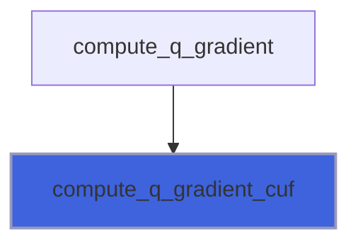
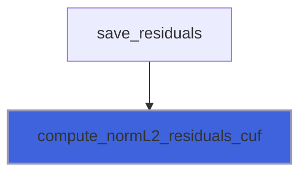
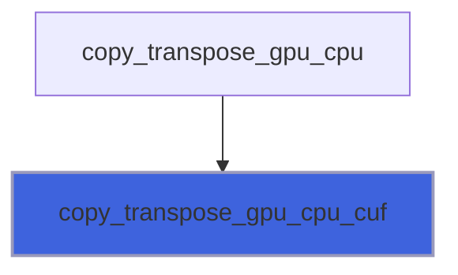
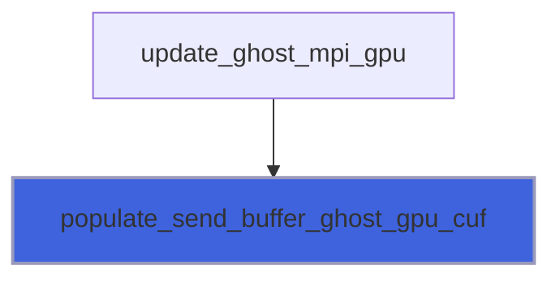
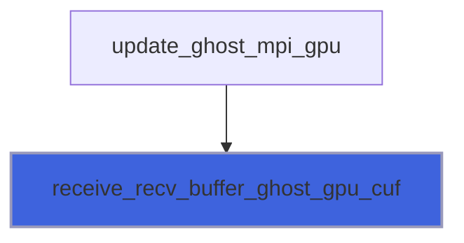
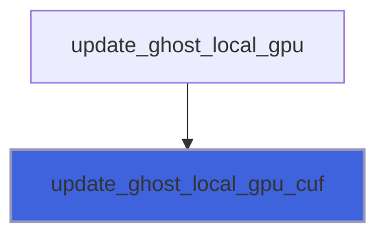

# adam_field_nvf_kernels

> ADAM, field class NVF kernels (NVF backend of [field_object](/api/src/lib/common/adam_field_object#field-object)).

**Source**: `src/lib/nvf/adam_field_nvf_kernels.F90`

**Dependencies**


## Contents

- [compute_q_gradient_cuf](#compute-q-gradient-cuf)
- [compute_normL2_residuals_cuf](#compute-norml2-residuals-cuf)
- [copy_transpose_gpu_cpu_cuf](#copy-transpose-gpu-cpu-cuf)
- [populate_send_buffer_ghost_gpu_cuf](#populate-send-buffer-ghost-gpu-cuf)
- [receive_recv_buffer_ghost_gpu_cuf](#receive-recv-buffer-ghost-gpu-cuf)
- [update_ghost_local_gpu_cuf](#update-ghost-local-gpu-cuf)

## Subroutines

### compute_q_gradient_cuf

Compute gradient of q(ivar).

```fortran
subroutine compute_q_gradient_cuf(b, ni, nj, nk, ngc, dx, dy, dz, q_gpu, ivar, gradient)
```

**Arguments**

| Name | Type | Intent | Attributes | Description |
|------|------|--------|------------|-------------|
| `b` | integer(kind=[I4P](/api/src/third_party/PENF/src/lib/penf_global_parameters_variables)) | in |  | Block index. |
| `ni` | integer(kind=[I4P](/api/src/third_party/PENF/src/lib/penf_global_parameters_variables)) | in |  | Grid cells number in I direction. |
| `nj` | integer(kind=[I4P](/api/src/third_party/PENF/src/lib/penf_global_parameters_variables)) | in |  | Grid cells number in J direction. |
| `nk` | integer(kind=[I4P](/api/src/third_party/PENF/src/lib/penf_global_parameters_variables)) | in |  | Grid cells number in K direction. |
| `ngc` | integer(kind=[I4P](/api/src/third_party/PENF/src/lib/penf_global_parameters_variables)) | in |  | Ghost cells number. |
| `dx` | real(kind=[R8P](/api/src/third_party/PENF/src/lib/penf_global_parameters_variables)) | in |  | X space step. |
| `dy` | real(kind=[R8P](/api/src/third_party/PENF/src/lib/penf_global_parameters_variables)) | in |  | Y space step. |
| `dz` | real(kind=[R8P](/api/src/third_party/PENF/src/lib/penf_global_parameters_variables)) | in |  | Z space step. |
| `q_gpu` | real(kind=[R8P](/api/src/third_party/PENF/src/lib/penf_global_parameters_variables)) | in | device | Field component to which apply gradient. |
| `ivar` | integer(kind=[I4P](/api/src/third_party/PENF/src/lib/penf_global_parameters_variables)) | in |  | Ghost cells number. |
| `gradient` | real(kind=[R8P](/api/src/third_party/PENF/src/lib/penf_global_parameters_variables)) | out |  | Maximum gradient of q. |

**Call graph**



### compute_normL2_residuals_cuf

Compute L2 norm of residuals.

```fortran
subroutine compute_normL2_residuals_cuf(ni, nj, nk, ngc, nv, blocks_number, dq_gpu, norm)
```

**Arguments**

| Name | Type | Intent | Attributes | Description |
|------|------|--------|------------|-------------|
| `ni` | integer(kind=[I4P](/api/src/third_party/PENF/src/lib/penf_global_parameters_variables)) | in |  | Grid cells number in I direction. |
| `nj` | integer(kind=[I4P](/api/src/third_party/PENF/src/lib/penf_global_parameters_variables)) | in |  | Grid cells number in J direction. |
| `nk` | integer(kind=[I4P](/api/src/third_party/PENF/src/lib/penf_global_parameters_variables)) | in |  | Grid cells number in K direction. |
| `ngc` | integer(kind=[I4P](/api/src/third_party/PENF/src/lib/penf_global_parameters_variables)) | in |  | Ghost grid number. |
| `nv` | integer(kind=[I4P](/api/src/third_party/PENF/src/lib/penf_global_parameters_variables)) | in |  | Number of states variables. |
| `blocks_number` | integer(kind=[I4P](/api/src/third_party/PENF/src/lib/penf_global_parameters_variables)) | in |  | Number of blocks. |
| `dq_gpu` | real(kind=[R8P](/api/src/third_party/PENF/src/lib/penf_global_parameters_variables)) | in | device | Residuals. |
| `norm` | real(kind=[R8P](/api/src/third_party/PENF/src/lib/penf_global_parameters_variables)) | inout |  | Residuals norm. |

**Call graph**



### copy_transpose_gpu_cpu_cuf

Copy transposed data from GPU to CPU by CUF threads.

```fortran
subroutine copy_transpose_gpu_cpu_cuf(ni, nj, nk, ngc, nv, blocks_number, q_gpu, q_t_gpu)
```

**Arguments**

| Name | Type | Intent | Attributes | Description |
|------|------|--------|------------|-------------|
| `ni` | integer(kind=[I4P](/api/src/third_party/PENF/src/lib/penf_global_parameters_variables)) | in |  | Grid cells number in I direction. |
| `nj` | integer(kind=[I4P](/api/src/third_party/PENF/src/lib/penf_global_parameters_variables)) | in |  | Grid cells number in J direction. |
| `nk` | integer(kind=[I4P](/api/src/third_party/PENF/src/lib/penf_global_parameters_variables)) | in |  | Grid cells number in K direction. |
| `ngc` | integer(kind=[I4P](/api/src/third_party/PENF/src/lib/penf_global_parameters_variables)) | in |  | Ghost cells number. |
| `nv` | integer(kind=[I4P](/api/src/third_party/PENF/src/lib/penf_global_parameters_variables)) | in |  | Number of conservative varibales. |
| `blocks_number` | integer(kind=[I4P](/api/src/third_party/PENF/src/lib/penf_global_parameters_variables)) | in |  | Number of blocks. |
| `q_gpu` | real(kind=[R8P](/api/src/third_party/PENF/src/lib/penf_global_parameters_variables)) | in | device | Conservative variables on GPU. |
| `q_t_gpu` | real(kind=[R8P](/api/src/third_party/PENF/src/lib/penf_global_parameters_variables)) | inout | device | Conservative (transposed) variables on GPU. |

**Call graph**



### populate_send_buffer_ghost_gpu_cuf

Polulate send buffer ghost GPU.

```fortran
subroutine populate_send_buffer_ghost_gpu_cuf(ngc, comm_map_send_ghost_cell_gpu, send_buffer_ghost_gpu, q_gpu)
```

**Arguments**

| Name | Type | Intent | Attributes | Description |
|------|------|--------|------------|-------------|
| `ngc` | integer(kind=[I4P](/api/src/third_party/PENF/src/lib/penf_global_parameters_variables)) | in |  | Ghost cells number. |
| `comm_map_send_ghost_cell_gpu` | integer(kind=[I8P](/api/src/third_party/PENF/src/lib/penf_global_parameters_variables)) | in | allocatable, device | Comm map, cell information. |
| `send_buffer_ghost_gpu` | real(kind=[R8P](/api/src/third_party/PENF/src/lib/penf_global_parameters_variables)) | inout | allocatable, device | Send buffer of ghost cells. |
| `q_gpu` | real(kind=[R8P](/api/src/third_party/PENF/src/lib/penf_global_parameters_variables)) | inout | device | Field component to be updated. |

**Call graph**



### receive_recv_buffer_ghost_gpu_cuf

Receive recv buffer ghost GPU.

```fortran
subroutine receive_recv_buffer_ghost_gpu_cuf(ngc, comm_map_recv_ghost_cell_gpu, recv_buffer_ghost_gpu, q_gpu)
```

**Arguments**

| Name | Type | Intent | Attributes | Description |
|------|------|--------|------------|-------------|
| `ngc` | integer(kind=[I4P](/api/src/third_party/PENF/src/lib/penf_global_parameters_variables)) | in |  | Ghost cells number. |
| `comm_map_recv_ghost_cell_gpu` | integer(kind=[I8P](/api/src/third_party/PENF/src/lib/penf_global_parameters_variables)) | in | allocatable, device | Comm map, cell information. |
| `recv_buffer_ghost_gpu` | real(kind=[R8P](/api/src/third_party/PENF/src/lib/penf_global_parameters_variables)) | inout | allocatable, device | Receive buffer of ghost cells. |
| `q_gpu` | real(kind=[R8P](/api/src/third_party/PENF/src/lib/penf_global_parameters_variables)) | inout | device | Field component to be updated. |

**Call graph**



### update_ghost_local_gpu_cuf

Update (local) ghost cells.

```fortran
subroutine update_ghost_local_gpu_cuf(ngc, local_map_ghost_cell_gpu, q_gpu)
```

**Arguments**

| Name | Type | Intent | Attributes | Description |
|------|------|--------|------------|-------------|
| `ngc` | integer(kind=[I4P](/api/src/third_party/PENF/src/lib/penf_global_parameters_variables)) | in |  | Ghost cells number. |
| `local_map_ghost_cell_gpu` | integer(kind=[I8P](/api/src/third_party/PENF/src/lib/penf_global_parameters_variables)) | in | device, allocatable | Local map of ghost cells. |
| `q_gpu` | real(kind=[R8P](/api/src/third_party/PENF/src/lib/penf_global_parameters_variables)) | inout | device | Field component to be updated. |

**Call graph**


