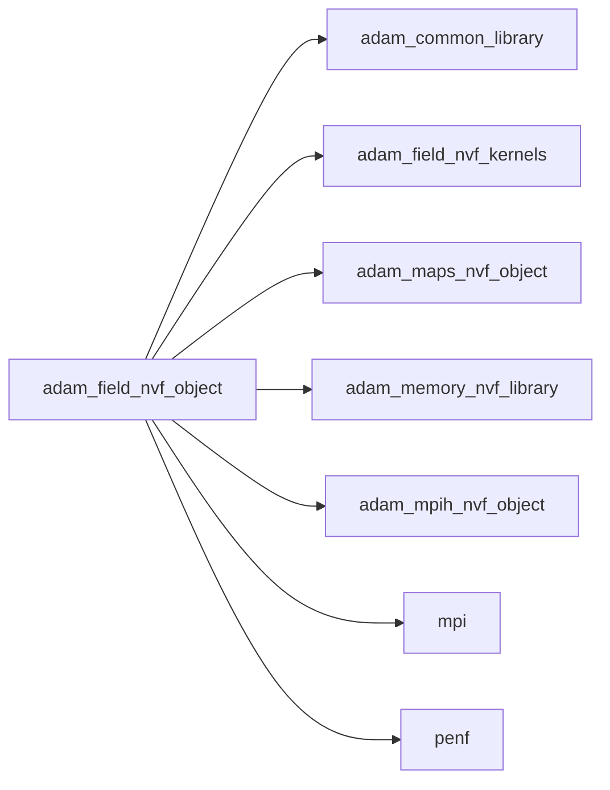
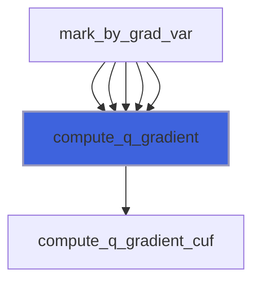
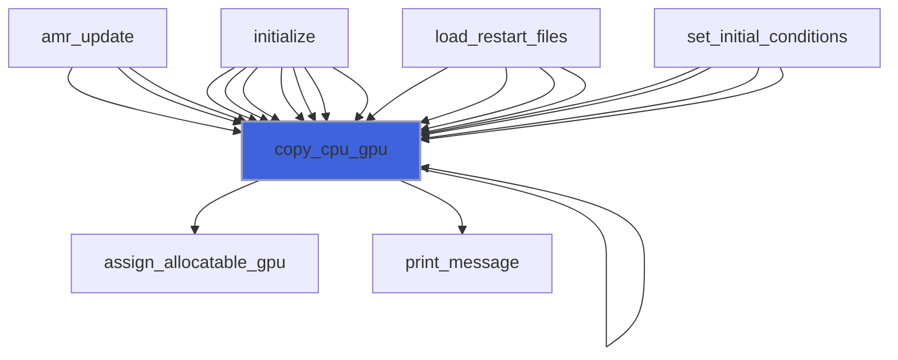
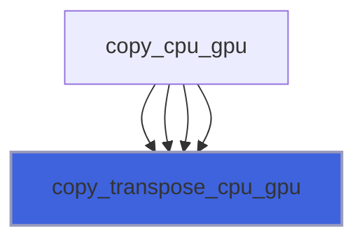
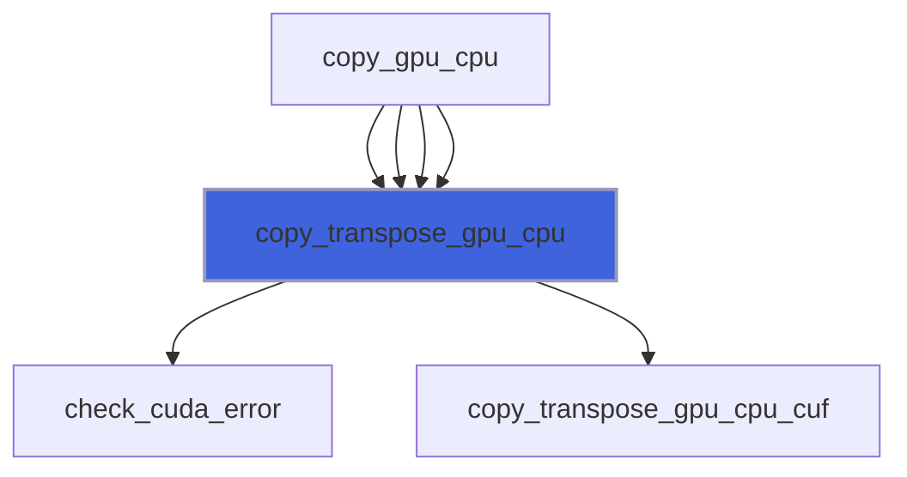
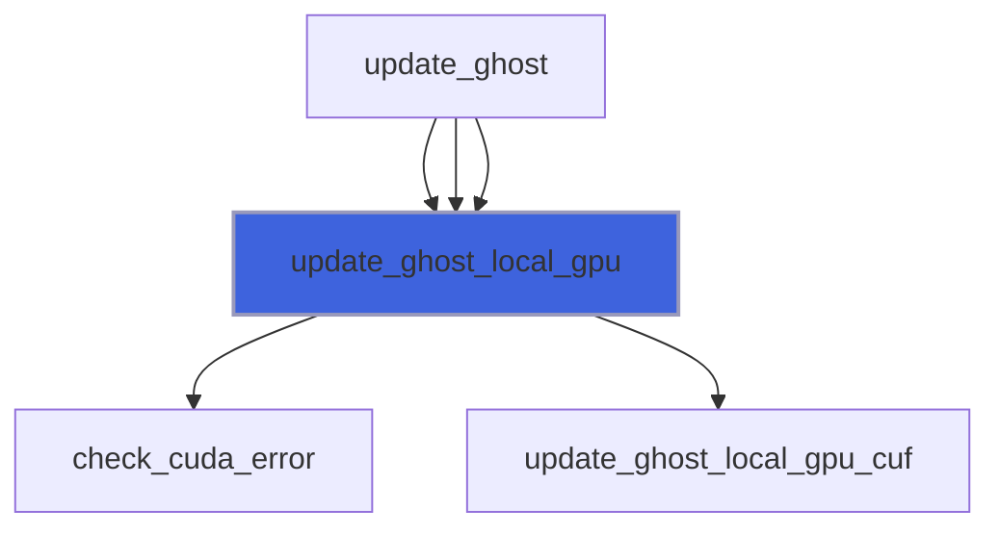
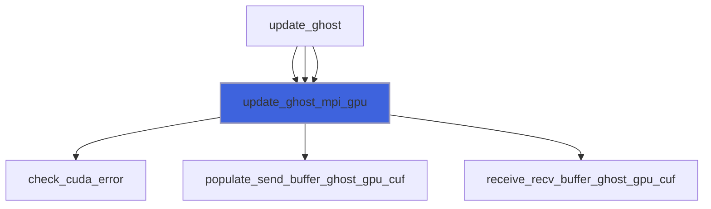

# adam_field_nvf_object

> ADAM, field class definition, NVF backend.

**Source**: `src/lib/nvf/adam_field_nvf_object.F90`

**Dependencies**



## Contents

- [field_nvf_object](#field-nvf-object)
- [compute_q_gradient](#compute-q-gradient)
- [copy_cpu_gpu](#copy-cpu-gpu)
- [copy_transpose_cpu_gpu](#copy-transpose-cpu-gpu)
- [copy_transpose_gpu_cpu](#copy-transpose-gpu-cpu)
- [initialize](#initialize)
- [update_ghost_local_gpu](#update-ghost-local-gpu)
- [update_ghost_mpi_gpu](#update-ghost-mpi-gpu)

## Derived Types

### field_nvf_object

Field class, NVF backend.

#### Components

| Name | Type | Attributes | Description |
|------|------|------------|-------------|
| `mpih` | type([mpih_nvf_object](/api/src/lib/nvf/adam_mpih_nvf_object#mpih-nvf-object)) |  | MPI handler. |
| `maps` | type([maps_nvf_object](/api/src/lib/nvf/adam_maps_nvf_object#maps-nvf-object)) |  | Maps handler. |
| `field` | type([field_object](/api/src/lib/common/adam_field_object#field-object)) | pointer | The field. |
| `q_t` | real(kind=[R8P](/api/src/third_party/PENF/src/lib/penf_global_parameters_variables)) | allocatable | Transposed cell centered variables on CPU. |
| `q_gpu` | real(kind=[R8P](/api/src/third_party/PENF/src/lib/penf_global_parameters_variables)) | allocatable, device | Field cell centered variables. |
| `q_t_gpu` | real(kind=[R8P](/api/src/third_party/PENF/src/lib/penf_global_parameters_variables)) | allocatable, device | Transposed cell centered variables on GPU. |
| `fec_1_6_array_gpu` | integer(kind=[I4P](/api/src/third_party/PENF/src/lib/penf_global_parameters_variables)) | allocatable, device | Mapping fec1-26 to fec1-6 for boundaries (GPU). |
| `x_cell_gpu` | real(kind=[R8P](/api/src/third_party/PENF/src/lib/penf_global_parameters_variables)) | allocatable, device | Cells x coordinates on GPU. |
| `y_cell_gpu` | real(kind=[R8P](/api/src/third_party/PENF/src/lib/penf_global_parameters_variables)) | allocatable, device | Cells y coordinates on GPU. |
| `z_cell_gpu` | real(kind=[R8P](/api/src/third_party/PENF/src/lib/penf_global_parameters_variables)) | allocatable, device | Cells z coordinates on GPU. |
| `dxyz_gpu` | real(kind=[R8P](/api/src/third_party/PENF/src/lib/penf_global_parameters_variables)) | allocatable, device | Delta cells GPU. |

#### Type-Bound Procedures

| Name | Attributes | Description |
|------|------------|-------------|
| `compute_q_gradient` | pass(self) | Compute maximum gradient module of q element of a block. |
| `copy_cpu_gpu` | pass(self) | Copy data from (field_object) CPU to (field_nvf_object) GPU. |
| `copy_transpose_cpu_gpu` | pass(self) | Transpose data from GPU to CPU. |
| `copy_transpose_gpu_cpu` | pass(self) | Transpose data from GPU to CPU. |
| `initialize` | pass(self) | Initialize field. |
| `update_ghost_local_gpu` | pass(self) | Update ghosts locally. |
| `update_ghost_mpi_gpu` | pass(self) | Update ghosts MPI. |

## Subroutines

### compute_q_gradient

Compute gradient (module) over q elements.

```fortran
subroutine compute_q_gradient(self, b, ivar, q_gpu, gradient)
```

**Arguments**

| Name | Type | Intent | Attributes | Description |
|------|------|--------|------------|-------------|
| `self` | class([field_nvf_object](/api/src/lib/nvf/adam_field_nvf_object#field-nvf-object)) | in |  | The field. |
| `b` | integer(kind=[I4P](/api/src/third_party/PENF/src/lib/penf_global_parameters_variables)) | in |  | Block index. |
| `ivar` | integer(kind=[I4P](/api/src/third_party/PENF/src/lib/penf_global_parameters_variables)) | in |  | Index of q variable. |
| `q_gpu` | real(kind=[R8P](/api/src/third_party/PENF/src/lib/penf_global_parameters_variables)) | in | device | Field component to which apply gradient. |
| `gradient` | real(kind=[R8P](/api/src/third_party/PENF/src/lib/penf_global_parameters_variables)) | out |  | Maximum gradient of q(ivar). |

**Call graph**



### copy_cpu_gpu

Copy data from (field_object) CPU to (field_nvf_object) GPU.

```fortran
subroutine copy_cpu_gpu(self, verbose)
```

**Arguments**

| Name | Type | Intent | Attributes | Description |
|------|------|--------|------------|-------------|
| `self` | class([field_nvf_object](/api/src/lib/nvf/adam_field_nvf_object#field-nvf-object)) | inout |  | The field. |
| `verbose` | logical | in | optional | Flag to activate verbose mode. |

**Call graph**



### copy_transpose_cpu_gpu

Copy transposed data from CPU to GPU.
 This routine is called by equation typically passing either q_gpu or q_aux_gpu.

```fortran
subroutine copy_transpose_cpu_gpu(self, nv, q_cpu, q_gpu)
```

**Arguments**

| Name | Type | Intent | Attributes | Description |
|------|------|--------|------------|-------------|
| `self` | class([field_nvf_object](/api/src/lib/nvf/adam_field_nvf_object#field-nvf-object)) | inout |  | The equation. |
| `nv` | integer(kind=[I4P](/api/src/third_party/PENF/src/lib/penf_global_parameters_variables)) | in |  | Number of varibales. |
| `q_cpu` | real(kind=[R8P](/api/src/third_party/PENF/src/lib/penf_global_parameters_variables)) | in |  | Conservative variables on CPU. |
| `q_gpu` | real(kind=[R8P](/api/src/third_party/PENF/src/lib/penf_global_parameters_variables)) | out | device | Conservative variables on GPU. |

**Call graph**



### copy_transpose_gpu_cpu

Copy transposed data from GPU to CPU.
 This routine is called by equation typically passing either q_gpu or q_aux_gpu.

```fortran
subroutine copy_transpose_gpu_cpu(self, nv, q_gpu, q_cpu)
```

**Arguments**

| Name | Type | Intent | Attributes | Description |
|------|------|--------|------------|-------------|
| `self` | class([field_nvf_object](/api/src/lib/nvf/adam_field_nvf_object#field-nvf-object)) | inout |  | The equation. |
| `nv` | integer(kind=[I4P](/api/src/third_party/PENF/src/lib/penf_global_parameters_variables)) | in |  | Number of varibales. |
| `q_gpu` | real(kind=[R8P](/api/src/third_party/PENF/src/lib/penf_global_parameters_variables)) | in | device | Conservative variables on GPU. |
| `q_cpu` | real(kind=[R8P](/api/src/third_party/PENF/src/lib/penf_global_parameters_variables)) | inout |  | Conservative variables on CPU. |

**Call graph**



### initialize

Initialize field.

```fortran
subroutine initialize(self, field, nv_aux, verbose)
```

**Arguments**

| Name | Type | Intent | Attributes | Description |
|------|------|--------|------------|-------------|
| `self` | class([field_nvf_object](/api/src/lib/nvf/adam_field_nvf_object#field-nvf-object)) | inout |  | The field. |
| `field` | type([field_object](/api/src/lib/common/adam_field_object#field-object)) | in | target | Field variable array. |
| `nv_aux` | integer(kind=[I4P](/api/src/third_party/PENF/src/lib/penf_global_parameters_variables)) | in | optional | Number of auxiliary variables. |
| `verbose` | logical | in | optional | Flag to activate verbose mode. |

**Call graph**



```mermaid
flowchart TD
  add_node["add_node"] --> initialize["initialize"]
  analize["analize"] --> initialize["initialize"]
  build_connectivity["build_connectivity"] --> initialize["initialize"]
  distribute_facets["distribute_facets"] --> initialize["initialize"]
  distribute_facets_tree["distribute_facets_tree"] --> initialize["initialize"]
  export_vtk_file["export_vtk_file"] --> initialize["initialize"]
  initialize["initialize"] --> initialize["initialize"]
  initialize["initialize"] --> initialize["initialize"]
  initialize["initialize"] --> initialize["initialize"]
  initialize["initialize"] --> initialize["initialize"]
  initialize["initialize"] --> initialize["initialize"]
  initialize["initialize"] --> initialize["initialize"]
  initialize["initialize"] --> initialize["initialize"]
  initialize["initialize"] --> initialize["initialize"]
  initialize["initialize"] --> initialize["initialize"]
  initialize["initialize"] --> initialize["initialize"]
  initialize["initialize"] --> initialize["initialize"]
  initialize["initialize"] --> initialize["initialize"]
  initialize["initialize"] --> initialize["initialize"]
  initialize["initialize"] --> initialize["initialize"]
  initialize["initialize"] --> initialize["initialize"]
  initialize["initialize"] --> initialize["initialize"]
  initialize["initialize"] --> initialize["initialize"]
  initialize["initialize"] --> initialize["initialize"]
  initialize["initialize"] --> initialize["initialize"]
  initialize["initialize"] --> initialize["initialize"]
  initialize["initialize"] --> initialize["initialize"]
  initialize["initialize"] --> initialize["initialize"]
  initialize["initialize"] --> initialize["initialize"]
  initialize["initialize"] --> initialize["initialize"]
  initialize["initialize"] --> initialize["initialize"]
  initialize["initialize"] --> initialize["initialize"]
  initialize["initialize"] --> initialize["initialize"]
  initialize["initialize"] --> initialize["initialize"]
  initialize["initialize"] --> initialize["initialize"]
  initialize["initialize"] --> initialize["initialize"]
  initialize["initialize"] --> initialize["initialize"]
  initialize["initialize"] --> initialize["initialize"]
  initialize["initialize"] --> initialize["initialize"]
  initialize["initialize"] --> initialize["initialize"]
  initialize["initialize"] --> initialize["initialize"]
  initialize["initialize"] --> initialize["initialize"]
  initialize["initialize"] --> initialize["initialize"]
  initialize["initialize"] --> initialize["initialize"]
  initialize["initialize"] --> initialize["initialize"]
  initialize["initialize"] --> initialize["initialize"]
  initialize["initialize"] --> initialize["initialize"]
  initialize["initialize"] --> initialize["initialize"]
  initialize["initialize"] --> initialize["initialize"]
  initialize["initialize"] --> initialize["initialize"]
  initialize["initialize"] --> initialize["initialize"]
  initialize["initialize"] --> initialize["initialize"]
  initialize["initialize"] --> initialize["initialize"]
  initialize["initialize"] --> initialize["initialize"]
  initialize["initialize"] --> initialize["initialize"]
  initialize["initialize"] --> initialize["initialize"]
  initialize["initialize"] --> initialize["initialize"]
  initialize["initialize"] --> initialize["initialize"]
  initialize["initialize"] --> initialize["initialize"]
  initialize["initialize"] --> initialize["initialize"]
  initialize["initialize"] --> initialize["initialize"]
  initialize["initialize"] --> initialize["initialize"]
  initialize["initialize"] --> initialize["initialize"]
  initialize["initialize"] --> initialize["initialize"]
  initialize["initialize"] --> initialize["initialize"]
  initialize["initialize"] --> initialize["initialize"]
  initialize["initialize"] --> initialize["initialize"]
  initialize["initialize"] --> initialize["initialize"]
  initialize["initialize"] --> initialize["initialize"]
  initialize["initialize"] --> initialize["initialize"]
  initialize["initialize"] --> initialize["initialize"]
  initialize["initialize"] --> initialize["initialize"]
  initialize["initialize"] --> initialize["initialize"]
  initialize["initialize"] --> initialize["initialize"]
  initialize["initialize"] --> initialize["initialize"]
  initialize["initialize"] --> initialize["initialize"]
  initialize["initialize"] --> initialize["initialize"]
  initialize["initialize"] --> initialize["initialize"]
  initialize_common["initialize_common"] --> initialize["initialize"]
  initialize_common["initialize_common"] --> initialize["initialize"]
  initialize_common["initialize_common"] --> initialize["initialize"]
  initialize_common["initialize_common"] --> initialize["initialize"]
  load_from_file["load_from_file"] --> initialize["initialize"]
  load_from_file["load_from_file"] --> initialize["initialize"]
  open_file["open_file"] --> initialize["initialize"]
  open_file["open_file"] --> initialize["initialize"]
  open_file["open_file"] --> initialize["initialize"]
  resize["resize"] --> initialize["initialize"]
  save_into_file["save_into_file"] --> initialize["initialize"]
  save_vtk["save_vtk"] --> initialize["initialize"]
  simulate["simulate"] --> initialize["initialize"]
  simulate["simulate"] --> initialize["initialize"]
  simulate["simulate"] --> initialize["initialize"]
  simulate["simulate"] --> initialize["initialize"]
  simulate["simulate"] --> initialize["initialize"]
  simulate["simulate"] --> initialize["initialize"]
  simulate["simulate"] --> initialize["initialize"]
  test_stress["test_stress"] --> initialize["initialize"]
  initialize["initialize"] --> alloc_var_gpu["alloc_var_gpu"]
  initialize["initialize"] --> assign_allocatable_gpu["assign_allocatable_gpu"]
  initialize["initialize"] --> copy_cpu_gpu["copy_cpu_gpu"]
  initialize["initialize"] --> initialize["initialize"]
  initialize["initialize"] --> print_message["print_message"]
  style initialize fill:#3e63dd,stroke:#99b,stroke-width:2px
```

### update_ghost_local_gpu

Update (local) ghost cells.

```fortran
subroutine update_ghost_local_gpu(self, q_gpu)
```

**Arguments**

| Name | Type | Intent | Attributes | Description |
|------|------|--------|------------|-------------|
| `self` | class([field_nvf_object](/api/src/lib/nvf/adam_field_nvf_object#field-nvf-object)) | in |  | The field. |
| `q_gpu` | real(kind=[R8P](/api/src/third_party/PENF/src/lib/penf_global_parameters_variables)) | inout | device | Field component to be updated. |

**Call graph**



### update_ghost_mpi_gpu

Update ghost cells within other processes.

```fortran
subroutine update_ghost_mpi_gpu(self, q_gpu, step)
```

**Arguments**

| Name | Type | Intent | Attributes | Description |
|------|------|--------|------------|-------------|
| `self` | class([field_nvf_object](/api/src/lib/nvf/adam_field_nvf_object#field-nvf-object)) | inout |  | The field. |
| `q_gpu` | real(kind=[R8P](/api/src/third_party/PENF/src/lib/penf_global_parameters_variables)) | inout | device | Field component to be updated. |
| `step` | integer(kind=[I4P](/api/src/third_party/PENF/src/lib/penf_global_parameters_variables)) | in | optional | Step to be perfordmed in asyncronous comp. |

**Call graph**


