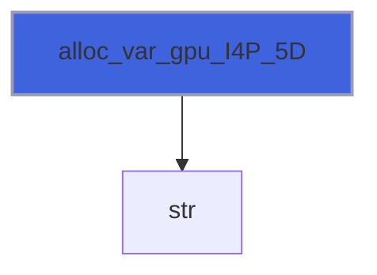
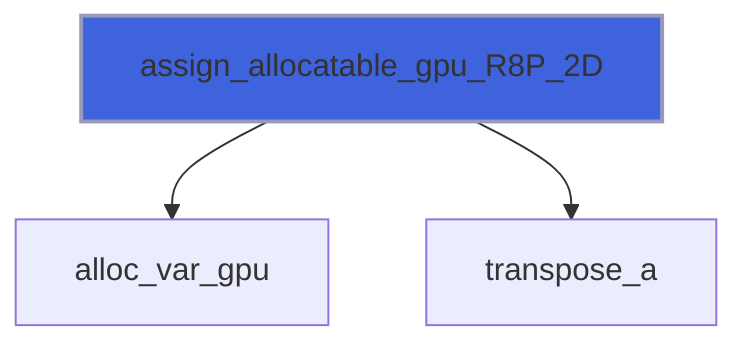
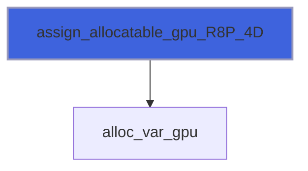
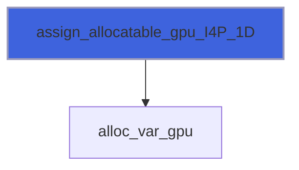
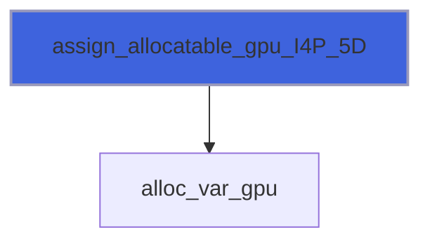

# adam_memory_nvf_library

> ADAM, memory library.

**Source**: `src/lib/nvf/adam_memory_nvf_library.F90`

**Dependencies**


## Contents

- [alloc_var_gpu](#alloc-var-gpu)
- [assign_allocatable_gpu](#assign-allocatable-gpu)
- [transpose_a](#transpose-a)
- [alloc_var_gpu_R8P_1D](#alloc-var-gpu-r8p-1d)
- [alloc_var_gpu_R8P_2D](#alloc-var-gpu-r8p-2d)
- [alloc_var_gpu_R8P_3D](#alloc-var-gpu-r8p-3d)
- [alloc_var_gpu_R8P_4D](#alloc-var-gpu-r8p-4d)
- [alloc_var_gpu_R8P_5D](#alloc-var-gpu-r8p-5d)
- [alloc_var_gpu_R8P_6D](#alloc-var-gpu-r8p-6d)
- [alloc_var_gpu_I4P_1D](#alloc-var-gpu-i4p-1d)
- [alloc_var_gpu_I4P_5D](#alloc-var-gpu-i4p-5d)
- [alloc_var_gpu_I8P_1D](#alloc-var-gpu-i8p-1d)
- [alloc_var_gpu_I8P_2D](#alloc-var-gpu-i8p-2d)
- [alloc_var_gpu_I8P_3D](#alloc-var-gpu-i8p-3d)
- [assign_allocatable_gpu_R8P_1D](#assign-allocatable-gpu-r8p-1d)
- [assign_allocatable_gpu_R8P_2D](#assign-allocatable-gpu-r8p-2d)
- [assign_allocatable_gpu_R8P_3D](#assign-allocatable-gpu-r8p-3d)
- [assign_allocatable_gpu_R8P_4D](#assign-allocatable-gpu-r8p-4d)
- [assign_allocatable_gpu_I4P_1D](#assign-allocatable-gpu-i4p-1d)
- [assign_allocatable_gpu_I4P_1D_rhs_allocated](#assign-allocatable-gpu-i4p-1d-rhs-allocated)
- [assign_allocatable_gpu_I4P_5D](#assign-allocatable-gpu-i4p-5d)
- [assign_allocatable_gpu_I8P_2D](#assign-allocatable-gpu-i8p-2d)
- [assign_allocatable_gpu_I8P_3D](#assign-allocatable-gpu-i8p-3d)
- [save_memory_gpu_status](#save-memory-gpu-status)
- [transpose_a_R8P_2D](#transpose-a-r8p-2d)

## Interfaces

### alloc_var_gpu

Allocate GPU variable with memory checking.

**Module procedures**: [`alloc_var_gpu_R8P_1D`](/api/src/lib/nvf/adam_memory_nvf_library#alloc-var-gpu-r8p-1d), [`alloc_var_gpu_R8P_2D`](/api/src/lib/nvf/adam_memory_nvf_library#alloc-var-gpu-r8p-2d), [`alloc_var_gpu_R8P_3D`](/api/src/lib/nvf/adam_memory_nvf_library#alloc-var-gpu-r8p-3d), [`alloc_var_gpu_R8P_4D`](/api/src/lib/nvf/adam_memory_nvf_library#alloc-var-gpu-r8p-4d), [`alloc_var_gpu_R8P_5D`](/api/src/lib/nvf/adam_memory_nvf_library#alloc-var-gpu-r8p-5d), [`alloc_var_gpu_R8P_6D`](/api/src/lib/nvf/adam_memory_nvf_library#alloc-var-gpu-r8p-6d), [`alloc_var_gpu_I4P_1D`](/api/src/lib/nvf/adam_memory_nvf_library#alloc-var-gpu-i4p-1d), [`alloc_var_gpu_I4P_5D`](/api/src/lib/nvf/adam_memory_nvf_library#alloc-var-gpu-i4p-5d), [`alloc_var_gpu_I8P_1D`](/api/src/lib/nvf/adam_memory_nvf_library#alloc-var-gpu-i8p-1d), [`alloc_var_gpu_I8P_2D`](/api/src/lib/nvf/adam_memory_nvf_library#alloc-var-gpu-i8p-2d), [`alloc_var_gpu_I8P_3D`](/api/src/lib/nvf/adam_memory_nvf_library#alloc-var-gpu-i8p-3d)

### assign_allocatable_gpu

Assign GPU variable with memory checking.

**Module procedures**: [`assign_allocatable_gpu_R8P_1D`](/api/src/lib/nvf/adam_memory_nvf_library#assign-allocatable-gpu-r8p-1d), [`assign_allocatable_gpu_R8P_2D`](/api/src/lib/nvf/adam_memory_nvf_library#assign-allocatable-gpu-r8p-2d), [`assign_allocatable_gpu_R8P_3D`](/api/src/lib/nvf/adam_memory_nvf_library#assign-allocatable-gpu-r8p-3d), [`assign_allocatable_gpu_R8P_4D`](/api/src/lib/nvf/adam_memory_nvf_library#assign-allocatable-gpu-r8p-4d), [`assign_allocatable_gpu_I4P_1D`](/api/src/lib/nvf/adam_memory_nvf_library#assign-allocatable-gpu-i4p-1d), [`assign_allocatable_gpu_I4P_1D_rhs_allocated`](/api/src/lib/nvf/adam_memory_nvf_library#assign-allocatable-gpu-i4p-1d-rhs-allocated), [`assign_allocatable_gpu_I4P_5D`](/api/src/lib/nvf/adam_memory_nvf_library#assign-allocatable-gpu-i4p-5d), [`assign_allocatable_gpu_I8P_2D`](/api/src/lib/nvf/adam_memory_nvf_library#assign-allocatable-gpu-i8p-2d), [`assign_allocatable_gpu_I8P_3D`](/api/src/lib/nvf/adam_memory_nvf_library#assign-allocatable-gpu-i8p-3d)

### transpose_a

**Module procedures**: [`transpose_a_R8P_2D`](/api/src/lib/nvf/adam_memory_nvf_library#transpose-a-r8p-2d)

## Subroutines

### alloc_var_gpu_R8P_1D

Allocate GPU variable with memory checking (kind R8P, rank 1).

```fortran
subroutine alloc_var_gpu_R8P_1D(var, ulb, msg, verbose)
```

**Arguments**

| Name | Type | Intent | Attributes | Description |
|------|------|--------|------------|-------------|
| `var` | real(kind=[R8P](/api/src/third_party/PENF/src/lib/penf_global_parameters_variables)) | inout | allocatable, device | Varibale to be allocate on GPU. |
| `ulb` | integer(kind=[I4P](/api/src/third_party/PENF/src/lib/penf_global_parameters_variables)) | in |  | Upper/lower bounds of variable. |
| `msg` | character(len=*) | in | optional | Message to be printed in verbose mode. |
| `verbose` | logical | in | optional | Flag to activate verbose mode. |

**Call graph**


### alloc_var_gpu_R8P_2D

Allocate GPU variable with memory checking (kind R8P, rank 2).

```fortran
subroutine alloc_var_gpu_R8P_2D(var, ulb, msg, verbose)
```

**Arguments**

| Name | Type | Intent | Attributes | Description |
|------|------|--------|------------|-------------|
| `var` | real(kind=[R8P](/api/src/third_party/PENF/src/lib/penf_global_parameters_variables)) | inout | allocatable, device | Varibale to be allocate on GPU. |
| `ulb` | integer(kind=[I4P](/api/src/third_party/PENF/src/lib/penf_global_parameters_variables)) | in |  | Upper/lower bounds of variable. |
| `msg` | character(len=*) | in | optional | Message to be printed in verbose mode. |
| `verbose` | logical | in | optional | Flag to activate verbose mode. |

**Call graph**


### alloc_var_gpu_R8P_3D

Allocate GPU variable with memory checking (kind R8P, rank 3).

```fortran
subroutine alloc_var_gpu_R8P_3D(var, ulb, msg, verbose)
```

**Arguments**

| Name | Type | Intent | Attributes | Description |
|------|------|--------|------------|-------------|
| `var` | real(kind=[R8P](/api/src/third_party/PENF/src/lib/penf_global_parameters_variables)) | inout | allocatable, device | Varibale to be allocate on GPU. |
| `ulb` | integer(kind=[I4P](/api/src/third_party/PENF/src/lib/penf_global_parameters_variables)) | in |  | Upper/lower bounds of variable. |
| `msg` | character(len=*) | in | optional | Message to be printed in verbose mode. |
| `verbose` | logical | in | optional | Flag to activate verbose mode. |

**Call graph**


### alloc_var_gpu_R8P_4D

Allocate GPU variable with memory checking (kind R8P, rank 4).

```fortran
subroutine alloc_var_gpu_R8P_4D(var, ulb, msg, verbose)
```

**Arguments**

| Name | Type | Intent | Attributes | Description |
|------|------|--------|------------|-------------|
| `var` | real(kind=[R8P](/api/src/third_party/PENF/src/lib/penf_global_parameters_variables)) | inout | allocatable, device | Varibale to be allocate on GPU. |
| `ulb` | integer(kind=[I4P](/api/src/third_party/PENF/src/lib/penf_global_parameters_variables)) | in |  | Upper/lower bounds of variable. |
| `msg` | character(len=*) | in | optional | Message to be printed in verbose mode. |
| `verbose` | logical | in | optional | Flag to activate verbose mode. |

**Call graph**


### alloc_var_gpu_R8P_5D

Allocate GPU variable with memory checking (kind R8P, rank 5).

```fortran
subroutine alloc_var_gpu_R8P_5D(var, ulb, msg, verbose)
```

**Arguments**

| Name | Type | Intent | Attributes | Description |
|------|------|--------|------------|-------------|
| `var` | real(kind=[R8P](/api/src/third_party/PENF/src/lib/penf_global_parameters_variables)) | inout | allocatable, device | Varibale to be allocate on GPU. |
| `ulb` | integer(kind=[I4P](/api/src/third_party/PENF/src/lib/penf_global_parameters_variables)) | in |  | Upper/lower bounds of variable. |
| `msg` | character(len=*) | in | optional | Message to be printed in verbose mode. |
| `verbose` | logical | in | optional | Flag to activate verbose mode. |

**Call graph**


### alloc_var_gpu_R8P_6D

Allocate GPU variable with memory checking (kind R8P, rank 6).

```fortran
subroutine alloc_var_gpu_R8P_6D(var, ulb, msg, verbose)
```

**Arguments**

| Name | Type | Intent | Attributes | Description |
|------|------|--------|------------|-------------|
| `var` | real(kind=[R8P](/api/src/third_party/PENF/src/lib/penf_global_parameters_variables)) | inout | allocatable, device | Varibale to be allocate on GPU. |
| `ulb` | integer(kind=[I4P](/api/src/third_party/PENF/src/lib/penf_global_parameters_variables)) | in |  | Upper/lower bounds of variable. |
| `msg` | character(len=*) | in | optional | Message to be printed in verbose mode. |
| `verbose` | logical | in | optional | Flag to activate verbose mode. |

**Call graph**


### alloc_var_gpu_I4P_1D

Allocate GPU variable with memory checking (kind I4P, rank 1).

```fortran
subroutine alloc_var_gpu_I4P_1D(var, ulb, msg, verbose)
```

**Arguments**

| Name | Type | Intent | Attributes | Description |
|------|------|--------|------------|-------------|
| `var` | integer(kind=[I4P](/api/src/third_party/PENF/src/lib/penf_global_parameters_variables)) | inout | allocatable, device | Varibale to be allocate on GPU. |
| `ulb` | integer(kind=[I4P](/api/src/third_party/PENF/src/lib/penf_global_parameters_variables)) | in |  | Upper/lower bounds of variable. |
| `msg` | character(len=*) | in | optional | Message to be printed in verbose mode. |
| `verbose` | logical | in | optional | Flag to activate verbose mode. |

**Call graph**


### alloc_var_gpu_I4P_5D

Allocate GPU variable with memory checking (kind I4P, rank 5).

```fortran
subroutine alloc_var_gpu_I4P_5D(var, ulb, msg, verbose)
```

**Arguments**

| Name | Type | Intent | Attributes | Description |
|------|------|--------|------------|-------------|
| `var` | integer(kind=[I4P](/api/src/third_party/PENF/src/lib/penf_global_parameters_variables)) | inout | allocatable, device | Varibale to be allocate on GPU. |
| `ulb` | integer(kind=[I4P](/api/src/third_party/PENF/src/lib/penf_global_parameters_variables)) | in |  | Upper/lower bounds of variable. |
| `msg` | character(len=*) | in | optional | Message to be printed in verbose mode. |
| `verbose` | logical | in | optional | Flag to activate verbose mode. |

**Call graph**



### alloc_var_gpu_I8P_1D

Allocate GPU variable with memory checking (kind I8P, rank 1).

```fortran
subroutine alloc_var_gpu_I8P_1D(var, ulb, msg, verbose)
```

**Arguments**

| Name | Type | Intent | Attributes | Description |
|------|------|--------|------------|-------------|
| `var` | integer(kind=[I8P](/api/src/third_party/PENF/src/lib/penf_global_parameters_variables)) | inout | allocatable, device | Varibale to be allocate on GPU. |
| `ulb` | integer(kind=[I4P](/api/src/third_party/PENF/src/lib/penf_global_parameters_variables)) | in |  | Upper/lower bounds of variable. |
| `msg` | character(len=*) | in | optional | Message to be printed in verbose mode. |
| `verbose` | logical | in | optional | Flag to activate verbose mode. |

**Call graph**


### alloc_var_gpu_I8P_2D

Allocate GPU variable with memory checking (kind I8P, rank 2).

```fortran
subroutine alloc_var_gpu_I8P_2D(var, ulb, msg, verbose)
```

**Arguments**

| Name | Type | Intent | Attributes | Description |
|------|------|--------|------------|-------------|
| `var` | integer(kind=[I8P](/api/src/third_party/PENF/src/lib/penf_global_parameters_variables)) | inout | allocatable, device | Varibale to be allocate on GPU. |
| `ulb` | integer(kind=[I4P](/api/src/third_party/PENF/src/lib/penf_global_parameters_variables)) | in |  | Upper/lower bounds of variable. |
| `msg` | character(len=*) | in | optional | Message to be printed in verbose mode. |
| `verbose` | logical | in | optional | Flag to activate verbose mode. |

**Call graph**


### alloc_var_gpu_I8P_3D

Allocate GPU variable with memory checking (kind I8P, rank 3).

```fortran
subroutine alloc_var_gpu_I8P_3D(var, ulb, msg, verbose)
```

**Arguments**

| Name | Type | Intent | Attributes | Description |
|------|------|--------|------------|-------------|
| `var` | integer(kind=[I8P](/api/src/third_party/PENF/src/lib/penf_global_parameters_variables)) | inout | allocatable, device | Varibale to be allocate on GPU. |
| `ulb` | integer(kind=[I4P](/api/src/third_party/PENF/src/lib/penf_global_parameters_variables)) | in |  | Upper/lower bounds of variable. |
| `msg` | character(len=*) | in | optional | Message to be printed in verbose mode. |
| `verbose` | logical | in | optional | Flag to activate verbose mode. |

**Call graph**


### assign_allocatable_gpu_R8P_1D

Assign GPU variable with memory checking (kind R8P, rank 1).
 Variable is returned not allocated if right hand side is not allocated.

```fortran
subroutine assign_allocatable_gpu_R8P_1D(lhs, rhs, msg, verbose)
```

**Arguments**

| Name | Type | Intent | Attributes | Description |
|------|------|--------|------------|-------------|
| `lhs` | real(kind=[R8P](/api/src/third_party/PENF/src/lib/penf_global_parameters_variables)) | inout | allocatable, device | Left hand side of assignement. |
| `rhs` | real(kind=[R8P](/api/src/third_party/PENF/src/lib/penf_global_parameters_variables)) | in | allocatable | Right hand side of assignement. |
| `msg` | character(len=*) | in | optional | Message to be printed in verbose mode. |
| `verbose` | logical | in | optional | Flag to activate verbose mode. |

**Call graph**


### assign_allocatable_gpu_R8P_2D

Assign GPU variable with memory checking (kind R8P, rank 2).
 Variable is returned not allocated if right hand side is not allocated.

```fortran
subroutine assign_allocatable_gpu_R8P_2D(lhs, rhs, transposed, msg, verbose)
```

**Arguments**

| Name | Type | Intent | Attributes | Description |
|------|------|--------|------------|-------------|
| `lhs` | real(kind=[R8P](/api/src/third_party/PENF/src/lib/penf_global_parameters_variables)) | inout | allocatable, device | Left hand side of assignement. |
| `rhs` | real(kind=[R8P](/api/src/third_party/PENF/src/lib/penf_global_parameters_variables)) | in | allocatable | Right hand side of assignement. |
| `transposed` | logical | in | optional | Assign trasposed rhs. |
| `msg` | character(len=*) | in | optional | Message to be printed in verbose mode. |
| `verbose` | logical | in | optional | Flag to activate verbose mode. |

**Call graph**



### assign_allocatable_gpu_R8P_3D

Assign GPU variable with memory checking (kind R8P, rank 3).
 Variable is returned not allocated if right hand side is not allocated.

```fortran
subroutine assign_allocatable_gpu_R8P_3D(lhs, rhs, msg, verbose)
```

**Arguments**

| Name | Type | Intent | Attributes | Description |
|------|------|--------|------------|-------------|
| `lhs` | real(kind=[R8P](/api/src/third_party/PENF/src/lib/penf_global_parameters_variables)) | inout | allocatable, device | Left hand side of assignement. |
| `rhs` | real(kind=[R8P](/api/src/third_party/PENF/src/lib/penf_global_parameters_variables)) | in | allocatable | Right hand side of assignement. |
| `msg` | character(len=*) | in | optional | Message to be printed in verbose mode. |
| `verbose` | logical | in | optional | Flag to activate verbose mode. |

**Call graph**


### assign_allocatable_gpu_R8P_4D

Assign GPU variable with memory checking (kind R8P, rank 4).
 Variable is returned not allocated if right hand side is not allocated.

```fortran
subroutine assign_allocatable_gpu_R8P_4D(lhs, rhs, msg, verbose)
```

**Arguments**

| Name | Type | Intent | Attributes | Description |
|------|------|--------|------------|-------------|
| `lhs` | real(kind=[R8P](/api/src/third_party/PENF/src/lib/penf_global_parameters_variables)) | inout | allocatable, device | Left hand side of assignement. |
| `rhs` | real(kind=[R8P](/api/src/third_party/PENF/src/lib/penf_global_parameters_variables)) | in | allocatable | Right hand side of assignement. |
| `msg` | character(len=*) | in | optional | Message to be printed in verbose mode. |
| `verbose` | logical | in | optional | Flag to activate verbose mode. |

**Call graph**



### assign_allocatable_gpu_I4P_1D

Assign GPU variable with memory checking (kind I4P, rank 1).
 Variable is returned not allocated if right hand side is not allocated.

```fortran
subroutine assign_allocatable_gpu_I4P_1D(lhs, rhs, msg, verbose)
```

**Arguments**

| Name | Type | Intent | Attributes | Description |
|------|------|--------|------------|-------------|
| `lhs` | integer(kind=[I4P](/api/src/third_party/PENF/src/lib/penf_global_parameters_variables)) | inout | allocatable, device | Varibale to be allocate on GPU. |
| `rhs` | integer(kind=[I4P](/api/src/third_party/PENF/src/lib/penf_global_parameters_variables)) | in | allocatable | Right hand side of assignement. |
| `msg` | character(len=*) | in | optional | Message to be printed in verbose mode. |
| `verbose` | logical | in | optional | Flag to activate verbose mode. |

**Call graph**



### assign_allocatable_gpu_I4P_1D_rhs_allocated

Assign GPU variable with memory checking (kind I4P, rank 1, rhs allocated).

```fortran
subroutine assign_allocatable_gpu_I4P_1D_rhs_allocated(lhs, rhsa, msg, verbose)
```

**Arguments**

| Name | Type | Intent | Attributes | Description |
|------|------|--------|------------|-------------|
| `lhs` | integer(kind=[I4P](/api/src/third_party/PENF/src/lib/penf_global_parameters_variables)) | inout | allocatable, device | Varibale to be allocate on GPU. |
| `rhsa` | integer(kind=[I4P](/api/src/third_party/PENF/src/lib/penf_global_parameters_variables)) | in |  | Right hand side of assignement. |
| `msg` | character(len=*) | in | optional | Message to be printed in verbose mode. |
| `verbose` | logical | in | optional | Flag to activate verbose mode. |

**Call graph**


### assign_allocatable_gpu_I4P_5D

Assign GPU variable with memory checking (kind I4P, rank 5).
 Variable is returned not allocated if right hand side is not allocated.

```fortran
subroutine assign_allocatable_gpu_I4P_5D(lhs, rhs, msg, verbose)
```

**Arguments**

| Name | Type | Intent | Attributes | Description |
|------|------|--------|------------|-------------|
| `lhs` | integer(kind=[I4P](/api/src/third_party/PENF/src/lib/penf_global_parameters_variables)) | inout | allocatable, device | Left hand side of assignement. |
| `rhs` | integer(kind=[I4P](/api/src/third_party/PENF/src/lib/penf_global_parameters_variables)) | in | allocatable | Right hand side of assignement. |
| `msg` | character(len=*) | in | optional | Message to be printed in verbose mode. |
| `verbose` | logical | in | optional | Flag to activate verbose mode. |

**Call graph**



### assign_allocatable_gpu_I8P_2D

Assign GPU variable with memory checking (kind I8P, rank 2).
 Variable is returned not allocated if right hand side is not allocated.

```fortran
subroutine assign_allocatable_gpu_I8P_2D(lhs, rhs, msg, verbose)
```

**Arguments**

| Name | Type | Intent | Attributes | Description |
|------|------|--------|------------|-------------|
| `lhs` | integer(kind=[I8P](/api/src/third_party/PENF/src/lib/penf_global_parameters_variables)) | inout | allocatable, device | Left hand side of assignement. |
| `rhs` | integer(kind=[I8P](/api/src/third_party/PENF/src/lib/penf_global_parameters_variables)) | in | allocatable | Right hand side of assignement. |
| `msg` | character(len=*) | in | optional | Message to be printed in verbose mode. |
| `verbose` | logical | in | optional | Flag to activate verbose mode. |

**Call graph**


### assign_allocatable_gpu_I8P_3D

Assign GPU variable with memory checking (kind I8P, rank 3).
 Variable is returned not allocated if right hand side is not allocated.

```fortran
subroutine assign_allocatable_gpu_I8P_3D(lhs, rhs, msg, verbose)
```

**Arguments**

| Name | Type | Intent | Attributes | Description |
|------|------|--------|------------|-------------|
| `lhs` | integer(kind=[I8P](/api/src/third_party/PENF/src/lib/penf_global_parameters_variables)) | inout | allocatable, device | Left hand side of assignement. |
| `rhs` | integer(kind=[I8P](/api/src/third_party/PENF/src/lib/penf_global_parameters_variables)) | in | allocatable | Right hand side of assignement. |
| `msg` | character(len=*) | in | optional | Message to be printed in verbose mode. |
| `verbose` | logical | in | optional | Flag to activate verbose mode. |

**Call graph**

```mermaid
flowchart TD
  assign_allocatable_gpu_I8P_3D["assign_allocatable_gpu_I8P_3D"] --> alloc_var_gpu["alloc_var_gpu"]
  style assign_allocatable_gpu_I8P_3D fill:#3e63dd,stroke:#99b,stroke-width:2px
```

### save_memory_gpu_status

Save the current CPU-memory status into a file.
 File is accessed in append position.

```fortran
subroutine save_memory_gpu_status(file_name, tag)
```

**Arguments**

| Name | Type | Intent | Attributes | Description |
|------|------|--------|------------|-------------|
| `file_name` | character(len=*) | in |  | File name. |
| `tag` | character(len=*) | in | optional | Tag of current status. |

**Call graph**

```mermaid
flowchart TD
  simulate["simulate"] --> save_memory_gpu_status["save_memory_gpu_status"]
  simulate["simulate"] --> save_memory_gpu_status["save_memory_gpu_status"]
  style save_memory_gpu_status fill:#3e63dd,stroke:#99b,stroke-width:2px
```

### transpose_a_R8P_2D

Transpose array (kind R8P, rank 2).

```fortran
subroutine transpose_a_R8P_2D(ii, jj, a, t)
```

**Arguments**

| Name | Type | Intent | Attributes | Description |
|------|------|--------|------------|-------------|
| `ii` | integer(kind=[I4P](/api/src/third_party/PENF/src/lib/penf_global_parameters_variables)) | in |  | Array bounds. |
| `jj` | integer(kind=[I4P](/api/src/third_party/PENF/src/lib/penf_global_parameters_variables)) | in |  | Array bounds. |
| `a` | real(kind=[R8P](/api/src/third_party/PENF/src/lib/penf_global_parameters_variables)) | in |  | Input array. |
| `t` | real(kind=[R8P](/api/src/third_party/PENF/src/lib/penf_global_parameters_variables)) | out |  | Transposed array. |
