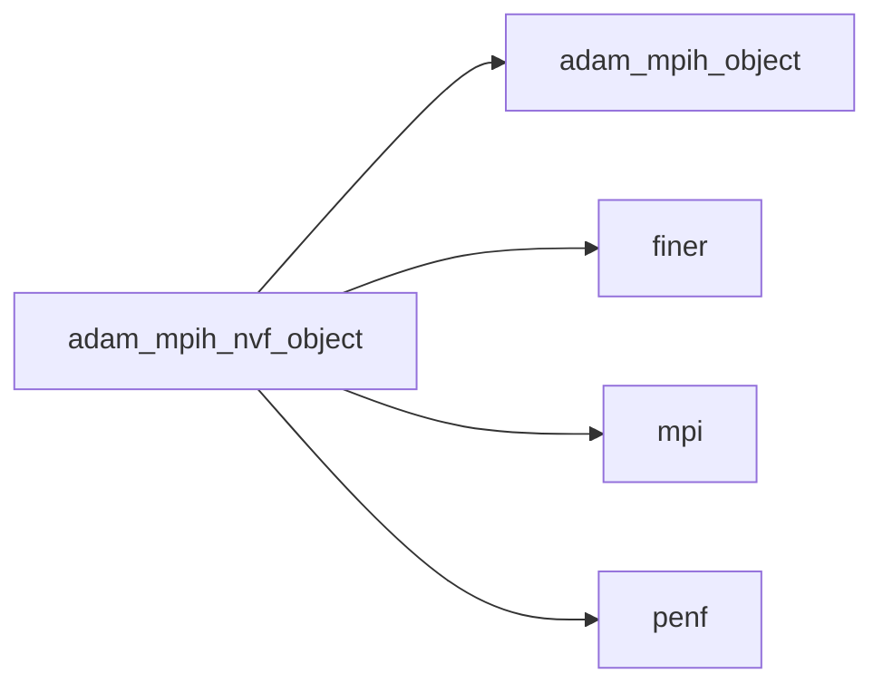
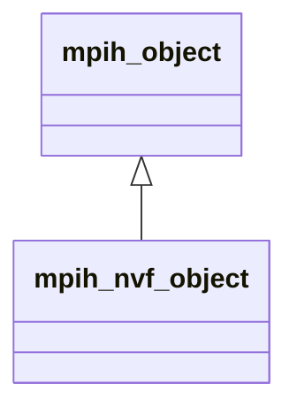
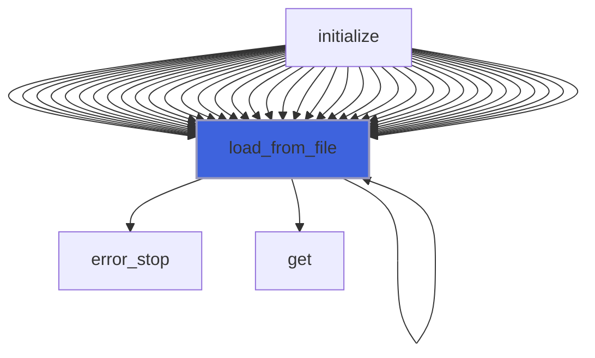
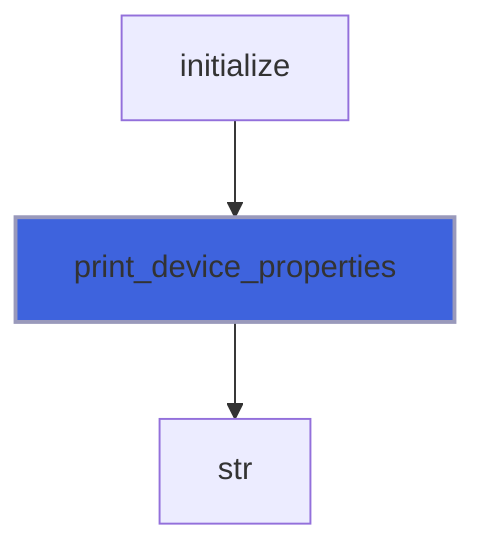
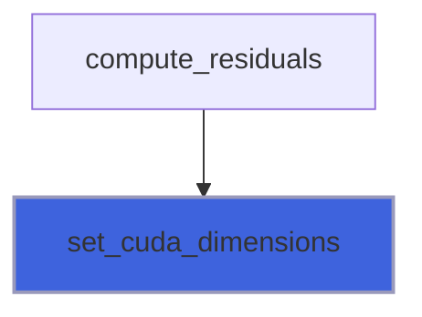
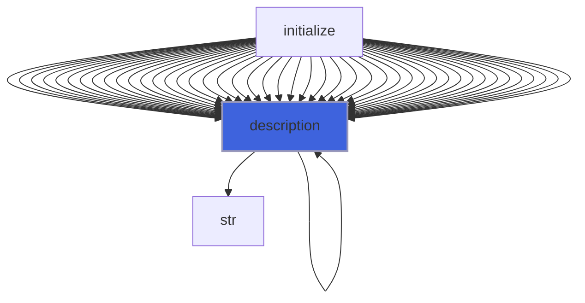

# adam_mpih_nvf_object

> ADAM, MPI handler class definition, NVF backend.

 Extend common mpih class adding NVF features.

**Source**: `src/lib/nvf/adam_mpih_nvf_object.F90`

**Dependencies**



## Contents

- [mpih_nvf_object](#mpih-nvf-object)
- [initialize](#initialize)
- [check_cuda_error](#check-cuda-error)
- [load_from_file](#load-from-file)
- [print_device_properties](#print-device-properties)
- [set_cuda_dimensions](#set-cuda-dimensions)
- [description](#description)

## Variables

| Name | Type | Attributes | Description |
|------|------|------------|-------------|
| `CUDA_SILENT_ERR` | integer(kind=[I4P](/api/src/third_party/PENF/src/lib/penf_global_parameters_variables)) | parameter | CUDA silent error code. |
| `INI_SECTION_NAME` | character(len=4) | parameter | INI (config) file section name containing configs. |

## Derived Types

### mpih_nvf_object

MPI handler class, NVF backend.

**Inheritance**



**Extends**: [`mpih_object`](/api/src/third_party/FUNDAL/src/lib/fundal_mpih_object#mpih-object)

#### Components

| Name | Type | Attributes | Description |
|------|------|------------|-------------|
| `myrank` | integer(kind=[I4P](/api/src/third_party/PENF/src/lib/penf_global_parameters_variables)) |  | MPI rank process. |
| `myrankstr` | character(len=:) | allocatable | MPI rank process stringified. |
| `procs_number` | integer(kind=[I4P](/api/src/third_party/PENF/src/lib/penf_global_parameters_variables)) |  | Number of MPI processes. |
| `memory_avail` | real(kind=[R8P](/api/src/third_party/PENF/src/lib/penf_global_parameters_variables)) |  | CPU memory available (GB) for each process. |
| `error` | integer(kind=[I4P](/api/src/third_party/PENF/src/lib/penf_global_parameters_variables)) |  | Error traping flag. |
| `timing` | real(kind=[R8P](/api/src/third_party/PENF/src/lib/penf_global_parameters_variables)) |  | Tic toc timing. |
| `tictoc` | integer(kind=[I4P](/api/src/third_party/PENF/src/lib/penf_global_parameters_variables)) |  | Next is tic or toc? |
| `req_send_recv` | integer(kind=[I4P](/api/src/third_party/PENF/src/lib/penf_global_parameters_variables)) | allocatable | MPI request receive flags. |
| `mydev` | integer(kind=[I4P](/api/src/third_party/PENF/src/lib/penf_global_parameters_variables)) |  | My GPU rank. |
| `local_comm` | integer(kind=[I4P](/api/src/third_party/PENF/src/lib/penf_global_parameters_variables)) |  | Local communicator. |
| `iercuda` | integer(kind=[I4P](/api/src/third_party/PENF/src/lib/penf_global_parameters_variables)) |  | Error trapping flag for CUDAFortran. |
| `cblk` | integer(kind=[I4P](/api/src/third_party/PENF/src/lib/penf_global_parameters_variables)) |  | Default CUDA block dimensions. |
| `grid` | type(dim3) |  | CUDA grid and block. |
| `tBlock` | type(dim3) |  | CUDA grid and block. |

#### Type-Bound Procedures

| Name | Attributes | Description |
|------|------------|-------------|
| `abort` | pass(self) | Handy MPI abort wrapper. |
| `barrier` | pass(self) | Handy MPI barrier wrapper. |
| `error_stop` | pass(self) | Stop run with error output. |
| `finalize` | pass(self) | Handy MPI finalize wrapper. |
| `print_message` | pass(self) | Print a message on stdout with rank prefix. |
| `tictoc_timing` | pass(self) | Return the last tic toc timing. |
| `tic` | pass(self) | Start a tic toc timing. |
| `toc` | pass(self) | Stop  a tic toc timing. |
| `initialize` | pass(self) | Initialize MPI handler data. |
| `check_cuda_error` | pass(self) | Check if CUDA error occurs and abort in case. |
| `description` | pass(self) | Return pretty-printed object description. |
| `load_from_file` | pass(self) | Load config from file. |
| `print_device_properties` | pass(self) | Pretty print device properties. |
| `set_cuda_dimensions` | pass(self) | Compute CUDA grid dimensions for GPU parallel computations. |

## Subroutines

### initialize

Initialize MPI handler data.

```fortran
subroutine initialize(self, do_mpi_init, do_device_init, myrankstr_char_length, verbose)
```

**Arguments**

| Name | Type | Intent | Attributes | Description |
|------|------|--------|------------|-------------|
| `self` | class([mpih_nvf_object](/api/src/lib/nvf/adam_mpih_nvf_object#mpih-nvf-object)) | inout |  | MPI handler. |
| `do_mpi_init` | logical | in | optional | Flag to activate MPI init call. |
| `do_device_init` | logical | in | optional | Flag to activate device init call. |
| `myrankstr_char_length` | integer(kind=[I4P](/api/src/third_party/PENF/src/lib/penf_global_parameters_variables)) | in | optional | MPI ID string length. |
| `verbose` | logical | in | optional | Trigger verbose output. |

**Call graph**



```mermaid
flowchart TD
  add_node["add_node"] --> initialize["initialize"]
  analize["analize"] --> initialize["initialize"]
  build_connectivity["build_connectivity"] --> initialize["initialize"]
  distribute_facets["distribute_facets"] --> initialize["initialize"]
  distribute_facets_tree["distribute_facets_tree"] --> initialize["initialize"]
  export_vtk_file["export_vtk_file"] --> initialize["initialize"]
  initialize["initialize"] --> initialize["initialize"]
  initialize["initialize"] --> initialize["initialize"]
  initialize["initialize"] --> initialize["initialize"]
  initialize["initialize"] --> initialize["initialize"]
  initialize["initialize"] --> initialize["initialize"]
  initialize["initialize"] --> initialize["initialize"]
  initialize["initialize"] --> initialize["initialize"]
  initialize["initialize"] --> initialize["initialize"]
  initialize["initialize"] --> initialize["initialize"]
  initialize["initialize"] --> initialize["initialize"]
  initialize["initialize"] --> initialize["initialize"]
  initialize["initialize"] --> initialize["initialize"]
  initialize["initialize"] --> initialize["initialize"]
  initialize["initialize"] --> initialize["initialize"]
  initialize["initialize"] --> initialize["initialize"]
  initialize["initialize"] --> initialize["initialize"]
  initialize["initialize"] --> initialize["initialize"]
  initialize["initialize"] --> initialize["initialize"]
  initialize["initialize"] --> initialize["initialize"]
  initialize["initialize"] --> initialize["initialize"]
  initialize["initialize"] --> initialize["initialize"]
  initialize["initialize"] --> initialize["initialize"]
  initialize["initialize"] --> initialize["initialize"]
  initialize["initialize"] --> initialize["initialize"]
  initialize["initialize"] --> initialize["initialize"]
  initialize["initialize"] --> initialize["initialize"]
  initialize["initialize"] --> initialize["initialize"]
  initialize["initialize"] --> initialize["initialize"]
  initialize["initialize"] --> initialize["initialize"]
  initialize["initialize"] --> initialize["initialize"]
  initialize["initialize"] --> initialize["initialize"]
  initialize["initialize"] --> initialize["initialize"]
  initialize["initialize"] --> initialize["initialize"]
  initialize["initialize"] --> initialize["initialize"]
  initialize["initialize"] --> initialize["initialize"]
  initialize["initialize"] --> initialize["initialize"]
  initialize["initialize"] --> initialize["initialize"]
  initialize["initialize"] --> initialize["initialize"]
  initialize["initialize"] --> initialize["initialize"]
  initialize["initialize"] --> initialize["initialize"]
  initialize["initialize"] --> initialize["initialize"]
  initialize["initialize"] --> initialize["initialize"]
  initialize["initialize"] --> initialize["initialize"]
  initialize["initialize"] --> initialize["initialize"]
  initialize["initialize"] --> initialize["initialize"]
  initialize["initialize"] --> initialize["initialize"]
  initialize["initialize"] --> initialize["initialize"]
  initialize["initialize"] --> initialize["initialize"]
  initialize["initialize"] --> initialize["initialize"]
  initialize["initialize"] --> initialize["initialize"]
  initialize["initialize"] --> initialize["initialize"]
  initialize["initialize"] --> initialize["initialize"]
  initialize["initialize"] --> initialize["initialize"]
  initialize["initialize"] --> initialize["initialize"]
  initialize["initialize"] --> initialize["initialize"]
  initialize["initialize"] --> initialize["initialize"]
  initialize["initialize"] --> initialize["initialize"]
  initialize["initialize"] --> initialize["initialize"]
  initialize["initialize"] --> initialize["initialize"]
  initialize["initialize"] --> initialize["initialize"]
  initialize["initialize"] --> initialize["initialize"]
  initialize["initialize"] --> initialize["initialize"]
  initialize["initialize"] --> initialize["initialize"]
  initialize["initialize"] --> initialize["initialize"]
  initialize["initialize"] --> initialize["initialize"]
  initialize["initialize"] --> initialize["initialize"]
  initialize["initialize"] --> initialize["initialize"]
  initialize["initialize"] --> initialize["initialize"]
  initialize["initialize"] --> initialize["initialize"]
  initialize["initialize"] --> initialize["initialize"]
  initialize["initialize"] --> initialize["initialize"]
  initialize["initialize"] --> initialize["initialize"]
  initialize_common["initialize_common"] --> initialize["initialize"]
  initialize_common["initialize_common"] --> initialize["initialize"]
  initialize_common["initialize_common"] --> initialize["initialize"]
  initialize_common["initialize_common"] --> initialize["initialize"]
  load_from_file["load_from_file"] --> initialize["initialize"]
  load_from_file["load_from_file"] --> initialize["initialize"]
  open_file["open_file"] --> initialize["initialize"]
  open_file["open_file"] --> initialize["initialize"]
  open_file["open_file"] --> initialize["initialize"]
  resize["resize"] --> initialize["initialize"]
  save_into_file["save_into_file"] --> initialize["initialize"]
  save_vtk["save_vtk"] --> initialize["initialize"]
  simulate["simulate"] --> initialize["initialize"]
  simulate["simulate"] --> initialize["initialize"]
  simulate["simulate"] --> initialize["initialize"]
  simulate["simulate"] --> initialize["initialize"]
  simulate["simulate"] --> initialize["initialize"]
  simulate["simulate"] --> initialize["initialize"]
  simulate["simulate"] --> initialize["initialize"]
  test_stress["test_stress"] --> initialize["initialize"]
  initialize["initialize"] --> initialize["initialize"]
  initialize["initialize"] --> print_device_properties["print_device_properties"]
  initialize["initialize"] --> print_message["print_message"]
  style initialize fill:#3e63dd,stroke:#99b,stroke-width:2px
```

### check_cuda_error

Check if CUDA error occurs and abort in case.

```fortran
subroutine check_cuda_error(self, error_code, msg)
```

**Arguments**

| Name | Type | Intent | Attributes | Description |
|------|------|--------|------------|-------------|
| `self` | class([mpih_nvf_object](/api/src/lib/nvf/adam_mpih_nvf_object#mpih-nvf-object)) | inout |  | MPI handler. |
| `error_code` | integer(kind=[I4P](/api/src/third_party/PENF/src/lib/penf_global_parameters_variables)) | in | optional | Abort error code. |
| `msg` | character(len=*) | in | optional | Error message. |

**Call graph**



```mermaid
flowchart TD
  assign_stage["assign_stage"] --> check_cuda_error["check_cuda_error"]
  compute_dt["compute_dt"] --> check_cuda_error["check_cuda_error"]
  compute_phi["compute_phi"] --> check_cuda_error["check_cuda_error"]
  compute_q_auxiliary["compute_q_auxiliary"] --> check_cuda_error["check_cuda_error"]
  compute_residuals["compute_residuals"] --> check_cuda_error["check_cuda_error"]
  compute_stage["compute_stage"] --> check_cuda_error["check_cuda_error"]
  compute_stage_ls["compute_stage_ls"] --> check_cuda_error["check_cuda_error"]
  copy_transpose_gpu_cpu["copy_transpose_gpu_cpu"] --> check_cuda_error["check_cuda_error"]
  evolve_eikonal["evolve_eikonal"] --> check_cuda_error["check_cuda_error"]
  initialize_stages["initialize_stages"] --> check_cuda_error["check_cuda_error"]
  invert_eikonal["invert_eikonal"] --> check_cuda_error["check_cuda_error"]
  mark_by_grad_var["mark_by_grad_var"] --> check_cuda_error["check_cuda_error"]
  move_phi["move_phi"] --> check_cuda_error["check_cuda_error"]
  save_residuals["save_residuals"] --> check_cuda_error["check_cuda_error"]
  set_boundary_conditions["set_boundary_conditions"] --> check_cuda_error["check_cuda_error"]
  update_ghost_local_gpu["update_ghost_local_gpu"] --> check_cuda_error["check_cuda_error"]
  update_ghost_mpi_gpu["update_ghost_mpi_gpu"] --> check_cuda_error["check_cuda_error"]
  update_q["update_q"] --> check_cuda_error["check_cuda_error"]
  style check_cuda_error fill:#3e63dd,stroke:#99b,stroke-width:2px
```

### load_from_file

Load config from file.

```fortran
subroutine load_from_file(self, file_parameters, go_on_fail)
```

**Arguments**

| Name | Type | Intent | Attributes | Description |
|------|------|--------|------------|-------------|
| `self` | class([mpih_nvf_object](/api/src/lib/nvf/adam_mpih_nvf_object#mpih-nvf-object)) | inout |  | MPI handler. |
| `file_parameters` | type([file_ini](/api/src/third_party/FiNeR/src/lib/finer_file_ini_t#file-ini)) | in |  | Simulation parameters ini file handler. |
| `go_on_fail` | logical | in | optional | Go on if load fails. |

**Call graph**



### print_device_properties

Pretty print device properties.

```fortran
subroutine print_device_properties(self, device_properties)
```

**Arguments**

| Name | Type | Intent | Attributes | Description |
|------|------|--------|------------|-------------|
| `self` | class([mpih_nvf_object](/api/src/lib/nvf/adam_mpih_nvf_object#mpih-nvf-object)) | in |  | MPI handler. |
| `device_properties` | type(cudadeviceprop) | in |  | Device properties. |

**Call graph**



### set_cuda_dimensions

Compute CUDA grid dimensions for GPU parallel computations.

```fortran
subroutine set_cuda_dimensions(self, cgrd, cblk)
```

**Arguments**

| Name | Type | Intent | Attributes | Description |
|------|------|--------|------------|-------------|
| `self` | class([mpih_nvf_object](/api/src/lib/nvf/adam_mpih_nvf_object#mpih-nvf-object)) | inout |  | MPI handler. |
| `cgrd` | integer(kind=[I4P](/api/src/third_party/PENF/src/lib/penf_global_parameters_variables)) | in |  | CUDA grid dimensions. |
| `cblk` | integer(kind=[I4P](/api/src/third_party/PENF/src/lib/penf_global_parameters_variables)) | in | optional | CUDA block dimensions. |

**Call graph**



## Functions

### description

Return a pretty-formatted object description.

**Attributes**: pure

**Returns**: `character(len=:)`

```fortran
function description(self) result(desc)
```

**Arguments**

| Name | Type | Intent | Attributes | Description |
|------|------|--------|------------|-------------|
| `self` | class([mpih_nvf_object](/api/src/lib/nvf/adam_mpih_nvf_object#mpih-nvf-object)) | in |  | MPI handler. |

**Call graph**


