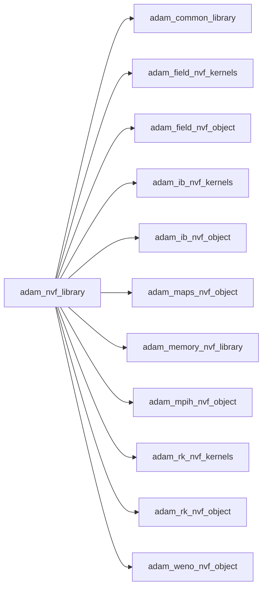

# adam_nvf_library

> ADAM NVF library, entry for all NVF (and common) classes and libraries.

**Source**: `src/lib/nvf/adam_nvf_library.F90`

**Dependencies**

```mermaid
graph LR
  adam_nvf_library["adam_nvf_library"] --> adam_common_library["adam_common_library"]
  adam_nvf_library["adam_nvf_library"] --> adam_field_nvf_kernels["adam_field_nvf_kernels"]
  adam_nvf_library["adam_nvf_library"] --> adam_field_nvf_object["adam_field_nvf_object"]
  adam_nvf_library["adam_nvf_library"] --> adam_ib_nvf_kernels["adam_ib_nvf_kernels"]
  adam_nvf_library["adam_nvf_library"] --> adam_ib_nvf_object["adam_ib_nvf_object"]
  adam_nvf_library["adam_nvf_library"] --> adam_maps_nvf_object["adam_maps_nvf_object"]
  adam_nvf_library["adam_nvf_library"] --> adam_memory_nvf_library["adam_memory_nvf_library"]
  adam_nvf_library["adam_nvf_library"] --> adam_mpih_nvf_object["adam_mpih_nvf_object"]
  adam_nvf_library["adam_nvf_library"] --> adam_rk_nvf_kernels["adam_rk_nvf_kernels"]
  adam_nvf_library["adam_nvf_library"] --> adam_rk_nvf_object["adam_rk_nvf_object"]
  adam_nvf_library["adam_nvf_library"] --> adam_weno_nvf_object["adam_weno_nvf_object"]
```
