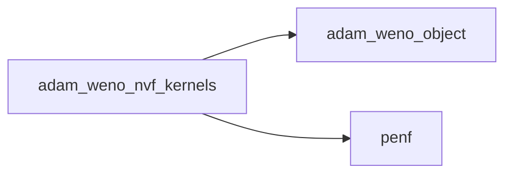
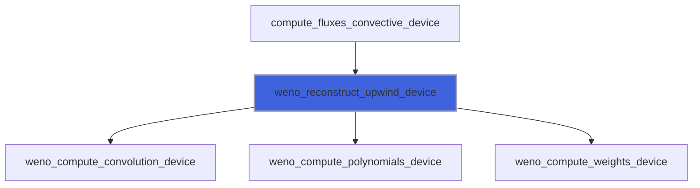
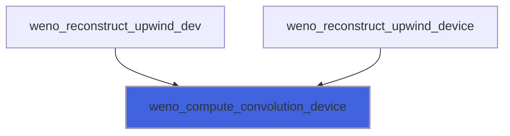
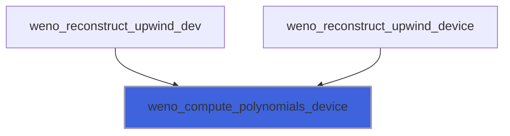
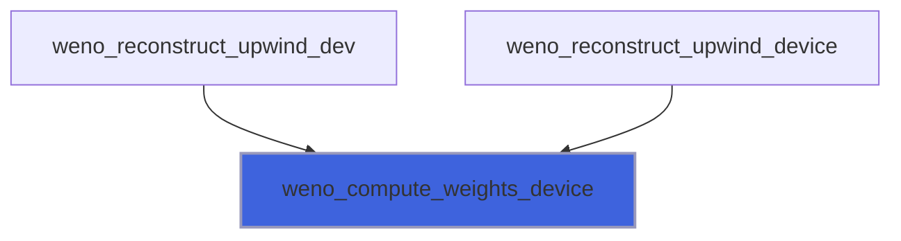

# adam_weno_nvf_kernels

> ADAM, WENO class NVF kernels (NVF backend of [weno_nvf_object](/api/src/lib/nvf/adam_weno_nvf_object#weno-nvf-object)).

**Source**: `src/lib/nvf/adam_weno_nvf_kernels.F90`

**Dependencies**



## Contents

- [weno_reconstruct_upwind_device](#weno-reconstruct-upwind-device)
- [weno_compute_convolution_device](#weno-compute-convolution-device)
- [weno_compute_polynomials_device](#weno-compute-polynomials-device)
- [weno_compute_weights_device](#weno-compute-weights-device)

## Subroutines

### weno_reconstruct_upwind_device

Reconstruct by WENO upwind method of 2S-1 order, non TBP.

```fortran
subroutine weno_reconstruct_upwind_device(S, weno_a, weno_p, weno_d, weno_zeps, V, VR)
```

**Arguments**

| Name | Type | Intent | Attributes | Description |
|------|------|--------|------------|-------------|
| `S` | integer(kind=[I4P](/api/src/third_party/PENF/src/lib/penf_global_parameters_variables)) | in |  | Number of stencils used. |
| `weno_a` | real(kind=[R8P](/api/src/third_party/PENF/src/lib/penf_global_parameters_variables)) | in | device | Optimal weights. |
| `weno_p` | real(kind=[R8P](/api/src/third_party/PENF/src/lib/penf_global_parameters_variables)) | in | device | Polinomials coefficients. |
| `weno_d` | real(kind=[R8P](/api/src/third_party/PENF/src/lib/penf_global_parameters_variables)) | in | device | Smoothness indicators coefficients. |
| `weno_zeps` | real(kind=[R8P](/api/src/third_party/PENF/src/lib/penf_global_parameters_variables)) | in |  | Parameter for avoiding division by zero in computing IS. |
| `V` | real(kind=[R8P](/api/src/third_party/PENF/src/lib/penf_global_parameters_variables)) | in |  | Variables to be reconstructed. |
| `VR` | real(kind=[R8P](/api/src/third_party/PENF/src/lib/penf_global_parameters_variables)) | out |  | Left and right (1,2) interface value of reconstructed V. |

**Call graph**



### weno_compute_convolution_device

Compute WENO convulution, non TBP.

```fortran
subroutine weno_compute_convolution_device(S, VP, w, VR)
```

**Arguments**

| Name | Type | Intent | Attributes | Description |
|------|------|--------|------------|-------------|
| `S` | integer(kind=[I4P](/api/src/third_party/PENF/src/lib/penf_global_parameters_variables)) | in |  | Number of stencils used. |
| `VP` | real(kind=[R8P](/api/src/third_party/PENF/src/lib/penf_global_parameters_variables)) | in |  | Polynomial reconstructions. |
| `w` | real(kind=[R8P](/api/src/third_party/PENF/src/lib/penf_global_parameters_variables)) | in |  | Weights of the stencils. |
| `VR` | real(kind=[R8P](/api/src/third_party/PENF/src/lib/penf_global_parameters_variables)) | out |  | Left and right (1,2) interface value of reconstructed V. |

**Call graph**



### weno_compute_polynomials_device

Compute WENO polynomials, non TBP.

```fortran
subroutine weno_compute_polynomials_device(S, weno_p, V, VP)
```

**Arguments**

| Name | Type | Intent | Attributes | Description |
|------|------|--------|------------|-------------|
| `S` | integer(kind=[I4P](/api/src/third_party/PENF/src/lib/penf_global_parameters_variables)) | in |  | Number of stencils used. |
| `weno_p` | real(kind=[R8P](/api/src/third_party/PENF/src/lib/penf_global_parameters_variables)) | in | device | Polinomials coefficients. |
| `V` | real(kind=[R8P](/api/src/third_party/PENF/src/lib/penf_global_parameters_variables)) | in |  | Variable to be reconstructed. |
| `VP` | real(kind=[R8P](/api/src/third_party/PENF/src/lib/penf_global_parameters_variables)) | out |  | Polynomial reconstructions. |

**Call graph**



### weno_compute_weights_device

Compute WENO weights, non TBP.

```fortran
subroutine weno_compute_weights_device(S, weno_a, weno_d, weno_zeps, V, w)
```

**Arguments**

| Name | Type | Intent | Attributes | Description |
|------|------|--------|------------|-------------|
| `S` | integer(kind=[I4P](/api/src/third_party/PENF/src/lib/penf_global_parameters_variables)) | in |  | Number of stencils used. |
| `weno_a` | real(kind=[R8P](/api/src/third_party/PENF/src/lib/penf_global_parameters_variables)) | in | device | Optimal weights. |
| `weno_d` | real(kind=[R8P](/api/src/third_party/PENF/src/lib/penf_global_parameters_variables)) | in | device | Smoothness indicators coefficients. |
| `weno_zeps` | real(kind=[R8P](/api/src/third_party/PENF/src/lib/penf_global_parameters_variables)) | in |  | Parameter for avoiding division by zero in computing IS. |
| `V` | real(kind=[R8P](/api/src/third_party/PENF/src/lib/penf_global_parameters_variables)) | in |  | Variable to be reconstructed. |
| `w` | real(kind=[R8P](/api/src/third_party/PENF/src/lib/penf_global_parameters_variables)) | out |  | Weights of the stencils. |

**Call graph**


