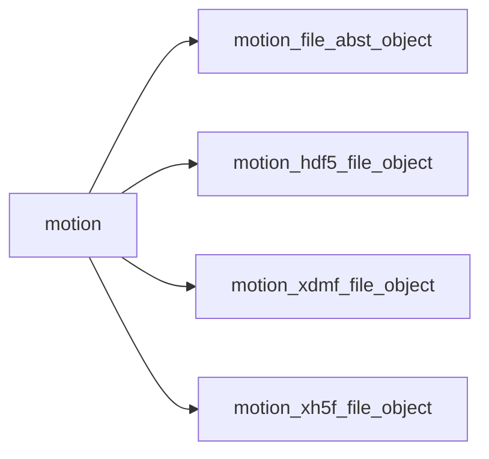

# motion

> MOTIOn, Modular (HPC) Optimized Toolkit (for) IO (in fortra)n.

**Source**: `src/third_party/MOTIOn/src/lib/motion.F90`

**Dependencies**

```mermaid
graph LR
  motion["motion"] --> motion_file_abst_object["motion_file_abst_object"]
  motion["motion"] --> motion_hdf5_file_object["motion_hdf5_file_object"]
  motion["motion"] --> motion_xdmf_file_object["motion_xdmf_file_object"]
  motion["motion"] --> motion_xh5f_file_object["motion_xh5f_file_object"]
```
