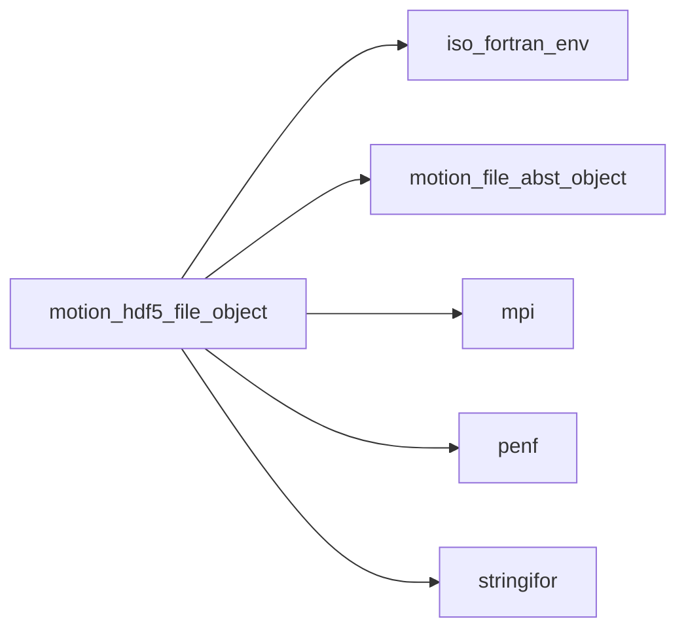
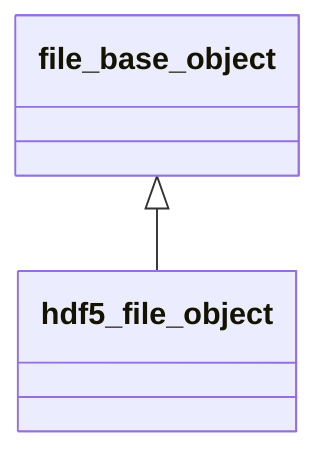
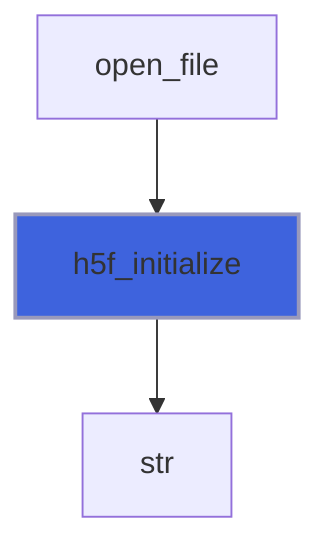
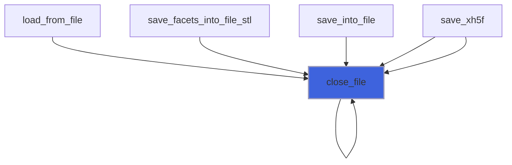
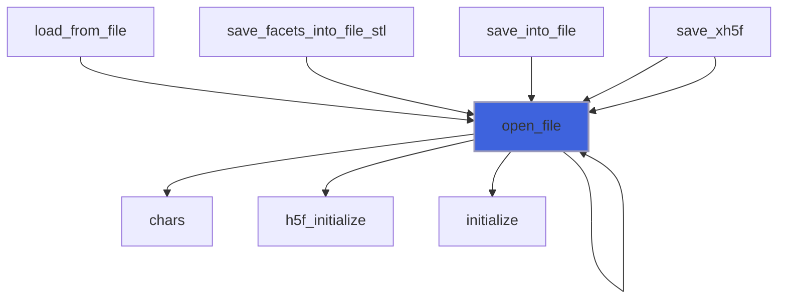
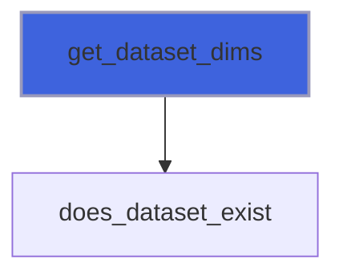
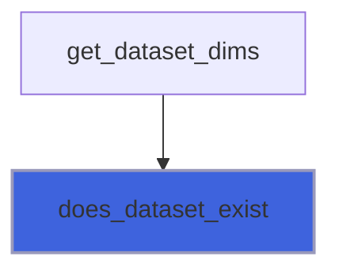

# motion_hdf5_file_object

> MOTIOn, HDF5 file object class.

 MOTIOn, HDF5 load/save dataset agnostic impementation
 MOTIOn, HDF5 load/save dataset agnostic impementation
 MOTIOn, HDF5 load/save dataset agnostic impementation
 MOTIOn, HDF5 load/save dataset agnostic impementation
 MOTIOn, HDF5 load/save dataset agnostic impementation
 MOTIOn, HDF5 load/save dataset agnostic impementation

**Source**: `src/third_party/MOTIOn/src/lib/motion_hdf5_file_object.F90`

**Dependencies**



## Contents

- [hdf5_parameters_object](#hdf5-parameters-object)
- [hdf5_file_object](#hdf5-file-object)
- [hdf5_file_object](#hdf5-file-object)
- [h5f_initialize](#h5f-initialize)
- [h5f_finalize](#h5f-finalize)
- [close_file](#close-file)
- [open_file](#open-file)
- [close_dspace](#close-dspace)
- [open_dspace](#open-dspace)
- [get_dataset_dims](#get-dataset-dims)
- [load_dataset_R8P_0D](#load-dataset-r8p-0d)
- [load_dataset_R8P_1D](#load-dataset-r8p-1d)
- [load_dataset_R8P_2D](#load-dataset-r8p-2d)
- [load_dataset_R8P_3D](#load-dataset-r8p-3d)
- [load_dataset_R8P_4D](#load-dataset-r8p-4d)
- [load_dataset_R8P_5D](#load-dataset-r8p-5d)
- [load_dataset_R8P_6D](#load-dataset-r8p-6d)
- [load_dataset_R8P_7D](#load-dataset-r8p-7d)
- [save_dataset_R8P_0D](#save-dataset-r8p-0d)
- [save_dataset_R8P_1D](#save-dataset-r8p-1d)
- [save_dataset_R8P_2D](#save-dataset-r8p-2d)
- [save_dataset_R8P_3D](#save-dataset-r8p-3d)
- [save_dataset_R8P_4D](#save-dataset-r8p-4d)
- [save_dataset_R8P_5D](#save-dataset-r8p-5d)
- [save_dataset_R8P_6D](#save-dataset-r8p-6d)
- [save_dataset_R8P_7D](#save-dataset-r8p-7d)
- [load_dataset_R4P_0D](#load-dataset-r4p-0d)
- [load_dataset_R4P_1D](#load-dataset-r4p-1d)
- [load_dataset_R4P_2D](#load-dataset-r4p-2d)
- [load_dataset_R4P_3D](#load-dataset-r4p-3d)
- [load_dataset_R4P_4D](#load-dataset-r4p-4d)
- [load_dataset_R4P_5D](#load-dataset-r4p-5d)
- [load_dataset_R4P_6D](#load-dataset-r4p-6d)
- [load_dataset_R4P_7D](#load-dataset-r4p-7d)
- [save_dataset_R4P_0D](#save-dataset-r4p-0d)
- [save_dataset_R4P_1D](#save-dataset-r4p-1d)
- [save_dataset_R4P_2D](#save-dataset-r4p-2d)
- [save_dataset_R4P_3D](#save-dataset-r4p-3d)
- [save_dataset_R4P_4D](#save-dataset-r4p-4d)
- [save_dataset_R4P_5D](#save-dataset-r4p-5d)
- [save_dataset_R4P_6D](#save-dataset-r4p-6d)
- [save_dataset_R4P_7D](#save-dataset-r4p-7d)
- [load_dataset_I8P_0D](#load-dataset-i8p-0d)
- [load_dataset_I8P_1D](#load-dataset-i8p-1d)
- [load_dataset_I8P_2D](#load-dataset-i8p-2d)
- [load_dataset_I8P_3D](#load-dataset-i8p-3d)
- [load_dataset_I8P_4D](#load-dataset-i8p-4d)
- [load_dataset_I8P_5D](#load-dataset-i8p-5d)
- [load_dataset_I8P_6D](#load-dataset-i8p-6d)
- [load_dataset_I8P_7D](#load-dataset-i8p-7d)
- [save_dataset_I8P_0D](#save-dataset-i8p-0d)
- [save_dataset_I8P_1D](#save-dataset-i8p-1d)
- [save_dataset_I8P_2D](#save-dataset-i8p-2d)
- [save_dataset_I8P_3D](#save-dataset-i8p-3d)
- [save_dataset_I8P_4D](#save-dataset-i8p-4d)
- [save_dataset_I8P_5D](#save-dataset-i8p-5d)
- [save_dataset_I8P_6D](#save-dataset-i8p-6d)
- [save_dataset_I8P_7D](#save-dataset-i8p-7d)
- [load_dataset_I4P_0D](#load-dataset-i4p-0d)
- [load_dataset_I4P_1D](#load-dataset-i4p-1d)
- [load_dataset_I4P_2D](#load-dataset-i4p-2d)
- [load_dataset_I4P_3D](#load-dataset-i4p-3d)
- [load_dataset_I4P_4D](#load-dataset-i4p-4d)
- [load_dataset_I4P_5D](#load-dataset-i4p-5d)
- [load_dataset_I4P_6D](#load-dataset-i4p-6d)
- [load_dataset_I4P_7D](#load-dataset-i4p-7d)
- [save_dataset_I4P_0D](#save-dataset-i4p-0d)
- [save_dataset_I4P_1D](#save-dataset-i4p-1d)
- [save_dataset_I4P_2D](#save-dataset-i4p-2d)
- [save_dataset_I4P_3D](#save-dataset-i4p-3d)
- [save_dataset_I4P_4D](#save-dataset-i4p-4d)
- [save_dataset_I4P_5D](#save-dataset-i4p-5d)
- [save_dataset_I4P_6D](#save-dataset-i4p-6d)
- [save_dataset_I4P_7D](#save-dataset-i4p-7d)
- [load_dataset_I2P_0D](#load-dataset-i2p-0d)
- [load_dataset_I2P_1D](#load-dataset-i2p-1d)
- [load_dataset_I2P_2D](#load-dataset-i2p-2d)
- [load_dataset_I2P_3D](#load-dataset-i2p-3d)
- [load_dataset_I2P_4D](#load-dataset-i2p-4d)
- [load_dataset_I2P_5D](#load-dataset-i2p-5d)
- [load_dataset_I2P_6D](#load-dataset-i2p-6d)
- [load_dataset_I2P_7D](#load-dataset-i2p-7d)
- [save_dataset_I2P_0D](#save-dataset-i2p-0d)
- [save_dataset_I2P_1D](#save-dataset-i2p-1d)
- [save_dataset_I2P_2D](#save-dataset-i2p-2d)
- [save_dataset_I2P_3D](#save-dataset-i2p-3d)
- [save_dataset_I2P_4D](#save-dataset-i2p-4d)
- [save_dataset_I2P_5D](#save-dataset-i2p-5d)
- [save_dataset_I2P_6D](#save-dataset-i2p-6d)
- [save_dataset_I2P_7D](#save-dataset-i2p-7d)
- [load_dataset_I1P_0D](#load-dataset-i1p-0d)
- [load_dataset_I1P_1D](#load-dataset-i1p-1d)
- [load_dataset_I1P_2D](#load-dataset-i1p-2d)
- [load_dataset_I1P_3D](#load-dataset-i1p-3d)
- [load_dataset_I1P_4D](#load-dataset-i1p-4d)
- [load_dataset_I1P_5D](#load-dataset-i1p-5d)
- [load_dataset_I1P_6D](#load-dataset-i1p-6d)
- [load_dataset_I1P_7D](#load-dataset-i1p-7d)
- [save_dataset_I1P_0D](#save-dataset-i1p-0d)
- [save_dataset_I1P_1D](#save-dataset-i1p-1d)
- [save_dataset_I1P_2D](#save-dataset-i1p-2d)
- [save_dataset_I1P_3D](#save-dataset-i1p-3d)
- [save_dataset_I1P_4D](#save-dataset-i1p-4d)
- [save_dataset_I1P_5D](#save-dataset-i1p-5d)
- [save_dataset_I1P_6D](#save-dataset-i1p-6d)
- [save_dataset_I1P_7D](#save-dataset-i1p-7d)
- [new](#new)
- [does_dataset_exist](#does-dataset-exist)

## Variables

| Name | Type | Attributes | Description |
|------|------|------------|-------------|
| `HDF5_PARAMETERS` | type([hdf5_parameters_object](/api/src/third_party/MOTIOn/src/lib/motion_hdf5_file_object#hdf5-parameters-object)) | parameter | List of HDF5 named constants. |
| `H5T_R8P` | integer(kind=[HID_T](/api/src/third_party/MOTIOn/lib/hdf5/1.14.6/gnu/14.2.0/include/H5FORTRAN_TYPES)) |  | HDF5 kind mapping R8P kind. |
| `H5T_R4P` | integer(kind=[HID_T](/api/src/third_party/MOTIOn/lib/hdf5/1.14.6/gnu/14.2.0/include/H5FORTRAN_TYPES)) |  | HDF5 kind mapping R4P kind. |
| `H5T_I8P` | integer(kind=[HID_T](/api/src/third_party/MOTIOn/lib/hdf5/1.14.6/gnu/14.2.0/include/H5FORTRAN_TYPES)) |  | HDF5 kind mapping I8P kind. |
| `H5T_I4P` | integer(kind=[HID_T](/api/src/third_party/MOTIOn/lib/hdf5/1.14.6/gnu/14.2.0/include/H5FORTRAN_TYPES)) |  | HDF5 kind mapping I4P kind. |
| `H5T_I2P` | integer(kind=[HID_T](/api/src/third_party/MOTIOn/lib/hdf5/1.14.6/gnu/14.2.0/include/H5FORTRAN_TYPES)) |  | HDF5 kind mapping I2P kind. |
| `H5T_I1P` | integer(kind=[HID_T](/api/src/third_party/MOTIOn/lib/hdf5/1.14.6/gnu/14.2.0/include/H5FORTRAN_TYPES)) |  | HDF5 kind mapping I1P kind. |
| `IS_H5F_INITIALIZED` | logical |  | Status of HDF5 fortran interface inizialization. |

## Derived Types

### hdf5_parameters_object

Global named constants (paramters) class (container) of HDF5 syntax.

#### Components

| Name | Type | Attributes | Description |
|------|------|------------|-------------|
| `HDF5_DATASPACE_TYPE_SIMPLE` | character(len=6) |  | Create simple type dataspace. |

### hdf5_file_object

HDF5 file object class.

**Inheritance**



**Extends**: [`file_base_object`](/api/src/third_party/MOTIOn/src/lib/motion_file_abst_object#file-base-object)

#### Components

| Name | Type | Attributes | Description |
|------|------|------------|-------------|
| `filename` | type([string](/api/src/third_party/StringiFor/src/lib/stringifor_string_t#string)) |  | File name. |
| `procs_number` | integer(kind=[I4P](/api/src/third_party/PENF/src/lib/penf_global_parameters_variables)) |  | Number of MPI processes. |
| `myrank` | integer(kind=[I4P](/api/src/third_party/PENF/src/lib/penf_global_parameters_variables)) |  | MPI ID process. |
| `error` | integer(kind=[I4P](/api/src/third_party/PENF/src/lib/penf_global_parameters_variables)) |  | IO Error status. |
| `hdf5` | integer(kind=[HID_T](/api/src/third_party/MOTIOn/lib/hdf5/1.14.6/gnu/14.2.0/include/H5FORTRAN_TYPES)) |  | HDF5 file identifier (logical unit). |
| `dspace_id` | integer(kind=[HID_T](/api/src/third_party/MOTIOn/lib/hdf5/1.14.6/gnu/14.2.0/include/H5FORTRAN_TYPES)) |  | HDF5 dataspace identifier. |

#### Type-Bound Procedures

| Name | Attributes | Description |
|------|------------|-------------|
| `initialize` | pass(self) | Initialize file class. |
| `h5f_initialize` | pass(self) | Initialize HDF5 fortran interface. |
| `h5f_finalize` | pass(self) | Finalize   HDF5 fortran interface. |
| `close_file` | pass(self) | Close HDF5 file. |
| `open_file` | pass(self) | Open HDF5 file. |
| `close_dspace` | pass(self) | Close HDF5 dataspace. |
| `open_dspace` | pass(self) | Open HDF5 dataspace. |
| `does_dataset_exist` | pass(self) | Return true if dataset exist in file. |
| `get_dataset_dims` | pass(self) | Get dataset dimensions. |
| `load_dataset` |  | Load dataset in dataspace. |
| `save_dataset` |  | Save dataset in dataspace. |
| `load_dataset_R8P_7D` | pass(self) | Load dataset in dataspace, kind R8P, rank 7D. |
| `load_dataset_R8P_6D` | pass(self) | Load dataset in dataspace, kind R8P, rank 6D. |
| `load_dataset_R8P_5D` | pass(self) | Load dataset in dataspace, kind R8P, rank 5D. |
| `load_dataset_R8P_4D` | pass(self) | Load dataset in dataspace, kind R8P, rank 4D. |
| `load_dataset_R8P_3D` | pass(self) | Load dataset in dataspace, kind R8P, rank 3D. |
| `load_dataset_R8P_2D` | pass(self) | Load dataset in dataspace, kind R8P, rank 2D. |
| `load_dataset_R8P_1D` | pass(self) | Load dataset in dataspace, kind R8P, rank 1D. |
| `load_dataset_R8P_0D` | pass(self) | Load dataset in dataspace, kind R8P, rank 0D. |
| `load_dataset_R4P_7D` | pass(self) | Load dataset in dataspace, kind R4P, rank 7D. |
| `load_dataset_R4P_6D` | pass(self) | Load dataset in dataspace, kind R4P, rank 6D. |
| `load_dataset_R4P_5D` | pass(self) | Load dataset in dataspace, kind R4P, rank 5D. |
| `load_dataset_R4P_4D` | pass(self) | Load dataset in dataspace, kind R4P, rank 4D. |
| `load_dataset_R4P_3D` | pass(self) | Load dataset in dataspace, kind R4P, rank 3D. |
| `load_dataset_R4P_2D` | pass(self) | Load dataset in dataspace, kind R4P, rank 2D. |
| `load_dataset_R4P_1D` | pass(self) | Load dataset in dataspace, kind R4P, rank 1D. |
| `load_dataset_R4P_0D` | pass(self) | Load dataset in dataspace, kind R4P, rank 0D. |
| `load_dataset_I8P_7D` | pass(self) | Load dataset in dataspace, kind I8P, rank 7D. |
| `load_dataset_I8P_6D` | pass(self) | Load dataset in dataspace, kind I8P, rank 6D. |
| `load_dataset_I8P_5D` | pass(self) | Load dataset in dataspace, kind I8P, rank 5D. |
| `load_dataset_I8P_4D` | pass(self) | Load dataset in dataspace, kind I8P, rank 4D. |
| `load_dataset_I8P_3D` | pass(self) | Load dataset in dataspace, kind I8P, rank 3D. |
| `load_dataset_I8P_2D` | pass(self) | Load dataset in dataspace, kind I8P, rank 2D. |
| `load_dataset_I8P_1D` | pass(self) | Load dataset in dataspace, kind I8P, rank 1D. |
| `load_dataset_I8P_0D` | pass(self) | Load dataset in dataspace, kind I8P, rank 0D. |
| `load_dataset_I4P_7D` | pass(self) | Load dataset in dataspace, kind I4P, rank 7D. |
| `load_dataset_I4P_6D` | pass(self) | Load dataset in dataspace, kind I4P, rank 6D. |
| `load_dataset_I4P_5D` | pass(self) | Load dataset in dataspace, kind I4P, rank 5D. |
| `load_dataset_I4P_4D` | pass(self) | Load dataset in dataspace, kind I4P, rank 4D. |
| `load_dataset_I4P_3D` | pass(self) | Load dataset in dataspace, kind I4P, rank 3D. |
| `load_dataset_I4P_2D` | pass(self) | Load dataset in dataspace, kind I4P, rank 2D. |
| `load_dataset_I4P_1D` | pass(self) | Load dataset in dataspace, kind I4P, rank 1D. |
| `load_dataset_I4P_0D` | pass(self) | Load dataset in dataspace, kind I4P, rank 0D. |
| `load_dataset_I2P_7D` | pass(self) | Load dataset in dataspace, kind I2P, rank 7D. |
| `load_dataset_I2P_6D` | pass(self) | Load dataset in dataspace, kind I2P, rank 6D. |
| `load_dataset_I2P_5D` | pass(self) | Load dataset in dataspace, kind I2P, rank 5D. |
| `load_dataset_I2P_4D` | pass(self) | Load dataset in dataspace, kind I2P, rank 4D. |
| `load_dataset_I2P_3D` | pass(self) | Load dataset in dataspace, kind I2P, rank 3D. |
| `load_dataset_I2P_2D` | pass(self) | Load dataset in dataspace, kind I2P, rank 2D. |
| `load_dataset_I2P_1D` | pass(self) | Load dataset in dataspace, kind I2P, rank 1D. |
| `load_dataset_I2P_0D` | pass(self) | Load dataset in dataspace, kind I2P, rank 0D. |
| `load_dataset_I1P_7D` | pass(self) | Load dataset in dataspace, kind I1P, rank 7D. |
| `load_dataset_I1P_6D` | pass(self) | Load dataset in dataspace, kind I1P, rank 6D. |
| `load_dataset_I1P_5D` | pass(self) | Load dataset in dataspace, kind I1P, rank 5D. |
| `load_dataset_I1P_4D` | pass(self) | Load dataset in dataspace, kind I1P, rank 4D. |
| `load_dataset_I1P_3D` | pass(self) | Load dataset in dataspace, kind I1P, rank 3D. |
| `load_dataset_I1P_2D` | pass(self) | Load dataset in dataspace, kind I1P, rank 2D. |
| `load_dataset_I1P_1D` | pass(self) | Load dataset in dataspace, kind I1P, rank 1D. |
| `load_dataset_I1P_0D` | pass(self) | Load dataset in dataspace, kind I1P, rank 0D. |
| `save_dataset_R8P_7D` | pass(self) | Save dataset in dataspace, kind R8P, rank 7D. |
| `save_dataset_R8P_6D` | pass(self) | Save dataset in dataspace, kind R8P, rank 6D. |
| `save_dataset_R8P_5D` | pass(self) | Save dataset in dataspace, kind R8P, rank 5D. |
| `save_dataset_R8P_4D` | pass(self) | Save dataset in dataspace, kind R8P, rank 4D. |
| `save_dataset_R8P_3D` | pass(self) | Save dataset in dataspace, kind R8P, rank 3D. |
| `save_dataset_R8P_2D` | pass(self) | Save dataset in dataspace, kind R8P, rank 2D. |
| `save_dataset_R8P_1D` | pass(self) | Save dataset in dataspace, kind R8P, rank 1D. |
| `save_dataset_R8P_0D` | pass(self) | Save dataset in dataspace, kind R8P, rank 0D. |
| `save_dataset_R4P_7D` | pass(self) | Save dataset in dataspace, kind R4P, rank 7D. |
| `save_dataset_R4P_6D` | pass(self) | Save dataset in dataspace, kind R4P, rank 6D. |
| `save_dataset_R4P_5D` | pass(self) | Save dataset in dataspace, kind R4P, rank 5D. |
| `save_dataset_R4P_4D` | pass(self) | Save dataset in dataspace, kind R4P, rank 4D. |
| `save_dataset_R4P_3D` | pass(self) | Save dataset in dataspace, kind R4P, rank 3D. |
| `save_dataset_R4P_2D` | pass(self) | Save dataset in dataspace, kind R4P, rank 2D. |
| `save_dataset_R4P_1D` | pass(self) | Save dataset in dataspace, kind R4P, rank 1D. |
| `save_dataset_R4P_0D` | pass(self) | Save dataset in dataspace, kind R4P, rank 0D. |
| `save_dataset_I8P_7D` | pass(self) | Save dataset in dataspace, kind I8P, rank 7D. |
| `save_dataset_I8P_6D` | pass(self) | Save dataset in dataspace, kind I8P, rank 6D. |
| `save_dataset_I8P_5D` | pass(self) | Save dataset in dataspace, kind I8P, rank 5D. |
| `save_dataset_I8P_4D` | pass(self) | Save dataset in dataspace, kind I8P, rank 4D. |
| `save_dataset_I8P_3D` | pass(self) | Save dataset in dataspace, kind I8P, rank 3D. |
| `save_dataset_I8P_2D` | pass(self) | Save dataset in dataspace, kind I8P, rank 2D. |
| `save_dataset_I8P_1D` | pass(self) | Save dataset in dataspace, kind I8P, rank 1D. |
| `save_dataset_I8P_0D` | pass(self) | Save dataset in dataspace, kind I8P, rank 0D. |
| `save_dataset_I4P_7D` | pass(self) | Save dataset in dataspace, kind I4P, rank 7D. |
| `save_dataset_I4P_6D` | pass(self) | Save dataset in dataspace, kind I4P, rank 6D. |
| `save_dataset_I4P_5D` | pass(self) | Save dataset in dataspace, kind I4P, rank 5D. |
| `save_dataset_I4P_4D` | pass(self) | Save dataset in dataspace, kind I4P, rank 4D. |
| `save_dataset_I4P_3D` | pass(self) | Save dataset in dataspace, kind I4P, rank 3D. |
| `save_dataset_I4P_2D` | pass(self) | Save dataset in dataspace, kind I4P, rank 2D. |
| `save_dataset_I4P_1D` | pass(self) | Save dataset in dataspace, kind I4P, rank 1D. |
| `save_dataset_I4P_0D` | pass(self) | Save dataset in dataspace, kind I4P, rank 0D. |
| `save_dataset_I2P_7D` | pass(self) | Save dataset in dataspace, kind I2P, rank 7D. |
| `save_dataset_I2P_6D` | pass(self) | Save dataset in dataspace, kind I2P, rank 6D. |
| `save_dataset_I2P_5D` | pass(self) | Save dataset in dataspace, kind I2P, rank 5D. |
| `save_dataset_I2P_4D` | pass(self) | Save dataset in dataspace, kind I2P, rank 4D. |
| `save_dataset_I2P_3D` | pass(self) | Save dataset in dataspace, kind I2P, rank 3D. |
| `save_dataset_I2P_2D` | pass(self) | Save dataset in dataspace, kind I2P, rank 2D. |
| `save_dataset_I2P_1D` | pass(self) | Save dataset in dataspace, kind I2P, rank 1D. |
| `save_dataset_I2P_0D` | pass(self) | Save dataset in dataspace, kind I2P, rank 0D. |
| `save_dataset_I1P_7D` | pass(self) | Save dataset in dataspace, kind I1P, rank 7D. |
| `save_dataset_I1P_6D` | pass(self) | Save dataset in dataspace, kind I1P, rank 6D. |
| `save_dataset_I1P_5D` | pass(self) | Save dataset in dataspace, kind I1P, rank 5D. |
| `save_dataset_I1P_4D` | pass(self) | Save dataset in dataspace, kind I1P, rank 4D. |
| `save_dataset_I1P_3D` | pass(self) | Save dataset in dataspace, kind I1P, rank 3D. |
| `save_dataset_I1P_2D` | pass(self) | Save dataset in dataspace, kind I1P, rank 2D. |
| `save_dataset_I1P_1D` | pass(self) | Save dataset in dataspace, kind I1P, rank 1D. |
| `save_dataset_I1P_0D` | pass(self) | Save dataset in dataspace, kind I1P, rank 0D. |

## Interfaces

### hdf5_file_object

Overload class name with initializer function.

**Module procedures**: [`new`](/api/src/third_party/MOTIOn/src/lib/motion_hdf5_file_object#new)

## Subroutines

### h5f_initialize

Initialize HDF5 fortran interface.

```fortran
subroutine h5f_initialize(self, verbose, prefix)
```

**Arguments**

| Name | Type | Intent | Attributes | Description |
|------|------|--------|------------|-------------|
| `self` | class([hdf5_file_object](/api/src/third_party/MOTIOn/src/lib/motion_hdf5_file_object#hdf5-file-object)) | inout |  | File handler. |
| `verbose` | logical | in | optional | Verbose output. |
| `prefix` | character(len=*) | in | optional | Output prefix. |

**Call graph**



### h5f_finalize

Finalize HDF5 fortran interface.

```fortran
subroutine h5f_finalize(self)
```

**Arguments**

| Name | Type | Intent | Attributes | Description |
|------|------|--------|------------|-------------|
| `self` | class([hdf5_file_object](/api/src/third_party/MOTIOn/src/lib/motion_hdf5_file_object#hdf5-file-object)) | inout |  | File handler. |

### close_file

Close HDF5 file.

```fortran
subroutine close_file(self)
```

**Arguments**

| Name | Type | Intent | Attributes | Description |
|------|------|--------|------------|-------------|
| `self` | class([hdf5_file_object](/api/src/third_party/MOTIOn/src/lib/motion_hdf5_file_object#hdf5-file-object)) | inout |  | File handler. |

**Call graph**



### open_file

Open HDF5 file.

```fortran
subroutine open_file(self, filename, act)
```

**Arguments**

| Name | Type | Intent | Attributes | Description |
|------|------|--------|------------|-------------|
| `self` | class([hdf5_file_object](/api/src/third_party/MOTIOn/src/lib/motion_hdf5_file_object#hdf5-file-object)) | inout |  | File handler. |
| `filename` | character(len=*) | in |  | File name. |
| `act` | character(len=*) | in | optional | File action ['readonly, overwrite'...]. |

**Call graph**



### close_dspace

Close HDF5 dataspace.

```fortran
subroutine close_dspace(self)
```

**Arguments**

| Name | Type | Intent | Attributes | Description |
|------|------|--------|------------|-------------|
| `self` | class([hdf5_file_object](/api/src/third_party/MOTIOn/src/lib/motion_hdf5_file_object#hdf5-file-object)) | inout |  | File handler. |

**Call graph**


### open_dspace

Open HDF5 dataspace.

```fortran
subroutine open_dspace(self, dataspace_type, nd)
```

**Arguments**

| Name | Type | Intent | Attributes | Description |
|------|------|--------|------------|-------------|
| `self` | class([hdf5_file_object](/api/src/third_party/MOTIOn/src/lib/motion_hdf5_file_object#hdf5-file-object)) | inout |  | File handler. |
| `dataspace_type` | character(len=*) | in |  | Dataspace type. |
| `nd` | integer(kind=[HSIZE_T](/api/src/third_party/MOTIOn/lib/hdf5/1.14.6/gnu/14.2.0/include/H5FORTRAN_TYPES)) | in | optional | Dataspace datasets dimensions. |

**Call graph**


### get_dataset_dims

Get dataset dimensions.

```fortran
subroutine get_dataset_dims(self, dset_name, nd, nd_max)
```

**Arguments**

| Name | Type | Intent | Attributes | Description |
|------|------|--------|------------|-------------|
| `self` | class([hdf5_file_object](/api/src/third_party/MOTIOn/src/lib/motion_hdf5_file_object#hdf5-file-object)) | inout |  | File handler. |
| `dset_name` | character(len=*) | in |  | Dataset name. |
| `nd` | integer(kind=[HSIZE_T](/api/src/third_party/MOTIOn/lib/hdf5/1.14.6/gnu/14.2.0/include/H5FORTRAN_TYPES)) | out | allocatable | Dataspace datasets dimensions. |
| `nd_max` | integer(kind=[HSIZE_T](/api/src/third_party/MOTIOn/lib/hdf5/1.14.6/gnu/14.2.0/include/H5FORTRAN_TYPES)) | out | allocatable, optional | Dataspace datasets maximum dimensions. |

**Call graph**



### load_dataset_R8P_0D

Load dataset in dataspace, kind R8P, rank 0D.

```fortran
subroutine load_dataset_R8P_0D(self, dset_name, dset)
```

**Arguments**

| Name | Type | Intent | Attributes | Description |
|------|------|--------|------------|-------------|
| `self` | class([hdf5_file_object](/api/src/third_party/MOTIOn/src/lib/motion_hdf5_file_object#hdf5-file-object)) | inout |  | File handler. |
| `dset_name` | character(len=*) | in |  | Dataset name. |
| `dset` | real(kind=[R8P](/api/src/third_party/PENF/src/lib/penf_global_parameters_variables)) | inout |  | Dataset. |

### load_dataset_R8P_1D

Load dataset in dataspace, kind R8P, rank 1D.

```fortran
subroutine load_dataset_R8P_1D(self, dset_name, nd, dset)
```

**Arguments**

| Name | Type | Intent | Attributes | Description |
|------|------|--------|------------|-------------|
| `self` | class([hdf5_file_object](/api/src/third_party/MOTIOn/src/lib/motion_hdf5_file_object#hdf5-file-object)) | inout |  | File handler. |
| `dset_name` | character(len=*) | in |  | Dataset name. |
| `nd` | integer(kind=[HSIZE_T](/api/src/third_party/MOTIOn/lib/hdf5/1.14.6/gnu/14.2.0/include/H5FORTRAN_TYPES)) | in |  | Dataspace datasets dimensions. |
| `dset` | real(kind=[R8P](/api/src/third_party/PENF/src/lib/penf_global_parameters_variables)) | inout |  | Dataset. |

### load_dataset_R8P_2D

Load dataset in dataspace, kind R8P, rank 2D.

```fortran
subroutine load_dataset_R8P_2D(self, dset_name, nd, dset)
```

**Arguments**

| Name | Type | Intent | Attributes | Description |
|------|------|--------|------------|-------------|
| `self` | class([hdf5_file_object](/api/src/third_party/MOTIOn/src/lib/motion_hdf5_file_object#hdf5-file-object)) | inout |  | File handler. |
| `dset_name` | character(len=*) | in |  | Dataset name. |
| `nd` | integer(kind=[HSIZE_T](/api/src/third_party/MOTIOn/lib/hdf5/1.14.6/gnu/14.2.0/include/H5FORTRAN_TYPES)) | in |  | Dataspace datasets dimensions. |
| `dset` | real(kind=[R8P](/api/src/third_party/PENF/src/lib/penf_global_parameters_variables)) | inout |  | Dataset. |

### load_dataset_R8P_3D

Load dataset in dataspace, kind R8P, rank 3D.

```fortran
subroutine load_dataset_R8P_3D(self, dset_name, nd, dset)
```

**Arguments**

| Name | Type | Intent | Attributes | Description |
|------|------|--------|------------|-------------|
| `self` | class([hdf5_file_object](/api/src/third_party/MOTIOn/src/lib/motion_hdf5_file_object#hdf5-file-object)) | inout |  | File handler. |
| `dset_name` | character(len=*) | in |  | Dataset name. |
| `nd` | integer(kind=[HSIZE_T](/api/src/third_party/MOTIOn/lib/hdf5/1.14.6/gnu/14.2.0/include/H5FORTRAN_TYPES)) | in |  | Dataspace datasets dimensions. |
| `dset` | real(kind=[R8P](/api/src/third_party/PENF/src/lib/penf_global_parameters_variables)) | inout |  | Dataset. |

### load_dataset_R8P_4D

Load dataset in dataspace, kind R8P, rank 4D.

```fortran
subroutine load_dataset_R8P_4D(self, dset_name, nd, dset)
```

**Arguments**

| Name | Type | Intent | Attributes | Description |
|------|------|--------|------------|-------------|
| `self` | class([hdf5_file_object](/api/src/third_party/MOTIOn/src/lib/motion_hdf5_file_object#hdf5-file-object)) | inout |  | File handler. |
| `dset_name` | character(len=*) | in |  | Dataset name. |
| `nd` | integer(kind=[HSIZE_T](/api/src/third_party/MOTIOn/lib/hdf5/1.14.6/gnu/14.2.0/include/H5FORTRAN_TYPES)) | in |  | Dataspace datasets dimensions. |
| `dset` | real(kind=[R8P](/api/src/third_party/PENF/src/lib/penf_global_parameters_variables)) | inout |  | Dataset. |

### load_dataset_R8P_5D

Load dataset in dataspace, kind R8P, rank 5D.

```fortran
subroutine load_dataset_R8P_5D(self, dset_name, nd, dset)
```

**Arguments**

| Name | Type | Intent | Attributes | Description |
|------|------|--------|------------|-------------|
| `self` | class([hdf5_file_object](/api/src/third_party/MOTIOn/src/lib/motion_hdf5_file_object#hdf5-file-object)) | inout |  | File handler. |
| `dset_name` | character(len=*) | in |  | Dataset name. |
| `nd` | integer(kind=[HSIZE_T](/api/src/third_party/MOTIOn/lib/hdf5/1.14.6/gnu/14.2.0/include/H5FORTRAN_TYPES)) | in |  | Dataspace datasets dimensions. |
| `dset` | real(kind=[R8P](/api/src/third_party/PENF/src/lib/penf_global_parameters_variables)) | inout |  | Dataset. |

### load_dataset_R8P_6D

Load dataset in dataspace, kind R8P, rank 6D.

```fortran
subroutine load_dataset_R8P_6D(self, dset_name, nd, dset)
```

**Arguments**

| Name | Type | Intent | Attributes | Description |
|------|------|--------|------------|-------------|
| `self` | class([hdf5_file_object](/api/src/third_party/MOTIOn/src/lib/motion_hdf5_file_object#hdf5-file-object)) | inout |  | File handler. |
| `dset_name` | character(len=*) | in |  | Dataset name. |
| `nd` | integer(kind=[HSIZE_T](/api/src/third_party/MOTIOn/lib/hdf5/1.14.6/gnu/14.2.0/include/H5FORTRAN_TYPES)) | in |  | Dataspace datasets dimensions. |
| `dset` | real(kind=[R8P](/api/src/third_party/PENF/src/lib/penf_global_parameters_variables)) | inout |  | Dataset. |

### load_dataset_R8P_7D

Load dataset in dataspace, kind R8P, rank 7D.

```fortran
subroutine load_dataset_R8P_7D(self, dset_name, nd, dset)
```

**Arguments**

| Name | Type | Intent | Attributes | Description |
|------|------|--------|------------|-------------|
| `self` | class([hdf5_file_object](/api/src/third_party/MOTIOn/src/lib/motion_hdf5_file_object#hdf5-file-object)) | inout |  | File handler. |
| `dset_name` | character(len=*) | in |  | Dataset name. |
| `nd` | integer(kind=[HSIZE_T](/api/src/third_party/MOTIOn/lib/hdf5/1.14.6/gnu/14.2.0/include/H5FORTRAN_TYPES)) | in |  | Dataspace datasets dimensions. |
| `dset` | real(kind=[R8P](/api/src/third_party/PENF/src/lib/penf_global_parameters_variables)) | inout |  | Dataset. |

### save_dataset_R8P_0D

Save dataset in dataspace, kind R8P, rank 0D.

```fortran
subroutine save_dataset_R8P_0D(self, dset_name, dset)
```

**Arguments**

| Name | Type | Intent | Attributes | Description |
|------|------|--------|------------|-------------|
| `self` | class([hdf5_file_object](/api/src/third_party/MOTIOn/src/lib/motion_hdf5_file_object#hdf5-file-object)) | inout |  | File handler. |
| `dset_name` | character(len=*) | in |  | Dataset name. |
| `dset` | real(kind=[R8P](/api/src/third_party/PENF/src/lib/penf_global_parameters_variables)) | in |  | Dataset. |

### save_dataset_R8P_1D

Save dataset in dataspace, kind R8P, rank 1D.

```fortran
subroutine save_dataset_R8P_1D(self, dset_name, nd, dset)
```

**Arguments**

| Name | Type | Intent | Attributes | Description |
|------|------|--------|------------|-------------|
| `self` | class([hdf5_file_object](/api/src/third_party/MOTIOn/src/lib/motion_hdf5_file_object#hdf5-file-object)) | inout |  | File handler. |
| `dset_name` | character(len=*) | in |  | Dataset name. |
| `nd` | integer(kind=[HSIZE_T](/api/src/third_party/MOTIOn/lib/hdf5/1.14.6/gnu/14.2.0/include/H5FORTRAN_TYPES)) | in |  | Dataspace datasets dimensions. |
| `dset` | real(kind=[R8P](/api/src/third_party/PENF/src/lib/penf_global_parameters_variables)) | in |  | Dataset. |

### save_dataset_R8P_2D

Save dataset in dataspace, kind R8P, rank 2D.

```fortran
subroutine save_dataset_R8P_2D(self, dset_name, nd, dset)
```

**Arguments**

| Name | Type | Intent | Attributes | Description |
|------|------|--------|------------|-------------|
| `self` | class([hdf5_file_object](/api/src/third_party/MOTIOn/src/lib/motion_hdf5_file_object#hdf5-file-object)) | inout |  | File handler. |
| `dset_name` | character(len=*) | in |  | Dataset name. |
| `nd` | integer(kind=[HSIZE_T](/api/src/third_party/MOTIOn/lib/hdf5/1.14.6/gnu/14.2.0/include/H5FORTRAN_TYPES)) | in |  | Dataspace datasets dimensions. |
| `dset` | real(kind=[R8P](/api/src/third_party/PENF/src/lib/penf_global_parameters_variables)) | in |  | Dataset. |

### save_dataset_R8P_3D

Save dataset in dataspace, kind R8P, rank 3D.

```fortran
subroutine save_dataset_R8P_3D(self, dset_name, nd, dset)
```

**Arguments**

| Name | Type | Intent | Attributes | Description |
|------|------|--------|------------|-------------|
| `self` | class([hdf5_file_object](/api/src/third_party/MOTIOn/src/lib/motion_hdf5_file_object#hdf5-file-object)) | inout |  | File handler. |
| `dset_name` | character(len=*) | in |  | Dataset name. |
| `nd` | integer(kind=[HSIZE_T](/api/src/third_party/MOTIOn/lib/hdf5/1.14.6/gnu/14.2.0/include/H5FORTRAN_TYPES)) | in |  | Dataspace datasets dimensions. |
| `dset` | real(kind=[R8P](/api/src/third_party/PENF/src/lib/penf_global_parameters_variables)) | in |  | Dataset. |

### save_dataset_R8P_4D

Save dataset in dataspace, kind R8P, rank 4D.

```fortran
subroutine save_dataset_R8P_4D(self, dset_name, nd, dset)
```

**Arguments**

| Name | Type | Intent | Attributes | Description |
|------|------|--------|------------|-------------|
| `self` | class([hdf5_file_object](/api/src/third_party/MOTIOn/src/lib/motion_hdf5_file_object#hdf5-file-object)) | inout |  | File handler. |
| `dset_name` | character(len=*) | in |  | Dataset name. |
| `nd` | integer(kind=[HSIZE_T](/api/src/third_party/MOTIOn/lib/hdf5/1.14.6/gnu/14.2.0/include/H5FORTRAN_TYPES)) | in |  | Dataspace datasets dimensions. |
| `dset` | real(kind=[R8P](/api/src/third_party/PENF/src/lib/penf_global_parameters_variables)) | in |  | Dataset. |

### save_dataset_R8P_5D

Save dataset in dataspace, kind R8P, rank 5D.

```fortran
subroutine save_dataset_R8P_5D(self, dset_name, nd, dset)
```

**Arguments**

| Name | Type | Intent | Attributes | Description |
|------|------|--------|------------|-------------|
| `self` | class([hdf5_file_object](/api/src/third_party/MOTIOn/src/lib/motion_hdf5_file_object#hdf5-file-object)) | inout |  | File handler. |
| `dset_name` | character(len=*) | in |  | Dataset name. |
| `nd` | integer(kind=[HSIZE_T](/api/src/third_party/MOTIOn/lib/hdf5/1.14.6/gnu/14.2.0/include/H5FORTRAN_TYPES)) | in |  | Dataspace datasets dimensions. |
| `dset` | real(kind=[R8P](/api/src/third_party/PENF/src/lib/penf_global_parameters_variables)) | in |  | Dataset. |

### save_dataset_R8P_6D

Save dataset in dataspace, kind R8P, rank 6D.

```fortran
subroutine save_dataset_R8P_6D(self, dset_name, nd, dset)
```

**Arguments**

| Name | Type | Intent | Attributes | Description |
|------|------|--------|------------|-------------|
| `self` | class([hdf5_file_object](/api/src/third_party/MOTIOn/src/lib/motion_hdf5_file_object#hdf5-file-object)) | inout |  | File handler. |
| `dset_name` | character(len=*) | in |  | Dataset name. |
| `nd` | integer(kind=[HSIZE_T](/api/src/third_party/MOTIOn/lib/hdf5/1.14.6/gnu/14.2.0/include/H5FORTRAN_TYPES)) | in |  | Dataspace datasets dimensions. |
| `dset` | real(kind=[R8P](/api/src/third_party/PENF/src/lib/penf_global_parameters_variables)) | in |  | Dataset. |

### save_dataset_R8P_7D

Save dataset in dataspace, kind R8P, rank 7D.

```fortran
subroutine save_dataset_R8P_7D(self, dset_name, nd, dset)
```

**Arguments**

| Name | Type | Intent | Attributes | Description |
|------|------|--------|------------|-------------|
| `self` | class([hdf5_file_object](/api/src/third_party/MOTIOn/src/lib/motion_hdf5_file_object#hdf5-file-object)) | inout |  | File handler. |
| `dset_name` | character(len=*) | in |  | Dataset name. |
| `nd` | integer(kind=[HSIZE_T](/api/src/third_party/MOTIOn/lib/hdf5/1.14.6/gnu/14.2.0/include/H5FORTRAN_TYPES)) | in |  | Dataspace datasets dimensions. |
| `dset` | real(kind=[R8P](/api/src/third_party/PENF/src/lib/penf_global_parameters_variables)) | in |  | Dataset. |

### load_dataset_R4P_0D

Load dataset in dataspace, kind R4P, rank 0D.

```fortran
subroutine load_dataset_R4P_0D(self, dset_name, dset)
```

**Arguments**

| Name | Type | Intent | Attributes | Description |
|------|------|--------|------------|-------------|
| `self` | class([hdf5_file_object](/api/src/third_party/MOTIOn/src/lib/motion_hdf5_file_object#hdf5-file-object)) | inout |  | File handler. |
| `dset_name` | character(len=*) | in |  | Dataset name. |
| `dset` | real(kind=[R4P](/api/src/third_party/PENF/src/lib/penf_global_parameters_variables)) | inout |  | Dataset. |

### load_dataset_R4P_1D

Load dataset in dataspace, kind R4P, rank 1D.

```fortran
subroutine load_dataset_R4P_1D(self, dset_name, nd, dset)
```

**Arguments**

| Name | Type | Intent | Attributes | Description |
|------|------|--------|------------|-------------|
| `self` | class([hdf5_file_object](/api/src/third_party/MOTIOn/src/lib/motion_hdf5_file_object#hdf5-file-object)) | inout |  | File handler. |
| `dset_name` | character(len=*) | in |  | Dataset name. |
| `nd` | integer(kind=[HSIZE_T](/api/src/third_party/MOTIOn/lib/hdf5/1.14.6/gnu/14.2.0/include/H5FORTRAN_TYPES)) | in |  | Dataspace datasets dimensions. |
| `dset` | real(kind=[R4P](/api/src/third_party/PENF/src/lib/penf_global_parameters_variables)) | inout |  | Dataset. |

### load_dataset_R4P_2D

Load dataset in dataspace, kind R4P, rank 2D.

```fortran
subroutine load_dataset_R4P_2D(self, dset_name, nd, dset)
```

**Arguments**

| Name | Type | Intent | Attributes | Description |
|------|------|--------|------------|-------------|
| `self` | class([hdf5_file_object](/api/src/third_party/MOTIOn/src/lib/motion_hdf5_file_object#hdf5-file-object)) | inout |  | File handler. |
| `dset_name` | character(len=*) | in |  | Dataset name. |
| `nd` | integer(kind=[HSIZE_T](/api/src/third_party/MOTIOn/lib/hdf5/1.14.6/gnu/14.2.0/include/H5FORTRAN_TYPES)) | in |  | Dataspace datasets dimensions. |
| `dset` | real(kind=[R4P](/api/src/third_party/PENF/src/lib/penf_global_parameters_variables)) | inout |  | Dataset. |

### load_dataset_R4P_3D

Load dataset in dataspace, kind R4P, rank 3D.

```fortran
subroutine load_dataset_R4P_3D(self, dset_name, nd, dset)
```

**Arguments**

| Name | Type | Intent | Attributes | Description |
|------|------|--------|------------|-------------|
| `self` | class([hdf5_file_object](/api/src/third_party/MOTIOn/src/lib/motion_hdf5_file_object#hdf5-file-object)) | inout |  | File handler. |
| `dset_name` | character(len=*) | in |  | Dataset name. |
| `nd` | integer(kind=[HSIZE_T](/api/src/third_party/MOTIOn/lib/hdf5/1.14.6/gnu/14.2.0/include/H5FORTRAN_TYPES)) | in |  | Dataspace datasets dimensions. |
| `dset` | real(kind=[R4P](/api/src/third_party/PENF/src/lib/penf_global_parameters_variables)) | inout |  | Dataset. |

### load_dataset_R4P_4D

Load dataset in dataspace, kind R4P, rank 4D.

```fortran
subroutine load_dataset_R4P_4D(self, dset_name, nd, dset)
```

**Arguments**

| Name | Type | Intent | Attributes | Description |
|------|------|--------|------------|-------------|
| `self` | class([hdf5_file_object](/api/src/third_party/MOTIOn/src/lib/motion_hdf5_file_object#hdf5-file-object)) | inout |  | File handler. |
| `dset_name` | character(len=*) | in |  | Dataset name. |
| `nd` | integer(kind=[HSIZE_T](/api/src/third_party/MOTIOn/lib/hdf5/1.14.6/gnu/14.2.0/include/H5FORTRAN_TYPES)) | in |  | Dataspace datasets dimensions. |
| `dset` | real(kind=[R4P](/api/src/third_party/PENF/src/lib/penf_global_parameters_variables)) | inout |  | Dataset. |

### load_dataset_R4P_5D

Load dataset in dataspace, kind R4P, rank 5D.

```fortran
subroutine load_dataset_R4P_5D(self, dset_name, nd, dset)
```

**Arguments**

| Name | Type | Intent | Attributes | Description |
|------|------|--------|------------|-------------|
| `self` | class([hdf5_file_object](/api/src/third_party/MOTIOn/src/lib/motion_hdf5_file_object#hdf5-file-object)) | inout |  | File handler. |
| `dset_name` | character(len=*) | in |  | Dataset name. |
| `nd` | integer(kind=[HSIZE_T](/api/src/third_party/MOTIOn/lib/hdf5/1.14.6/gnu/14.2.0/include/H5FORTRAN_TYPES)) | in |  | Dataspace datasets dimensions. |
| `dset` | real(kind=[R4P](/api/src/third_party/PENF/src/lib/penf_global_parameters_variables)) | inout |  | Dataset. |

### load_dataset_R4P_6D

Load dataset in dataspace, kind R4P, rank 6D.

```fortran
subroutine load_dataset_R4P_6D(self, dset_name, nd, dset)
```

**Arguments**

| Name | Type | Intent | Attributes | Description |
|------|------|--------|------------|-------------|
| `self` | class([hdf5_file_object](/api/src/third_party/MOTIOn/src/lib/motion_hdf5_file_object#hdf5-file-object)) | inout |  | File handler. |
| `dset_name` | character(len=*) | in |  | Dataset name. |
| `nd` | integer(kind=[HSIZE_T](/api/src/third_party/MOTIOn/lib/hdf5/1.14.6/gnu/14.2.0/include/H5FORTRAN_TYPES)) | in |  | Dataspace datasets dimensions. |
| `dset` | real(kind=[R4P](/api/src/third_party/PENF/src/lib/penf_global_parameters_variables)) | inout |  | Dataset. |

### load_dataset_R4P_7D

Load dataset in dataspace, kind R4P, rank 7D.

```fortran
subroutine load_dataset_R4P_7D(self, dset_name, nd, dset)
```

**Arguments**

| Name | Type | Intent | Attributes | Description |
|------|------|--------|------------|-------------|
| `self` | class([hdf5_file_object](/api/src/third_party/MOTIOn/src/lib/motion_hdf5_file_object#hdf5-file-object)) | inout |  | File handler. |
| `dset_name` | character(len=*) | in |  | Dataset name. |
| `nd` | integer(kind=[HSIZE_T](/api/src/third_party/MOTIOn/lib/hdf5/1.14.6/gnu/14.2.0/include/H5FORTRAN_TYPES)) | in |  | Dataspace datasets dimensions. |
| `dset` | real(kind=[R4P](/api/src/third_party/PENF/src/lib/penf_global_parameters_variables)) | inout |  | Dataset. |

### save_dataset_R4P_0D

Save dataset in dataspace, kind R4P, rank 0D.

```fortran
subroutine save_dataset_R4P_0D(self, dset_name, dset)
```

**Arguments**

| Name | Type | Intent | Attributes | Description |
|------|------|--------|------------|-------------|
| `self` | class([hdf5_file_object](/api/src/third_party/MOTIOn/src/lib/motion_hdf5_file_object#hdf5-file-object)) | inout |  | File handler. |
| `dset_name` | character(len=*) | in |  | Dataset name. |
| `dset` | real(kind=[R4P](/api/src/third_party/PENF/src/lib/penf_global_parameters_variables)) | in |  | Dataset. |

### save_dataset_R4P_1D

Save dataset in dataspace, kind R4P, rank 1D.

```fortran
subroutine save_dataset_R4P_1D(self, dset_name, nd, dset)
```

**Arguments**

| Name | Type | Intent | Attributes | Description |
|------|------|--------|------------|-------------|
| `self` | class([hdf5_file_object](/api/src/third_party/MOTIOn/src/lib/motion_hdf5_file_object#hdf5-file-object)) | inout |  | File handler. |
| `dset_name` | character(len=*) | in |  | Dataset name. |
| `nd` | integer(kind=[HSIZE_T](/api/src/third_party/MOTIOn/lib/hdf5/1.14.6/gnu/14.2.0/include/H5FORTRAN_TYPES)) | in |  | Dataspace datasets dimensions. |
| `dset` | real(kind=[R4P](/api/src/third_party/PENF/src/lib/penf_global_parameters_variables)) | in |  | Dataset. |

### save_dataset_R4P_2D

Save dataset in dataspace, kind R4P, rank 2D.

```fortran
subroutine save_dataset_R4P_2D(self, dset_name, nd, dset)
```

**Arguments**

| Name | Type | Intent | Attributes | Description |
|------|------|--------|------------|-------------|
| `self` | class([hdf5_file_object](/api/src/third_party/MOTIOn/src/lib/motion_hdf5_file_object#hdf5-file-object)) | inout |  | File handler. |
| `dset_name` | character(len=*) | in |  | Dataset name. |
| `nd` | integer(kind=[HSIZE_T](/api/src/third_party/MOTIOn/lib/hdf5/1.14.6/gnu/14.2.0/include/H5FORTRAN_TYPES)) | in |  | Dataspace datasets dimensions. |
| `dset` | real(kind=[R4P](/api/src/third_party/PENF/src/lib/penf_global_parameters_variables)) | in |  | Dataset. |

### save_dataset_R4P_3D

Save dataset in dataspace, kind R4P, rank 3D.

```fortran
subroutine save_dataset_R4P_3D(self, dset_name, nd, dset)
```

**Arguments**

| Name | Type | Intent | Attributes | Description |
|------|------|--------|------------|-------------|
| `self` | class([hdf5_file_object](/api/src/third_party/MOTIOn/src/lib/motion_hdf5_file_object#hdf5-file-object)) | inout |  | File handler. |
| `dset_name` | character(len=*) | in |  | Dataset name. |
| `nd` | integer(kind=[HSIZE_T](/api/src/third_party/MOTIOn/lib/hdf5/1.14.6/gnu/14.2.0/include/H5FORTRAN_TYPES)) | in |  | Dataspace datasets dimensions. |
| `dset` | real(kind=[R4P](/api/src/third_party/PENF/src/lib/penf_global_parameters_variables)) | in |  | Dataset. |

### save_dataset_R4P_4D

Save dataset in dataspace, kind R4P, rank 4D.

```fortran
subroutine save_dataset_R4P_4D(self, dset_name, nd, dset)
```

**Arguments**

| Name | Type | Intent | Attributes | Description |
|------|------|--------|------------|-------------|
| `self` | class([hdf5_file_object](/api/src/third_party/MOTIOn/src/lib/motion_hdf5_file_object#hdf5-file-object)) | inout |  | File handler. |
| `dset_name` | character(len=*) | in |  | Dataset name. |
| `nd` | integer(kind=[HSIZE_T](/api/src/third_party/MOTIOn/lib/hdf5/1.14.6/gnu/14.2.0/include/H5FORTRAN_TYPES)) | in |  | Dataspace datasets dimensions. |
| `dset` | real(kind=[R4P](/api/src/third_party/PENF/src/lib/penf_global_parameters_variables)) | in |  | Dataset. |

### save_dataset_R4P_5D

Save dataset in dataspace, kind R4P, rank 5D.

```fortran
subroutine save_dataset_R4P_5D(self, dset_name, nd, dset)
```

**Arguments**

| Name | Type | Intent | Attributes | Description |
|------|------|--------|------------|-------------|
| `self` | class([hdf5_file_object](/api/src/third_party/MOTIOn/src/lib/motion_hdf5_file_object#hdf5-file-object)) | inout |  | File handler. |
| `dset_name` | character(len=*) | in |  | Dataset name. |
| `nd` | integer(kind=[HSIZE_T](/api/src/third_party/MOTIOn/lib/hdf5/1.14.6/gnu/14.2.0/include/H5FORTRAN_TYPES)) | in |  | Dataspace datasets dimensions. |
| `dset` | real(kind=[R4P](/api/src/third_party/PENF/src/lib/penf_global_parameters_variables)) | in |  | Dataset. |

### save_dataset_R4P_6D

Save dataset in dataspace, kind R4P, rank 6D.

```fortran
subroutine save_dataset_R4P_6D(self, dset_name, nd, dset)
```

**Arguments**

| Name | Type | Intent | Attributes | Description |
|------|------|--------|------------|-------------|
| `self` | class([hdf5_file_object](/api/src/third_party/MOTIOn/src/lib/motion_hdf5_file_object#hdf5-file-object)) | inout |  | File handler. |
| `dset_name` | character(len=*) | in |  | Dataset name. |
| `nd` | integer(kind=[HSIZE_T](/api/src/third_party/MOTIOn/lib/hdf5/1.14.6/gnu/14.2.0/include/H5FORTRAN_TYPES)) | in |  | Dataspace datasets dimensions. |
| `dset` | real(kind=[R4P](/api/src/third_party/PENF/src/lib/penf_global_parameters_variables)) | in |  | Dataset. |

### save_dataset_R4P_7D

Save dataset in dataspace, kind R4P, rank 7D.

```fortran
subroutine save_dataset_R4P_7D(self, dset_name, nd, dset)
```

**Arguments**

| Name | Type | Intent | Attributes | Description |
|------|------|--------|------------|-------------|
| `self` | class([hdf5_file_object](/api/src/third_party/MOTIOn/src/lib/motion_hdf5_file_object#hdf5-file-object)) | inout |  | File handler. |
| `dset_name` | character(len=*) | in |  | Dataset name. |
| `nd` | integer(kind=[HSIZE_T](/api/src/third_party/MOTIOn/lib/hdf5/1.14.6/gnu/14.2.0/include/H5FORTRAN_TYPES)) | in |  | Dataspace datasets dimensions. |
| `dset` | real(kind=[R4P](/api/src/third_party/PENF/src/lib/penf_global_parameters_variables)) | in |  | Dataset. |

### load_dataset_I8P_0D

Load dataset in dataspace, kind I8P, rank 0D.

```fortran
subroutine load_dataset_I8P_0D(self, dset_name, dset)
```

**Arguments**

| Name | Type | Intent | Attributes | Description |
|------|------|--------|------------|-------------|
| `self` | class([hdf5_file_object](/api/src/third_party/MOTIOn/src/lib/motion_hdf5_file_object#hdf5-file-object)) | inout |  | File handler. |
| `dset_name` | character(len=*) | in |  | Dataset name. |
| `dset` | integer(kind=[I8P](/api/src/third_party/PENF/src/lib/penf_global_parameters_variables)) | inout |  | Dataset. |

### load_dataset_I8P_1D

Load dataset in dataspace, kind I8P, rank 1D.

```fortran
subroutine load_dataset_I8P_1D(self, dset_name, nd, dset)
```

**Arguments**

| Name | Type | Intent | Attributes | Description |
|------|------|--------|------------|-------------|
| `self` | class([hdf5_file_object](/api/src/third_party/MOTIOn/src/lib/motion_hdf5_file_object#hdf5-file-object)) | inout |  | File handler. |
| `dset_name` | character(len=*) | in |  | Dataset name. |
| `nd` | integer(kind=[HSIZE_T](/api/src/third_party/MOTIOn/lib/hdf5/1.14.6/gnu/14.2.0/include/H5FORTRAN_TYPES)) | in |  | Dataspace datasets dimensions. |
| `dset` | integer(kind=[I8P](/api/src/third_party/PENF/src/lib/penf_global_parameters_variables)) | inout |  | Dataset. |

### load_dataset_I8P_2D

Load dataset in dataspace, kind I8P, rank 2D.

```fortran
subroutine load_dataset_I8P_2D(self, dset_name, nd, dset)
```

**Arguments**

| Name | Type | Intent | Attributes | Description |
|------|------|--------|------------|-------------|
| `self` | class([hdf5_file_object](/api/src/third_party/MOTIOn/src/lib/motion_hdf5_file_object#hdf5-file-object)) | inout |  | File handler. |
| `dset_name` | character(len=*) | in |  | Dataset name. |
| `nd` | integer(kind=[HSIZE_T](/api/src/third_party/MOTIOn/lib/hdf5/1.14.6/gnu/14.2.0/include/H5FORTRAN_TYPES)) | in |  | Dataspace datasets dimensions. |
| `dset` | integer(kind=[I8P](/api/src/third_party/PENF/src/lib/penf_global_parameters_variables)) | inout |  | Dataset. |

### load_dataset_I8P_3D

Load dataset in dataspace, kind I8P, rank 3D.

```fortran
subroutine load_dataset_I8P_3D(self, dset_name, nd, dset)
```

**Arguments**

| Name | Type | Intent | Attributes | Description |
|------|------|--------|------------|-------------|
| `self` | class([hdf5_file_object](/api/src/third_party/MOTIOn/src/lib/motion_hdf5_file_object#hdf5-file-object)) | inout |  | File handler. |
| `dset_name` | character(len=*) | in |  | Dataset name. |
| `nd` | integer(kind=[HSIZE_T](/api/src/third_party/MOTIOn/lib/hdf5/1.14.6/gnu/14.2.0/include/H5FORTRAN_TYPES)) | in |  | Dataspace datasets dimensions. |
| `dset` | integer(kind=[I8P](/api/src/third_party/PENF/src/lib/penf_global_parameters_variables)) | inout |  | Dataset. |

### load_dataset_I8P_4D

Load dataset in dataspace, kind I8P, rank 4D.

```fortran
subroutine load_dataset_I8P_4D(self, dset_name, nd, dset)
```

**Arguments**

| Name | Type | Intent | Attributes | Description |
|------|------|--------|------------|-------------|
| `self` | class([hdf5_file_object](/api/src/third_party/MOTIOn/src/lib/motion_hdf5_file_object#hdf5-file-object)) | inout |  | File handler. |
| `dset_name` | character(len=*) | in |  | Dataset name. |
| `nd` | integer(kind=[HSIZE_T](/api/src/third_party/MOTIOn/lib/hdf5/1.14.6/gnu/14.2.0/include/H5FORTRAN_TYPES)) | in |  | Dataspace datasets dimensions. |
| `dset` | integer(kind=[I8P](/api/src/third_party/PENF/src/lib/penf_global_parameters_variables)) | inout |  | Dataset. |

### load_dataset_I8P_5D

Load dataset in dataspace, kind I8P, rank 5D.

```fortran
subroutine load_dataset_I8P_5D(self, dset_name, nd, dset)
```

**Arguments**

| Name | Type | Intent | Attributes | Description |
|------|------|--------|------------|-------------|
| `self` | class([hdf5_file_object](/api/src/third_party/MOTIOn/src/lib/motion_hdf5_file_object#hdf5-file-object)) | inout |  | File handler. |
| `dset_name` | character(len=*) | in |  | Dataset name. |
| `nd` | integer(kind=[HSIZE_T](/api/src/third_party/MOTIOn/lib/hdf5/1.14.6/gnu/14.2.0/include/H5FORTRAN_TYPES)) | in |  | Dataspace datasets dimensions. |
| `dset` | integer(kind=[I8P](/api/src/third_party/PENF/src/lib/penf_global_parameters_variables)) | inout |  | Dataset. |

### load_dataset_I8P_6D

Load dataset in dataspace, kind I8P, rank 6D.

```fortran
subroutine load_dataset_I8P_6D(self, dset_name, nd, dset)
```

**Arguments**

| Name | Type | Intent | Attributes | Description |
|------|------|--------|------------|-------------|
| `self` | class([hdf5_file_object](/api/src/third_party/MOTIOn/src/lib/motion_hdf5_file_object#hdf5-file-object)) | inout |  | File handler. |
| `dset_name` | character(len=*) | in |  | Dataset name. |
| `nd` | integer(kind=[HSIZE_T](/api/src/third_party/MOTIOn/lib/hdf5/1.14.6/gnu/14.2.0/include/H5FORTRAN_TYPES)) | in |  | Dataspace datasets dimensions. |
| `dset` | integer(kind=[I8P](/api/src/third_party/PENF/src/lib/penf_global_parameters_variables)) | inout |  | Dataset. |

### load_dataset_I8P_7D

Load dataset in dataspace, kind I8P, rank 7D.

```fortran
subroutine load_dataset_I8P_7D(self, dset_name, nd, dset)
```

**Arguments**

| Name | Type | Intent | Attributes | Description |
|------|------|--------|------------|-------------|
| `self` | class([hdf5_file_object](/api/src/third_party/MOTIOn/src/lib/motion_hdf5_file_object#hdf5-file-object)) | inout |  | File handler. |
| `dset_name` | character(len=*) | in |  | Dataset name. |
| `nd` | integer(kind=[HSIZE_T](/api/src/third_party/MOTIOn/lib/hdf5/1.14.6/gnu/14.2.0/include/H5FORTRAN_TYPES)) | in |  | Dataspace datasets dimensions. |
| `dset` | integer(kind=[I8P](/api/src/third_party/PENF/src/lib/penf_global_parameters_variables)) | inout |  | Dataset. |

### save_dataset_I8P_0D

Save dataset in dataspace, kind I8P, rank 0D.

```fortran
subroutine save_dataset_I8P_0D(self, dset_name, dset)
```

**Arguments**

| Name | Type | Intent | Attributes | Description |
|------|------|--------|------------|-------------|
| `self` | class([hdf5_file_object](/api/src/third_party/MOTIOn/src/lib/motion_hdf5_file_object#hdf5-file-object)) | inout |  | File handler. |
| `dset_name` | character(len=*) | in |  | Dataset name. |
| `dset` | integer(kind=[I8P](/api/src/third_party/PENF/src/lib/penf_global_parameters_variables)) | in |  | Dataset. |

### save_dataset_I8P_1D

Save dataset in dataspace, kind I8P, rank 1D.

```fortran
subroutine save_dataset_I8P_1D(self, dset_name, nd, dset)
```

**Arguments**

| Name | Type | Intent | Attributes | Description |
|------|------|--------|------------|-------------|
| `self` | class([hdf5_file_object](/api/src/third_party/MOTIOn/src/lib/motion_hdf5_file_object#hdf5-file-object)) | inout |  | File handler. |
| `dset_name` | character(len=*) | in |  | Dataset name. |
| `nd` | integer(kind=[HSIZE_T](/api/src/third_party/MOTIOn/lib/hdf5/1.14.6/gnu/14.2.0/include/H5FORTRAN_TYPES)) | in |  | Dataspace datasets dimensions. |
| `dset` | integer(kind=[I8P](/api/src/third_party/PENF/src/lib/penf_global_parameters_variables)) | in |  | Dataset. |

### save_dataset_I8P_2D

Save dataset in dataspace, kind I8P, rank 2D.

```fortran
subroutine save_dataset_I8P_2D(self, dset_name, nd, dset)
```

**Arguments**

| Name | Type | Intent | Attributes | Description |
|------|------|--------|------------|-------------|
| `self` | class([hdf5_file_object](/api/src/third_party/MOTIOn/src/lib/motion_hdf5_file_object#hdf5-file-object)) | inout |  | File handler. |
| `dset_name` | character(len=*) | in |  | Dataset name. |
| `nd` | integer(kind=[HSIZE_T](/api/src/third_party/MOTIOn/lib/hdf5/1.14.6/gnu/14.2.0/include/H5FORTRAN_TYPES)) | in |  | Dataspace datasets dimensions. |
| `dset` | integer(kind=[I8P](/api/src/third_party/PENF/src/lib/penf_global_parameters_variables)) | in |  | Dataset. |

### save_dataset_I8P_3D

Save dataset in dataspace, kind I8P, rank 3D.

```fortran
subroutine save_dataset_I8P_3D(self, dset_name, nd, dset)
```

**Arguments**

| Name | Type | Intent | Attributes | Description |
|------|------|--------|------------|-------------|
| `self` | class([hdf5_file_object](/api/src/third_party/MOTIOn/src/lib/motion_hdf5_file_object#hdf5-file-object)) | inout |  | File handler. |
| `dset_name` | character(len=*) | in |  | Dataset name. |
| `nd` | integer(kind=[HSIZE_T](/api/src/third_party/MOTIOn/lib/hdf5/1.14.6/gnu/14.2.0/include/H5FORTRAN_TYPES)) | in |  | Dataspace datasets dimensions. |
| `dset` | integer(kind=[I8P](/api/src/third_party/PENF/src/lib/penf_global_parameters_variables)) | in |  | Dataset. |

### save_dataset_I8P_4D

Save dataset in dataspace, kind I8P, rank 4D.

```fortran
subroutine save_dataset_I8P_4D(self, dset_name, nd, dset)
```

**Arguments**

| Name | Type | Intent | Attributes | Description |
|------|------|--------|------------|-------------|
| `self` | class([hdf5_file_object](/api/src/third_party/MOTIOn/src/lib/motion_hdf5_file_object#hdf5-file-object)) | inout |  | File handler. |
| `dset_name` | character(len=*) | in |  | Dataset name. |
| `nd` | integer(kind=[HSIZE_T](/api/src/third_party/MOTIOn/lib/hdf5/1.14.6/gnu/14.2.0/include/H5FORTRAN_TYPES)) | in |  | Dataspace datasets dimensions. |
| `dset` | integer(kind=[I8P](/api/src/third_party/PENF/src/lib/penf_global_parameters_variables)) | in |  | Dataset. |

### save_dataset_I8P_5D

Save dataset in dataspace, kind I8P, rank 5D.

```fortran
subroutine save_dataset_I8P_5D(self, dset_name, nd, dset)
```

**Arguments**

| Name | Type | Intent | Attributes | Description |
|------|------|--------|------------|-------------|
| `self` | class([hdf5_file_object](/api/src/third_party/MOTIOn/src/lib/motion_hdf5_file_object#hdf5-file-object)) | inout |  | File handler. |
| `dset_name` | character(len=*) | in |  | Dataset name. |
| `nd` | integer(kind=[HSIZE_T](/api/src/third_party/MOTIOn/lib/hdf5/1.14.6/gnu/14.2.0/include/H5FORTRAN_TYPES)) | in |  | Dataspace datasets dimensions. |
| `dset` | integer(kind=[I8P](/api/src/third_party/PENF/src/lib/penf_global_parameters_variables)) | in |  | Dataset. |

### save_dataset_I8P_6D

Save dataset in dataspace, kind I8P, rank 6D.

```fortran
subroutine save_dataset_I8P_6D(self, dset_name, nd, dset)
```

**Arguments**

| Name | Type | Intent | Attributes | Description |
|------|------|--------|------------|-------------|
| `self` | class([hdf5_file_object](/api/src/third_party/MOTIOn/src/lib/motion_hdf5_file_object#hdf5-file-object)) | inout |  | File handler. |
| `dset_name` | character(len=*) | in |  | Dataset name. |
| `nd` | integer(kind=[HSIZE_T](/api/src/third_party/MOTIOn/lib/hdf5/1.14.6/gnu/14.2.0/include/H5FORTRAN_TYPES)) | in |  | Dataspace datasets dimensions. |
| `dset` | integer(kind=[I8P](/api/src/third_party/PENF/src/lib/penf_global_parameters_variables)) | in |  | Dataset. |

### save_dataset_I8P_7D

Save dataset in dataspace, kind I8P, rank 7D.

```fortran
subroutine save_dataset_I8P_7D(self, dset_name, nd, dset)
```

**Arguments**

| Name | Type | Intent | Attributes | Description |
|------|------|--------|------------|-------------|
| `self` | class([hdf5_file_object](/api/src/third_party/MOTIOn/src/lib/motion_hdf5_file_object#hdf5-file-object)) | inout |  | File handler. |
| `dset_name` | character(len=*) | in |  | Dataset name. |
| `nd` | integer(kind=[HSIZE_T](/api/src/third_party/MOTIOn/lib/hdf5/1.14.6/gnu/14.2.0/include/H5FORTRAN_TYPES)) | in |  | Dataspace datasets dimensions. |
| `dset` | integer(kind=[I8P](/api/src/third_party/PENF/src/lib/penf_global_parameters_variables)) | in |  | Dataset. |

### load_dataset_I4P_0D

Load dataset in dataspace, kind I4P, rank 0D.

```fortran
subroutine load_dataset_I4P_0D(self, dset_name, dset)
```

**Arguments**

| Name | Type | Intent | Attributes | Description |
|------|------|--------|------------|-------------|
| `self` | class([hdf5_file_object](/api/src/third_party/MOTIOn/src/lib/motion_hdf5_file_object#hdf5-file-object)) | inout |  | File handler. |
| `dset_name` | character(len=*) | in |  | Dataset name. |
| `dset` | integer(kind=[I4P](/api/src/third_party/PENF/src/lib/penf_global_parameters_variables)) | inout |  | Dataset. |

### load_dataset_I4P_1D

Load dataset in dataspace, kind I4P, rank 1D.

```fortran
subroutine load_dataset_I4P_1D(self, dset_name, nd, dset)
```

**Arguments**

| Name | Type | Intent | Attributes | Description |
|------|------|--------|------------|-------------|
| `self` | class([hdf5_file_object](/api/src/third_party/MOTIOn/src/lib/motion_hdf5_file_object#hdf5-file-object)) | inout |  | File handler. |
| `dset_name` | character(len=*) | in |  | Dataset name. |
| `nd` | integer(kind=[HSIZE_T](/api/src/third_party/MOTIOn/lib/hdf5/1.14.6/gnu/14.2.0/include/H5FORTRAN_TYPES)) | in |  | Dataspace datasets dimensions. |
| `dset` | integer(kind=[I4P](/api/src/third_party/PENF/src/lib/penf_global_parameters_variables)) | inout |  | Dataset. |

### load_dataset_I4P_2D

Load dataset in dataspace, kind I4P, rank 2D.

```fortran
subroutine load_dataset_I4P_2D(self, dset_name, nd, dset)
```

**Arguments**

| Name | Type | Intent | Attributes | Description |
|------|------|--------|------------|-------------|
| `self` | class([hdf5_file_object](/api/src/third_party/MOTIOn/src/lib/motion_hdf5_file_object#hdf5-file-object)) | inout |  | File handler. |
| `dset_name` | character(len=*) | in |  | Dataset name. |
| `nd` | integer(kind=[HSIZE_T](/api/src/third_party/MOTIOn/lib/hdf5/1.14.6/gnu/14.2.0/include/H5FORTRAN_TYPES)) | in |  | Dataspace datasets dimensions. |
| `dset` | integer(kind=[I4P](/api/src/third_party/PENF/src/lib/penf_global_parameters_variables)) | inout |  | Dataset. |

### load_dataset_I4P_3D

Load dataset in dataspace, kind I4P, rank 3D.

```fortran
subroutine load_dataset_I4P_3D(self, dset_name, nd, dset)
```

**Arguments**

| Name | Type | Intent | Attributes | Description |
|------|------|--------|------------|-------------|
| `self` | class([hdf5_file_object](/api/src/third_party/MOTIOn/src/lib/motion_hdf5_file_object#hdf5-file-object)) | inout |  | File handler. |
| `dset_name` | character(len=*) | in |  | Dataset name. |
| `nd` | integer(kind=[HSIZE_T](/api/src/third_party/MOTIOn/lib/hdf5/1.14.6/gnu/14.2.0/include/H5FORTRAN_TYPES)) | in |  | Dataspace datasets dimensions. |
| `dset` | integer(kind=[I4P](/api/src/third_party/PENF/src/lib/penf_global_parameters_variables)) | inout |  | Dataset. |

### load_dataset_I4P_4D

Load dataset in dataspace, kind I4P, rank 4D.

```fortran
subroutine load_dataset_I4P_4D(self, dset_name, nd, dset)
```

**Arguments**

| Name | Type | Intent | Attributes | Description |
|------|------|--------|------------|-------------|
| `self` | class([hdf5_file_object](/api/src/third_party/MOTIOn/src/lib/motion_hdf5_file_object#hdf5-file-object)) | inout |  | File handler. |
| `dset_name` | character(len=*) | in |  | Dataset name. |
| `nd` | integer(kind=[HSIZE_T](/api/src/third_party/MOTIOn/lib/hdf5/1.14.6/gnu/14.2.0/include/H5FORTRAN_TYPES)) | in |  | Dataspace datasets dimensions. |
| `dset` | integer(kind=[I4P](/api/src/third_party/PENF/src/lib/penf_global_parameters_variables)) | inout |  | Dataset. |

### load_dataset_I4P_5D

Load dataset in dataspace, kind I4P, rank 5D.

```fortran
subroutine load_dataset_I4P_5D(self, dset_name, nd, dset)
```

**Arguments**

| Name | Type | Intent | Attributes | Description |
|------|------|--------|------------|-------------|
| `self` | class([hdf5_file_object](/api/src/third_party/MOTIOn/src/lib/motion_hdf5_file_object#hdf5-file-object)) | inout |  | File handler. |
| `dset_name` | character(len=*) | in |  | Dataset name. |
| `nd` | integer(kind=[HSIZE_T](/api/src/third_party/MOTIOn/lib/hdf5/1.14.6/gnu/14.2.0/include/H5FORTRAN_TYPES)) | in |  | Dataspace datasets dimensions. |
| `dset` | integer(kind=[I4P](/api/src/third_party/PENF/src/lib/penf_global_parameters_variables)) | inout |  | Dataset. |

### load_dataset_I4P_6D

Load dataset in dataspace, kind I4P, rank 6D.

```fortran
subroutine load_dataset_I4P_6D(self, dset_name, nd, dset)
```

**Arguments**

| Name | Type | Intent | Attributes | Description |
|------|------|--------|------------|-------------|
| `self` | class([hdf5_file_object](/api/src/third_party/MOTIOn/src/lib/motion_hdf5_file_object#hdf5-file-object)) | inout |  | File handler. |
| `dset_name` | character(len=*) | in |  | Dataset name. |
| `nd` | integer(kind=[HSIZE_T](/api/src/third_party/MOTIOn/lib/hdf5/1.14.6/gnu/14.2.0/include/H5FORTRAN_TYPES)) | in |  | Dataspace datasets dimensions. |
| `dset` | integer(kind=[I4P](/api/src/third_party/PENF/src/lib/penf_global_parameters_variables)) | inout |  | Dataset. |

### load_dataset_I4P_7D

Load dataset in dataspace, kind I4P, rank 7D.

```fortran
subroutine load_dataset_I4P_7D(self, dset_name, nd, dset)
```

**Arguments**

| Name | Type | Intent | Attributes | Description |
|------|------|--------|------------|-------------|
| `self` | class([hdf5_file_object](/api/src/third_party/MOTIOn/src/lib/motion_hdf5_file_object#hdf5-file-object)) | inout |  | File handler. |
| `dset_name` | character(len=*) | in |  | Dataset name. |
| `nd` | integer(kind=[HSIZE_T](/api/src/third_party/MOTIOn/lib/hdf5/1.14.6/gnu/14.2.0/include/H5FORTRAN_TYPES)) | in |  | Dataspace datasets dimensions. |
| `dset` | integer(kind=[I4P](/api/src/third_party/PENF/src/lib/penf_global_parameters_variables)) | inout |  | Dataset. |

### save_dataset_I4P_0D

Save dataset in dataspace, kind I4P, rank 0D.

```fortran
subroutine save_dataset_I4P_0D(self, dset_name, dset)
```

**Arguments**

| Name | Type | Intent | Attributes | Description |
|------|------|--------|------------|-------------|
| `self` | class([hdf5_file_object](/api/src/third_party/MOTIOn/src/lib/motion_hdf5_file_object#hdf5-file-object)) | inout |  | File handler. |
| `dset_name` | character(len=*) | in |  | Dataset name. |
| `dset` | integer(kind=[I4P](/api/src/third_party/PENF/src/lib/penf_global_parameters_variables)) | in |  | Dataset. |

### save_dataset_I4P_1D

Save dataset in dataspace, kind I4P, rank 1D.

```fortran
subroutine save_dataset_I4P_1D(self, dset_name, nd, dset)
```

**Arguments**

| Name | Type | Intent | Attributes | Description |
|------|------|--------|------------|-------------|
| `self` | class([hdf5_file_object](/api/src/third_party/MOTIOn/src/lib/motion_hdf5_file_object#hdf5-file-object)) | inout |  | File handler. |
| `dset_name` | character(len=*) | in |  | Dataset name. |
| `nd` | integer(kind=[HSIZE_T](/api/src/third_party/MOTIOn/lib/hdf5/1.14.6/gnu/14.2.0/include/H5FORTRAN_TYPES)) | in |  | Dataspace datasets dimensions. |
| `dset` | integer(kind=[I4P](/api/src/third_party/PENF/src/lib/penf_global_parameters_variables)) | in |  | Dataset. |

### save_dataset_I4P_2D

Save dataset in dataspace, kind I4P, rank 2D.

```fortran
subroutine save_dataset_I4P_2D(self, dset_name, nd, dset)
```

**Arguments**

| Name | Type | Intent | Attributes | Description |
|------|------|--------|------------|-------------|
| `self` | class([hdf5_file_object](/api/src/third_party/MOTIOn/src/lib/motion_hdf5_file_object#hdf5-file-object)) | inout |  | File handler. |
| `dset_name` | character(len=*) | in |  | Dataset name. |
| `nd` | integer(kind=[HSIZE_T](/api/src/third_party/MOTIOn/lib/hdf5/1.14.6/gnu/14.2.0/include/H5FORTRAN_TYPES)) | in |  | Dataspace datasets dimensions. |
| `dset` | integer(kind=[I4P](/api/src/third_party/PENF/src/lib/penf_global_parameters_variables)) | in |  | Dataset. |

### save_dataset_I4P_3D

Save dataset in dataspace, kind I4P, rank 3D.

```fortran
subroutine save_dataset_I4P_3D(self, dset_name, nd, dset)
```

**Arguments**

| Name | Type | Intent | Attributes | Description |
|------|------|--------|------------|-------------|
| `self` | class([hdf5_file_object](/api/src/third_party/MOTIOn/src/lib/motion_hdf5_file_object#hdf5-file-object)) | inout |  | File handler. |
| `dset_name` | character(len=*) | in |  | Dataset name. |
| `nd` | integer(kind=[HSIZE_T](/api/src/third_party/MOTIOn/lib/hdf5/1.14.6/gnu/14.2.0/include/H5FORTRAN_TYPES)) | in |  | Dataspace datasets dimensions. |
| `dset` | integer(kind=[I4P](/api/src/third_party/PENF/src/lib/penf_global_parameters_variables)) | in |  | Dataset. |

### save_dataset_I4P_4D

Save dataset in dataspace, kind I4P, rank 4D.

```fortran
subroutine save_dataset_I4P_4D(self, dset_name, nd, dset)
```

**Arguments**

| Name | Type | Intent | Attributes | Description |
|------|------|--------|------------|-------------|
| `self` | class([hdf5_file_object](/api/src/third_party/MOTIOn/src/lib/motion_hdf5_file_object#hdf5-file-object)) | inout |  | File handler. |
| `dset_name` | character(len=*) | in |  | Dataset name. |
| `nd` | integer(kind=[HSIZE_T](/api/src/third_party/MOTIOn/lib/hdf5/1.14.6/gnu/14.2.0/include/H5FORTRAN_TYPES)) | in |  | Dataspace datasets dimensions. |
| `dset` | integer(kind=[I4P](/api/src/third_party/PENF/src/lib/penf_global_parameters_variables)) | in |  | Dataset. |

### save_dataset_I4P_5D

Save dataset in dataspace, kind I4P, rank 5D.

```fortran
subroutine save_dataset_I4P_5D(self, dset_name, nd, dset)
```

**Arguments**

| Name | Type | Intent | Attributes | Description |
|------|------|--------|------------|-------------|
| `self` | class([hdf5_file_object](/api/src/third_party/MOTIOn/src/lib/motion_hdf5_file_object#hdf5-file-object)) | inout |  | File handler. |
| `dset_name` | character(len=*) | in |  | Dataset name. |
| `nd` | integer(kind=[HSIZE_T](/api/src/third_party/MOTIOn/lib/hdf5/1.14.6/gnu/14.2.0/include/H5FORTRAN_TYPES)) | in |  | Dataspace datasets dimensions. |
| `dset` | integer(kind=[I4P](/api/src/third_party/PENF/src/lib/penf_global_parameters_variables)) | in |  | Dataset. |

### save_dataset_I4P_6D

Save dataset in dataspace, kind I4P, rank 6D.

```fortran
subroutine save_dataset_I4P_6D(self, dset_name, nd, dset)
```

**Arguments**

| Name | Type | Intent | Attributes | Description |
|------|------|--------|------------|-------------|
| `self` | class([hdf5_file_object](/api/src/third_party/MOTIOn/src/lib/motion_hdf5_file_object#hdf5-file-object)) | inout |  | File handler. |
| `dset_name` | character(len=*) | in |  | Dataset name. |
| `nd` | integer(kind=[HSIZE_T](/api/src/third_party/MOTIOn/lib/hdf5/1.14.6/gnu/14.2.0/include/H5FORTRAN_TYPES)) | in |  | Dataspace datasets dimensions. |
| `dset` | integer(kind=[I4P](/api/src/third_party/PENF/src/lib/penf_global_parameters_variables)) | in |  | Dataset. |

### save_dataset_I4P_7D

Save dataset in dataspace, kind I4P, rank 7D.

```fortran
subroutine save_dataset_I4P_7D(self, dset_name, nd, dset)
```

**Arguments**

| Name | Type | Intent | Attributes | Description |
|------|------|--------|------------|-------------|
| `self` | class([hdf5_file_object](/api/src/third_party/MOTIOn/src/lib/motion_hdf5_file_object#hdf5-file-object)) | inout |  | File handler. |
| `dset_name` | character(len=*) | in |  | Dataset name. |
| `nd` | integer(kind=[HSIZE_T](/api/src/third_party/MOTIOn/lib/hdf5/1.14.6/gnu/14.2.0/include/H5FORTRAN_TYPES)) | in |  | Dataspace datasets dimensions. |
| `dset` | integer(kind=[I4P](/api/src/third_party/PENF/src/lib/penf_global_parameters_variables)) | in |  | Dataset. |

### load_dataset_I2P_0D

Load dataset in dataspace, kind I2P, rank 0D.

```fortran
subroutine load_dataset_I2P_0D(self, dset_name, dset)
```

**Arguments**

| Name | Type | Intent | Attributes | Description |
|------|------|--------|------------|-------------|
| `self` | class([hdf5_file_object](/api/src/third_party/MOTIOn/src/lib/motion_hdf5_file_object#hdf5-file-object)) | inout |  | File handler. |
| `dset_name` | character(len=*) | in |  | Dataset name. |
| `dset` | integer(kind=[I2P](/api/src/third_party/PENF/src/lib/penf_global_parameters_variables)) | inout |  | Dataset. |

### load_dataset_I2P_1D

Load dataset in dataspace, kind I2P, rank 1D.

```fortran
subroutine load_dataset_I2P_1D(self, dset_name, nd, dset)
```

**Arguments**

| Name | Type | Intent | Attributes | Description |
|------|------|--------|------------|-------------|
| `self` | class([hdf5_file_object](/api/src/third_party/MOTIOn/src/lib/motion_hdf5_file_object#hdf5-file-object)) | inout |  | File handler. |
| `dset_name` | character(len=*) | in |  | Dataset name. |
| `nd` | integer(kind=[HSIZE_T](/api/src/third_party/MOTIOn/lib/hdf5/1.14.6/gnu/14.2.0/include/H5FORTRAN_TYPES)) | in |  | Dataspace datasets dimensions. |
| `dset` | integer(kind=[I2P](/api/src/third_party/PENF/src/lib/penf_global_parameters_variables)) | inout |  | Dataset. |

### load_dataset_I2P_2D

Load dataset in dataspace, kind I2P, rank 2D.

```fortran
subroutine load_dataset_I2P_2D(self, dset_name, nd, dset)
```

**Arguments**

| Name | Type | Intent | Attributes | Description |
|------|------|--------|------------|-------------|
| `self` | class([hdf5_file_object](/api/src/third_party/MOTIOn/src/lib/motion_hdf5_file_object#hdf5-file-object)) | inout |  | File handler. |
| `dset_name` | character(len=*) | in |  | Dataset name. |
| `nd` | integer(kind=[HSIZE_T](/api/src/third_party/MOTIOn/lib/hdf5/1.14.6/gnu/14.2.0/include/H5FORTRAN_TYPES)) | in |  | Dataspace datasets dimensions. |
| `dset` | integer(kind=[I2P](/api/src/third_party/PENF/src/lib/penf_global_parameters_variables)) | inout |  | Dataset. |

### load_dataset_I2P_3D

Load dataset in dataspace, kind I2P, rank 3D.

```fortran
subroutine load_dataset_I2P_3D(self, dset_name, nd, dset)
```

**Arguments**

| Name | Type | Intent | Attributes | Description |
|------|------|--------|------------|-------------|
| `self` | class([hdf5_file_object](/api/src/third_party/MOTIOn/src/lib/motion_hdf5_file_object#hdf5-file-object)) | inout |  | File handler. |
| `dset_name` | character(len=*) | in |  | Dataset name. |
| `nd` | integer(kind=[HSIZE_T](/api/src/third_party/MOTIOn/lib/hdf5/1.14.6/gnu/14.2.0/include/H5FORTRAN_TYPES)) | in |  | Dataspace datasets dimensions. |
| `dset` | integer(kind=[I2P](/api/src/third_party/PENF/src/lib/penf_global_parameters_variables)) | inout |  | Dataset. |

### load_dataset_I2P_4D

Load dataset in dataspace, kind I2P, rank 4D.

```fortran
subroutine load_dataset_I2P_4D(self, dset_name, nd, dset)
```

**Arguments**

| Name | Type | Intent | Attributes | Description |
|------|------|--------|------------|-------------|
| `self` | class([hdf5_file_object](/api/src/third_party/MOTIOn/src/lib/motion_hdf5_file_object#hdf5-file-object)) | inout |  | File handler. |
| `dset_name` | character(len=*) | in |  | Dataset name. |
| `nd` | integer(kind=[HSIZE_T](/api/src/third_party/MOTIOn/lib/hdf5/1.14.6/gnu/14.2.0/include/H5FORTRAN_TYPES)) | in |  | Dataspace datasets dimensions. |
| `dset` | integer(kind=[I2P](/api/src/third_party/PENF/src/lib/penf_global_parameters_variables)) | inout |  | Dataset. |

### load_dataset_I2P_5D

Load dataset in dataspace, kind I2P, rank 5D.

```fortran
subroutine load_dataset_I2P_5D(self, dset_name, nd, dset)
```

**Arguments**

| Name | Type | Intent | Attributes | Description |
|------|------|--------|------------|-------------|
| `self` | class([hdf5_file_object](/api/src/third_party/MOTIOn/src/lib/motion_hdf5_file_object#hdf5-file-object)) | inout |  | File handler. |
| `dset_name` | character(len=*) | in |  | Dataset name. |
| `nd` | integer(kind=[HSIZE_T](/api/src/third_party/MOTIOn/lib/hdf5/1.14.6/gnu/14.2.0/include/H5FORTRAN_TYPES)) | in |  | Dataspace datasets dimensions. |
| `dset` | integer(kind=[I2P](/api/src/third_party/PENF/src/lib/penf_global_parameters_variables)) | inout |  | Dataset. |

### load_dataset_I2P_6D

Load dataset in dataspace, kind I2P, rank 6D.

```fortran
subroutine load_dataset_I2P_6D(self, dset_name, nd, dset)
```

**Arguments**

| Name | Type | Intent | Attributes | Description |
|------|------|--------|------------|-------------|
| `self` | class([hdf5_file_object](/api/src/third_party/MOTIOn/src/lib/motion_hdf5_file_object#hdf5-file-object)) | inout |  | File handler. |
| `dset_name` | character(len=*) | in |  | Dataset name. |
| `nd` | integer(kind=[HSIZE_T](/api/src/third_party/MOTIOn/lib/hdf5/1.14.6/gnu/14.2.0/include/H5FORTRAN_TYPES)) | in |  | Dataspace datasets dimensions. |
| `dset` | integer(kind=[I2P](/api/src/third_party/PENF/src/lib/penf_global_parameters_variables)) | inout |  | Dataset. |

### load_dataset_I2P_7D

Load dataset in dataspace, kind I2P, rank 7D.

```fortran
subroutine load_dataset_I2P_7D(self, dset_name, nd, dset)
```

**Arguments**

| Name | Type | Intent | Attributes | Description |
|------|------|--------|------------|-------------|
| `self` | class([hdf5_file_object](/api/src/third_party/MOTIOn/src/lib/motion_hdf5_file_object#hdf5-file-object)) | inout |  | File handler. |
| `dset_name` | character(len=*) | in |  | Dataset name. |
| `nd` | integer(kind=[HSIZE_T](/api/src/third_party/MOTIOn/lib/hdf5/1.14.6/gnu/14.2.0/include/H5FORTRAN_TYPES)) | in |  | Dataspace datasets dimensions. |
| `dset` | integer(kind=[I2P](/api/src/third_party/PENF/src/lib/penf_global_parameters_variables)) | inout |  | Dataset. |

### save_dataset_I2P_0D

Save dataset in dataspace, kind I2P, rank 0D.

```fortran
subroutine save_dataset_I2P_0D(self, dset_name, dset)
```

**Arguments**

| Name | Type | Intent | Attributes | Description |
|------|------|--------|------------|-------------|
| `self` | class([hdf5_file_object](/api/src/third_party/MOTIOn/src/lib/motion_hdf5_file_object#hdf5-file-object)) | inout |  | File handler. |
| `dset_name` | character(len=*) | in |  | Dataset name. |
| `dset` | integer(kind=[I2P](/api/src/third_party/PENF/src/lib/penf_global_parameters_variables)) | in |  | Dataset. |

### save_dataset_I2P_1D

Save dataset in dataspace, kind I2P, rank 1D.

```fortran
subroutine save_dataset_I2P_1D(self, dset_name, nd, dset)
```

**Arguments**

| Name | Type | Intent | Attributes | Description |
|------|------|--------|------------|-------------|
| `self` | class([hdf5_file_object](/api/src/third_party/MOTIOn/src/lib/motion_hdf5_file_object#hdf5-file-object)) | inout |  | File handler. |
| `dset_name` | character(len=*) | in |  | Dataset name. |
| `nd` | integer(kind=[HSIZE_T](/api/src/third_party/MOTIOn/lib/hdf5/1.14.6/gnu/14.2.0/include/H5FORTRAN_TYPES)) | in |  | Dataspace datasets dimensions. |
| `dset` | integer(kind=[I2P](/api/src/third_party/PENF/src/lib/penf_global_parameters_variables)) | in |  | Dataset. |

### save_dataset_I2P_2D

Save dataset in dataspace, kind I2P, rank 2D.

```fortran
subroutine save_dataset_I2P_2D(self, dset_name, nd, dset)
```

**Arguments**

| Name | Type | Intent | Attributes | Description |
|------|------|--------|------------|-------------|
| `self` | class([hdf5_file_object](/api/src/third_party/MOTIOn/src/lib/motion_hdf5_file_object#hdf5-file-object)) | inout |  | File handler. |
| `dset_name` | character(len=*) | in |  | Dataset name. |
| `nd` | integer(kind=[HSIZE_T](/api/src/third_party/MOTIOn/lib/hdf5/1.14.6/gnu/14.2.0/include/H5FORTRAN_TYPES)) | in |  | Dataspace datasets dimensions. |
| `dset` | integer(kind=[I2P](/api/src/third_party/PENF/src/lib/penf_global_parameters_variables)) | in |  | Dataset. |

### save_dataset_I2P_3D

Save dataset in dataspace, kind I2P, rank 3D.

```fortran
subroutine save_dataset_I2P_3D(self, dset_name, nd, dset)
```

**Arguments**

| Name | Type | Intent | Attributes | Description |
|------|------|--------|------------|-------------|
| `self` | class([hdf5_file_object](/api/src/third_party/MOTIOn/src/lib/motion_hdf5_file_object#hdf5-file-object)) | inout |  | File handler. |
| `dset_name` | character(len=*) | in |  | Dataset name. |
| `nd` | integer(kind=[HSIZE_T](/api/src/third_party/MOTIOn/lib/hdf5/1.14.6/gnu/14.2.0/include/H5FORTRAN_TYPES)) | in |  | Dataspace datasets dimensions. |
| `dset` | integer(kind=[I2P](/api/src/third_party/PENF/src/lib/penf_global_parameters_variables)) | in |  | Dataset. |

### save_dataset_I2P_4D

Save dataset in dataspace, kind I2P, rank 4D.

```fortran
subroutine save_dataset_I2P_4D(self, dset_name, nd, dset)
```

**Arguments**

| Name | Type | Intent | Attributes | Description |
|------|------|--------|------------|-------------|
| `self` | class([hdf5_file_object](/api/src/third_party/MOTIOn/src/lib/motion_hdf5_file_object#hdf5-file-object)) | inout |  | File handler. |
| `dset_name` | character(len=*) | in |  | Dataset name. |
| `nd` | integer(kind=[HSIZE_T](/api/src/third_party/MOTIOn/lib/hdf5/1.14.6/gnu/14.2.0/include/H5FORTRAN_TYPES)) | in |  | Dataspace datasets dimensions. |
| `dset` | integer(kind=[I2P](/api/src/third_party/PENF/src/lib/penf_global_parameters_variables)) | in |  | Dataset. |

### save_dataset_I2P_5D

Save dataset in dataspace, kind I2P, rank 5D.

```fortran
subroutine save_dataset_I2P_5D(self, dset_name, nd, dset)
```

**Arguments**

| Name | Type | Intent | Attributes | Description |
|------|------|--------|------------|-------------|
| `self` | class([hdf5_file_object](/api/src/third_party/MOTIOn/src/lib/motion_hdf5_file_object#hdf5-file-object)) | inout |  | File handler. |
| `dset_name` | character(len=*) | in |  | Dataset name. |
| `nd` | integer(kind=[HSIZE_T](/api/src/third_party/MOTIOn/lib/hdf5/1.14.6/gnu/14.2.0/include/H5FORTRAN_TYPES)) | in |  | Dataspace datasets dimensions. |
| `dset` | integer(kind=[I2P](/api/src/third_party/PENF/src/lib/penf_global_parameters_variables)) | in |  | Dataset. |

### save_dataset_I2P_6D

Save dataset in dataspace, kind I2P, rank 6D.

```fortran
subroutine save_dataset_I2P_6D(self, dset_name, nd, dset)
```

**Arguments**

| Name | Type | Intent | Attributes | Description |
|------|------|--------|------------|-------------|
| `self` | class([hdf5_file_object](/api/src/third_party/MOTIOn/src/lib/motion_hdf5_file_object#hdf5-file-object)) | inout |  | File handler. |
| `dset_name` | character(len=*) | in |  | Dataset name. |
| `nd` | integer(kind=[HSIZE_T](/api/src/third_party/MOTIOn/lib/hdf5/1.14.6/gnu/14.2.0/include/H5FORTRAN_TYPES)) | in |  | Dataspace datasets dimensions. |
| `dset` | integer(kind=[I2P](/api/src/third_party/PENF/src/lib/penf_global_parameters_variables)) | in |  | Dataset. |

### save_dataset_I2P_7D

Save dataset in dataspace, kind I2P, rank 7D.

```fortran
subroutine save_dataset_I2P_7D(self, dset_name, nd, dset)
```

**Arguments**

| Name | Type | Intent | Attributes | Description |
|------|------|--------|------------|-------------|
| `self` | class([hdf5_file_object](/api/src/third_party/MOTIOn/src/lib/motion_hdf5_file_object#hdf5-file-object)) | inout |  | File handler. |
| `dset_name` | character(len=*) | in |  | Dataset name. |
| `nd` | integer(kind=[HSIZE_T](/api/src/third_party/MOTIOn/lib/hdf5/1.14.6/gnu/14.2.0/include/H5FORTRAN_TYPES)) | in |  | Dataspace datasets dimensions. |
| `dset` | integer(kind=[I2P](/api/src/third_party/PENF/src/lib/penf_global_parameters_variables)) | in |  | Dataset. |

### load_dataset_I1P_0D

Load dataset in dataspace, kind I1P, rank 0D.

```fortran
subroutine load_dataset_I1P_0D(self, dset_name, dset)
```

**Arguments**

| Name | Type | Intent | Attributes | Description |
|------|------|--------|------------|-------------|
| `self` | class([hdf5_file_object](/api/src/third_party/MOTIOn/src/lib/motion_hdf5_file_object#hdf5-file-object)) | inout |  | File handler. |
| `dset_name` | character(len=*) | in |  | Dataset name. |
| `dset` | integer(kind=[I1P](/api/src/third_party/PENF/src/lib/penf_global_parameters_variables)) | inout |  | Dataset. |

### load_dataset_I1P_1D

Load dataset in dataspace, kind I1P, rank 1D.

```fortran
subroutine load_dataset_I1P_1D(self, dset_name, nd, dset)
```

**Arguments**

| Name | Type | Intent | Attributes | Description |
|------|------|--------|------------|-------------|
| `self` | class([hdf5_file_object](/api/src/third_party/MOTIOn/src/lib/motion_hdf5_file_object#hdf5-file-object)) | inout |  | File handler. |
| `dset_name` | character(len=*) | in |  | Dataset name. |
| `nd` | integer(kind=[HSIZE_T](/api/src/third_party/MOTIOn/lib/hdf5/1.14.6/gnu/14.2.0/include/H5FORTRAN_TYPES)) | in |  | Dataspace datasets dimensions. |
| `dset` | integer(kind=[I1P](/api/src/third_party/PENF/src/lib/penf_global_parameters_variables)) | inout |  | Dataset. |

### load_dataset_I1P_2D

Load dataset in dataspace, kind I1P, rank 2D.

```fortran
subroutine load_dataset_I1P_2D(self, dset_name, nd, dset)
```

**Arguments**

| Name | Type | Intent | Attributes | Description |
|------|------|--------|------------|-------------|
| `self` | class([hdf5_file_object](/api/src/third_party/MOTIOn/src/lib/motion_hdf5_file_object#hdf5-file-object)) | inout |  | File handler. |
| `dset_name` | character(len=*) | in |  | Dataset name. |
| `nd` | integer(kind=[HSIZE_T](/api/src/third_party/MOTIOn/lib/hdf5/1.14.6/gnu/14.2.0/include/H5FORTRAN_TYPES)) | in |  | Dataspace datasets dimensions. |
| `dset` | integer(kind=[I1P](/api/src/third_party/PENF/src/lib/penf_global_parameters_variables)) | inout |  | Dataset. |

### load_dataset_I1P_3D

Load dataset in dataspace, kind I1P, rank 3D.

```fortran
subroutine load_dataset_I1P_3D(self, dset_name, nd, dset)
```

**Arguments**

| Name | Type | Intent | Attributes | Description |
|------|------|--------|------------|-------------|
| `self` | class([hdf5_file_object](/api/src/third_party/MOTIOn/src/lib/motion_hdf5_file_object#hdf5-file-object)) | inout |  | File handler. |
| `dset_name` | character(len=*) | in |  | Dataset name. |
| `nd` | integer(kind=[HSIZE_T](/api/src/third_party/MOTIOn/lib/hdf5/1.14.6/gnu/14.2.0/include/H5FORTRAN_TYPES)) | in |  | Dataspace datasets dimensions. |
| `dset` | integer(kind=[I1P](/api/src/third_party/PENF/src/lib/penf_global_parameters_variables)) | inout |  | Dataset. |

### load_dataset_I1P_4D

Load dataset in dataspace, kind I1P, rank 4D.

```fortran
subroutine load_dataset_I1P_4D(self, dset_name, nd, dset)
```

**Arguments**

| Name | Type | Intent | Attributes | Description |
|------|------|--------|------------|-------------|
| `self` | class([hdf5_file_object](/api/src/third_party/MOTIOn/src/lib/motion_hdf5_file_object#hdf5-file-object)) | inout |  | File handler. |
| `dset_name` | character(len=*) | in |  | Dataset name. |
| `nd` | integer(kind=[HSIZE_T](/api/src/third_party/MOTIOn/lib/hdf5/1.14.6/gnu/14.2.0/include/H5FORTRAN_TYPES)) | in |  | Dataspace datasets dimensions. |
| `dset` | integer(kind=[I1P](/api/src/third_party/PENF/src/lib/penf_global_parameters_variables)) | inout |  | Dataset. |

### load_dataset_I1P_5D

Load dataset in dataspace, kind I1P, rank 5D.

```fortran
subroutine load_dataset_I1P_5D(self, dset_name, nd, dset)
```

**Arguments**

| Name | Type | Intent | Attributes | Description |
|------|------|--------|------------|-------------|
| `self` | class([hdf5_file_object](/api/src/third_party/MOTIOn/src/lib/motion_hdf5_file_object#hdf5-file-object)) | inout |  | File handler. |
| `dset_name` | character(len=*) | in |  | Dataset name. |
| `nd` | integer(kind=[HSIZE_T](/api/src/third_party/MOTIOn/lib/hdf5/1.14.6/gnu/14.2.0/include/H5FORTRAN_TYPES)) | in |  | Dataspace datasets dimensions. |
| `dset` | integer(kind=[I1P](/api/src/third_party/PENF/src/lib/penf_global_parameters_variables)) | inout |  | Dataset. |

### load_dataset_I1P_6D

Load dataset in dataspace, kind I1P, rank 6D.

```fortran
subroutine load_dataset_I1P_6D(self, dset_name, nd, dset)
```

**Arguments**

| Name | Type | Intent | Attributes | Description |
|------|------|--------|------------|-------------|
| `self` | class([hdf5_file_object](/api/src/third_party/MOTIOn/src/lib/motion_hdf5_file_object#hdf5-file-object)) | inout |  | File handler. |
| `dset_name` | character(len=*) | in |  | Dataset name. |
| `nd` | integer(kind=[HSIZE_T](/api/src/third_party/MOTIOn/lib/hdf5/1.14.6/gnu/14.2.0/include/H5FORTRAN_TYPES)) | in |  | Dataspace datasets dimensions. |
| `dset` | integer(kind=[I1P](/api/src/third_party/PENF/src/lib/penf_global_parameters_variables)) | inout |  | Dataset. |

### load_dataset_I1P_7D

Load dataset in dataspace, kind I1P, rank 7D.

```fortran
subroutine load_dataset_I1P_7D(self, dset_name, nd, dset)
```

**Arguments**

| Name | Type | Intent | Attributes | Description |
|------|------|--------|------------|-------------|
| `self` | class([hdf5_file_object](/api/src/third_party/MOTIOn/src/lib/motion_hdf5_file_object#hdf5-file-object)) | inout |  | File handler. |
| `dset_name` | character(len=*) | in |  | Dataset name. |
| `nd` | integer(kind=[HSIZE_T](/api/src/third_party/MOTIOn/lib/hdf5/1.14.6/gnu/14.2.0/include/H5FORTRAN_TYPES)) | in |  | Dataspace datasets dimensions. |
| `dset` | integer(kind=[I1P](/api/src/third_party/PENF/src/lib/penf_global_parameters_variables)) | inout |  | Dataset. |

### save_dataset_I1P_0D

Save dataset in dataspace, kind I1P, rank 0D.

```fortran
subroutine save_dataset_I1P_0D(self, dset_name, dset)
```

**Arguments**

| Name | Type | Intent | Attributes | Description |
|------|------|--------|------------|-------------|
| `self` | class([hdf5_file_object](/api/src/third_party/MOTIOn/src/lib/motion_hdf5_file_object#hdf5-file-object)) | inout |  | File handler. |
| `dset_name` | character(len=*) | in |  | Dataset name. |
| `dset` | integer(kind=[I1P](/api/src/third_party/PENF/src/lib/penf_global_parameters_variables)) | in |  | Dataset. |

### save_dataset_I1P_1D

Save dataset in dataspace, kind I1P, rank 1D.

```fortran
subroutine save_dataset_I1P_1D(self, dset_name, nd, dset)
```

**Arguments**

| Name | Type | Intent | Attributes | Description |
|------|------|--------|------------|-------------|
| `self` | class([hdf5_file_object](/api/src/third_party/MOTIOn/src/lib/motion_hdf5_file_object#hdf5-file-object)) | inout |  | File handler. |
| `dset_name` | character(len=*) | in |  | Dataset name. |
| `nd` | integer(kind=[HSIZE_T](/api/src/third_party/MOTIOn/lib/hdf5/1.14.6/gnu/14.2.0/include/H5FORTRAN_TYPES)) | in |  | Dataspace datasets dimensions. |
| `dset` | integer(kind=[I1P](/api/src/third_party/PENF/src/lib/penf_global_parameters_variables)) | in |  | Dataset. |

### save_dataset_I1P_2D

Save dataset in dataspace, kind I1P, rank 2D.

```fortran
subroutine save_dataset_I1P_2D(self, dset_name, nd, dset)
```

**Arguments**

| Name | Type | Intent | Attributes | Description |
|------|------|--------|------------|-------------|
| `self` | class([hdf5_file_object](/api/src/third_party/MOTIOn/src/lib/motion_hdf5_file_object#hdf5-file-object)) | inout |  | File handler. |
| `dset_name` | character(len=*) | in |  | Dataset name. |
| `nd` | integer(kind=[HSIZE_T](/api/src/third_party/MOTIOn/lib/hdf5/1.14.6/gnu/14.2.0/include/H5FORTRAN_TYPES)) | in |  | Dataspace datasets dimensions. |
| `dset` | integer(kind=[I1P](/api/src/third_party/PENF/src/lib/penf_global_parameters_variables)) | in |  | Dataset. |

### save_dataset_I1P_3D

Save dataset in dataspace, kind I1P, rank 3D.

```fortran
subroutine save_dataset_I1P_3D(self, dset_name, nd, dset)
```

**Arguments**

| Name | Type | Intent | Attributes | Description |
|------|------|--------|------------|-------------|
| `self` | class([hdf5_file_object](/api/src/third_party/MOTIOn/src/lib/motion_hdf5_file_object#hdf5-file-object)) | inout |  | File handler. |
| `dset_name` | character(len=*) | in |  | Dataset name. |
| `nd` | integer(kind=[HSIZE_T](/api/src/third_party/MOTIOn/lib/hdf5/1.14.6/gnu/14.2.0/include/H5FORTRAN_TYPES)) | in |  | Dataspace datasets dimensions. |
| `dset` | integer(kind=[I1P](/api/src/third_party/PENF/src/lib/penf_global_parameters_variables)) | in |  | Dataset. |

### save_dataset_I1P_4D

Save dataset in dataspace, kind I1P, rank 4D.

```fortran
subroutine save_dataset_I1P_4D(self, dset_name, nd, dset)
```

**Arguments**

| Name | Type | Intent | Attributes | Description |
|------|------|--------|------------|-------------|
| `self` | class([hdf5_file_object](/api/src/third_party/MOTIOn/src/lib/motion_hdf5_file_object#hdf5-file-object)) | inout |  | File handler. |
| `dset_name` | character(len=*) | in |  | Dataset name. |
| `nd` | integer(kind=[HSIZE_T](/api/src/third_party/MOTIOn/lib/hdf5/1.14.6/gnu/14.2.0/include/H5FORTRAN_TYPES)) | in |  | Dataspace datasets dimensions. |
| `dset` | integer(kind=[I1P](/api/src/third_party/PENF/src/lib/penf_global_parameters_variables)) | in |  | Dataset. |

### save_dataset_I1P_5D

Save dataset in dataspace, kind I1P, rank 5D.

```fortran
subroutine save_dataset_I1P_5D(self, dset_name, nd, dset)
```

**Arguments**

| Name | Type | Intent | Attributes | Description |
|------|------|--------|------------|-------------|
| `self` | class([hdf5_file_object](/api/src/third_party/MOTIOn/src/lib/motion_hdf5_file_object#hdf5-file-object)) | inout |  | File handler. |
| `dset_name` | character(len=*) | in |  | Dataset name. |
| `nd` | integer(kind=[HSIZE_T](/api/src/third_party/MOTIOn/lib/hdf5/1.14.6/gnu/14.2.0/include/H5FORTRAN_TYPES)) | in |  | Dataspace datasets dimensions. |
| `dset` | integer(kind=[I1P](/api/src/third_party/PENF/src/lib/penf_global_parameters_variables)) | in |  | Dataset. |

### save_dataset_I1P_6D

Save dataset in dataspace, kind I1P, rank 6D.

```fortran
subroutine save_dataset_I1P_6D(self, dset_name, nd, dset)
```

**Arguments**

| Name | Type | Intent | Attributes | Description |
|------|------|--------|------------|-------------|
| `self` | class([hdf5_file_object](/api/src/third_party/MOTIOn/src/lib/motion_hdf5_file_object#hdf5-file-object)) | inout |  | File handler. |
| `dset_name` | character(len=*) | in |  | Dataset name. |
| `nd` | integer(kind=[HSIZE_T](/api/src/third_party/MOTIOn/lib/hdf5/1.14.6/gnu/14.2.0/include/H5FORTRAN_TYPES)) | in |  | Dataspace datasets dimensions. |
| `dset` | integer(kind=[I1P](/api/src/third_party/PENF/src/lib/penf_global_parameters_variables)) | in |  | Dataset. |

### save_dataset_I1P_7D

Save dataset in dataspace, kind I1P, rank 7D.

```fortran
subroutine save_dataset_I1P_7D(self, dset_name, nd, dset)
```

**Arguments**

| Name | Type | Intent | Attributes | Description |
|------|------|--------|------------|-------------|
| `self` | class([hdf5_file_object](/api/src/third_party/MOTIOn/src/lib/motion_hdf5_file_object#hdf5-file-object)) | inout |  | File handler. |
| `dset_name` | character(len=*) | in |  | Dataset name. |
| `nd` | integer(kind=[HSIZE_T](/api/src/third_party/MOTIOn/lib/hdf5/1.14.6/gnu/14.2.0/include/H5FORTRAN_TYPES)) | in |  | Dataspace datasets dimensions. |
| `dset` | integer(kind=[I1P](/api/src/third_party/PENF/src/lib/penf_global_parameters_variables)) | in |  | Dataset. |

## Functions

### new

Return a new initialized class instance, overload class name.

**Returns**: type([hdf5_file_object](/api/src/third_party/MOTIOn/src/lib/motion_hdf5_file_object#hdf5-file-object))

```fortran
function new() result(hdf5)
```

### does_dataset_exist

Return true if dataset exist in file.

**Returns**: `logical`

```fortran
function does_dataset_exist(self, dset_name) result(does_exist)
```

**Arguments**

| Name | Type | Intent | Attributes | Description |
|------|------|--------|------------|-------------|
| `self` | class([hdf5_file_object](/api/src/third_party/MOTIOn/src/lib/motion_hdf5_file_object#hdf5-file-object)) | inout |  | File handler. |
| `dset_name` | character(len=*) | in |  | Dataset name. |

**Call graph**


