# motion_xdmf_file_object

> MOTIOn, XDMF file object class.

**Source**: `src/third_party/MOTIOn/src/lib/motion_xdmf_file_object.F90`

**Dependencies**

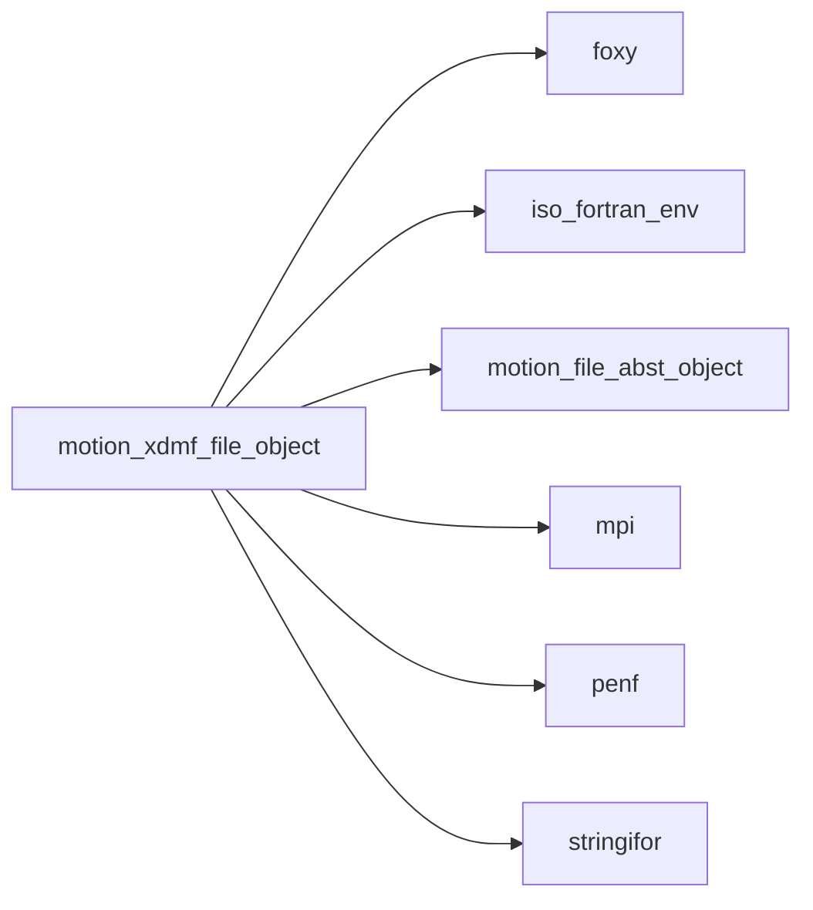

## Contents

- [xdmf_parameters_object](#xdmf-parameters-object)
- [xdmf_file_object](#xdmf-file-object)
- [xdmf_file_object](#xdmf-file-object)
- [close_file](#close-file)
- [open_file](#open-file)
- [parse_file](#parse-file)
- [close_attribute_tag](#close-attribute-tag)
- [open_attribute_tag](#open-attribute-tag)
- [write_dataitem_tag](#write-dataitem-tag)
- [close_domain_tag](#close-domain-tag)
- [open_domain_tag](#open-domain-tag)
- [close_geometry_tag](#close-geometry-tag)
- [open_geometry_tag](#open-geometry-tag)
- [close_grid_tag](#close-grid-tag)
- [open_grid_tag](#open-grid-tag)
- [write_async_tags](#write-async-tags)
- [write_header_tag](#write-header-tag)
- [write_time_tag](#write-time-tag)
- [write_topology_tag](#write-topology-tag)
- [write_end_tag](#write-end-tag)
- [write_self_closing_tag](#write-self-closing-tag)
- [write_start_tag](#write-start-tag)
- [write_tag](#write-tag)
- [gather_async_tags](#gather-async-tags)
- [new](#new)
- [dataitem_tag_attr](#dataitem-tag-attr)
- [dataitem_tag_str](#dataitem-tag-str)
- [tag_str](#tag-str)

## Variables

| Name | Type | Attributes | Description |
|------|------|------------|-------------|
| `NL` | character(len=1) | parameter | New line (end record) character. |
| `XDMF_PARAMETERS` | type([xdmf_parameters_object](/api/src/third_party/MOTIOn/src/lib/motion_xdmf_file_object#xdmf-parameters-object)) | parameter | List of XDMF named constants. |

## Derived Types

### xdmf_parameters_object

Global named constants (paramters) class (container) of XDMF syntax.

#### Components

| Name | Type | Attributes | Description |
|------|------|------------|-------------|
| `XDMF_ATTR_CENTER_NODE` | character(len=4) |  | XDMF attribute node  centered. |
| `XDMF_ATTR_CENTER_EDGE` | character(len=4) |  | XDMF attribute edge  centered. |
| `XDMF_ATTR_CENTER_FACE` | character(len=4) |  | XDMF attribute face  centered. |
| `XDMF_ATTR_CENTER_CELL` | character(len=4) |  | XDMF attribute cell  centered. |
| `XDMF_ATTR_CENTER_GRID` | character(len=4) |  | XDMF attribute grid  centered. |
| `XDMF_ATTR_CENTER_OTHER` | character(len=5) |  | XDMF attribute other centered. |
| `XDMF_ATTR_TYPE_SCALAR` | character(len=6) |  | XDMF attribute type scalar. |
| `XDMF_ATTR_TYPE_VECTOR` | character(len=6) |  | XDMF attribute type vector. |
| `XDMF_ATTR_TYPE_TENSOR` | character(len=6) |  | XDMF attribute type tensor. |
| `XDMF_ATTR_TYPE_TENSOR6` | character(len=7) |  | XDMF attribute type tensor6. |
| `XDMF_ATTR_TYPE_MATRIX` | character(len=6) |  | XDMF attribute type matrix. |
| `XDMF_ATTR_TYPE_GLOBALID` | character(len=8) |  | XDMF attribute type global ID. |
| `XDMF_ATTR_ELEM_FAMILY_CG` | character(len=2) |  | XDMF attribute element family CG. |
| `XDMF_ATTR_ELEM_FAMILY_DG` | character(len=2) |  | XDMF attribute element family DG. |
| `XDMF_ATTR_ELEM_FAMILY_Q` | character(len=1) |  | XDMF attribute element family Q. |
| `XDMF_ATTR_ELEM_FAMILY_DQ` | character(len=2) |  | XDMF attribute element family DQ. |
| `XDMF_ATTR_ELEM_FAMILY_RT` | character(len=2) |  | XDMF attribute element family RT. |
| `XDMF_ATTR_ELEM_CELL_INTERVAL` | character(len=8) |  | XDMF attribute element cell interval. |
| `XDMF_ATTR_ELEM_CELL_TRIANGLE` | character(len=8) |  | XDMF attribute element cell triangle. |
| `XDMF_ATTR_ELEM_CELL_TETRAHEDRON` | character(len=11) |  | XDMF attribute element cell tetrahedron. |
| `XDMF_ATTR_ELEM_CELL_QUADRILATERAL` | character(len=13) |  | XDMF attribute element cell quadrilateral. |
| `XDMF_ATTR_ELEM_CELL_HEXAHEDRON` | character(len=10) |  | XDMF attribute element cell hexahedron. |
| `XDMF_DATAITEM_ITEMTYPE_UNIFORM` | character(len=7) |  | XDMF dataitem item type Uniform |
| `XDMF_DATAITEM_ITEMTYPE_COLLECTION` | character(len=10) |  | XDMF dataitem item type collection |
| `XDMF_DATAITEM_ITEMTYPE_TREE` | character(len=4) |  | XDMF dataitem item type tree |
| `XDMF_DATAITEM_ITEMTYPE_HYPERSLAB` | character(len=9) |  | XDMF dataitem item type hyperSlab |
| `XDMF_DATAITEM_ITEMTYPE_COORDINATES` | character(len=11) |  | XDMF dataitem item type coordinates |
| `XDMF_DATAITEM_ITEMTYPE_FUNCTION` | character(len=8) |  | XDMF dataitem item type function |
| `XDMF_DATAITEM_NUMBER_FORMAT_HDF` | character(len=3) |  | XDMF dataitem number format HDF. |
| `XDMF_DATAITEM_NUMBER_FORMAT_XML` | character(len=3) |  | XDMF dataitem number format XML. |
| `XDMF_DATAITEM_NUMBER_FORMAT_BINARY` | character(len=6) |  | XDMF dataitem number format Binary. |
| `XDMF_DATAITEM_NUMBER_TYPE_FLOAT` | character(len=5) |  | XDMF dataitem number type float. |
| `XDMF_DATAITEM_NUMBER_TYPE_INT` | character(len=3) |  | XDMF dataitem number type int. |
| `XDMF_DATAITEM_NUMBER_TYPE_UINT` | character(len=4) |  | XDMF dataitem number type uInt. |
| `XDMF_DATAITEM_NUMBER_TYPE_CHAR` | character(len=4) |  | XDMF dataitem number type char. |
| `XDMF_DATAITEM_NUMBER_TYPE_UCHAR` | character(len=5) |  | XDMF dataitem number type uChar. |
| `XDMF_DATAITEM_NUMBER_PRECISION_1` | character(len=1) |  | XDMF dataitem number precision 1. |
| `XDMF_DATAITEM_NUMBER_PRECISION_2` | character(len=1) |  | XDMF dataitem number precision 2. |
| `XDMF_DATAITEM_NUMBER_PRECISION_4` | character(len=1) |  | XDMF dataitem number precision 4. |
| `XDMF_DATAITEM_NUMBER_PRECISION_8` | character(len=1) |  | XDMF dataitem number precision 8. |
| `XDMF_DATAITEM_ENDIAN_NATIVE` | character(len=6) |  | XDMF dataitem number endian native. |
| `XDMF_DATAITEM_ENDIAN_BIG` | character(len=3) |  | XDMF dataitem number endian big. |
| `XDMF_DATAITEM_ENDIAN_LITTLE` | character(len=6) |  | XDMF dataitem number endian little. |
| `XDMF_DATAITEM_COMPRESSION_RAW` | character(len=3) |  | XDMF dataitem number compression raw. |
| `XDMF_DATAITEM_COMPRESSION_ZLIB` | character(len=4) |  | XDMF dataitem number compression zlib. |
| `XDMF_DATAITEM_COMPRESSION_BZIP2` | character(len=5) |  | XDMF dataitem number compression bzip2. |
| `XDMF_GEOMETRY_TYPE_XYZ` | character(len=3) |  | XDMF geometry type xyz (interlaced values). |
| `XDMF_GEOMETRY_TYPE_XY` | character(len=2) |  | XDMF geometry type xy. |
| `XDMF_GEOMETRY_TYPE_X_Y_Z` | character(len=5) |  | XDMF geometry type xyz (separated values). |
| `XDMF_GEOMETRY_TYPE_VXVYVZ` | character(len=6) |  | XDMF geometry type xyz (3 arrays). |
| `XDMF_GEOMETRY_TYPE_ODXYZ` | character(len=13) |  | XDMF geometry type origin-dxyz. |
| `XDMF_GEOMETRY_TYPE_ODXY` | character(len=11) |  | XDMF geometry type origin-dxy. |
| `XDMF_GRID_TYPE_UNIFORM` | character(len=7) |  | XDMF grid type uniform. |
| `XDMF_GRID_TYPE_COLLECTION` | character(len=10) |  | XDMF grid type collection. |
| `XDMF_GRID_TYPE_COLLECTION_ASYNC` | character(len=15) |  | XDMF grid type collection. |
| `XDMF_GRID_TYPE_TREE` | character(len=4) |  | XDMF grid type tree. |
| `XDMF_GRID_TYPE_SUBSET` | character(len=6) |  | XDMF grid type subset. |
| `XDMF_GRID_COLLECTION_TYPE_SPATIAL` | character(len=7) |  | XDMF grid collection type spatial. |
| `XDMF_GRID_COLLECTION_TYPE_TEMPORAL` | character(len=8) |  | XDMF grid collection type spatial. |
| `XDMF_GRID_SECTION_DATAITEM` | character(len=8) |  | XDMF grid section dataitem. |
| `XDMF_GRID_SECTION_ALL` | character(len=3) |  | XDMF grid section all. |
| `XDMF_TIME_TYPE_SINGLE` | character(len=6) |  | XDMF time type single. |
| `XDMF_TIME_TYPE_HYPERSLAB` | character(len=9) |  | XDMF time type hyperslab. |
| `XDMF_TIME_TYPE_LIST` | character(len=4) |  | XDMF time type list. |
| `XDMF_TIME_TYPE_RANGE` | character(len=5) |  | XDMF time type range. |
| `XDMF_TOPOLOGY_TYPE_3DSMESH` | character(len=7) |  | XDMF topology type curvilinear mesh, 3D. |
| `XDMF_TOPOLOGY_TYPE_3DRECTMESH` | character(len=10) |  | XDMF topology type cartesian mesh, 3D. |
| `XDMF_TOPOLOGY_TYPE_3DCORECTMESH` | character(len=12) |  | XDMF topology type cart uniform mesh, 3D. |
| `XDMF_TOPOLOGY_TYPE_2DSMESH` | character(len=7) |  | XDMF topology type curvilinear mesh, 2D. |
| `XDMF_TOPOLOGY_TYPE_2DRECTMESH` | character(len=10) |  | XDMF topology type cartesian mesh, 2D. |
| `XDMF_TOPOLOGY_TYPE_2DCORECTMESH` | character(len=12) |  | XDMF topology type cart uniform mesh, 2D. |
| `XDMF_TOPOLOGY_TYPE_POLYVERTEX` | character(len=10) |  | XDMF topology type polyvertex. |
| `XDMF_TOPOLOGY_TYPE_POLYLINE` | character(len=8) |  | XDMF topology type polyline. |
| `XDMF_TOPOLOGY_TYPE_POLYGON` | character(len=7) |  | XDMF topology type polygon. |
| `XDMF_TOPOLOGY_TYPE_TRIANGLE` | character(len=8) |  | XDMF topology type triangle. |
| `XDMF_TOPOLOGY_TYPE_QUADRILATERAL` | character(len=13) |  | XDMF topology type quadrilateral. |
| `XDMF_TOPOLOGY_TYPE_TETRAHEDRON` | character(len=11) |  | XDMF topology type tetrahedron. |
| `XDMF_TOPOLOGY_TYPE_PYRAMID` | character(len=7) |  | XDMF topology type pyramid. |
| `XDMF_TOPOLOGY_TYPE_WEDGE` | character(len=5) |  | XDMF topology type wedge. |
| `XDMF_TOPOLOGY_TYPE_HEXAHEDRON` | character(len=10) |  | XDMF topology type hexahedron. |
| `XDMF_TOPOLOGY_TYPE_EDGE_3` | character(len=6) |  | XDMF topology type edge_3. |
| `XDMF_TOPOLOGY_TYPE_TRIANGLE_6` | character(len=10) |  | XDMF topology type triangle_6. |
| `XDMF_TOPOLOGY_TYPE_QUADRILATERAL_8` | character(len=15) |  | XDMF topology type quadrilateral_8. |
| `XDMF_TOPOLOGY_TYPE_TETRAHEDRON_10` | character(len=14) |  | XDMF topology type tetrahedron_10. |
| `XDMF_TOPOLOGY_TYPE_PYRAMID_13` | character(len=10) |  | XDMF topology type pyramid_13. |
| `XDMF_TOPOLOGY_TYPE_WEDGE_15` | character(len=8) |  | XDMF topology type wedge_15. |
| `XDMF_TOPOLOGY_TYPE_HEXAHEDRON_20` | character(len=13) |  | XDMF topology type hexahedron_20. |
| `XDMF_TOPOLOGY_TYPE_MIXED` | character(len=5) |  | XDMF topology type mixed. |

### xdmf_file_object

XDMF file object class.

**Inheritance**

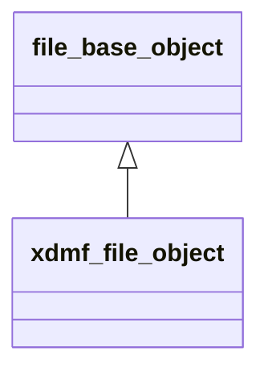

**Extends**: [`file_base_object`](/api/src/third_party/MOTIOn/src/lib/motion_file_abst_object#file-base-object)

#### Components

| Name | Type | Attributes | Description |
|------|------|------------|-------------|
| `filename` | type([string](/api/src/third_party/StringiFor/src/lib/stringifor_string_t#string)) |  | File name. |
| `procs_number` | integer(kind=[I4P](/api/src/third_party/PENF/src/lib/penf_global_parameters_variables)) |  | Number of MPI processes. |
| `myrank` | integer(kind=[I4P](/api/src/third_party/PENF/src/lib/penf_global_parameters_variables)) |  | MPI ID process. |
| `error` | integer(kind=[I4P](/api/src/third_party/PENF/src/lib/penf_global_parameters_variables)) |  | IO Error status. |
| `indent` | integer(kind=[I4P](/api/src/third_party/PENF/src/lib/penf_global_parameters_variables)) |  | Indent count. |
| `xml` | integer(kind=[I4P](/api/src/third_party/PENF/src/lib/penf_global_parameters_variables)) |  | XML Logical unit. |
| `tag` | type([xml_tag](/api/src/third_party/FoXy/src/lib/foxy_xml_tag#xml-tag)) |  | XML tags handler. |
| `is_async` | logical |  | Asyncronous saving. |
| `async_tags` | type([string](/api/src/third_party/StringiFor/src/lib/stringifor_string_t#string)) |  | Asyncronous tags data. |
| `dom` | type([xml_file](/api/src/third_party/FoXy/src/lib/foxy_xml_file#xml-file)) |  | XMDF file parsed as linearized DOM. |

#### Type-Bound Procedures

| Name | Attributes | Description |
|------|------------|-------------|
| `initialize` | pass(self) | Initialize file class. |
| `close_file` | pass(self) | Close XDMF file. |
| `open_file` | pass(self) | Open XDMF file. |
| `parse_file` | pass(self) | Parse XDMF file. |
| `close_attribute_tag` | pass(self) | Close `Attribute` tag. |
| `open_attribute_tag` | pass(self) | Open `Attribute` tag. |
| `dataitem_tag_attr` | pass(self) | Return `DataItem` tag attributes as string. |
| `write_dataitem_tag` | pass(self) | Write `DataItem` tag. |
| `close_domain_tag` | pass(self) | Close `Domain` tag. |
| `open_domain_tag` | pass(self) | Open `Domain` tag. |
| `close_geometry_tag` | pass(self) | Close `Geometry` tag. |
| `open_geometry_tag` | pass(self) | Open `Geometry` tag. |
| `close_grid_tag` | pass(self) | Close `Grid` tag. |
| `open_grid_tag` | pass(self) | Open `Grid` tag. |
| `write_async_tags` | pass(self) | Write async tags of other (not mine...) processes. |
| `write_header_tag` | pass(self) | Write header tag. |
| `write_time_tag` | pass(self) | Write `Time` tag. |
| `write_topology_tag` | pass(self) | Write `Topology` tag. |
| `tag_str` | pass(self) | Return tag as string. |
| `write_end_tag` | pass(self) | Write `` end tag. |
| `write_self_closing_tag` | pass(self) | Write self closing tag. |
| `write_start_tag` | pass(self) | Write start tag. |
| `write_tag` | pass(self) | Write tag. |
| `gather_async_tags` | pass(self) | Gather async tags. |

## Interfaces

### xdmf_file_object

Overload class name with initializer function.

**Module procedures**: [`new`](/api/src/third_party/MOTIOn/src/lib/motion_hdf5_file_object#new)

## Subroutines

### close_file

Close XDMF file.

```fortran
subroutine close_file(self)
```

**Arguments**

| Name | Type | Intent | Attributes | Description |
|------|------|--------|------------|-------------|
| `self` | class([xdmf_file_object](/api/src/third_party/MOTIOn/src/lib/motion_xdmf_file_object#xdmf-file-object)) | inout |  | File handler. |

**Call graph**

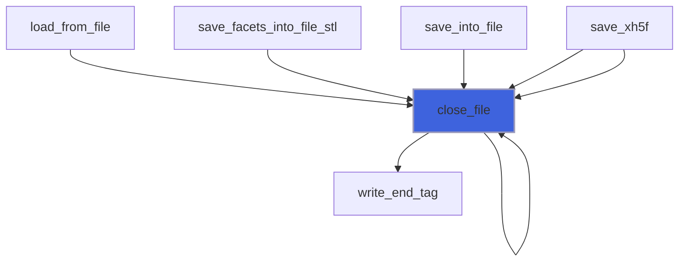

### open_file

Open XDMF file.

```fortran
subroutine open_file(self, filename, act)
```

**Arguments**

| Name | Type | Intent | Attributes | Description |
|------|------|--------|------------|-------------|
| `self` | class([xdmf_file_object](/api/src/third_party/MOTIOn/src/lib/motion_xdmf_file_object#xdmf-file-object)) | inout |  | File handler. |
| `filename` | character(len=*) | in |  | File name. |
| `act` | character(len=*) | in | optional | File action ['readonly, overwrite'...]. |

**Call graph**

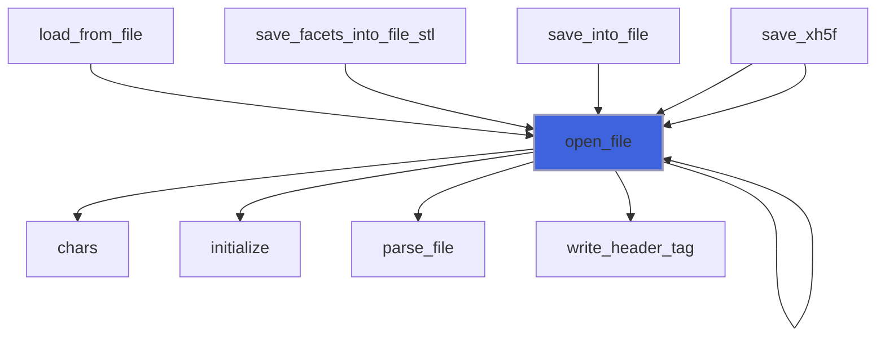

### parse_file

Parse XDMF file.

```fortran
subroutine parse_file(self, filename)
```

**Arguments**

| Name | Type | Intent | Attributes | Description |
|------|------|--------|------------|-------------|
| `self` | class([xdmf_file_object](/api/src/third_party/MOTIOn/src/lib/motion_xdmf_file_object#xdmf-file-object)) | inout |  | File handler. |
| `filename` | character(len=*) | in |  | File name. |

**Call graph**

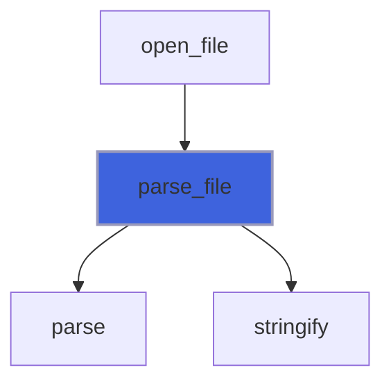

### close_attribute_tag

Close `Attribute` tag.

```fortran
subroutine close_attribute_tag(self)
```

**Arguments**

| Name | Type | Intent | Attributes | Description |
|------|------|--------|------------|-------------|
| `self` | class([xdmf_file_object](/api/src/third_party/MOTIOn/src/lib/motion_xdmf_file_object#xdmf-file-object)) | inout |  | File handler. |

**Call graph**

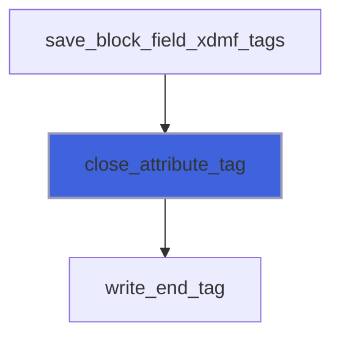

### open_attribute_tag

Open `Attribute` tag.
 ```
 ->            default value
 Name          (no default)
 Center        Node | Edge | Face | Cell | Grid | Other
 AttributeType Scalar | Vector | Tensor (9 values expected) | Tensor6 (summetric tensor) | Matrix (arbitrary NxM matrix)
 -> Only Meaningful if ItemType="FiniteElementFunction"
 ItemType      (no default) | FiniteElementFunction
 ElementFamily (no default) | CG | DG | Q | DQ | RT
 ElementDegree (no default) Arbitrary integer value
 ElementCell   (no default) | interval | triangle | tetrahedron | quadrilateral | hexahedron
 ```

```fortran
subroutine open_attribute_tag(self, attribute_name, attribute_center, attribute_type, attribute_item_type, element_family, element_degree, element_cell)
```

**Arguments**

| Name | Type | Intent | Attributes | Description |
|------|------|--------|------------|-------------|
| `self` | class([xdmf_file_object](/api/src/third_party/MOTIOn/src/lib/motion_xdmf_file_object#xdmf-file-object)) | inout |  | File handler. |
| `attribute_name` | character(len=*) | in | optional | Attribute name. |
| `attribute_center` | character(len=*) | in | optional | Attribute center. |
| `attribute_type` | character(len=*) | in | optional | Attribute type. |
| `attribute_item_type` | character(len=*) | in | optional | Attribute item type. |
| `element_family` | character(len=*) | in | optional | Attribute element family. |
| `element_degree` | character(len=*) | in | optional | Attribute element degree. |
| `element_cell` | character(len=*) | in | optional | Attribute element cell. |

**Call graph**

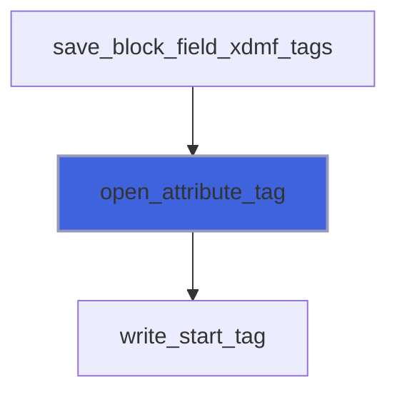

### write_dataitem_tag

Write `DataItem` tag.

```fortran
subroutine write_dataitem_tag(self, content, item_type, item_dimensions, number_type, number_precision, number_format, endian, compression, seek)
```

**Arguments**

| Name | Type | Intent | Attributes | Description |
|------|------|--------|------------|-------------|
| `self` | class([xdmf_file_object](/api/src/third_party/MOTIOn/src/lib/motion_xdmf_file_object#xdmf-file-object)) | inout |  | File handler. |
| `content` | character(len=*) | in |  | Data item content. |
| `item_type` | character(len=*) | in | optional | Item type. |
| `item_dimensions` | character(len=*) | in | optional | Item dimensions, external given. |
| `number_type` | character(len=*) | in | optional | Number type. |
| `number_precision` | character(len=*) | in | optional | Number precision. |
| `number_format` | character(len=*) | in | optional | Number format. |
| `endian` | character(len=*) | in | optional | Bits endian. |
| `compression` | character(len=*) | in | optional | Data compression. |
| `seek` | character(len=*) | in | optional | Bytes to skip. |

**Call graph**

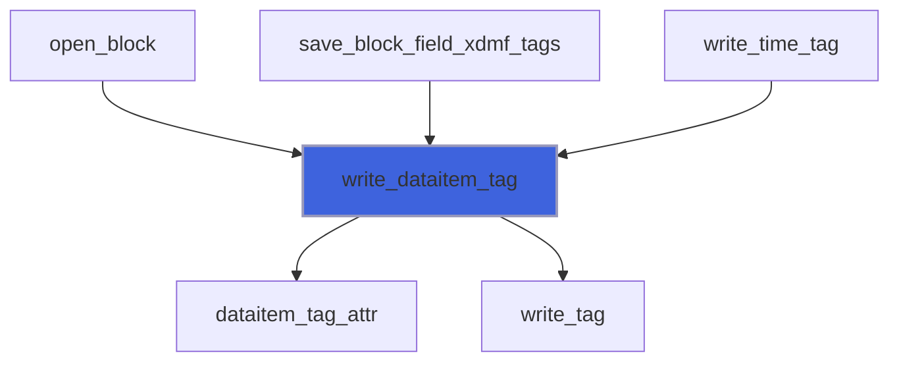

### close_domain_tag

Close `Domain` tag.

```fortran
subroutine close_domain_tag(self)
```

**Arguments**

| Name | Type | Intent | Attributes | Description |
|------|------|--------|------------|-------------|
| `self` | class([xdmf_file_object](/api/src/third_party/MOTIOn/src/lib/motion_xdmf_file_object#xdmf-file-object)) | inout |  | File handler. |

**Call graph**

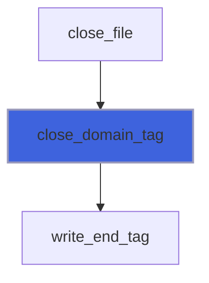

### open_domain_tag

Open `Domain` tag.

```fortran
subroutine open_domain_tag(self)
```

**Arguments**

| Name | Type | Intent | Attributes | Description |
|------|------|--------|------------|-------------|
| `self` | class([xdmf_file_object](/api/src/third_party/MOTIOn/src/lib/motion_xdmf_file_object#xdmf-file-object)) | inout |  | File handler. |

**Call graph**

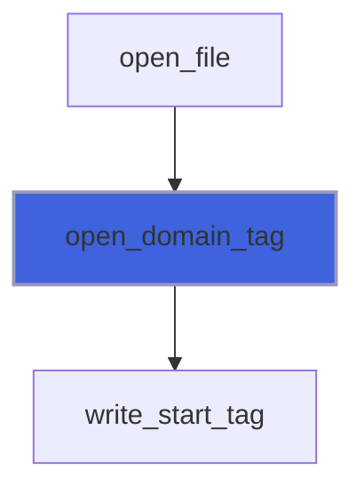

### close_geometry_tag

Close `Geometry` tag.

```fortran
subroutine close_geometry_tag(self)
```

**Arguments**

| Name | Type | Intent | Attributes | Description |
|------|------|--------|------------|-------------|
| `self` | class([xdmf_file_object](/api/src/third_party/MOTIOn/src/lib/motion_xdmf_file_object#xdmf-file-object)) | inout |  | File handler. |

**Call graph**

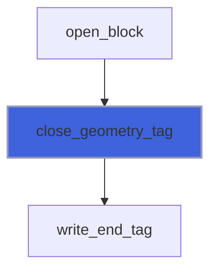

### open_geometry_tag

Open `Geometry` tag.
 ```
 XYZ - Interlaced locations (default)
 XY - Z is set to 0.0
 X_Y_Z - X,Y, and Z are separate arrays
 VXVYVZ - Three arrays, one for each axis
 ORIGIN_DXDYDZ - Six Values : Ox,Oy,Oz + Dx,Dy,Dz
 ORIGIN_DXDY - Four Values : Ox,Oy + Dx,Dy
 ```

```fortran
subroutine open_geometry_tag(self, geometry_type)
```

**Arguments**

| Name | Type | Intent | Attributes | Description |
|------|------|--------|------------|-------------|
| `self` | class([xdmf_file_object](/api/src/third_party/MOTIOn/src/lib/motion_xdmf_file_object#xdmf-file-object)) | inout |  | File handler. |
| `geometry_type` | character(len=*) | in | optional | Geometry type. |

**Call graph**


### close_grid_tag

Close `Grid` tag.

```fortran
subroutine close_grid_tag(self, grid_type)
```

**Arguments**

| Name | Type | Intent | Attributes | Description |
|------|------|--------|------------|-------------|
| `self` | class([xdmf_file_object](/api/src/third_party/MOTIOn/src/lib/motion_xdmf_file_object#xdmf-file-object)) | inout |  | File handler. |
| `grid_type` | character(len=*) | in | optional | Grid type. |

**Call graph**

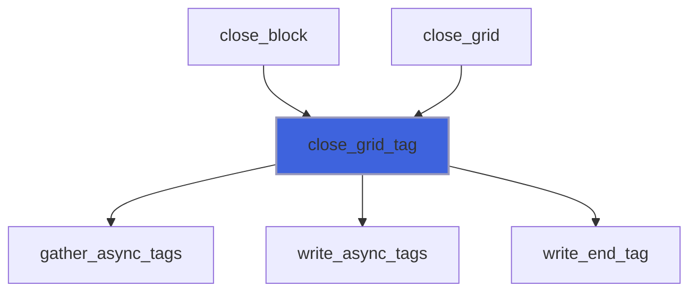

### open_grid_tag

Open `Grid` tag.
 ```
 ->              default value
 Name            (no default)
 GridType        Uniform | Collection | Tree | Subset
 CollectionType  Spatial | Temporal (Only Meaningful if GridType="Collection")
 Section         DataItem | All  (Only Meaningful if GridType="Subset")
 ```

```fortran
subroutine open_grid_tag(self, grid_name, grid_type, grid_collection_type, grid_section)
```

**Arguments**

| Name | Type | Intent | Attributes | Description |
|------|------|--------|------------|-------------|
| `self` | class([xdmf_file_object](/api/src/third_party/MOTIOn/src/lib/motion_xdmf_file_object#xdmf-file-object)) | inout |  | File handler. |
| `grid_name` | character(len=*) | in | optional | Grid name. |
| `grid_type` | character(len=*) | in | optional | Grid type. |
| `grid_collection_type` | character(len=*) | in | optional | Grid collection type. |
| `grid_section` | character(len=*) | in | optional | Grid section. |

**Call graph**

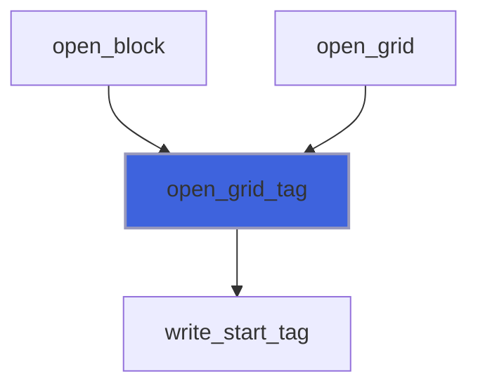

### write_async_tags

Write async tags of other (not mine...) processes.

```fortran
subroutine write_async_tags(self, async_tags)
```

**Arguments**

| Name | Type | Intent | Attributes | Description |
|------|------|--------|------------|-------------|
| `self` | class([xdmf_file_object](/api/src/third_party/MOTIOn/src/lib/motion_xdmf_file_object#xdmf-file-object)) | inout |  | File handler. |
| `async_tags` | type([string](/api/src/third_party/StringiFor/src/lib/stringifor_string_t#string)) | in |  | Asyncronous tags data. |

**Call graph**

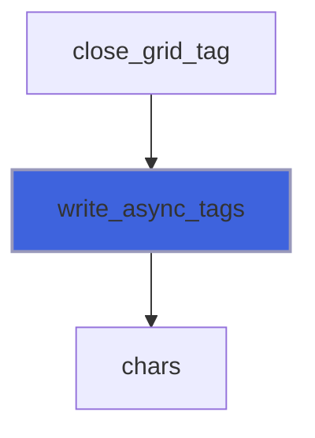

### write_header_tag

Write header tag.

```fortran
subroutine write_header_tag(self)
```

**Arguments**

| Name | Type | Intent | Attributes | Description |
|------|------|--------|------------|-------------|
| `self` | class([xdmf_file_object](/api/src/third_party/MOTIOn/src/lib/motion_xdmf_file_object#xdmf-file-object)) | inout |  | File handler. |

**Call graph**

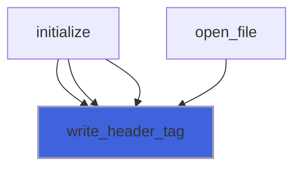

### write_time_tag

Write `Time` tag.
 ```
 ->        default value
 TimeType  Single | HyperSlab | List | Range
 Value     (no default - Only valid for TimeType="Single")
 ```

```fortran
subroutine write_time_tag(self, time_value, time_type, time_dimensions, time_number_type, time_number_precision, time_number_format)
```

**Arguments**

| Name | Type | Intent | Attributes | Description |
|------|------|--------|------------|-------------|
| `self` | class([xdmf_file_object](/api/src/third_party/MOTIOn/src/lib/motion_xdmf_file_object#xdmf-file-object)) | inout |  | File handler. |
| `time_value` | character(len=*) | in |  | Time value. |
| `time_type` | character(len=*) | in | optional | Time type. |
| `time_dimensions` | character(len=*) | in | optional | Time (list) dimensions. |
| `time_number_type` | character(len=*) | in | optional | Time number type. |
| `time_number_precision` | character(len=*) | in | optional | Time number precision. |
| `time_number_format` | character(len=*) | in | optional | Time number format. |

**Call graph**

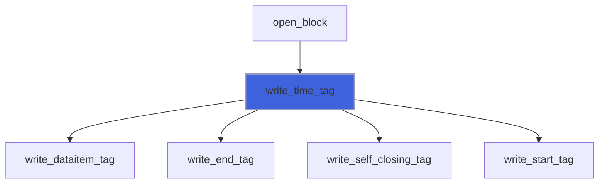

### write_topology_tag

Write `Topology` tag.
 ```
 ->               default value
 Name             (no default)
 TopologyType     Polyvertex | Polyline | Polygon |
                  Triangle | Quadrilateral | Tetrahedron | Pyramid| Wedge | Hexahedron |
                  Edge_3 | Triangle_6 | Quadrilateral_8 | Tetrahedron_10 | Pyramid_13 |
                  Wedge_15 | Hexahedron_20 |
                  Mixed |
                  2DSMesh | 2DRectMesh | 2DCoRectMesh |
                  3DSMesh | 3DRectMesh | 3DCoRectMesh
 NodesPerElement  (no default) Only Important for Polyvertex, Polygon and Polyline
 NumberOfElements (no default)
     OR
 Dimensions       (no default)
 Order            each cell type has its own default
 ```

```fortran
subroutine write_topology_tag(self, topology_type, topology_dimensions)
```

**Arguments**

| Name | Type | Intent | Attributes | Description |
|------|------|--------|------------|-------------|
| `self` | class([xdmf_file_object](/api/src/third_party/MOTIOn/src/lib/motion_xdmf_file_object#xdmf-file-object)) | inout |  | File handler. |
| `topology_type` | character(len=*) | in |  | Topology type. |
| `topology_dimensions` | character(len=*) | in |  | Topology dimensions. |

**Call graph**

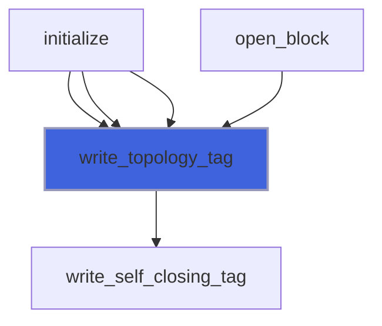

### write_end_tag

Write `</tag_name>` end tag.

```fortran
subroutine write_end_tag(self, name)
```

**Arguments**

| Name | Type | Intent | Attributes | Description |
|------|------|--------|------------|-------------|
| `self` | class([xdmf_file_object](/api/src/third_party/MOTIOn/src/lib/motion_xdmf_file_object#xdmf-file-object)) | inout |  | File handler. |
| `name` | character(len=*) | in |  | Tag name. |

**Call graph**


### write_self_closing_tag

Write `<tag_name.../>` self closing tag.

```fortran
subroutine write_self_closing_tag(self, name, attributes)
```

**Arguments**

| Name | Type | Intent | Attributes | Description |
|------|------|--------|------------|-------------|
| `self` | class([xdmf_file_object](/api/src/third_party/MOTIOn/src/lib/motion_xdmf_file_object#xdmf-file-object)) | inout |  | File handler. |
| `name` | character(len=*) | in |  | Tag name. |
| `attributes` | character(len=*) | in | optional | Tag attributes. |

**Call graph**

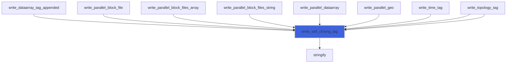

### write_start_tag

Write `<tag_name...>` start tag.

```fortran
subroutine write_start_tag(self, name, attributes)
```

**Arguments**

| Name | Type | Intent | Attributes | Description |
|------|------|--------|------------|-------------|
| `self` | class([xdmf_file_object](/api/src/third_party/MOTIOn/src/lib/motion_xdmf_file_object#xdmf-file-object)) | inout |  | File handler. |
| `name` | character(len=*) | in |  | Tag name. |
| `attributes` | character(len=*) | in | optional | Tag attributes. |

**Call graph**

```mermaid
flowchart TD
  open_attribute_tag["open_attribute_tag"] --> write_start_tag["write_start_tag"]
  open_domain_tag["open_domain_tag"] --> write_start_tag["write_start_tag"]
  open_geometry_tag["open_geometry_tag"] --> write_start_tag["write_start_tag"]
  open_grid_tag["open_grid_tag"] --> write_start_tag["write_start_tag"]
  write_connectivity["write_connectivity"] --> write_start_tag["write_start_tag"]
  write_dataarray_appended["write_dataarray_appended"] --> write_start_tag["write_start_tag"]
  write_dataarray_location_tag["write_dataarray_location_tag"] --> write_start_tag["write_start_tag"]
  write_fielddata_tag["write_fielddata_tag"] --> write_start_tag["write_start_tag"]
  write_geo_rect_data3_rank1_R4P["write_geo_rect_data3_rank1_R4P"] --> write_start_tag["write_start_tag"]
  write_geo_rect_data3_rank1_R8P["write_geo_rect_data3_rank1_R8P"] --> write_start_tag["write_start_tag"]
  write_geo_strg_data1_rank2_R4P["write_geo_strg_data1_rank2_R4P"] --> write_start_tag["write_start_tag"]
  write_geo_strg_data1_rank2_R8P["write_geo_strg_data1_rank2_R8P"] --> write_start_tag["write_start_tag"]
  write_geo_strg_data1_rank4_R4P["write_geo_strg_data1_rank4_R4P"] --> write_start_tag["write_start_tag"]
  write_geo_strg_data1_rank4_R8P["write_geo_strg_data1_rank4_R8P"] --> write_start_tag["write_start_tag"]
  write_geo_strg_data3_rank1_R4P["write_geo_strg_data3_rank1_R4P"] --> write_start_tag["write_start_tag"]
  write_geo_strg_data3_rank1_R8P["write_geo_strg_data3_rank1_R8P"] --> write_start_tag["write_start_tag"]
  write_geo_strg_data3_rank3_R4P["write_geo_strg_data3_rank3_R4P"] --> write_start_tag["write_start_tag"]
  write_geo_strg_data3_rank3_R8P["write_geo_strg_data3_rank3_R8P"] --> write_start_tag["write_start_tag"]
  write_geo_unst_data1_rank2_R4P["write_geo_unst_data1_rank2_R4P"] --> write_start_tag["write_start_tag"]
  write_geo_unst_data1_rank2_R8P["write_geo_unst_data1_rank2_R8P"] --> write_start_tag["write_start_tag"]
  write_geo_unst_data3_rank1_R4P["write_geo_unst_data3_rank1_R4P"] --> write_start_tag["write_start_tag"]
  write_geo_unst_data3_rank1_R8P["write_geo_unst_data3_rank1_R8P"] --> write_start_tag["write_start_tag"]
  write_parallel_open_block["write_parallel_open_block"] --> write_start_tag["write_start_tag"]
  write_piece_start_tag["write_piece_start_tag"] --> write_start_tag["write_start_tag"]
  write_piece_start_tag_unst["write_piece_start_tag_unst"] --> write_start_tag["write_start_tag"]
  write_time_tag["write_time_tag"] --> write_start_tag["write_start_tag"]
  write_topology_tag["write_topology_tag"] --> write_start_tag["write_start_tag"]
  write_start_tag["write_start_tag"] --> stringify["stringify"]
  style write_start_tag fill:#3e63dd,stroke:#99b,stroke-width:2px
```

### write_tag

Write `<tag_name...>...</tag_name>` tag.

```fortran
subroutine write_tag(self, name, attributes, content)
```

**Arguments**

| Name | Type | Intent | Attributes | Description |
|------|------|--------|------------|-------------|
| `self` | class([xdmf_file_object](/api/src/third_party/MOTIOn/src/lib/motion_xdmf_file_object#xdmf-file-object)) | inout |  | File handler. |
| `name` | character(len=*) | in |  | Tag name. |
| `attributes` | character(len=*) | in | optional | Tag attributes. |
| `content` | character(len=*) | in | optional | Tag content. |

**Call graph**

```mermaid
flowchart TD
  write_dataarray_tag["write_dataarray_tag"] --> write_tag["write_tag"]
  write_dataitem_tag["write_dataitem_tag"] --> write_tag["write_tag"]
  write_tag["write_tag"] --> stringify["stringify"]
  style write_tag fill:#3e63dd,stroke:#99b,stroke-width:2px
```

### gather_async_tags

Gather async tags.
 into its own async_tags string.

```fortran
subroutine gather_async_tags(self)
```

**Arguments**

| Name | Type | Intent | Attributes | Description |
|------|------|--------|------------|-------------|
| `self` | class([xdmf_file_object](/api/src/third_party/MOTIOn/src/lib/motion_xdmf_file_object#xdmf-file-object)) | inout |  | File handler. |

**Call graph**

```mermaid
flowchart TD
  close_grid_tag["close_grid_tag"] --> gather_async_tags["gather_async_tags"]
  gather_async_tags["gather_async_tags"] --> chars["chars"]
  style gather_async_tags fill:#3e63dd,stroke:#99b,stroke-width:2px
```

## Functions

### new

Return a new initialized class instance, overload class name.

**Returns**: type([xdmf_file_object](/api/src/third_party/MOTIOn/src/lib/motion_xdmf_file_object#xdmf-file-object))

```fortran
function new() result(xdmf)
```

### dataitem_tag_attr

Return `DataItem` tag attributes as string.
 ```
 ->          default value
 Name        (no default)
 ItemType    Uniform | Collection | tree | HyperSlab | coordinates | Function
 Dimensions  (no default) in KJI Order
 NumberType  Float | Int | UInt | Char | UChar
 Precision   4 | 1 | 2 (Int or UInt only) | 8
 Format      XML | HDF | Binary
 Endian      Native | Big | Little (applicable only to Binary format)
 Compression Raw|Zlib|BZip2 (applicable only to Binary format and depend on xdmf configuration)
 Seek        0 (number of bytes to skip, applicable only to Binary format with Raw compression)
 ```

**Returns**: `character(len=:)`

```fortran
function dataitem_tag_attr(self, item_type, item_dimensions, number_type, number_precision, number_format, endian, compression, seek) result(attr)
```

**Arguments**

| Name | Type | Intent | Attributes | Description |
|------|------|--------|------------|-------------|
| `self` | class([xdmf_file_object](/api/src/third_party/MOTIOn/src/lib/motion_xdmf_file_object#xdmf-file-object)) | inout |  | File handler. |
| `item_type` | character(len=*) | in | optional | Item type. |
| `item_dimensions` | character(len=*) | in | optional | Item dimensions, external given. |
| `number_type` | character(len=*) | in | optional | Number type. |
| `number_precision` | character(len=*) | in | optional | Number precision. |
| `number_format` | character(len=*) | in | optional | Number format. |
| `endian` | character(len=*) | in | optional | Bits endian. |
| `compression` | character(len=*) | in | optional | Data compression. |
| `seek` | character(len=*) | in | optional | Bytes to skip. |

**Call graph**

```mermaid
flowchart TD
  dataitem_tag_str["dataitem_tag_str"] --> dataitem_tag_attr["dataitem_tag_attr"]
  write_dataitem_tag["write_dataitem_tag"] --> dataitem_tag_attr["dataitem_tag_attr"]
  style dataitem_tag_attr fill:#3e63dd,stroke:#99b,stroke-width:2px
```

### dataitem_tag_str

Return `DataItem` tag as string.

**Returns**: `character(len=:)`

```fortran
function dataitem_tag_str(self, content, item_type, item_dimensions, number_type, number_precision, number_format, endian, compression, seek)
```

**Arguments**

| Name | Type | Intent | Attributes | Description |
|------|------|--------|------------|-------------|
| `self` | class([xdmf_file_object](/api/src/third_party/MOTIOn/src/lib/motion_xdmf_file_object#xdmf-file-object)) | inout |  | File handler. |
| `content` | character(len=*) | in |  | Data item content. |
| `item_type` | character(len=*) | in | optional | Item type. |
| `item_dimensions` | character(len=*) | in | optional | Item dimensions, external given. |
| `number_type` | character(len=*) | in | optional | Number type. |
| `number_precision` | character(len=*) | in | optional | Number precision. |
| `number_format` | character(len=*) | in | optional | Number format. |
| `endian` | character(len=*) | in | optional | Bits endian. |
| `compression` | character(len=*) | in | optional | Data compression. |
| `seek` | character(len=*) | in | optional | Bytes to skip. |

**Call graph**

```mermaid
flowchart TD
  dataitem_tag_str["dataitem_tag_str"] --> dataitem_tag_attr["dataitem_tag_attr"]
  dataitem_tag_str["dataitem_tag_str"] --> tag_str["tag_str"]
  style dataitem_tag_str fill:#3e63dd,stroke:#99b,stroke-width:2px
```

### tag_str

Return tag as string

**Returns**: `character(len=:)`

```fortran
function tag_str(self, name, attributes, content)
```

**Arguments**

| Name | Type | Intent | Attributes | Description |
|------|------|--------|------------|-------------|
| `self` | class([xdmf_file_object](/api/src/third_party/MOTIOn/src/lib/motion_xdmf_file_object#xdmf-file-object)) | inout |  | File handler. |
| `name` | character(len=*) | in |  | Tag name. |
| `attributes` | character(len=*) | in | optional | Tag attributes. |
| `content` | character(len=*) | in | optional | Tag content. |

**Call graph**

```mermaid
flowchart TD
  dataitem_tag_str["dataitem_tag_str"] --> tag_str["tag_str"]
  tag_str["tag_str"] --> stringify["stringify"]
  style tag_str fill:#3e63dd,stroke:#99b,stroke-width:2px
```
