# motion_xh5f_file_object

> MOTIOn, XDMF/HDF5 file object class.

 MOTIOn, XH5F load/save block field agnostic impementation
 MOTIOn, XH5F load/save block field agnostic impementation
 MOTIOn, XH5F load/save block field agnostic impementation
 MOTIOn, XH5F load/save block field agnostic impementation
 MOTIOn, XH5F load/save block field agnostic impementation
 MOTIOn, XH5F load/save block field agnostic impementation

**Source**: `src/third_party/MOTIOn/src/lib/motion_xh5f_file_object.F90`

**Dependencies**

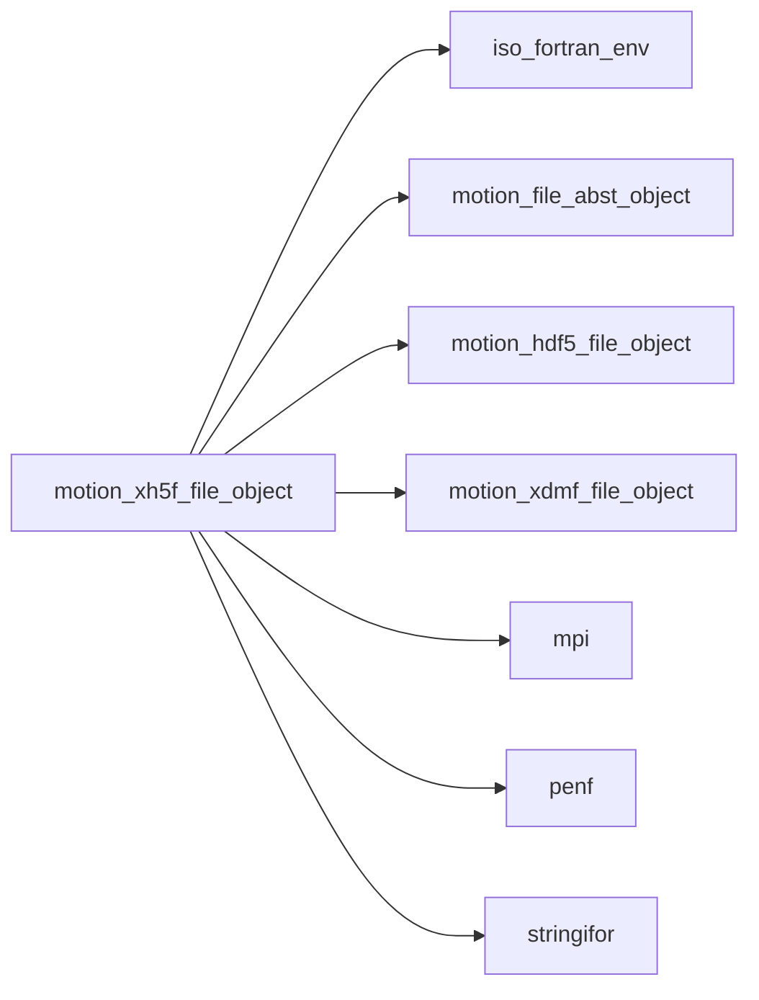

## Contents

- [xh5f_parameters_object](#xh5f-parameters-object)
- [xh5f_file_object](#xh5f-file-object)
- [xh5f_file_object](#xh5f-file-object)
- [close_file](#close-file)
- [open_file](#open-file)
- [close_block](#close-block)
- [close_grid](#close-grid)
- [open_grid](#open-grid)
- [open_block](#open-block)
- [save_block_field_xdmf_tags](#save-block-field-xdmf-tags)
- [load_block_field_R8P_0D](#load-block-field-r8p-0d)
- [load_block_field_R8P_3D](#load-block-field-r8p-3d)
- [load_block_field_R8P_4D](#load-block-field-r8p-4d)
- [save_block_field_R8P_0D](#save-block-field-r8p-0d)
- [save_block_field_R8P_3D](#save-block-field-r8p-3d)
- [save_block_field_R8P_4D](#save-block-field-r8p-4d)
- [load_block_field_R4P_0D](#load-block-field-r4p-0d)
- [load_block_field_R4P_3D](#load-block-field-r4p-3d)
- [load_block_field_R4P_4D](#load-block-field-r4p-4d)
- [save_block_field_R4P_0D](#save-block-field-r4p-0d)
- [save_block_field_R4P_3D](#save-block-field-r4p-3d)
- [save_block_field_R4P_4D](#save-block-field-r4p-4d)
- [load_block_field_I8P_0D](#load-block-field-i8p-0d)
- [load_block_field_I8P_3D](#load-block-field-i8p-3d)
- [load_block_field_I8P_4D](#load-block-field-i8p-4d)
- [save_block_field_I8P_0D](#save-block-field-i8p-0d)
- [save_block_field_I8P_3D](#save-block-field-i8p-3d)
- [save_block_field_I8P_4D](#save-block-field-i8p-4d)
- [load_block_field_I4P_0D](#load-block-field-i4p-0d)
- [load_block_field_I4P_3D](#load-block-field-i4p-3d)
- [load_block_field_I4P_4D](#load-block-field-i4p-4d)
- [save_block_field_I4P_0D](#save-block-field-i4p-0d)
- [save_block_field_I4P_3D](#save-block-field-i4p-3d)
- [save_block_field_I4P_4D](#save-block-field-i4p-4d)
- [load_block_field_I2P_0D](#load-block-field-i2p-0d)
- [load_block_field_I2P_3D](#load-block-field-i2p-3d)
- [load_block_field_I2P_4D](#load-block-field-i2p-4d)
- [save_block_field_I2P_0D](#save-block-field-i2p-0d)
- [save_block_field_I2P_3D](#save-block-field-i2p-3d)
- [save_block_field_I2P_4D](#save-block-field-i2p-4d)
- [load_block_field_I1P_0D](#load-block-field-i1p-0d)
- [load_block_field_I1P_3D](#load-block-field-i1p-3d)
- [load_block_field_I1P_4D](#load-block-field-i1p-4d)
- [save_block_field_I1P_0D](#save-block-field-i1p-0d)
- [save_block_field_I1P_3D](#save-block-field-i1p-3d)
- [save_block_field_I1P_4D](#save-block-field-i1p-4d)
- [new](#new)

## Variables

| Name | Type | Attributes | Description |
|------|------|------------|-------------|
| `XH5F_PARAMETERS` | type([xh5f_parameters_object](/api/src/third_party/MOTIOn/src/lib/motion_xh5f_file_object#xh5f-parameters-object)) | parameter | List of XH5F named constants. |

## Derived Types

### xh5f_parameters_object

Global named constants (paramters) class (container) of XH5F syntax.

#### Components

| Name | Type | Attributes | Description |
|------|------|------------|-------------|
| `XH5F_BLOCK_CARTESIAN` | character(len=9) |  |  |
| `XH5F_BLOCK_CARTESIAN_UNIFORM` | character(len=17) |  |  |
| `XH5F_BLOCK_CURVILINEAR` | character(len=11) |  |  |

### xh5f_file_object

XDMF/HDF5 file object class.

**Inheritance**

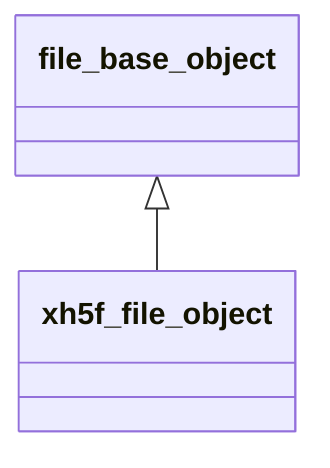

**Extends**: [`file_base_object`](/api/src/third_party/MOTIOn/src/lib/motion_file_abst_object#file-base-object)

#### Components

| Name | Type | Attributes | Description |
|------|------|------------|-------------|
| `filename` | type([string](/api/src/third_party/StringiFor/src/lib/stringifor_string_t#string)) |  | File name. |
| `procs_number` | integer(kind=[I4P](/api/src/third_party/PENF/src/lib/penf_global_parameters_variables)) |  | Number of MPI processes. |
| `myrank` | integer(kind=[I4P](/api/src/third_party/PENF/src/lib/penf_global_parameters_variables)) |  | MPI ID process. |
| `error` | integer(kind=[I4P](/api/src/third_party/PENF/src/lib/penf_global_parameters_variables)) |  | IO Error status. |
| `hdf5` | type([hdf5_file_object](/api/src/third_party/MOTIOn/src/lib/motion_hdf5_file_object#hdf5-file-object)) |  | HDF5 file handler. |
| `xdmf` | type([xdmf_file_object](/api/src/third_party/MOTIOn/src/lib/motion_xdmf_file_object#xdmf-file-object)) |  | XDMF file handler. |
| `with_xdmf` | logical |  | Sentinel to exclude XDMF file. |

#### Type-Bound Procedures

| Name | Attributes | Description |
|------|------------|-------------|
| `initialize` | pass(self) | Initialize file class. |
| `close_file` | pass(self) | Close XH5F file. |
| `open_file` | pass(self) | Open XH5F file. |
| `close_block` | pass(self) | Close block. |
| `close_grid` | pass(self) | Close grid. |
| `open_grid` | pass(self) | Open grid. |
| `open_block` | pass(self) | Open block. |
| `save_block_field_xdmf_tags` | pass(self) | Save field in block, only XDMF tags. |
| `load_block_field` |  | Load field in block. |
| `save_block_field` |  | Save field in block. |
| `load_block_field_R8P_0D` | pass(self) | Load field in block, kind R8P, rank 0D. |
| `load_block_field_R8P_3D` | pass(self) | Load field in block, kind R8P, rank 3D. |
| `load_block_field_R8P_4D` | pass(self) | Load field in block, kind R8P, rank 4D. |
| `load_block_field_R4P_0D` | pass(self) | Load field in block, kind R4P, rank 0D. |
| `load_block_field_R4P_3D` | pass(self) | Load field in block, kind R4P, rank 3D. |
| `load_block_field_R4P_4D` | pass(self) | Load field in block, kind R4P, rank 4D. |
| `load_block_field_I8P_0D` | pass(self) | Load field in block, kind I8P, rank 0D. |
| `load_block_field_I8P_3D` | pass(self) | Load field in block, kind I8P, rank 3D. |
| `load_block_field_I8P_4D` | pass(self) | Load field in block, kind I8P, rank 4D. |
| `load_block_field_I4P_0D` | pass(self) | Load field in block, kind I4P, rank 0D. |
| `load_block_field_I4P_3D` | pass(self) | Load field in block, kind I4P, rank 3D. |
| `load_block_field_I4P_4D` | pass(self) | Load field in block, kind I4P, rank 4D. |
| `load_block_field_I2P_0D` | pass(self) | Load field in block, kind I2P, rank 0D. |
| `load_block_field_I2P_3D` | pass(self) | Load field in block, kind I2P, rank 3D. |
| `load_block_field_I2P_4D` | pass(self) | Load field in block, kind I2P, rank 4D. |
| `load_block_field_I1P_0D` | pass(self) | Load field in block, kind I1P, rank 0D. |
| `load_block_field_I1P_3D` | pass(self) | Load field in block, kind I1P, rank 3D. |
| `load_block_field_I1P_4D` | pass(self) | Load field in block, kind I1P, rank 4D. |
| `save_block_field_R8P_0D` | pass(self) | Save field in block, kind R8P, rank 0D. |
| `save_block_field_R8P_3D` | pass(self) | Save field in block, kind R8P, rank 3D. |
| `save_block_field_R8P_4D` | pass(self) | Save field in block, kind R8P, rank 4D. |
| `save_block_field_R4P_0D` | pass(self) | Save field in block, kind R4P, rank 0D. |
| `save_block_field_R4P_3D` | pass(self) | Save field in block, kind R4P, rank 3D. |
| `save_block_field_R4P_4D` | pass(self) | Save field in block, kind R4P, rank 4D. |
| `save_block_field_I8P_0D` | pass(self) | Save field in block, kind I8P, rank 0D. |
| `save_block_field_I8P_3D` | pass(self) | Save field in block, kind I8P, rank 3D. |
| `save_block_field_I8P_4D` | pass(self) | Save field in block, kind I8P, rank 4D. |
| `save_block_field_I4P_0D` | pass(self) | Save field in block, kind I4P, rank 0D. |
| `save_block_field_I4P_3D` | pass(self) | Save field in block, kind I4P, rank 3D. |
| `save_block_field_I4P_4D` | pass(self) | Save field in block, kind I4P, rank 4D. |
| `save_block_field_I2P_0D` | pass(self) | Save field in block, kind I2P, rank 0D. |
| `save_block_field_I2P_3D` | pass(self) | Save field in block, kind I2P, rank 3D. |
| `save_block_field_I2P_4D` | pass(self) | Save field in block, kind I2P, rank 4D. |
| `save_block_field_I1P_0D` | pass(self) | Save field in block, kind I1P, rank 0D. |
| `save_block_field_I1P_3D` | pass(self) | Save field in block, kind I1P, rank 3D. |
| `save_block_field_I1P_4D` | pass(self) | Save field in block, kind I1P, rank 4D. |

## Interfaces

### xh5f_file_object

Overload class name with initializer function.

**Module procedures**: [`new`](/api/src/third_party/MOTIOn/src/lib/motion_hdf5_file_object#new)

## Subroutines

### close_file

Close XH5F file.

```fortran
subroutine close_file(self)
```

**Arguments**

| Name | Type | Intent | Attributes | Description |
|------|------|--------|------------|-------------|
| `self` | class([xh5f_file_object](/api/src/third_party/MOTIOn/src/lib/motion_xh5f_file_object#xh5f-file-object)) | inout |  | File handler. |

**Call graph**

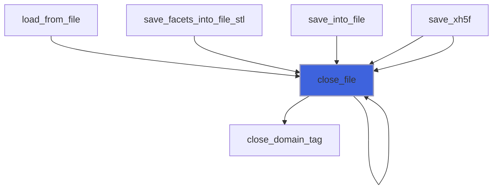

### open_file

Open XH5F file.

```fortran
subroutine open_file(self, filename_hdf5, filename_xdmf, act)
```

**Arguments**

| Name | Type | Intent | Attributes | Description |
|------|------|--------|------------|-------------|
| `self` | class([xh5f_file_object](/api/src/third_party/MOTIOn/src/lib/motion_xh5f_file_object#xh5f-file-object)) | inout |  | File handler. |
| `filename_hdf5` | character(len=*) | in |  | File name of HDF5 file. |
| `filename_xdmf` | character(len=*) | in | optional | File name of XDMF file. |
| `act` | character(len=*) | in | optional | File action ['readonly, overwrite'...]. |

**Call graph**

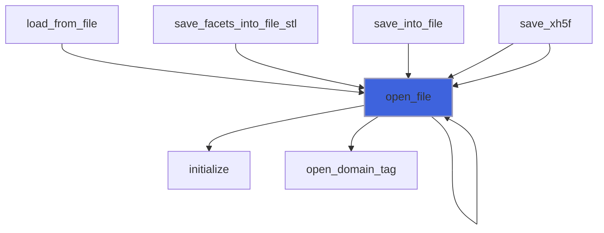

### close_block

Close block.

```fortran
subroutine close_block(self)
```

**Arguments**

| Name | Type | Intent | Attributes | Description |
|------|------|--------|------------|-------------|
| `self` | class([xh5f_file_object](/api/src/third_party/MOTIOn/src/lib/motion_xh5f_file_object#xh5f-file-object)) | inout |  | File handler. |

**Call graph**

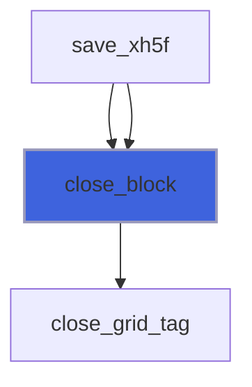

### close_grid

Close grid.

```fortran
subroutine close_grid(self, grid_type)
```

**Arguments**

| Name | Type | Intent | Attributes | Description |
|------|------|--------|------------|-------------|
| `self` | class([xh5f_file_object](/api/src/third_party/MOTIOn/src/lib/motion_xh5f_file_object#xh5f-file-object)) | inout |  | File handler. |
| `grid_type` | character(len=*) | in | optional | Grid type. |

**Call graph**

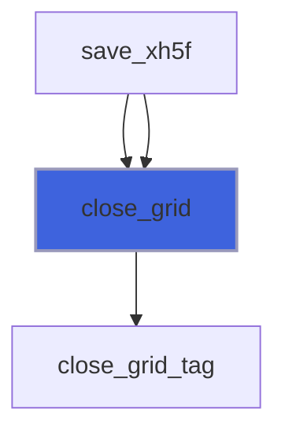

### open_grid

Open grid.

```fortran
subroutine open_grid(self, grid_name, grid_type, grid_collection_type, grid_section)
```

**Arguments**

| Name | Type | Intent | Attributes | Description |
|------|------|--------|------------|-------------|
| `self` | class([xh5f_file_object](/api/src/third_party/MOTIOn/src/lib/motion_xh5f_file_object#xh5f-file-object)) | inout |  | File handler. |
| `grid_name` | character(len=*) | in | optional | Grid name. |
| `grid_type` | character(len=*) | in | optional | Grid type. |
| `grid_collection_type` | character(len=*) | in | optional | Grid collection type. |
| `grid_section` | character(len=*) | in | optional | Grid section. |

**Call graph**

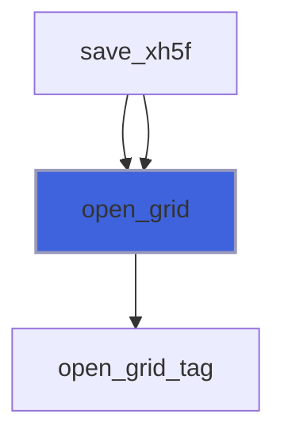

### open_block

Open block.

```fortran
subroutine open_block(self, block_type, block_name, nijk, emin, dxyz, x, y, z, nodes, time)
```

**Arguments**

| Name | Type | Intent | Attributes | Description |
|------|------|--------|------------|-------------|
| `self` | class([xh5f_file_object](/api/src/third_party/MOTIOn/src/lib/motion_xh5f_file_object#xh5f-file-object)) | inout |  | File handler. |
| `block_type` | character(len=*) | in |  | Block type. |
| `block_name` | character(len=*) | in | optional | Block name. |
| `nijk` | integer(kind=[HSIZE_T](/api/src/third_party/MOTIOn/lib/hdf5/1.14.6/gnu/14.2.0/include/H5FORTRAN_TYPES)) | in | optional | Cells number. |
| `emin` | real(kind=[R8P](/api/src/third_party/PENF/src/lib/penf_global_parameters_variables)) | in | optional | Block minimum extents. |
| `dxyz` | real(kind=[R8P](/api/src/third_party/PENF/src/lib/penf_global_parameters_variables)) | in | optional | Space steps for cartesian unform grid. |
| `x` | real(kind=[R8P](/api/src/third_party/PENF/src/lib/penf_global_parameters_variables)) | in | optional | Nodes coordinates for cartesian grid [1:nijk(ijk)+1]. |
| `y` | real(kind=[R8P](/api/src/third_party/PENF/src/lib/penf_global_parameters_variables)) | in | optional | Nodes coordinates for cartesian grid [1:nijk(ijk)+1]. |
| `z` | real(kind=[R8P](/api/src/third_party/PENF/src/lib/penf_global_parameters_variables)) | in | optional | Nodes coordinates for cartesian grid [1:nijk(ijk)+1]. |
| `nodes` | real(kind=[R8P](/api/src/third_party/PENF/src/lib/penf_global_parameters_variables)) | in | optional | Nodes coordinates for curvilinear grid [3,nijk+1]. |
| `time` | real(kind=[R8P](/api/src/third_party/PENF/src/lib/penf_global_parameters_variables)) | in | optional | Current time. |

**Call graph**

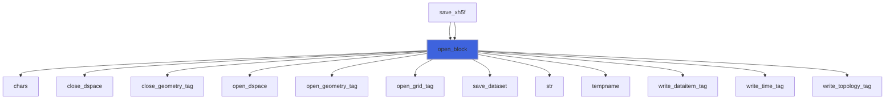

### save_block_field_xdmf_tags

Save field in block, only XDMF tags.

```fortran
subroutine save_block_field_xdmf_tags(self, number_type, number_precision, dataitem_content, xdmf_field_name, field_format, nd, field_center)
```

**Arguments**

| Name | Type | Intent | Attributes | Description |
|------|------|--------|------------|-------------|
| `self` | class([xh5f_file_object](/api/src/third_party/MOTIOn/src/lib/motion_xh5f_file_object#xh5f-file-object)) | inout |  | File handler. |
| `number_type` | character(len=*) | in |  | Number type. |
| `number_precision` | character(len=*) | in |  | Number precision. |
| `dataitem_content` | character(len=*) | in |  | Field content. |
| `xdmf_field_name` | character(len=*) | in |  | Field name in XDMF file. |
| `field_format` | character(len=*) | in |  | Field format, HDF, XML, Binary. |
| `nd` | integer(kind=[HSIZE_T](/api/src/third_party/MOTIOn/lib/hdf5/1.14.6/gnu/14.2.0/include/H5FORTRAN_TYPES)) | in | optional | Dataspace datasets dimensions. |
| `field_center` | character(len=*) | in | optional | Field center (Cell, Node, Grid...). |

**Call graph**

```mermaid
flowchart TD
  save_block_field_I1P_0D["save_block_field_I1P_0D"] --> save_block_field_xdmf_tags["save_block_field_xdmf_tags"]
  save_block_field_I1P_3D["save_block_field_I1P_3D"] --> save_block_field_xdmf_tags["save_block_field_xdmf_tags"]
  save_block_field_I1P_4D["save_block_field_I1P_4D"] --> save_block_field_xdmf_tags["save_block_field_xdmf_tags"]
  save_block_field_I2P_0D["save_block_field_I2P_0D"] --> save_block_field_xdmf_tags["save_block_field_xdmf_tags"]
  save_block_field_I2P_3D["save_block_field_I2P_3D"] --> save_block_field_xdmf_tags["save_block_field_xdmf_tags"]
  save_block_field_I2P_4D["save_block_field_I2P_4D"] --> save_block_field_xdmf_tags["save_block_field_xdmf_tags"]
  save_block_field_I4P_0D["save_block_field_I4P_0D"] --> save_block_field_xdmf_tags["save_block_field_xdmf_tags"]
  save_block_field_I4P_3D["save_block_field_I4P_3D"] --> save_block_field_xdmf_tags["save_block_field_xdmf_tags"]
  save_block_field_I4P_4D["save_block_field_I4P_4D"] --> save_block_field_xdmf_tags["save_block_field_xdmf_tags"]
  save_block_field_I8P_0D["save_block_field_I8P_0D"] --> save_block_field_xdmf_tags["save_block_field_xdmf_tags"]
  save_block_field_I8P_3D["save_block_field_I8P_3D"] --> save_block_field_xdmf_tags["save_block_field_xdmf_tags"]
  save_block_field_I8P_4D["save_block_field_I8P_4D"] --> save_block_field_xdmf_tags["save_block_field_xdmf_tags"]
  save_block_field_R4P_0D["save_block_field_R4P_0D"] --> save_block_field_xdmf_tags["save_block_field_xdmf_tags"]
  save_block_field_R4P_3D["save_block_field_R4P_3D"] --> save_block_field_xdmf_tags["save_block_field_xdmf_tags"]
  save_block_field_R4P_4D["save_block_field_R4P_4D"] --> save_block_field_xdmf_tags["save_block_field_xdmf_tags"]
  save_block_field_R8P_0D["save_block_field_R8P_0D"] --> save_block_field_xdmf_tags["save_block_field_xdmf_tags"]
  save_block_field_R8P_3D["save_block_field_R8P_3D"] --> save_block_field_xdmf_tags["save_block_field_xdmf_tags"]
  save_block_field_R8P_4D["save_block_field_R8P_4D"] --> save_block_field_xdmf_tags["save_block_field_xdmf_tags"]
  save_block_field_xdmf_tags["save_block_field_xdmf_tags"] --> close_attribute_tag["close_attribute_tag"]
  save_block_field_xdmf_tags["save_block_field_xdmf_tags"] --> open_attribute_tag["open_attribute_tag"]
  save_block_field_xdmf_tags["save_block_field_xdmf_tags"] --> str["str"]
  save_block_field_xdmf_tags["save_block_field_xdmf_tags"] --> write_dataitem_tag["write_dataitem_tag"]
  style save_block_field_xdmf_tags fill:#3e63dd,stroke:#99b,stroke-width:2px
```

### load_block_field_R8P_0D

Load field in block, kind R8P, rank 0D.

```fortran
subroutine load_block_field_R8P_0D(self, field, xdmf_field_name, hdf5_field_name)
```

**Arguments**

| Name | Type | Intent | Attributes | Description |
|------|------|--------|------------|-------------|
| `self` | class([xh5f_file_object](/api/src/third_party/MOTIOn/src/lib/motion_xh5f_file_object#xh5f-file-object)) | inout |  | File handler. |
| `field` | real(kind=[R8P](/api/src/third_party/PENF/src/lib/penf_global_parameters_variables)) | inout |  | Field. |
| `xdmf_field_name` | character(len=*) | in | optional | Field name in XDMF file. |
| `hdf5_field_name` | character(len=*) | in | optional | Field name in HDF5 file. |

**Call graph**

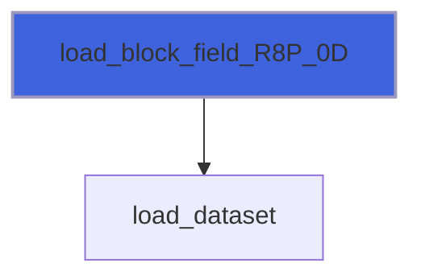

### load_block_field_R8P_3D

Load field in block, kind R8P, rank 3D.

```fortran
subroutine load_block_field_R8P_3D(self, nd, field, xdmf_field_name, hdf5_field_name)
```

**Arguments**

| Name | Type | Intent | Attributes | Description |
|------|------|--------|------------|-------------|
| `self` | class([xh5f_file_object](/api/src/third_party/MOTIOn/src/lib/motion_xh5f_file_object#xh5f-file-object)) | inout |  | File handler. |
| `nd` | integer(kind=[HSIZE_T](/api/src/third_party/MOTIOn/lib/hdf5/1.14.6/gnu/14.2.0/include/H5FORTRAN_TYPES)) | in |  | Dataspace datasets dimensions. |
| `field` | real(kind=[R8P](/api/src/third_party/PENF/src/lib/penf_global_parameters_variables)) | inout |  | Field. |
| `xdmf_field_name` | character(len=*) | in | optional | Field name in XDMF file. |
| `hdf5_field_name` | character(len=*) | in | optional | Field name in HDF5 file. |

**Call graph**


### load_block_field_R8P_4D

Load field in block, kind R8P, rank 4D.

```fortran
subroutine load_block_field_R8P_4D(self, nd, field, xdmf_field_name, hdf5_field_name)
```

**Arguments**

| Name | Type | Intent | Attributes | Description |
|------|------|--------|------------|-------------|
| `self` | class([xh5f_file_object](/api/src/third_party/MOTIOn/src/lib/motion_xh5f_file_object#xh5f-file-object)) | inout |  | File handler. |
| `nd` | integer(kind=[HSIZE_T](/api/src/third_party/MOTIOn/lib/hdf5/1.14.6/gnu/14.2.0/include/H5FORTRAN_TYPES)) | in |  | Dataspace datasets dimensions. |
| `field` | real(kind=[R8P](/api/src/third_party/PENF/src/lib/penf_global_parameters_variables)) | inout |  | Field. |
| `xdmf_field_name` | character(len=*) | in | optional | Field name in XDMF file. |
| `hdf5_field_name` | character(len=*) | in | optional | Field name in HDF5 file. |

**Call graph**


### save_block_field_R8P_0D

Save field in block, kind R8P, rank 0D.

```fortran
subroutine save_block_field_R8P_0D(self, xdmf_field_name, field, field_center, field_format, hdf5_field_name)
```

**Arguments**

| Name | Type | Intent | Attributes | Description |
|------|------|--------|------------|-------------|
| `self` | class([xh5f_file_object](/api/src/third_party/MOTIOn/src/lib/motion_xh5f_file_object#xh5f-file-object)) | inout |  | File handler. |
| `xdmf_field_name` | character(len=*) | in |  | Field name in XDMF file. |
| `field` | real(kind=[R8P](/api/src/third_party/PENF/src/lib/penf_global_parameters_variables)) | in |  | Field. |
| `field_center` | character(len=*) | in | optional | Field center (Cell, Node, Grid...). |
| `field_format` | character(len=*) | in | optional | Field format, HDF, XML, Binary. |
| `hdf5_field_name` | character(len=*) | in | optional | Field name in HDF5 file. |

**Call graph**


### save_block_field_R8P_3D

Save field in block, kind R8P, rank 3D.

```fortran
subroutine save_block_field_R8P_3D(self, xdmf_field_name, nd, field, field_center, field_format, hdf5_field_name)
```

**Arguments**

| Name | Type | Intent | Attributes | Description |
|------|------|--------|------------|-------------|
| `self` | class([xh5f_file_object](/api/src/third_party/MOTIOn/src/lib/motion_xh5f_file_object#xh5f-file-object)) | inout |  | File handler. |
| `xdmf_field_name` | character(len=*) | in |  | Field name in XDMF file. |
| `nd` | integer(kind=[HSIZE_T](/api/src/third_party/MOTIOn/lib/hdf5/1.14.6/gnu/14.2.0/include/H5FORTRAN_TYPES)) | in |  | Dataspace datasets dimensions. |
| `field` | real(kind=[R8P](/api/src/third_party/PENF/src/lib/penf_global_parameters_variables)) | in |  | Field. |
| `field_center` | character(len=*) | in | optional | Field center (Cell, Node, Grid...). |
| `field_format` | character(len=*) | in | optional | Field format, HDF, XML, Binary. |
| `hdf5_field_name` | character(len=*) | in | optional | Field name in HDF5 file. |

**Call graph**


### save_block_field_R8P_4D

Save field in block, kind R8P, rank 4D.

```fortran
subroutine save_block_field_R8P_4D(self, xdmf_field_name, nd, field, field_center, field_format, hdf5_field_name)
```

**Arguments**

| Name | Type | Intent | Attributes | Description |
|------|------|--------|------------|-------------|
| `self` | class([xh5f_file_object](/api/src/third_party/MOTIOn/src/lib/motion_xh5f_file_object#xh5f-file-object)) | inout |  | File handler. |
| `xdmf_field_name` | character(len=*) | in |  | Field name in XDMF file. |
| `nd` | integer(kind=[HSIZE_T](/api/src/third_party/MOTIOn/lib/hdf5/1.14.6/gnu/14.2.0/include/H5FORTRAN_TYPES)) | in |  | Dataspace datasets dimensions. |
| `field` | real(kind=[R8P](/api/src/third_party/PENF/src/lib/penf_global_parameters_variables)) | in |  | Field. |
| `field_center` | character(len=*) | in | optional | Field center (Cell, Node, Grid...). |
| `field_format` | character(len=*) | in | optional | Field format, HDF, XML, Binary. |
| `hdf5_field_name` | character(len=*) | in | optional | Field name in HDF5 file. |

**Call graph**

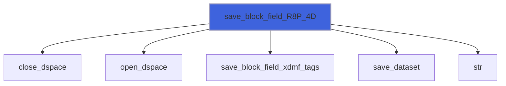

### load_block_field_R4P_0D

Load field in block, kind R4P, rank 0D.

```fortran
subroutine load_block_field_R4P_0D(self, field, xdmf_field_name, hdf5_field_name)
```

**Arguments**

| Name | Type | Intent | Attributes | Description |
|------|------|--------|------------|-------------|
| `self` | class([xh5f_file_object](/api/src/third_party/MOTIOn/src/lib/motion_xh5f_file_object#xh5f-file-object)) | inout |  | File handler. |
| `field` | real(kind=[R4P](/api/src/third_party/PENF/src/lib/penf_global_parameters_variables)) | inout |  | Field. |
| `xdmf_field_name` | character(len=*) | in | optional | Field name in XDMF file. |
| `hdf5_field_name` | character(len=*) | in | optional | Field name in HDF5 file. |

**Call graph**


### load_block_field_R4P_3D

Load field in block, kind R4P, rank 3D.

```fortran
subroutine load_block_field_R4P_3D(self, nd, field, xdmf_field_name, hdf5_field_name)
```

**Arguments**

| Name | Type | Intent | Attributes | Description |
|------|------|--------|------------|-------------|
| `self` | class([xh5f_file_object](/api/src/third_party/MOTIOn/src/lib/motion_xh5f_file_object#xh5f-file-object)) | inout |  | File handler. |
| `nd` | integer(kind=[HSIZE_T](/api/src/third_party/MOTIOn/lib/hdf5/1.14.6/gnu/14.2.0/include/H5FORTRAN_TYPES)) | in |  | Dataspace datasets dimensions. |
| `field` | real(kind=[R4P](/api/src/third_party/PENF/src/lib/penf_global_parameters_variables)) | inout |  | Field. |
| `xdmf_field_name` | character(len=*) | in | optional | Field name in XDMF file. |
| `hdf5_field_name` | character(len=*) | in | optional | Field name in HDF5 file. |

**Call graph**


### load_block_field_R4P_4D

Load field in block, kind R4P, rank 4D.

```fortran
subroutine load_block_field_R4P_4D(self, nd, field, xdmf_field_name, hdf5_field_name)
```

**Arguments**

| Name | Type | Intent | Attributes | Description |
|------|------|--------|------------|-------------|
| `self` | class([xh5f_file_object](/api/src/third_party/MOTIOn/src/lib/motion_xh5f_file_object#xh5f-file-object)) | inout |  | File handler. |
| `nd` | integer(kind=[HSIZE_T](/api/src/third_party/MOTIOn/lib/hdf5/1.14.6/gnu/14.2.0/include/H5FORTRAN_TYPES)) | in |  | Dataspace datasets dimensions. |
| `field` | real(kind=[R4P](/api/src/third_party/PENF/src/lib/penf_global_parameters_variables)) | inout |  | Field. |
| `xdmf_field_name` | character(len=*) | in | optional | Field name in XDMF file. |
| `hdf5_field_name` | character(len=*) | in | optional | Field name in HDF5 file. |

**Call graph**


### save_block_field_R4P_0D

Save field in block, kind R4P, rank 0D.

```fortran
subroutine save_block_field_R4P_0D(self, xdmf_field_name, field, field_center, field_format, hdf5_field_name)
```

**Arguments**

| Name | Type | Intent | Attributes | Description |
|------|------|--------|------------|-------------|
| `self` | class([xh5f_file_object](/api/src/third_party/MOTIOn/src/lib/motion_xh5f_file_object#xh5f-file-object)) | inout |  | File handler. |
| `xdmf_field_name` | character(len=*) | in |  | Field name in XDMF file. |
| `field` | real(kind=[R4P](/api/src/third_party/PENF/src/lib/penf_global_parameters_variables)) | in |  | Field. |
| `field_center` | character(len=*) | in | optional | Field center (Cell, Node, Grid...). |
| `field_format` | character(len=*) | in | optional | Field format, HDF, XML, Binary. |
| `hdf5_field_name` | character(len=*) | in | optional | Field name in HDF5 file. |

**Call graph**


### save_block_field_R4P_3D

Save field in block, kind R4P, rank 3D.

```fortran
subroutine save_block_field_R4P_3D(self, xdmf_field_name, nd, field, field_center, field_format, hdf5_field_name)
```

**Arguments**

| Name | Type | Intent | Attributes | Description |
|------|------|--------|------------|-------------|
| `self` | class([xh5f_file_object](/api/src/third_party/MOTIOn/src/lib/motion_xh5f_file_object#xh5f-file-object)) | inout |  | File handler. |
| `xdmf_field_name` | character(len=*) | in |  | Field name in XDMF file. |
| `nd` | integer(kind=[HSIZE_T](/api/src/third_party/MOTIOn/lib/hdf5/1.14.6/gnu/14.2.0/include/H5FORTRAN_TYPES)) | in |  | Dataspace datasets dimensions. |
| `field` | real(kind=[R4P](/api/src/third_party/PENF/src/lib/penf_global_parameters_variables)) | in |  | Field. |
| `field_center` | character(len=*) | in | optional | Field center (Cell, Node, Grid...). |
| `field_format` | character(len=*) | in | optional | Field format, HDF, XML, Binary. |
| `hdf5_field_name` | character(len=*) | in | optional | Field name in HDF5 file. |

**Call graph**


### save_block_field_R4P_4D

Save field in block, kind R4P, rank 4D.

```fortran
subroutine save_block_field_R4P_4D(self, xdmf_field_name, nd, field, field_center, field_format, hdf5_field_name)
```

**Arguments**

| Name | Type | Intent | Attributes | Description |
|------|------|--------|------------|-------------|
| `self` | class([xh5f_file_object](/api/src/third_party/MOTIOn/src/lib/motion_xh5f_file_object#xh5f-file-object)) | inout |  | File handler. |
| `xdmf_field_name` | character(len=*) | in |  | Field name in XDMF file. |
| `nd` | integer(kind=[HSIZE_T](/api/src/third_party/MOTIOn/lib/hdf5/1.14.6/gnu/14.2.0/include/H5FORTRAN_TYPES)) | in |  | Dataspace datasets dimensions. |
| `field` | real(kind=[R4P](/api/src/third_party/PENF/src/lib/penf_global_parameters_variables)) | in |  | Field. |
| `field_center` | character(len=*) | in | optional | Field center (Cell, Node, Grid...). |
| `field_format` | character(len=*) | in | optional | Field format, HDF, XML, Binary. |
| `hdf5_field_name` | character(len=*) | in | optional | Field name in HDF5 file. |

**Call graph**

```mermaid
flowchart TD
  save_block_field_R4P_4D["save_block_field_R4P_4D"] --> close_dspace["close_dspace"]
  save_block_field_R4P_4D["save_block_field_R4P_4D"] --> open_dspace["open_dspace"]
  save_block_field_R4P_4D["save_block_field_R4P_4D"] --> save_block_field_xdmf_tags["save_block_field_xdmf_tags"]
  save_block_field_R4P_4D["save_block_field_R4P_4D"] --> save_dataset["save_dataset"]
  save_block_field_R4P_4D["save_block_field_R4P_4D"] --> str["str"]
  style save_block_field_R4P_4D fill:#3e63dd,stroke:#99b,stroke-width:2px
```

### load_block_field_I8P_0D

Load field in block, kind I8P, rank 0D.

```fortran
subroutine load_block_field_I8P_0D(self, field, xdmf_field_name, hdf5_field_name)
```

**Arguments**

| Name | Type | Intent | Attributes | Description |
|------|------|--------|------------|-------------|
| `self` | class([xh5f_file_object](/api/src/third_party/MOTIOn/src/lib/motion_xh5f_file_object#xh5f-file-object)) | inout |  | File handler. |
| `field` | integer(kind=[I8P](/api/src/third_party/PENF/src/lib/penf_global_parameters_variables)) | inout |  | Field. |
| `xdmf_field_name` | character(len=*) | in | optional | Field name in XDMF file. |
| `hdf5_field_name` | character(len=*) | in | optional | Field name in HDF5 file. |

**Call graph**

```mermaid
flowchart TD
  load_block_field_I8P_0D["load_block_field_I8P_0D"] --> load_dataset["load_dataset"]
  style load_block_field_I8P_0D fill:#3e63dd,stroke:#99b,stroke-width:2px
```

### load_block_field_I8P_3D

Load field in block, kind I8P, rank 3D.

```fortran
subroutine load_block_field_I8P_3D(self, nd, field, xdmf_field_name, hdf5_field_name)
```

**Arguments**

| Name | Type | Intent | Attributes | Description |
|------|------|--------|------------|-------------|
| `self` | class([xh5f_file_object](/api/src/third_party/MOTIOn/src/lib/motion_xh5f_file_object#xh5f-file-object)) | inout |  | File handler. |
| `nd` | integer(kind=[HSIZE_T](/api/src/third_party/MOTIOn/lib/hdf5/1.14.6/gnu/14.2.0/include/H5FORTRAN_TYPES)) | in |  | Dataspace datasets dimensions. |
| `field` | integer(kind=[I8P](/api/src/third_party/PENF/src/lib/penf_global_parameters_variables)) | inout |  | Field. |
| `xdmf_field_name` | character(len=*) | in | optional | Field name in XDMF file. |
| `hdf5_field_name` | character(len=*) | in | optional | Field name in HDF5 file. |

**Call graph**

```mermaid
flowchart TD
  load_block_field_I8P_3D["load_block_field_I8P_3D"] --> load_dataset["load_dataset"]
  style load_block_field_I8P_3D fill:#3e63dd,stroke:#99b,stroke-width:2px
```

### load_block_field_I8P_4D

Load field in block, kind I8P, rank 4D.

```fortran
subroutine load_block_field_I8P_4D(self, nd, field, xdmf_field_name, hdf5_field_name)
```

**Arguments**

| Name | Type | Intent | Attributes | Description |
|------|------|--------|------------|-------------|
| `self` | class([xh5f_file_object](/api/src/third_party/MOTIOn/src/lib/motion_xh5f_file_object#xh5f-file-object)) | inout |  | File handler. |
| `nd` | integer(kind=[HSIZE_T](/api/src/third_party/MOTIOn/lib/hdf5/1.14.6/gnu/14.2.0/include/H5FORTRAN_TYPES)) | in |  | Dataspace datasets dimensions. |
| `field` | integer(kind=[I8P](/api/src/third_party/PENF/src/lib/penf_global_parameters_variables)) | inout |  | Field. |
| `xdmf_field_name` | character(len=*) | in | optional | Field name in XDMF file. |
| `hdf5_field_name` | character(len=*) | in | optional | Field name in HDF5 file. |

**Call graph**

```mermaid
flowchart TD
  load_block_field_I8P_4D["load_block_field_I8P_4D"] --> load_dataset["load_dataset"]
  style load_block_field_I8P_4D fill:#3e63dd,stroke:#99b,stroke-width:2px
```

### save_block_field_I8P_0D

Save field in block, kind I8P, rank 0D.

```fortran
subroutine save_block_field_I8P_0D(self, xdmf_field_name, field, field_center, field_format, hdf5_field_name)
```

**Arguments**

| Name | Type | Intent | Attributes | Description |
|------|------|--------|------------|-------------|
| `self` | class([xh5f_file_object](/api/src/third_party/MOTIOn/src/lib/motion_xh5f_file_object#xh5f-file-object)) | inout |  | File handler. |
| `xdmf_field_name` | character(len=*) | in |  | Field name in XDMF file. |
| `field` | integer(kind=[I8P](/api/src/third_party/PENF/src/lib/penf_global_parameters_variables)) | in |  | Field. |
| `field_center` | character(len=*) | in | optional | Field center (Cell, Node, Grid...). |
| `field_format` | character(len=*) | in | optional | Field format, HDF, XML, Binary. |
| `hdf5_field_name` | character(len=*) | in | optional | Field name in HDF5 file. |

**Call graph**

```mermaid
flowchart TD
  save_block_field_I8P_0D["save_block_field_I8P_0D"] --> close_dspace["close_dspace"]
  save_block_field_I8P_0D["save_block_field_I8P_0D"] --> open_dspace["open_dspace"]
  save_block_field_I8P_0D["save_block_field_I8P_0D"] --> save_block_field_xdmf_tags["save_block_field_xdmf_tags"]
  save_block_field_I8P_0D["save_block_field_I8P_0D"] --> save_dataset["save_dataset"]
  save_block_field_I8P_0D["save_block_field_I8P_0D"] --> str["str"]
  style save_block_field_I8P_0D fill:#3e63dd,stroke:#99b,stroke-width:2px
```

### save_block_field_I8P_3D

Save field in block, kind I8P, rank 3D.

```fortran
subroutine save_block_field_I8P_3D(self, xdmf_field_name, nd, field, field_center, field_format, hdf5_field_name)
```

**Arguments**

| Name | Type | Intent | Attributes | Description |
|------|------|--------|------------|-------------|
| `self` | class([xh5f_file_object](/api/src/third_party/MOTIOn/src/lib/motion_xh5f_file_object#xh5f-file-object)) | inout |  | File handler. |
| `xdmf_field_name` | character(len=*) | in |  | Field name in XDMF file. |
| `nd` | integer(kind=[HSIZE_T](/api/src/third_party/MOTIOn/lib/hdf5/1.14.6/gnu/14.2.0/include/H5FORTRAN_TYPES)) | in |  | Dataspace datasets dimensions. |
| `field` | integer(kind=[I8P](/api/src/third_party/PENF/src/lib/penf_global_parameters_variables)) | in |  | Field. |
| `field_center` | character(len=*) | in | optional | Field center (Cell, Node, Grid...). |
| `field_format` | character(len=*) | in | optional | Field format, HDF, XML, Binary. |
| `hdf5_field_name` | character(len=*) | in | optional | Field name in HDF5 file. |

**Call graph**

```mermaid
flowchart TD
  save_block_field_I8P_3D["save_block_field_I8P_3D"] --> close_dspace["close_dspace"]
  save_block_field_I8P_3D["save_block_field_I8P_3D"] --> open_dspace["open_dspace"]
  save_block_field_I8P_3D["save_block_field_I8P_3D"] --> save_block_field_xdmf_tags["save_block_field_xdmf_tags"]
  save_block_field_I8P_3D["save_block_field_I8P_3D"] --> save_dataset["save_dataset"]
  save_block_field_I8P_3D["save_block_field_I8P_3D"] --> str["str"]
  style save_block_field_I8P_3D fill:#3e63dd,stroke:#99b,stroke-width:2px
```

### save_block_field_I8P_4D

Save field in block, kind I8P, rank 4D.

```fortran
subroutine save_block_field_I8P_4D(self, xdmf_field_name, nd, field, field_center, field_format, hdf5_field_name)
```

**Arguments**

| Name | Type | Intent | Attributes | Description |
|------|------|--------|------------|-------------|
| `self` | class([xh5f_file_object](/api/src/third_party/MOTIOn/src/lib/motion_xh5f_file_object#xh5f-file-object)) | inout |  | File handler. |
| `xdmf_field_name` | character(len=*) | in |  | Field name in XDMF file. |
| `nd` | integer(kind=[HSIZE_T](/api/src/third_party/MOTIOn/lib/hdf5/1.14.6/gnu/14.2.0/include/H5FORTRAN_TYPES)) | in |  | Dataspace datasets dimensions. |
| `field` | integer(kind=[I8P](/api/src/third_party/PENF/src/lib/penf_global_parameters_variables)) | in |  | Field. |
| `field_center` | character(len=*) | in | optional | Field center (Cell, Node, Grid...). |
| `field_format` | character(len=*) | in | optional | Field format, HDF, XML, Binary. |
| `hdf5_field_name` | character(len=*) | in | optional | Field name in HDF5 file. |

**Call graph**

```mermaid
flowchart TD
  save_block_field_I8P_4D["save_block_field_I8P_4D"] --> close_dspace["close_dspace"]
  save_block_field_I8P_4D["save_block_field_I8P_4D"] --> open_dspace["open_dspace"]
  save_block_field_I8P_4D["save_block_field_I8P_4D"] --> save_block_field_xdmf_tags["save_block_field_xdmf_tags"]
  save_block_field_I8P_4D["save_block_field_I8P_4D"] --> save_dataset["save_dataset"]
  save_block_field_I8P_4D["save_block_field_I8P_4D"] --> str["str"]
  style save_block_field_I8P_4D fill:#3e63dd,stroke:#99b,stroke-width:2px
```

### load_block_field_I4P_0D

Load field in block, kind I4P, rank 0D.

```fortran
subroutine load_block_field_I4P_0D(self, field, xdmf_field_name, hdf5_field_name)
```

**Arguments**

| Name | Type | Intent | Attributes | Description |
|------|------|--------|------------|-------------|
| `self` | class([xh5f_file_object](/api/src/third_party/MOTIOn/src/lib/motion_xh5f_file_object#xh5f-file-object)) | inout |  | File handler. |
| `field` | integer(kind=[I4P](/api/src/third_party/PENF/src/lib/penf_global_parameters_variables)) | inout |  | Field. |
| `xdmf_field_name` | character(len=*) | in | optional | Field name in XDMF file. |
| `hdf5_field_name` | character(len=*) | in | optional | Field name in HDF5 file. |

**Call graph**

```mermaid
flowchart TD
  load_block_field_I4P_0D["load_block_field_I4P_0D"] --> load_dataset["load_dataset"]
  style load_block_field_I4P_0D fill:#3e63dd,stroke:#99b,stroke-width:2px
```

### load_block_field_I4P_3D

Load field in block, kind I4P, rank 3D.

```fortran
subroutine load_block_field_I4P_3D(self, nd, field, xdmf_field_name, hdf5_field_name)
```

**Arguments**

| Name | Type | Intent | Attributes | Description |
|------|------|--------|------------|-------------|
| `self` | class([xh5f_file_object](/api/src/third_party/MOTIOn/src/lib/motion_xh5f_file_object#xh5f-file-object)) | inout |  | File handler. |
| `nd` | integer(kind=[HSIZE_T](/api/src/third_party/MOTIOn/lib/hdf5/1.14.6/gnu/14.2.0/include/H5FORTRAN_TYPES)) | in |  | Dataspace datasets dimensions. |
| `field` | integer(kind=[I4P](/api/src/third_party/PENF/src/lib/penf_global_parameters_variables)) | inout |  | Field. |
| `xdmf_field_name` | character(len=*) | in | optional | Field name in XDMF file. |
| `hdf5_field_name` | character(len=*) | in | optional | Field name in HDF5 file. |

**Call graph**

```mermaid
flowchart TD
  load_block_field_I4P_3D["load_block_field_I4P_3D"] --> load_dataset["load_dataset"]
  style load_block_field_I4P_3D fill:#3e63dd,stroke:#99b,stroke-width:2px
```

### load_block_field_I4P_4D

Load field in block, kind I4P, rank 4D.

```fortran
subroutine load_block_field_I4P_4D(self, nd, field, xdmf_field_name, hdf5_field_name)
```

**Arguments**

| Name | Type | Intent | Attributes | Description |
|------|------|--------|------------|-------------|
| `self` | class([xh5f_file_object](/api/src/third_party/MOTIOn/src/lib/motion_xh5f_file_object#xh5f-file-object)) | inout |  | File handler. |
| `nd` | integer(kind=[HSIZE_T](/api/src/third_party/MOTIOn/lib/hdf5/1.14.6/gnu/14.2.0/include/H5FORTRAN_TYPES)) | in |  | Dataspace datasets dimensions. |
| `field` | integer(kind=[I4P](/api/src/third_party/PENF/src/lib/penf_global_parameters_variables)) | inout |  | Field. |
| `xdmf_field_name` | character(len=*) | in | optional | Field name in XDMF file. |
| `hdf5_field_name` | character(len=*) | in | optional | Field name in HDF5 file. |

**Call graph**

```mermaid
flowchart TD
  load_block_field_I4P_4D["load_block_field_I4P_4D"] --> load_dataset["load_dataset"]
  style load_block_field_I4P_4D fill:#3e63dd,stroke:#99b,stroke-width:2px
```

### save_block_field_I4P_0D

Save field in block, kind I4P, rank 0D.

```fortran
subroutine save_block_field_I4P_0D(self, xdmf_field_name, field, field_center, field_format, hdf5_field_name)
```

**Arguments**

| Name | Type | Intent | Attributes | Description |
|------|------|--------|------------|-------------|
| `self` | class([xh5f_file_object](/api/src/third_party/MOTIOn/src/lib/motion_xh5f_file_object#xh5f-file-object)) | inout |  | File handler. |
| `xdmf_field_name` | character(len=*) | in |  | Field name in XDMF file. |
| `field` | integer(kind=[I4P](/api/src/third_party/PENF/src/lib/penf_global_parameters_variables)) | in |  | Field. |
| `field_center` | character(len=*) | in | optional | Field center (Cell, Node, Grid...). |
| `field_format` | character(len=*) | in | optional | Field format, HDF, XML, Binary. |
| `hdf5_field_name` | character(len=*) | in | optional | Field name in HDF5 file. |

**Call graph**

```mermaid
flowchart TD
  save_block_field_I4P_0D["save_block_field_I4P_0D"] --> close_dspace["close_dspace"]
  save_block_field_I4P_0D["save_block_field_I4P_0D"] --> open_dspace["open_dspace"]
  save_block_field_I4P_0D["save_block_field_I4P_0D"] --> save_block_field_xdmf_tags["save_block_field_xdmf_tags"]
  save_block_field_I4P_0D["save_block_field_I4P_0D"] --> save_dataset["save_dataset"]
  save_block_field_I4P_0D["save_block_field_I4P_0D"] --> str["str"]
  style save_block_field_I4P_0D fill:#3e63dd,stroke:#99b,stroke-width:2px
```

### save_block_field_I4P_3D

Save field in block, kind I4P, rank 3D.

```fortran
subroutine save_block_field_I4P_3D(self, xdmf_field_name, nd, field, field_center, field_format, hdf5_field_name)
```

**Arguments**

| Name | Type | Intent | Attributes | Description |
|------|------|--------|------------|-------------|
| `self` | class([xh5f_file_object](/api/src/third_party/MOTIOn/src/lib/motion_xh5f_file_object#xh5f-file-object)) | inout |  | File handler. |
| `xdmf_field_name` | character(len=*) | in |  | Field name in XDMF file. |
| `nd` | integer(kind=[HSIZE_T](/api/src/third_party/MOTIOn/lib/hdf5/1.14.6/gnu/14.2.0/include/H5FORTRAN_TYPES)) | in |  | Dataspace datasets dimensions. |
| `field` | integer(kind=[I4P](/api/src/third_party/PENF/src/lib/penf_global_parameters_variables)) | in |  | Field. |
| `field_center` | character(len=*) | in | optional | Field center (Cell, Node, Grid...). |
| `field_format` | character(len=*) | in | optional | Field format, HDF, XML, Binary. |
| `hdf5_field_name` | character(len=*) | in | optional | Field name in HDF5 file. |

**Call graph**

```mermaid
flowchart TD
  save_block_field_I4P_3D["save_block_field_I4P_3D"] --> close_dspace["close_dspace"]
  save_block_field_I4P_3D["save_block_field_I4P_3D"] --> open_dspace["open_dspace"]
  save_block_field_I4P_3D["save_block_field_I4P_3D"] --> save_block_field_xdmf_tags["save_block_field_xdmf_tags"]
  save_block_field_I4P_3D["save_block_field_I4P_3D"] --> save_dataset["save_dataset"]
  save_block_field_I4P_3D["save_block_field_I4P_3D"] --> str["str"]
  style save_block_field_I4P_3D fill:#3e63dd,stroke:#99b,stroke-width:2px
```

### save_block_field_I4P_4D

Save field in block, kind I4P, rank 4D.

```fortran
subroutine save_block_field_I4P_4D(self, xdmf_field_name, nd, field, field_center, field_format, hdf5_field_name)
```

**Arguments**

| Name | Type | Intent | Attributes | Description |
|------|------|--------|------------|-------------|
| `self` | class([xh5f_file_object](/api/src/third_party/MOTIOn/src/lib/motion_xh5f_file_object#xh5f-file-object)) | inout |  | File handler. |
| `xdmf_field_name` | character(len=*) | in |  | Field name in XDMF file. |
| `nd` | integer(kind=[HSIZE_T](/api/src/third_party/MOTIOn/lib/hdf5/1.14.6/gnu/14.2.0/include/H5FORTRAN_TYPES)) | in |  | Dataspace datasets dimensions. |
| `field` | integer(kind=[I4P](/api/src/third_party/PENF/src/lib/penf_global_parameters_variables)) | in |  | Field. |
| `field_center` | character(len=*) | in | optional | Field center (Cell, Node, Grid...). |
| `field_format` | character(len=*) | in | optional | Field format, HDF, XML, Binary. |
| `hdf5_field_name` | character(len=*) | in | optional | Field name in HDF5 file. |

**Call graph**

```mermaid
flowchart TD
  save_block_field_I4P_4D["save_block_field_I4P_4D"] --> close_dspace["close_dspace"]
  save_block_field_I4P_4D["save_block_field_I4P_4D"] --> open_dspace["open_dspace"]
  save_block_field_I4P_4D["save_block_field_I4P_4D"] --> save_block_field_xdmf_tags["save_block_field_xdmf_tags"]
  save_block_field_I4P_4D["save_block_field_I4P_4D"] --> save_dataset["save_dataset"]
  save_block_field_I4P_4D["save_block_field_I4P_4D"] --> str["str"]
  style save_block_field_I4P_4D fill:#3e63dd,stroke:#99b,stroke-width:2px
```

### load_block_field_I2P_0D

Load field in block, kind I2P, rank 0D.

```fortran
subroutine load_block_field_I2P_0D(self, field, xdmf_field_name, hdf5_field_name)
```

**Arguments**

| Name | Type | Intent | Attributes | Description |
|------|------|--------|------------|-------------|
| `self` | class([xh5f_file_object](/api/src/third_party/MOTIOn/src/lib/motion_xh5f_file_object#xh5f-file-object)) | inout |  | File handler. |
| `field` | integer(kind=[I2P](/api/src/third_party/PENF/src/lib/penf_global_parameters_variables)) | inout |  | Field. |
| `xdmf_field_name` | character(len=*) | in | optional | Field name in XDMF file. |
| `hdf5_field_name` | character(len=*) | in | optional | Field name in HDF5 file. |

**Call graph**

```mermaid
flowchart TD
  load_block_field_I2P_0D["load_block_field_I2P_0D"] --> load_dataset["load_dataset"]
  style load_block_field_I2P_0D fill:#3e63dd,stroke:#99b,stroke-width:2px
```

### load_block_field_I2P_3D

Load field in block, kind I2P, rank 3D.

```fortran
subroutine load_block_field_I2P_3D(self, nd, field, xdmf_field_name, hdf5_field_name)
```

**Arguments**

| Name | Type | Intent | Attributes | Description |
|------|------|--------|------------|-------------|
| `self` | class([xh5f_file_object](/api/src/third_party/MOTIOn/src/lib/motion_xh5f_file_object#xh5f-file-object)) | inout |  | File handler. |
| `nd` | integer(kind=[HSIZE_T](/api/src/third_party/MOTIOn/lib/hdf5/1.14.6/gnu/14.2.0/include/H5FORTRAN_TYPES)) | in |  | Dataspace datasets dimensions. |
| `field` | integer(kind=[I2P](/api/src/third_party/PENF/src/lib/penf_global_parameters_variables)) | inout |  | Field. |
| `xdmf_field_name` | character(len=*) | in | optional | Field name in XDMF file. |
| `hdf5_field_name` | character(len=*) | in | optional | Field name in HDF5 file. |

**Call graph**

```mermaid
flowchart TD
  load_block_field_I2P_3D["load_block_field_I2P_3D"] --> load_dataset["load_dataset"]
  style load_block_field_I2P_3D fill:#3e63dd,stroke:#99b,stroke-width:2px
```

### load_block_field_I2P_4D

Load field in block, kind I2P, rank 4D.

```fortran
subroutine load_block_field_I2P_4D(self, nd, field, xdmf_field_name, hdf5_field_name)
```

**Arguments**

| Name | Type | Intent | Attributes | Description |
|------|------|--------|------------|-------------|
| `self` | class([xh5f_file_object](/api/src/third_party/MOTIOn/src/lib/motion_xh5f_file_object#xh5f-file-object)) | inout |  | File handler. |
| `nd` | integer(kind=[HSIZE_T](/api/src/third_party/MOTIOn/lib/hdf5/1.14.6/gnu/14.2.0/include/H5FORTRAN_TYPES)) | in |  | Dataspace datasets dimensions. |
| `field` | integer(kind=[I2P](/api/src/third_party/PENF/src/lib/penf_global_parameters_variables)) | inout |  | Field. |
| `xdmf_field_name` | character(len=*) | in | optional | Field name in XDMF file. |
| `hdf5_field_name` | character(len=*) | in | optional | Field name in HDF5 file. |

**Call graph**

```mermaid
flowchart TD
  load_block_field_I2P_4D["load_block_field_I2P_4D"] --> load_dataset["load_dataset"]
  style load_block_field_I2P_4D fill:#3e63dd,stroke:#99b,stroke-width:2px
```

### save_block_field_I2P_0D

Save field in block, kind I2P, rank 0D.

```fortran
subroutine save_block_field_I2P_0D(self, xdmf_field_name, field, field_center, field_format, hdf5_field_name)
```

**Arguments**

| Name | Type | Intent | Attributes | Description |
|------|------|--------|------------|-------------|
| `self` | class([xh5f_file_object](/api/src/third_party/MOTIOn/src/lib/motion_xh5f_file_object#xh5f-file-object)) | inout |  | File handler. |
| `xdmf_field_name` | character(len=*) | in |  | Field name in XDMF file. |
| `field` | integer(kind=[I2P](/api/src/third_party/PENF/src/lib/penf_global_parameters_variables)) | in |  | Field. |
| `field_center` | character(len=*) | in | optional | Field center (Cell, Node, Grid...). |
| `field_format` | character(len=*) | in | optional | Field format, HDF, XML, Binary. |
| `hdf5_field_name` | character(len=*) | in | optional | Field name in HDF5 file. |

**Call graph**

```mermaid
flowchart TD
  save_block_field_I2P_0D["save_block_field_I2P_0D"] --> close_dspace["close_dspace"]
  save_block_field_I2P_0D["save_block_field_I2P_0D"] --> open_dspace["open_dspace"]
  save_block_field_I2P_0D["save_block_field_I2P_0D"] --> save_block_field_xdmf_tags["save_block_field_xdmf_tags"]
  save_block_field_I2P_0D["save_block_field_I2P_0D"] --> save_dataset["save_dataset"]
  save_block_field_I2P_0D["save_block_field_I2P_0D"] --> str["str"]
  style save_block_field_I2P_0D fill:#3e63dd,stroke:#99b,stroke-width:2px
```

### save_block_field_I2P_3D

Save field in block, kind I2P, rank 3D.

```fortran
subroutine save_block_field_I2P_3D(self, xdmf_field_name, nd, field, field_center, field_format, hdf5_field_name)
```

**Arguments**

| Name | Type | Intent | Attributes | Description |
|------|------|--------|------------|-------------|
| `self` | class([xh5f_file_object](/api/src/third_party/MOTIOn/src/lib/motion_xh5f_file_object#xh5f-file-object)) | inout |  | File handler. |
| `xdmf_field_name` | character(len=*) | in |  | Field name in XDMF file. |
| `nd` | integer(kind=[HSIZE_T](/api/src/third_party/MOTIOn/lib/hdf5/1.14.6/gnu/14.2.0/include/H5FORTRAN_TYPES)) | in |  | Dataspace datasets dimensions. |
| `field` | integer(kind=[I2P](/api/src/third_party/PENF/src/lib/penf_global_parameters_variables)) | in |  | Field. |
| `field_center` | character(len=*) | in | optional | Field center (Cell, Node, Grid...). |
| `field_format` | character(len=*) | in | optional | Field format, HDF, XML, Binary. |
| `hdf5_field_name` | character(len=*) | in | optional | Field name in HDF5 file. |

**Call graph**

```mermaid
flowchart TD
  save_block_field_I2P_3D["save_block_field_I2P_3D"] --> close_dspace["close_dspace"]
  save_block_field_I2P_3D["save_block_field_I2P_3D"] --> open_dspace["open_dspace"]
  save_block_field_I2P_3D["save_block_field_I2P_3D"] --> save_block_field_xdmf_tags["save_block_field_xdmf_tags"]
  save_block_field_I2P_3D["save_block_field_I2P_3D"] --> save_dataset["save_dataset"]
  save_block_field_I2P_3D["save_block_field_I2P_3D"] --> str["str"]
  style save_block_field_I2P_3D fill:#3e63dd,stroke:#99b,stroke-width:2px
```

### save_block_field_I2P_4D

Save field in block, kind I2P, rank 4D.

```fortran
subroutine save_block_field_I2P_4D(self, xdmf_field_name, nd, field, field_center, field_format, hdf5_field_name)
```

**Arguments**

| Name | Type | Intent | Attributes | Description |
|------|------|--------|------------|-------------|
| `self` | class([xh5f_file_object](/api/src/third_party/MOTIOn/src/lib/motion_xh5f_file_object#xh5f-file-object)) | inout |  | File handler. |
| `xdmf_field_name` | character(len=*) | in |  | Field name in XDMF file. |
| `nd` | integer(kind=[HSIZE_T](/api/src/third_party/MOTIOn/lib/hdf5/1.14.6/gnu/14.2.0/include/H5FORTRAN_TYPES)) | in |  | Dataspace datasets dimensions. |
| `field` | integer(kind=[I2P](/api/src/third_party/PENF/src/lib/penf_global_parameters_variables)) | in |  | Field. |
| `field_center` | character(len=*) | in | optional | Field center (Cell, Node, Grid...). |
| `field_format` | character(len=*) | in | optional | Field format, HDF, XML, Binary. |
| `hdf5_field_name` | character(len=*) | in | optional | Field name in HDF5 file. |

**Call graph**

```mermaid
flowchart TD
  save_block_field_I2P_4D["save_block_field_I2P_4D"] --> close_dspace["close_dspace"]
  save_block_field_I2P_4D["save_block_field_I2P_4D"] --> open_dspace["open_dspace"]
  save_block_field_I2P_4D["save_block_field_I2P_4D"] --> save_block_field_xdmf_tags["save_block_field_xdmf_tags"]
  save_block_field_I2P_4D["save_block_field_I2P_4D"] --> save_dataset["save_dataset"]
  save_block_field_I2P_4D["save_block_field_I2P_4D"] --> str["str"]
  style save_block_field_I2P_4D fill:#3e63dd,stroke:#99b,stroke-width:2px
```

### load_block_field_I1P_0D

Load field in block, kind I1P, rank 0D.

```fortran
subroutine load_block_field_I1P_0D(self, field, xdmf_field_name, hdf5_field_name)
```

**Arguments**

| Name | Type | Intent | Attributes | Description |
|------|------|--------|------------|-------------|
| `self` | class([xh5f_file_object](/api/src/third_party/MOTIOn/src/lib/motion_xh5f_file_object#xh5f-file-object)) | inout |  | File handler. |
| `field` | integer(kind=[I1P](/api/src/third_party/PENF/src/lib/penf_global_parameters_variables)) | inout |  | Field. |
| `xdmf_field_name` | character(len=*) | in | optional | Field name in XDMF file. |
| `hdf5_field_name` | character(len=*) | in | optional | Field name in HDF5 file. |

**Call graph**

```mermaid
flowchart TD
  load_block_field_I1P_0D["load_block_field_I1P_0D"] --> load_dataset["load_dataset"]
  style load_block_field_I1P_0D fill:#3e63dd,stroke:#99b,stroke-width:2px
```

### load_block_field_I1P_3D

Load field in block, kind I1P, rank 3D.

```fortran
subroutine load_block_field_I1P_3D(self, nd, field, xdmf_field_name, hdf5_field_name)
```

**Arguments**

| Name | Type | Intent | Attributes | Description |
|------|------|--------|------------|-------------|
| `self` | class([xh5f_file_object](/api/src/third_party/MOTIOn/src/lib/motion_xh5f_file_object#xh5f-file-object)) | inout |  | File handler. |
| `nd` | integer(kind=[HSIZE_T](/api/src/third_party/MOTIOn/lib/hdf5/1.14.6/gnu/14.2.0/include/H5FORTRAN_TYPES)) | in |  | Dataspace datasets dimensions. |
| `field` | integer(kind=[I1P](/api/src/third_party/PENF/src/lib/penf_global_parameters_variables)) | inout |  | Field. |
| `xdmf_field_name` | character(len=*) | in | optional | Field name in XDMF file. |
| `hdf5_field_name` | character(len=*) | in | optional | Field name in HDF5 file. |

**Call graph**

```mermaid
flowchart TD
  load_block_field_I1P_3D["load_block_field_I1P_3D"] --> load_dataset["load_dataset"]
  style load_block_field_I1P_3D fill:#3e63dd,stroke:#99b,stroke-width:2px
```

### load_block_field_I1P_4D

Load field in block, kind I1P, rank 4D.

```fortran
subroutine load_block_field_I1P_4D(self, nd, field, xdmf_field_name, hdf5_field_name)
```

**Arguments**

| Name | Type | Intent | Attributes | Description |
|------|------|--------|------------|-------------|
| `self` | class([xh5f_file_object](/api/src/third_party/MOTIOn/src/lib/motion_xh5f_file_object#xh5f-file-object)) | inout |  | File handler. |
| `nd` | integer(kind=[HSIZE_T](/api/src/third_party/MOTIOn/lib/hdf5/1.14.6/gnu/14.2.0/include/H5FORTRAN_TYPES)) | in |  | Dataspace datasets dimensions. |
| `field` | integer(kind=[I1P](/api/src/third_party/PENF/src/lib/penf_global_parameters_variables)) | inout |  | Field. |
| `xdmf_field_name` | character(len=*) | in | optional | Field name in XDMF file. |
| `hdf5_field_name` | character(len=*) | in | optional | Field name in HDF5 file. |

**Call graph**

```mermaid
flowchart TD
  load_block_field_I1P_4D["load_block_field_I1P_4D"] --> load_dataset["load_dataset"]
  style load_block_field_I1P_4D fill:#3e63dd,stroke:#99b,stroke-width:2px
```

### save_block_field_I1P_0D

Save field in block, kind I1P, rank 0D.

```fortran
subroutine save_block_field_I1P_0D(self, xdmf_field_name, field, field_center, field_format, hdf5_field_name)
```

**Arguments**

| Name | Type | Intent | Attributes | Description |
|------|------|--------|------------|-------------|
| `self` | class([xh5f_file_object](/api/src/third_party/MOTIOn/src/lib/motion_xh5f_file_object#xh5f-file-object)) | inout |  | File handler. |
| `xdmf_field_name` | character(len=*) | in |  | Field name in XDMF file. |
| `field` | integer(kind=[I1P](/api/src/third_party/PENF/src/lib/penf_global_parameters_variables)) | in |  | Field. |
| `field_center` | character(len=*) | in | optional | Field center (Cell, Node, Grid...). |
| `field_format` | character(len=*) | in | optional | Field format, HDF, XML, Binary. |
| `hdf5_field_name` | character(len=*) | in | optional | Field name in HDF5 file. |

**Call graph**

```mermaid
flowchart TD
  save_block_field_I1P_0D["save_block_field_I1P_0D"] --> close_dspace["close_dspace"]
  save_block_field_I1P_0D["save_block_field_I1P_0D"] --> open_dspace["open_dspace"]
  save_block_field_I1P_0D["save_block_field_I1P_0D"] --> save_block_field_xdmf_tags["save_block_field_xdmf_tags"]
  save_block_field_I1P_0D["save_block_field_I1P_0D"] --> save_dataset["save_dataset"]
  save_block_field_I1P_0D["save_block_field_I1P_0D"] --> str["str"]
  style save_block_field_I1P_0D fill:#3e63dd,stroke:#99b,stroke-width:2px
```

### save_block_field_I1P_3D

Save field in block, kind I1P, rank 3D.

```fortran
subroutine save_block_field_I1P_3D(self, xdmf_field_name, nd, field, field_center, field_format, hdf5_field_name)
```

**Arguments**

| Name | Type | Intent | Attributes | Description |
|------|------|--------|------------|-------------|
| `self` | class([xh5f_file_object](/api/src/third_party/MOTIOn/src/lib/motion_xh5f_file_object#xh5f-file-object)) | inout |  | File handler. |
| `xdmf_field_name` | character(len=*) | in |  | Field name in XDMF file. |
| `nd` | integer(kind=[HSIZE_T](/api/src/third_party/MOTIOn/lib/hdf5/1.14.6/gnu/14.2.0/include/H5FORTRAN_TYPES)) | in |  | Dataspace datasets dimensions. |
| `field` | integer(kind=[I1P](/api/src/third_party/PENF/src/lib/penf_global_parameters_variables)) | in |  | Field. |
| `field_center` | character(len=*) | in | optional | Field center (Cell, Node, Grid...). |
| `field_format` | character(len=*) | in | optional | Field format, HDF, XML, Binary. |
| `hdf5_field_name` | character(len=*) | in | optional | Field name in HDF5 file. |

**Call graph**

```mermaid
flowchart TD
  save_block_field_I1P_3D["save_block_field_I1P_3D"] --> close_dspace["close_dspace"]
  save_block_field_I1P_3D["save_block_field_I1P_3D"] --> open_dspace["open_dspace"]
  save_block_field_I1P_3D["save_block_field_I1P_3D"] --> save_block_field_xdmf_tags["save_block_field_xdmf_tags"]
  save_block_field_I1P_3D["save_block_field_I1P_3D"] --> save_dataset["save_dataset"]
  save_block_field_I1P_3D["save_block_field_I1P_3D"] --> str["str"]
  style save_block_field_I1P_3D fill:#3e63dd,stroke:#99b,stroke-width:2px
```

### save_block_field_I1P_4D

Save field in block, kind I1P, rank 4D.

```fortran
subroutine save_block_field_I1P_4D(self, xdmf_field_name, nd, field, field_center, field_format, hdf5_field_name)
```

**Arguments**

| Name | Type | Intent | Attributes | Description |
|------|------|--------|------------|-------------|
| `self` | class([xh5f_file_object](/api/src/third_party/MOTIOn/src/lib/motion_xh5f_file_object#xh5f-file-object)) | inout |  | File handler. |
| `xdmf_field_name` | character(len=*) | in |  | Field name in XDMF file. |
| `nd` | integer(kind=[HSIZE_T](/api/src/third_party/MOTIOn/lib/hdf5/1.14.6/gnu/14.2.0/include/H5FORTRAN_TYPES)) | in |  | Dataspace datasets dimensions. |
| `field` | integer(kind=[I1P](/api/src/third_party/PENF/src/lib/penf_global_parameters_variables)) | in |  | Field. |
| `field_center` | character(len=*) | in | optional | Field center (Cell, Node, Grid...). |
| `field_format` | character(len=*) | in | optional | Field format, HDF, XML, Binary. |
| `hdf5_field_name` | character(len=*) | in | optional | Field name in HDF5 file. |

**Call graph**

```mermaid
flowchart TD
  save_block_field_I1P_4D["save_block_field_I1P_4D"] --> close_dspace["close_dspace"]
  save_block_field_I1P_4D["save_block_field_I1P_4D"] --> open_dspace["open_dspace"]
  save_block_field_I1P_4D["save_block_field_I1P_4D"] --> save_block_field_xdmf_tags["save_block_field_xdmf_tags"]
  save_block_field_I1P_4D["save_block_field_I1P_4D"] --> save_dataset["save_dataset"]
  save_block_field_I1P_4D["save_block_field_I1P_4D"] --> str["str"]
  style save_block_field_I1P_4D fill:#3e63dd,stroke:#99b,stroke-width:2px
```

## Functions

### new

Return a new initialized class instance, overload class name.

**Returns**: type([xh5f_file_object](/api/src/third_party/MOTIOn/src/lib/motion_xh5f_file_object#xh5f-file-object))

```fortran
function new(hdf5, xdmf) result(xh5f)
```

**Arguments**

| Name | Type | Intent | Attributes | Description |
|------|------|--------|------------|-------------|
| `hdf5` | type([hdf5_file_object](/api/src/third_party/MOTIOn/src/lib/motion_hdf5_file_object#hdf5-file-object)) | in | optional | HDF5 file handler. |
| `xdmf` | type([xdmf_file_object](/api/src/third_party/MOTIOn/src/lib/motion_xdmf_file_object#xdmf-file-object)) | in | optional | XDMF file handler. |
